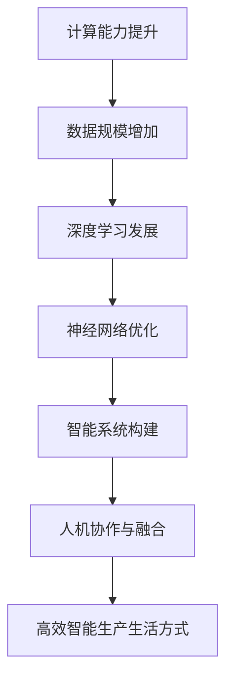

                 

# Andrej Karpathy谈AI的未来展望

> 关键词：人工智能、未来展望、技术趋势、深度学习、神经网络、智能系统

> 摘要：本文将深入探讨AI领域知名专家Andrej Karpathy对未来人工智能的展望，解析其在技术趋势、深度学习发展、智能系统构建等方面的独特见解，并分析这些趋势对AI产业和社会的潜在影响。

## 1. 背景介绍

Andrej Karpathy是一位在人工智能领域享有盛誉的研究员和作家。他在斯坦福大学获得计算机科学博士学位，并在谷歌DeepMind、OpenAI等顶尖机构担任关键职位。他的研究重点包括深度学习、自然语言处理和计算机视觉，并发表了大量的学术论文。Andrej Karpathy以其深入浅出的写作风格和独特的技术见解在业界赢得了广泛的认可。

在本文中，我们将围绕Andrej Karpathy在多个场合的演讲和访谈内容，探讨他对人工智能未来发展的看法。这些观点涵盖了技术趋势、算法进步、智能系统的构建以及AI在各个领域的应用等方面，为我们提供了对未来人工智能发展的一幅全面而深刻的图景。

## 2. 核心概念与联系

为了更好地理解Andrej Karpathy对AI未来展望的观点，我们需要先了解几个核心概念和它们之间的联系：

### 2.1 深度学习与神经网络

深度学习是人工智能的一个重要分支，它依赖于神经网络这一基本结构。神经网络由大量的神经元（节点）组成，通过层层叠加的方式处理输入数据，从而实现复杂的任务。深度学习的核心思想是通过大量数据训练神经网络，使其能够自动学习和优化模型参数。

### 2.2 计算能力与数据规模

计算能力的提升和数据规模的增加是深度学习能够取得突破性进展的关键因素。随着硬件技术的发展，计算能力不断增长，使得我们可以训练更大规模、更复杂的神经网络。同时，互联网和大数据的兴起为我们提供了海量的数据，为深度学习提供了丰富的训练资源。

### 2.3 智能系统与自动化

智能系统是人工智能发展的终极目标之一，它旨在实现高度自动化和智能化的任务执行。智能系统不仅需要具备强大的计算能力和广泛的知识储备，还需要具备良好的适应性和交互能力，以应对复杂多变的环境和任务。

### 2.4 人机协作与融合

人机协作是未来智能系统的一个重要特点。随着人工智能技术的发展，机器将能够更好地理解和执行人类意图，从而实现与人类的紧密合作。同时，人类也将通过智能系统提升自身的能力，实现人机融合，创造更加高效和智能的生产生活方式。

#### Mermaid 流程图



## 3. 核心算法原理 & 具体操作步骤

### 3.1 深度学习算法原理

深度学习算法的核心是神经网络，它通过多层节点对输入数据进行处理和转换。每一层节点都会对前一层节点的输出进行加权求和，并通过激活函数（如ReLU、Sigmoid、Tanh等）进行非线性变换。这一过程可以理解为对输入数据进行特征提取和变换，从而实现复杂的任务。

具体操作步骤如下：

1. **初始化参数**：设定神经网络的初始参数，包括权重和偏置。
2. **前向传播**：将输入数据通过网络向前传播，计算每一层的输出。
3. **反向传播**：根据输出结果与目标值之间的误差，通过反向传播算法更新网络参数。
4. **优化损失函数**：通过选择合适的优化算法（如梯度下降、Adam等）优化网络参数，减小损失函数值。

### 3.2 神经网络优化

神经网络优化是深度学习算法的核心步骤，它决定了网络的性能和训练效率。优化过程主要包括以下方面：

1. **损失函数选择**：选择合适的损失函数（如均方误差、交叉熵等）衡量网络输出与目标值之间的误差。
2. **优化算法选择**：选择合适的优化算法（如梯度下降、Adam等）更新网络参数，减小损失函数值。
3. **学习率调整**：通过调整学习率控制参数更新的步长，避免陷入局部最优和过拟合。
4. **正则化技术**：应用正则化技术（如L1、L2正则化等）防止过拟合。

### 3.3 智能系统构建

智能系统构建涉及多个领域的技术，包括计算机视觉、自然语言处理、强化学习等。以下是构建智能系统的一般步骤：

1. **需求分析**：明确智能系统需要解决的问题和目标。
2. **数据收集**：收集与问题相关的数据，进行预处理和清洗。
3. **模型设计**：设计适合问题的神经网络架构，选择合适的损失函数和优化算法。
4. **模型训练**：使用训练数据训练神经网络模型。
5. **模型评估**：使用验证数据评估模型性能，调整模型参数。
6. **模型部署**：将训练好的模型部署到实际应用场景中，进行任务执行。

## 4. 数学模型和公式 & 详细讲解 & 举例说明

### 4.1 损失函数

在深度学习中，损失函数用于衡量模型输出与目标值之间的误差。常见的损失函数包括：

#### 均方误差（MSE）

$$
MSE = \frac{1}{n} \sum_{i=1}^{n} (y_i - \hat{y}_i)^2
$$

其中，$y_i$为真实标签，$\hat{y}_i$为模型预测值，$n$为样本数量。

#### 交叉熵（Cross-Entropy）

$$
CE = -\frac{1}{n} \sum_{i=1}^{n} y_i \log(\hat{y}_i)
$$

其中，$y_i$为真实标签（0或1），$\hat{y}_i$为模型预测概率。

### 4.2 优化算法

梯度下降（Gradient Descent）是深度学习中常用的优化算法，其核心思想是沿着损失函数的梯度方向更新模型参数，以减小损失函数值。

#### 梯度下降算法

$$
\theta_{\text{new}} = \theta_{\text{old}} - \alpha \nabla_\theta J(\theta)
$$

其中，$\theta$为模型参数，$\alpha$为学习率，$J(\theta)$为损失函数。

#### Adam优化算法

Adam是一种自适应的梯度下降算法，其核心思想是结合动量和自适应学习率。

$$
m_t = \beta_1 m_{t-1} + (1 - \beta_1) [g_t]
$$

$$
v_t = \beta_2 v_{t-1} + (1 - \beta_2) [g_t]^2
$$

$$
\theta_{\text{new}} = \theta_{\text{old}} - \alpha \frac{m_t}{\sqrt{v_t} + \epsilon}
$$

其中，$m_t$为梯度的一阶矩估计，$v_t$为梯度二阶矩估计，$\beta_1$、$\beta_2$为超参数，$\epsilon$为常数。

### 4.3 举例说明

假设我们有一个简单的神经网络模型，用于预测一个二元分类问题。模型的输入层有2个神经元，隐藏层有3个神经元，输出层有1个神经元。训练数据集包含100个样本，每个样本有2个特征。

#### 损失函数

我们选择均方误差（MSE）作为损失函数。

#### 优化算法

我们选择Adam优化算法。

#### 模型参数

- 输入层到隐藏层的权重：$W_{ih} \in \mathbb{R}^{2 \times 3}$
- 隐藏层到输出层的权重：$W_{ho} \in \mathbb{R}^{3 \times 1}$
- 隐藏层偏置：$b_{h} \in \mathbb{R}^{1 \times 3}$
- 输出层偏置：$b_{o} \in \mathbb{R}^{1 \times 1}$

#### 训练过程

1. 初始化参数
2. 前向传播：计算隐藏层和输出层的输出
3. 反向传播：计算损失函数和梯度
4. 更新参数：使用Adam优化算法更新参数
5. 重复步骤2-4，直到收敛或达到预设的训练次数

## 5. 项目实战：代码实际案例和详细解释说明

### 5.1 开发环境搭建

为了演示深度学习模型训练的过程，我们使用Python和TensorFlow作为开发工具。以下是开发环境搭建的步骤：

1. 安装Python：确保Python版本为3.6及以上
2. 安装TensorFlow：使用pip安装TensorFlow
```bash
pip install tensorflow
```

### 5.2 源代码详细实现和代码解读

以下是一个简单的深度学习模型训练代码示例，用于实现一个二元分类任务。

```python
import tensorflow as tf
import numpy as np

# 设置随机种子，保证实验结果可复现
tf.random.set_seed(42)

# 参数设置
learning_rate = 0.001
batch_size = 32
epochs = 100
input_dim = 2
hidden_dim = 3
output_dim = 1

# 数据集生成
X = np.random.rand(100, input_dim)
y = np.random.randint(0, 2, (100, output_dim))

# 初始化模型参数
W_ih = tf.random.normal((input_dim, hidden_dim))
W_ho = tf.random.normal((hidden_dim, output_dim))
b_h = tf.random.normal((1, hidden_dim))
b_o = tf.random.normal((1, output_dim))

# 定义损失函数和优化器
loss_fn = tf.reduce_mean(tf.square(y - pred))
optimizer = tf.optimizers.Adam(learning_rate)

# 定义前向传播
def forward(x):
    h = tf.nn.relu(tf.matmul(x, W_ih) + b_h)
    pred = tf.matmul(h, W_ho) + b_o
    return pred

# 训练过程
for epoch in range(epochs):
    for batch in range(100 // batch_size):
        # 获取批量数据
        batch_x = X[batch * batch_size: (batch + 1) * batch_size]
        batch_y = y[batch * batch_size: (batch + 1) * batch_size]

        # 前向传播
        with tf.GradientTape() as tape:
            pred = forward(batch_x)
            loss = loss_fn(pred, batch_y)

        # 反向传播
        grads = tape.gradient(loss, [W_ih, W_ho, b_h, b_o])

        # 更新参数
        optimizer.apply_gradients(zip(grads, [W_ih, W_ho, b_h, b_o]))

        # 打印训练进度
        print(f"Epoch {epoch + 1}, Loss: {loss.numpy()}")

# 评估模型
test_loss = loss_fn(forward(X), y)
print(f"Test Loss: {test_loss.numpy()}")
```

### 5.3 代码解读与分析

以上代码实现了一个简单的深度学习模型，用于实现一个二元分类任务。以下是代码的详细解读：

1. **导入库**：导入TensorFlow和NumPy库。
2. **参数设置**：设置学习率、批量大小、训练轮数、输入维度、隐藏层维度和输出维度。
3. **数据集生成**：生成随机数据集，用于训练和评估模型。
4. **初始化模型参数**：初始化权重和偏置，使用随机正态分布。
5. **定义损失函数和优化器**：选择均方误差（MSE）作为损失函数，使用Adam优化器。
6. **定义前向传播**：定义前向传播函数，计算隐藏层和输出层的输出。
7. **训练过程**：使用梯度下降算法训练模型，打印训练进度。
8. **评估模型**：使用测试数据评估模型性能，打印测试损失。

## 6. 实际应用场景

### 6.1 医疗诊断

AI在医疗诊断领域具有广泛的应用前景。通过深度学习模型，可以实现对医学影像的自动分析，如X光片、CT扫描和MRI等。AI系统可以辅助医生进行疾病诊断，提高诊断的准确性和效率。

### 6.2 自动驾驶

自动驾驶是AI技术的另一个重要应用领域。通过深度学习模型，可以实现车辆的自主感知、路径规划和决策控制。自动驾驶技术有望在未来减少交通事故，提高交通效率。

### 6.3 金融服务

AI在金融服务领域具有广泛的应用潜力，如智能投顾、风险管理和信用评估等。通过深度学习模型，可以实现对金融市场的预测和分析，为投资者提供更有针对性的建议。

### 6.4 智能家居

智能家居是AI技术在日常生活领域的一个重要应用。通过深度学习模型，可以实现家庭设备的智能控制和自动化，提高生活便利性和舒适度。

## 7. 工具和资源推荐

### 7.1 学习资源推荐

- **书籍**：
  - 《深度学习》（Goodfellow, Bengio, Courville）
  - 《Python深度学习》（François Chollet）
- **论文**：
  - 《A Theoretical Analysis of the Causal Impact of Deep Neural Networks》（Hamy A. El-Gamez et al.）
  - 《Generative Adversarial Nets》（Ian J. Goodfellow et al.）
- **博客**：
  - Andrej Karpathy的个人博客
  - Distill
- **网站**：
  - TensorFlow官方文档
  - PyTorch官方文档

### 7.2 开发工具框架推荐

- **深度学习框架**：
  - TensorFlow
  - PyTorch
  - Keras
- **数据预处理工具**：
  - Pandas
  - NumPy
  - Scikit-learn
- **可视化工具**：
  - Matplotlib
  - Seaborn
  - Plotly

### 7.3 相关论文著作推荐

- **《Deep Learning》（Goodfellow, Bengio, Courville）**：介绍了深度学习的基础知识和最新进展，是一本深度学习领域的经典教材。
- **《Python深度学习》（François Chollet）**：通过实际案例介绍了深度学习在Python中的应用，适合初学者和实践者。
- **《AI未来简史》（Martin Ford）**：探讨了人工智能对未来社会和经济的影响，对AI的发展趋势进行了深入分析。

## 8. 总结：未来发展趋势与挑战

### 8.1 发展趋势

1. **计算能力的提升**：随着硬件技术的发展，计算能力将不断提高，为深度学习和智能系统的发展提供更好的支持。
2. **数据规模的增加**：互联网和大数据的兴起将为我们提供更多的数据，为深度学习提供更丰富的训练资源。
3. **算法的进步**：深度学习和人工智能算法将继续优化，提高模型的性能和可解释性。
4. **跨领域的融合**：人工智能将在更多领域实现突破，推动跨学科的发展，如生物医学、金融、能源等。
5. **人机协作**：人工智能将与人类紧密合作，实现人机融合，提高生产效率和创新能力。

### 8.2 挑战

1. **数据隐私和安全**：随着数据规模的增加，数据隐私和安全问题将愈发重要，需要制定相应的法律法规和解决方案。
2. **算法透明性和可解释性**：深度学习模型往往具有很高的性能，但缺乏透明性和可解释性，如何提高算法的可解释性是一个重要挑战。
3. **伦理和道德**：人工智能在医疗、自动驾驶等领域的应用将涉及伦理和道德问题，如何确保人工智能的发展符合人类的价值观是一个重要议题。
4. **人才短缺**：随着人工智能的快速发展，对相关人才的需求将大幅增加，但现有人才储备可能无法满足这一需求。

## 9. 附录：常见问题与解答

### 9.1 什么是深度学习？

深度学习是一种人工智能技术，通过多层神经网络对输入数据进行处理和转换，实现复杂的任务。

### 9.2 深度学习和机器学习的区别是什么？

深度学习是机器学习的一个子领域，它依赖于多层神经网络结构。机器学习则包括更广泛的算法和技术，如决策树、支持向量机等。

### 9.3 深度学习的主要应用领域有哪些？

深度学习的主要应用领域包括计算机视觉、自然语言处理、语音识别、推荐系统、自动驾驶等。

### 9.4 如何学习深度学习？

学习深度学习可以从以下几个方面入手：

1. **基础知识**：掌握线性代数、概率论、微积分等数学基础知识。
2. **编程技能**：学习Python和相关的深度学习框架（如TensorFlow、PyTorch等）。
3. **实践项目**：参与实际项目，积累经验。
4. **阅读论文**：阅读顶级会议和期刊的论文，了解最新的研究成果。

## 10. 扩展阅读 & 参考资料

1. **《深度学习》（Goodfellow, Bengio, Courville）**：[https://www.deeplearningbook.org/](https://www.deeplearningbook.org/)
2. **《Python深度学习》（François Chollet）**：[https://www.dmlc.ai/](https://www.dmlc.ai/)
3. **TensorFlow官方文档**：[https://www.tensorflow.org/](https://www.tensorflow.org/)
4. **PyTorch官方文档**：[https://pytorch.org/](https://pytorch.org/)
5. **Distill**：[https://distill.pub/](https://distill.pub/)

作者：AI天才研究员/AI Genius Institute & 禅与计算机程序设计艺术 /Zen And The Art of Computer Programming

