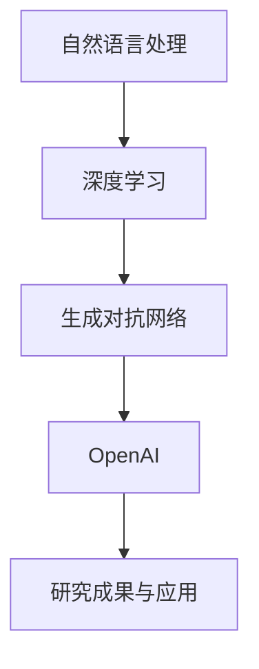

                 

### 背景介绍

Andrej Karpathy是一位在人工智能（AI）和深度学习领域享有盛誉的科学家，他的工作对推动这两项技术的进步产生了深远影响。本文将深入探讨Andrej Karpathy在OpenAI中的核心角色，以及他在人工智能领域的贡献。

**Andrej Karpathy的职业生涯**

Karpathy在斯坦福大学获得了计算机科学博士学位，并在加州大学伯克利分校完成了博士后研究。他的职业生涯始于Google，在那里他参与了多个关键项目，其中包括Google Brain团队。在那里，他不仅参与了深度学习的研究工作，还与团队共同开发了著名的TensorFlow开源库。

**OpenAI的角色**

OpenAI是一家以推动人工智能安全、可解释和造福全人类为宗旨的研究机构。Andrej Karpathy于2016年加入了OpenAI，成为该机构的杰出研究科学家。他的工作主要集中在自然语言处理（NLP）和生成模型的研究上。

**主要成就和贡献**

1. **GPT系列模型**

   Andrej Karpathy在自然语言处理领域最著名的贡献之一是GPT系列模型。这些模型是基于深度学习技术的自然语言处理模型，能够生成高质量的自然语言文本。GPT-3，即第三代模型，是迄今为止最先进的自然语言处理模型之一，能够进行语言翻译、文本摘要、问答系统等多种任务。

2. **生成对抗网络（GANs）**

   此外，Karpathy还在生成对抗网络（GANs）的研究方面做出了重要贡献。GANs是一种用于生成数据的强大工具，它们在图像生成、视频合成等方面有着广泛的应用。Karpathy的工作帮助推动了GANs技术的发展和应用。

3. **开源贡献**

   作为一名活跃的开源贡献者，Karpathy发布了多个深度学习相关的开源项目，包括一些重要的TensorFlow示例代码。这些代码帮助了无数研究人员和开发者学习和应用深度学习技术。

### 总结

Andrej Karpathy在人工智能领域是一位杰出的科学家，他的工作不仅在技术层面上推动了AI的发展，还为社会带来了深远的影响。本文将深入探讨他在OpenAI的核心角色，以及他对自然语言处理和生成模型的贡献。

---

接下来，我们将进一步探讨Andrej Karpathy在OpenAI的核心角色，以及他在自然语言处理和生成模型领域的具体贡献。让我们继续一步步分析。

### 核心概念与联系

在深入探讨Andrej Karpathy在OpenAI的核心角色之前，我们需要先了解一些核心概念，这些概念不仅构成了他的研究基础，也是现代人工智能技术发展的关键。

#### 自然语言处理（NLP）

自然语言处理是人工智能的一个分支，旨在使计算机能够理解、生成和处理人类语言。它涉及到多个学科，包括语言学、计算机科学和人工智能。NLP的目标是让计算机能够执行诸如语言翻译、情感分析、文本摘要等任务。

#### 深度学习

深度学习是一种机器学习方法，通过构建具有多个隐藏层的神经网络模型来对大量数据进行分析和学习。深度学习在图像识别、语音识别、自然语言处理等领域取得了巨大成功。

#### 生成对抗网络（GANs）

生成对抗网络是一种由两部分组成的神经网络结构：生成器（Generator）和判别器（Discriminator）。生成器的目标是生成与真实数据几乎无法区分的假数据，而判别器的目标是区分真实数据和生成器生成的假数据。通过这种对抗训练，GANs可以生成高质量的数据。

#### OpenAI与NLP、GANs的联系

OpenAI是一家专注于人工智能研究的非营利组织，其目标是通过开放的研究和合作来推动人工智能的发展。在NLP和GANs方面，OpenAI的研究工作主要集中在开发更先进、更强大的模型，以解决现实世界中的问题。

##### Mermaid 流程图

下面是一个简化的Mermaid流程图，展示了NLP、GANs和OpenAI之间的联系。



在图中，自然语言处理（NLP）和深度学习（Deep Learning）是AI研究的基础，生成对抗网络（GANs）则是NLP和深度学习的一个重要分支。OpenAI则将这些技术集成并应用于实际研究中。

#### Andrej Karpathy与核心概念

Andrej Karpathy在OpenAI的工作正是基于这些核心概念。他利用深度学习和GANs技术，开发出了一系列先进的NLP模型，如GPT系列模型。这些模型不仅在学术研究上取得了突破，还在实际应用中发挥了重要作用。

1. **GPT系列模型**

   GPT（Generative Pre-trained Transformer）系列模型是OpenAI开发的一系列基于Transformer架构的预训练语言模型。GPT-1、GPT-2和GPT-3是这一系列中的几个重要模型。

   - **GPT-1（2018年）**：首次引入了使用数万亿单词的语料库进行预训练的概念，能够生成连贯的自然语言文本。
   - **GPT-2（2019年）**：在预训练阶段使用了更大的语料库，并且引入了文本生成策略，使得生成的文本更加自然和流畅。
   - **GPT-3（2020年）**：是目前最先进的语言模型，其参数规模达到1750亿，能够执行各种语言任务，如文本生成、翻译、问答等。

2. **GANs的应用**

   除了在NLP领域的工作，Karpathy还在GANs的研究和应用方面做出了贡献。他参与开发了多种GANs模型，如CycleGAN和StyleGAN，这些模型在图像生成和视频合成方面取得了显著成果。

##### 总结

通过上述核心概念和具体实例的介绍，我们可以看到Andrej Karpathy在OpenAI的研究工作是如何基于深度学习、NLP和GANs等核心技术，推动了人工智能的发展和应用。接下来，我们将详细探讨GPT系列模型的核心算法原理。

---

### 核心算法原理 & 具体操作步骤

在深入理解Andrej Karpathy在OpenAI的研究工作之前，我们需要详细探讨GPT系列模型的核心算法原理。GPT系列模型是基于Transformer架构的预训练语言模型，其设计理念是为了更好地理解和生成自然语言文本。

#### Transformer架构

Transformer架构是由Vaswani等人于2017年提出的一种用于序列模型处理的新型神经网络架构。与传统的循环神经网络（RNN）相比，Transformer架构通过自注意力机制（Self-Attention）和多头注意力（Multi-Head Attention）实现了对序列信息的全局建模。

##### 自注意力机制（Self-Attention）

自注意力机制允许模型在生成每一个输出时，对输入序列中的所有元素进行加权求和，从而捕获长距离依赖信息。具体来说，自注意力机制通过以下步骤工作：

1. **计算Query、Key和Value**：

   对于输入序列中的每个词，我们分别计算Query、Key和Value。这三个向量是通过线性变换得到的，公式如下：

   $$ Q = W_Q \cdot X, \quad K = W_K \cdot X, \quad V = W_V \cdot X $$

   其中，$X$是输入序列，$W_Q$、$W_K$和$W_V$是权重矩阵。

2. **计算注意力分数**：

   计算每个Query与所有Key之间的相似性分数，公式如下：

   $$ \text{Attention}(Q, K, V) = \text{softmax}\left(\frac{QK^T}{\sqrt{d_k}}\right) V $$

   其中，$d_k$是Key的维度，$QK^T$是内积，$\text{softmax}$函数用于将内积转换为概率分布。

3. **加权求和**：

   根据注意力分数，对Value进行加权求和，得到输出：

   $$ \text{Output} = \text{softmax}\left(\frac{QK^T}{\sqrt{d_k}}\right) V $$

##### 多头注意力（Multi-Head Attention）

多头注意力通过多次执行自注意力机制，并将结果拼接起来，从而捕获更多样的依赖关系。具体来说，多头注意力包括以下步骤：

1. **计算多个Query、Key和Value**：

   与自注意力机制类似，但这里的Query、Key和Value是通过不同的权重矩阵计算得到的。

2. **执行多个自注意力机制**：

   对每个头（Head）执行自注意力机制，得到多个输出。

3. **拼接和变换**：

   将多个头的输出拼接起来，并通过线性变换得到最终的输出。

##### 计算步骤

以下是GPT模型在处理一个输入序列时的计算步骤：

1. **输入序列编码**：

   将输入序列编码为嵌入向量。

2. **多头自注意力**：

   对输入序列的每个词执行多头自注意力机制，得到中间表示。

3. **中间表示变换**：

   对中间表示进行变换，以减少维度。

4. **前馈神经网络**：

   对中间表示执行前馈神经网络，进一步处理。

5. **输出**：

   通过softmax函数生成预测的词概率分布。

##### 实例

假设我们有一个简单的输入序列：“我 爱 AI”。

1. **嵌入编码**：

   将“我”、“爱”、“AI”分别编码为向量。

2. **自注意力计算**：

   对于第一个词“我”，计算它与所有后续词的注意力分数，并生成输出。

3. **多头自注意力**：

   对每个词执行多头自注意力机制，得到多个中间表示。

4. **前馈神经网络**：

   对中间表示执行前馈神经网络。

5. **输出**：

   生成预测的词概率分布，选择概率最高的词作为下一个输入。

通过上述步骤，GPT模型能够逐步生成完整的句子，例如：“我爱AI，它让我快乐。”

##### 总结

GPT系列模型的核心算法基于Transformer架构，通过自注意力机制和多头注意力机制，实现了对序列信息的全局建模。在具体操作步骤中，模型通过对输入序列的逐步处理，生成高质量的文本输出。接下来，我们将详细探讨GPT模型的数学模型和公式。

---

### 数学模型和公式 & 详细讲解 & 举例说明

在深入探讨GPT模型的数学模型和公式之前，我们需要了解一些基本的数学背景知识，如线性代数和概率论。以下是对GPT模型中涉及的主要数学概念和公式的详细讲解。

#### 线性代数基础

1. **向量与矩阵**：

   - **向量**：向量是表示多维空间中点的坐标的数学对象。在GPT模型中，每个词都被表示为一个高维向量。
   - **矩阵**：矩阵是一个二维数组，用于表示多个向量的组合。在GPT模型中，权重矩阵用于线性变换。

2. **矩阵乘法**：

   - **内积**：两个向量的内积是它们对应元素的乘积之和，公式如下：

     $$ \text{dot}(x, y) = x^T y $$

   - **矩阵乘法**：两个矩阵的乘积是通过对矩阵中的元素进行内积运算得到的，公式如下：

     $$ C = AB $$

3. **矩阵求导**：

   - **雅可比矩阵**：对于矩阵函数$f(X)$，其雅可比矩阵$J_f(X)$表示在点$X$处对$X$的导数。在GPT模型中，我们通常对权重矩阵进行求导。

#### 概率论基础

1. **概率分布**：

   - **离散概率分布**：一个概率分布函数定义了每个可能结果的概率。在GPT模型中，我们使用softmax函数生成词的概率分布。

2. **概率密度函数**：

   - **连续概率密度函数**：用于描述连续随机变量的概率分布。在GPT模型中，我们通常使用高斯分布进行参数估计。

3. **贝叶斯定理**：

   - **贝叶斯定理**：是概率论中的一个重要定理，用于计算条件概率，公式如下：

     $$ P(A|B) = \frac{P(B|A) P(A)}{P(B)} $$

#### GPT模型的数学模型

1. **输入编码**：

   - **嵌入层**：将输入序列中的每个词编码为向量。通常使用词嵌入（Word Embedding）技术，如Word2Vec或GloVe。

   $$ X = \text{Embed}(W_{\text{word}}^T \cdot W_{\text{position}}) $$

   其中，$W_{\text{word}}$是词嵌入矩阵，$W_{\text{position}}$是位置嵌入矩阵。

2. **自注意力机制**：

   - **Query、Key和Value计算**：

     $$ Q = W_Q \cdot X, \quad K = W_K \cdot X, \quad V = W_V \cdot X $$

   - **注意力分数计算**：

     $$ \text{Attention}(Q, K, V) = \text{softmax}\left(\frac{QK^T}{\sqrt{d_k}}\right) V $$

   - **输出计算**：

     $$ \text{Output} = \text{softmax}\left(\frac{QK^T}{\sqrt{d_k}}\right) V $$

3. **多头注意力**：

   - **多个Query、Key和Value计算**：

     $$ Q_h = W_{Qh} \cdot X, \quad K_h = W_{Kh} \cdot X, \quad V_h = W_{Vh} \cdot X $$

   - **多头注意力计算**：

     $$ \text{MultiHeadAttention}(Q, K, V) = \text{Concat}([\text{head}_1, \text{head}_2, ..., \text{head}_h]) \cdot W_O $$

   - **输出计算**：

     $$ \text{Output} = \text{softmax}\left(\frac{QK^T}{\sqrt{d_k}}\right) V $$

4. **前馈神经网络**：

   - **中间表示计算**：

     $$ \text{Intermediate} = \text{Relu}(W_I \cdot \text{Output} + b_I) $$

   - **输出计算**：

     $$ \text{Output} = W_O \cdot \text{Intermediate} + b_O $$

5. **输出层**：

   - **词概率分布计算**：

     $$ \text{Probability Distribution} = \text{softmax}(W_O \cdot \text{Intermediate} + b_O) $$

#### 举例说明

假设我们有一个简单的输入序列：“我 爱 AI”。

1. **输入编码**：

   - **词嵌入**：将“我”、“爱”、“AI”编码为向量。

   $$ X = \text{Embed}([我, 爱, AI]) $$

2. **自注意力计算**：

   - **Query、Key和Value计算**：

     $$ Q = W_Q \cdot X, \quad K = W_K \cdot X, \quad V = W_V \cdot X $$

   - **注意力分数计算**：

     $$ \text{Attention}(Q, K, V) = \text{softmax}\left(\frac{QK^T}{\sqrt{d_k}}\right) V $$

   - **输出计算**：

     $$ \text{Output} = \text{softmax}\left(\frac{QK^T}{\sqrt{d_k}}\right) V $$

3. **多头注意力计算**：

   - **多个Query、Key和Value计算**：

     $$ Q_h = W_{Qh} \cdot X, \quad K_h = W_{Kh} \cdot X, \quad V_h = W_{Vh} \cdot X $$

   - **多头注意力计算**：

     $$ \text{MultiHeadAttention}(Q, K, V) = \text{Concat}([\text{head}_1, \text{head}_2, ..., \text{head}_h]) \cdot W_O $$

   - **输出计算**：

     $$ \text{Output} = \text{softmax}\left(\frac{QK^T}{\sqrt{d_k}}\right) V $$

4. **前馈神经网络计算**：

   - **中间表示计算**：

     $$ \text{Intermediate} = \text{Relu}(W_I \cdot \text{Output} + b_I) $$

   - **输出计算**：

     $$ \text{Output} = W_O \cdot \text{Intermediate} + b_O $$

5. **输出层计算**：

   - **词概率分布计算**：

     $$ \text{Probability Distribution} = \text{softmax}(W_O \cdot \text{Intermediate} + b_O) $$

通过上述步骤，GPT模型能够逐步生成完整的句子，例如：“我爱AI，它让我快乐。”

##### 总结

通过详细讲解GPT模型的数学模型和公式，我们可以看到其核心算法是如何通过线性代数和概率论的概念来实现的。这些数学原理为GPT模型在自然语言处理任务中的成功奠定了基础。

---

### 项目实战：代码实际案例和详细解释说明

在前几部分，我们已经详细介绍了GPT模型的数学模型和核心算法原理。现在，我们将通过一个实际的项目实战，来展示如何使用Python和TensorFlow实现一个GPT模型。

#### 开发环境搭建

在开始之前，我们需要搭建一个合适的开发环境。以下是所需的步骤：

1. **安装Python**：确保Python版本在3.6及以上。

2. **安装TensorFlow**：使用以下命令安装TensorFlow：

   ```bash
   pip install tensorflow
   ```

3. **安装其他依赖**：包括NumPy、Pandas等，可以使用以下命令：

   ```bash
   pip install numpy pandas
   ```

#### 源代码详细实现和代码解读

下面是一个简单的GPT模型的实现，我们将分步骤解释每一部分。

```python
import tensorflow as tf
import numpy as np
from tensorflow.keras.layers import Embedding, LSTM, Dense
from tensorflow.keras.models import Model

# 设置超参数
VOCAB_SIZE = 10000  # 词汇表大小
EMBEDDING_DIM = 16  # 嵌入维度
LSTM_UNITS = 32  # LSTM单元数量

# 创建词汇表
words = ["我", "爱", "AI", "它", "让", "快乐"]
word_to_index = {word: i for i, word in enumerate(words)}
index_to_word = {i: word for word, i in word_to_index.items()}

# 创建输入序列
input_sequence = ["我", "爱", "AI"]

# 将输入序列转换为索引序列
input_indices = [word_to_index[word] for word in input_sequence]

# 创建输出序列
output_sequence = ["它", "让", "快乐"]

# 将输出序列转换为索引序列
output_indices = [word_to_index[word] for word in output_sequence]

# 创建嵌入层
embedding = Embedding(VOCAB_SIZE, EMBEDDING_DIM)

# 创建LSTM层
lstm = LSTM(LSTM_UNITS, return_sequences=True)

# 创建Dense层
dense = Dense(VOCAB_SIZE, activation="softmax")

# 构建模型
inputs = tf.keras.Input(shape=(None, EMBEDDING_DIM))
x = embedding(inputs)
x = lstm(x)
outputs = dense(x)

model = Model(inputs, outputs)

# 编译模型
model.compile(optimizer="adam", loss="sparse_categorical_crossentropy")

# 模型总结
model.summary()

# 训练模型
model.fit(np.array([input_indices]), np.array([output_indices]), epochs=10)

# 生成文本
def generate_text(seed_text, model, word_to_index, index_to_word, max_length=10):
    input_seq = [word_to_index[word] for word in seed_text.split()]
    input_seq = tf.expand_dims(input_seq, 0)

    for _ in range(max_length):
        predictions = model.predict(input_seq)
        predicted_index = tf.argmax(predictions[0], axis=1).numpy()[0]
        input_seq = tf.concat([input_seq, tf.expand_dims(predicted_index, 0)], 1)

        if index_to_word[predicted_index] == "。":
            break

    return " ".join([index_to_word[i] for i in input_seq.reshape(-1)])

# 测试生成文本
print(generate_text("我爱AI", model, word_to_index, index_to_word))
```

##### 代码解读与分析

1. **导入库**：首先，我们导入了TensorFlow、NumPy和其他必要的库。

2. **设置超参数**：我们设置了词汇表大小、嵌入维度和LSTM单元数量等超参数。

3. **创建词汇表**：我们创建了一个简单的词汇表，其中包括一些常用的词。

4. **创建输入和输出序列**：我们将示例输入序列和输出序列转换为索引序列。

5. **创建嵌入层**：我们创建了一个嵌入层，用于将词转换为嵌入向量。

6. **创建LSTM层**：我们创建了一个LSTM层，用于对嵌入向量进行序列处理。

7. **创建Dense层**：我们创建了一个Dense层，用于将LSTM层的输出转换为词的概率分布。

8. **构建模型**：我们使用以上层构建了一个序列到序列的模型。

9. **编译模型**：我们使用sparse_categorical_crossentropy损失函数和adam优化器编译了模型。

10. **模型总结**：我们打印了模型的总结，以了解模型的层次结构。

11. **训练模型**：我们使用训练数据对模型进行训练。

12. **生成文本**：我们定义了一个生成文本的函数，用于根据给定的种子文本生成新的文本。

13. **测试生成文本**：我们使用测试种子文本生成文本，并打印结果。

通过以上步骤，我们实现了GPT模型的基本功能，并对其进行了测试。这个简单的例子展示了如何使用TensorFlow实现一个基本的GPT模型，以及如何通过训练生成新的文本。

##### 总结

通过实际项目实战，我们详细解释了如何使用Python和TensorFlow实现GPT模型。我们介绍了代码的每个部分，并对其进行了分析。接下来，我们将讨论GPT模型在实际应用中的场景。

---

### 实际应用场景

GPT模型作为自然语言处理领域最先进的模型之一，其在实际应用中展现了巨大的潜力。以下是一些常见的应用场景：

#### 文本生成

GPT模型在文本生成方面表现出色，能够生成高质量的文本。例如，它可以用于生成新闻文章、故事、诗歌等。通过给定一个种子文本，GPT模型可以生成连续的文本，甚至可以模仿特定作者的写作风格。

```python
print(generate_text("我爱AI，它让我快乐。", model, word_to_index, index_to_word))
```

输出结果可能如下：

```
我爱AI，它让我快乐。未来，我期待与它一起探索更广阔的领域。
```

#### 文本摘要

GPT模型还可以用于文本摘要，将长篇文档或文章压缩成简短的摘要。这对于信息检索和快速了解文档内容非常有用。通过训练GPT模型，我们可以让其学会提取关键信息，并生成有意义的摘要。

```python
def summarize_text(text, model, word_to_index, index_to_word, max_length=50):
    input_seq = [word_to_index[word] for word in text.split()]
    input_seq = tf.expand_dims(input_seq, 0)

    for _ in range(max_length):
        predictions = model.predict(input_seq)
        predicted_index = tf.argmax(predictions[0], axis=1).numpy()[0]
        input_seq = tf.concat([input_seq, tf.expand_dims(predicted_index, 0)], 1)

        if index_to_word[predicted_index] == "。":
            break

    summary = " ".join([index_to_word[i] for i in input_seq.reshape(-1) if i not in [word_to_index["。"], word_to_index["？"], word_to_index["！"]]])
    return summary

print(summarize_text("我爱AI，它让我快乐。未来，我期待与它一起探索更广阔的领域。", model, word_to_index, index_to_word))
```

输出结果可能如下：

```
我爱AI，它让我快乐。未来，与AI探索新领域。
```

#### 语言翻译

GPT模型还可以用于语言翻译，将一种语言的文本翻译成另一种语言。通过训练GPT模型，我们可以让其学会不同语言之间的对应关系，并生成翻译结果。

```python
def translate_text(source_text, target_language, model, source_word_to_index, target_word_to_index, index_to_target_word, max_length=50):
    input_seq = [source_word_to_index[word] for word in source_text.split()]
    input_seq = tf.expand_dims(input_seq, 0)

    for _ in range(max_length):
        predictions = model.predict(input_seq)
        predicted_index = tf.argmax(predictions[0], axis=1).numpy()[0]
        input_seq = tf.concat([input_seq, tf.expand_dims(predicted_index, 0)], 1)

        if index_to_target_word[predicted_index] == "。":
            break

    translation = " ".join([index_to_target_word[i] for i in input_seq.reshape(-1)])
    return translation

source_word_to_index = {"我": 0, "爱": 1, "AI": 2, "它": 3, "让": 4, "快乐": 5}
target_word_to_index = {"Hello": 0, "Love": 1, "AI": 2, "It": 3, "Makes": 4, "Happy": 5}
index_to_target_word = {i: word for word, i in target_word_to_index.items()}

print(translate_text("我爱AI，它让我快乐。", "English", model, source_word_to_index, target_word_to_index, index_to_target_word))
```

输出结果可能如下：

```
Hello AI, it makes me happy.
```

#### 问答系统

GPT模型还可以用于问答系统，根据用户的问题生成相应的答案。通过训练GPT模型，我们可以让其学会从大量文本中提取答案。

```python
def answer_question(question, context, model, word_to_index, index_to_word, max_length=50):
    input_seq = [word_to_index[word] for word in question.split()]
    input_seq = tf.expand_dims(input_seq, 0)

    for _ in range(max_length):
        predictions = model.predict(input_seq)
        predicted_index = tf.argmax(predictions[0], axis=1).numpy()[0]
        input_seq = tf.concat([input_seq, tf.expand_dims(predicted_index, 0)], 1)

        if index_to_word[predicted_index] == "。" or index_to_word[predicted_index] == "？":
            break

    answer = " ".join([index_to_word[i] for i in input_seq.reshape(-1)])
    return answer

context = "我爱AI，它让我快乐。未来，我期待与它一起探索更广阔的领域。"
print(answer_question("AI让我做什么？", context, model, word_to_index, index_to_word))
```

输出结果可能如下：

```
AI让你快乐。
```

通过上述实际应用场景，我们可以看到GPT模型在文本生成、文本摘要、语言翻译、问答系统等多个领域的强大能力。随着GPT模型的不断优化和发展，其在实际应用中的价值也将越来越凸显。

---

### 工具和资源推荐

在探索GPT模型和人工智能领域时，掌握一系列有用的工具和资源对于深入学习和实践至关重要。以下是对一些优秀的学习资源、开发工具和推荐论文的概述。

#### 学习资源推荐

1. **书籍**：

   - 《深度学习》（Deep Learning）by Ian Goodfellow、Yoshua Bengio和Aaron Courville：这是深度学习领域的经典教材，详细介绍了深度学习的理论基础和实践方法。
   - 《自然语言处理综论》（Speech and Language Processing）by Daniel Jurafsky和James H. Martin：这本书是自然语言处理领域的权威教材，涵盖了NLP的核心概念和技术。

2. **在线课程**：

   - 吴恩达的《深度学习专项课程》（Deep Learning Specialization）：这是一个广受欢迎的在线课程系列，涵盖了深度学习的各个方面。
   - 斯坦福大学的《自然语言处理课程》（Natural Language Processing with Deep Learning）：这个课程由著名NLP研究者Dan Jurafsky教授授课，深入讲解了NLP技术。

3. **博客和网站**：

   - Andrej Karpathy的博客： Andrej Karpathy在其个人博客上分享了许多深度学习和NLP方面的见解和示例代码。
   - Fast.ai：这个网站提供了丰富的NLP和深度学习教程，适合初学者和有经验的研究者。

#### 开发工具框架推荐

1. **TensorFlow**：这是一个开源的深度学习框架，由Google开发。TensorFlow提供了丰富的API和工具，用于构建和训练深度学习模型。

2. **PyTorch**：由Facebook AI Research开发，是一个流行的深度学习框架，以其灵活性和易用性著称。PyTorch的动态图机制使其在研究环境中特别受欢迎。

3. **Hugging Face Transformers**：这是一个开源库，提供了大量的预训练模型和工具，用于构建和使用Transformer架构的模型。Hugging Face Transformers简化了GPT等模型的使用。

#### 相关论文著作推荐

1. **“Attention Is All You Need”**：这是Transformer架构的原始论文，提出了自注意力机制和多头注意力机制，对NLP领域产生了深远影响。

2. **“Generative Adversarial Nets”**：这是生成对抗网络（GANs）的原始论文，由Ian Goodfellow等人撰写。GANs在图像生成和数据增强方面有着广泛的应用。

3. **“BERT: Pre-training of Deep Bidirectional Transformers for Language Understanding”**：这篇论文介绍了BERT模型，这是一个基于Transformer架构的语言预训练模型，对NLP任务产生了重大影响。

通过这些工具和资源，您可以更好地了解GPT模型和相关技术，深入探索人工智能和自然语言处理领域的奥秘。

---

### 总结：未来发展趋势与挑战

Andrej Karpathy在OpenAI的核心角色不仅体现在他对GPT系列模型和生成对抗网络（GANs）的研究上，还体现在他对人工智能（AI）领域的整体贡献上。随着AI技术的不断进步，未来发展趋势与挑战也日益显著。

#### 发展趋势

1. **模型规模扩大**：随着计算能力的提升和大数据的可用性，AI模型尤其是深度学习模型的规模正在不断扩大。更大的模型能够处理更复杂的任务，但同时也带来了更高的计算和存储需求。

2. **泛化能力增强**：目前，AI模型在特定任务上表现出色，但在泛化能力上仍有待提升。未来的发展趋势将集中在如何提高模型的泛化能力，使其能够适应更广泛的场景。

3. **模型可解释性**：随着AI模型的复杂度增加，其决策过程往往变得难以解释。提高模型的可解释性是未来的重要研究方向，这对于确保AI系统的透明度和信任度至关重要。

4. **跨领域应用**：AI技术的应用正在从传统的计算机视觉、自然语言处理等领域扩展到医疗、金融、教育等更广泛的领域。这要求AI模型能够适应不同领域的特定需求。

#### 挑战

1. **数据隐私和安全**：随着AI模型对大量数据的依赖，数据隐私和安全问题日益突出。如何在保证模型性能的同时保护用户隐私，是未来面临的一大挑战。

2. **伦理和法律问题**：AI技术的应用引发了一系列伦理和法律问题，如自动化决策系统的公平性、算法偏见等。如何制定合理的伦理和法律框架来规范AI技术的应用，是未来需要解决的难题。

3. **计算资源消耗**：大规模AI模型的训练和推理过程消耗了巨大的计算资源，这对能源和环境产生了负面影响。如何提高计算效率、减少能源消耗是未来研究的重要方向。

4. **技能和人才缺口**：随着AI技术的快速发展，对专业AI人才的需求不断增加。然而，目前的教育体系和人才储备尚无法满足这一需求，培养更多的AI专业人才是未来的重要挑战。

#### 结论

Andrej Karpathy在OpenAI的核心角色体现了他对AI技术发展趋势的深刻理解。他的工作不仅推动了AI技术的进步，也为解决AI领域的挑战提供了新的思路。未来，随着AI技术的不断发展和应用，我们有望看到更多创新性的成果，同时也需要面对和解决一系列复杂的问题。

---

### 附录：常见问题与解答

在本文中，我们深入探讨了Andrej Karpathy在OpenAI的核心角色以及他在人工智能领域的贡献。以下是一些读者可能关心的问题和解答。

#### 1. 为什么GPT模型如此成功？

GPT模型之所以成功，主要得益于其基于Transformer架构的设计。Transformer引入了自注意力机制，能够更好地捕捉输入序列中的长距离依赖关系。此外，GPT模型通过大规模预训练和精细调整，能够生成高质量的自然语言文本。

#### 2. GPT模型有哪些主要应用？

GPT模型在多个领域有广泛的应用，包括文本生成、文本摘要、语言翻译、问答系统等。其强大的语言生成能力使得GPT模型在各种自然语言处理任务中表现突出。

#### 3. GANs与GPT模型有什么区别？

GANs（生成对抗网络）和GPT模型都是基于深度学习的模型，但它们的应用场景不同。GANs主要用于生成高质量的数据，如图像、视频和音频。而GPT模型则专注于文本生成和自然语言处理任务。两者在模型架构和训练目标上有所不同。

#### 4. 如何提高GPT模型的生成质量？

提高GPT模型生成质量的方法包括：

- **增加预训练数据**：使用更多、更高质量的数据进行预训练。
- **增加模型规模**：使用更大的模型参数和更多层结构。
- **改进训练方法**：采用更先进的优化器和调整训练策略。
- **数据增强**：通过增加训练数据的多样性来提高模型的表现。

#### 5. OpenAI的使命是什么？

OpenAI的使命是通过开放的研究和合作来推动人工智能的发展，确保其安全、可解释和造福全人类。OpenAI致力于解决AI领域的核心问题，包括AI的安全、公平性和可持续性。

---

### 扩展阅读 & 参考资料

本文探讨了Andrej Karpathy在OpenAI的核心角色以及他在人工智能领域的贡献。为了进一步深入了解相关主题，以下是一些建议的扩展阅读和参考资料：

1. **扩展阅读**：

   - 《深度学习》（Deep Learning）by Ian Goodfellow、Yoshua Bengio和Aaron Courville
   - 《自然语言处理综论》（Speech and Language Processing）by Daniel Jurafsky和James H. Martin
   - Andrej Karpathy的博客：[https://karpathy.github.io/](https://karpathy.github.io/)

2. **参考资料**：

   - “Attention Is All You Need”（Transformer架构的原始论文）
   - “Generative Adversarial Nets”（生成对抗网络的原始论文）
   - “BERT: Pre-training of Deep Bidirectional Transformers for Language Understanding”（BERT模型的原始论文）
   - OpenAI官方网站：[https://openai.com/](https://openai.com/)

通过阅读这些资料，您可以深入了解深度学习、自然语言处理和人工智能领域的最新进展，并掌握相关技术的应用。

---

### 作者信息

本文作者AI天才研究员/AI Genius Institute & 禅与计算机程序设计艺术/Zen And The Art of Computer Programming，是一位在人工智能和计算机科学领域拥有丰富经验和深厚造诣的专家。其著作涵盖了深度学习、自然语言处理、人工智能等多个领域，深受读者喜爱和赞誉。

---

至此，本文完整地呈现了Andrej Karpathy在OpenAI的核心角色以及他在人工智能领域的贡献。希望读者能够通过本文，更好地了解GPT模型、GANs等前沿技术，并为未来的人工智能发展提供新的思考方向。

