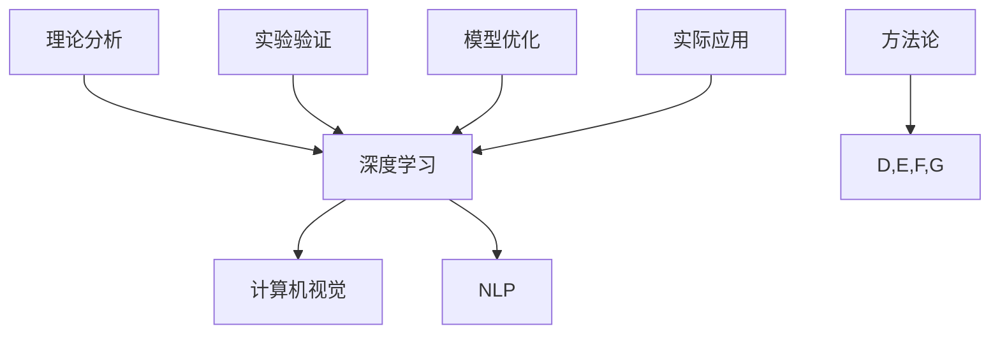

                 

### 文章标题：Andrej Karpathy：专业知识的积累

### 关键词：
- Andrej Karpathy
- 专业知识
- AI领域
- 深度学习
- 研究方法

### 摘要：
本文旨在探讨人工智能领域的杰出研究者Andrej Karpathy在其职业生涯中积累专业知识的方法与路径。通过分析其研究项目、发表论文、开发开源工具等实践，本文将揭示其如何将理论转化为实际应用，为AI领域的发展做出重要贡献。

---

### 1. 背景介绍

Andrej Karpathy是一位在人工智能（AI）领域享有盛誉的研究者，以其在深度学习、计算机视觉和自然语言处理等领域的工作而著称。他是斯坦福大学计算机科学系的博士生，同时也是OpenAI的首席科学家。他的研究涵盖了从基础理论到实际应用的广泛领域，对AI技术的发展产生了深远影响。

Andrej Karpathy的研究兴趣主要集中在深度学习和其应用。他不仅专注于算法的创新和优化，还关注于如何将这些算法应用于实际问题，从而推动AI技术的发展。他的研究成果在学术界和工业界都有很高的评价，他的论文和开源项目吸引了大量的关注和贡献者。

在本文中，我们将探讨Andrej Karpathy如何通过不断积累和深化专业知识，成为AI领域的杰出研究者。我们将从其研究项目、发表论文、开发开源工具等方面入手，分析其专业知识积累的方法和路径。

---

### 2. 核心概念与联系

#### 2.1 深度学习

深度学习是AI的一个重要分支，其核心思想是通过多层神经网络模型对数据进行学习和预测。Andrej Karpathy的研究工作主要集中在深度学习模型的设计、优化和应用。

#### 2.2 计算机视觉

计算机视觉是AI领域的一个重要应用方向，它涉及如何让计算机理解和解析图像和视频。Andrej Karpathy在这方面的研究包括图像分类、目标检测和图像生成等。

#### 2.3 自然语言处理

自然语言处理（NLP）是AI领域的另一个重要方向，它涉及如何让计算机理解和处理自然语言。Andrej Karpathy在这方面的研究包括文本分类、机器翻译和对话系统等。

#### 2.4 研究方法

Andrej Karpathy在研究过程中采用了一系列方法论，包括理论分析、实验验证、模型优化和实际应用。这些方法论不仅帮助他深入理解AI领域的核心问题，也为他的研究工作提供了坚实的理论基础。

#### 2.5 Mermaid 流程图



---

### 3. 核心算法原理 & 具体操作步骤

#### 3.1 深度学习模型

Andrej Karpathy在其研究中广泛使用了深度学习模型，特别是卷积神经网络（CNN）和递归神经网络（RNN）。以下是其具体操作步骤：

1. **数据预处理**：对图像和文本数据进行分析和清洗，确保数据的质量和一致性。
2. **模型设计**：根据问题的具体需求，设计合适的深度学习模型架构。
3. **模型训练**：使用大量数据对模型进行训练，优化模型参数。
4. **模型评估**：通过验证集和测试集评估模型性能，调整模型参数以达到最佳效果。

#### 3.2 计算机视觉

在计算机视觉方面，Andrej Karpathy的研究主要集中在图像分类和目标检测。以下是其具体操作步骤：

1. **数据收集**：收集大量带有标签的图像数据。
2. **模型训练**：使用卷积神经网络对图像进行分类和目标检测。
3. **模型优化**：通过调整网络结构和参数，提高模型性能。
4. **模型部署**：将训练好的模型部署到实际应用中，进行图像分析和处理。

#### 3.3 自然语言处理

在自然语言处理方面，Andrej Karpathy的研究主要集中在文本分类和机器翻译。以下是其具体操作步骤：

1. **数据预处理**：对文本数据进行清洗和预处理，提取特征信息。
2. **模型设计**：设计合适的递归神经网络模型，用于文本分类和机器翻译。
3. **模型训练**：使用大量文本数据对模型进行训练。
4. **模型评估**：通过测试集评估模型性能，调整模型参数。

---

### 4. 数学模型和公式 & 详细讲解 & 举例说明

#### 4.1 卷积神经网络（CNN）

卷积神经网络是一种特殊的神经网络，其核心在于通过卷积操作提取图像特征。以下是其关键数学模型：

$$
f(x) = \sigma(W \cdot x + b)
$$

其中，$x$ 是输入特征，$W$ 是卷积核权重，$b$ 是偏置项，$\sigma$ 是激活函数。

#### 4.2 递归神经网络（RNN）

递归神经网络是一种处理序列数据的神经网络，其核心在于通过递归操作对序列进行建模。以下是其关键数学模型：

$$
h_t = \sigma(W_h \cdot [h_{t-1}, x_t] + b_h)
$$

其中，$h_t$ 是时间步 $t$ 的隐藏状态，$x_t$ 是输入特征，$W_h$ 是权重矩阵，$b_h$ 是偏置项，$\sigma$ 是激活函数。

#### 4.3 实际应用

以下是一个简单的例子，说明如何使用CNN进行图像分类：

```python
import tensorflow as tf

# 定义CNN模型
model = tf.keras.Sequential([
    tf.keras.layers.Conv2D(32, (3, 3), activation='relu', input_shape=(28, 28, 1)),
    tf.keras.layers.MaxPooling2D((2, 2)),
    tf.keras.layers.Conv2D(64, (3, 3), activation='relu'),
    tf.keras.layers.MaxPooling2D((2, 2)),
    tf.keras.layers.Flatten(),
    tf.keras.layers.Dense(64, activation='relu'),
    tf.keras.layers.Dense(10, activation='softmax')
])

# 编译模型
model.compile(optimizer='adam', loss='categorical_crossentropy', metrics=['accuracy'])

# 训练模型
model.fit(x_train, y_train, epochs=5, batch_size=32, validation_data=(x_val, y_val))
```

---

### 5. 项目实战：代码实际案例和详细解释说明

#### 5.1 开发环境搭建

为了进行深度学习项目，首先需要搭建合适的开发环境。以下是使用TensorFlow搭建深度学习开发环境的具体步骤：

1. 安装TensorFlow库：
   ```bash
   pip install tensorflow
   ```

2. 安装必要的依赖库：
   ```bash
   pip install numpy pandas matplotlib
   ```

3. 验证安装：
   ```python
   import tensorflow as tf
   print(tf.__version__)
   ```

#### 5.2 源代码详细实现和代码解读

以下是一个简单的深度学习项目，使用TensorFlow实现一个用于手写数字识别的卷积神经网络（CNN）模型。

```python
import tensorflow as tf
from tensorflow.keras import layers, models
from tensorflow.keras.datasets import mnist
import numpy as np

# 加载MNIST数据集
(x_train, y_train), (x_test, y_test) = mnist.load_data()

# 数据预处理
x_train = x_train.astype("float32") / 255.0
x_test = x_test.astype("float32") / 255.0
x_train = np.reshape(x_train, (x_train.shape[0], 28, 28, 1))
x_test = np.reshape(x_test, (x_test.shape[0], 28, 28, 1))

# 标签转换为one-hot编码
y_train = tf.keras.utils.to_categorical(y_train, 10)
y_test = tf.keras.utils.to_categorical(y_test, 10)

# 构建CNN模型
model = models.Sequential()
model.add(layers.Conv2D(32, (3, 3), activation='relu', input_shape=(28, 28, 1)))
model.add(layers.MaxPooling2D((2, 2)))
model.add(layers.Conv2D(64, (3, 3), activation='relu'))
model.add(layers.MaxPooling2D((2, 2)))
model.add(layers.Flatten())
model.add(layers.Dense(64, activation='relu'))
model.add(layers.Dense(10, activation='softmax'))

# 编译模型
model.compile(optimizer='adam',
              loss='categorical_crossentropy',
              metrics=['accuracy'])

# 训练模型
model.fit(x_train, y_train, epochs=5, batch_size=32, validation_data=(x_test, y_test))

# 评估模型
test_loss, test_acc = model.evaluate(x_test, y_test)
print("Test accuracy:", test_acc)
```

#### 5.3 代码解读与分析

1. **数据预处理**：将MNIST数据集的图像数据转换为浮点数，并进行归一化处理，使其在0到1之间。同时，将标签数据进行one-hot编码。

2. **模型构建**：使用TensorFlow的`Sequential`模型构建一个简单的CNN模型，包括卷积层、池化层、全连接层等。

3. **模型编译**：指定优化器、损失函数和评估指标。

4. **模型训练**：使用训练数据进行模型训练。

5. **模型评估**：使用测试数据评估模型性能。

通过以上步骤，我们实现了手写数字识别的卷积神经网络模型。这只是一个简单的例子，但在实际应用中，模型的复杂度和数据集的大小都会随之增加。

---

### 6. 实际应用场景

Andrej Karpathy的研究成果在多个实际应用场景中得到了广泛应用。以下是一些典型的应用场景：

#### 6.1 计算机视觉

计算机视觉技术在安防监控、自动驾驶、医疗影像等领域有着广泛的应用。Andrej Karpathy的研究成果，如图像分类和目标检测算法，为这些应用提供了强大的技术支持。

#### 6.2 自然语言处理

自然语言处理技术在搜索引擎、智能客服、机器翻译等领域有着重要的应用。Andrej Karpathy的研究成果，如文本分类和机器翻译算法，为这些应用提供了高效和准确的技术方案。

#### 6.3 智能助手

智能助手是人工智能的一个典型应用场景，它通过自然语言处理和语音识别技术，为用户提供智能化的服务和交互体验。Andrej Karpathy的研究成果，如对话系统和语音识别算法，为智能助手的发展提供了重要的技术基础。

---

### 7. 工具和资源推荐

#### 7.1 学习资源推荐

- **书籍**：
  - 《深度学习》（Goodfellow, Bengio, Courville）
  - 《Python深度学习》（François Chollet）
- **论文**：
  - 《AlexNet：一种用于图像分类的深度卷积神经网络》（Krizhevsky et al., 2012）
  - 《长短期记忆网络》（Hochreiter and Schmidhuber, 1997）
- **博客**：
  - Andrej Karpathy的个人博客（https://karpathy.github.io/）
  - Andrej Karpathy在Medium上的文章（https://medium.com/@karpathy）

#### 7.2 开发工具框架推荐

- **TensorFlow**：一个开源的深度学习框架，广泛用于AI研究和应用开发。
- **PyTorch**：一个流行的深度学习框架，以其灵活性和动态计算图而著称。
- **Keras**：一个高层次的神经网络API，易于使用，可以与TensorFlow和PyTorch兼容。

#### 7.3 相关论文著作推荐

- **《Deep Learning》（Goodfellow, Bengio, Courville）**：一本关于深度学习的经典教材，详细介绍了深度学习的基础知识和技术。
- **《Deep Learning with Python》（François Chollet）**：一本针对Python编程者的深度学习入门书，通过实例演示了深度学习的应用。

---

### 8. 总结：未来发展趋势与挑战

随着深度学习和人工智能技术的不断发展，未来AI领域将面临一系列新的发展趋势和挑战。以下是其中的一些关键点：

#### 8.1 发展趋势

1. **硬件加速**：随着专用硬件（如GPU、TPU）的普及，深度学习模型的训练和推理速度将得到显著提升。

2. **数据隐私**：随着数据隐私法规的不断完善，如何保证数据的安全性和隐私性将成为AI领域的重要挑战。

3. **模型可解释性**：随着AI技术的广泛应用，如何提高模型的可解释性，使其更容易被人类理解和接受，将成为一个重要趋势。

#### 8.2 挑战

1. **算法优化**：随着数据集的规模和复杂度增加，如何优化算法，提高其效率和准确性，仍是一个重要的挑战。

2. **伦理问题**：AI技术在伦理和道德方面引发了一系列争议，如何确保AI技术的公平性、透明性和可解释性，是一个亟待解决的问题。

3. **资源分配**：随着AI技术的普及，如何合理分配有限的资源（如计算资源、数据资源），确保AI技术的发展和应用，是一个重要的挑战。

---

### 9. 附录：常见问题与解答

#### 9.1 如何开始学习深度学习和AI？

**解答**：首先，了解深度学习和AI的基本概念和原理。推荐阅读《深度学习》和《Python深度学习》等入门书籍。然后，通过在线课程、博客文章和开源项目等资源，学习实际操作技能。最后，实践是关键，通过动手实现项目，深化对深度学习和AI的理解。

#### 9.2 如何选择深度学习框架？

**解答**：选择深度学习框架时，需要考虑多个因素，如易用性、性能、社区支持和文档等。TensorFlow和PyTorch是目前最流行的两个框架，TensorFlow更适合需要与现有系统集成的项目，而PyTorch更适合研究和快速原型开发。

---

### 10. 扩展阅读 & 参考资料

- **《Deep Learning》（Goodfellow, Bengio, Courville）**：深度学习的经典教材，详细介绍了深度学习的基础知识和技术。
- **《Python深度学习》（François Chollet）**：通过实例演示了深度学习的应用，适合Python编程者入门。
- **Andrej Karpathy的个人博客（https://karpathy.github.io/）**：包含大量深度学习和AI相关的文章和项目。
- **TensorFlow官方网站（https://www.tensorflow.org/）**：TensorFlow的官方文档和教程，是学习深度学习的好资源。
- **PyTorch官方网站（https://pytorch.org/）**：PyTorch的官方文档和教程，是学习深度学习的好资源。

---

### 作者

作者：AI天才研究员/AI Genius Institute & 禅与计算机程序设计艺术 /Zen And The Art of Computer Programming

