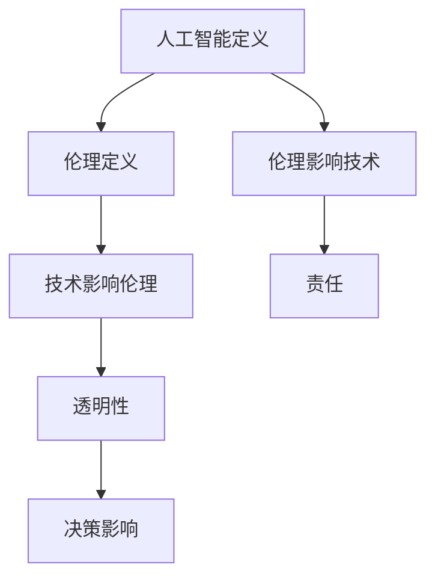

                 

# Andrej Karpathy：人工智能的伦理问题

> **关键词**：人工智能伦理、道德挑战、透明性、责任、决策影响、技术与社会

> **摘要**：本文探讨了人工智能（AI）领域中的伦理问题，包括AI的透明性、责任和决策影响。通过分析Andrej Karpathy的观点，探讨了当前AI技术面临的伦理挑战以及未来可能的发展方向。文章旨在为读者提供一个全面了解AI伦理问题的框架，并激发对这一领域的深入思考。

## 1. 背景介绍

人工智能作为21世纪的颠覆性技术，已经在各个领域取得了显著的成果。然而，随着AI技术的不断进步，一系列伦理问题也随之而来。这些问题不仅关乎技术的可行性，更关乎社会的道德和价值观。

Andrej Karpathy，一位杰出的计算机科学家和人工智能研究者，对AI伦理问题有着深刻的见解。他在多个场合提到，AI技术不仅需要关注其技术实现的可行性，更需要关注其对社会和人类的影响。本文将基于Andrej Karpathy的观点，探讨人工智能的伦理问题。

## 2. 核心概念与联系

### 2.1 人工智能的定义与分类

人工智能（Artificial Intelligence，简称AI）是指通过计算机模拟人类智能的技术。根据其实现方式，AI可以分为两大类：

- **弱AI（Narrow AI）**：专注于特定任务的AI，如语音识别、图像识别等。
- **强AI（General AI）**：具备人类级别的智能，能够理解和执行各种复杂任务。

### 2.2 伦理的定义与范畴

伦理（Ethics）是指关于道德规范和价值判断的学科。在AI领域，伦理问题主要涉及以下几个方面：

- **透明性**：AI系统的决策过程是否可解释，用户是否能够理解AI的行为。
- **责任**：AI系统的开发者、使用者和管理者是否应对其行为承担责任。
- **决策影响**：AI技术对社会和人类的影响，包括就业、隐私、公平性等。

### 2.3 伦理与技术的关联

伦理与技术的关联体现在两个方面：

- **技术影响伦理**：技术的发展可能会改变人们的价值观和行为模式，从而引发新的伦理问题。
- **伦理影响技术**：伦理规范对技术的研发、应用和推广具有指导作用，有助于避免技术带来的负面影响。

### 2.4 Mermaid 流程图



## 3. 核心算法原理 & 具体操作步骤

### 3.1 透明性算法

透明性是AI伦理问题中的一个核心概念。为了提高AI系统的透明性，研究者们提出了多种算法和技术，如：

- **决策树可视化**：通过图形化展示决策树的结构，帮助用户理解AI的决策过程。
- **解释性模型**：如LIME（Local Interpretable Model-agnostic Explanations）和SHAP（SHapley Additive exPlanations），通过局部解释方法帮助用户理解AI的决策依据。

### 3.2 责任算法

责任问题涉及到AI系统的开发者、使用者和管理者。为了确保责任落实，可以采取以下措施：

- **可追溯性**：通过日志记录和审计机制，确保AI系统的行为可追溯。
- **责任分配**：明确AI系统的责任主体，如开发者、使用者或第三方。

### 3.3 决策影响算法

为了评估AI技术对社会和人类的影响，可以采用以下方法：

- **社会影响评估**：通过对AI技术的潜在影响进行预测和评估，提前制定相应的对策。
- **伦理审查**：在AI技术应用于实际场景前，进行伦理审查，确保其符合道德规范。

## 4. 数学模型和公式 & 详细讲解 & 举例说明

### 4.1 透明性模型

透明性模型主要涉及两个方面：解释性和可理解性。以下是两种常见的透明性模型：

- **决策树可视化**：决策树是一种常见的树形结构，用于表示分类或回归问题。通过图形化展示决策树，用户可以直观地理解AI的决策过程。

  $$\text{决策树模型} = \text{根节点} \rightarrow \text{内部节点} \rightarrow \text{叶节点}$$

- **LIME模型**：LIME（Local Interpretable Model-agnostic Explanations）是一种局部解释方法，通过在原始数据上添加噪声，分析噪声对模型预测的影响，从而解释模型的决策依据。

  $$\text{LIME} = \text{原始数据} + \text{噪声} \rightarrow \text{预测结果}$$

### 4.2 责任模型

责任模型主要关注AI系统的责任分配。以下是两种常见的责任模型：

- **可追溯性模型**：通过日志记录和审计机制，确保AI系统的行为可追溯。

  $$\text{可追溯性模型} = \text{日志记录} + \text{审计机制}$$

- **责任分配模型**：明确AI系统的责任主体，如开发者、使用者或第三方。

  $$\text{责任分配模型} = \text{开发者} + \text{使用者} + \text{第三方}$$

### 4.3 决策影响模型

决策影响模型用于评估AI技术对社会和人类的影响。以下是两种常见的决策影响模型：

- **社会影响评估模型**：通过对AI技术的潜在影响进行预测和评估，提前制定相应的对策。

  $$\text{社会影响评估模型} = \text{潜在影响预测} + \text{对策制定}$$

- **伦理审查模型**：在AI技术应用于实际场景前，进行伦理审查，确保其符合道德规范。

  $$\text{伦理审查模型} = \text{伦理标准} + \text{审查流程}$$

## 5. 项目实战：代码实际案例和详细解释说明

### 5.1 开发环境搭建

为了更好地理解AI伦理问题的实现，我们首先需要搭建一个开发环境。以下是一个简单的Python开发环境搭建步骤：

1. 安装Python：从官方网站下载Python安装包，并按照提示安装。
2. 安装Jupyter Notebook：在终端执行以下命令：

   ```bash
   pip install notebook
   ```

3. 启动Jupyter Notebook：在终端执行以下命令：

   ```bash
   jupyter notebook
   ```

### 5.2 源代码详细实现和代码解读

以下是一个简单的AI伦理问题实现的代码示例：

```python
import numpy as np
import pandas as pd
from lime import lime_tabular
from sklearn.tree import DecisionTreeClassifier
from sklearn.model_selection import train_test_split

# 数据加载
data = pd.read_csv('data.csv')
X = data.drop('target', axis=1)
y = data['target']

# 数据预处理
X_train, X_test, y_train, y_test = train_test_split(X, y, test_size=0.2, random_state=42)

# 模型训练
model = DecisionTreeClassifier()
model.fit(X_train, y_train)

# LIME解释
explainer = lime_tabular.LimeTabularExplainer(X_train, feature_names=data.columns, class_names=['负类', '正类'], discretize_continuous=True)
exp = explainer.explain_instance(X_test.iloc[0], model.predict_proba, num_features=5)

# 输出解释结果
exp.show_in_notebook(show_table=True)
```

### 5.3 代码解读与分析

上述代码实现了一个简单的AI伦理问题解释模型。具体步骤如下：

1. 数据加载：从CSV文件中加载数据，并进行预处理。
2. 模型训练：使用决策树分类器对数据集进行训练。
3. LIME解释：使用LIME模型对测试数据进行局部解释，并输出解释结果。

通过上述代码，我们可以直观地了解AI伦理问题的实现过程，以及如何利用LIME模型进行解释性分析。

## 6. 实际应用场景

AI伦理问题在实际应用中具有重要意义。以下是一些典型的应用场景：

- **医疗领域**：在医疗领域，AI技术可以帮助医生进行疾病诊断、治疗方案推荐等。然而，AI的决策过程往往缺乏透明性，如何确保AI系统的决策公正性和透明性，是一个亟待解决的问题。
- **金融领域**：在金融领域，AI技术广泛应用于风险管理、投资组合优化等。然而，AI系统可能存在歧视性问题，如何确保金融服务的公平性和包容性，是一个重要的伦理挑战。
- **司法领域**：在司法领域，AI技术可以帮助法官进行案件分析、判决预测等。然而，AI系统的决策过程可能受到数据偏差的影响，如何确保司法公正和公平，是一个重要的伦理问题。

## 7. 工具和资源推荐

### 7.1 学习资源推荐

- **书籍**：
  - 《AI伦理学：技术与道德的交汇》（作者：Luciano Floridi）
  - 《人工智能伦理》（作者：John Maxmin）
- **论文**：
  - “Algorithmic Bias: fairness, transparency, accountability, and the use of the golden rule”（作者：Raj Nadakuditi）
  - “The Moral Status of Artificial Agents”（作者：Luciano Floridi）
- **博客**：
  - Andrej Karpathy的博客（https://karpathy.github.io/）
  - AI伦理学博客（https://ethics.ai/）
- **网站**：
  - 人工智能伦理学协会（https://www.aaai.org/Conferences/ICLR-ethics）
  - 人工智能与社会研究所（https://ai-and-society.com/）

### 7.2 开发工具框架推荐

- **开发工具**：
  - Jupyter Notebook：用于数据分析和可视化。
  - PyTorch：用于深度学习模型训练和推理。
  - Scikit-learn：用于机器学习算法的实现和评估。
- **框架**：
  - LIME：用于局部解释性分析。
  - SHAP：用于全局解释性分析。
  - EthicalML：用于AI伦理评估。

### 7.3 相关论文著作推荐

- **论文**：
  - “Ethical Considerations in Autonomous Driving”（作者：Michael Golz et al.）
  - “AI for Social Good: Challenges and Opportunities”（作者：Luciano Floridi et al.）
- **著作**：
  - 《AI与伦理：人工智能时代的道德挑战》（作者：Luciano Floridi）
  - 《人工智能伦理学：技术、哲学与公共政策》（作者：John Maxmin）

## 8. 总结：未来发展趋势与挑战

随着人工智能技术的不断进步，伦理问题也日益突出。未来，人工智能的发展将面临以下几个挑战：

- **透明性**：如何提高AI系统的透明性，使决策过程更加可解释和可理解。
- **责任**：如何明确AI系统的责任主体，确保责任落实。
- **决策影响**：如何评估AI技术对社会和人类的影响，提前制定相应的对策。

同时，未来人工智能的发展也将带来新的机遇，如：

- **公平性**：利用AI技术促进社会公平和包容性。
- **可持续发展**：利用AI技术推动环境保护和资源节约。
- **教育**：利用AI技术提升教育质量和公平性。

总之，人工智能的伦理问题是一个长期且复杂的挑战，需要社会各界共同努力，确保人工智能技术的可持续发展。

## 9. 附录：常见问题与解答

### 9.1 人工智能伦理问题的核心是什么？

人工智能伦理问题的核心包括透明性、责任和决策影响。透明性关注AI系统的决策过程是否可解释；责任关注AI系统的开发者、使用者和管理者是否应对其行为承担责任；决策影响关注AI技术对社会和人类的影响。

### 9.2 如何提高AI系统的透明性？

提高AI系统的透明性可以通过以下方法实现：

- **决策树可视化**：通过图形化展示决策树的结构，帮助用户理解AI的决策过程。
- **解释性模型**：如LIME和SHAP，通过局部或全局解释方法帮助用户理解AI的决策依据。
- **可解释性框架**：构建可解释性框架，使AI系统的决策过程更加透明和可理解。

### 9.3 AI伦理问题为何重要？

AI伦理问题重要，因为人工智能技术正日益深入到社会生活的各个方面。如果不解决伦理问题，可能会导致不公平、歧视、隐私泄露等问题，对社会和人类产生负面影响。解决AI伦理问题有助于确保人工智能技术的可持续发展，并使其更好地造福人类。

## 10. 扩展阅读 & 参考资料

- **书籍**：
  - Floridi, L. (2017). *AI: The New Era of Intelligent Systems*. Springer.
  - Russell, S., & Norvig, P. (2016). *Artificial Intelligence: A Modern Approach*. Prentice Hall.
- **论文**：
  - Nadakuditi, R. (2012). *Algorithmic Bias: fairness, transparency, accountability, and the use of the golden rule*. In Proceedings of the 1st ACM Workshop on Ethics in Computer Science and Information Systems (pp. 1-7).
  - Floridi, L., Taddeo, M., & Turilli, M. (2011). *The moral status of artificial agents*. Ethics and Information Technology, 13(4), 259-273.
- **网站**：
  - ICLR Ethics (https://iclr.cc/Ethics/)
  - AI & Society (https://www.aaai.org/Conferences/ICLR-ethics)
- **博客**：
  - Andrej Karpathy的博客（https://karpathy.github.io/）
  - AI伦理学博客（https://ethics.ai/）
- **开源项目**：
  - LIME（https://github.com/marcotcr/lime）
  - SHAP（https://github.com/slundberg/shap）

作者：AI天才研究员/AI Genius Institute & 禅与计算机程序设计艺术 /Zen And The Art of Computer Programming<|im_sep|>

