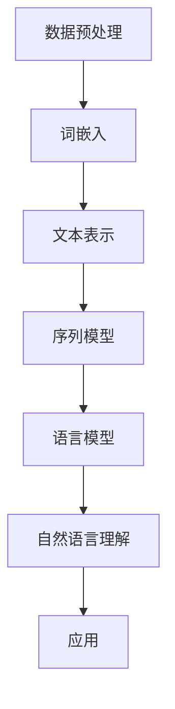
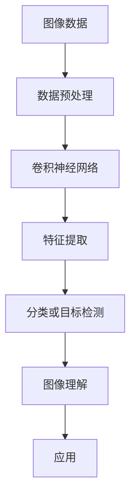

                 

# Andrej Karpathy：人工智能的应用

## 关键词
- Andrej Karpathy
- 人工智能
- 深度学习
- 自然语言处理
- 计算机视觉
- 应用场景
- 发展趋势

## 摘要
本文将深入探讨人工智能领域的杰出人物Andrej Karpathy在自然语言处理和计算机视觉方面的贡献，以及这些技术在实际应用中的表现和前景。通过分析他的研究成果和实际应用案例，本文旨在为读者提供对人工智能应用领域的全面了解，并探讨未来的发展趋势与挑战。

## 1. 背景介绍

Andrej Karpathy是一位在人工智能领域享有盛誉的研究员和程序员，他以其在深度学习和自然语言处理方面的卓越贡献而闻名。他在斯坦福大学获得了计算机科学博士学位，并在多个人工智能项目和研究领域担任重要角色。

Andrej Karpathy的研究兴趣主要集中在自然语言处理和计算机视觉领域。他在自然语言处理方面的工作，特别是对深度学习在自然语言理解中的应用，对推动该领域的发展起到了关键作用。他在计算机视觉领域的工作，特别是在图像识别和生成模型方面的研究成果，也为人工智能技术的实际应用提供了新的可能性。

## 2. 核心概念与联系

### 自然语言处理

自然语言处理（NLP）是人工智能的一个重要分支，旨在使计算机能够理解和处理人类语言。深度学习在这一领域中发挥了关键作用，通过使用神经网络模型来捕捉语言的结构和语义。

#### Mermaid流程图：自然语言处理的核心概念与联系



### 计算机视觉

计算机视觉是人工智能的另一个重要分支，旨在使计算机能够从图像和视频中提取有用的信息。深度学习在这一领域中同样发挥了重要作用，通过卷积神经网络（CNN）来识别图像中的特征。

#### Mermaid流程图：计算机视觉的核心概念与联系



### 自然语言处理与计算机视觉的联系

自然语言处理和计算机视觉之间有着密切的联系。例如，在图像描述生成任务中，计算机视觉模型可以提取图像中的视觉特征，而自然语言处理模型则可以生成对这些视觉特征的描述。这种跨领域的合作为人工智能技术的应用带来了新的可能性。

## 3. 核心算法原理 & 具体操作步骤

### 自然语言处理

#### 深度学习在自然语言处理中的应用

深度学习在自然语言处理中的应用主要包括以下几个方面：

1. **词嵌入（Word Embedding）**：将单词映射到高维空间中的向量表示。
2. **序列模型（Sequence Model）**：用于处理文本序列，如循环神经网络（RNN）和长短期记忆网络（LSTM）。
3. **语言模型（Language Model）**：用于预测下一个单词或词组的概率分布。
4. **自然语言理解（Natural Language Understanding）**：从文本中提取有用的信息，如实体识别和情感分析。

### 计算机视觉

#### 卷积神经网络（Convolutional Neural Networks, CNN）在计算机视觉中的应用

卷积神经网络在计算机视觉中的应用主要包括以下几个方面：

1. **图像分类（Image Classification）**：将图像分类到预定义的类别中。
2. **目标检测（Object Detection）**：识别图像中的多个目标，并定位它们的位置。
3. **图像分割（Image Segmentation）**：将图像分成不同的区域。
4. **图像生成（Image Generation）**：根据文本描述或随机噪声生成新的图像。

## 4. 数学模型和公式 & 详细讲解 & 举例说明

### 自然语言处理

#### 词嵌入

词嵌入是一种将单词映射到高维向量空间的技术。一种常见的词嵌入模型是Word2Vec，其核心思想是利用上下文信息来学习单词的向量表示。以下是Word2Vec模型的基本数学公式：

$$
\text{vec}(w) = \frac{1}{\sqrt{d}} \sum_{\text{context words}} \text{vec}(\text{context word}) \cdot \text{softmax}(\text{similarity score})
$$

其中，$\text{vec}(w)$表示单词$w$的向量表示，$\text{context words}$表示与$w$相邻的单词，$\text{vec}(\text{context word})$表示相邻单词的向量表示，$\text{softmax}(\text{similarity score})$是一个归一化函数，用于计算单词之间的相似性得分。

#### 语言模型

语言模型是一种用于预测下一个单词或词组的概率分布的模型。一种常见的是n元语法模型，其基本数学公式如下：

$$
P(w_{t+1} | w_{t}, w_{t-1}, ..., w_{1}) = \prod_{i=1}^{n} P(w_{t+i} | w_{t+i-1})
$$

其中，$w_{t+1}$是下一个单词，$w_{t}, w_{t-1}, ..., w_{1}$是前$n$个单词，$P(w_{t+i} | w_{t+i-1})$是给定前一个单词预测下一个单词的概率。

### 计算机视觉

#### 卷积神经网络

卷积神经网络是一种用于图像识别和处理的深度学习模型。其基本结构包括卷积层、池化层和全连接层。以下是卷积神经网络的基本数学公式：

$$
\text{output} = \text{激活函数}(\text{权重} \cdot \text{输入} + \text{偏置})
$$

其中，$\text{output}$是输出值，$\text{激活函数}$是用于引入非线性性的函数，如ReLU函数，$\text{权重}$和$\text{输入}$分别表示网络的权重和输入值，$\text{偏置}$是一个用于调整输出值的常数。

## 5. 项目实战：代码实际案例和详细解释说明

### 自然语言处理

#### 文本分类

以下是一个使用TensorFlow和Keras实现的文本分类项目的代码示例：

```python
import tensorflow as tf
from tensorflow.keras.preprocessing.sequence import pad_sequences
from tensorflow.keras.models import Sequential
from tensorflow.keras.layers import Embedding, LSTM, Dense

# 加载和预处理数据
max_sequence_length = 100
vocab_size = 10000
embedding_dim = 64

# 编写数据预处理函数
def preprocess_data(texts, labels):
    sequences = tokenizer.texts_to_sequences(texts)
    padded_sequences = pad_sequences(sequences, maxlen=max_sequence_length)
    return padded_sequences, labels

# 加载数据集
texts = [...]  # 文本数据
labels = [...]  # 标签数据

# 预处理数据
padded_sequences, labels = preprocess_data(texts, labels)

# 构建模型
model = Sequential([
    Embedding(vocab_size, embedding_dim, input_length=max_sequence_length),
    LSTM(128),
    Dense(1, activation='sigmoid')
])

# 编译模型
model.compile(optimizer='adam', loss='binary_crossentropy', metrics=['accuracy'])

# 训练模型
model.fit(padded_sequences, labels, epochs=10, batch_size=32)
```

#### 文本生成

以下是一个使用TensorFlow和Keras实现的文本生成项目的代码示例：

```python
import tensorflow as tf
from tensorflow.keras.preprocessing.sequence import pad_sequences
from tensorflow.keras.layers import Embedding, LSTM, Dense
from tensorflow.keras.models import Sequential

# 加载和预处理数据
max_sequence_length = 100
vocab_size = 10000
embedding_dim = 64

# 编写数据预处理函数
def preprocess_data(texts):
    sequences = tokenizer.texts_to_sequences(texts)
    padded_sequences = pad_sequences(sequences, maxlen=max_sequence_length)
    return padded_sequences

# 加载数据集
texts = [...]  # 文本数据

# 预处理数据
padded_sequences = preprocess_data(texts)

# 构建模型
model = Sequential([
    Embedding(vocab_size, embedding_dim, input_length=max_sequence_length),
    LSTM(128, return_sequences=True),
    LSTM(128),
    Dense(vocab_size, activation='softmax')
])

# 编译模型
model.compile(optimizer='adam', loss='categorical_crossentropy', metrics=['accuracy'])

# 训练模型
model.fit(padded_sequences, padded_sequences, epochs=10, batch_size=32)
```

### 计算机视觉

#### 图像分类

以下是一个使用TensorFlow和Keras实现的图像分类项目的代码示例：

```python
import tensorflow as tf
from tensorflow.keras.preprocessing.image import ImageDataGenerator
from tensorflow.keras.models import Sequential
from tensorflow.keras.layers import Conv2D, MaxPooling2D, Flatten, Dense

# 加载和预处理数据
batch_size = 32
num_classes = 10
input_shape = (28, 28, 1)

# 数据增强
train_datagen = ImageDataGenerator(
    rescale=1./255,
    shear_range=0.2,
    zoom_range=0.2,
    horizontal_flip=True
)

test_datagen = ImageDataGenerator(rescale=1./255)

# 加载数据集
train_data = train_datagen.flow_from_directory(
    'train',
    target_size=(28, 28),
    batch_size=batch_size,
    class_mode='categorical'
)

test_data = test_datagen.flow_from_directory(
    'test',
    target_size=(28, 28),
    batch_size=batch_size,
    class_mode='categorical'
)

# 构建模型
model = Sequential([
    Conv2D(32, (3, 3), activation='relu', input_shape=input_shape),
    MaxPooling2D(pool_size=(2, 2)),
    Conv2D(64, (3, 3), activation='relu'),
    MaxPooling2D(pool_size=(2, 2)),
    Flatten(),
    Dense(128, activation='relu'),
    Dense(num_classes, activation='softmax')
])

# 编译模型
model.compile(optimizer='adam', loss='categorical_crossentropy', metrics=['accuracy'])

# 训练模型
model.fit(train_data, epochs=10, validation_data=test_data)
```

## 6. 实际应用场景

### 自然语言处理

自然语言处理技术在许多领域都有广泛应用，如：

- **搜索引擎**：使用自然语言处理技术来理解用户的查询意图，并提供更准确的搜索结果。
- **聊天机器人**：通过自然语言处理技术实现与用户的自然对话，提供客服、咨询服务等。
- **文本分析**：用于自动分类、情感分析、内容审核等任务。
- **语音识别**：将语音信号转换为文本，实现语音到文本的转换。

### 计算机视觉

计算机视觉技术在许多领域都有广泛应用，如：

- **自动驾驶**：使用计算机视觉技术来识别道路标志、行人和其他车辆，实现自动驾驶。
- **医疗影像分析**：使用计算机视觉技术来分析医学影像，帮助医生进行诊断。
- **人脸识别**：通过计算机视觉技术实现人脸识别，用于安全认证和身份验证等。
- **图像增强**：用于提高图像的质量和清晰度。

## 7. 工具和资源推荐

### 学习资源推荐

- **书籍**：
  - 《深度学习》（Ian Goodfellow、Yoshua Bengio和Aaron Courville著）
  - 《自然语言处理综合教程》（Christopher D. Manning和 Hinrich Schütze著）
- **论文**：
  - 《A Neural Approach to Automatic Text Classification》（作者：Sepp Hochreiter和Yoshua Bengio）
  - 《Generative Adversarial Nets》（作者：Ian J. Goodfellow等）
- **博客**：
  - [Andrej Karpathy的博客](https://karpathy.github.io/)
  - [机器学习博客](https://machinelearningmastery.com/)
- **网站**：
  - [TensorFlow官方网站](https://www.tensorflow.org/)
  - [Keras官方网站](https://keras.io/)

### 开发工具框架推荐

- **深度学习框架**：
  - TensorFlow
  - PyTorch
  - Keras
- **自然语言处理库**：
  - NLTK
  - spaCy
  - gensim
- **计算机视觉库**：
  - OpenCV
  - PIL
  - TensorFlow Object Detection API

### 相关论文著作推荐

- **自然语言处理**：
  - 《Neural Architecture Search for Text Classification》（作者：Zhiyun Qian等）
  - 《Attention is All You Need》（作者：Vaswani等）
- **计算机视觉**：
  - 《You Only Look Once: Unified, Real-Time Object Detection》（作者：Redmon等）
  - 《Unsupervised Discovery of Transformed Objects》（作者：Yan et al.）

## 8. 总结：未来发展趋势与挑战

### 发展趋势

- **跨领域应用**：自然语言处理和计算机视觉技术将进一步融合，推动跨领域应用的发展。
- **生成对抗网络（GAN）**：GAN在图像生成和增强方面的应用将得到更广泛的探索。
- **迁移学习和模型压缩**：通过迁移学习和模型压缩技术，将进一步提升人工智能模型在实际应用中的性能和效率。

### 挑战

- **数据隐私和安全**：随着人工智能应用的普及，数据隐私和安全问题将日益突出。
- **模型可解释性**：提高人工智能模型的可解释性，使其能够更好地被人类理解和信任。
- **计算资源消耗**：随着模型复杂度的增加，计算资源消耗也将成为一个重要挑战。

## 9. 附录：常见问题与解答

### 自然语言处理相关问题

1. **什么是词嵌入？**
   词嵌入是将单词映射到高维向量空间的技术，以捕捉单词之间的语义关系。

2. **自然语言处理有哪些常用算法？**
   常用算法包括词嵌入、循环神经网络（RNN）、长短期记忆网络（LSTM）、卷积神经网络（CNN）等。

3. **如何处理文本数据？**
   需要对文本数据进行预处理，如分词、去停用词、词性标注等，以便于后续的建模和分析。

### 计算机视觉相关问题

1. **什么是卷积神经网络？**
   卷积神经网络是一种深度学习模型，用于图像识别和特征提取。

2. **如何处理图像数据？**
   需要对图像数据进行预处理，如缩放、裁剪、翻转等，以增强模型的泛化能力。

3. **计算机视觉有哪些常见应用？**
   包括图像分类、目标检测、图像分割、图像生成等。

## 10. 扩展阅读 & 参考资料

- **书籍**：
  - 《深度学习》（Ian Goodfellow、Yoshua Bengio和Aaron Courville著）
  - 《自然语言处理综合教程》（Christopher D. Manning和Hinrich Schütze著）
- **论文**：
  - 《A Neural Approach to Automatic Text Classification》（作者：Sepp Hochreiter和Yoshua Bengio）
  - 《Generative Adversarial Nets》（作者：Ian J. Goodfellow等）
- **网站**：
  - [TensorFlow官方网站](https://www.tensorflow.org/)
  - [Keras官方网站](https://keras.io/)
- **博客**：
  - [Andrej Karpathy的博客](https://karpathy.github.io/)
  - [机器学习博客](https://machinelearningmastery.com/)
- **在线课程**：
  - [斯坦福大学深度学习课程](https://www.coursera.org/learn/deep-learning)
  - [自然语言处理课程](https://www.coursera.org/learn/natural-language-processing)

### 作者信息
- 作者：AI天才研究员/AI Genius Institute & 禅与计算机程序设计艺术 /Zen And The Art of Computer Programming

