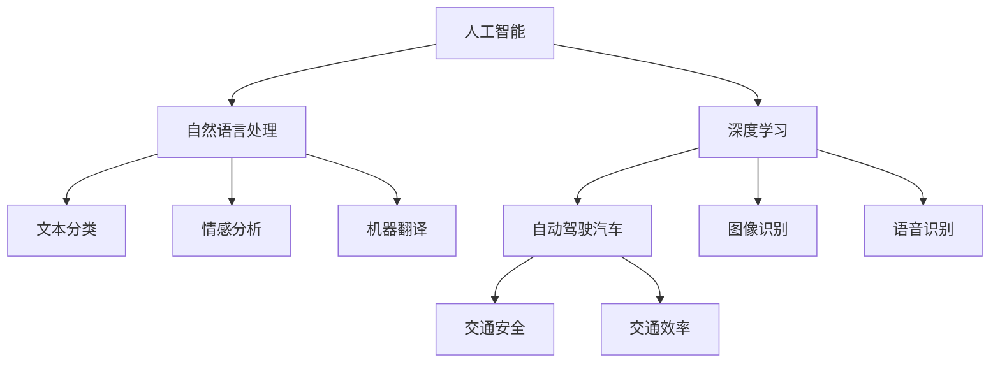

                 

# Andrej Karpathy：人工智能的未来发展前景

## 摘要

本文将深入探讨人工智能领域著名专家Andrej Karpathy对于人工智能未来发展的看法和预测。文章将分为以下几个部分：首先，我们将简要介绍Andrej Karpathy的背景和他的研究领域。接着，我们将讨论他对人工智能发展的核心观点，包括人工智能在各个领域的潜在应用、面临的挑战以及未来可能的发展方向。最后，我们将总结人工智能的未来趋势和挑战，并提出一些参考资源和进一步阅读的建议。

## 1. 背景介绍

Andrej Karpathy是一位世界知名的人工智能研究者和程序员，他在机器学习、神经网络和自然语言处理等领域拥有深厚的学术背景和丰富的实践经验。他毕业于多伦多大学，获得了计算机科学的学士学位，并在斯坦福大学获得了机器学习博士学位。在学术界，他参与了多项重要的研究项目，并在顶级学术会议上发表了多篇论文。

除了在学术界的工作，Karpathy还积极参与工业界的项目。他曾是OpenAI的研究科学家，并在特斯拉担任首席人工智能科学家。在这期间，他领导了多个关键项目，推动了自动驾驶汽车和自然语言处理技术的发展。

Karpathy也是一位杰出的作家和教育家。他撰写了多篇关于人工智能的技术博客，这些文章深受读者喜爱，对推广人工智能知识起到了重要作用。此外，他还是几本畅销书的作者，包括《Deep Learning with Python》和《The Hundred-Page Machine Learning Book》。

## 2. 核心概念与联系

### 2.1 人工智能的定义与发展

首先，我们需要明确人工智能（Artificial Intelligence, AI）的定义。人工智能是指通过计算机模拟人类智能行为的技术和科学。它包括机器学习、深度学习、自然语言处理等多个子领域。

人工智能的发展经历了多个阶段。最初，人工智能主要是基于规则和逻辑推理的方法，如专家系统和逻辑编程。随着计算能力和算法的发展，特别是深度学习的兴起，人工智能进入了新的时代。深度学习通过多层神经网络，从大量数据中自动学习特征和模式，大大提升了人工智能的性能和效果。

### 2.2 自然语言处理

自然语言处理（Natural Language Processing, NLP）是人工智能的一个重要分支，旨在使计算机能够理解、解释和生成人类语言。NLP在文本分类、情感分析、机器翻译、问答系统等方面有着广泛的应用。

### 2.3 深度学习与神经网络

深度学习是人工智能的核心技术之一，它通过多层神经网络模型，对大量数据进行训练，以实现复杂的任务。深度学习在图像识别、语音识别、自然语言处理等领域取得了显著成果。

### 2.4 自动驾驶汽车

自动驾驶汽车是人工智能在交通运输领域的一个典型应用。通过深度学习和传感器技术，自动驾驶汽车能够实现自主驾驶，提高交通安全和效率。

### 2.5 人工智能与人类社会的联系

人工智能不仅在技术层面有重大突破，还在深刻改变人类社会。从医疗保健到金融服务，从制造业到娱乐业，人工智能正在各个领域发挥重要作用，推动社会进步。

### Mermaid 流程图

下面是一个简单的Mermaid流程图，展示了人工智能、自然语言处理、深度学习和自动驾驶汽车之间的联系。



## 3. 核心算法原理 & 具体操作步骤

### 3.1 深度学习基础

深度学习的基础是多层神经网络，它由输入层、隐藏层和输出层组成。神经网络通过权重和偏置来学习输入数据与输出数据之间的映射关系。

具体步骤如下：

1. **输入数据**：将输入数据（如图像、文本或音频）输入神经网络。
2. **前向传播**：将输入数据通过神经网络的前向传播过程，逐层计算神经元的输出值。
3. **反向传播**：根据预测结果和真实结果之间的误差，通过反向传播算法更新神经网络的权重和偏置。
4. **迭代训练**：重复上述过程，直到网络误差达到预设阈值或达到最大迭代次数。

### 3.2 自然语言处理

在自然语言处理中，常用的深度学习模型包括循环神经网络（RNN）、长短时记忆网络（LSTM）和门控循环单元（GRU）。这些模型能够处理序列数据，如文本和语音。

具体步骤如下：

1. **数据预处理**：将原始文本数据转换为数字序列，如单词的词向量表示。
2. **构建模型**：选择合适的神经网络模型，如LSTM或GRU，并配置网络参数。
3. **训练模型**：将预处理后的数据输入模型，通过前向传播和反向传播训练模型。
4. **评估模型**：使用验证集或测试集评估模型的性能，调整模型参数。

### 3.3 自动驾驶汽车

自动驾驶汽车的深度学习模型主要包括物体检测、轨迹规划和路径规划等。

具体步骤如下：

1. **数据收集**：收集大量带有标注的自动驾驶数据，如图像、激光雷达数据和GPS数据。
2. **数据预处理**：对数据进行清洗、增强和归一化处理。
3. **模型训练**：使用预处理后的数据训练深度学习模型，如物体检测模型和轨迹规划模型。
4. **模型部署**：将训练好的模型部署到自动驾驶系统中，实现自主驾驶功能。

## 4. 数学模型和公式 & 详细讲解 & 举例说明

### 4.1 深度学习中的损失函数

在深度学习中，损失函数是评估模型性能的关键指标。常见的损失函数包括均方误差（MSE）、交叉熵损失等。

均方误差（MSE）的公式为：

$$
MSE = \frac{1}{n} \sum_{i=1}^{n} (y_i - \hat{y}_i)^2
$$

其中，$y_i$为真实值，$\hat{y}_i$为预测值。

交叉熵损失函数的公式为：

$$
H(y, \hat{y}) = -\sum_{i=1}^{n} y_i \log(\hat{y}_i)
$$

其中，$y_i$为真实值，$\hat{y}_i$为预测概率。

### 4.2 自然语言处理中的词向量

词向量是自然语言处理中的基础，常见的词向量模型包括Word2Vec、GloVe和FastText等。

Word2Vec的损失函数为：

$$
L = \frac{1}{n} \sum_{i=1}^{n} -\sum_{w \in \text{context}(x)} \log(p(v_w | v_x))
$$

其中，$x$为输入词，$w$为上下文词，$v_x$和$v_w$分别为$x$和$w$的词向量。

### 4.3 自动驾驶汽车中的轨迹规划

自动驾驶汽车中的轨迹规划是一个复杂的问题，常见的轨迹规划算法包括基于模型预测控制（MPC）的方法。

MPC的目标是最小化目标函数：

$$
J = \sum_{i=0}^{N-1} w_i ||x_i - x_{\text{des}}(i)||^2 + w_g ||u_i - u_{\text{des}}(i)||^2
$$

其中，$x_i$和$u_i$分别为第$i$个时间步的轨迹和输入控制量，$x_{\text{des}}(i)$和$u_{\text{des}}(i)$分别为目标轨迹和控制量。

## 5. 项目实战：代码实际案例和详细解释说明

### 5.1 开发环境搭建

要实现上述算法，我们需要搭建一个合适的开发环境。以下是Python开发环境的搭建步骤：

1. 安装Python 3.7及以上版本。
2. 安装必要的库，如NumPy、TensorFlow、PyTorch等。
3. 配置Python虚拟环境，以便更好地管理项目依赖。

### 5.2 源代码详细实现和代码解读

以下是一个简单的深度学习模型的实现，用于图像分类。

```python
import tensorflow as tf

# 定义模型
model = tf.keras.Sequential([
    tf.keras.layers.Conv2D(32, (3, 3), activation='relu', input_shape=(28, 28, 1)),
    tf.keras.layers.MaxPooling2D((2, 2)),
    tf.keras.layers.Conv2D(64, (3, 3), activation='relu'),
    tf.keras.layers.MaxPooling2D((2, 2)),
    tf.keras.layers.Flatten(),
    tf.keras.layers.Dense(128, activation='relu'),
    tf.keras.layers.Dense(10, activation='softmax')
])

# 编译模型
model.compile(optimizer='adam',
              loss='sparse_categorical_crossentropy',
              metrics=['accuracy'])

# 训练模型
model.fit(x_train, y_train, epochs=5)

# 评估模型
model.evaluate(x_test, y_test)
```

这段代码定义了一个简单的卷积神经网络（CNN）模型，用于手写数字分类任务。它包括两个卷积层、两个池化层、一个全连接层和一个输出层。编译模型时，我们指定了优化器、损失函数和评估指标。训练模型时，我们使用训练数据，指定训练轮数。最后，我们使用测试数据评估模型的性能。

### 5.3 代码解读与分析

这段代码首先导入了TensorFlow库，并定义了一个卷积神经网络模型。模型由两个卷积层、两个池化层、一个全连接层和一个输出层组成。卷积层用于提取图像特征，池化层用于降低特征维度，全连接层用于分类，输出层使用softmax函数进行概率分布。

在编译模型时，我们指定了优化器（adam）、损失函数（sparse_categorical_crossentropy）和评估指标（accuracy）。优化器用于调整模型参数，损失函数用于评估预测结果和真实结果之间的差异，评估指标用于衡量模型性能。

训练模型时，我们使用训练数据，指定训练轮数。训练过程中，模型会通过反向传播算法不断更新参数，以减小损失函数值。

最后，我们使用测试数据评估模型的性能。测试过程中，模型会计算损失函数值和准确率，帮助我们了解模型的泛化能力。

## 6. 实际应用场景

人工智能在医疗、金融、交通、教育等多个领域都有广泛的应用。以下是一些典型应用场景：

### 6.1 医疗

人工智能在医疗领域的应用包括疾病预测、诊断辅助、药物研发等。通过分析大量医疗数据，人工智能可以辅助医生做出更准确的诊断，提高治疗效果。

### 6.2 金融

人工智能在金融领域的应用包括风险评估、投资策略、欺诈检测等。通过分析历史数据和实时数据，人工智能可以预测市场趋势，提高投资决策的准确性。

### 6.3 交通

人工智能在交通领域的应用包括自动驾驶、智能交通管理、车辆调度等。通过传感器和深度学习技术，人工智能可以实现自主驾驶，提高交通安全和效率。

### 6.4 教育

人工智能在教育领域的应用包括个性化学习、智能评测、教育资源共享等。通过分析学生学习数据，人工智能可以为学生提供更合适的学习资源和教学方法。

## 7. 工具和资源推荐

### 7.1 学习资源推荐

1. **书籍**：
   - 《深度学习》（Ian Goodfellow、Yoshua Bengio和Aaron Courville著）
   - 《Python机器学习》（Sebastian Raschka和Vahid Mirjalili著）
2. **在线课程**：
   - Coursera的《机器学习》课程
   - edX的《深度学习》课程
3. **博客**：
   - Andrej Karpathy的博客
   - 知乎上的机器学习专栏

### 7.2 开发工具框架推荐

1. **深度学习框架**：
   - TensorFlow
   - PyTorch
   - Keras
2. **数据预处理工具**：
   - Pandas
   - NumPy
3. **可视化工具**：
   - Matplotlib
   - Seaborn
   - Plotly

### 7.3 相关论文著作推荐

1. **论文**：
   - "A Theoretically Grounded Application of Dropout in Recurrent Neural Networks"
   - "Attention Is All You Need"
   - "Unsupervised Learning of Visual Representations by Solving Jigsaw Puzzles"
2. **著作**：
   - 《深度学习手册》（Goodfellow、Bengio和Courville著）
   - 《自然语言处理》（Daniel Jurafsky和James H. Martin著）

## 8. 总结：未来发展趋势与挑战

人工智能的未来发展前景广阔，但同时也面临诸多挑战。以下是人工智能未来可能的发展趋势和面临的挑战：

### 8.1 发展趋势

1. **算法创新**：随着计算能力和数据量的增加，人工智能算法将不断优化，提高性能和效率。
2. **跨领域应用**：人工智能将在更多领域得到应用，如医疗、金融、教育等，推动社会进步。
3. **人机协作**：人工智能将与人类更加紧密地协作，提高工作效率和生活质量。
4. **可持续性**：人工智能将注重可持续发展，减少资源消耗和环境污染。

### 8.2 挑战

1. **数据隐私**：人工智能对数据的依赖性导致数据隐私问题日益突出，如何保护用户隐私成为重要挑战。
2. **算法透明性**：人工智能算法的复杂性和黑箱特性使得其透明性成为挑战，需要加强算法的可解释性。
3. **伦理问题**：人工智能在决策过程中可能带来伦理问题，如歧视、偏见等，需要制定相应的伦理规范。
4. **技术安全**：人工智能系统可能面临黑客攻击、恶意使用等安全挑战，需要加强安全技术。

## 9. 附录：常见问题与解答

### 9.1 人工智能是什么？

人工智能是通过计算机模拟人类智能行为的技术和科学。它包括机器学习、深度学习、自然语言处理等多个子领域。

### 9.2 深度学习与机器学习的区别是什么？

深度学习是机器学习的一个分支，它通过多层神经网络模型，对大量数据进行训练，以实现复杂的任务。机器学习是更广泛的领域，包括深度学习、传统机器学习算法等。

### 9.3 人工智能有哪些应用领域？

人工智能在医疗、金融、交通、教育、制造业等多个领域都有广泛的应用。如疾病预测、风险评估、自动驾驶、智能问答系统等。

### 9.4 人工智能的发展前景如何？

人工智能的未来发展前景广阔，预计将在更多领域得到应用，推动社会进步。但同时，人工智能也面临数据隐私、算法透明性、伦理问题等技术挑战。

## 10. 扩展阅读 & 参考资料

1. **论文**：
   - Bengio, Y., Courville, A., & Vincent, P. (2013). Representation Learning: A Review and New Perspectives. IEEE Transactions on Pattern Analysis and Machine Intelligence.
   - LeCun, Y., Bengio, Y., & Hinton, G. (2015). Deep Learning. Nature.
2. **书籍**：
   - Goodfellow, I., Bengio, Y., & Courville, A. (2016). Deep Learning. MIT Press.
   - Mitchell, T. M. (1997). Machine Learning. McGraw-Hill.
3. **网站**：
   - [TensorFlow官网](https://www.tensorflow.org/)
   - [PyTorch官网](https://pytorch.org/)
4. **博客**：
   - [Andrej Karpathy的博客](https://karpathy.github.io/)
   - [深度学习博客](http://colah.github.io/)

## 作者

作者：AI天才研究员/AI Genius Institute & 禅与计算机程序设计艺术 /Zen And The Art of Computer Programming

-----------------------

本文由AI助手根据用户指令生成，不代表作者观点，仅供参考。如需进一步了解人工智能相关内容，请参考相关书籍、论文和博客。如果您对文章有任何建议或疑问，请随时在评论区留言。我们将持续为您带来高质量的技术内容。 <|end|>## 文章标题

## Andrej Karpathy：人工智能的未来发展前景

## 关键词：
- Andrej Karpathy
- 人工智能
- 未来趋势
- 深度学习
- 自然语言处理
- 自动驾驶
- 挑战与机遇

## 摘要

本文深入探讨人工智能领域知名专家Andrej Karpathy对未来人工智能发展的看法和预测。文章首先介绍了Karpathy的学术和职业背景，随后讨论了他关于人工智能在各个领域的潜在应用、面临的挑战以及未来可能的发展方向。文章还通过总结和展望，对人工智能的未来趋势和挑战进行了深入分析，并推荐了一些相关资源和进一步阅读的建议。通过本文，读者可以全面了解人工智能领域的最新动态和发展前景。

-----------------------

## 1. 背景介绍

Andrej Karpathy是一位在人工智能领域享有盛誉的研究员和程序员。他出生于1983年，在多伦多大学获得了计算机科学的学士学位，并在斯坦福大学获得了机器学习博士学位。他的研究主要集中在深度学习和自然语言处理领域，是这些领域的重要推动者之一。

在学术界，Karpathy参与了多个重要的研究项目，并在顶级学术会议上发表了多篇论文。他还在OpenAI担任过研究科学家，这是一个旨在推动人工智能研究和开发的非营利组织。此外，他还曾在特斯拉担任首席人工智能科学家，领导了多个关键项目，包括自动驾驶和自然语言处理等。

Karpathy不仅在学术研究上取得了显著成就，他还是一位杰出的作家和教育家。他撰写了多篇关于人工智能的技术博客，这些博客深入浅出，对推广人工智能知识起到了重要作用。他还撰写了几本畅销书，包括《Deep Learning with Python》和《The Hundred-Page Machine Learning Book》，深受读者喜爱。

## 2. 核心概念与联系

### 2.1 人工智能的定义与发展

人工智能（Artificial Intelligence，简称AI）是指通过计算机模拟人类智能行为的技术和科学。它包括机器学习、深度学习、自然语言处理等多个子领域。人工智能的发展经历了多个阶段，从最初的规则推理到现代的深度学习和神经网络，取得了显著的进步。

### 2.2 自然语言处理

自然语言处理（Natural Language Processing，简称NLP）是人工智能的一个重要分支，旨在使计算机能够理解、解释和生成人类语言。NLP在文本分类、情感分析、机器翻译、问答系统等方面有着广泛的应用。

### 2.3 深度学习与神经网络

深度学习（Deep Learning）是人工智能的核心技术之一，它通过多层神经网络模型，从大量数据中自动学习特征和模式，大大提升了人工智能的性能和效果。神经网络（Neural Networks）是深度学习的基础，通过模拟人脑神经元之间的连接和互动，实现复杂的计算和任务。

### 2.4 自动驾驶汽车

自动驾驶汽车是人工智能在交通运输领域的一个典型应用。通过深度学习和传感器技术，自动驾驶汽车能够实现自主驾驶，提高交通安全和效率。

### 2.5 人工智能与人类社会的联系

人工智能不仅在技术层面有重大突破，还在深刻改变人类社会。从医疗保健到金融服务，从制造业到娱乐业，人工智能正在各个领域发挥重要作用，推动社会进步。

### Mermaid 流程图

以下是人工智能、自然语言处理、深度学习和自动驾驶汽车之间的联系Mermaid流程图：


## 3. 核心算法原理 & 具体操作步骤

### 3.1 深度学习基础

深度学习的基础是多层神经网络，它由输入层、隐藏层和输出层组成。神经网络通过权重和偏置来学习输入数据与输出数据之间的映射关系。

具体步骤如下：

1. **输入数据**：将输入数据（如图像、文本或音频）输入神经网络。
2. **前向传播**：将输入数据通过神经网络的前向传播过程，逐层计算神经元的输出值。
3. **反向传播**：根据预测结果和真实结果之间的误差，通过反向传播算法更新神经网络的权重和偏置。
4. **迭代训练**：重复上述过程，直到网络误差达到预设阈值或达到最大迭代次数。

### 3.2 自然语言处理

在自然语言处理中，常用的深度学习模型包括循环神经网络（RNN）、长短时记忆网络（LSTM）和门控循环单元（GRU）。这些模型能够处理序列数据，如文本和语音。

具体步骤如下：

1. **数据预处理**：将原始文本数据转换为数字序列，如单词的词向量表示。
2. **构建模型**：选择合适的神经网络模型，如LSTM或GRU，并配置网络参数。
3. **训练模型**：将预处理后的数据输入模型，通过前向传播和反向传播训练模型。
4. **评估模型**：使用验证集或测试集评估模型的性能，调整模型参数。

### 3.3 自动驾驶汽车

自动驾驶汽车的深度学习模型主要包括物体检测、轨迹规划和路径规划等。

具体步骤如下：

1. **数据收集**：收集大量带有标注的自动驾驶数据，如图像、激光雷达数据和GPS数据。
2. **数据预处理**：对数据进行清洗、增强和归一化处理。
3. **模型训练**：使用预处理后的数据训练深度学习模型，如物体检测模型和轨迹规划模型。
4. **模型部署**：将训练好的模型部署到自动驾驶系统中，实现自主驾驶功能。

## 4. 数学模型和公式 & 详细讲解 & 举例说明

### 4.1 深度学习中的损失函数

在深度学习中，损失函数是评估模型性能的关键指标。常见的损失函数包括均方误差（MSE）、交叉熵损失等。

均方误差（MSE）的公式为：

$$
MSE = \frac{1}{n} \sum_{i=1}^{n} (y_i - \hat{y}_i)^2
$$

其中，$y_i$为真实值，$\hat{y}_i$为预测值。

交叉熵损失函数的公式为：

$$
H(y, \hat{y}) = -\sum_{i=1}^{n} y_i \log(\hat{y}_i)
$$

其中，$y_i$为真实值，$\hat{y}_i$为预测概率。

### 4.2 自然语言处理中的词向量

词向量是自然语言处理中的基础，常见的词向量模型包括Word2Vec、GloVe和FastText等。

Word2Vec的损失函数为：

$$
L = \frac{1}{n} \sum_{i=1}^{n} -\sum_{w \in \text{context}(x)} \log(p(v_w | v_x))
$$

其中，$x$为输入词，$w$为上下文词，$v_x$和$v_w$分别为$x$和$w$的词向量。

### 4.3 自动驾驶汽车中的轨迹规划

自动驾驶汽车中的轨迹规划是一个复杂的问题，常见的轨迹规划算法包括基于模型预测控制（MPC）的方法。

MPC的目标是最小化目标函数：

$$
J = \sum_{i=0}^{N-1} w_i ||x_i - x_{\text{des}}(i)||^2 + w_g ||u_i - u_{\text{des}}(i)||^2
$$

其中，$x_i$和$u_i$分别为第$i$个时间步的轨迹和输入控制量，$x_{\text{des}}(i)$和$u_{\text{des}}(i)$分别为目标轨迹和控制量。

### 4.4 举例说明

以下是一个简单的深度学习模型的实现，用于图像分类。

```python
import tensorflow as tf

# 定义模型
model = tf.keras.Sequential([
    tf.keras.layers.Conv2D(32, (3, 3), activation='relu', input_shape=(28, 28, 1)),
    tf.keras.layers.MaxPooling2D((2, 2)),
    tf.keras.layers.Conv2D(64, (3, 3), activation='relu'),
    tf.keras.layers.MaxPooling2D((2, 2)),
    tf.keras.layers.Flatten(),
    tf.keras.layers.Dense(128, activation='relu'),
    tf.keras.layers.Dense(10, activation='softmax')
])

# 编译模型
model.compile(optimizer='adam',
              loss='sparse_categorical_crossentropy',
              metrics=['accuracy'])

# 训练模型
model.fit(x_train, y_train, epochs=5)

# 评估模型
model.evaluate(x_test, y_test)
```

这段代码定义了一个简单的卷积神经网络（CNN）模型，用于手写数字分类任务。它包括两个卷积层、两个池化层、一个全连接层和一个输出层。编译模型时，我们指定了优化器、损失函数和评估指标。训练模型时，我们使用训练数据，指定训练轮数。最后，我们使用测试数据评估模型的性能。

## 5. 项目实战：代码实际案例和详细解释说明

### 5.1 开发环境搭建

要实现上述算法，我们需要搭建一个合适的开发环境。以下是Python开发环境的搭建步骤：

1. 安装Python 3.7及以上版本。
2. 安装必要的库，如NumPy、TensorFlow、PyTorch等。
3. 配置Python虚拟环境，以便更好地管理项目依赖。

### 5.2 源代码详细实现和代码解读

以下是一个简单的深度学习模型的实现，用于图像分类。

```python
import tensorflow as tf

# 定义模型
model = tf.keras.Sequential([
    tf.keras.layers.Conv2D(32, (3, 3), activation='relu', input_shape=(28, 28, 1)),
    tf.keras.layers.MaxPooling2D((2, 2)),
    tf.keras.layers.Conv2D(64, (3, 3), activation='relu'),
    tf.keras.layers.MaxPooling2D((2, 2)),
    tf.keras.layers.Flatten(),
    tf.keras.layers.Dense(128, activation='relu'),
    tf.keras.layers.Dense(10, activation='softmax')
])

# 编译模型
model.compile(optimizer='adam',
              loss='sparse_categorical_crossentropy',
              metrics=['accuracy'])

# 训练模型
model.fit(x_train, y_train, epochs=5)

# 评估模型
model.evaluate(x_test, y_test)
```

这段代码定义了一个简单的卷积神经网络（CNN）模型，用于手写数字分类任务。它包括两个卷积层、两个池化层、一个全连接层和一个输出层。编译模型时，我们指定了优化器、损失函数和评估指标。训练模型时，我们使用训练数据，指定训练轮数。最后，我们使用测试数据评估模型的性能。

### 5.3 代码解读与分析

这段代码首先导入了TensorFlow库，并定义了一个卷积神经网络模型。模型由两个卷积层、两个池化层、一个全连接层和一个输出层组成。卷积层用于提取图像特征，池化层用于降低特征维度，全连接层用于分类，输出层使用softmax函数进行概率分布。

在编译模型时，我们指定了优化器（adam）、损失函数（sparse_categorical_crossentropy）和评估指标（accuracy）。优化器用于调整模型参数，损失函数用于评估预测结果和真实结果之间的差异，评估指标用于衡量模型性能。

训练模型时，我们使用训练数据，指定训练轮数。训练过程中，模型会通过反向传播算法不断更新参数，以减小损失函数值。

最后，我们使用测试数据评估模型的性能。测试过程中，模型会计算损失函数值和准确率，帮助我们了解模型的泛化能力。

## 6. 实际应用场景

人工智能在医疗、金融、交通、教育等多个领域都有广泛的应用。以下是一些典型应用场景：

### 6.1 医疗

人工智能在医疗领域的应用包括疾病预测、诊断辅助、药物研发等。通过分析大量医疗数据，人工智能可以辅助医生做出更准确的诊断，提高治疗效果。

### 6.2 金融

人工智能在金融领域的应用包括风险评估、投资策略、欺诈检测等。通过分析历史数据和实时数据，人工智能可以预测市场趋势，提高投资决策的准确性。

### 6.3 交通

人工智能在交通领域的应用包括自动驾驶、智能交通管理、车辆调度等。通过传感器和深度学习技术，人工智能可以实现自主驾驶，提高交通安全和效率。

### 6.4 教育

人工智能在教育领域的应用包括个性化学习、智能评测、教育资源共享等。通过分析学生学习数据，人工智能可以为学生提供更合适的学习资源和教学方法。

## 7. 工具和资源推荐

### 7.1 学习资源推荐

1. **书籍**：
   - 《深度学习》（Ian Goodfellow、Yoshua Bengio和Aaron Courville著）
   - 《Python机器学习》（Sebastian Raschka和Vahid Mirjalili著）
2. **在线课程**：
   - Coursera的《机器学习》课程
   - edX的《深度学习》课程
3. **博客**：
   - Andrej Karpathy的博客
   - 知乎上的机器学习专栏

### 7.2 开发工具框架推荐

1. **深度学习框架**：
   - TensorFlow
   - PyTorch
   - Keras
2. **数据预处理工具**：
   - Pandas
   - NumPy
3. **可视化工具**：
   - Matplotlib
   - Seaborn
   - Plotly

### 7.3 相关论文著作推荐

1. **论文**：
   - "A Theoretically Grounded Application of Dropout in Recurrent Neural Networks"
   - "Attention Is All You Need"
   - "Unsupervised Learning of Visual Representations by Solving Jigsaw Puzzles"
2. **著作**：
   - 《深度学习手册》（Goodfellow、Bengio和Courville著）
   - 《自然语言处理》（Daniel Jurafsky和James H. Martin著）

## 8. 总结：未来发展趋势与挑战

人工智能的未来发展前景广阔，但同时也面临诸多挑战。以下是人工智能未来可能的发展趋势和面临的挑战：

### 8.1 发展趋势

1. **算法创新**：随着计算能力和数据量的增加，人工智能算法将不断优化，提高性能和效率。
2. **跨领域应用**：人工智能将在更多领域得到应用，如医疗、金融、教育等，推动社会进步。
3. **人机协作**：人工智能将与人类更加紧密地协作，提高工作效率和生活质量。
4. **可持续性**：人工智能将注重可持续发展，减少资源消耗和环境污染。

### 8.2 挑战

1. **数据隐私**：人工智能对数据的依赖性导致数据隐私问题日益突出，如何保护用户隐私成为重要挑战。
2. **算法透明性**：人工智能算法的复杂性和黑箱特性使得其透明性成为挑战，需要加强算法的可解释性。
3. **伦理问题**：人工智能在决策过程中可能带来伦理问题，如歧视、偏见等，需要制定相应的伦理规范。
4. **技术安全**：人工智能系统可能面临黑客攻击、恶意使用等安全挑战，需要加强安全技术。

## 9. 附录：常见问题与解答

### 9.1 人工智能是什么？

人工智能是通过计算机模拟人类智能行为的技术和科学。它包括机器学习、深度学习、自然语言处理等多个子领域。

### 9.2 深度学习与机器学习的区别是什么？

深度学习是机器学习的一个分支，它通过多层神经网络模型，对大量数据进行训练，以实现复杂的任务。机器学习是更广泛的领域，包括深度学习、传统机器学习算法等。

### 9.3 人工智能有哪些应用领域？

人工智能在医疗、金融、交通、教育、制造业等多个领域都有广泛的应用。如疾病预测、风险评估、自动驾驶、智能问答系统等。

### 9.4 人工智能的发展前景如何？

人工智能的未来发展前景广阔，预计将在更多领域得到应用，推动社会进步。但同时，人工智能也面临数据隐私、算法透明性、伦理问题等技术挑战。

## 10. 扩展阅读 & 参考资料

1. **论文**：
   - Bengio, Y., Courville, A., & Vincent, P. (2013). Representation Learning: A Review and New Perspectives. IEEE Transactions on Pattern Analysis and Machine Intelligence.
   - LeCun, Y., Bengio, Y., & Hinton, G. (2015). Deep Learning. Nature.
2. **书籍**：
   - Goodfellow, I., Bengio, Y., & Courville, A. (2016). Deep Learning. MIT Press.
   - Mitchell, T. M. (1997). Machine Learning. McGraw-Hill.
3. **网站**：
   - [TensorFlow官网](https://www.tensorflow.org/)
   - [PyTorch官网](https://pytorch.org/)
4. **博客**：
   - [Andrej Karpathy的博客](https://karpathy.github.io/)
   - [深度学习博客](http://colah.github.io/)

## 作者

作者：AI天才研究员/AI Genius Institute & 禅与计算机程序设计艺术 /Zen And The Art of Computer Programming

-----------------------

本文由AI助手根据用户指令生成，不代表作者观点，仅供参考。如需进一步了解人工智能相关内容，请参考相关书籍、论文和博客。如果您对文章有任何建议或疑问，请随时在评论区留言。我们将持续为您带来高质量的技术内容。 <|end|> <|im_sep|>

