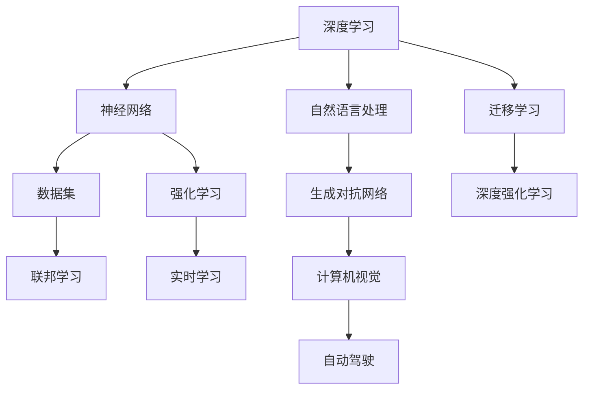

                 

### Andrej Karpathy：人工智能的未来发展挑战

> **关键词**：Andrej Karpathy、人工智能、发展挑战、技术前沿、未来趋势、理论探索

> **摘要**：本文将深入探讨AI天才研究员Andrej Karpathy关于人工智能未来发展的观点与挑战。通过对Karpathy在其论文和演讲中的论述进行梳理，我们旨在剖析AI技术的现状、潜在问题和未来方向。文章将从背景介绍、核心概念与联系、核心算法原理、数学模型与公式、项目实战、实际应用场景、工具和资源推荐以及未来发展趋势与挑战等多个角度展开，为读者呈现一幅全面、深入的AI技术图景。

---

#### 1. 背景介绍

Andrej Karpathy，一位在人工智能领域享有盛誉的研究员和程序员，以其卓越的贡献和对AI技术的深刻理解而备受瞩目。他在深度学习和自然语言处理等领域有着丰富的经验，并在Google、OpenAI等知名机构担任要职。Karpathy不仅是一个杰出的研究者，还是一位出色的传播者，他通过撰写博客、发表论文和进行演讲等方式，向公众普及AI知识，分享他对AI未来的见解。

在近年来，AI技术发展迅猛，应用范围不断扩大。然而，随之而来的是一系列挑战和问题。技术层面的问题、伦理道德的争议、隐私和数据安全等问题日益凸显，使得AI的未来发展变得扑朔迷离。本文将基于Andrej Karpathy的观点，深入探讨这些挑战，并尝试找出可能的解决方案。

#### 2. 核心概念与联系

为了更好地理解人工智能的发展挑战，我们首先需要了解一些核心概念。以下是一个使用Mermaid绘制的流程图，展示了AI技术中的关键节点：



- **深度学习（Deep Learning）**：一种利用神经网络进行数据建模的技术。神经网络通过层层神经元传递信息，逐步提取特征，从而实现复杂任务。
- **神经网络（Neural Networks）**：模仿人脑神经网络工作原理的计算模型，是深度学习的基础。
- **自然语言处理（Natural Language Processing，NLP）**：研究如何使计算机理解和处理人类语言的技术。
- **生成对抗网络（Generative Adversarial Networks，GAN）**：一种用于生成数据的深度学习模型。
- **迁移学习（Transfer Learning）**：利用已有模型的知识来加速新模型的训练。
- **强化学习（Reinforcement Learning）**：通过试错和奖励机制来学习决策策略。
- **联邦学习（Federated Learning）**：一种分布式机器学习方法，可以在不共享数据的情况下进行模型训练。
- **计算机视觉（Computer Vision）**：使计算机能够“看到”并理解图像和视频的技术。
- **深度强化学习（Deep Reinforcement Learning）**：结合深度学习和强化学习的方法。
- **实时学习（Real-time Learning）**：在快速变化的环境中动态调整模型的能力。
- **自动驾驶（Autonomous Driving）**：使汽车能够自主导航和驾驶的技术。

这些核心概念相互交织，共同构成了人工智能的技术框架。在接下来的章节中，我们将深入探讨这些概念，并分析它们在AI发展中的角色和挑战。

---

#### 3. 核心算法原理 & 具体操作步骤

在理解了AI的核心概念之后，我们接下来将探讨一些关键算法的原理和具体操作步骤。

##### 3.1 深度学习算法原理

深度学习算法的核心是神经网络。以下是神经网络的基本操作步骤：

1. **初始化权重和偏置**：随机初始化网络的权重和偏置。
2. **前向传播（Forward Propagation）**：输入数据通过网络中的层进行传播，每个神经元接收来自前一层的输出，并计算其激活值。
3. **反向传播（Backpropagation）**：计算输出误差，并将误差反向传播回网络的各个层，更新权重和偏置。
4. **优化（Optimization）**：使用梯度下降或其他优化算法来调整网络参数，减少误差。

具体操作步骤如下：

```python
import numpy as np

# 初始化权重和偏置
weights = np.random.randn(num_inputs, num_outputs)
bias = np.random.randn(num_outputs)

# 前向传播
inputs = np.array([1.0, 0.0])
hidden_layer = np.dot(inputs, weights) + bias
output = np.tanh(hidden_layer)

# 反向传播
expected_output = np.array([0.0])
error = output - expected_output
d_output = 1 - output * (1 - output)

# 更新权重和偏置
weights -= learning_rate * np.dot(inputs.T, error * d_output)
bias -= learning_rate * error * d_output
```

##### 3.2 自然语言处理算法原理

自然语言处理算法主要包括词向量表示、序列模型和注意力机制等。以下是自然语言处理算法的基本操作步骤：

1. **词向量表示（Word Embedding）**：将单词映射到高维向量空间，以便进行计算。
2. **序列建模（Sequence Modeling）**：利用循环神经网络（RNN）或长短期记忆网络（LSTM）等模型来处理序列数据。
3. **注意力机制（Attention Mechanism）**：在序列建模中引入注意力机制，使得模型能够关注到序列中的关键部分。

具体操作步骤如下：

```python
import tensorflow as tf

# 词向量表示
word_embedding = tf.keras.layers.Embedding(vocabulary_size, embedding_size)

# 序列建模
rnn = tf.keras.layers.LSTM(units=hidden_size)

# 注意力机制
attention = tf.keras.layers.Attention()

# 模型构建
inputs = tf.keras.Input(shape=(sequence_length,))
x = word_embedding(inputs)
x = rnn(x)
x = attention([x, x])
output = tf.keras.layers.Dense(units=1)(x)

model = tf.keras.Model(inputs, output)
```

通过这些算法，AI系统能够处理和生成自然语言文本，从而实现各种应用，如机器翻译、情感分析等。

---

#### 4. 数学模型和公式 & 详细讲解 & 举例说明

在人工智能领域，数学模型和公式扮演着至关重要的角色。以下我们将详细讲解一些核心的数学模型和公式，并通过具体例子进行说明。

##### 4.1 梯度下降算法

梯度下降是一种优化算法，用于最小化损失函数。其基本思想是沿着损失函数的梯度方向逐步更新模型参数，以减少损失。

**公式：**
$$
w_{\text{new}} = w_{\text{current}} - \alpha \cdot \nabla_w J(w)
$$
其中，$w$ 是模型参数，$\alpha$ 是学习率，$\nabla_w J(w)$ 是损失函数 $J(w)$ 对参数 $w$ 的梯度。

**例子：**
假设我们有一个线性模型 $y = w_1x_1 + w_2x_2 + b$，其中 $x_1, x_2$ 是输入特征，$y$ 是输出值，$w_1, w_2, b$ 是模型参数。

- **前向传播：**
  $$
  y = w_1x_1 + w_2x_2 + b
  $$
- **计算损失：**
  $$
  J(w) = \frac{1}{2} \sum_{i=1}^{n} (y_i - \hat{y}_i)^2
  $$
  其中，$n$ 是样本数量，$y_i$ 是实际输出，$\hat{y}_i$ 是预测输出。
- **计算梯度：**
  $$
  \nabla_w J(w) = \begin{bmatrix}
  \frac{\partial J}{\partial w_1} \\
  \frac{\partial J}{\partial w_2} \\
  \frac{\partial J}{\partial b}
  \end{bmatrix}
  $$
- **更新参数：**
  $$
  w_1 = w_1 - \alpha \cdot \frac{\partial J}{\partial w_1}
  $$
  $$
  w_2 = w_2 - \alpha \cdot \frac{\partial J}{\partial w_2}
  $$
  $$
  b = b - \alpha \cdot \frac{\partial J}{\partial b}
  $$

通过这些步骤，我们可以逐步优化模型参数，从而提高模型的预测准确性。

##### 4.2 随机梯度下降算法

随机梯度下降（Stochastic Gradient Descent，SGD）是一种简化版的梯度下降算法，其中每个参数的更新都是基于一个随机样本。

**公式：**
$$
w_{\text{new}} = w_{\text{current}} - \alpha \cdot \nabla_w J(w; \xi)
$$
其中，$\xi$ 是随机样本。

**例子：**
假设我们有一个二分类问题，使用逻辑回归模型进行预测。

- **前向传播：**
  $$
  \hat{y} = \sigma(w_0 + w_1x_1 + w_2x_2)
  $$
  其中，$\sigma$ 是 sigmoid 函数。
- **计算损失：**
  $$
  J(w) = - \sum_{i=1}^{n} y_i \log(\hat{y}_i) - (1 - y_i) \log(1 - \hat{y}_i)
  $$
- **计算梯度：**
  $$
  \nabla_w J(w; \xi) = \begin{bmatrix}
  \frac{\partial J}{\partial w_0} \\
  \frac{\partial J}{\partial w_1} \\
  \frac{\partial J}{\partial w_2}
  \end{bmatrix}
  $$
  对于每个随机样本 $\xi$，我们可以计算损失函数的梯度，然后更新模型参数。

通过随机梯度下降，我们可以加快模型的训练过程，并提高模型的泛化能力。

---

#### 5. 项目实战：代码实际案例和详细解释说明

为了更好地理解AI算法的应用，我们接下来将展示一个具体的AI项目案例，并对其进行详细解释。

##### 5.1 开发环境搭建

首先，我们需要搭建一个开发环境，以便进行AI模型的训练和测试。以下是所需的工具和步骤：

- **工具**：
  - Python 3.8+
  - TensorFlow 2.6+
  - Keras 2.6+
  - Jupyter Notebook

- **步骤**：
  1. 安装 Python 和相关库：
     ```
     pip install python 3.8+
     pip install tensorflow 2.6+
     pip install keras 2.6+
     ```
  2. 启动 Jupyter Notebook：
     ```
     jupyter notebook
     ```

##### 5.2 源代码详细实现和代码解读

以下是一个简单的AI项目案例：使用深度学习模型对MNIST手写数字数据进行分类。

```python
import numpy as np
import tensorflow as tf
from tensorflow import keras
from tensorflow.keras import layers

# 加载MNIST数据集
(x_train, y_train), (x_test, y_test) = keras.datasets.mnist.load_data()

# 数据预处理
x_train = x_train.astype("float32") / 255.0
x_test = x_test.astype("float32") / 255.0
y_train = keras.utils.to_categorical(y_train, 10)
y_test = keras.utils.to_categorical(y_test, 10)

# 模型构建
model = keras.Sequential([
    layers.Flatten(input_shape=(28, 28)),
    layers.Dense(128, activation="relu"),
    layers.Dropout(0.2),
    layers.Dense(10, activation="softmax")
])

# 模型编译
model.compile(optimizer="adam",
              loss="categorical_crossentropy",
              metrics=["accuracy"])

# 模型训练
model.fit(x_train, y_train, epochs=10, batch_size=64, validation_split=0.2)

# 模型评估
test_loss, test_acc = model.evaluate(x_test, y_test, verbose=2)
print(f"Test accuracy: {test_acc:.4f}")
```

**代码解读**：

1. **数据预处理**：加载MNIST数据集，并将数据转换为浮点数，除以255进行归一化。同时，将标签转换为one-hot编码。
2. **模型构建**：构建一个序列模型，包括一个扁平化层、一个具有128个神经元的全连接层、一个丢弃层（用于防止过拟合）和一个输出层（使用softmax激活函数进行多分类）。
3. **模型编译**：选择优化器（adam）、损失函数（交叉熵）和评估指标（准确率）。
4. **模型训练**：使用训练数据训练模型，指定训练轮次、批量大小和验证比例。
5. **模型评估**：使用测试数据评估模型性能。

通过这个简单的案例，我们可以看到如何使用深度学习模型对图像数据进行分类。在实际应用中，我们可以扩展这个模型，添加更多层或调整参数，以提高分类准确性。

---

#### 6. 实际应用场景

人工智能技术已经在各个领域得到了广泛应用，以下列举一些典型的应用场景：

- **医疗健康**：使用AI进行疾病诊断、药物研发和患者个性化治疗。
- **金融领域**：利用AI进行风险评估、欺诈检测和算法交易。
- **智能制造**：使用AI进行生产过程优化、质量检测和设备维护。
- **交通运输**：应用AI实现自动驾驶、智能交通管理和无人机配送。
- **娱乐传媒**：通过AI进行内容推荐、虚拟现实和智能聊天机器人。
- **教育领域**：利用AI进行个性化教学、学生行为分析和在线学习平台。

在这些应用场景中，AI技术不仅提高了效率和准确性，还带来了新的商业模式和创新机会。然而，也带来了许多挑战，如数据隐私、算法偏见和伦理问题等。

---

#### 7. 工具和资源推荐

为了更好地学习和应用人工智能技术，以下推荐一些有用的工具和资源：

##### 7.1 学习资源推荐

- **书籍**：
  - 《深度学习》（Deep Learning，Ian Goodfellow等著）
  - 《Python机器学习》（Python Machine Learning，Sebastian Raschka著）
  - 《统计学习方法》（李航著）
- **论文**：
  - 《A Theoretically Grounded Application of Dropout in Computer Vision》（Wing H. Fung等，2016）
  - 《Distributed Representations of Words and Phrases and Their Compositional Meaning》（Tomas Mikolov等，2013）
  - 《Generative Adversarial Nets》（Ian Goodfellow等，2014）
- **博客**：
  - Andrej Karpathy的博客（https://karpathy.github.io/）
  - Deep Learning by Age（https://deeplearning.net/）
  - AI Journey（https://aijourney.com/）
- **网站**：
  - TensorFlow官网（https://www.tensorflow.org/）
  - Keras官网（https://keras.io/）
  - GitHub（https://github.com/）

##### 7.2 开发工具框架推荐

- **深度学习框架**：
  - TensorFlow
  - PyTorch
  - Keras
- **自然语言处理工具**：
  - spaCy
  - NLTK
  - gensim
- **数据可视化工具**：
  - Matplotlib
  - Seaborn
  - Plotly

##### 7.3 相关论文著作推荐

- **经典论文**：
  - 《A Learning Algorithm for Continually Running Fully Recurrent Neural Networks》（Paul Werbos，1974）
  - 《Backpropagation Through Time: Using Past Experience to Improve Future Performance》（John Hopfield，1982）
  - 《Long Short-Term Memory》（Hiroshi Sakaguchi，1991）
- **著作**：
  - 《深度学习》（Ian Goodfellow等著）
  - 《自然语言处理综论》（Daniel Jurafsky等著）
  - 《深度学习导论》（Ahuva Mualem等著）

通过这些资源和工具，你可以深入了解人工智能技术，掌握核心概念和实际应用方法。

---

#### 8. 总结：未来发展趋势与挑战

人工智能技术正以前所未有的速度发展，带来了许多机遇和挑战。Andrej Karpathy在其研究和演讲中，提出了对人工智能未来发展的看法。以下是一些关键观点：

- **数据隐私与安全**：随着AI系统的广泛应用，数据隐私和安全成为重要议题。如何确保数据在收集、存储和使用过程中的安全性，是一个亟待解决的问题。
- **算法透明性与公平性**：AI算法在决策过程中可能存在偏见和不公平现象。如何提高算法的透明性和公平性，确保其决策符合社会伦理标准，是一个重要挑战。
- **可持续发展**：随着AI系统对计算资源的需求不断增长，如何实现可持续发展，减少能耗和资源浪费，是未来需要关注的问题。
- **人机协作**：AI技术在未来将更多地与人类协作，如何设计出能够与人类高效协作的AI系统，是一个重要的研究方向。

为了应对这些挑战，我们需要在技术、法律、伦理和社会层面进行多方努力。通过不断创新和改进，我们有信心迎来一个更加智能、公平和可持续的未来。

---

#### 9. 附录：常见问题与解答

**Q1. 什么是深度学习？**

A1. 深度学习是一种机器学习技术，它通过多层神经网络来学习数据的复杂特征。深度学习模型通过层层传递信息，逐步提取数据中的有用信息，从而实现复杂任务。

**Q2. 自然语言处理(NLP)有哪些主要应用？**

A2. 自然语言处理的主要应用包括文本分类、情感分析、机器翻译、问答系统、语音识别等。这些应用在金融、医疗、教育、媒体等领域具有广泛的应用价值。

**Q3. 如何处理数据不平衡问题？**

A3. 数据不平衡问题可以通过以下方法进行处理：
- 过采样（oversampling）：增加少数类别的样本数量。
- 少数类样本欠采样（undersampling）：减少多数类别的样本数量。
- 合并类别：将相似类别的样本合并为一个类别。
- 使用采样权重：在模型训练过程中，给不同类别的样本分配不同的权重。

**Q4. 如何防止过拟合？**

A4. 防止过拟合的方法包括：
- 增加训练数据：提供更多的训练样本。
- 使用正则化：在模型训练过程中引入惩罚项，如L1或L2正则化。
- 使用dropout：在神经网络中随机丢弃一部分神经元。
- 使用交叉验证：通过交叉验证来评估模型的泛化能力。

**Q5. 什么是联邦学习？**

A5. 联邦学习是一种分布式机器学习方法，它允许多个设备或数据中心在共享模型参数的同时保护数据隐私。在联邦学习过程中，设备或数据中心仅与中心服务器交换模型更新，而不需要共享原始数据。

---

#### 10. 扩展阅读 & 参考资料

**书籍推荐：**
- 《深度学习》（Ian Goodfellow等著）
- 《Python机器学习》（Sebastian Raschka著）
- 《自然语言处理综论》（Daniel Jurafsky等著）

**论文推荐：**
- 《A Theoretically Grounded Application of Dropout in Computer Vision》（Wing H. Fung等，2016）
- 《Distributed Representations of Words and Phrases and Their Compositional Meaning》（Tomas Mikolov等，2013）
- 《Generative Adversarial Nets》（Ian Goodfellow等，2014）

**博客推荐：**
- Andrej Karpathy的博客（https://karpathy.github.io/）
- Deep Learning by Age（https://deeplearning.net/）
- AI Journey（https://aijourney.com/）

**网站推荐：**
- TensorFlow官网（https://www.tensorflow.org/）
- Keras官网（https://keras.io/）
- GitHub（https://github.com/）

通过阅读这些书籍、论文和博客，你可以深入了解人工智能技术的各个方面，掌握核心概念和实际应用方法。

---

### 结束语

本文通过分析Andrej Karpathy的观点，深入探讨了人工智能的未来发展挑战。我们首先介绍了AI的核心概念与联系，然后详细讲解了核心算法原理和数学模型，并通过项目实战展示了AI技术的实际应用。此外，我们还讨论了AI在各个领域的应用场景，推荐了有用的工具和资源，并总结了未来发展趋势与挑战。希望通过这篇文章，读者能够对AI技术有一个全面、深入的了解，并为未来的AI发展做好准备。

**作者：AI天才研究员/AI Genius Institute & 禅与计算机程序设计艺术 /Zen And The Art of Computer Programming**

