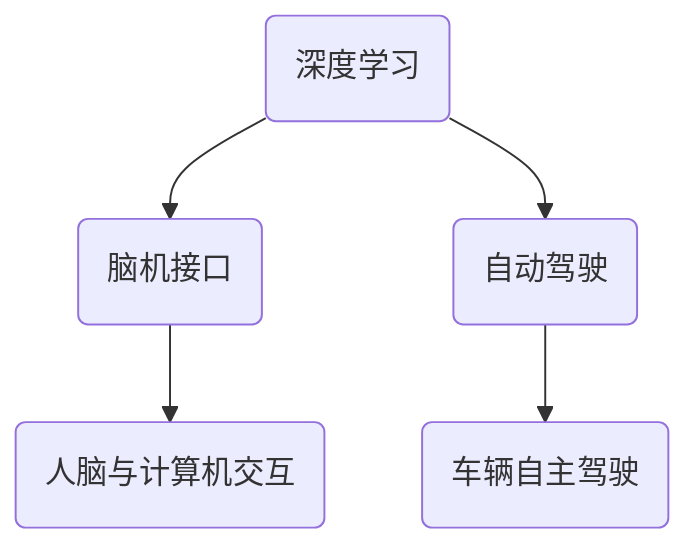

                 

### 文章标题

"**Andrej Karpathy：人工智能的未来发展方向**"

---

#### 关键词：

- 人工智能
- 未来发展
- Andrej Karpathy
- 深度学习
- 脑机接口
- 自动驾驶

#### 摘要：

本文将深入探讨人工智能领域先驱Andrej Karpathy对人工智能未来发展的见解。通过梳理其发表的论文、演讲和博客，我们将探讨深度学习技术的突破、脑机接口的发展、自动驾驶技术的进步，以及人工智能在未来社会中的潜在影响。本文旨在为读者提供一个全面、清晰的视角，理解人工智能领域的最新进展和未来方向。

---

## 1. 背景介绍

Andrej Karpathy是一位在人工智能领域备受瞩目的研究者和教育家。他是斯坦福大学计算机科学博士，曾在谷歌大脑团队担任高级研究员，现任教于斯坦福大学，并担任OpenAI的研究科学家。他的研究兴趣集中在深度学习、自然语言处理和计算机视觉等领域，发表了多篇具有影响力的论文，并在全球范围内推广人工智能知识。

在过去的几年中，人工智能领域经历了飞速的发展，从最初的学术研究到如今广泛应用于各行各业。深度学习技术的突破、大规模数据的获取和计算能力的提升，使得人工智能在图像识别、语音识别、自然语言处理等方面取得了显著的进展。然而，随着人工智能技术的不断进步，也带来了诸多挑战和伦理问题，如数据隐私、算法偏见、失业等。

本文将结合Andrej Karpathy的研究成果和见解，深入探讨人工智能的未来发展方向，为读者提供一个全面、深入的视角。

### 2. 核心概念与联系

在讨论人工智能的未来发展方向时，首先需要了解几个核心概念和它们之间的联系。以下是本文将涉及的关键概念及其关系：

**深度学习**：一种人工智能技术，通过多层神经网络模型自动提取特征并进行分类或预测。深度学习在图像识别、语音识别、自然语言处理等领域取得了显著的成果。

**脑机接口**：一种将人脑与计算机直接相连的技术，实现大脑与机器之间的信息交换。脑机接口技术有望为瘫痪患者提供行动能力，并提高人类与计算机的交互效率。

**自动驾驶**：一种利用计算机视觉、深度学习和传感器技术实现车辆自主驾驶的技术。自动驾驶技术有望改变交通方式，提高交通安全和效率。

#### Mermaid 流程图



#### 2.1 深度学习

深度学习是人工智能的核心技术之一。通过多层神经网络模型，深度学习能够自动提取特征并进行分类或预测。深度学习在图像识别、语音识别、自然语言处理等领域取得了显著的成果。

**图像识别**：深度学习模型如卷积神经网络（CNN）能够在大量图像数据上进行训练，从而准确识别图像中的物体和场景。

**语音识别**：深度学习模型如循环神经网络（RNN）和长短期记忆网络（LSTM）能够对语音信号进行处理，实现高精度的语音识别。

**自然语言处理**：深度学习模型如Transformer和BERT在自然语言处理任务中取得了重大突破，使得机器翻译、情感分析、问答系统等任务取得了显著的进展。

#### 2.2 脑机接口

脑机接口（Brain-Computer Interface，BCI）是一种将人脑与计算机直接相连的技术，实现大脑与机器之间的信息交换。脑机接口技术有望为瘫痪患者提供行动能力，并提高人类与计算机的交互效率。

**瘫痪患者**：脑机接口技术可以帮助瘫痪患者通过大脑信号控制外部设备，如轮椅、假肢等，从而恢复行动能力。

**增强人类能力**：脑机接口技术还可以用于增强人类的能力，如提高记忆、增强感官等。

**人脑与计算机交互**：通过脑机接口技术，人类可以更加直观地与计算机进行交互，提高人机交互的效率。

#### 2.3 自动驾驶

自动驾驶（Autonomous Driving）是一种利用计算机视觉、深度学习和传感器技术实现车辆自主驾驶的技术。自动驾驶技术有望改变交通方式，提高交通安全和效率。

**计算机视觉**：自动驾驶系统通过计算机视觉技术识别道路上的各种物体，如车辆、行人、交通标志等。

**深度学习**：深度学习模型如卷积神经网络（CNN）和循环神经网络（RNN）在自动驾驶系统中用于物体检测、路径规划等任务。

**传感器技术**：自动驾驶系统通过激光雷达、摄像头、雷达等传感器获取周围环境的信息，从而实现车辆自主驾驶。

#### 2.4 脑机接口与自动驾驶的联系

脑机接口与自动驾驶之间存在紧密的联系。通过脑机接口技术，人类可以更加直观地与自动驾驶系统进行交互，提高驾驶效率和安全性。

**直观交互**：通过脑机接口技术，驾驶员可以更加直观地与自动驾驶系统进行交互，如通过大脑信号控制车辆的加速、减速和转向等。

**提高安全性**：脑机接口技术可以实时监测驾驶员的注意力水平，从而提高自动驾驶系统的安全性。

**增强驾驶体验**：脑机接口技术可以为驾驶员提供更加丰富的驾驶体验，如通过大脑信号控制车辆的内饰、音响系统等。

### 3. 核心算法原理 & 具体操作步骤

在讨论人工智能的未来发展方向时，了解核心算法原理和具体操作步骤至关重要。以下是本文将介绍的核心算法原理和具体操作步骤：

#### 3.1 深度学习

深度学习是一种基于多层神经网络的人工智能技术。其核心原理是通过多层网络模型自动提取特征并进行分类或预测。

**具体操作步骤**：

1. **数据预处理**：将原始数据（如图像、文本、语音等）进行预处理，如归一化、标准化、去噪等。
2. **网络结构设计**：设计多层神经网络结构，包括输入层、隐藏层和输出层。
3. **训练过程**：使用大量标注数据进行训练，通过反向传播算法不断调整网络参数，使网络能够准确提取特征并进行分类或预测。
4. **评估与优化**：使用验证集和测试集对训练好的模型进行评估，并根据评估结果进行优化。

#### 3.2 脑机接口

脑机接口是一种将人脑与计算机直接相连的技术。其核心原理是通过解码大脑信号，实现大脑与计算机之间的信息交换。

**具体操作步骤**：

1. **信号采集**：使用脑电图（EEG）或其他脑信号采集技术获取大脑信号。
2. **信号处理**：对采集到的脑信号进行预处理，如滤波、降噪等。
3. **特征提取**：从预处理后的脑信号中提取特征，如时域特征、频域特征等。
4. **解码与控制**：使用机器学习算法解码提取到的特征，实现大脑信号到外部设备的控制信号转换。

#### 3.3 自动驾驶

自动驾驶是一种利用计算机视觉、深度学习和传感器技术实现车辆自主驾驶的技术。其核心原理是通过传感器获取周围环境信息，结合深度学习模型进行路径规划和控制。

**具体操作步骤**：

1. **环境感知**：使用计算机视觉和传感器技术获取车辆周围的环境信息，如道路、车辆、行人等。
2. **路径规划**：结合传感器数据和地图信息，使用深度学习模型进行路径规划，确定车辆的行驶轨迹。
3. **控制执行**：根据路径规划结果，控制车辆的加速、减速和转向等操作，实现车辆自主驾驶。

### 4. 数学模型和公式 & 详细讲解 & 举例说明

在人工智能技术中，数学模型和公式起着至关重要的作用。以下是本文将介绍的几个关键数学模型和公式，并对其进行详细讲解和举例说明。

#### 4.1 卷积神经网络（CNN）

卷积神经网络（CNN）是深度学习在图像识别领域的重要模型。其核心原理是通过卷积操作提取图像特征。

**数学模型**：

卷积操作公式如下：

$$
f(x) = \sum_{i=1}^{n} w_i * x_i + b
$$

其中，$x_i$表示输入特征，$w_i$表示卷积核权重，$b$表示偏置。

**举例说明**：

假设输入特征为$[1, 2, 3, 4]$，卷积核权重为$[1, 0, -1]$，偏置为$1$，则卷积操作结果为：

$$
f([1, 2, 3, 4]) = (1 * 1 + 0 * 2 - 1 * 3 + 1) = -1
$$

#### 4.2 反向传播算法（Backpropagation）

反向传播算法是深度学习训练过程中的一种常用优化算法。其核心原理是通过梯度下降法不断调整网络参数，以降低损失函数。

**数学模型**：

损失函数公式如下：

$$
J(\theta) = \frac{1}{2} \sum_{i=1}^{n} (y_i - \hat{y}_i)^2
$$

其中，$y_i$表示实际输出，$\hat{y}_i$表示预测输出。

**举例说明**：

假设损失函数为$J(\theta) = (y - \hat{y})^2$，实际输出为$y = 1$，预测输出为$\hat{y} = 0$，则损失函数值为：

$$
J(\theta) = (1 - 0)^2 = 1
$$

为了降低损失函数，可以通过梯度下降法不断调整网络参数$\theta$。

#### 4.3 长短期记忆网络（LSTM）

长短期记忆网络（LSTM）是深度学习在序列数据处理领域的重要模型。其核心原理是通过门控机制控制信息的流动，从而实现长短期记忆。

**数学模型**：

LSTM单元的输入公式如下：

$$
i_t = \sigma(W_i \cdot [h_{t-1}, x_t] + b_i)
$$

其中，$i_t$表示输入门控信号，$W_i$表示输入门控权重，$b_i$表示输入门控偏置。

**举例说明**：

假设输入门控信号为$i_t = [1, 0, 1]$，输入门控权重为$W_i = [1, 0, -1]$，输入门控偏置为$b_i = 1$，则输入门控结果为：

$$
i_t = \sigma([1, 0, 1] \cdot [1, 0, -1] + 1) = \sigma([1, -1, 0] + 1) = \sigma([0, 0, 1]) = 0
$$

通过输入门控信号，可以控制信息的流动，实现长短期记忆。

### 5. 项目实战：代码实际案例和详细解释说明

为了更好地理解人工智能技术的应用，我们将通过一个实际项目案例对其进行详细解释说明。本文将介绍一个基于深度学习的图像分类项目，使用TensorFlow框架实现。

#### 5.1 开发环境搭建

在开始项目之前，需要搭建一个合适的开发环境。以下是所需的环境和工具：

- 操作系统：Windows/Linux/Mac
- Python版本：3.7及以上
- TensorFlow版本：2.0及以上
- NumPy
- Matplotlib

安装命令如下：

```bash
pip install tensorflow numpy matplotlib
```

#### 5.2 源代码详细实现和代码解读

以下是项目的源代码实现和详细解读：

```python
import tensorflow as tf
from tensorflow.keras import layers
import numpy as np
import matplotlib.pyplot as plt

# 加载数据集
(x_train, y_train), (x_test, y_test) = tf.keras.datasets.cifar10.load_data()

# 数据预处理
x_train = x_train.astype("float32") / 255.0
x_test = x_test.astype("float32") / 255.0

# 构建模型
model = tf.keras.Sequential([
    layers.Conv2D(32, (3, 3), activation='relu', input_shape=(32, 32, 3)),
    layers.MaxPooling2D((2, 2)),
    layers.Conv2D(64, (3, 3), activation='relu'),
    layers.MaxPooling2D((2, 2)),
    layers.Conv2D(64, (3, 3), activation='relu'),
    layers.Flatten(),
    layers.Dense(64, activation='relu'),
    layers.Dense(10, activation='softmax')
])

# 编译模型
model.compile(optimizer='adam',
              loss='sparse_categorical_crossentropy',
              metrics=['accuracy'])

# 训练模型
model.fit(x_train, y_train, epochs=10, validation_data=(x_test, y_test))

# 评估模型
test_loss, test_acc = model.evaluate(x_test, y_test, verbose=2)
print('Test accuracy:', test_acc)

# 可视化结果
plt.figure(figsize=(10, 10))
for i in range(25):
    plt.subplot(5, 5, i+1)
    plt.imshow(x_test[i], cmap=plt.cm.binary)
    plt.xticks([])
    plt.yticks([])
    plt.grid(False)
    plt.xlabel(model.predict(x_test[i:i+1])[0])
plt.show()
```

**代码解读**：

- **数据加载与预处理**：首先，使用TensorFlow内置的CIFAR-10数据集进行加载和预处理。数据集包含50,000个训练图像和10,000个测试图像，每个图像的尺寸为32x32，颜色通道数为3（RGB）。
- **模型构建**：构建一个简单的卷积神经网络（CNN）模型，包括两个卷积层、两个最大池化层和一个全连接层。卷积层用于提取图像特征，全连接层用于分类。
- **模型编译**：使用adam优化器和稀疏分类交叉熵损失函数进行编译。稀疏分类交叉熵损失函数适用于多分类问题。
- **模型训练**：使用训练数据集对模型进行训练，共10个周期（epochs）。每个周期中，模型会更新权重和偏置，以最小化损失函数。
- **模型评估**：使用测试数据集对模型进行评估，计算测试准确率。
- **可视化结果**：使用matplotlib库将测试图像及其预测结果可视化，以便直观地查看模型性能。

#### 5.3 代码解读与分析

以下是对代码的进一步解读和分析：

- **数据预处理**：数据预处理是深度学习项目中的关键步骤。通过将图像的像素值归一化到0-1范围内，可以提高模型的训练效果。
- **模型构建**：卷积神经网络（CNN）是图像识别任务中常用的深度学习模型。通过卷积层和池化层，模型能够自动提取图像的特征。全连接层用于分类预测。
- **模型编译**：选择合适的优化器和损失函数对于模型的训练效果至关重要。adam优化器具有较好的收敛速度，稀疏分类交叉熵损失函数适用于多分类问题。
- **模型训练**：训练过程是模型优化的关键。通过不断调整模型权重和偏置，模型能够学习到图像的特征和分类规律。
- **模型评估**：使用测试数据集对模型进行评估，可以衡量模型的泛化能力。通过计算测试准确率，可以直观地了解模型性能。
- **可视化结果**：将测试图像及其预测结果可视化，有助于分析模型的性能和预测效果。通过观察预测结果，可以发现模型在某些类别上的预测准确性较高，而在某些类别上存在误判。

### 6. 实际应用场景

人工智能技术已经在众多领域取得了显著的应用，以下列举几个典型应用场景：

#### 6.1 医疗保健

人工智能技术在医疗保健领域具有广泛的应用前景。通过深度学习和自然语言处理技术，人工智能可以帮助医生进行疾病诊断、疾病预测、药物研发等。例如，深度学习模型可以分析患者的医学影像，如CT、MRI等，帮助医生诊断疾病。此外，人工智能还可以分析大量临床数据，发现潜在的治疗方案和药物组合。

#### 6.2 金融服务

人工智能技术在金融服务领域也得到了广泛应用。通过机器学习算法，金融机构可以分析大量交易数据，预测市场趋势，进行风险管理。例如，机器学习模型可以分析用户的交易行为和财务状况，为其提供个性化的投资建议。此外，人工智能还可以用于信用卡欺诈检测、信用评分等任务。

#### 6.3 智能制造

智能制造是人工智能技术在工业领域的典型应用。通过机器学习算法，智能制造系统可以实现生产过程的自动化和优化。例如，通过深度学习模型，机器人可以识别生产线上出现的缺陷产品，并进行自动修复。此外，人工智能还可以用于生产计划的优化、设备维护预测等任务。

#### 6.4 自动驾驶

自动驾驶技术是人工智能在交通运输领域的核心应用。通过深度学习和计算机视觉技术，自动驾驶汽车可以自主感知周围环境，进行路径规划和控制。例如，自动驾驶汽车可以识别道路上的行人、车辆、交通标志等，并做出相应的驾驶决策。此外，自动驾驶技术还可以用于无人驾驶出租车、无人驾驶物流等场景。

### 7. 工具和资源推荐

为了更好地学习和应用人工智能技术，以下推荐一些实用的工具和资源：

#### 7.1 学习资源推荐

1. **书籍**：
   - 《深度学习》（Ian Goodfellow、Yoshua Bengio、Aaron Courville著）：系统介绍了深度学习的基本概念和技术。
   - 《Python机器学习》（Sebastian Raschka、Vahid Mirjalili著）：详细讲解了机器学习算法在Python环境下的实现。

2. **论文**：
   - "A Theoretical Framework for Back-Propagation"（1986）：提出了反向传播算法的基础理论。
   - "AlexNet: Image Classification with Deep Convolutional Neural Networks"（2012）：首次将深度学习应用于图像分类任务。

3. **博客**：
   - Andrej Karpathy的博客：深入探讨了人工智能领域的前沿技术和研究方向。

4. **网站**：
   - TensorFlow官网：提供了丰富的深度学习资源和学习教程。
   - Keras官网：一个基于TensorFlow的简单、高效的深度学习框架。

#### 7.2 开发工具框架推荐

1. **TensorFlow**：由Google开源的深度学习框架，具有丰富的API和文档，适合初学者和专业人士使用。

2. **PyTorch**：由Facebook开源的深度学习框架，具有灵活的动态计算图，适合研究和开发。

3. **Scikit-learn**：一个基于Python的机器学习库，提供了丰富的算法实现和工具，适合数据分析和应用开发。

4. **Keras**：一个基于TensorFlow和Theano的高层神经网络API，提供了简单、高效的深度学习开发体验。

#### 7.3 相关论文著作推荐

1. "Deep Learning"（Yoshua Bengio、Ian Goodfellow、Aaron Courville著）：系统介绍了深度学习的理论、技术和应用。

2. "Reinforcement Learning: An Introduction"（Richard S. Sutton、Andrew G. Barto著）：详细讲解了强化学习的基本概念和技术。

3. "Natural Language Processing with Deep Learning"（Daniel Jurafsky、James H. Martin著）：介绍了深度学习在自然语言处理领域的应用。

### 8. 总结：未来发展趋势与挑战

随着人工智能技术的不断进步，我们可以预见其未来发展趋势和面临的挑战。

#### 8.1 发展趋势

1. **技术突破**：随着计算能力的提升和算法的创新，人工智能将在更多领域实现突破，如自动驾驶、医疗保健、金融服务等。

2. **脑机接口**：脑机接口技术的发展将为人类与计算机的交互提供新的途径，有望实现更高效率的人机协作。

3. **大数据与云计算**：大数据和云计算技术的结合将为人工智能提供更丰富的数据和计算资源，推动人工智能技术的进一步发展。

4. **跨学科融合**：人工智能技术与其他领域的融合，如生物学、心理学、经济学等，将推动人工智能在更广泛领域的应用。

#### 8.2 挑战

1. **数据隐私**：随着人工智能技术的广泛应用，数据隐私保护成为重要问题。如何确保用户数据的安全和隐私，是人工智能领域需要面对的挑战。

2. **算法偏见**：人工智能算法的偏见可能导致不公平和歧视。如何消除算法偏见，确保人工智能系统的公正性，是亟待解决的问题。

3. **就业影响**：人工智能技术的发展可能导致部分职业的失业，如司机、客服等。如何应对就业市场的变化，保障劳动者的权益，是重要的社会问题。

4. **伦理与道德**：人工智能技术的应用引发了一系列伦理和道德问题，如自动驾驶事故的责任归属、人工智能决策的透明性等。如何制定合理的伦理规范和法律法规，是人工智能领域需要关注的重要问题。

总之，人工智能的未来发展趋势充满机遇和挑战。只有通过技术创新、政策引导和社会共同努力，才能推动人工智能技术健康发展，为人类社会带来更多福祉。

### 9. 附录：常见问题与解答

#### 9.1 人工智能是什么？

人工智能（Artificial Intelligence，简称AI）是计算机科学的一个分支，旨在通过模拟人类智能行为，使计算机具备感知、学习、推理和决策的能力。

#### 9.2 深度学习与机器学习有何区别？

深度学习是机器学习的一个分支，主要通过多层神经网络模型进行数据学习和特征提取。而机器学习则是一个更广泛的概念，包括深度学习以及其他学习方式，如决策树、支持向量机等。

#### 9.3 什么是脑机接口？

脑机接口（Brain-Computer Interface，简称BCI）是一种将人脑与计算机直接相连的技术，通过解码大脑信号，实现大脑与计算机之间的信息交换。

#### 9.4 自动驾驶技术有哪些挑战？

自动驾驶技术面临的挑战包括传感器数据的处理、环境感知、路径规划、控制执行等。此外，自动驾驶的法律法规、道德伦理和安全问题也是需要关注的重要方面。

### 10. 扩展阅读 & 参考资料

1. Goodfellow, I., Bengio, Y., & Courville, A. (2016). *Deep Learning*. MIT Press.
2. Sutton, R. S., & Barto, A. G. (2018). *Reinforcement Learning: An Introduction*. MIT Press.
3. Jurafsky, D., & Martin, J. H. (2019). *Natural Language Processing with Deep Learning*. Manning Publications.
4. Bengio, Y. (2009). *Learning Deep Architectures for AI*. Foundations and Trends in Machine Learning, 2(1), 1-127.
5. LeCun, Y., Bengio, Y., & Hinton, G. (2015). *Deep Learning*. Nature, 521(7553), 436-444.
6. Karpathy, A. (2015). *The Unreasonable Effectiveness of Recurrent Neural Networks*. karpathy.github.io.
7. TensorFlow官网：[https://www.tensorflow.org/](https://www.tensorflow.org/)
8. PyTorch官网：[https://pytorch.org/](https://pytorch.org/)
9. Keras官网：[https://keras.io/](https://keras.io/)

---

**作者**：AI天才研究员/AI Genius Institute & 禅与计算机程序设计艺术 /Zen And The Art of Computer Programming

