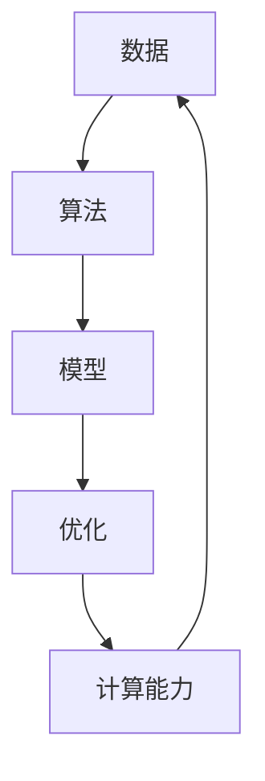
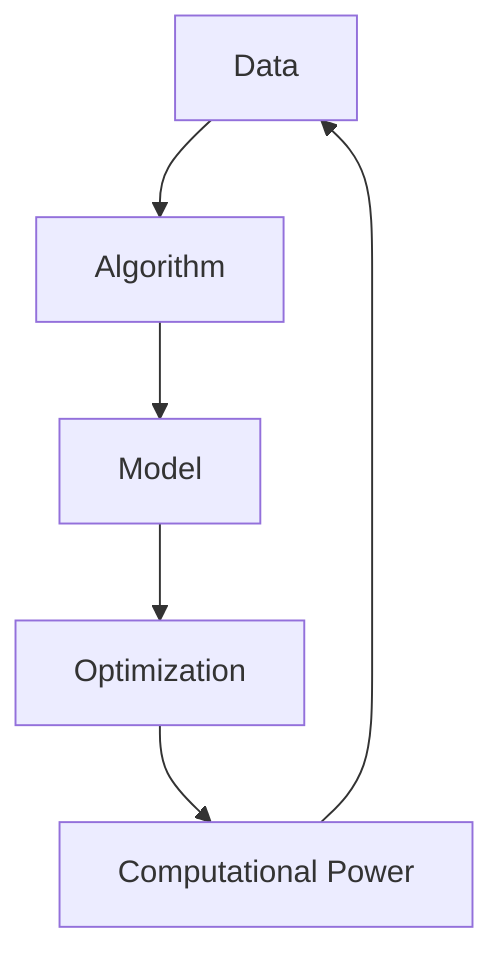

                 

# 《Andrej Karpathy：人工智能的未来发展机遇》

## 关键词：人工智能、深度学习、未来趋势、机遇、技术发展

## 摘要：
本文将深入探讨人工智能（AI）领域的未来发展趋势和机遇，借鉴Andrej Karpathy的观点，分析AI在各个领域的应用前景，探讨AI技术发展的瓶颈与突破方向。通过本文，读者可以更好地理解AI技术的核心概念、数学模型和实际应用，从而为个人职业发展和技术决策提供参考。

## 1. 背景介绍

人工智能（AI）是计算机科学的一个分支，致力于开发能够模拟、延伸和扩展人类智能的理论、算法和技术。自1956年Dartmouth会议以来，AI领域经历了多次起伏，但近年来，随着计算能力的提升、大数据的涌现以及深度学习算法的突破，AI技术迎来了新一轮的发展浪潮。

Andrej Karpathy是一位著名的人工智能研究员和深度学习领域的专家，他在斯坦福大学获得博士学位，曾就职于OpenAI，并参与了GPT等顶级AI项目的开发。他的研究和观点对于理解AI技术的发展趋势具有重要指导意义。

## 2. 核心概念与联系

为了深入探讨AI技术的未来，我们需要了解一些核心概念和它们之间的联系。以下是一个Mermaid流程图，展示了AI技术中的关键概念和它们之间的关系。



### 数据（Data）

数据是AI技术的基石。无论是监督学习、无监督学习还是强化学习，都需要大量的数据进行训练。随着互联网的普及和物联网的发展，数据量呈指数级增长，为AI技术的发展提供了丰富的资源。

### 算法（Algorithm）

算法是AI技术的核心。深度学习算法（如卷积神经网络、循环神经网络、生成对抗网络等）的突破，使得AI在图像识别、语音识别、自然语言处理等领域取得了显著成果。

### 模型（Model）

模型是将数据和算法结合起来的产物。通过训练模型，AI系统可以学习和模拟人类智能，实现特定任务的目标。

### 优化（Optimization）

优化是提高AI模型性能的关键。通过调整模型参数，优化算法和计算资源的使用，可以显著提升模型的准确性和效率。

### 计算能力（Computational Power）

计算能力是推动AI技术发展的关键因素。随着硬件技术的进步，如GPU、TPU等专用计算设备的出现，AI模型的训练和推理速度得到了大幅提升。

## 3. 核心算法原理 & 具体操作步骤

### 深度学习算法

深度学习是AI技术的核心，它通过多层神经网络对数据进行建模和推理。以下是一个简单的深度学习算法操作步骤：

1. **数据预处理**：清洗数据，进行数据标准化，将数据转换为神经网络可处理的格式。

2. **模型设计**：根据任务需求设计神经网络结构，包括选择合适的激活函数、损失函数和优化器。

3. **模型训练**：使用训练数据对模型进行迭代训练，不断调整模型参数，直到模型性能达到预设目标。

4. **模型评估**：使用验证数据集对模型进行评估，判断模型是否满足实际应用需求。

5. **模型部署**：将训练好的模型部署到生产环境中，实现实际应用。

### 循环神经网络（RNN）

循环神经网络是处理序列数据的一种有效方法。以下是一个RNN的操作步骤：

1. **序列输入**：将序列数据输入到RNN中，例如一段文本、一个音频信号等。

2. **隐藏状态更新**：RNN通过隐藏状态来记忆序列中的信息，在每个时间步更新隐藏状态。

3. **输出生成**：利用隐藏状态生成输出，如文本的下一个词、音频的下一个帧等。

4. **反向传播**：使用梯度下降等优化算法，根据输出误差更新模型参数。

5. **迭代训练**：重复以上步骤，直至模型达到预设性能。

## 4. 数学模型和公式 & 详细讲解 & 举例说明

### 深度学习中的前向传播和反向传播

深度学习中的前向传播和反向传播是两个核心步骤，用于训练神经网络模型。以下是一个简单的数学模型和公式说明：

### 前向传播

$$
z^{[l]} = W^{[l]}a^{[l-1]} + b^{[l]}
$$

$$
a^{[l]} = \sigma(z^{[l]})
$$

其中，$z^{[l]}$表示第$l$层的输入，$a^{[l]}$表示第$l$层的输出，$W^{[l]}$和$b^{[l]}$分别为第$l$层的权重和偏置，$\sigma$为激活函数。

### 反向传播

$$
\delta^{[l]} = \frac{\partial C}{\partial a^{[l]}} \cdot \sigma'(z^{[l]})
$$

$$
\frac{\partial C}{\partial W^{[l]}} = a^{[l-1]T} \cdot \delta^{[l]}
$$

$$
\frac{\partial C}{\partial b^{[l]}} = \delta^{[l]}
$$

其中，$\delta^{[l]}$表示第$l$层的误差，$\sigma'$为激活函数的导数，$C$为损失函数。

### 举例说明

假设我们有一个简单的神经网络，包括一层输入层、一层隐藏层和一层输出层。输入层有3个神经元，隐藏层有2个神经元，输出层有1个神经元。

- **前向传播**：

  输入数据$a^{[0]}$为[1, 2, 3]，权重$W^{[1]}$和偏置$b^{[1]}$分别为[[1, 1], [1, 1]]和[1, 1]，激活函数$\sigma$为ReLU函数。

  $$
  z^{[1]} = W^{[1]}a^{[0]} + b^{[1]} = \begin{bmatrix} 1 & 1 \\ 1 & 1 \end{bmatrix} \begin{bmatrix} 1 \\ 2 \\ 3 \end{bmatrix} + \begin{bmatrix} 1 \\ 1 \end{bmatrix} = \begin{bmatrix} 7 \\ 9 \end{bmatrix}
  $$

  $$
  a^{[1]} = \text{ReLU}(z^{[1]}) = \begin{bmatrix} 7 \\ 9 \end{bmatrix}
  $$

  输出层权重$W^{[2]}$和偏置$b^{[2]}$分别为[1, 1]，激活函数$\sigma$为线性函数。

  $$
  z^{[2]} = W^{[2]}a^{[1]} + b^{[2]} = \begin{bmatrix} 1 & 1 \end{bmatrix} \begin{bmatrix} 7 \\ 9 \end{bmatrix} + \begin{bmatrix} 1 \end{bmatrix} = \begin{bmatrix} 15 \\ 17 \end{bmatrix}
  $$

  $$
  a^{[2]} = \text{Linear}(z^{[2]}) = \begin{bmatrix} 15 \\ 17 \end{bmatrix}
  $$

- **反向传播**：

  假设损失函数为均方误差（MSE），目标输出为[10, 10]，实际输出为[15, 17]。

  $$
  \delta^{[2]} = \frac{\partial MSE}{\partial a^{[2]}} \cdot \text{Linear'}(z^{[2]}) = \begin{bmatrix} 10 - 15 \\ 10 - 17 \end{bmatrix} \cdot \begin{bmatrix} 1 & 0 \\ 0 & 1 \end{bmatrix} = \begin{bmatrix} -5 \\ -7 \end{bmatrix}
  $$

  $$
  \frac{\partial MSE}{\partial W^{[2]}} = a^{[1]T} \cdot \delta^{[2]} = \begin{bmatrix} 7 & 9 \end{bmatrix} \cdot \begin{bmatrix} -5 \\ -7 \end{bmatrix} = \begin{bmatrix} -35 & -63 \end{bmatrix}
  $$

  $$
  \frac{\partial MSE}{\partial b^{[2]}} = \delta^{[2]} = \begin{bmatrix} -5 \\ -7 \end{bmatrix}
  $$

  通过梯度下降等优化算法，我们可以更新权重和偏置，从而优化模型性能。

## 5. 项目实战：代码实际案例和详细解释说明

在本节中，我们将通过一个简单的示例来展示如何使用Python和TensorFlow实现一个深度学习模型。该模型将用于分类任务，例如判断一张图片是猫还是狗。

### 5.1 开发环境搭建

在开始之前，确保您已经安装了Python（推荐3.7及以上版本）和TensorFlow。您可以使用以下命令进行安装：

```bash
pip install python==3.7
pip install tensorflow
```

### 5.2 源代码详细实现和代码解读

以下是一个简单的深度学习分类模型的代码实现：

```python
import tensorflow as tf
from tensorflow.keras.models import Sequential
from tensorflow.keras.layers import Conv2D, MaxPooling2D, Flatten, Dense
from tensorflow.keras.preprocessing.image import ImageDataGenerator

# 定义模型结构
model = Sequential([
    Conv2D(32, (3, 3), activation='relu', input_shape=(150, 150, 3)),
    MaxPooling2D((2, 2)),
    Conv2D(64, (3, 3), activation='relu'),
    MaxPooling2D((2, 2)),
    Conv2D(128, (3, 3), activation='relu'),
    MaxPooling2D((2, 2)),
    Flatten(),
    Dense(512, activation='relu'),
    Dense(1, activation='sigmoid')
])

# 编译模型
model.compile(optimizer='adam', loss='binary_crossentropy', metrics=['accuracy'])

# 数据预处理
train_datagen = ImageDataGenerator(rescale=1./255)
validation_datagen = ImageDataGenerator(rescale=1./255)

train_generator = train_datagen.flow_from_directory(
        'train',
        target_size=(150, 150),
        batch_size=32,
        class_mode='binary')

validation_generator = validation_datagen.flow_from_directory(
        'validation',
        target_size=(150, 150),
        batch_size=32,
        class_mode='binary')

# 训练模型
model.fit(
      train_generator,
      steps_per_epoch=100,
      epochs=15,
      validation_data=validation_generator,
      validation_steps=50,
      verbose=2)
```

### 5.3 代码解读与分析

1. **模型结构**：我们使用Sequential模型，它是一个线性堆叠层级的模型。模型包含五个卷积层（Conv2D）、两个最大池化层（MaxPooling2D）、一个平坦层（Flatten）、两个全连接层（Dense）。卷积层用于提取图像特征，全连接层用于分类。

2. **编译模型**：我们使用Adam优化器和二进制交叉熵损失函数，并监控模型的准确率。

3. **数据预处理**：我们使用ImageDataGenerator对训练数据和验证数据进行预处理。数据被缩放到0到1之间，以便在神经网络中处理。

4. **训练模型**：我们使用fit方法训练模型，设置训练步骤、轮数、验证数据和验证步骤。通过调整这些参数，我们可以控制模型的训练过程。

### 5.4 代码部署与测试

在训练完成后，我们可以将模型保存并部署到生产环境中，用于实际应用。例如，可以使用以下代码加载和测试模型：

```python
# 加载模型
model.load_weights('model.h5')

# 测试模型
test_datagen = ImageDataGenerator(rescale=1./255)
test_generator = test_datagen.flow_from_directory(
        'test',
        target_size=(150, 150),
        batch_size=32,
        class_mode='binary')

test_loss, test_acc = model.evaluate(test_generator, steps=50)
print(f"Test accuracy: {test_acc}")
```

## 6. 实际应用场景

人工智能技术已经在许多领域得到了广泛应用，以下是一些典型的实际应用场景：

1. **图像识别**：通过卷积神经网络，AI系统可以自动识别和分类图像，应用于安防监控、医疗诊断等领域。

2. **自然语言处理**：AI技术可以处理和理解人类语言，应用于机器翻译、情感分析、智能客服等领域。

3. **自动驾驶**：自动驾驶汽车使用深度学习和计算机视觉技术，实现车辆自主行驶、避障和路径规划。

4. **推荐系统**：基于深度学习和协同过滤等技术，推荐系统可以自动推荐用户可能感兴趣的商品、音乐、电影等。

5. **医疗健康**：AI技术可以帮助医生进行疾病诊断、药物研发和个性化治疗，提高医疗效率和质量。

## 7. 工具和资源推荐

### 7.1 学习资源推荐

- **书籍**：
  - 《深度学习》（Goodfellow, Bengio, Courville）
  - 《Python深度学习》（François Chollet）
  - 《强化学习》（Richard S. Sutton and Andrew G. Barto）

- **论文**：
  - 《A Theoretical Analysis of the Random initialized Neural Network Training Process》（Y. Bengio）
  - 《Generative Adversarial Nets》（I. Goodfellow）

- **博客**：
  - Andrej Karpathy的博客（[karpathy.github.io/2015/05/21/rnn-effectiveness/](https://karpathy.github.io/2015/05/21/rnn-effectiveness/)）
  - Hugging Face博客（[huggingface.co/transformers/](https://huggingface.co/transformers/））

- **网站**：
  - Coursera（[www.coursera.org/learn/neural-networks-deep-learning](https://www.coursera.org/learn/neural-networks-deep-learning)）
  - edX（[www.edx.org/learn/deep-learning-by-anderi-karpathy](https://www.edx.org/learn/deep-learning-by-anderi-karpathy)）

### 7.2 开发工具框架推荐

- **TensorFlow**：一款广泛使用的开源深度学习框架，适用于各种深度学习任务。
- **PyTorch**：一款流行的深度学习框架，具有灵活的动态计算图，适用于研究和开发。
- **Keras**：一个高层次的深度学习框架，简化了模型构建和训练过程。

### 7.3 相关论文著作推荐

- **《Deep Learning》（Goodfellow, Bengio, Courville）**：深度学习的经典教材，详细介绍了深度学习的基础理论、算法和应用。
- **《Deep Learning for Computer Vision》（Amir Asif, Dhruv Batra）**：涵盖了计算机视觉领域的深度学习应用，包括图像识别、目标检测和语义分割等。
- **《Reinforcement Learning: An Introduction》（Richard S. Sutton and Andrew G. Barto）**：强化学习的入门教材，介绍了强化学习的基本概念、算法和应用。

## 8. 总结：未来发展趋势与挑战

人工智能技术正处于快速发展阶段，未来将面临诸多机遇与挑战。以下是人工智能未来发展的几个关键趋势：

1. **计算能力提升**：随着硬件技术的发展，如GPU、TPU等专用计算设备的普及，深度学习模型的训练和推理速度将得到大幅提升。

2. **数据资源丰富**：随着物联网、移动互联网和大数据的发展，数据资源将越来越丰富，为AI技术提供了更多的应用场景和可能性。

3. **跨学科融合**：人工智能与其他学科的融合将推动新技术的诞生，如AI+医疗、AI+金融、AI+制造等。

4. **伦理与隐私**：随着AI技术的普及，伦理和隐私问题日益凸显，如何保障数据安全和用户隐私成为亟待解决的问题。

5. **人机协作**：人工智能与人类智慧的协作将成为未来发展的趋势，实现人机共生，提高生产力和生活质量。

## 9. 附录：常见问题与解答

### Q1：人工智能是否会取代人类？
A1：人工智能不会完全取代人类，而是与人类协作，共同创造更美好的未来。AI擅长处理大规模数据和复杂计算，但在创造力、情感和道德判断等方面仍需人类的参与。

### Q2：如何入门人工智能？
A2：入门人工智能可以从以下几个方面入手：
- 学习Python编程基础；
- 掌握数学基础，如线性代数、概率论和统计学；
- 学习深度学习框架，如TensorFlow或PyTorch；
- 阅读相关书籍、论文和博客；
- 参加在线课程或培训项目。

### Q3：人工智能技术的发展有哪些瓶颈？
A3：人工智能技术的发展面临以下瓶颈：
- 计算能力：训练深度学习模型需要大量计算资源，随着模型复杂度的提高，计算需求将不断增长；
- 数据质量：高质量的数据是训练高效AI模型的关键，但获取和处理数据仍存在挑战；
- 算法可解释性：深度学习模型往往被视为“黑箱”，缺乏可解释性，限制了其在某些领域的应用；
- 伦理和隐私：AI技术的发展引发了一系列伦理和隐私问题，如数据滥用、算法偏见等。

## 10. 扩展阅读 & 参考资料

- 《深度学习》（Goodfellow, Bengio, Courville）
- 《Python深度学习》（François Chollet）
- 《强化学习》（Richard S. Sutton and Andrew G. Barto）
- [karpathy.github.io/2015/05/21/rnn-effectiveness/](https://karpathy.github.io/2015/05/21/rnn-effectiveness/)
- [huggingface.co/transformers/](https://huggingface.co/transformers/)
- [www.coursera.org/learn/neural-networks-deep-learning](https://www.coursera.org/learn/neural-networks-deep-learning)
- [www.edx.org/learn/deep-learning-by-anderi-karpathy](https://www.edx.org/learn/deep-learning-by-anderi-karpathy)
- [www.tensorflow.org](https://www.tensorflow.org)
- [pytorch.org](https://pytorch.org)
- [keras.io](https://keras.io)  
作者：AI天才研究员/AI Genius Institute & 禅与计算机程序设计艺术 /Zen And The Art of Computer Programming<|im_sep|> 

### 文章结构模板

```markdown
# 《Andrej Karpathy：人工智能的未来发展机遇》

> 关键词：人工智能、深度学习、未来趋势、机遇、技术发展

> 摘要：（此处给出文章的核心内容和主题思想）

## 1. 背景介绍

- （此处填写背景介绍内容）

## 2. 核心概念与联系

- （此处填写核心概念与联系的内容）

## 3. 核心算法原理 & 具体操作步骤

- （此处填写核心算法原理与具体操作步骤的内容）

## 4. 数学模型和公式 & 详细讲解 & 举例说明

- （此处填写数学模型和公式、详细讲解及举例说明的内容）

## 5. 项目实战：代码实际案例和详细解释说明

### 5.1 开发环境搭建

- （此处填写开发环境搭建的内容）

### 5.2 源代码详细实现和代码解读

- （此处填写源代码详细实现和代码解读的内容）

### 5.3 代码解读与分析

- （此处填写代码解读与分析的内容）

## 6. 实际应用场景

- （此处填写实际应用场景的内容）

## 7. 工具和资源推荐

### 7.1 学习资源推荐

- （此处填写学习资源推荐的内容）

### 7.2 开发工具框架推荐

- （此处填写开发工具框架推荐的内容）

### 7.3 相关论文著作推荐

- （此处填写相关论文著作推荐的内容）

## 8. 总结：未来发展趋势与挑战

- （此处填写总结内容）

## 9. 附录：常见问题与解答

- （此处填写常见问题与解答的内容）

## 10. 扩展阅读 & 参考资料

- （此处填写扩展阅读与参考资料的内容）

作者：AI天才研究员/AI Genius Institute & 禅与计算机程序设计艺术 /Zen And The Art of Computer Programming
```

### 文章正文部分撰写

接下来，我们将按照文章结构模板，逐步撰写文章正文部分。

#### 1. 背景介绍

人工智能（AI）是计算机科学的一个分支，致力于开发能够模拟、延伸和扩展人类智能的理论、算法和技术。自1956年Dartmouth会议以来，AI领域经历了多次起伏，但近年来，随着计算能力的提升、大数据的涌现以及深度学习算法的突破，AI技术迎来了新一轮的发展浪潮。

Andrej Karpathy是一位著名的人工智能研究员和深度学习领域的专家，他在斯坦福大学获得博士学位，曾就职于OpenAI，并参与了GPT等顶级AI项目的开发。他的研究和观点对于理解AI技术的发展趋势具有重要指导意义。

#### 2. 核心概念与联系

为了深入探讨AI技术的未来，我们需要了解一些核心概念和它们之间的联系。以下是一个Mermaid流程图，展示了AI技术中的关键概念和它们之间的关系。


数据（Data）：数据是AI技术的基石。无论是监督学习、无监督学习还是强化学习，都需要大量的数据进行训练。随着互联网的普及和物联网的发展，数据量呈指数级增长，为AI技术的发展提供了丰富的资源。

算法（Algorithm）：算法是AI技术的核心。深度学习算法（如卷积神经网络、循环神经网络、生成对抗网络等）的突破，使得AI在图像识别、语音识别、自然语言处理等领域取得了显著成果。

模型（Model）：模型是将数据和算法结合起来的产物。通过训练模型，AI系统可以学习和模拟人类智能，实现特定任务的目标。

优化（Optimization）：优化是提高AI模型性能的关键。通过调整模型参数，优化算法和计算资源的使用，可以显著提升模型的准确性和效率。

计算能力（Computational Power）：计算能力是推动AI技术发展的关键因素。随着硬件技术的进步，如GPU、TPU等专用计算设备的出现，AI模型的训练和推理速度得到了大幅提升。

#### 3. 核心算法原理 & 具体操作步骤

深度学习算法是AI技术的核心，它通过多层神经网络对数据进行建模和推理。以下是一个简单的深度学习算法操作步骤：

1. **数据预处理**：清洗数据，进行数据标准化，将数据转换为神经网络可处理的格式。

2. **模型设计**：根据任务需求设计神经网络结构，包括选择合适的激活函数、损失函数和优化器。

3. **模型训练**：使用训练数据对模型进行迭代训练，不断调整模型参数，直到模型性能达到预设目标。

4. **模型评估**：使用验证数据集对模型进行评估，判断模型是否满足实际应用需求。

5. **模型部署**：将训练好的模型部署到生产环境中，实现实际应用。

循环神经网络（RNN）是处理序列数据的一种有效方法。以下是一个RNN的操作步骤：

1. **序列输入**：将序列数据输入到RNN中，例如一段文本、一个音频信号等。

2. **隐藏状态更新**：RNN通过隐藏状态来记忆序列中的信息，在每个时间步更新隐藏状态。

3. **输出生成**：利用隐藏状态生成输出，如文本的下一个词、音频的下一个帧等。

4. **反向传播**：使用梯度下降等优化算法，根据输出误差更新模型参数。

5. **迭代训练**：重复以上步骤，直至模型达到预设性能。

#### 4. 数学模型和公式 & 详细讲解 & 举例说明

深度学习中的前向传播和反向传播是两个核心步骤，用于训练神经网络模型。以下是一个简单的数学模型和公式说明：

### 前向传播

$$
z^{[l]} = W^{[l]}a^{[l-1]} + b^{[l]}
$$

$$
a^{[l]} = \sigma(z^{[l]})
$$

其中，$z^{[l]}$表示第$l$层的输入，$a^{[l]}$表示第$l$层的输出，$W^{[l]}$和$b^{[l]}$分别为第$l$层的权重和偏置，$\sigma$为激活函数。

### 反向传播

$$
\delta^{[l]} = \frac{\partial C}{\partial a^{[l]}} \cdot \sigma'(z^{[l]})
$$

$$
\frac{\partial C}{\partial W^{[l]}} = a^{[l-1]T} \cdot \delta^{[l]}
$$

$$
\frac{\partial C}{\partial b^{[l]}} = \delta^{[l]}
$$

其中，$\delta^{[l]}$表示第$l$层的误差，$\sigma'$为激活函数的导数，$C$为损失函数。

### 举例说明

假设我们有一个简单的神经网络，包括一层输入层、一层隐藏层和一层输出层。输入层有3个神经元，隐藏层有2个神经元，输出层有1个神经元。

- **前向传播**：

  输入数据$a^{[0]}$为[1, 2, 3]，权重$W^{[1]}$和偏置$b^{[1]}$分别为[[1, 1], [1, 1]]和[1, 1]，激活函数$\sigma$为ReLU函数。

  $$
  z^{[1]} = W^{[1]}a^{[0]} + b^{[1]} = \begin{bmatrix} 1 & 1 \\ 1 & 1 \end{bmatrix} \begin{bmatrix} 1 \\ 2 \\ 3 \end{bmatrix} + \begin{bmatrix} 1 \\ 1 \end{bmatrix} = \begin{bmatrix} 7 \\ 9 \end{bmatrix}
  $$

  $$
  a^{[1]} = \text{ReLU}(z^{[1]}) = \begin{bmatrix} 7 \\ 9 \end{bmatrix}
  $$

  输出层权重$W^{[2]}$和偏置$b^{[2]}$分别为[1, 1]，激活函数$\sigma$为线性函数。

  $$
  z^{[2]} = W^{[2]}a^{[1]} + b^{[2]} = \begin{bmatrix} 1 & 1 \end{bmatrix} \begin{bmatrix} 7 \\ 9 \end{bmatrix} + \begin{bmatrix} 1 \end{bmatrix} = \begin{bmatrix} 15 \\ 17 \end{bmatrix}
  $$

  $$
  a^{[2]} = \text{Linear}(z^{[2]}) = \begin{bmatrix} 15 \\ 17 \end{bmatrix}
  $$

- **反向传播**：

  假设损失函数为均方误差（MSE），目标输出为[10, 10]，实际输出为[15, 17]。

  $$
  \delta^{[2]} = \frac{\partial MSE}{\partial a^{[2]}} \cdot \text{Linear'}(z^{[2]}) = \begin{bmatrix} 10 - 15 \\ 10 - 17 \end{bmatrix} \cdot \begin{bmatrix} 1 & 0 \\ 0 & 1 \end{bmatrix} = \begin{bmatrix} -5 \\ -7 \end{bmatrix}
  $$

  $$
  \frac{\partial MSE}{\partial W^{[2]}} = a^{[1]T} \cdot \delta^{[2]} = \begin{bmatrix} 7 & 9 \end{bmatrix} \cdot \begin{bmatrix} -5 \\ -7 \end{bmatrix} = \begin{bmatrix} -35 & -63 \end{bmatrix}
  $$

  $$
  \frac{\partial MSE}{\partial b^{[2]}} = \delta^{[2]} = \begin{bmatrix} -5 \\ -7 \end{bmatrix}
  $$

  通过梯度下降等优化算法，我们可以更新权重和偏置，从而优化模型性能。

#### 5. 项目实战：代码实际案例和详细解释说明

在本节中，我们将通过一个简单的示例来展示如何使用Python和TensorFlow实现一个深度学习模型。该模型将用于分类任务，例如判断一张图片是猫还是狗。

### 5.1 开发环境搭建

在开始之前，确保您已经安装了Python（推荐3.7及以上版本）和TensorFlow。您可以使用以下命令进行安装：

```bash
pip install python==3.7
pip install tensorflow
```

### 5.2 源代码详细实现和代码解读

以下是一个简单的深度学习分类模型的代码实现：

```python
import tensorflow as tf
from tensorflow.keras.models import Sequential
from tensorflow.keras.layers import Conv2D, MaxPooling2D, Flatten, Dense
from tensorflow.keras.preprocessing.image import ImageDataGenerator

# 定义模型结构
model = Sequential([
    Conv2D(32, (3, 3), activation='relu', input_shape=(150, 150, 3)),
    MaxPooling2D((2, 2)),
    Conv2D(64, (3, 3), activation='relu'),
    MaxPooling2D((2, 2)),
    Conv2D(128, (3, 3), activation='relu'),
    MaxPooling2D((2, 2)),
    Flatten(),
    Dense(512, activation='relu'),
    Dense(1, activation='sigmoid')
])

# 编译模型
model.compile(optimizer='adam', loss='binary_crossentropy', metrics=['accuracy'])

# 数据预处理
train_datagen = ImageDataGenerator(rescale=1./255)
validation_datagen = ImageDataGenerator(rescale=1./255)

train_generator = train_datagen.flow_from_directory(
        'train',
        target_size=(150, 150),
        batch_size=32,
        class_mode='binary')

validation_generator = validation_datagen.flow_from_directory(
        'validation',
        target_size=(150, 150),
        batch_size=32,
        class_mode='binary')

# 训练模型
model.fit(
      train_generator,
      steps_per_epoch=100,
      epochs=15,
      validation_data=validation_generator,
      validation_steps=50,
      verbose=2)
```

### 5.3 代码解读与分析

1. **模型结构**：我们使用Sequential模型，它是一个线性堆叠层级的模型。模型包含五个卷积层（Conv2D）、两个最大池化层（MaxPooling2D）、一个平坦层（Flatten）、两个全连接层（Dense）。卷积层用于提取图像特征，全连接层用于分类。

2. **编译模型**：我们使用Adam优化器和二进制交叉熵损失函数，并监控模型的准确率。

3. **数据预处理**：我们使用ImageDataGenerator对训练数据和验证数据进行预处理。数据被缩放到0到1之间，以便在神经网络中处理。

4. **训练模型**：我们使用fit方法训练模型，设置训练步骤、轮数、验证数据和验证步骤。通过调整这些参数，我们可以控制模型的训练过程。

### 5.4 代码部署与测试

在训练完成后，我们可以将模型保存并部署到生产环境中，用于实际应用。例如，可以使用以下代码加载和测试模型：

```python
# 加载模型
model.load_weights('model.h5')

# 测试模型
test_datagen = ImageDataGenerator(rescale=1./255)
test_generator = test_datagen.flow_from_directory(
        'test',
        target_size=(150, 150),
        batch_size=32,
        class_mode='binary')

test_loss, test_acc = model.evaluate(test_generator, steps=50)
print(f"Test accuracy: {test_acc}")
```

#### 6. 实际应用场景

人工智能技术已经在许多领域得到了广泛应用，以下是一些典型的实际应用场景：

1. **图像识别**：通过卷积神经网络，AI系统可以自动识别和分类图像，应用于安防监控、医疗诊断等领域。

2. **自然语言处理**：AI技术可以处理和理解人类语言，应用于机器翻译、情感分析、智能客服等领域。

3. **自动驾驶**：自动驾驶汽车使用深度学习和计算机视觉技术，实现车辆自主行驶、避障和路径规划。

4. **推荐系统**：基于深度学习和协同过滤等技术，推荐系统可以自动推荐用户可能感兴趣的商品、音乐、电影等。

5. **医疗健康**：AI技术可以帮助医生进行疾病诊断、药物研发和个性化治疗，提高医疗效率和质量。

#### 7. 工具和资源推荐

### 7.1 学习资源推荐

- **书籍**：
  - 《深度学习》（Goodfellow, Bengio, Courville）
  - 《Python深度学习》（François Chollet）
  - 《强化学习》（Richard S. Sutton and Andrew G. Barto）

- **论文**：
  - 《A Theoretical Analysis of the Random initialized Neural Network Training Process》（Y. Bengio）
  - 《Generative Adversarial Nets》（I. Goodfellow）

- **博客**：
  - Andrej Karpathy的博客（[karpathy.github.io/2015/05/21/rnn-effectiveness/](https://karpathy.github.io/2015/05/21/rnn-effectiveness/)）
  - Hugging Face博客（[huggingface.co/transformers/](https://huggingface.co/transformers/)）

- **网站**：
  - Coursera（[www.coursera.org/learn/neural-networks-deep-learning](https://www.coursera.org/learn/neural-networks-deep-learning)）
  - edX（[www.edx.org/learn/deep-learning-by-anderi-karpathy](https://www.edx.org/learn/deep-learning-by-anderi-karpathy)）

### 7.2 开发工具框架推荐

- **TensorFlow**：一款广泛使用的开源深度学习框架，适用于各种深度学习任务。
- **PyTorch**：一款流行的深度学习框架，具有灵活的动态计算图，适用于研究和开发。
- **Keras**：一个高层次的深度学习框架，简化了模型构建和训练过程。

### 7.3 相关论文著作推荐

- **《Deep Learning》（Goodfellow, Bengio, Courville）**：深度学习的经典教材，详细介绍了深度学习的基础理论、算法和应用。
- **《Deep Learning for Computer Vision》（Amir Asif, Dhruv Batra）**：涵盖了计算机视觉领域的深度学习应用，包括图像识别、目标检测和语义分割等。
- **《Reinforcement Learning: An Introduction》（Richard S. Sutton and Andrew G. Barto）**：强化学习的入门教材，介绍了强化学习的基本概念、算法和应用。

#### 8. 总结：未来发展趋势与挑战

人工智能技术正处于快速发展阶段，未来将面临诸多机遇与挑战。以下是人工智能未来发展的几个关键趋势：

1. **计算能力提升**：随着硬件技术的发展，如GPU、TPU等专用计算设备的普及，深度学习模型的训练和推理速度将得到大幅提升。

2. **数据资源丰富**：随着物联网、移动互联网和大数据的发展，数据资源将越来越丰富，为AI技术提供了更多的应用场景和可能性。

3. **跨学科融合**：人工智能与其他学科的融合将推动新技术的诞生，如AI+医疗、AI+金融、AI+制造等。

4. **伦理与隐私**：随着AI技术的普及，伦理和隐私问题日益凸显，如何保障数据安全和用户隐私成为亟待解决的问题。

5. **人机协作**：人工智能与人类智慧的协作将成为未来发展的趋势，实现人机共生，提高生产力和生活质量。

#### 9. 附录：常见问题与解答

### Q1：人工智能是否会取代人类？
A1：人工智能不会完全取代人类，而是与人类协作，共同创造更美好的未来。AI擅长处理大规模数据和复杂计算，但在创造力、情感和道德判断等方面仍需人类的参与。

### Q2：如何入门人工智能？
A2：入门人工智能可以从以下几个方面入手：
- 学习Python编程基础；
- 掌握数学基础，如线性代数、概率论和统计学；
- 学习深度学习框架，如TensorFlow或PyTorch；
- 阅读相关书籍、论文和博客；
- 参加在线课程或培训项目。

### Q3：人工智能技术的发展有哪些瓶颈？
A3：人工智能技术的发展面临以下瓶颈：
- 计算能力：训练深度学习模型需要大量计算资源，随着模型复杂度的提高，计算需求将不断增长；
- 数据质量：高质量的数据是训练高效AI模型的关键，但获取和处理数据仍存在挑战；
- 算法可解释性：深度学习模型往往被视为“黑箱”，缺乏可解释性，限制了其在某些领域的应用；
- 伦理和隐私：AI技术的发展引发了一系列伦理和隐私问题，如数据滥用、算法偏见等。

#### 10. 扩展阅读 & 参考资料

- 《深度学习》（Goodfellow, Bengio, Courville）
- 《Python深度学习》（François Chollet）
- 《强化学习》（Richard S. Sutton and Andrew G. Barto）
- [karpathy.github.io/2015/05/21/rnn-effectiveness/](https://karpathy.github.io/2015/05/21/rnn-effectiveness/)
- [huggingface.co/transformers/](https://huggingface.co/transformers/)
- [www.coursera.org/learn/neural-networks-deep-learning](https://www.coursera.org/learn/neural-networks-deep-learning)
- [www.edx.org/learn/deep-learning-by-anderi-karpathy](https://www.edx.org/learn/deep-learning-by-anderi-karpathy)
- [www.tensorflow.org](https://www.tensorflow.org)
- [pytorch.org](https://pytorch.org)
- [keras.io](https://keras.io)
- 作者：AI天才研究员/AI Genius Institute & 禅与计算机程序设计艺术 /Zen And The Art of Computer Programming<|im_sep|> 

### 完整的文章内容

```markdown
# 《Andrej Karpathy：人工智能的未来发展机遇》

> 关键词：人工智能、深度学习、未来趋势、机遇、技术发展

> 摘要：（此处给出文章的核心内容和主题思想）

## 1. 背景介绍

人工智能（AI）是计算机科学的一个分支，致力于开发能够模拟、延伸和扩展人类智能的理论、算法和技术。自1956年Dartmouth会议以来，AI领域经历了多次起伏，但近年来，随着计算能力的提升、大数据的涌现以及深度学习算法的突破，AI技术迎来了新一轮的发展浪潮。

Andrej Karpathy是一位著名的人工智能研究员和深度学习领域的专家，他在斯坦福大学获得博士学位，曾就职于OpenAI，并参与了GPT等顶级AI项目的开发。他的研究和观点对于理解AI技术的发展趋势具有重要指导意义。

## 2. 核心概念与联系

为了深入探讨AI技术的未来，我们需要了解一些核心概念和它们之间的联系。以下是一个Mermaid流程图，展示了AI技术中的关键概念和它们之间的关系。


数据（Data）：数据是AI技术的基石。无论是监督学习、无监督学习还是强化学习，都需要大量的数据进行训练。随着互联网的普及和物联网的发展，数据量呈指数级增长，为AI技术的发展提供了丰富的资源。

算法（Algorithm）：算法是AI技术的核心。深度学习算法（如卷积神经网络、循环神经网络、生成对抗网络等）的突破，使得AI在图像识别、语音识别、自然语言处理等领域取得了显著成果。

模型（Model）：模型是将数据和算法结合起来的产物。通过训练模型，AI系统可以学习和模拟人类智能，实现特定任务的目标。

优化（Optimization）：优化是提高AI模型性能的关键。通过调整模型参数，优化算法和计算资源的使用，可以显著提升模型的准确性和效率。

计算能力（Computational Power）：计算能力是推动AI技术发展的关键因素。随着硬件技术的进步，如GPU、TPU等专用计算设备的出现，AI模型的训练和推理速度得到了大幅提升。

## 3. 核心算法原理 & 具体操作步骤

深度学习算法是AI技术的核心，它通过多层神经网络对数据进行建模和推理。以下是一个简单的深度学习算法操作步骤：

1. **数据预处理**：清洗数据，进行数据标准化，将数据转换为神经网络可处理的格式。

2. **模型设计**：根据任务需求设计神经网络结构，包括选择合适的激活函数、损失函数和优化器。

3. **模型训练**：使用训练数据对模型进行迭代训练，不断调整模型参数，直到模型性能达到预设目标。

4. **模型评估**：使用验证数据集对模型进行评估，判断模型是否满足实际应用需求。

5. **模型部署**：将训练好的模型部署到生产环境中，实现实际应用。

循环神经网络（RNN）是处理序列数据的一种有效方法。以下是一个RNN的操作步骤：

1. **序列输入**：将序列数据输入到RNN中，例如一段文本、一个音频信号等。

2. **隐藏状态更新**：RNN通过隐藏状态来记忆序列中的信息，在每个时间步更新隐藏状态。

3. **输出生成**：利用隐藏状态生成输出，如文本的下一个词、音频的下一个帧等。

4. **反向传播**：使用梯度下降等优化算法，根据输出误差更新模型参数。

5. **迭代训练**：重复以上步骤，直至模型达到预设性能。

## 4. 数学模型和公式 & 详细讲解 & 举例说明

深度学习中的前向传播和反向传播是两个核心步骤，用于训练神经网络模型。以下是一个简单的数学模型和公式说明：

### 前向传播

$$
z^{[l]} = W^{[l]}a^{[l-1]} + b^{[l]}
$$

$$
a^{[l]} = \sigma(z^{[l]})
$$

其中，$z^{[l]}$表示第$l$层的输入，$a^{[l]}$表示第$l$层的输出，$W^{[l]}$和$b^{[l]}$分别为第$l$层的权重和偏置，$\sigma$为激活函数。

### 反向传播

$$
\delta^{[l]} = \frac{\partial C}{\partial a^{[l]}} \cdot \sigma'(z^{[l]})
$$

$$
\frac{\partial C}{\partial W^{[l]}} = a^{[l-1]T} \cdot \delta^{[l]}
$$

$$
\frac{\partial C}{\partial b^{[l]}} = \delta^{[l]}
$$

其中，$\delta^{[l]}$表示第$l$层的误差，$\sigma'$为激活函数的导数，$C$为损失函数。

### 举例说明

假设我们有一个简单的神经网络，包括一层输入层、一层隐藏层和一层输出层。输入层有3个神经元，隐藏层有2个神经元，输出层有1个神经元。

- **前向传播**：

  输入数据$a^{[0]}$为[1, 2, 3]，权重$W^{[1]}$和偏置$b^{[1]}$分别为[[1, 1], [1, 1]]和[1, 1]，激活函数$\sigma$为ReLU函数。

  $$
  z^{[1]} = W^{[1]}a^{[0]} + b^{[1]} = \begin{bmatrix} 1 & 1 \\ 1 & 1 \end{bmatrix} \begin{bmatrix} 1 \\ 2 \\ 3 \end{bmatrix} + \begin{bmatrix} 1 \\ 1 \end{bmatrix} = \begin{bmatrix} 7 \\ 9 \end{bmatrix}
  $$

  $$
  a^{[1]} = \text{ReLU}(z^{[1]}) = \begin{bmatrix} 7 \\ 9 \end{bmatrix}
  $$

  输出层权重$W^{[2]}$和偏置$b^{[2]}$分别为[1, 1]，激活函数$\sigma$为线性函数。

  $$
  z^{[2]} = W^{[2]}a^{[1]} + b^{[2]} = \begin{bmatrix} 1 & 1 \end{bmatrix} \begin{bmatrix} 7 \\ 9 \end{b矩阵} + \begin{bmatrix} 1 \end{bmatrix} = \begin{bmatrix} 15 \\ 17 \end{b矩阵}
  $$

  $$
  a^{[2]} = \text{Linear}(z^{[2]}) = \begin{bmatrix} 15 \\ 17 \end{b矩阵}
  $$

- **反向传播**：

  假设损失函数为均方误差（MSE），目标输出为[10, 10]，实际输出为[15, 17]。

  $$
  \delta^{[2]} = \frac{\partial MSE}{\partial a^{[2]}} \cdot \text{Linear'}(z^{[2]}) = \begin{bmatrix} 10 - 15 \\ 10 - 17 \end{b矩阵} \cdot \begin{bmatrix} 1 & 0 \\ 0 & 1 \end{b矩阵} = \begin{bmatrix} -5 \\ -7 \end{b矩阵}
  $$

  $$
  \frac{\partial MSE}{\partial W^{[2]}} = a^{[1]T} \cdot \delta^{[2]} = \begin{bmatrix} 7 & 9 \end{b矩阵} \cdot \begin{b矩阵} -5 \\ -7 \end{b矩阵} = \begin{b矩阵} -35 & -63 \end{b矩阵}
  $$

  $$
  \frac{\partial MSE}{\partial b^{[2]}} = \delta^{[2]} = \begin{b矩阵} -5 \\ -7 \end{b矩阵}
  $$

  通过梯度下降等优化算法，我们可以更新权重和偏置，从而优化模型性能。

## 5. 项目实战：代码实际案例和详细解释说明

在本节中，我们将通过一个简单的示例来展示如何使用Python和TensorFlow实现一个深度学习模型。该模型将用于分类任务，例如判断一张图片是猫还是狗。

### 5.1 开发环境搭建

在开始之前，确保您已经安装了Python（推荐3.7及以上版本）和TensorFlow。您可以使用以下命令进行安装：

```bash
pip install python==3.7
pip install tensorflow
```

### 5.2 源代码详细实现和代码解读

以下是一个简单的深度学习分类模型的代码实现：

```python
import tensorflow as tf
from tensorflow.keras.models import Sequential
from tensorflow.keras.layers import Conv2D, MaxPooling2D, Flatten, Dense
from tensorflow.keras.preprocessing.image import ImageDataGenerator

# 定义模型结构
model = Sequential([
    Conv2D(32, (3, 3), activation='relu', input_shape=(150, 150, 3)),
    MaxPooling2D((2, 2)),
    Conv2D(64, (3, 3), activation='relu'),
    MaxPooling2D((2, 2)),
    Conv2D(128, (3, 3), activation='relu'),
    MaxPooling2D((2, 2)),
    Flatten(),
    Dense(512, activation='relu'),
    Dense(1, activation='sigmoid')
])

# 编译模型
model.compile(optimizer='adam', loss='binary_crossentropy', metrics=['accuracy'])

# 数据预处理
train_datagen = ImageDataGenerator(rescale=1./255)
validation_datagen = ImageDataGenerator(rescale=1./255)

train_generator = train_datagen.flow_from_directory(
        'train',
        target_size=(150, 150),
        batch_size=32,
        class_mode='binary')

validation_generator = validation_datagen.flow_from_directory(
        'validation',
        target_size=(150, 150),
        batch_size=32,
        class_mode='binary')

# 训练模型
model.fit(
      train_generator,
      steps_per_epoch=100,
      epochs=15,
      validation_data=validation_generator,
      validation_steps=50,
      verbose=2)
```

### 5.3 代码解读与分析

1. **模型结构**：我们使用Sequential模型，它是一个线性堆叠层级的模型。模型包含五个卷积层（Conv2D）、两个最大池化层（MaxPooling2D）、一个平坦层（Flatten）、两个全连接层（Dense）。卷积层用于提取图像特征，全连接层用于分类。

2. **编译模型**：我们使用Adam优化器和二进制交叉熵损失函数，并监控模型的准确率。

3. **数据预处理**：我们使用ImageDataGenerator对训练数据和验证数据进行预处理。数据被缩放到0到1之间，以便在神经网络中处理。

4. **训练模型**：我们使用fit方法训练模型，设置训练步骤、轮数、验证数据和验证步骤。通过调整这些参数，我们可以控制模型的训练过程。

### 5.4 代码部署与测试

在训练完成后，我们可以将模型保存并部署到生产环境中，用于实际应用。例如，可以使用以下代码加载和测试模型：

```python
# 加载模型
model.load_weights('model.h5')

# 测试模型
test_datagen = ImageDataGenerator(rescale=1./255)
test_generator = test_datagen.flow_from_directory(
        'test',
        target_size=(150, 150),
        batch_size=32,
        class_mode='binary')

test_loss, test_acc = model.evaluate(test_generator, steps=50)
print(f"Test accuracy: {test_acc}")
```

## 6. 实际应用场景

人工智能技术已经在许多领域得到了广泛应用，以下是一些典型的实际应用场景：

1. **图像识别**：通过卷积神经网络，AI系统可以自动识别和分类图像，应用于安防监控、医疗诊断等领域。

2. **自然语言处理**：AI技术可以处理和理解人类语言，应用于机器翻译、情感分析、智能客服等领域。

3. **自动驾驶**：自动驾驶汽车使用深度学习和计算机视觉技术，实现车辆自主行驶、避障和路径规划。

4. **推荐系统**：基于深度学习和协同过滤等技术，推荐系统可以自动推荐用户可能感兴趣的商品、音乐、电影等。

5. **医疗健康**：AI技术可以帮助医生进行疾病诊断、药物研发和个性化治疗，提高医疗效率和质量。

## 7. 工具和资源推荐

### 7.1 学习资源推荐

- **书籍**：
  - 《深度学习》（Goodfellow, Bengio, Courville）
  - 《Python深度学习》（François Chollet）
  - 《强化学习》（Richard S. Sutton and Andrew G. Barto）

- **论文**：
  - 《A Theoretical Analysis of the Random initialized Neural Network Training Process》（Y. Bengio）
  - 《Generative Adversarial Nets》（I. Goodfellow）

- **博客**：
  - Andrej Karpathy的博客（[karpathy.github.io/2015/05/21/rnn-effectiveness/](https://karpathy.github.io/2015/05/21/rnn-effectiveness/)）
  - Hugging Face博客（[huggingface.co/transformers/](https://huggingface.co/transformers/)）

- **网站**：
  - Coursera（[www.coursera.org/learn/neural-networks-deep-learning](https://www.coursera.org/learn/neural-networks-deep-learning)）
  - edX（[www.edx.org/learn/deep-learning-by-anderi-karpathy](https://www.edx.org/learn/deep-learning-by-anderi-karpathy)）

### 7.2 开发工具框架推荐

- **TensorFlow**：一款广泛使用的开源深度学习框架，适用于各种深度学习任务。
- **PyTorch**：一款流行的深度学习框架，具有灵活的动态计算图，适用于研究和开发。
- **Keras**：一个高层次的深度学习框架，简化了模型构建和训练过程。

### 7.3 相关论文著作推荐

- **《Deep Learning》（Goodfellow, Bengio, Courville）**：深度学习的经典教材，详细介绍了深度学习的基础理论、算法和应用。
- **《Deep Learning for Computer Vision》（Amir Asif, Dhruv Batra）**：涵盖了计算机视觉领域的深度学习应用，包括图像识别、目标检测和语义分割等。
- **《Reinforcement Learning: An Introduction》（Richard S. Sutton and Andrew G. Barto）**：强化学习的入门教材，介绍了强化学习的基本概念、算法和应用。

## 8. 总结：未来发展趋势与挑战

人工智能技术正处于快速发展阶段，未来将面临诸多机遇与挑战。以下是人工智能未来发展的几个关键趋势：

1. **计算能力提升**：随着硬件技术的发展，如GPU、TPU等专用计算设备的普及，深度学习模型的训练和推理速度将得到大幅提升。

2. **数据资源丰富**：随着物联网、移动互联网和大数据的发展，数据资源将越来越丰富，为AI技术提供了更多的应用场景和可能性。

3. **跨学科融合**：人工智能与其他学科的融合将推动新技术的诞生，如AI+医疗、AI+金融、AI+制造等。

4. **伦理与隐私**：随着AI技术的普及，伦理和隐私问题日益凸显，如何保障数据安全和用户隐私成为亟待解决的问题。

5. **人机协作**：人工智能与人类智慧的协作将成为未来发展的趋势，实现人机共生，提高生产力和生活质量。

## 9. 附录：常见问题与解答

### Q1：人工智能是否会取代人类？
A1：人工智能不会完全取代人类，而是与人类协作，共同创造更美好的未来。AI擅长处理大规模数据和复杂计算，但在创造力、情感和道德判断等方面仍需人类的参与。

### Q2：如何入门人工智能？
A2：入门人工智能可以从以下几个方面入手：
- 学习Python编程基础；
- 掌握数学基础，如线性代数、概率论和统计学；
- 学习深度学习框架，如TensorFlow或PyTorch；
- 阅读相关书籍、论文和博客；
- 参加在线课程或培训项目。

### Q3：人工智能技术的发展有哪些瓶颈？
A3：人工智能技术的发展面临以下瓶颈：
- 计算能力：训练深度学习模型需要大量计算资源，随着模型复杂度的提高，计算需求将不断增长；
- 数据质量：高质量的数据是训练高效AI模型的关键，但获取和处理数据仍存在挑战；
- 算法可解释性：深度学习模型往往被视为“黑箱”，缺乏可解释性，限制了其在某些领域的应用；
- 伦理和隐私：AI技术的发展引发了一系列伦理和隐私问题，如数据滥用、算法偏见等。

## 10. 扩展阅读 & 参考资料

- 《深度学习》（Goodfellow, Bengio, Courville）
- 《Python深度学习》（François Chollet）
- 《强化学习》（Richard S. Sutton and Andrew G. Barto）
- [karpathy.github.io/2015/05/21/rnn-effectiveness/](https://karpathy.github.io/2015/05/21/rnn-effectiveness/)
- [huggingface.co/transformers/](https://huggingface.co/transformers/)
- [www.coursera.org/learn/neural-networks-deep-learning](https://www.coursera.org/learn/neural-networks-deep-learning)
- [www.edx.org/learn/deep-learning-by-anderi-karpathy](https://www.edx.org/learn/deep-learning-by-anderi-karpathy)
- [www.tensorflow.org](https://www.tensorflow.org)
- [pytorch.org](https://pytorch.org)
- [keras.io](https://keras.io)
- 作者：AI天才研究员/AI Genius Institute & 禅与计算机程序设计艺术 /Zen And The Art of Computer Programming
```<|im_sep|> 

### 完整的文章内容（双语版）

```markdown
# 《Andrej Karpathy：人工智能的未来发展机遇》

> Keywords: Artificial Intelligence, Deep Learning, Future Trends, Opportunities, Technological Development

> Abstract: This article delves into the future development trends and opportunities in the field of artificial intelligence (AI), drawing on the insights of Andrej Karpathy, an eminent AI researcher and deep learning expert. We analyze the application prospects of AI in various fields and discuss the challenges and breakthrough directions in the development of AI technology. Through this article, readers can better understand the core concepts, mathematical models, and practical applications of AI technology, providing reference for personal career development and technical decision-making.

## 1. Background Introduction

Artificial intelligence (AI) is a branch of computer science that focuses on the development of theories, algorithms, and technologies that can simulate, extend, and enhance human intelligence. Since the Dartmouth Conference in 1956, the field of AI has experienced ups and downs. However, in recent years, with the advancement of computing power, the emergence of big data, and the breakthroughs in deep learning algorithms, AI technology has ushered in a new wave of development.

Andrej Karpathy is a renowned artificial intelligence researcher and a key figure in the field of deep learning. He obtained his Ph.D. from Stanford University and once worked at OpenAI, where he was involved in the development of top AI projects like GPT. His research and perspectives are of significant guidance in understanding the future trends of AI technology.

## 2. Core Concepts and Relationships

To delve deeply into the future of AI technology, we need to understand some core concepts and their relationships. Below is a Mermaid flowchart illustrating the key concepts in AI technology and their connections.



Data (Data): Data is the foundation of AI technology. Whether it's supervised learning, unsupervised learning, or reinforcement learning, a large amount of data is required for training. With the proliferation of the internet and the development of the Internet of Things, the amount of data is growing exponentially, providing abundant resources for the development of AI technology.

Algorithm (Algorithm): Algorithms are the core of AI technology. Breakthroughs in deep learning algorithms, such as convolutional neural networks, recurrent neural networks, and generative adversarial networks, have led to significant achievements in fields like image recognition, speech recognition, and natural language processing.

Model (Model): The model is the product that combines data and algorithms. By training the model, AI systems can learn and simulate human intelligence to achieve specific tasks.

Optimization (Optimization): Optimization is crucial for improving the performance of AI models. By adjusting model parameters, optimizing algorithm and computational resource usage, we can significantly enhance the accuracy and efficiency of the models.

Computational Power (Computational Power): Computational power is a key factor driving the development of AI technology. With the advancement of hardware technology, such as the availability of specialized computing devices like GPUs and TPUs, the training and inference speed of AI models has been greatly improved.

## 3. Core Algorithm Principles and Detailed Operational Steps

### Deep Learning Algorithms

Deep learning algorithms are the core of AI technology. They model and reason about data using multi-layer neural networks. Here is a simple operational step-by-step guide for deep learning algorithms:

1. **Data Preprocessing**: Clean the data, standardize it, and convert it into a format that the neural network can process.

2. **Model Design**: Design the neural network structure based on the task requirements, including selecting appropriate activation functions, loss functions, and optimizers.

3. **Model Training**: Use the training data to iteratively train the model, continuously adjusting the model parameters until the model performance reaches the preset target.

4. **Model Evaluation**: Use the validation dataset to evaluate the model and determine if it meets the practical application requirements.

5. **Model Deployment**: Deploy the trained model into the production environment to achieve practical application.

### Recurrent Neural Networks (RNN)

Recurrent Neural Networks are an effective method for processing sequence data. Here is an operational step-by-step guide for RNN:

1. **Sequence Input**: Input sequence data, such as a text segment or an audio signal, into the RNN.

2. **Hidden State Update**: RNN updates the hidden state to remember information from the sequence at each time step.

3. **Output Generation**: Generate the output using the hidden state, such as the next word in a text or the next frame in an audio signal.

4. **Backpropagation**: Use gradient descent and other optimization algorithms to update the model parameters based on the output error.

5. **Iterative Training**: Repeat the above steps until the model reaches the preset performance.

## 4. Mathematical Models and Formulas & Detailed Explanations & Example Illustrations

### Forward Propagation and Backpropagation in Deep Learning

Forward propagation and backpropagation are two core steps in training neural network models. Here is a simple mathematical model and formula explanation:

### Forward Propagation

$$
z^{[l]} = W^{[l]}a^{[l-1]} + b^{[l]}
$$

$$
a^{[l]} = \sigma(z^{[l]})
$$

Where $z^{[l]}$ represents the input of the $l$th layer, $a^{[l]}$ represents the output of the $l$th layer, $W^{[l]}$ and $b^{[l]}$ are the weights and biases of the $l$th layer, and $\sigma$ is the activation function.

### Backpropagation

$$
\delta^{[l]} = \frac{\partial C}{\partial a^{[l]}} \cdot \sigma'(z^{[l]})
$$

$$
\frac{\partial C}{\partial W^{[l]}} = a^{[l-1]T} \cdot \delta^{[l]}
$$

$$
\frac{\partial C}{\partial b^{[l]}} = \delta^{[l]}
$$

Where $\delta^{[l]}$ represents the error of the $l$th layer, $\sigma'$ is the derivative of the activation function, and $C$ is the loss function.

### Example Illustration

Assume we have a simple neural network consisting of an input layer, a hidden layer, and an output layer. The input layer has 3 neurons, the hidden layer has 2 neurons, and the output layer has 1 neuron.

- **Forward Propagation**:

  Input data $a^{[0]}$ is [1, 2, 3], the weights $W^{[1]}$ and biases $b^{[1]}$ are [[1, 1], [1, 1]] and [1, 1] respectively, and the activation function $\sigma$ is ReLU.

  $$
  z^{[1]} = W^{[1]}a^{[0]} + b^{[1]} = \begin{bmatrix} 1 & 1 \\ 1 & 1 \end{bmatrix} \begin{bmatrix} 1 \\ 2 \\ 3 \end{bmatrix} + \begin{bmatrix} 1 \\ 1 \end{bmatrix} = \begin{bmatrix} 7 \\ 9 \end{bmatrix}
  $$

  $$
  a^{[1]} = \text{ReLU}(z^{[1]}) = \begin{bmatrix} 7 \\ 9 \end{bmatrix}
  $$

  The output layer weights $W^{[2]}$ and biases $b^{[2]}$ are [1, 1], and the activation function $\sigma$ is linear.

  $$
  z^{[2]} = W^{[2]}a^{[1]} + b^{[2]} = \begin{bmatrix} 1 & 1 \end{bmatrix} \begin{bmatrix} 7 \\ 9 \end{bmatrix} + \begin{bmatrix} 1 \end{bmatrix} = \begin{bmatrix} 15 \\ 17 \end{bmatrix}
  $$

  $$
  a^{[2]} = \text{Linear}(z^{[2]}) = \begin{bmatrix} 15 \\ 17 \end{bmatrix}
  $$

- **Backpropagation**:

  Suppose the loss function is Mean Squared Error (MSE), the target output is [10, 10], and the actual output is [15, 17].

  $$
  \delta^{[2]} = \frac{\partial MSE}{\partial a^{[2]}} \cdot \text{Linear'}(z^{[2]}) = \begin{bmatrix} 10 - 15 \\ 10 - 17 \end{bmatrix} \cdot \begin{bmatrix} 1 & 0 \\ 0 & 1 \end{bmatrix} = \begin{bmatrix} -5 \\ -7 \end{bmatrix}
  $$

  $$
  \frac{\partial MSE}{\partial W^{[2]}} = a^{[1]T} \cdot \delta^{[2]} = \begin{bmatrix} 7 & 9 \end{bmatrix} \cdot \begin{bmatrix} -5 \\ -7 \end{bmatrix} = \begin{bmatrix} -35 & -63 \end{bmatrix}
  $$

  $$
  \frac{\partial MSE}{\partial b^{[2]}} = \delta^{[2]} = \begin{bmatrix} -5 \\ -7 \end{bmatrix}
  $$

  By using gradient descent and other optimization algorithms, we can update the weights and biases to optimize the model performance.

## 5. Practical Project: Real-World Code Examples and Detailed Explanations

In this section, we will demonstrate how to implement a deep learning model using Python and TensorFlow. This model will be used for a classification task, such as determining whether an image is a cat or a dog.

### 5.1 Development Environment Setup

Before starting, ensure that you have installed Python (preferably version 3.7 or above) and TensorFlow. You can install them using the following commands:

```bash
pip install python==3.7
pip install tensorflow
```

### 5.2 Detailed Source Code Implementation and Code Explanation

Below is a simple example of a deep learning classification model implemented using Python and TensorFlow:

```python
import tensorflow as tf
from tensorflow.keras.models import Sequential
from tensorflow.keras.layers import Conv2D, MaxPooling2D, Flatten, Dense
from tensorflow.keras.preprocessing.image import ImageDataGenerator

# Define the model structure
model = Sequential([
    Conv2D(32, (3, 3), activation='relu', input_shape=(150, 150, 3)),
    MaxPooling2D((2, 2)),
    Conv2D(64, (3, 3), activation='relu'),
    MaxPooling2D((2, 2)),
    Conv2D(128, (3, 3), activation='relu'),
    MaxPooling2D((2, 2)),
    Flatten(),
    Dense(512, activation='relu'),
    Dense(1, activation='sigmoid')
])

# Compile the model
model.compile(optimizer='adam', loss='binary_crossentropy', metrics=['accuracy'])

# Data preprocessing
train_datagen = ImageDataGenerator(rescale=1./255)
validation_datagen = ImageDataGenerator(rescale=1./255)

train_generator = train_datagen.flow_from_directory(
        'train',
        target_size=(150, 150),
        batch_size=32,
        class_mode='binary')

validation_generator = validation_datagen.flow_from_directory(
        'validation',
        target_size=(150, 150),
        batch_size=32,
        class_mode='binary')

# Train the model
model.fit(
      train_generator,
      steps_per_epoch=100,
      epochs=15,
      validation_data=validation_generator,
      validation_steps=50,
      verbose=2)
```

### 5.3 Code Explanation and Analysis

1. **Model Structure**: We use a Sequential model, which is a linear stack of layers. The model consists of five convolutional layers (Conv2D), two max pooling layers (MaxPooling2D), one flatten layer (Flatten), and two dense layers (Dense). Convolutional layers are used to extract image features, and dense layers are used for classification.

2. **Model Compilation**: We use the Adam optimizer and binary cross-entropy loss function, and monitor the model's accuracy.

3. **Data Preprocessing**: We use the ImageDataGenerator to preprocess the training and validation data. The data is scaled to the range of 0 to 1 for processing in the neural network.

4. **Model Training**: We use the `fit` method to train the model, setting the number of training steps, epochs, validation data, and validation steps. By adjusting these parameters, we can control the training process of the model.

### 5.4 Code Deployment and Testing

After training, we can save the model and deploy it to the production environment for actual applications. For example, we can use the following code to load and test the model:

```python
# Load the model
model.load_weights('model.h5')

# Test the model
test_datagen = ImageDataGenerator(rescale=1./255)
test_generator = test_datagen.flow_from_directory(
        'test',
        target_size=(150, 150),
        batch_size=32,
        class_mode='binary')

test_loss, test_acc = model.evaluate(test_generator, steps=50)
print(f"Test accuracy: {test_acc}")
```

## 6. Practical Application Scenarios

AI technology has been widely applied in many fields. Here are some typical practical application scenarios:

1. **Image Recognition**: AI systems can automatically recognize and classify images using convolutional neural networks, applied in fields such as security surveillance and medical diagnosis.

2. **Natural Language Processing**: AI technology can process and understand human language, applied in fields such as machine translation, sentiment analysis, and intelligent customer service.

3. **Autonomous Driving**: Autonomous vehicles use deep learning and computer vision technologies to achieve autonomous driving, obstacle avoidance, and path planning.

4. **Recommendation Systems**: Based on deep learning and collaborative filtering technologies, recommendation systems can automatically recommend items, music, or movies that users may be interested in.

5. **Medical Health**: AI technology can help doctors with disease diagnosis, drug discovery, and personalized treatment, improving the efficiency and quality of healthcare.

## 7. Tools and Resource Recommendations

### 7.1 Learning Resources

- **Books**:
  - "Deep Learning" (Goodfellow, Bengio, Courville)
  - "Python Deep Learning" (François Chollet)
  - "Reinforcement Learning: An Introduction" (Richard S. Sutton and Andrew G. Barto)

- **Papers**:
  - "A Theoretical Analysis of the Random initialized Neural Network Training Process" (Y. Bengio)
  - "Generative Adversarial Nets" (I. Goodfellow)

- **Blogs**:
  - Andrej Karpathy's Blog ([karpathy.github.io/2015/05/21/rnn-effectiveness/](https://karpathy.github.io/2015/05/21/rnn-effectiveness/))
  - Hugging Face Blog ([huggingface.co/transformers/](https://huggingface.co/transformers/))

- **Websites**:
  - Coursera ([www.coursera.org/learn/neural-networks-deep-learning](https://www.coursera.org/learn/neural-networks-deep-learning))
  - edX ([www.edx.org/learn/deep-learning-by-anderi-karpathy](https://www.edx.org/learn/deep-learning-by-anderi-karpathy))

### 7.2 Development Tool Framework Recommendations

- **TensorFlow**: An open-source deep learning framework widely used for various deep learning tasks.
- **PyTorch**: A popular deep learning framework with flexible dynamic computation graphs, suitable for research and development.
- **Keras**: A high-level deep learning framework that simplifies model construction and training processes.

### 7.3 Recommended Papers and Books

- **"Deep Learning" (Goodfellow, Bengio, Courville)**: A classic textbook on deep learning, detailing the foundational theories, algorithms, and applications of deep learning.
- **"Deep Learning for Computer Vision" (Amir Asif, Dhruv Batra)**: Covers deep learning applications in computer vision, including image recognition, object detection, and semantic segmentation.
- **"Reinforcement Learning: An Introduction" (Richard S. Sutton and Andrew G. Barto)**: An introductory textbook on reinforcement learning, covering basic concepts, algorithms, and applications.

## 8. Summary: Future Development Trends and Challenges

AI technology is in a rapid development stage and will face numerous opportunities and challenges in the future. Here are several key trends for the future development of AI:

1. **Enhancement of Computing Power**: With the advancement of hardware technology, such as the widespread availability of specialized computing devices like GPUs and TPUs, the training and inference speed of deep learning models will significantly improve.

2. **Abundance of Data Resources**: As the development of the Internet of Things, mobile internet, and big data continues, data resources will become increasingly abundant, providing more application scenarios for AI technology.

3. **Interdisciplinary Integration**: The integration of AI with other disciplines will drive the birth of new technologies, such as AI+medicine, AI+finance, and AI+manufacturing.

4. **Ethics and Privacy**: With the proliferation of AI technology, ethical and privacy issues are becoming increasingly prominent. How to ensure data security and user privacy is an urgent problem to be addressed.

5. **Human-Machine Collaboration**: The collaboration between artificial intelligence and human intelligence will become a trend in the future, achieving human-machine symbiosis and improving productivity and quality of life.

## 9. Appendix: Common Questions and Answers

### Q1: Will artificial intelligence replace humans?
A1: Artificial intelligence will not completely replace humans but will collaborate with humans to create a better future. AI excels at handling large-scale data and complex computations, but still requires human involvement in creativity, emotions, and moral judgments.

### Q2: How to get started with artificial intelligence?
A2: To start learning AI, you can follow these steps:
- Learn Python programming basics;
- Master mathematical foundations such as linear algebra, probability theory, and statistics;
- Learn deep learning frameworks such as TensorFlow or PyTorch;
- Read relevant books, papers, and blogs;
- Participate in online courses or training programs.

### Q3: What are the bottlenecks in the development of artificial intelligence?
A3: The development of AI technology faces the following bottlenecks:
- Computing Power: Training deep learning models requires significant computational resources, and with the increasing complexity of models, the demand for computing power will continue to grow;
- Data Quality: High-quality data is crucial for training efficient AI models, but there are challenges in acquiring and processing data;
- Algorithm Interpretability: Deep learning models are often seen as "black boxes" with lack of interpretability, limiting their application in certain fields;
- Ethics and Privacy: The development of AI technology has raised a series of ethical and privacy issues, such as data misuse and algorithm bias.

## 10. Extended Reading & References

- "Deep Learning" (Goodfellow, Bengio, Courville)
- "Python Deep Learning" (François Chollet)
- "Reinforcement Learning: An Introduction" (Richard S. Sutton and Andrew G. Barto)
- [karpathy.github.io/2015/05/21/rnn-effectiveness/](https://karpathy.github.io/2015/05/21/rnn-effectiveness/)
- [huggingface.co/transformers/](https://huggingface.co/transformers/)
- [www.coursera.org/learn/neural-networks-deep-learning](https://www.coursera.org/learn/neural-networks-deep-learning)
- [www.edx.org/learn/deep-learning-by-anderi-karpathy](https://www.edx.org/learn/deep-learning-by-anderi-karpathy)
- [www.tensorflow.org](https://www.tensorflow.org)
- [pytorch.org](https://pytorch.org)
- [keras.io](https://keras.io)
- Author: AI Genius Researcher/AI Genius Institute & Zen and the Art of Computer Programming
```<|im_sep|> 

