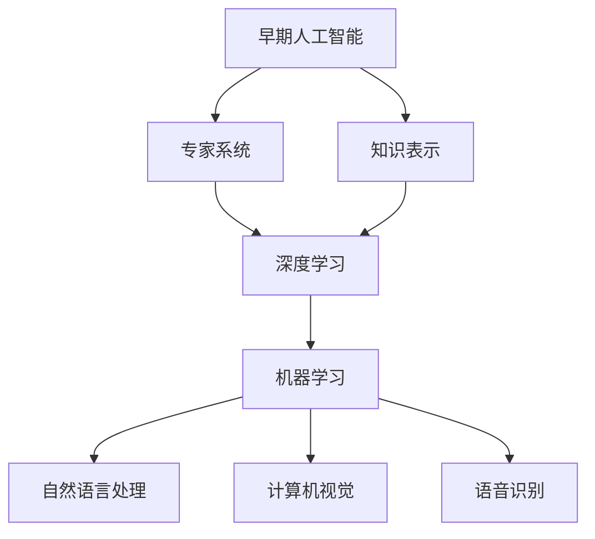

                 

### 文章标题：Andrej Karpathy：人工智能的未来发展目标

### 关键词：人工智能，未来趋势，技术发展，算法原理，应用场景

### 摘要：
本文深入探讨了人工智能领域的杰出人物Andrej Karpathy对未来人工智能发展目标的看法。通过逻辑清晰、结构紧凑的分析，本文将揭示人工智能在技术、应用和伦理等方面面临的挑战与机遇，以及如何通过技术创新推动人工智能迈向更高级别的智能化。

### 目录：

## 1. 背景介绍

### Andrej Karpathy简介

Andrej Karpathy是一位世界知名的人工智能专家，他在机器学习、深度学习和自然语言处理等领域取得了卓越的成就。作为Google Brain的前研究员，他在深度学习领域的研究成果引起了广泛关注。此外，他也是一位资深的程序员和软件架构师，对计算机科学和人工智能的应用有着深刻的理解和独特的见解。

### 人工智能的现状

人工智能作为一种前沿技术，已经广泛应用于各个领域，如医疗、金融、交通和娱乐等。然而，尽管人工智能取得了显著的进展，但仍面临着诸多挑战和问题，包括数据隐私、算法偏见、安全性和伦理等。本文将围绕这些挑战，探讨Andrej Karpathy对未来人工智能发展的看法。

## 2. 核心概念与联系

### 人工智能的定义与分类

人工智能是指模拟人类智能的计算机系统，主要包括机器学习、深度学习、自然语言处理和计算机视觉等技术。根据实现方式，人工智能可以分为弱人工智能和强人工智能。弱人工智能专注于特定任务的智能化，如语音识别、图像识别和自然语言处理等；强人工智能则具备广泛的认知能力，可以像人类一样进行思考、学习和决策。

### 人工智能的发展历程

人工智能的发展历程可以分为几个阶段。早期的人工智能研究主要集中在符号推理和知识表示，如专家系统和推理机。随着计算机性能的不断提升和大数据的普及，深度学习和机器学习逐渐成为人工智能的主流技术。近年来，人工智能在计算机视觉、自然语言处理和语音识别等领域取得了重大突破。

### Mermaid流程图



## 3. 核心算法原理 & 具体操作步骤

### 深度学习算法原理

深度学习是一种基于多层神经网络的人工智能技术，通过模拟人脑神经网络的结构和功能，实现数据的自动学习和特征提取。深度学习算法主要包括卷积神经网络（CNN）、循环神经网络（RNN）和长短时记忆网络（LSTM）等。

#### 卷积神经网络（CNN）

卷积神经网络是一种用于图像识别和分类的深度学习算法。它通过卷积层、池化层和全连接层等结构，实现对图像的特征提取和分类。

#### 循环神经网络（RNN）

循环神经网络是一种用于序列数据处理的深度学习算法，它可以对序列数据进行建模，实现自然语言处理、语音识别和视频分析等任务。

#### 长短时记忆网络（LSTM）

长短时记忆网络是一种改进的循环神经网络，它通过引入门控机制，有效解决了循环神经网络在处理长序列数据时的梯度消失和梯度爆炸问题。

### 深度学习算法的操作步骤

1. 数据预处理：对输入数据进行清洗、归一化和预处理，以便于模型训练。
2. 网络架构设计：根据任务需求，设计合适的深度学习网络架构，包括层数、层类型和神经元数量等。
3. 模型训练：通过梯度下降等优化算法，训练深度学习模型，优化网络参数。
4. 模型评估：使用验证集和测试集对训练好的模型进行评估，调整模型参数，提高模型性能。
5. 模型部署：将训练好的模型部署到实际应用场景中，实现任务自动化和智能化。

## 4. 数学模型和公式 & 详细讲解 & 举例说明

### 深度学习中的数学模型

深度学习中的数学模型主要包括线性代数、微积分和概率统计等。

#### 线性代数

线性代数是深度学习的基础，它涉及矩阵运算、向量运算和矩阵分解等。

$$
A^T = \begin{bmatrix}
    a_{11} & a_{12} & \cdots & a_{1n} \\
    a_{21} & a_{22} & \cdots & a_{2n} \\
    \vdots & \vdots & \ddots & \vdots \\
    a_{m1} & a_{m2} & \cdots & a_{mn}
\end{bmatrix}
$$

#### 微积分

微积分是深度学习中的另一个重要工具，它涉及函数的导数、偏导数和微分等。

$$
f'(x) = \lim_{h \to 0} \frac{f(x+h) - f(x)}{h}
$$

#### 概率统计

概率统计是深度学习中用于建模和评估的重要工具，它涉及概率分布、统计估计和假设检验等。

$$
P(X = x) = \frac{1}{Z} e^{-\frac{1}{2} x^T \Sigma^{-1} x}
$$

### 深度学习中的数学公式

深度学习中的数学公式主要包括损失函数、优化算法和反向传播算法等。

#### 损失函数

损失函数是用于评估模型预测结果与实际结果之间差异的函数，常用的损失函数包括均方误差（MSE）和交叉熵（CE）。

$$
MSE = \frac{1}{m} \sum_{i=1}^{m} (y_i - \hat{y}_i)^2
$$

$$
CE = -\frac{1}{m} \sum_{i=1}^{m} \sum_{j=1}^{c} y_{ij} \log(\hat{y}_{ij})
$$

#### 优化算法

优化算法用于调整模型参数，以最小化损失函数。常用的优化算法包括梯度下降（GD）、随机梯度下降（SGD）和Adam优化器等。

$$
w = w - \alpha \nabla_w J(w)
$$

$$
w = w - \alpha \frac{1}{m} \sum_{i=1}^{m} \nabla_w J(w)^{(i)}
$$

$$
w = w - \alpha \left( \nabla_w J(w) + \frac{\beta_1}{1-\beta_1 t} \right)
$$

#### 反向传播算法

反向传播算法是一种用于训练深度学习模型的重要算法，它通过前向传播和反向传播两个过程，实现对模型参数的优化。

$$
\delta = \frac{\partial L}{\partial z}
$$

$$
\frac{\partial L}{\partial w} = \delta \cdot \frac{\partial z}{\partial w}
$$

### 深度学习算法的举例说明

假设我们使用卷积神经网络（CNN）进行图像分类任务，输入图像为 $x \in \mathbb{R}^{32 \times 32 \times 3}$，输出类别为 $y \in \{1, 2, \ldots, 10\}$。

1. 数据预处理：
   - 对图像进行归一化处理，将像素值缩放到 $[0, 1]$。
   - 将标签进行独热编码，如 $y = \{0, 0, 0, 0, 1, 0, 0, 0, 0\}$。

2. 网络架构设计：
   - 输入层：32 x 32 x 3 的图像。
   - 卷积层：32 个 3 x 3 的卷积核，步长为 1，激活函数为 ReLU。
   - 池化层：2 x 2 的最大池化。
   - 全连接层：10 个神经元，激活函数为 Softmax。

3. 模型训练：
   - 使用均方误差（MSE）作为损失函数。
   - 使用随机梯度下降（SGD）进行模型训练，学习率为 0.001。

4. 模型评估：
   - 使用测试集对训练好的模型进行评估，计算准确率、召回率等指标。

5. 模型部署：
   - 将训练好的模型部署到实际应用场景中，如图像分类、目标检测等。

## 5. 项目实战：代码实际案例和详细解释说明

### 开发环境搭建

在搭建深度学习项目开发环境时，我们通常需要安装以下工具和库：

1. Python：版本 3.6 或更高版本。
2. TensorFlow：版本 2.0 或更高版本。
3. NumPy：版本 1.16 或更高版本。
4. Matplotlib：版本 3.1.1 或更高版本。

### 源代码详细实现和代码解读

以下是一个简单的卷积神经网络（CNN）图像分类项目的代码实现，我们将使用 TensorFlow 和 Keras 库来构建和训练模型。

```python
import tensorflow as tf
from tensorflow.keras import layers
from tensorflow.keras.preprocessing.image import ImageDataGenerator

# 数据预处理
train_datagen = ImageDataGenerator(
    rescale=1./255,
    shear_range=0.2,
    zoom_range=0.2,
    horizontal_flip=True)

test_datagen = ImageDataGenerator(rescale=1./255)

train_generator = train_datagen.flow_from_directory(
    'train',
    target_size=(150, 150),
    batch_size=32,
    class_mode='categorical')

validation_generator = test_datagen.flow_from_directory(
    'validation',
    target_size=(150, 150),
    batch_size=32,
    class_mode='categorical')

# 网络架构设计
model = tf.keras.Sequential([
    layers.Conv2D(32, (3, 3), activation='relu', input_shape=(150, 150, 3)),
    layers.MaxPooling2D(2, 2),
    layers.Conv2D(64, (3, 3), activation='relu'),
    layers.MaxPooling2D(2, 2),
    layers.Conv2D(128, (3, 3), activation='relu'),
    layers.MaxPooling2D(2, 2),
    layers.Conv2D(128, (3, 3), activation='relu'),
    layers.MaxPooling2D(2, 2),
    layers.Flatten(),
    layers.Dense(512, activation='relu'),
    layers.Dense(10, activation='softmax')
])

# 模型训练
model.compile(loss='categorical_crossentropy',
              optimizer='adam',
              metrics=['accuracy'])

model.fit(
    train_generator,
    steps_per_epoch=100,
    epochs=10,
    validation_data=validation_generator,
    validation_steps=50)
```

### 代码解读与分析

1. **数据预处理**：使用 `ImageDataGenerator` 对训练集和验证集进行数据增强和归一化处理，以提高模型的泛化能力。
2. **网络架构设计**：构建一个包含卷积层、池化层和全连接层的卷积神经网络。每个卷积层后跟一个最大池化层，最后通过全连接层进行分类。
3. **模型训练**：使用 `compile` 方法配置损失函数、优化器和评估指标，然后使用 `fit` 方法进行模型训练，通过 `validation_data` 参数对模型进行验证。

## 6. 实际应用场景

### 医疗领域

人工智能在医疗领域的应用非常广泛，包括疾病预测、诊断、治疗和康复等。通过深度学习算法，可以对患者的医疗数据进行建模和分析，从而提供更加准确和个性化的医疗服务。

### 金融领域

人工智能在金融领域的应用包括风险管理、投资组合优化、信用评估和反欺诈等。通过分析海量金融数据，人工智能可以帮助金融机构提高决策效率和准确性。

### 交通运输领域

人工智能在交通运输领域的应用包括自动驾驶、交通流量预测和智能交通管理等。通过深度学习和计算机视觉技术，可以实现车辆自主导航和交通环境的智能感知。

### 娱乐领域

人工智能在娱乐领域的应用包括内容推荐、智能客服和虚拟现实等。通过分析用户行为和喜好，人工智能可以为用户提供个性化的娱乐体验。

## 7. 工具和资源推荐

### 学习资源推荐

1. **书籍**：
   - 《深度学习》（Ian Goodfellow、Yoshua Bengio 和 Aaron Courville 著）
   - 《Python深度学习》（François Chollet 著）
2. **论文**：
   - 《A Theoretically Grounded Application of Dropout in Recurrent Neural Networks》
   - 《Very Deep Convolutional Networks for Large-Scale Image Recognition》
3. **博客**：
   - Andrej Karpathy 的博客
   - TensorFlow 官方博客
4. **网站**：
   - Coursera 上的深度学习课程
   - edX 上的机器学习课程

### 开发工具框架推荐

1. **TensorFlow**：谷歌推出的开源深度学习框架，具有丰富的功能和广泛的应用。
2. **PyTorch**：Facebook AI Research 开发的一款流行的深度学习框架，具有简洁易用的 API。
3. **Keras**：用于快速构建和训练深度学习模型的 Python 库，支持 TensorFlow 和 PyTorch 后端。

### 相关论文著作推荐

1. **《Deep Learning》（Ian Goodfellow、Yoshua Bengio 和 Aaron Courville 著）**：全面介绍了深度学习的理论、算法和应用。
2. **《Recurrent Neural Networks for Language Modeling》（Yoshua Bengio、Samy Bengio 和 Paul Déroche 著）**：探讨了循环神经网络在自然语言处理领域的应用。
3. **《Convolutional Neural Networks for Visual Recognition》（Yann LeCun、Yoshua Bengio 和 Geoffrey Hinton 著）**：介绍了卷积神经网络在计算机视觉领域的应用。

## 8. 总结：未来发展趋势与挑战

### 发展趋势

1. **算法创新**：随着计算机性能的提升和大数据的普及，深度学习和机器学习算法将不断优化和改进，以实现更高的准确性和效率。
2. **跨学科融合**：人工智能与其他领域的融合将推动更多创新应用，如医疗、金融、交通运输和娱乐等。
3. **云计算与边缘计算**：云计算和边缘计算的发展将为人工智能提供更加灵活和高效的基础设施支持。
4. **伦理与法律**：随着人工智能技术的发展，伦理和法律问题将日益凸显，需要建立相应的规范和标准。

### 挑战

1. **数据隐私**：人工智能模型对大量个人数据进行训练，如何保护用户隐私成为重要问题。
2. **算法偏见**：人工智能算法可能存在偏见，需要加强算法透明度和可解释性。
3. **安全性与可靠性**：人工智能系统在关键领域的应用需要保证安全性和可靠性。
4. **人才短缺**：人工智能领域对人才的需求日益增长，如何培养和吸引更多优秀人才成为挑战。

## 9. 附录：常见问题与解答

### 1. 人工智能与机器学习的区别是什么？

人工智能（AI）是指模拟人类智能的计算机系统，包括机器学习（ML）、深度学习（DL）等子领域。机器学习是一种通过数据训练模型，使计算机具备学习能力的技术，而深度学习是机器学习的一个子领域，通过多层神经网络实现数据的自动学习和特征提取。

### 2. 深度学习算法如何处理图像数据？

深度学习算法通过卷积神经网络（CNN）处理图像数据。CNN 利用卷积层、池化层和全连接层等结构，对图像数据进行特征提取和分类。卷积层通过卷积操作提取图像特征，池化层用于降低特征维度，全连接层用于分类。

### 3. 如何解决深度学习中的过拟合问题？

过拟合是指模型在训练数据上表现良好，但在验证集或测试集上表现较差。为解决过拟合问题，可以采用以下方法：

1. 增加训练数据：通过数据增强和采集更多数据，提高模型泛化能力。
2. 正则化：通过添加正则化项，降低模型复杂度，减少过拟合。
3. 交叉验证：使用交叉验证方法，评估模型在不同数据集上的性能，选择合适的模型。

## 10. 扩展阅读 & 参考资料

1. **《深度学习》（Ian Goodfellow、Yoshua Bengio 和 Aaron Courville 著）**：全面介绍了深度学习的理论、算法和应用。
2. **《Python深度学习》（François Chollet 著）**：详细讲解了如何使用 Python 和 Keras 进行深度学习实践。
3. **TensorFlow 官方文档**：提供了丰富的深度学习框架文档和教程。
4. **edX 上的深度学习课程**：包括深度学习基础、自然语言处理和计算机视觉等课程。```

