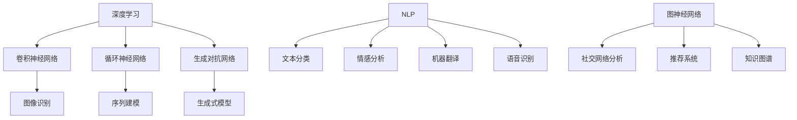

                 

# Andrej Karpathy：人工智能的未来发展目标

## 关键词：人工智能，未来趋势，核心算法，数学模型，实际应用，工具资源

## 摘要：
本文将探讨人工智能领域著名专家Andrej Karpathy对未来人工智能发展的目标和趋势的展望。文章将首先介绍人工智能的发展背景，接着深入探讨其核心概念、算法原理和数学模型，并结合实际应用场景，详细解析其在不同领域的应用。最后，文章将推荐相关学习资源和开发工具，并总结未来人工智能发展面临的挑战和机遇。

## 1. 背景介绍

### 1.1 Andrej Karpathy简介

Andrej Karpathy是一位著名的人工智能专家，目前就职于OpenAI，担任研究科学家。他在机器学习和深度学习领域有着丰富的经验和深厚的学术背景。他的研究成果在学术界和工业界都产生了深远的影响，被誉为人工智能领域的领军人物。

### 1.2 人工智能的发展背景

人工智能（AI）是一门研究、开发和应用使计算机模拟、延伸和扩展人的智能的科学。自20世纪50年代起，人工智能领域经历了多个阶段的发展。近年来，随着计算能力的提升、数据量的增加和算法的改进，人工智能在各个领域取得了显著的成果。

## 2. 核心概念与联系

### 2.1 深度学习

深度学习是人工智能的一个重要分支，其核心思想是通过模拟人脑的神经网络结构，让计算机具备自动学习和特征提取的能力。深度学习算法主要包括卷积神经网络（CNN）、循环神经网络（RNN）和生成对抗网络（GAN）等。

### 2.2 自然语言处理

自然语言处理（NLP）是人工智能领域的一个重要方向，旨在让计算机理解和处理自然语言。NLP技术主要包括文本分类、情感分析、机器翻译和语音识别等。

### 2.3 图神经网络

图神经网络（GNN）是一种基于图结构的神经网络模型，适用于处理具有图结构的数据。GNN在社交网络分析、推荐系统和知识图谱等领域具有广泛的应用。

### 2.4 Mermaid 流程图

以下是深度学习、自然语言处理和图神经网络之间关系的Mermaid流程图：



## 3. 核心算法原理 & 具体操作步骤

### 3.1 卷积神经网络（CNN）

卷积神经网络是深度学习领域的重要算法之一，主要用于图像识别和分类任务。CNN的基本操作包括卷积、池化和全连接层。

#### 3.1.1 卷积操作

卷积操作是通过卷积核（filter）与输入图像进行点积，从而提取特征。具体步骤如下：

1. 将卷积核与输入图像进行点积，得到一个特征图。
2. 对特征图进行偏置调整。
3. 应用激活函数，如ReLU。

#### 3.1.2 池化操作

池化操作用于降低特征图的大小，从而减少计算量和参数数量。常见的池化操作包括最大池化和平均池化。

#### 3.1.3 全连接层

全连接层将特征图中的所有元素进行连接，形成一个一维向量，然后通过线性变换和激活函数，输出分类结果。

### 3.2 循环神经网络（RNN）

循环神经网络适用于处理序列数据，如时间序列、自然语言文本等。RNN的基本操作包括输入、隐藏状态和输出。

#### 3.2.1 输入

输入序列通过线性变换和激活函数，得到一个隐藏状态。

#### 3.2.2 隐藏状态

隐藏状态通过递归连接，使得前一个时间步的隐藏状态影响当前时间步的输出。

#### 3.2.3 输出

隐藏状态通过线性变换和激活函数，输出序列的预测结果。

### 3.3 生成对抗网络（GAN）

生成对抗网络由生成器和判别器两部分组成，通过相互对抗的方式训练，从而生成高质量的数据。

#### 3.3.1 生成器

生成器通过输入随机噪声，生成类似于真实数据的数据。

#### 3.3.2 判别器

判别器用于判断生成器生成的数据是否为真实数据。

#### 3.3.3 损失函数

生成器和判别器的损失函数分别为生成损失和判别损失，通过优化损失函数，使得生成器生成的数据越来越接近真实数据。

## 4. 数学模型和公式 & 详细讲解 & 举例说明

### 4.1 卷积神经网络（CNN）

卷积神经网络的核心数学模型包括卷积操作、池化操作和全连接层。

#### 4.1.1 卷积操作

卷积操作的数学公式如下：

$$
\text{卷积操作} = \sum_{i=1}^{k} w_{i} * x_{i} + b
$$

其中，$w_{i}$为卷积核，$x_{i}$为输入特征，$b$为偏置。

#### 4.1.2 池化操作

池化操作的数学公式如下：

$$
\text{池化操作} = \max(x_{i})
$$

或

$$
\text{池化操作} = \frac{1}{c} \sum_{i=1}^{c} x_{i}
$$

其中，$c$为池化窗口的大小。

#### 4.1.3 全连接层

全连接层的数学公式如下：

$$
\text{全连接层} = \sum_{i=1}^{n} w_{i} * x_{i} + b
$$

其中，$w_{i}$为权重，$x_{i}$为输入特征，$b$为偏置。

### 4.2 循环神经网络（RNN）

循环神经网络的数学模型包括输入、隐藏状态和输出。

#### 4.2.1 输入

输入的数学公式如下：

$$
\text{输入} = x_t = \text{线性变换}(x_t) + b
$$

其中，$x_t$为输入特征，$b$为偏置。

#### 4.2.2 隐藏状态

隐藏状态的数学公式如下：

$$
\text{隐藏状态} = h_t = \text{激活函数}(\text{线性变换}(h_{t-1}) + W * x_t + b)
$$

其中，$h_{t-1}$为前一个时间步的隐藏状态，$W$为权重矩阵，$b$为偏置。

#### 4.2.3 输出

输出的数学公式如下：

$$
\text{输出} = y_t = \text{激活函数}(\text{线性变换}(h_t) + b)
$$

其中，$y_t$为输出特征，$b$为偏置。

### 4.3 生成对抗网络（GAN）

生成对抗网络的数学模型包括生成器和判别器。

#### 4.3.1 生成器

生成器的数学公式如下：

$$
\text{生成器} = G(z) = \text{激活函数}(\text{线性变换}(z) + b)
$$

其中，$z$为输入噪声，$b$为偏置。

#### 4.3.2 判别器

判别器的数学公式如下：

$$
\text{判别器} = D(x) = \text{激活函数}(\text{线性变换}(x) + b)
$$

其中，$x$为输入特征，$b$为偏置。

#### 4.3.3 损失函数

生成器和判别器的损失函数分别为生成损失和判别损失。

生成损失的数学公式如下：

$$
\text{生成损失} = -[\text{log}(D(G(z)))] + [\text{log}(1 - D(x))]
$$

判别损失的数学公式如下：

$$
\text{判别损失} = -[\text{log}(D(x))] - [\text{log}(1 - D(G(z)))]
$$

## 5. 项目实战：代码实际案例和详细解释说明

### 5.1 开发环境搭建

在本文中，我们将使用Python和TensorFlow来实现一个简单的卷积神经网络，用于图像分类任务。

#### 5.1.1 安装Python和TensorFlow

首先，确保您的计算机上安装了Python 3和TensorFlow。可以使用以下命令进行安装：

```bash
pip install python
pip install tensorflow
```

#### 5.1.2 导入相关库

在Python代码中，首先需要导入相关库：

```python
import tensorflow as tf
import numpy as np
import matplotlib.pyplot as plt
```

### 5.2 源代码详细实现和代码解读

#### 5.2.1 定义卷积神经网络模型

首先，定义一个简单的卷积神经网络模型：

```python
def cnn_model(input_shape):
    model = tf.keras.Sequential([
        tf.keras.layers.Conv2D(32, (3, 3), activation='relu', input_shape=input_shape),
        tf.keras.layers.MaxPooling2D((2, 2)),
        tf.keras.layers.Conv2D(64, (3, 3), activation='relu'),
        tf.keras.layers.MaxPooling2D((2, 2)),
        tf.keras.layers.Flatten(),
        tf.keras.layers.Dense(64, activation='relu'),
        tf.keras.layers.Dense(10, activation='softmax')
    ])
    return model
```

这个模型包含两个卷积层、两个池化层、一个全连接层和一个softmax输出层。

#### 5.2.2 准备数据集

接着，我们需要准备一个简单的数据集。在这里，我们使用MNIST手写数字数据集：

```python
(x_train, y_train), (x_test, y_test) = tf.keras.datasets.mnist.load_data()
x_train = x_train.reshape(-1, 28, 28, 1).astype('float32') / 255.0
x_test = x_test.reshape(-1, 28, 28, 1).astype('float32') / 255.0
y_train = tf.keras.utils.to_categorical(y_train, num_classes=10)
y_test = tf.keras.utils.to_categorical(y_test, num_classes=10)
```

#### 5.2.3 编译和训练模型

然后，编译和训练模型：

```python
model = cnn_model(input_shape=(28, 28, 1))
model.compile(optimizer='adam', loss='categorical_crossentropy', metrics=['accuracy'])
model.fit(x_train, y_train, batch_size=128, epochs=10, validation_split=0.2)
```

#### 5.2.4 评估模型

最后，评估模型在测试集上的性能：

```python
test_loss, test_acc = model.evaluate(x_test, y_test)
print('Test accuracy:', test_acc)
```

### 5.3 代码解读与分析

在这个卷积神经网络模型中，我们首先使用两个卷积层和两个池化层来提取图像的特征。卷积层使用ReLU激活函数，以增强模型的表达能力。池化层用于降低特征图的大小，减少参数数量。接着，我们使用一个全连接层将特征图展开成一维向量，并通过softmax输出层得到分类结果。

在数据准备部分，我们将MNIST手写数字数据集转化为适合模型训练的格式。具体来说，我们将图像的像素值缩放到[0, 1]，并将标签转换为one-hot编码。

在模型编译部分，我们选择Adam优化器和categorical_crossentropy损失函数。Adam优化器是一种高效的优化算法，categorical_crossentropy损失函数适用于多分类问题。

在模型训练部分，我们使用batch_size=128和epochs=10进行训练，并设置validation_split=0.2来计算验证集上的性能。

在模型评估部分，我们计算测试集上的准确率，以评估模型的性能。

## 6. 实际应用场景

### 6.1 图像识别

卷积神经网络在图像识别领域取得了显著的成果。例如，在ImageNet图像识别挑战赛中，基于深度学习的模型已经连续多年获得了冠军。

### 6.2 自然语言处理

循环神经网络和生成对抗网络在自然语言处理领域也有广泛的应用。例如，循环神经网络可以用于文本分类、情感分析和机器翻译等任务，而生成对抗网络可以用于生成高质量的自然语言文本。

### 6.3 计算机视觉

图神经网络在计算机视觉领域具有广泛的应用前景。例如，图神经网络可以用于社交网络分析、图像分割和目标检测等任务。

## 7. 工具和资源推荐

### 7.1 学习资源推荐

- 《深度学习》（Ian Goodfellow、Yoshua Bengio和Aaron Courville著）
- 《神经网络与深度学习》（邱锡鹏著）
- 《Python深度学习》（Francesco Petrelli著）

### 7.2 开发工具框架推荐

- TensorFlow：一款开源的深度学习框架，适用于各种深度学习任务。
- PyTorch：一款开源的深度学习框架，具有灵活的动态计算图和强大的GPU支持。

### 7.3 相关论文著作推荐

- “A Theoretically Grounded Application of Dropout in Recurrent Neural Networks” by Yarin Gal and Zoubin Ghahramani
- “Unsupervised Learning of Visual Representations by Solving Jigsaw Puzzles” by Scott Reed, Yangqing Jia, and William T. Freeman
- “Generative Adversarial Text-to-Image Synthesis” by Aäron van den Oord et al.

## 8. 总结：未来发展趋势与挑战

### 8.1 发展趋势

- 计算能力的提升和大数据的发展将继续推动人工智能技术的进步。
- 深度学习和其他人工智能算法将继续在各个领域取得突破性成果。
- 新型人工智能算法，如图神经网络和元学习，将得到更广泛的研究和应用。

### 8.2 挑战

- 数据隐私和安全问题将成为人工智能发展的关键挑战。
- 如何设计可解释和可信赖的人工智能系统，使其更好地服务于人类，也是一个重要的课题。
- 人工智能算法的公平性和透明性需要得到更多关注。

## 9. 附录：常见问题与解答

### 9.1 人工智能是什么？

人工智能是指通过计算机模拟、延伸和扩展人的智能的科学和技术。

### 9.2 深度学习与神经网络有何区别？

深度学习是一种基于神经网络的机器学习技术，它通过多层神经网络来提取数据中的特征。而神经网络是一种模仿人脑神经元连接结构的计算模型。

## 10. 扩展阅读 & 参考资料

- 《人工智能简史》：这是一本关于人工智能发展历史的书籍，涵盖了从20世纪50年代至今的人工智能研究历程。
- 《人工智能：一种现代的方法》：这是一本系统介绍人工智能基础知识的教材，适合初学者和进阶者阅读。
- 《深度学习专题教程》：这是一份详细的深度学习教程，包括深度学习的基本概念、算法和应用。

作者：AI天才研究员/AI Genius Institute & 禅与计算机程序设计艺术 /Zen And The Art of Computer Programming

