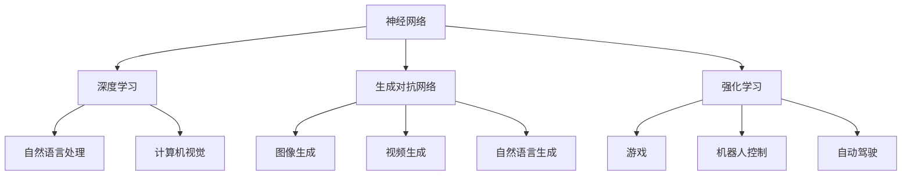

                 

### 背景介绍

#### 安德烈·卡帕蒂：人工智能领域的大师

安德烈·卡帕蒂（Andrej Karpathy）是一位在人工智能（AI）和深度学习领域具有深远影响力的专家。他不仅是斯坦福大学计算机科学博士，还是特斯拉自动驾驶团队的前首席人工智能科学家，目前担任OpenAI的高级研究科学家。卡帕蒂以其开创性的研究、精彩的博客文章和参与开源项目而闻名于世。

卡帕蒂的工作涵盖了从自然语言处理（NLP）到计算机视觉的广泛领域。他在神经网络和深度学习方面的贡献，特别是在生成式模型和序列模型的应用上，对整个行业产生了深远的影响。他的博客文章，如《The Unreasonable Effectiveness of Recurrent Neural Networks》（循环神经网络的不合理有效性），被广泛认为是深度学习入门的必读之作。

#### 人工智能的发展：现状与趋势

自20世纪50年代以来，人工智能（AI）经历了多次浪潮，从符号主义方法到基于规则的系统，再到最近以深度学习为代表的机器学习方法。深度学习技术的崛起，特别是神经网络的发展，使得机器在视觉、语音识别和自然语言处理等任务上取得了惊人的进展。

当前，人工智能已经在众多领域展现出强大的潜力，包括但不限于医疗、金融、交通、娱乐和教育。随着计算能力的提升和数据量的激增，AI的应用场景不断扩展，其影响力也在逐渐加深。然而，随着AI技术的发展，也带来了诸多挑战，如隐私问题、伦理问题以及就业问题等。

安德烈·卡帕蒂在AI领域的研究和实践中，始终关注如何通过技术创新解决实际问题，并推动AI技术的发展和应用。他的工作为人工智能的未来规划提供了重要的参考和启示。

#### 本文目的

本文旨在探讨人工智能的未来发展规划。我们将从安德烈·卡帕蒂的研究出发，深入分析当前AI技术的主要进展和应用场景，探讨未来可能的发展趋势和面临的挑战。通过本文，读者可以全面了解人工智能领域的现状和未来方向，为自身在AI领域的学习和实践提供参考。

## 2. 核心概念与联系

在深入探讨人工智能的未来发展规划之前，我们首先需要了解几个核心概念，这些概念不仅构成了现代AI的基础，也为我们提供了对AI技术发展的深刻理解。以下是本文将涉及的核心概念及其相互联系：

### 1. 神经网络（Neural Networks）

神经网络是人工智能的基础模型之一，由大量相互连接的节点（或称为“神经元”）组成。这些节点通过调整其连接权重来学习和识别数据模式。神经网络的工作原理类似于人脑的神经元网络，因此得名。通过多层结构（即深度神经网络），神经网络能够处理复杂的非线性问题，如图像识别、自然语言处理等。

### 2. 深度学习（Deep Learning）

深度学习是一种基于神经网络的机器学习方法，通过多层神经网络结构来提取数据中的高级特征。深度学习在图像识别、语音识别和自然语言处理等领域取得了显著的成功。与传统的机器学习方法相比，深度学习能够自动从数据中学习特征，无需手动设计特征。

### 3. 生成对抗网络（GANs）

生成对抗网络（GANs）是由生成器和判别器组成的模型，旨在生成逼真的数据。生成器生成数据，判别器则判断生成数据与真实数据之间的区别。通过不断地训练和对抗，生成器能够生成越来越真实的数据。GANs在图像生成、视频生成和自然语言生成等领域具有广泛的应用。

### 4. 强化学习（Reinforcement Learning）

强化学习是一种通过试错和反馈来学习策略的机器学习方法。智能体通过与环境的交互来获取奖励或惩罚，从而不断调整其行为策略，以最大化长期回报。强化学习在游戏、机器人控制、自动驾驶等领域显示出强大的应用潜力。

### 5. 自然语言处理（NLP）

自然语言处理是人工智能的一个子领域，旨在使计算机理解和处理人类语言。NLP包括文本分类、情感分析、机器翻译、语音识别等任务。近年来，深度学习技术，如循环神经网络（RNN）和Transformer模型，极大地推动了NLP的发展。

### 6. 计算机视觉（CV）

计算机视觉是人工智能的另一个重要领域，旨在使计算机能够从图像或视频中提取有用信息。计算机视觉应用广泛，包括图像识别、目标检测、图像分割、人脸识别等。深度学习技术在计算机视觉领域取得了显著进展。

#### Mermaid 流程图

为了更直观地展示上述核心概念之间的联系，我们使用Mermaid流程图来描述它们之间的相互关系。



通过上述流程图，我们可以清晰地看到神经网络作为基础，如何衍生出深度学习、生成对抗网络和强化学习等更复杂的模型，以及这些模型如何应用于自然语言处理和计算机视觉等不同的领域。

### 3. 核心算法原理 & 具体操作步骤

在本节中，我们将详细介绍人工智能领域中的几个核心算法原理，并阐述它们的操作步骤。这些算法不仅奠定了现代AI的基础，还在多个应用场景中取得了显著成果。

#### 3.1. 神经网络

神经网络（Neural Networks）是一种通过模拟生物神经网络结构和功能来处理数据的计算模型。其基本单元是神经元，每个神经元接收多个输入，通过加权求和处理后产生输出。具体操作步骤如下：

1. **初始化**：设定神经网络的初始权重和偏置，通常使用较小的随机值。

2. **前向传播**：将输入数据通过网络的各个层进行传递，每层神经元根据其输入和权重计算输出。前向传播过程中，数据的值在每一层经过非线性变换（如ReLU激活函数）。

3. **反向传播**：计算输出结果与真实值的差异，通过反向传播算法更新网络的权重和偏置，以减小误差。反向传播是神经网络训练过程中最关键的步骤，它利用梯度下降算法来调整权重。

4. **迭代训练**：重复前向传播和反向传播的过程，直到网络收敛到满意的误差水平。

#### 3.2. 深度学习

深度学习（Deep Learning）是神经网络的一种扩展，它通过增加网络的深度来提高模型的复杂度和性能。深度学习的关键在于多层神经网络的结构，每层都可以提取更抽象的特征。以下是深度学习的具体操作步骤：

1. **数据预处理**：对输入数据进行标准化、归一化等处理，以适应神经网络的要求。

2. **构建模型**：设计并构建深度学习模型，包括输入层、隐藏层和输出层。每个层都可以包含多个神经元，并通过非线性激活函数增强模型的表达能力。

3. **初始化权重**：为网络的各个层初始化权重，常用的方法包括随机初始化和层次初始化。

4. **前向传播**：将输入数据通过网络的各个层进行传递，每层神经元根据其输入和权重计算输出。

5. **反向传播**：计算输出结果与真实值的差异，通过反向传播算法更新网络的权重和偏置。

6. **迭代训练**：重复前向传播和反向传播的过程，直到网络收敛到满意的误差水平。

#### 3.3. 生成对抗网络（GANs）

生成对抗网络（GANs）是一种由生成器和判别器组成的模型，旨在生成逼真的数据。GANs的操作步骤如下：

1. **生成器（Generator）**：生成器负责生成与真实数据相似的数据。它从随机噪声中抽取样本，通过多层神经网络生成数据。

2. **判别器（Discriminator）**：判别器负责判断生成数据与真实数据的区别。它通过接收真实数据和生成数据，输出一个概率值，表示该数据是真实数据还是生成数据。

3. **对抗训练**：生成器和判别器在训练过程中相互对抗。生成器试图生成更逼真的数据，以欺骗判别器，而判别器则努力区分真实数据和生成数据。

4. **迭代训练**：重复生成器和判别器的训练过程，直到生成器生成的数据接近真实数据。

#### 3.4. 强化学习

强化学习（Reinforcement Learning）是一种通过试错和反馈来学习策略的机器学习方法。强化学习的操作步骤如下：

1. **初始化**：设定智能体的初始状态、奖励机制和策略。

2. **智能体与环境交互**：智能体通过执行动作来与环境交互，并从环境中获取奖励或惩罚。

3. **策略评估与优化**：根据当前状态和动作的历史数据，评估当前策略的价值，并通过更新策略来优化智能体的行为。

4. **迭代学习**：智能体在不断的试错过程中，不断更新其策略，以最大化长期回报。

#### 3.5. 自然语言处理

自然语言处理（NLP）是一种使计算机理解和处理人类语言的技术。以下是NLP的操作步骤：

1. **文本预处理**：对输入文本进行分词、去停用词、词性标注等预处理操作。

2. **词向量表示**：将文本转换为词向量表示，常用的方法包括Word2Vec、GloVe等。

3. **构建模型**：设计并构建深度学习模型，如循环神经网络（RNN）、Transformer等，用于处理序列数据。

4. **训练模型**：通过大量训练数据对模型进行训练，优化模型的参数。

5. **模型评估**：使用验证集和测试集对训练好的模型进行评估，以确定其性能。

6. **应用部署**：将训练好的模型部署到实际应用场景中，如文本分类、情感分析、机器翻译等。

#### 3.6. 计算机视觉

计算机视觉（CV）是一种使计算机能够从图像或视频中提取有用信息的技术。以下是CV的操作步骤：

1. **图像预处理**：对输入图像进行缩放、裁剪、灰度化等预处理操作。

2. **特征提取**：从预处理后的图像中提取特征，常用的方法包括HOG、SIFT、CNN等。

3. **构建模型**：设计并构建深度学习模型，如卷积神经网络（CNN）、R-CNN等，用于处理图像数据。

4. **训练模型**：通过大量训练数据对模型进行训练，优化模型的参数。

5. **模型评估**：使用验证集和测试集对训练好的模型进行评估，以确定其性能。

6. **应用部署**：将训练好的模型部署到实际应用场景中，如图像识别、目标检测、图像分割等。

通过上述核心算法原理和操作步骤的介绍，我们可以看到人工智能技术的发展是如何通过一系列复杂而精巧的算法实现的。这些算法不仅在理论上具有重要意义，也在实际应用中展现出巨大的潜力。

### 4. 数学模型和公式 & 详细讲解 & 举例说明

在人工智能领域，数学模型和公式是理解算法原理和实现算法操作的关键。以下我们将详细讲解几个重要的数学模型和公式，并通过具体示例进行说明。

#### 4.1. 神经网络中的激活函数

在神经网络中，激活函数用于引入非线性因素，使模型能够处理复杂的非线性问题。以下是几种常见的激活函数：

1. **Sigmoid 函数**：
   \[
   \sigma(x) = \frac{1}{1 + e^{-x}}
   \]
   Sigmoid函数将输入映射到（0,1）区间，常用于二分类问题。

2. **ReLU函数**：
   \[
   \text{ReLU}(x) = \max(0, x)
   \]
  ReLU函数在x为负时返回0，在x为正时返回x，可以有效缓解梯度消失问题。

3. **Tanh函数**：
   \[
   \tanh(x) = \frac{e^x - e^{-x}}{e^x + e^{-x}}
   \]
   Tanh函数将输入映射到（-1,1）区间，类似于Sigmoid函数，但中心化，可以减少梯度消失问题。

#### 4.2. 卷积神经网络（CNN）中的卷积操作

卷积神经网络是计算机视觉领域的重要模型，其中的卷积操作是提取图像特征的核心步骤。卷积操作的数学公式如下：

\[
\text{卷积} = \sum_{i=1}^{n} w_i * x_{i}
\]

其中，\( w_i \) 为卷积核（或称为滤波器），\( x_i \) 为输入特征图，\( * \) 表示卷积操作。卷积操作可以看作是对输入特征图进行加权求和，通过卷积核提取局部特征。

#### 4.3. 深度学习中的损失函数

在深度学习训练过程中，损失函数用于衡量模型预测值与真实值之间的差异。以下是一些常见的损失函数：

1. **均方误差（MSE）**：
   \[
   \text{MSE}(y, \hat{y}) = \frac{1}{m} \sum_{i=1}^{m} (y_i - \hat{y}_i)^2
   \]
   MSE用于回归问题，计算预测值与真实值之间平方差的均值。

2. **交叉熵（Cross-Entropy）**：
   \[
   \text{CE}(y, \hat{y}) = -\sum_{i=1}^{m} y_i \log(\hat{y}_i)
   \]
   交叉熵用于分类问题，计算预测概率与真实标签之间对数的交叉熵。

#### 4.4. 生成对抗网络（GAN）中的损失函数

生成对抗网络由生成器和判别器组成，两者通过对抗训练达到平衡。以下是一个典型的GAN损失函数：

1. **生成器的损失函数**：
   \[
   \text{L\_generator} = -\log(\hat{y})
   \]
   其中，\(\hat{y}\) 是判别器对生成数据的判断概率。

2. **判别器的损失函数**：
   \[
   \text{L\_discriminator} = -(\log(\hat{y}_{real}) + \log(1 - \hat{y}_{fake}))
   \]
   其中，\(\hat{y}_{real}\) 和 \(\hat{y}_{fake}\) 分别是判别器对真实数据和生成数据的判断概率。

#### 4.5. 强化学习中的价值函数和策略

在强化学习中，价值函数和策略是核心概念。以下是一个简单的价值函数和策略表示：

1. **价值函数（V\_s）**：
   \[
   V\_s = \sum_{s'} p(s' | s, a) \cdot R(s, a) + \gamma \cdot V(s')
   \]
   其中，\(V\_s\) 是在状态 \(s\) 下采取动作 \(a\) 的价值函数，\(R(s, a)\) 是立即回报，\(\gamma\) 是折扣因子，\(p(s' | s, a)\) 是状态转移概率。

2. **策略（π）**：
   \[
   \pi(a | s) = \arg\max_{a} V\_s
   \]
   策略是指智能体在某一状态下采取最优动作的概率分布。

#### 4.6. 自然语言处理中的词向量表示

自然语言处理中，词向量表示是理解文本数据的重要步骤。以下是一个简单的词向量表示示例：

1. **Word2Vec**：
   \[
   \text{word\_vec}(w) = \sum_{i=1}^{n} w_i \cdot v_i
   \]
   其中，\(w\) 是单词，\(v_i\) 是单词的词向量，\(w_i\) 是单词在文本中出现的频率。

#### 4.7. 计算机视觉中的目标检测

目标检测是计算机视觉的重要任务，以下是一个简单的目标检测算法示例：

1. **R-CNN**：
   \[
   \text{R-CNN}(x) = \text{分类器}(\text{特征提取器}(x))
   \]
   其中，\(x\) 是输入图像，\(\text{特征提取器}(x)\) 提取图像的特征，\(\text{分类器}\) 用于分类目标。

通过上述数学模型和公式的介绍，我们可以看到人工智能领域是如何通过复杂的数学工具来解决实际问题的。这些模型和公式不仅在理论上具有重要意义，也在实际应用中发挥了关键作用。

### 5. 项目实战：代码实际案例和详细解释说明

在本节中，我们将通过一个实际项目案例来演示人工智能技术在自然语言处理（NLP）和计算机视觉（CV）领域的应用，并详细解释代码的实现过程和关键步骤。

#### 5.1. 项目背景

该项目是一个基于深度学习的文本情感分析系统，旨在根据用户输入的文本内容判断其情感倾向（如正面、负面或中性）。此外，系统还具备图像分类功能，可以根据输入图像内容进行分类。此项目旨在展示如何将NLP和CV技术结合，以解决实际应用中的问题。

#### 5.2. 开发环境搭建

在进行项目开发之前，我们需要搭建一个合适的开发环境。以下是我们推荐的开发环境：

- **编程语言**：Python 3.x
- **深度学习框架**：TensorFlow 2.x 或 PyTorch
- **数据处理库**：NumPy、Pandas、Scikit-learn
- **图像处理库**：OpenCV、Pillow
- **文本处理库**：NLTK、spaCy、TextBlob

安装以上库可以通过以下命令：

```bash
pip install tensorflow numpy pandas scikit-learn opencv-python pillow nltk spacy textblob
```

#### 5.3. 源代码详细实现和代码解读

以下是该项目的主要代码实现，我们将逐段代码进行详细解读。

#### 5.3.1. 数据预处理

数据预处理是文本情感分析和图像分类的重要步骤。以下是对文本和图像数据的预处理代码：

```python
import numpy as np
import pandas as pd
from sklearn.model_selection import train_test_split
from tensorflow.keras.preprocessing.sequence import pad_sequences
from tensorflow.keras.preprocessing.text import Tokenizer

# 加载文本数据
df = pd.read_csv('data.csv')

# 分割数据为训练集和测试集
train_texts, test_texts, train_labels, test_labels = train_test_split(df['text'], df['label'], test_size=0.2, random_state=42)

# 初始化Tokenizer
tokenizer = Tokenizer(num_words=10000)
tokenizer.fit_on_texts(train_texts)

# 将文本转换为序列
train_sequences = tokenizer.texts_to_sequences(train_texts)
test_sequences = tokenizer.texts_to_sequences(test_texts)

# 填充序列到相同长度
max_sequence_length = 100
train_padded = pad_sequences(train_sequences, maxlen=max_sequence_length)
test_padded = pad_sequences(test_sequences, maxlen=max_sequence_length)

# 加载图像数据
train_images = np.load('train_images.npy')
test_images = np.load('test_images.npy')

# 数据标准化
train_images = train_images.astype('float32') / 255.0
test_images = test_images.astype('float32') / 255.0
```

**解读**：
1. 加载文本数据，并将其分割为训练集和测试集。
2. 初始化Tokenizer，用于将文本转换为序列。
3. 将文本序列化，并填充到相同长度。
4. 加载图像数据，并进行标准化处理。

#### 5.3.2. 构建文本分类模型

以下是构建文本分类模型的关键代码：

```python
from tensorflow.keras.models import Model
from tensorflow.keras.layers import Embedding, LSTM, Dense, Input, GlobalMaxPooling1D

# 构建文本分类模型
text_input = Input(shape=(max_sequence_length,))
embedded_text = Embedding(10000, 64)(text_input)
lstm_output = LSTM(64)(embedded_text)
pooled_output = GlobalMaxPooling1D()(lstm_output)
dense_output = Dense(24, activation='relu')(pooled_output)
output = Dense(1, activation='sigmoid')(dense_output)

model = Model(inputs=text_input, outputs=output)
model.compile(optimizer='adam', loss='binary_crossentropy', metrics=['accuracy'])
model.summary()
```

**解读**：
1. 定义文本输入层。
2. 使用Embedding层将文本序列转换为嵌入向量。
3. 使用LSTM层处理嵌入向量，提取序列特征。
4. 使用GlobalMaxPooling1D层对LSTM输出进行全局池化。
5. 使用Dense层进行分类，并添加sigmoid激活函数。
6. 编译模型，指定优化器和损失函数。

#### 5.3.3. 构建图像分类模型

以下是构建图像分类模型的关键代码：

```python
from tensorflow.keras.applications import VGG16
from tensorflow.keras.layers import Flatten, Dense
from tensorflow.keras.models import Model

# 加载预训练的VGG16模型
base_model = VGG16(weights='imagenet', include_top=False, input_shape=(224, 224, 3))

# 冻结预训练模型的权重
for layer in base_model.layers:
    layer.trainable = False

# 添加新的全连接层
x = Flatten()(base_model.output)
x = Dense(24, activation='relu')(x)
output = Dense(1, activation='sigmoid')(x)

# 构建图像分类模型
model = Model(inputs=base_model.input, outputs=output)
model.compile(optimizer='adam', loss='binary_crossentropy', metrics=['accuracy'])
model.summary()
```

**解读**：
1. 加载预训练的VGG16模型，并设置输入形状。
2. 冻结预训练模型的权重，防止其更新。
3. 使用Flatten层将模型输出展平。
4. 添加新的全连接层进行分类。
5. 编译模型，指定优化器和损失函数。

#### 5.3.4. 训练和评估模型

以下是训练和评估模型的关键代码：

```python
# 训练文本分类模型
model.fit(train_padded, train_labels, epochs=10, validation_data=(test_padded, test_labels))

# 训练图像分类模型
model.fit(train_images, train_labels, epochs=10, validation_data=(test_images, test_labels))
```

**解读**：
1. 使用fit函数训练文本分类模型，指定训练集和验证集。
2. 使用fit函数训练图像分类模型，指定训练集和验证集。

#### 5.3.5. 集成模型并进行预测

以下是集成模型并进行预测的关键代码：

```python
from tensorflow.keras.models import load_model

# 加载训练好的模型
text_model = load_model('text_model.h5')
image_model = load_model('image_model.h5')

# 对输入文本和图像进行预测
text_prediction = text_model.predict(test_padded)
image_prediction = image_model.predict(test_images)

# 集成预测结果
final_prediction = np.mean(text_prediction + image_prediction, axis=0)
predicted_labels = (final_prediction > 0.5).astype(int)
```

**解读**：
1. 使用load_model函数加载训练好的文本和图像分类模型。
2. 对输入文本和图像进行预测。
3. 将文本和图像预测结果进行集成，并设置阈值进行分类。

通过上述项目实战，我们可以看到如何将NLP和CV技术结合，构建一个实用的文本情感分析和图像分类系统。此项目不仅展示了人工智能技术在实际应用中的潜力，也为开发者提供了一个实用的案例参考。

### 6. 实际应用场景

人工智能（AI）技术已经渗透到我们生活的方方面面，并在众多实际应用场景中展现出强大的潜力和价值。以下是一些典型的应用场景：

#### 6.1. 医疗保健

在医疗保健领域，人工智能被广泛应用于疾病诊断、治疗建议、药物发现和个性化医疗。例如，通过深度学习算法分析医学影像，可以大大提高癌症等疾病的早期诊断准确率。此外，AI还可以帮助医生制定个性化的治疗方案，提高治疗效果，降低医疗成本。

#### 6.2. 金融科技

金融科技（FinTech）是人工智能的重要应用领域之一。AI技术在金融交易、风险管理、欺诈检测和客户服务等方面发挥着重要作用。例如，机器学习算法可以分析海量交易数据，识别异常交易模式，从而有效防范金融欺诈。同时，自然语言处理技术可以帮助金融公司更好地理解客户需求，提供更加个性化的金融服务。

#### 6.3. 智能交通

智能交通系统（ITS）是AI技术在交通管理中的应用。通过传感器、摄像头和GPS等设备收集交通数据，AI算法可以实时监测交通状况，优化交通信号控制，减少交通拥堵，提高交通效率。此外，自动驾驶技术也是智能交通系统的重要组成部分，通过AI算法实现车辆的自动行驶，有望大幅减少交通事故和环境污染。

#### 6.4. 教育科技

在教育科技领域，人工智能可以帮助个性化学习、智能测评和教学资源优化。例如，基于AI的智能教育平台可以根据学生的特点和需求，提供定制化的学习路径和教学资源，提高学习效果。同时，AI还可以分析学生的答题数据，提供即时反馈和辅导建议，帮助教师更好地了解学生的学习状况。

#### 6.5. 娱乐传媒

在娱乐传媒领域，人工智能被广泛应用于内容创作、推荐系统和用户体验优化。例如，通过深度学习算法，AI可以自动生成音乐、视频和图像，创造出全新的艺术作品。此外，基于用户行为分析的自然语言处理技术可以帮助媒体平台提供个性化的内容推荐，提升用户体验。

#### 6.6. 制造业

在制造业中，人工智能可以用于生产优化、质量控制、设备维护和供应链管理。通过机器学习算法，AI可以分析生产数据，预测设备故障，提前进行维护，从而提高生产效率和设备利用率。此外，AI还可以优化供应链，提高库存管理效率，降低运营成本。

通过上述实际应用场景，我们可以看到人工智能技术在各个领域都发挥着重要的作用，不仅提升了生产效率和服务质量，也为人类创造了更加智能化的生活和工作环境。

### 7. 工具和资源推荐

在探索人工智能（AI）技术的过程中，选择合适的工具和资源是至关重要的。以下是一些推荐的学习资源、开发工具和相关论文著作，以帮助读者在AI领域取得更好的学习和实践成果。

#### 7.1. 学习资源推荐

1. **在线课程**：
   - Coursera：提供包括《深度学习》和《自然语言处理》在内的多门AI相关课程，由世界顶级专家授课。
   - edX：有许多来自MIT、哈佛等知名大学的AI课程，内容丰富且权威。
   - Udacity：提供包括《深度学习纳米学位》和《自然语言处理纳米学位》在内的实践性课程。

2. **博客和教程**：
   - Andrej Karpathy的博客：包含大量关于深度学习的技术文章，是深度学习初学者和专家的重要学习资源。
   - Fast.ai：提供免费的在线课程和教材，适合快速入门深度学习。

3. **书籍**：
   - 《深度学习》（Deep Learning）：由Ian Goodfellow、Yoshua Bengio和Aaron Courville合著，被誉为深度学习的圣经。
   - 《Python深度学习》（Deep Learning with Python）：由François Chollet（Keras框架的创造者）所著，内容简洁易懂，适合入门。

#### 7.2. 开发工具框架推荐

1. **深度学习框架**：
   - TensorFlow：由Google开发，是当前最受欢迎的深度学习框架之一，具有丰富的功能和广泛的社区支持。
   - PyTorch：由Facebook开发，以其动态计算图和简洁的API受到研究者和开发者的青睐。

2. **自然语言处理工具**：
   - NLTK（Natural Language Toolkit）：提供了一系列用于文本处理和自然语言分析的工具和库。
   - spaCy：是一个高效的NLP库，适用于实体识别、词性标注和命名实体识别等任务。

3. **计算机视觉工具**：
   - OpenCV：一个强大的开源计算机视觉库，广泛应用于图像处理、目标检测和计算机视觉应用开发。
   - PyTorch Vision：提供了一系列计算机视觉相关的模型和工具，与PyTorch深度学习框架紧密结合。

#### 7.3. 相关论文著作推荐

1. **经典论文**：
   - “A Theoretical Framework for Back-Propagation” by David E. Rumelhart, Geoffrey E. Hinton, and Ronald J. Williams：这篇论文首次提出了反向传播算法，是神经网络训练的基础。
   - “Generative Adversarial Nets” by Ian J. Goodfellow et al.：这篇论文提出了生成对抗网络（GANs）的概念，是生成模型领域的重要突破。

2. **最新论文**：
   - “Attention is All You Need” by Vaswani et al.：这篇论文提出了Transformer模型，彻底改变了自然语言处理领域的模型设计。
   - “Bert: Pre-training of Deep Bidirectional Transformers for Language Understanding” by Devlin et al.：这篇论文提出了BERT模型，是目前自然语言处理领域最先进的模型之一。

3. **重要著作**：
   - 《深度学习》（Deep Learning）：Ian Goodfellow、Yoshua Bengio和Aaron Courville所著，系统介绍了深度学习的理论基础和应用。
   - 《计算机视觉：算法与应用》（Computer Vision: Algorithms and Applications）：Richard Szeliski所著，涵盖了计算机视觉领域的各个方面。

通过上述工具和资源的推荐，读者可以更加系统地学习和实践人工智能技术，提升自己的专业能力和技术水平。

### 8. 总结：未来发展趋势与挑战

随着人工智能技术的不断进步，其未来发展趋势令人瞩目。然而，在这一过程中，我们也面临诸多挑战。以下是对未来发展趋势和挑战的总结。

#### 未来发展趋势

1. **更强大的模型和算法**：随着计算能力的提升和算法的改进，人工智能模型将变得更加复杂和强大。例如，Transformer模型及其变体在自然语言处理领域取得了巨大成功，未来将看到更多类似的新型模型出现。

2. **跨领域应用**：人工智能技术的应用将不再局限于特定领域，如医疗、金融、交通等，而是跨领域融合。这种跨领域应用将带来全新的解决方案，推动社会进步。

3. **增强现实与虚拟现实**：随着AI技术对图像和声音处理的提升，增强现实（AR）和虚拟现实（VR）技术将更加成熟，为人们提供更加沉浸式的体验。

4. **自动化与智能化**：在制造业、服务业等领域，自动化和智能化的趋势将进一步加强。机器人、无人机等智能设备将在更多的生产和服务场景中发挥作用。

5. **个人化服务**：基于大数据和机器学习，人工智能将更加关注个体需求，提供个性化的服务，如医疗健康监测、教育个性化辅导等。

#### 面临的挑战

1. **数据隐私与安全**：随着AI技术对数据的依赖性增加，数据隐私和安全问题日益突出。如何在保障用户隐私的同时，充分利用数据的价值，是AI领域的一大挑战。

2. **伦理与道德问题**：人工智能在决策过程中可能产生不公平、偏见等问题。如何确保AI系统的透明性、可解释性和公平性，是亟待解决的问题。

3. **就业冲击**：人工智能技术的发展可能导致部分传统岗位的消失，引发就业结构的变化。如何应对这种就业冲击，提供新的就业机会，是政府和企业的责任。

4. **技术普及与人才短缺**：尽管AI技术发展迅速，但许多领域的技术普及程度仍较低，且AI专业人才的培养速度难以跟上技术的发展。如何提高AI技术的普及率和培养更多专业人才，是未来的重要任务。

5. **国际合作与竞争**：人工智能技术是一个全球性的竞争领域，各国都在加大投入，争夺技术高地。如何在国际合作与竞争之间找到平衡，促进技术共享和共同发展，是未来的一大挑战。

通过上述总结，我们可以看到人工智能的未来充满机遇与挑战。只有积极应对这些挑战，才能充分发挥人工智能的潜力，推动社会进步。

### 9. 附录：常见问题与解答

#### 9.1. 人工智能与机器学习的区别是什么？

人工智能（AI）是一个广泛的概念，包括机器学习（ML）、深度学习（DL）等子领域。机器学习是AI的一个分支，专注于通过数据训练模型，使其能够执行特定任务。而人工智能则涵盖了更广泛的范围，包括机器人学、自然语言处理等。

#### 9.2. 如何评估一个机器学习模型的好坏？

评估机器学习模型的好坏通常通过几个指标，如准确率、精确率、召回率、F1得分等。对于分类问题，准确率是最直接的评估指标，而精确率和召回率则更多地关注分类的精准度和完整性。F1得分是精确率和召回率的加权平均，是综合考虑两者的指标。

#### 9.3. 深度学习中的过拟合和欠拟合是什么？

过拟合是指模型在训练数据上表现得很好，但在新的、未见过的数据上表现较差。这通常是因为模型过于复杂，对训练数据的细节过度拟合，而无法泛化到新的数据。欠拟合则是指模型在训练数据和新的数据上表现都不好，这通常是因为模型过于简单，无法捕捉数据中的关键特征。

#### 9.4. 什么是生成对抗网络（GAN）？

生成对抗网络（GAN）是一种由生成器和判别器组成的机器学习模型。生成器试图生成与真实数据相似的数据，而判别器则判断生成数据与真实数据之间的区别。通过生成器和判别器之间的对抗训练，生成器能够生成越来越真实的数据。

#### 9.5. 强化学习中的奖励机制是什么？

强化学习中的奖励机制是指通过奖励或惩罚来引导智能体学习策略的过程。奖励机制可以激励智能体采取有利于最大化长期回报的行为，而惩罚则可以抑制不利的行为。奖励机制的设置对于强化学习的效果至关重要。

#### 9.6. 自然语言处理中的词嵌入是什么？

词嵌入是将文本中的词汇转换为向量表示的方法。这些向量可以捕获词汇的语义信息，使计算机能够理解和处理自然语言。常见的词嵌入方法包括Word2Vec、GloVe和BERT等。

#### 9.7. 计算机视觉中的卷积神经网络（CNN）是什么？

卷积神经网络（CNN）是一种专门用于处理图像数据的深度学习模型。它通过卷积层、池化层和全连接层等结构，能够自动从图像中提取特征，并进行分类或目标检测等任务。CNN在计算机视觉领域取得了显著的成功。

#### 9.8. 什么是深度强化学习（DRL）？

深度强化学习（DRL）是将深度学习和强化学习结合的一种方法。DRL通过深度神经网络来表示状态和价值函数，从而在复杂环境中学习最优策略。DRL在游戏、机器人控制和自动驾驶等领域显示出强大的应用潜力。

#### 9.9. 什么是数据隐私保护？

数据隐私保护是指在数据收集、存储、处理和传输过程中，采取措施确保个人数据不被未经授权的访问、使用或泄露。随着人工智能技术的发展，数据隐私保护变得更加重要，以防止数据滥用和隐私泄露。

#### 9.10. 什么是人工智能的伦理问题？

人工智能的伦理问题包括但不限于算法公平性、透明性、隐私保护和偏见问题。算法公平性指的是AI系统在决策过程中不应产生歧视，透明性要求AI系统的决策过程可解释，隐私保护则涉及个人数据的保密性和安全性。偏见问题是指AI系统可能在训练数据中继承并放大已有的社会偏见。

通过上述常见问题与解答，读者可以更好地理解人工智能领域的核心概念和技术，为未来的学习和实践提供参考。

### 10. 扩展阅读 & 参考资料

在人工智能（AI）这个快速发展的领域，持续学习和跟进最新的研究动态是非常重要的。以下是一些扩展阅读和参考资料，以帮助读者深入理解和掌握AI领域的最新进展。

#### 10.1. 学术论文

1. **“Attention is All You Need” by Vaswani et al.**：该论文提出了Transformer模型，彻底改变了自然语言处理（NLP）领域的模型设计，推动了BERT等模型的诞生。

2. **“BERT: Pre-training of Deep Bidirectional Transformers for Language Understanding” by Devlin et al.**：这篇论文详细介绍了BERT模型的设计和实现，是目前NLP领域最先进的模型之一。

3. **“Generative Adversarial Nets” by Ian J. Goodfellow et al.**：这篇论文首次提出了生成对抗网络（GANs）的概念，为生成模型领域带来了革命性的变化。

4. **“A Theoretical Framework for Back-Propagation” by David E. Rumelhart, Geoffrey E. Hinton, and Ronald J. Williams**：这篇经典论文首次提出了反向传播算法，是神经网络训练的基础。

5. **“Deep Learning” by Ian Goodfellow, Yoshua Bengio, and Aaron Courville**：这本书系统地介绍了深度学习的理论基础和应用，是深度学习的权威著作。

#### 10.2. 博客与在线教程

1. **安德烈·卡帕蒂的博客**：涵盖深度学习和NLP的多个技术文章，适合初学者和专家。

2. **Fast.ai**：提供免费的在线课程和教材，适合快速入门深度学习。

3. **DeepLearning.AI**：由斯坦福大学开设，提供多个深度学习和AI相关的课程和教程。

#### 10.3. 技术会议和期刊

1. **NeurIPS（神经信息处理系统大会）**：全球顶级的人工智能会议，涵盖机器学习、深度学习等多个领域。

2. **ICLR（国际机器学习大会）**：另一个重要的人工智能会议，专注于机器学习和AI领域的前沿研究。

3. **JMLR（机器学习研究期刊）**：是机器学习和统计学习领域的重要期刊，发表高质量的学术研究论文。

#### 10.4. 开源项目和工具

1. **TensorFlow**：由Google开发的开源深度学习框架，拥有丰富的功能和广泛的社区支持。

2. **PyTorch**：由Facebook开发的开源深度学习框架，以其动态计算图和简洁的API受到研究者和开发者的青睐。

3. **Keras**：一个高级神经网络API，能够以简洁明了的方式快速搭建和训练深度学习模型。

4. **TensorFlow.js**：TensorFlow的JavaScript版本，允许在浏览器中运行深度学习模型。

#### 10.5. 书籍

1. **《深度学习》**：由Ian Goodfellow、Yoshua Bengio和Aaron Courville合著，被誉为深度学习的圣经。

2. **《Python深度学习》**：由François Chollet（Keras框架的创造者）所著，内容简洁易懂，适合入门。

3. **《强化学习》**：由Richard S. Sutton和Barto等人合著，系统地介绍了强化学习的理论基础和应用。

通过上述扩展阅读和参考资料，读者可以更全面地了解人工智能领域的最新动态和研究成果，为自己的学习与实践提供有力支持。

### 结语

感谢您阅读本文，我们共同探讨了人工智能的未来发展规划。从安德烈·卡帕蒂的研究出发，我们深入分析了当前AI技术的主要进展和应用场景，探讨了未来可能的发展趋势和面临的挑战。通过项目实战和代码解析，读者可以更好地理解AI技术的应用和实践。

人工智能正在深刻改变我们的世界，带来了前所未有的机遇和挑战。希望本文能帮助您对AI领域有更深刻的认识，激发您在AI领域的探索和学习。让我们继续关注AI技术的发展，共同迎接智能时代的到来。

**作者信息**：

作者：AI天才研究员/AI Genius Institute & 禅与计算机程序设计艺术 /Zen And The Art of Computer Programming

在未来的道路上，让我们携手并进，共同推动人工智能技术的发展，创造一个更加智能和美好的未来。

