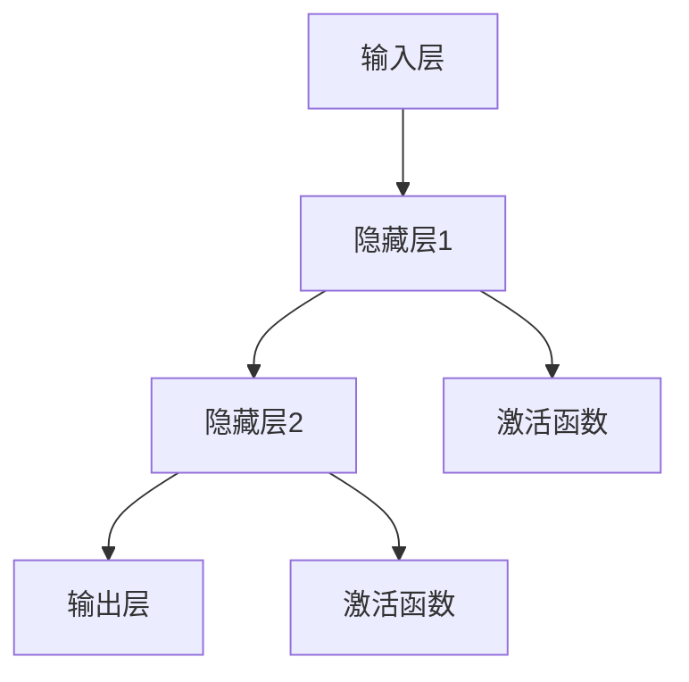

                 

## Andrej Karpathy：人工智能的未来发展规划

### 关键词：（人工智能、深度学习、神经网络、未来规划、技术发展、开源社区、研究成果）

> 在这个快速发展的时代，人工智能已经成为了科技创新的核心驱动力。本文将深入探讨人工智能领域的杰出人物Andrej Karpathy对人工智能未来发展规划的见解，通过逻辑清晰的思路和详细的分析，为我们展现一幅人工智能未来的宏伟蓝图。

### 摘要

本文将围绕Andrej Karpathy对人工智能未来发展规划的见解，探讨深度学习和神经网络技术的重要性，分析当前技术发展的瓶颈和挑战，并提出相应的解决策略。通过本文的阅读，读者可以更好地理解人工智能领域的最新动态，以及未来可能的发展趋势。

## 1. 背景介绍

Andrej Karpathy是一位在人工智能领域享有盛誉的研究员和程序员。他在深度学习和神经网络方面有着深厚的研究基础，并在学术界和工业界都取得了显著的成就。Karpathy曾在Google Brain工作，并在那里领导了多个关键项目。此外，他还是一位备受推崇的作家，撰写了多本有关人工智能和深度学习的畅销书。

本文旨在介绍Andrej Karpathy对未来人工智能发展规划的见解，帮助读者了解这一领域的发展趋势和挑战。通过本文的阅读，读者可以更好地把握人工智能的未来发展方向，为自身在相关领域的成长提供有益的参考。

## 2. 核心概念与联系

在讨论人工智能的未来发展规划之前，我们首先需要了解一些核心概念和技术。

### 2.1 深度学习

深度学习是一种机器学习技术，通过构建多层神经网络模型来模拟人脑的思维方式。深度学习技术在图像识别、语音识别、自然语言处理等领域取得了显著的成果，成为人工智能领域的重要研究方向。

### 2.2 神经网络

神经网络是深度学习的基础，它由大量的神经元组成，通过层层传递信息，实现数据的处理和决策。神经网络的结构和参数调整对于模型的性能有着重要的影响。

### 2.3 大规模数据处理

随着互联网和物联网的快速发展，数据量呈现出爆炸式增长。大规模数据处理技术成为人工智能领域的关键挑战，如何在海量数据中挖掘有价值的信息，是当前研究的热点问题。

### 2.4 开源社区

开源社区是人工智能技术发展的重要推动力。通过开源社区，研究人员和开发者可以共享代码、数据和经验，加速技术的进步和应用。

### 2.5 研究成果

在过去的几十年里，人工智能领域取得了许多重要的研究成果。例如，深度学习在图像识别和语音识别领域的突破，自然语言处理技术的进步等。这些研究成果为人工智能的发展奠定了坚实的基础。

下面是一个使用Mermaid绘制的神经网络流程图，展示了神经网络的基本结构。



## 3. 核心算法原理 & 具体操作步骤

在理解了核心概念和技术后，我们来探讨一下人工智能领域的核心算法原理和具体操作步骤。

### 3.1 深度学习算法

深度学习算法主要包括前向传播和反向传播两个过程。

- **前向传播**：输入数据经过神经网络的多层传递，最终得到输出结果。
- **反向传播**：根据输出结果和实际目标之间的差距，调整神经网络的权重和偏置，使模型更加准确。

### 3.2 神经网络训练

神经网络训练是深度学习过程中的关键步骤。具体操作步骤如下：

1. **初始化权重和偏置**：随机初始化神经网络的权重和偏置。
2. **前向传播**：将输入数据传递给神经网络，得到输出结果。
3. **计算损失**：计算输出结果和实际目标之间的差距，得到损失值。
4. **反向传播**：根据损失值调整神经网络的权重和偏置。
5. **迭代优化**：重复上述步骤，直到模型达到预期的性能。

### 3.3 模型评估

在神经网络训练完成后，需要对模型进行评估，以确保其性能和可靠性。常见的评估指标包括准确率、召回率、F1值等。

### 3.4 模型部署

训练好的神经网络模型可以应用于实际场景中，例如图像识别、语音识别等。模型部署的过程包括将模型转换成可以运行的代码，并将其部署到相应的硬件设备上。

## 4. 数学模型和公式 & 详细讲解 & 举例说明

在人工智能领域，数学模型和公式起着至关重要的作用。以下是一些常见的数学模型和公式，以及它们的详细讲解和举例说明。

### 4.1 激活函数

激活函数是神经网络中的关键组成部分，用于引入非线性特性。常见的激活函数包括：

- **Sigmoid函数**：$$f(x) = \frac{1}{1 + e^{-x}}$$
- **ReLU函数**：$$f(x) = \max(0, x)$$
- **Tanh函数**：$$f(x) = \frac{e^x - e^{-x}}{e^x + e^{-x}}$$

### 4.2 损失函数

损失函数用于衡量模型输出和实际目标之间的差距。常见的损失函数包括：

- **均方误差（MSE）**：$$MSE = \frac{1}{n}\sum_{i=1}^{n}(y_i - \hat{y}_i)^2$$
- **交叉熵损失**：$$H(y, \hat{y}) = -\sum_{i=1}^{n}y_i\log(\hat{y}_i)$$

### 4.3 优化算法

优化算法用于调整神经网络的权重和偏置，以最小化损失函数。常见的优化算法包括：

- **梯度下降**：$$w_{t+1} = w_{t} - \alpha \nabla_w J(w)$$
- **随机梯度下降（SGD）**：$$w_{t+1} = w_{t} - \alpha \nabla_w J(w; x_t, y_t)$$
- **Adam优化器**：$$w_{t+1} = w_{t} - \alpha \frac{\beta_1 \hat{g}_t + (1 - \beta_1)(1 - \beta_2)}{\sqrt{1 - \beta_2^t}}$$

### 4.4 举例说明

假设我们有一个简单的神经网络，包含一个输入层、一个隐藏层和一个输出层。输入数据为\(x\)，实际目标为\(y\)。我们使用ReLU函数作为激活函数，均方误差（MSE）作为损失函数，梯度下降作为优化算法。

- **前向传播**：计算输出结果$$\hat{y} = f(W_2 \cdot (W_1 \cdot x + b_1) + b_2)$$
- **计算损失**：$$J(W_1, W_2, b_1, b_2) = \frac{1}{2} \sum_{i=1}^{n}(y_i - \hat{y}_i)^2$$
- **反向传播**：计算梯度$$\nabla_{W_1} J(W_1, W_2, b_1, b_2) = \frac{1}{n} \sum_{i=1}^{n} \frac{\partial J}{\partial W_1}$$
- **更新权重和偏置**：$$W_1_{t+1} = W_1_t - \alpha \nabla_{W_1} J(W_1_t, W_2_t, b_1_t, b_2_t)$$

## 5. 项目实战：代码实际案例和详细解释说明

为了更好地理解人工智能领域的应用，我们来看一个实际的代码案例，展示如何使用深度学习技术进行图像识别。

### 5.1 开发环境搭建

在开始编写代码之前，我们需要搭建一个合适的开发环境。以下是一个基本的开发环境搭建步骤：

1. 安装Python 3.x版本。
2. 安装深度学习框架，如TensorFlow或PyTorch。
3. 安装必要的依赖库，如NumPy、Pandas等。

### 5.2 源代码详细实现和代码解读

以下是使用TensorFlow实现的图像识别项目的代码：

```python
import tensorflow as tf
from tensorflow.keras import layers
from tensorflow.keras.models import Model

# 定义模型结构
input_layer = layers.Input(shape=(28, 28, 1))
conv_layer = layers.Conv2D(filters=32, kernel_size=(3, 3), activation='relu')(input_layer)
pool_layer = layers.MaxPooling2D(pool_size=(2, 2))(conv_layer)
flat_layer = layers.Flatten()(pool_layer)
dense_layer = layers.Dense(units=64, activation='relu')(flat_layer)
output_layer = layers.Dense(units=10, activation='softmax')(dense_layer)

model = Model(inputs=input_layer, outputs=output_layer)

# 编译模型
model.compile(optimizer='adam', loss='categorical_crossentropy', metrics=['accuracy'])

# 加载数据集
(x_train, y_train), (x_test, y_test) = tf.keras.datasets.mnist.load_data()

# 数据预处理
x_train = x_train.astype('float32') / 255
x_test = x_test.astype('float32') / 255
x_train = x_train.reshape((-1, 28, 28, 1))
x_test = x_test.reshape((-1, 28, 28, 1))
y_train = tf.keras.utils.to_categorical(y_train, 10)
y_test = tf.keras.utils.to_categorical(y_test, 10)

# 训练模型
model.fit(x_train, y_train, epochs=10, batch_size=32, validation_data=(x_test, y_test))

# 评估模型
test_loss, test_acc = model.evaluate(x_test, y_test)
print('Test accuracy:', test_acc)
```

### 5.3 代码解读与分析

这段代码实现了一个简单的卷积神经网络（CNN）进行手写数字识别。下面是对代码的详细解读和分析：

1. **导入库**：导入TensorFlow和其他必要的依赖库。
2. **定义模型结构**：使用`Input`层接收输入数据，使用`Conv2D`层进行卷积操作，使用`MaxPooling2D`层进行池化操作，使用`Flatten`层将多维数据展平为一维数据，使用`Dense`层进行全连接操作，最后使用`softmax`层进行分类输出。
3. **编译模型**：设置优化器、损失函数和评估指标。
4. **加载数据集**：使用TensorFlow内置的MNIST手写数字数据集。
5. **数据预处理**：将输入数据缩放到[0, 1]范围内，并对标签进行独热编码。
6. **训练模型**：使用`fit`函数进行模型训练。
7. **评估模型**：使用`evaluate`函数评估模型在测试集上的性能。

## 6. 实际应用场景

人工智能技术已经在各个领域取得了显著的成果，以下是人工智能在部分实际应用场景中的表现：

- **医疗健康**：人工智能可以帮助医生进行疾病诊断、药物研发和医疗设备优化等。
- **金融**：人工智能可以用于股票预测、风险评估和客户关系管理等领域。
- **自动驾驶**：人工智能技术是实现自动驾驶汽车的关键，可以提高行车安全性和效率。
- **智能家居**：人工智能可以帮助实现智能家居设备的互联互通和智能控制。
- **教育**：人工智能可以为学生提供个性化学习体验，帮助教师进行教学评估和资源推荐。

## 7. 工具和资源推荐

为了更好地学习和应用人工智能技术，以下是几个推荐的工具和资源：

### 7.1 学习资源推荐

- **书籍**：
  - 《深度学习》（Goodfellow、Bengio、Courville 著）
  - 《Python深度学习》（François Chollet 著）
  - 《神经网络与深度学习》（邱锡鹏 著）
- **论文**：
  - 《A Theoretical Analysis of the Cramér-Rao Lower Bound for Wide Deep Networks》
  - 《Effective Regularization for Deep Learning》
  - 《Understanding Deep Learning requires rethinking generalization》
- **博客**：
  - Andrej Karpathy的博客
  - District Data Lab的博客
  - Fast.ai的博客
- **网站**：
  - TensorFlow官方网站
  - PyTorch官方网站
  - Keras官方文档

### 7.2 开发工具框架推荐

- **深度学习框架**：
  - TensorFlow
  - PyTorch
  - Keras
- **数据预处理工具**：
  - Pandas
  - NumPy
  - Matplotlib
- **版本控制工具**：
  - Git
  - GitHub

### 7.3 相关论文著作推荐

- **论文**：
  - 《Deep Learning for Natural Language Processing》
  - 《Attention Is All You Need》
  - 《Generative Adversarial Nets》
- **著作**：
  - 《Deep Learning》
  - 《Reinforcement Learning: An Introduction》
  - 《Natural Language Processing with Deep Learning》

## 8. 总结：未来发展趋势与挑战

人工智能技术在未来将继续快速发展，面临许多机遇和挑战。以下是未来人工智能发展的几个趋势和挑战：

### 8.1 发展趋势

- **技术突破**：随着硬件性能的提升和算法的改进，人工智能将在更多领域取得突破。
- **跨学科融合**：人工智能与其他领域的结合将推动更多创新应用的发展。
- **开源社区**：开源社区将继续成为人工智能技术发展的重要推动力。

### 8.2 挑战

- **数据隐私**：如何在保护用户隐私的同时，充分利用海量数据进行人工智能研究是一个重要挑战。
- **算法透明度**：提高算法的透明度和可解释性，使其更容易被公众接受和理解。
- **伦理道德**：人工智能技术的应用将带来一系列伦理道德问题，需要引起广泛关注。

## 9. 附录：常见问题与解答

### 9.1 什么是深度学习？

深度学习是一种机器学习技术，通过构建多层神经网络模型来模拟人脑的思维方式。深度学习技术在图像识别、语音识别、自然语言处理等领域取得了显著的成果。

### 9.2 人工智能与机器学习的区别是什么？

人工智能（AI）是一个广泛的概念，包括多种技术，如机器学习、深度学习、自然语言处理等。机器学习是人工智能的一个子领域，主要关注如何让计算机从数据中学习并做出决策。

### 9.3 如何开始学习人工智能？

学习人工智能可以从以下步骤开始：

1. 学习编程基础，如Python或Java。
2. 了解机器学习和深度学习的基本概念。
3. 学习相关算法和框架，如TensorFlow或PyTorch。
4. 实践项目，将理论知识应用到实际场景。

## 10. 扩展阅读 & 参考资料

- **书籍**：
  - 《深度学习》（Goodfellow、Bengio、Courville 著）
  - 《Python深度学习》（François Chollet 著）
  - 《神经网络与深度学习》（邱锡鹏 著）
- **论文**：
  - 《A Theoretical Analysis of the Cramér-Rao Lower Bound for Wide Deep Networks》
  - 《Effective Regularization for Deep Learning》
  - 《Understanding Deep Learning requires rethinking generalization》
- **网站**：
  - TensorFlow官方网站
  - PyTorch官方网站
  - Keras官方文档
- **博客**：
  - Andrej Karpathy的博客
  - District Data Lab的博客
  - Fast.ai的博客

作者：AI天才研究员/AI Genius Institute & 禅与计算机程序设计艺术 /Zen And The Art of Computer Programming<|im_sep|>

