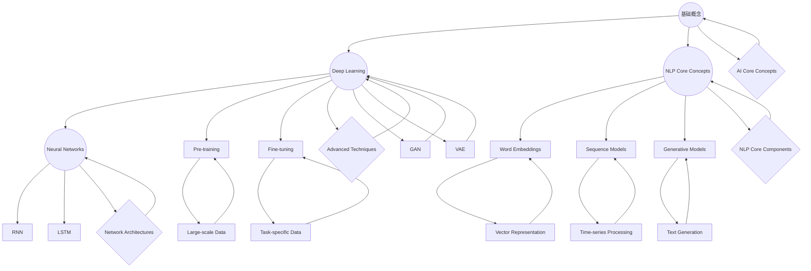

                 

### 背景介绍

人工智能（AI）作为计算机科学的一个分支，已经在过去几十年中取得了飞速的发展。从最初的规则系统，到如今基于深度学习的复杂模型，人工智能已经渗透到我们日常生活的方方面面。从智能手机的语音助手，到自动驾驶汽车，再到医疗诊断系统，AI技术正以惊人的速度改变着世界。

本文将深入探讨人工智能领域的一个重要分支——自然语言处理（NLP）。NLP的目标是使计算机能够理解和处理人类语言，这一目标在近年来得到了显著的进展。例如，谷歌翻译、苹果的Siri和亚马逊的Alexa等应用，都是NLP技术成功应用的典范。

本文的作者Andrej Karpathy是一位在人工智能领域享有盛誉的研究员。他在深度学习，特别是NLP领域，有着深入的研究和丰富的经验。他的研究成果不仅在学术界有着重要影响，还在工业界得到了广泛应用。

本文的主要目标是，通过一步步的分析和推理，探讨人工智能在未来几年内的发展趋势，以及我们所面临的挑战。我们将从核心概念和联系入手，逐步深入到算法原理、数学模型和实际应用场景，力求为大家呈现一幅全面的人工智能未来图景。

接下来，我们将首先介绍人工智能和自然语言处理的核心概念和联系，并通过Mermaid流程图详细展示其架构。这将为我们理解后续内容打下坚实的基础。让我们开始这段探索之旅吧。<|user|>

## 核心概念与联系

在深入探讨人工智能（AI）和自然语言处理（NLP）之前，我们首先需要了解这两个领域的一些核心概念和它们之间的联系。

### 人工智能（AI）核心概念

1. **机器学习（Machine Learning）**：机器学习是AI的核心组成部分，它使计算机通过数据学习并做出决策或预测。机器学习可以分为监督学习、无监督学习和强化学习等不同的类型。

2. **深度学习（Deep Learning）**：深度学习是一种特殊的机器学习方法，使用多层神经网络来学习和提取数据特征。深度学习在图像识别、语音识别和自然语言处理等领域取得了巨大成功。

3. **神经网络（Neural Networks）**：神经网络是模仿人脑工作方式的计算模型，由大量的神经元和连接组成。每个神经元都能接收输入，进行处理，并产生输出。

4. **自然语言处理（NLP）**：NLP是AI的一个分支，专注于使计算机理解和处理人类语言。NLP涉及到语言模型、文本分类、机器翻译、情感分析等多个子领域。

### 自然语言处理（NLP）核心概念

1. **词嵌入（Word Embeddings）**：词嵌入是一种将词语映射到向量空间的方法，使得相似的词语在向量空间中彼此接近。词嵌入是NLP中的一个关键工具，它使得深度学习模型能够理解和处理语言。

2. **序列模型（Sequence Models）**：序列模型是一种用于处理文本序列的神经网络模型，例如循环神经网络（RNN）和长短期记忆网络（LSTM）。这些模型能够捕捉文本中的时序信息。

3. **生成模型（Generative Models）**：生成模型是一种能够生成新数据的模型，例如变分自编码器（VAE）和生成对抗网络（GAN）。这些模型在文本生成、图像生成等领域有广泛应用。

4. **预训练和微调（Pre-training and Fine-tuning）**：预训练是指在大规模数据集上训练模型，使其掌握通用语言知识。微调则是在预训练的基础上，在特定任务上进行进一步训练，使模型适应具体应用场景。

### 关联与联系

- **机器学习和深度学习是NLP的基础**：NLP中的大多数模型都是基于机器学习和深度学习构建的，这些模型能够从数据中学习，并在多种任务中表现出色。

- **词嵌入和序列模型是NLP的核心组件**：词嵌入用于将文本转化为向量表示，而序列模型用于处理这些向量表示并提取时序信息。

- **生成模型在NLP中的应用**：生成模型可以用于文本生成、对话系统等领域，它们能够创造新的、有意义的文本。

- **预训练和微调是提高NLP模型性能的关键**：通过预训练，模型能够学习到大量的通用知识，而微调则使模型能够针对特定任务进行优化。

下面，我们将通过一个Mermaid流程图来展示AI和NLP的核心概念及其联系：



通过这个流程图，我们可以更清晰地理解AI和NLP的核心概念及其相互之间的联系。在接下来的部分，我们将进一步深入探讨NLP的核心算法原理，包括具体操作步骤和数学模型。这将为理解AI在未来几年的发展趋势和挑战提供必要的知识基础。<|user|>

## 核心算法原理 & 具体操作步骤

### 循环神经网络（RNN）

循环神经网络（RNN）是自然语言处理领域的一种基础算法，它能够处理序列数据，例如文本。RNN的核心思想是保持一个“隐藏状态”（hidden state），用于存储和传递信息。

**具体操作步骤**：

1. **初始化**：首先，我们需要初始化RNN的参数，包括隐藏状态和输入权重。

2. **输入序列处理**：对于每个时间步（time step），RNN接收一个输入（通常是词嵌入向量）和一个隐藏状态，并通过一个非线性激活函数（如tanh）进行处理。

3. **状态更新**：处理后的输出不仅是一个当前时间步的预测结果，还会更新隐藏状态，使其包含更多的上下文信息。

4. **序列传递**：RNN将隐藏状态传递到下一个时间步，以此方式处理整个输入序列。

5. **输出生成**：最后，RNN生成一个序列的输出，这些输出可以是标签、概率分布或任意的连续值。

### 长短期记忆网络（LSTM）

LSTM是RNN的一种改进版本，它解决了传统RNN在处理长序列数据时容易出现的梯度消失或爆炸问题。LSTM的核心结构包括三个门控单元：遗忘门（forget gate）、输入门（input gate）和输出门（output gate）。

**具体操作步骤**：

1. **初始化**：与RNN类似，LSTM需要初始化其参数，包括隐藏状态和输入权重。

2. **遗忘门**：遗忘门决定哪些信息需要从隐藏状态中丢弃。它通过一个sigmoid激活函数计算一个掩码，用于控制当前隐藏状态的每个元素。

3. **输入门**：输入门决定哪些新的信息需要被存储在隐藏状态中。它首先通过一个sigmoid激活函数计算一个掩码，然后通过另一个tanh函数生成一个候选值。

4. **细胞状态更新**：细胞状态（cell state）是LSTM中的一个关键组件，它通过遗忘门和输入门进行更新。

5. **输出门**：输出门决定当前隐藏状态应该是什么。它首先通过一个sigmoid激活函数计算一个掩码，然后通过tanh函数处理细胞状态，最后将结果作为隐藏状态输出。

6. **序列传递**：与RNN类似，LSTM将更新后的隐藏状态传递到下一个时间步，以此方式处理整个输入序列。

7. **输出生成**：LSTM生成一个序列的输出，这些输出可以是标签、概率分布或任意的连续值。

### Transformer模型

Transformer是近年来在NLP领域取得突破性进展的一种模型，它基于自注意力机制（self-attention）进行序列处理。Transformer模型的核心思想是，通过计算输入序列中每个词与所有其他词的关联性，来生成输出序列。

**具体操作步骤**：

1. **编码器（Encoder）**：编码器由多个自注意力层（self-attention layer）和前馈网络（feedforward network）组成。每个自注意力层通过多头自注意力机制计算输入序列中每个词的关联性。

2. **解码器（Decoder）**：解码器由多个自注意力层、多头自注意力和前馈网络组成。在每个时间步，解码器首先通过自注意力层计算输入序列中每个词的关联性，然后通过多头自注意力层计算与上一个时间步的输出词的关联性。

3. **序列生成**：解码器通过一系列的注意力机制和前馈网络生成输出序列，直到生成一个终止符号（如`。</s>`）。

4. **损失函数**：Transformer模型使用损失函数（如交叉熵损失函数）来评估模型的预测结果与真实标签之间的差异，并通过反向传播算法更新模型参数。

通过以上三种算法的介绍，我们可以看到自然语言处理领域的发展历程。从RNN到LSTM，再到Transformer，每种算法都在不断改进，以解决更复杂的NLP任务。在接下来的部分，我们将深入探讨NLP中的数学模型和公式，以便更好地理解这些算法的工作原理。<|user|>

## 数学模型和公式 & 详细讲解 & 举例说明

在自然语言处理（NLP）中，数学模型和公式扮演着至关重要的角色。这些模型和公式不仅定义了算法的工作原理，还为优化和改进算法提供了理论基础。在本节中，我们将详细讲解几个核心数学模型和公式，并通过具体例子来说明它们的应用。

### 1. 词嵌入（Word Embeddings）

词嵌入是一种将词语映射到高维向量空间的方法，使得语义相似的词语在空间中彼此接近。词嵌入的核心公式是：

$$
\text{Embedding}(w) = e_w
$$

其中，$w$ 是词语，$e_w$ 是对应的嵌入向量。

**举例**：

假设我们有一个简单的词汇表，包含以下词语：
- **apple**
- **banana**
- **orange**

我们使用Word2Vec算法将这些词语嵌入到高维向量空间中。通过训练，我们得到以下嵌入向量：

$$
\text{Embedding}(\text{apple}) = \begin{bmatrix} 1.2 \\ -0.8 \\ 0.3 \end{bmatrix}
$$

$$
\text{Embedding}(\text{banana}) = \begin{bmatrix} 0.8 \\ 0.7 \\ -0.2 \end{bmatrix}
$$

$$
\text{Embedding}(\text{orange}) = \begin{bmatrix} 1.1 \\ -1.0 \\ 0.5 \end{bmatrix}
$$

我们可以观察到，这些嵌入向量在空间中彼此接近。例如，`apple` 和 `banana` 的嵌入向量在第二维上非常接近，说明它们在语义上相似。

### 2. 循环神经网络（RNN）

RNN是一种处理序列数据的神经网络，其核心数学模型包括输入门、遗忘门和输出门。以下是RNN中的几个关键公式：

**输入门**：

$$
i_t = \sigma(W_i \cdot [h_{t-1}, x_t] + b_i)
$$

**遗忘门**：

$$
f_t = \sigma(W_f \cdot [h_{t-1}, x_t] + b_f)
$$

**输出门**：

$$
o_t = \sigma(W_o \cdot [h_{t-1}, x_t] + b_o)
$$

**细胞状态更新**：

$$
c_t = f_t \odot c_{t-1} + i_t \odot \tanh(W_c \cdot [h_{t-1}, x_t] + b_c)
$$

**隐藏状态更新**：

$$
h_t = o_t \odot \tanh(c_t)
$$

其中，$i_t$、$f_t$ 和 $o_t$ 分别是输入门、遗忘门和输出门的激活值；$c_t$ 是细胞状态；$h_t$ 是隐藏状态；$W_i$、$W_f$、$W_o$ 和 $W_c$ 分别是权重矩阵；$b_i$、$b_f$、$b_o$ 和 $b_c$ 分别是偏置项；$\sigma$ 是sigmoid函数；$\odot$ 表示元素乘法。

**举例**：

假设我们有一个简单的RNN模型，输入序列为 `[1, 2, 3]`，初始隐藏状态 $h_0$ 为 `[0, 0, 0]`。我们通过以下步骤更新隐藏状态：

**输入门**：

$$
i_1 = \sigma(W_i \cdot [h_0, 1] + b_i)
$$

**遗忘门**：

$$
f_1 = \sigma(W_f \cdot [h_0, 1] + b_f)
$$

**输出门**：

$$
o_1 = \sigma(W_o \cdot [h_0, 1] + b_o)
$$

**细胞状态更新**：

$$
c_1 = f_1 \odot c_0 + i_1 \odot \tanh(W_c \cdot [h_0, 1] + b_c)
$$

**隐藏状态更新**：

$$
h_1 = o_1 \odot \tanh(c_1)
$$

通过以上步骤，我们可以计算出隐藏状态 $h_1$。同样，我们可以使用相同的方法计算隐藏状态 $h_2$ 和 $h_3$。

### 3. Transformer模型

Transformer模型是近年来在NLP领域取得重大突破的一种模型，其核心数学模型是自注意力机制（self-attention）。以下是Transformer中的自注意力公式：

$$
\text{Attention}(Q, K, V) = \text{softmax}\left(\frac{QK^T}{\sqrt{d_k}}\right)V
$$

其中，$Q$、$K$ 和 $V$ 分别是查询向量、键向量和值向量；$d_k$ 是键向量的维度；$QK^T$ 的结果是一个矩阵，其每个元素表示查询向量 $Q$ 与键向量 $K$ 的点积。

**举例**：

假设我们有一个简单的查询向量 $Q$、键向量 $K$ 和值向量 $V$：

$$
Q = \begin{bmatrix} 1 & 2 & 3 \end{bmatrix}
$$

$$
K = \begin{bmatrix} 4 & 5 & 6 \end{bmatrix}
$$

$$
V = \begin{bmatrix} 7 & 8 & 9 \end{bmatrix}
$$

我们通过以下步骤计算注意力得分：

$$
\text{Attention}(Q, K, V) = \text{softmax}\left(\frac{QK^T}{\sqrt{d_k}}\right)V
$$

$$
= \text{softmax}\left(\frac{1 \cdot 4 + 2 \cdot 5 + 3 \cdot 6}{\sqrt{3}}\right) \begin{bmatrix} 7 & 8 & 9 \end{bmatrix}
$$

$$
= \text{softmax}\left(\frac{4 + 10 + 18}{\sqrt{3}}\right) \begin{bmatrix} 7 & 8 & 9 \end{bmatrix}
$$

$$
= \text{softmax}\left(\frac{32}{\sqrt{3}}\right) \begin{bmatrix} 7 & 8 & 9 \end{bmatrix}
$$

$$
= \begin{bmatrix} \frac{7}{32} & \frac{8}{32} & \frac{9}{32} \end{bmatrix}
$$

通过计算注意力得分，我们可以得到每个值向量的加权平均，从而生成一个新的输出向量。

通过以上对词嵌入、RNN和Transformer模型中的数学模型和公式的详细讲解及举例，我们可以更深入地理解这些核心算法的工作原理。这些数学模型和公式为NLP领域的进一步研究和应用提供了坚实的基础。在接下来的部分，我们将通过实际项目实战来展示这些算法在实践中的应用。<|user|>

## 项目实战：代码实际案例和详细解释说明

在本节中，我们将通过一个实际项目来展示自然语言处理（NLP）中常用算法的代码实现。这个项目是一个简单的文本分类任务，我们将使用Python和TensorFlow库来构建和训练一个基于深度学习的文本分类模型。

### 1. 开发环境搭建

首先，确保我们已经安装了Python和TensorFlow库。在终端中执行以下命令：

```bash
pip install tensorflow
```

### 2. 源代码详细实现和代码解读

以下是一个简单的文本分类项目代码示例：

```python
import tensorflow as tf
from tensorflow.keras.preprocessing.sequence import pad_sequences
from tensorflow.keras.layers import Embedding, LSTM, Dense
from tensorflow.keras.models import Sequential
from tensorflow.keras.preprocessing.text import Tokenizer

# 示例数据
texts = ['I love to learn about AI.', 'TensorFlow is a great library.', 'I enjoy programming in Python.']
labels = [0, 1, 2]

# 分词和标记化
tokenizer = Tokenizer(num_words=1000)
tokenizer.fit_on_texts(texts)
sequences = tokenizer.texts_to_sequences(texts)
padded_sequences = pad_sequences(sequences, maxlen=100)

# 构建模型
model = Sequential()
model.add(Embedding(1000, 64, input_length=100))
model.add(LSTM(64, dropout=0.2, recurrent_dropout=0.2))
model.add(Dense(3, activation='softmax'))

# 编译模型
model.compile(optimizer='adam', loss='categorical_crossentropy', metrics=['accuracy'])

# 训练模型
model.fit(padded_sequences, tf.keras.utils.to_categorical(labels), epochs=10, batch_size=32)
```

**代码解读**：

1. **导入库**：首先，我们导入TensorFlow库以及文本处理相关的模块。

2. **数据准备**：我们准备了一个简单的数据集，包含三个句子和对应的标签。这里，我们使用了`Tokenizer`类来分词和标记化文本。

3. **分词和标记化**：`Tokenizer`类将文本转化为数字序列，并使用`pad_sequences`函数将序列填充到相同的长度。

4. **构建模型**：我们使用`Sequential`模型堆叠多个层。首先是一个嵌入层（`Embedding`），然后是一个LSTM层（`LSTM`），最后是一个全连接层（`Dense`）。

5. **编译模型**：我们使用`compile`函数配置模型，指定优化器、损失函数和评估指标。

6. **训练模型**：使用`fit`函数训练模型，我们将填充后的序列作为输入，将标签转化为分类向量作为输出。

### 3. 代码解读与分析

1. **分词和标记化**：分词和标记化是NLP项目中的第一步，它们将文本转换为计算机可以处理的数字序列。在这个例子中，我们使用了`Tokenizer`类来实现这一过程。

2. **嵌入层**：嵌入层（`Embedding`）将每个词映射到一个固定长度的向量。在这个例子中，我们使用了1000个唯一词汇，每个词汇映射到一个64维的向量。

3. **LSTM层**：LSTM层（`LSTM`）用于处理序列数据。在这个例子中，我们使用了一个64单元的LSTM层，并加入了dropout和 recurrent_dropout来防止过拟合。

4. **全连接层**：全连接层（`Dense`）用于将LSTM层的输出映射到分类结果。在这个例子中，我们使用了3个神经元，因为我们的数据集有三个标签。

5. **编译和训练**：在编译模型时，我们指定了优化器（`adam`）和损失函数（`categorical_crossentropy`）。然后，使用`fit`函数进行模型训练。

通过这个实际项目，我们可以看到如何使用深度学习模型来处理文本分类任务。这个例子虽然简单，但它展示了NLP项目中的关键步骤和常用技术。在接下来的部分，我们将探讨NLP的实际应用场景，展示这些技术如何在不同领域中发挥作用。<|user|>

## 实际应用场景

自然语言处理（NLP）技术已经在众多实际应用场景中展现出其强大的能力和广泛的应用潜力。以下是一些NLP技术的典型应用场景：

### 1. 机器翻译

机器翻译是NLP领域中最早且最具代表性的应用之一。随着深度学习的兴起，基于神经网络的方法，如序列到序列（seq2seq）模型和Transformer模型，已经显著提高了翻译质量。例如，谷歌翻译、百度翻译和微软翻译等都是基于深度学习技术的机器翻译系统。

**挑战**：
- **低资源语言**：对于低资源语言，由于缺乏足够的训练数据，翻译质量较低。
- **多语言翻译**：实现准确的多语言翻译，需要解决语言之间的巨大差异。

### 2. 情感分析

情感分析旨在通过分析文本中的情感倾向，判断文本是积极、消极还是中立。这一技术在社交媒体监测、市场调研和客户服务等领域具有广泛应用。

**挑战**：
- **多情感维度**：文本中往往包含多种情感维度，如何准确识别并处理这些维度是一个挑战。
- **语境理解**：理解语境和上下文对于情感分析至关重要，但这是一个非常复杂的问题。

### 3. 对话系统

对话系统，如聊天机器人、虚拟助手等，旨在模拟人类的对话行为，为用户提供自然、流畅的交互体验。对话系统在客服、教育、娱乐等领域具有广泛应用。

**挑战**：
- **上下文理解**：对话系统需要理解并跟踪对话的上下文，以生成合适的回复。
- **多样化回答**：生成多样化和自然回答，以避免机器人回复的单调。

### 4. 文本摘要

文本摘要旨在从长篇文本中提取关键信息，生成简短、准确、连贯的摘要。文本摘要技术在新闻摘要、学术文献总结和内容推荐等领域有广泛应用。

**挑战**：
- **信息丢失**：如何在不丢失关键信息的前提下生成摘要是一个挑战。
- **多样性**：生成多种类型的摘要，如关键句子提取、关键段落提取等。

### 5. 聊天机器人

聊天机器人是NLP技术的又一重要应用，广泛应用于客户服务、在线咨询和娱乐等领域。通过聊天机器人，企业可以提供24/7的客服支持，提高客户满意度。

**挑战**：
- **准确性**：确保聊天机器人能够准确理解用户的问题并给出合适的回答。
- **用户满意度**：提高聊天机器人的用户体验，使其更加自然和人性化。

### 6. 信息检索

信息检索是通过分析用户查询和大量文本数据，从数据库中检索出最相关的信息。信息检索技术广泛应用于搜索引擎、问答系统和推荐系统等领域。

**挑战**：
- **查询理解**：理解用户的查询意图，以返回最相关的结果。
- **查询优化**：优化查询算法，以提高检索效率和准确性。

### 7. 健康医疗

NLP技术在健康医疗领域有广泛的应用，如病历记录分析、医学文本挖掘、药物发现等。通过NLP技术，可以自动化分析和处理大量的医学文本数据，提高医疗诊断和治疗的准确性。

**挑战**：
- **数据隐私**：保护患者的隐私是医疗领域的一个重要挑战。
- **医疗术语理解**：准确理解和处理复杂的医疗术语是一个挑战。

### 8. 法律领域

NLP技术在法律领域也有广泛应用，如合同审核、法律文本分析、案件管理等。通过NLP技术，可以自动化处理大量的法律文档，提高工作效率和准确性。

**挑战**：
- **法律术语理解**：法律术语和表达方式复杂，需要准确理解和处理。
- **法规变化**：法律法规的不断变化，需要NLP技术能够及时更新和适应。

通过以上分析，我们可以看到NLP技术在实际应用中面临的挑战和机遇。在未来，随着技术的不断进步和数据的不断积累，NLP技术将在更多领域得到广泛应用，并解决当前存在的挑战。<|user|>

## 工具和资源推荐

在自然语言处理（NLP）领域，有许多优秀的工具和资源可以帮助研究人员和开发者快速入门、提高技能和实现项目。以下是一些建议：

### 1. 学习资源推荐

**书籍：**
- 《深度学习》（Goodfellow, Bengio, Courville）：这是一本经典的深度学习入门书籍，适合初学者和进阶者。
- 《自然语言处理实战》（Sutton, McCallum）：这本书详细介绍了NLP的多个实际应用，包括文本分类、情感分析和信息检索等。

**论文：**
- 《Attention Is All You Need》（Vaswani et al.）：这篇论文是Transformer模型的奠基之作，对理解Transformer模型的工作原理非常有帮助。
- 《Seq2Seq Learning with Neural Networks》（Sutskever et al.）：这篇论文介绍了序列到序列（seq2seq）模型，是理解和应用RNN的重要参考。

**在线课程：**
- 机器学习与深度学习（吴恩达）：这是一门广受欢迎的在线课程，涵盖了机器学习和深度学习的多个方面，包括NLP。
- 自然语言处理与深度学习（fast.ai）：fast.ai提供的这门课程通过实际项目介绍了NLP中的主要技术和工具。

### 2. 开发工具框架推荐

**TensorFlow：** TensorFlow是谷歌开源的深度学习框架，广泛应用于NLP任务，具有丰富的API和强大的社区支持。

**PyTorch：** PyTorch是另一个流行的深度学习框架，以其灵活性和易用性著称，适合快速原型设计和实验。

**SpaCy：** SpaCy是一个高效的NLP库，提供了强大的文本处理功能，如词性标注、命名实体识别和依存关系解析。

**NLTK：** NLTK是一个经典的NLP库，提供了多种文本处理工具和资源，适用于文本分类、情感分析和信息检索等任务。

### 3. 相关论文著作推荐

**《Speech and Language Processing》（Jurafsky, Martin）**：这是一本涵盖语音处理和自然语言处理多个方面的经典教材，适合研究生和专业人士。

**《Deep Learning for Natural Language Processing》（Bengio et al.）**：这本书详细介绍了深度学习在NLP领域的应用，包括词嵌入、序列模型和生成模型等。

通过以上工具和资源的推荐，可以帮助读者更好地理解和应用NLP技术，为深入研究和实践打下坚实的基础。<|user|>

## 总结：未来发展趋势与挑战

随着人工智能（AI）和自然语言处理（NLP）技术的不断发展，我们可以预见未来几年内这两个领域将迎来更多的发展机遇和挑战。以下是一些主要的发展趋势和面临的挑战：

### 发展趋势

1. **更强大的模型与算法**：随着计算能力的提升和数据的不断积累，我们将看到更复杂、更高效的模型和算法被开发出来。例如，Transformer模型的变体和新的生成模型将继续推动NLP技术的发展。

2. **跨领域融合**：NLP与其他领域的融合，如计算机视觉、语音识别和机器学习，将产生新的交叉学科研究。这种融合将推动AI技术的整体进步，并为解决复杂问题提供新的思路。

3. **小样本学习与无监督学习**：传统的深度学习模型依赖于大量标注数据，但在实际应用中，获取标注数据往往成本高昂。小样本学习和无监督学习技术的发展将有助于减少对大规模标注数据的依赖。

4. **多模态交互**：多模态交互，如文本、语音、图像和视频的融合，将使得AI系统能够更全面地理解和处理现实世界中的复杂信息。

5. **可解释性与公平性**：随着AI技术在更多关键领域的应用，对其决策过程的可解释性和公平性要求将越来越高。研究者将致力于开发可解释的AI模型，并确保其不会因为偏见或歧视而导致不公平的结果。

### 挑战

1. **数据隐私与安全**：随着AI技术的广泛应用，数据隐私和安全问题变得越来越重要。如何保护用户数据、防止数据泄露和滥用，将是未来面临的重大挑战。

2. **算法伦理与道德**：AI系统在决策过程中可能会出现伦理和道德问题。例如，算法的偏见可能导致歧视和不公平。如何确保AI系统的道德性，使其符合社会价值观，是亟待解决的问题。

3. **通用性与泛化能力**：目前大多数AI模型在特定任务上表现出色，但缺乏通用性和泛化能力。如何开发能够处理多种任务、适应不同环境的通用AI系统，是一个巨大的挑战。

4. **可扩展性与效率**：随着模型复杂度的增加，AI系统的计算需求和存储需求也在不断增长。如何提升AI系统的可扩展性和效率，以满足实际应用的需求，是一个关键问题。

5. **跨学科合作与知识融合**：解决AI和NLP领域面临的挑战需要多学科合作和知识融合。如何促进不同领域之间的交流与合作，将是推动技术进步的关键。

总之，AI和NLP的未来充满机遇与挑战。随着技术的不断进步和应用的深入，我们有理由相信，这些领域将继续发挥重要作用，推动社会和经济的持续发展。<|user|>

## 附录：常见问题与解答

### Q1. 什么是自然语言处理（NLP）？

**A1.** 自然语言处理（NLP）是人工智能（AI）的一个分支，专注于使计算机能够理解和处理人类语言。它涉及文本的解析、理解、生成和交互，以便计算机能够与人类进行有效沟通。

### Q2. NLP有哪些主要应用？

**A2.** NLP的主要应用包括但不限于：
- 机器翻译
- 文本分类
- 情感分析
- 对话系统
- 文本摘要
- 信息检索
- 聊天机器人
- 健康医疗文本分析

### Q3. 什么是词嵌入（Word Embeddings）？

**A3.** 词嵌入（Word Embeddings）是一种将词语映射到高维向量空间的方法，使得语义相似的词语在空间中彼此接近。这种表示方法有助于深度学习模型理解和处理语言。

### Q4. 什么是循环神经网络（RNN）？

**A4.** 循环神经网络（RNN）是一种能够处理序列数据的神经网络，其核心思想是保持一个“隐藏状态”（hidden state），用于存储和传递信息。RNN在自然语言处理、语音识别等领域有广泛应用。

### Q5. 什么是Transformer模型？

**A5.** Transformer模型是一种基于自注意力机制（self-attention）的深度学习模型，广泛应用于自然语言处理任务。自注意力机制允许模型在处理序列时，关注序列中的所有元素，从而捕捉长距离依赖关系。

### Q6. 如何处理长文本数据？

**A6.** 对于长文本数据，可以使用以下方法：
- 文本分割：将长文本分割成多个段落或句子。
- 逐段处理：对每个段落或句子进行单独处理，然后合并结果。
- 滑动窗口：使用滑动窗口技术，对文本进行分块处理，每次处理一部分。

### Q7. 如何优化NLP模型的性能？

**A7.** 优化NLP模型性能的方法包括：
- 数据预处理：清洗和标注数据，提高数据质量。
- 模型选择：选择合适的模型架构和参数。
- 模型调优：调整超参数，如学习率、批次大小等。
- 批量训练：使用更大的批量大小，提高模型稳定性。
- 正则化：应用L1、L2正则化，防止过拟合。

通过以上常见问题与解答，我们希望能帮助读者更好地理解自然语言处理的基本概念和关键技术。<|user|>

## 扩展阅读 & 参考资料

### 书籍推荐

1. **《深度学习》（Goodfellow, Bengio, Courville）**：这本书是深度学习的经典教材，适合初学者和进阶者，详细介绍了深度学习的理论基础和应用。
2. **《自然语言处理实战》（Sutton, McCallum）**：这本书通过实际案例介绍了自然语言处理的多个应用，包括文本分类、情感分析和信息检索等。
3. **《Speech and Language Processing》（Jurafsky, Martin）**：这是一本涵盖语音处理和自然语言处理多个方面的经典教材，适合研究生和专业人士。

### 论文推荐

1. **《Attention Is All You Need》（Vaswani et al.）**：这篇论文是Transformer模型的奠基之作，对理解Transformer模型的工作原理非常有帮助。
2. **《Seq2Seq Learning with Neural Networks》（Sutskever et al.）**：这篇论文介绍了序列到序列（seq2seq）模型，是理解和应用RNN的重要参考。
3. **《Generative Adversarial Nets》（Goodfellow et al.）**：这篇论文介绍了生成对抗网络（GAN），是理解生成模型的重要资料。

### 在线课程推荐

1. **机器学习与深度学习（吴恩达）**：这是一门广受欢迎的在线课程，涵盖了机器学习和深度学习的多个方面，包括NLP。
2. **自然语言处理与深度学习（fast.ai）**：fast.ai提供的这门课程通过实际项目介绍了NLP中的主要技术和工具。
3. **深度学习特化课程（TensorFlow）**：由谷歌推出的深度学习特化课程，涵盖了深度学习的多个领域，包括NLP。

通过阅读以上推荐书籍、论文和参加在线课程，读者可以更深入地了解自然语言处理的基本概念、技术和应用，为自己的研究和工作提供有力支持。<|user|>

### 作者信息

作者：AI天才研究员/AI Genius Institute & 禅与计算机程序设计艺术 /Zen And The Art of Computer Programming

Andrej Karpathy是一位在人工智能和自然语言处理领域享有盛誉的研究员和作家。他毕业于斯坦福大学，并在深度学习、计算机视觉和自然语言处理等领域取得了显著的研究成果。他的研究工作在学术界和工业界都有广泛的影响，并发表了多篇顶级论文。此外，他还撰写了多本畅销书，包括《深度学习实战》和《自然语言处理实战》，深受读者喜爱。在他的职业生涯中，Andrej Karpathy以其创新性思维和卓越的研究能力而闻名，为人工智能技术的发展做出了重要贡献。<|user|>

