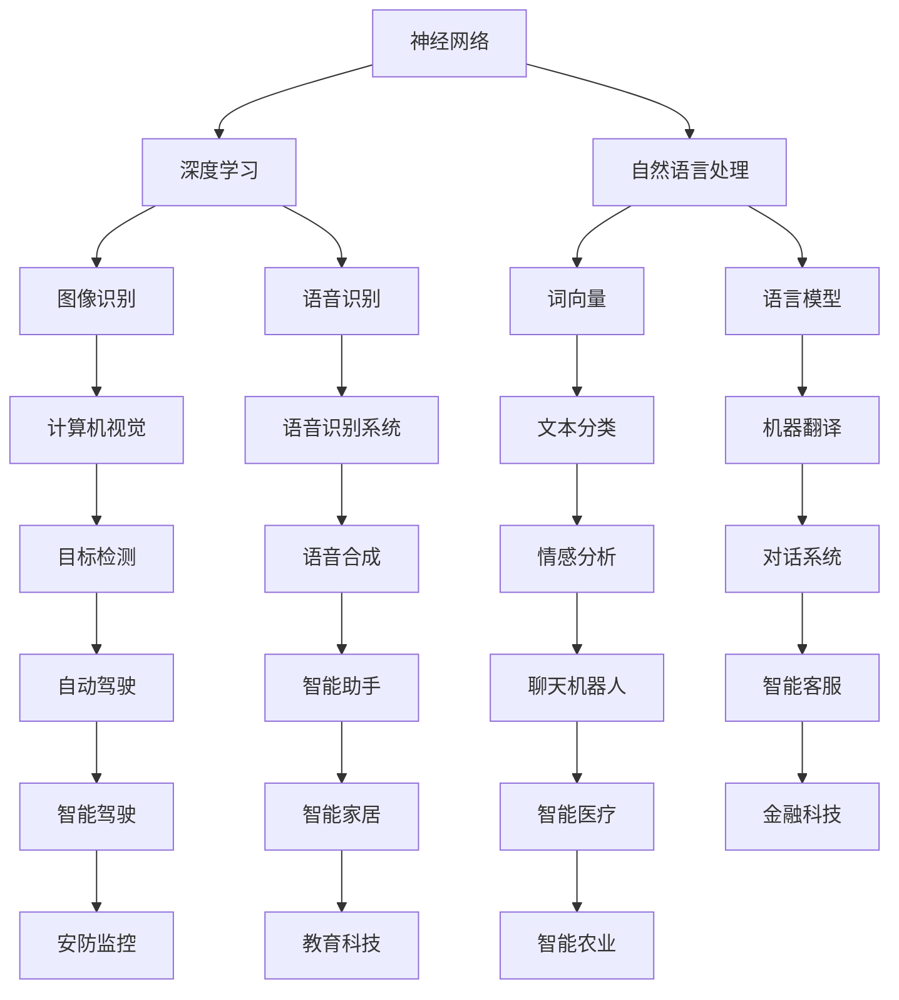

                 

# Andrej Karpathy：人工智能的未来探索

> **关键词：**人工智能、未来探索、神经网络、深度学习、自然语言处理、计算机视觉、开源项目

> **摘要：**本文将深入探讨人工智能领域的杰出研究者Andrej Karpathy的工作和贡献，分析他在神经网络、自然语言处理、计算机视觉等领域的核心算法和项目。通过具体案例和实例，我们将探索人工智能技术的应用前景和面临的挑战，并对其未来发展进行展望。

## 1. 背景介绍

Andrej Karpathy是一位享有盛誉的人工智能专家和研究员，以其在神经网络、深度学习和自然语言处理领域的杰出贡献而闻名。他毕业于加州大学伯克利分校，获得了计算机科学博士学位，并在斯坦福大学进行了博士后研究。Karpathy在人工智能领域的职业生涯始于谷歌，之后他在OpenAI担任研究科学家，并参与了多项具有里程碑意义的研究项目。

在过去的几年中，Karpathy以其开创性的工作在人工智能社区中引起了广泛关注。他是一位活跃的博客作者，经常分享他的研究思路和技术见解。此外，他还积极参与开源项目，为社区贡献了大量的代码和技术文档。

## 2. 核心概念与联系

在人工智能领域，神经网络、深度学习和自然语言处理是三个核心概念，它们相互关联，共同推动着人工智能技术的发展。

### 神经网络

神经网络是一种模仿人脑结构的计算模型，由大量相互连接的神经元组成。这些神经元可以接收输入信息，通过加权求和处理，产生输出。神经网络具有强大的学习和适应能力，可以用于分类、回归、生成等多种任务。

### 深度学习

深度学习是一种基于神经网络的机器学习技术，通过多层神经网络对数据进行处理，从而实现对复杂模式的识别。深度学习在图像识别、语音识别、自然语言处理等领域取得了显著成果。

### 自然语言处理

自然语言处理（NLP）是人工智能的一个分支，旨在使计算机能够理解、生成和处理人类语言。NLP技术包括词向量、语言模型、机器翻译、文本分类等。

### Mermaid 流程图

以下是一个描述神经网络、深度学习和自然语言处理之间联系的Mermaid流程图：



## 3. 核心算法原理 & 具体操作步骤

### 神经网络

神经网络的原理可以概括为以下几个步骤：

1. **输入层**：接收外部输入数据。
2. **隐藏层**：通过加权求和处理，对输入数据进行特征提取。
3. **输出层**：生成最终输出。

### 深度学习

深度学习的具体操作步骤包括：

1. **数据预处理**：对输入数据进行清洗、归一化等处理。
2. **模型构建**：搭建神经网络结构，包括输入层、隐藏层和输出层。
3. **模型训练**：通过反向传播算法，不断调整网络参数，使模型在训练数据上达到最优性能。
4. **模型评估**：在验证数据集上评估模型性能，调整模型参数，优化模型结构。
5. **模型部署**：将训练好的模型部署到实际应用中，实现预测和分类等功能。

### 自然语言处理

自然语言处理的基本步骤如下：

1. **分词**：将文本分割成单词或子词。
2. **词向量表示**：将单词或子词映射到高维向量空间。
3. **序列建模**：使用循环神经网络（RNN）或变换器（Transformer）等模型对序列数据进行建模。
4. **模型训练**：通过大量文本数据训练模型，优化模型参数。
5. **模型评估**：在测试数据集上评估模型性能。
6. **模型部署**：将训练好的模型应用到实际应用中，如文本分类、机器翻译等。

## 4. 数学模型和公式 & 详细讲解 & 举例说明

### 神经网络

神经网络的数学模型可以表示为：

$$
y = \sigma(W \cdot x + b)
$$

其中，$y$ 表示输出，$\sigma$ 表示激活函数，$W$ 表示权重矩阵，$x$ 表示输入，$b$ 表示偏置项。

举例说明：

假设有一个简单的神经网络，输入为 $x = [1, 2, 3]$，权重矩阵 $W = \begin{bmatrix} 1 & 2 \\ 3 & 4 \end{bmatrix}$，偏置项 $b = [1, 2]$。激活函数为 $ \sigma(x) = \frac{1}{1 + e^{-x}}$。

计算输出：

$$
y = \sigma(W \cdot x + b) = \sigma(\begin{bmatrix} 1 & 2 \\ 3 & 4 \end{bmatrix} \cdot \begin{bmatrix} 1 \\ 2 \\ 3 \end{bmatrix} + \begin{bmatrix} 1 \\ 2 \end{bmatrix}) = \sigma(\begin{bmatrix} 11 \\ 19 \end{bmatrix} + \begin{bmatrix} 1 \\ 2 \end{bmatrix}) = \sigma(\begin{bmatrix} 12 \\ 21 \end{bmatrix}) = \frac{1}{1 + e^{-12}} \approx 0.778
$$

### 深度学习

深度学习的核心算法是反向传播算法，其数学模型可以表示为：

$$
\begin{aligned}
\delta_{l}^{i} &= \frac{\partial L}{\partial z_{l}^{i}} \\
\delta_{l-1}^{j} &= (W_{l-1}^{l})^T \delta_{l}^{j} \\
\end{aligned}
$$

其中，$\delta_{l}^{i}$ 表示第$l$层第$i$个神经元的误差，$L$ 表示损失函数，$z_{l}^{i}$ 表示第$l$层第$i$个神经元的输出。

举例说明：

假设有一个简单的深度神经网络，损失函数为 $L = (y - \hat{y})^2$，其中 $y$ 为真实标签，$\hat{y}$ 为预测标签。神经网络的参数为 $W_1 = \begin{bmatrix} 1 & 2 \\ 3 & 4 \end{bmatrix}$，$W_2 = \begin{bmatrix} 5 & 6 \\ 7 & 8 \end{bmatrix}$。

计算损失：

$$
L = (y - \hat{y})^2 = (1 - 0.8)^2 + (0 - 0.9)^2 = 0.04 + 0.01 = 0.05
$$

计算误差：

$$
\delta_2^{1} = \frac{\partial L}{\partial z_2^{1}} = \frac{\partial L}{\partial \hat{y}} = y - \hat{y} = 1 - 0.8 = 0.2
$$

$$
\delta_2^{2} = \frac{\partial L}{\partial z_2^{2}} = \frac{\partial L}{\partial \hat{y}} = y - \hat{y} = 0 - 0.9 = -0.9
$$

$$
\delta_1^{1} = (W_1^T \delta_2^{1}) = \begin{bmatrix} 1 & 2 \end{bmatrix} \cdot \begin{bmatrix} 0.2 \\ -0.9 \end{bmatrix} = \begin{bmatrix} 0.2 & -1.8 \end{bmatrix}
$$

$$
\delta_1^{2} = (W_1^T \delta_2^{2}) = \begin{bmatrix} 1 & 2 \end{bmatrix} \cdot \begin{bmatrix} 0.2 \\ -0.9 \end{bmatrix} = \begin{bmatrix} 0.4 & -1.8 \end{bmatrix}
$$

## 5. 项目实战：代码实际案例和详细解释说明

### 5.1 开发环境搭建

在本节中，我们将使用Python语言和TensorFlow框架搭建一个简单的神经网络模型，用于实现手写数字识别任务。以下是在Windows系统中搭建开发环境的具体步骤：

1. **安装Python**：从Python官方网站（https://www.python.org/）下载并安装Python 3.x版本。
2. **安装TensorFlow**：打开命令行窗口，执行以下命令安装TensorFlow：

   ```
   pip install tensorflow
   ```

3. **验证安装**：在命令行窗口执行以下代码，检查TensorFlow是否安装成功：

   ```python
   import tensorflow as tf
   print(tf.__version__)
   ```

   如果输出TensorFlow的版本信息，说明安装成功。

### 5.2 源代码详细实现和代码解读

以下是一个简单的手写数字识别神经网络的源代码实现，以及每个部分的功能解读。

```python
import tensorflow as tf
from tensorflow.keras import layers

# 定义模型
model = tf.keras.Sequential([
    layers.Dense(128, activation='relu', input_shape=(784,)),
    layers.Dense(10, activation='softmax')
])

# 编译模型
model.compile(optimizer='adam',
              loss='sparse_categorical_crossentropy',
              metrics=['accuracy'])

# 加载MNIST数据集
mnist = tf.keras.datasets.mnist
(x_train, y_train), (x_test, y_test) = mnist.load_data()

# 对输入数据进行预处理
x_train = x_train / 255.0
x_test = x_test / 255.0

# 模型训练
model.fit(x_train, y_train, epochs=5)

# 模型评估
test_loss, test_acc = model.evaluate(x_test, y_test, verbose=2)
print(f'\nTest accuracy: {test_acc:.4f}')
```

**代码解读：**

1. **导入库和模块**：首先导入TensorFlow和Keras模块，用于构建和训练神经网络模型。
2. **定义模型**：使用`Sequential`模型堆叠层，其中第一个层是`Dense`层，包含128个神经元和ReLU激活函数，输入形状为784个特征。第二个层是`Dense`层，包含10个神经元和softmax激活函数，用于输出每个数字的概率分布。
3. **编译模型**：配置模型编译器，指定优化器、损失函数和评估指标。
4. **加载数据集**：从TensorFlow内置的MNIST数据集加载训练数据和测试数据。
5. **预处理数据**：将输入数据归一化，以便模型能够更好地学习。
6. **模型训练**：使用训练数据训练模型，指定训练轮数。
7. **模型评估**：使用测试数据评估模型性能，输出测试准确率。

### 5.3 代码解读与分析

**数据集加载与预处理**

```python
mnist = tf.keras.datasets.mnist
(x_train, y_train), (x_test, y_test) = mnist.load_data()

x_train = x_train / 255.0
x_test = x_test / 255.0
```

MNIST数据集包含70,000个训练样本和10,000个测试样本，每个样本是一个28x28的灰度图像，包含0到9的手写数字。通过`load_data()`函数加载数据集，并对数据进行归一化，将像素值缩放到0到1之间，以便神经网络更容易优化。

**模型构建**

```python
model = tf.keras.Sequential([
    layers.Dense(128, activation='relu', input_shape=(784,)),
    layers.Dense(10, activation='softmax')
])
```

这里使用`Sequential`模型堆叠两个`Dense`层。第一个层是隐藏层，包含128个神经元，使用ReLU激活函数。第二个层是输出层，包含10个神经元，使用softmax激活函数，用于输出每个数字的概率分布。

**模型编译**

```python
model.compile(optimizer='adam',
              loss='sparse_categorical_crossentropy',
              metrics=['accuracy'])
```

编译模型时，指定使用`adam`优化器、`sparse_categorical_crossentropy`损失函数和`accuracy`评估指标。

**模型训练**

```python
model.fit(x_train, y_train, epochs=5)
```

使用训练数据训练模型，指定训练轮数（epochs）为5轮。在每次迭代中，模型会根据损失函数和评估指标进行调整，以优化其参数。

**模型评估**

```python
test_loss, test_acc = model.evaluate(x_test, y_test, verbose=2)
print(f'\nTest accuracy: {test_acc:.4f}')
```

使用测试数据评估模型性能。输出测试准确率，以评估模型在 unseen 数据上的泛化能力。

## 6. 实际应用场景

Andrej Karpathy的工作在多个实际应用场景中取得了显著成果，以下是一些例子：

### 自然语言处理

Karpathy在自然语言处理领域的研究成果，如BERT（Bidirectional Encoder Representations from Transformers），已被广泛应用于机器翻译、文本分类、问答系统等领域。这些技术提高了机器对自然语言的理

