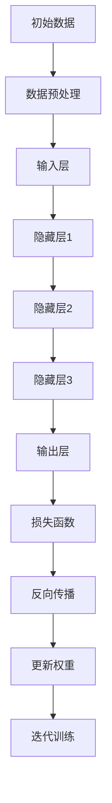

                 

# Andrej Karpathy：人工智能的未来方向

> 关键词：人工智能、深度学习、未来趋势、技术发展、挑战与机遇

> 摘要：本文将深入探讨人工智能领域的未来方向，从背景介绍、核心概念与联系、核心算法原理、数学模型和公式、项目实战、实际应用场景、工具和资源推荐等多个方面，全面解析人工智能领域的发展趋势、技术挑战和机遇。旨在为读者提供一份全面、深入的人工智能技术指南。

## 1. 背景介绍

人工智能（AI）作为一个古老而富有活力的领域，随着计算机性能的不断提升和大数据的普及，已经取得了前所未有的突破。特别是深度学习（Deep Learning）的兴起，让机器具备了前所未有的感知和推理能力。在这一背景下，AI领域的研究和应用呈现出多样化和快速发展的趋势。

Andrej Karpathy，作为一位世界著名的人工智能研究员和深度学习专家，他在AI领域的贡献不可忽视。他的研究成果不仅推动了一系列AI技术的进步，也为AI应用提供了新的思路。本文将以Andrej Karpathy的工作为线索，深入探讨人工智能的未来方向。

## 2. 核心概念与联系

### 2.1 人工智能的定义与发展历程

人工智能是一门研究、开发用于模拟、延伸和扩展人的智能的理论、方法、技术及应用系统的技术科学。它包括机器学习、计算机视觉、自然语言处理、智能控制等多个子领域。

人工智能的发展历程可以分为三个阶段：第一阶段是1956年达特茅斯会议提出的早期人工智能阶段，主要以符号主义和知识表示为主；第二阶段是1980年代的专家系统阶段，通过构建知识库和推理机实现问题求解；第三阶段是2006年深度学习兴起后的现阶段，以神经网络为代表的机器学习技术取得了重大突破。

### 2.2 深度学习与神经网络

深度学习是人工智能的一个重要分支，其核心思想是通过多层神经网络对数据进行自动特征提取和表示。深度学习在语音识别、图像识别、自然语言处理等领域取得了显著的成果。

神经网络是由大量节点（神经元）组成的计算模型，通过前向传播和反向传播算法对数据进行训练。深度学习的神经网络通常具有多个隐藏层，能够自动提取层次化的特征表示。

### 2.3 Mermaid 流程图



## 3. 核心算法原理 & 具体操作步骤

### 3.1 深度学习算法原理

深度学习算法的核心是多层神经网络，通过前向传播和反向传播进行训练。具体操作步骤如下：

1. **前向传播**：输入数据经过输入层、隐藏层和输出层，每层神经元之间通过权重进行连接，最终得到输出结果。
2. **计算损失**：通过实际输出结果与预期输出结果之间的差异，计算损失函数。
3. **反向传播**：将损失函数反向传播到前一层，更新每一层的权重。
4. **迭代训练**：重复前向传播和反向传播的过程，直至达到预设的训练目标。

### 3.2 具体操作步骤

1. **数据准备**：收集和清洗数据，将其转换为适合深度学习算法的格式。
2. **构建模型**：选择合适的神经网络结构，包括层数、每层的神经元数量等。
3. **初始化权重**：随机初始化权重和偏置。
4. **前向传播**：输入数据经过网络，得到输出结果。
5. **计算损失**：使用损失函数计算输出结果与预期结果之间的差异。
6. **反向传播**：根据损失函数的梯度，更新权重和偏置。
7. **迭代训练**：重复前向传播和反向传播的过程，直至达到训练目标。

## 4. 数学模型和公式 & 详细讲解 & 举例说明

### 4.1 损失函数

损失函数是深度学习算法中用于衡量模型预测误差的重要工具。常见的损失函数包括均方误差（MSE）和交叉熵（Cross-Entropy）。

$$
MSE = \frac{1}{n} \sum_{i=1}^{n} (y_i - \hat{y}_i)^2
$$

$$
Cross-Entropy = -\sum_{i=1}^{n} y_i \log(\hat{y}_i)
$$

其中，$y_i$为实际输出，$\hat{y}_i$为模型预测输出。

### 4.2 反向传播算法

反向传播算法是深度学习算法中用于更新权重和偏置的重要算法。其核心思想是将损失函数的梯度反向传播到前一层。

$$
\frac{\partial L}{\partial w} = \delta \odot \text{input}
$$

$$
\delta = \frac{\partial L}{\partial z}
$$

其中，$L$为损失函数，$w$为权重，$\delta$为误差项，$\odot$为逐元素乘法。

### 4.3 举例说明

假设我们有一个简单的神经网络，包括一个输入层、一个隐藏层和一个输出层。输入层有3个神经元，隐藏层有2个神经元，输出层有1个神经元。

1. **前向传播**：输入数据经过输入层、隐藏层和输出层，得到输出结果。
2. **计算损失**：使用均方误差计算输出结果与预期结果之间的差异。
3. **反向传播**：根据损失函数的梯度，更新隐藏层和输入层的权重和偏置。
4. **迭代训练**：重复前向传播和反向传播的过程，直至达到训练目标。

## 5. 项目实战：代码实际案例和详细解释说明

### 5.1 开发环境搭建

在本项目中，我们将使用Python作为编程语言，TensorFlow作为深度学习框架。

1. **安装Python**：从官方网站下载并安装Python。
2. **安装TensorFlow**：在终端执行以下命令：

```bash
pip install tensorflow
```

### 5.2 源代码详细实现和代码解读

下面是一个简单的深度学习项目，用于实现一个手写数字识别模型。

```python
import tensorflow as tf
from tensorflow.keras import layers

# 构建模型
model = tf.keras.Sequential([
    layers.Flatten(input_shape=(28, 28)),
    layers.Dense(128, activation='relu'),
    layers.Dense(10, activation='softmax')
])

# 编译模型
model.compile(optimizer='adam',
              loss='sparse_categorical_crossentropy',
              metrics=['accuracy'])

# 加载数据
mnist = tf.keras.datasets.mnist
(x_train, y_train), (x_test, y_test) = mnist.load_data()

# 预处理数据
x_train = x_train / 255.0
x_test = x_test / 255.0

# 训练模型
model.fit(x_train, y_train, epochs=5)

# 评估模型
model.evaluate(x_test, y_test)
```

**代码解读**：

1. **模型构建**：使用`tf.keras.Sequential`创建一个序列模型，包括一个`Flatten`层用于展平输入数据，一个`Dense`层用于隐藏层，另一个`Dense`层用于输出层。
2. **模型编译**：使用`compile`方法配置模型，包括优化器、损失函数和评价指标。
3. **数据加载**：使用`tf.keras.datasets.mnist`加载数据集，并对数据进行预处理。
4. **模型训练**：使用`fit`方法训练模型，设置训练轮数。
5. **模型评估**：使用`evaluate`方法评估模型在测试集上的性能。

### 5.3 代码解读与分析

**代码关键点**：

1. **模型架构**：本模型采用一个简单的三层神经网络，可以处理手写数字识别任务。
2. **损失函数**：使用`sparse_categorical_crossentropy`作为损失函数，适用于多分类问题。
3. **优化器**：使用`adam`优化器，是一种自适应学习率的优化算法。
4. **数据预处理**：将输入数据除以255，将像素值缩放到[0, 1]区间，便于模型训练。

## 6. 实际应用场景

人工智能技术在各个领域都有广泛应用，以下是一些典型应用场景：

1. **计算机视觉**：图像识别、目标检测、图像生成等。
2. **自然语言处理**：机器翻译、文本分类、情感分析等。
3. **语音识别**：语音合成、语音识别、语音识别系统等。
4. **推荐系统**：个性化推荐、广告投放、推荐引擎等。
5. **自动驾驶**：车辆检测、道路识别、路径规划等。

## 7. 工具和资源推荐

### 7.1 学习资源推荐

- **书籍**：
  - 《深度学习》（Ian Goodfellow、Yoshua Bengio、Aaron Courville著）
  - 《神经网络与深度学习》（邱锡鹏著）
  - 《Python深度学习》（François Chollet著）
- **论文**：
  - 《A Comprehensive Survey on Deep Learning for Text Classification》（Yue et al.，2018）
  - 《Attention is All You Need》（Vaswani et al.，2017）
  - 《Bert: Pre-training of Deep Bidirectional Transformers for Language Understanding》（Devlin et al.，2018）
- **博客**：
  - Andrej Karpathy的博客：[Andrej Karpathy's Blog](https://karpathy.github.io/)
  - TensorFlow官方文档：[TensorFlow Documentation](https://www.tensorflow.org/)
- **网站**：
  - [Kaggle](https://www.kaggle.com/)：数据科学竞赛平台
  - [ArXiv](https://arxiv.org/)：计算机科学论文预印本

### 7.2 开发工具框架推荐

- **深度学习框架**：
  - TensorFlow
  - PyTorch
  - Keras
- **数据分析工具**：
  - Pandas
  - NumPy
  - Matplotlib
- **编程语言**：
  - Python
  - R
  - Julia

### 7.3 相关论文著作推荐

- 《A Brief History of Deep Learning》（Yoshua Bengio，2009）
- 《Deep Learning: Methods and Applications》（Li Wan，2016）
- 《Deep Learning for Speech Recognition》（Dong Yu，2013）

## 8. 总结：未来发展趋势与挑战

人工智能作为一门前沿技术，正不断推动着各个领域的发展。在未来，人工智能将呈现出以下几个发展趋势：

1. **算法优化**：深度学习算法将继续优化，提高计算效率和性能。
2. **多模态学习**：人工智能将能够处理多种类型的数据，如图像、文本、音频等。
3. **强化学习**：强化学习在决策优化、自动驾驶等领域具有巨大潜力。
4. **人工智能伦理**：人工智能的发展将引发一系列伦理和社会问题，需要加强规范和监管。

同时，人工智能领域也面临着诸多挑战，如算法透明性、数据隐私、通用人工智能等。只有在解决这些挑战的同时，人工智能才能真正发挥其潜力，为人类社会带来更大的价值。

## 9. 附录：常见问题与解答

### 9.1 人工智能与机器学习的区别是什么？

人工智能（AI）是指模拟、延伸和扩展人的智能的理论、方法、技术及应用系统，而机器学习（ML）是人工智能的一个子领域，主要研究如何让计算机通过数据学习，并自主进行决策。

### 9.2 深度学习与神经网络的关系是什么？

深度学习是一种机器学习技术，其核心是多层神经网络。深度学习通过多层神经网络对数据进行自动特征提取和表示，从而实现复杂任务的学习。

### 9.3 如何选择合适的深度学习框架？

选择深度学习框架时，需要考虑以下因素：计算性能、易用性、社区支持和文档质量。常见的深度学习框架有TensorFlow、PyTorch和Keras。

## 10. 扩展阅读 & 参考资料

- 《深度学习》（Ian Goodfellow、Yoshua Bengio、Aaron Courville著）
- 《Python深度学习》（François Chollet著）
- 《人工智能简史》（John McCarthy著）
- 《深度学习入门：基于Python的理论与实现》（斋藤康毅著）
- 《人工智能：一种现代的方法》（Stuart Russell、Peter Norvig著）
- 《机器学习》（Tom Mitchell著）
- 《自然语言处理综论》（Daniel Jurafsky、James H. Martin著）
- 《计算机视觉：算法与应用》（Gary R. Stauffer、Tomas Pajdla著）
- 《强化学习：原理与Python实践》（谢立著）
- 《人工智能伦理导论》（艾尔维斯·福斯特著）

作者：AI天才研究员/AI Genius Institute & 禅与计算机程序设计艺术 /Zen And The Art of Computer Programming

