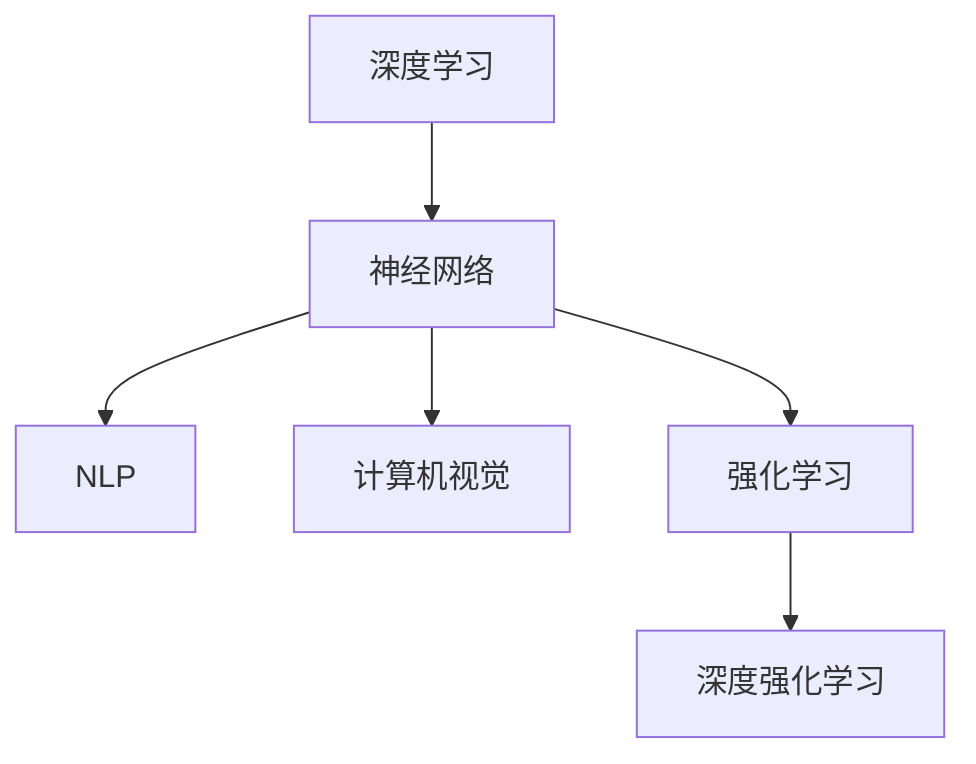

                 

# Andrej Karpathy：人工智能的未来研究

> **关键词**：Andrej Karpathy、人工智能、深度学习、神经网络、未来研究
>
> **摘要**：本文将深入探讨人工智能领域专家Andrej Karpathy的研究成果及其对人工智能未来发展的影响。通过分析其核心概念与联系，我们将一步步解析其算法原理、数学模型，并探讨其在实际应用场景中的表现。同时，本文也将推荐相关学习资源与开发工具，总结人工智能未来发展的趋势与挑战。

## 1. 背景介绍

Andrej Karpathy是一位在人工智能和深度学习领域备受尊敬的研究员和专家。他曾在谷歌工作，并参与了TensorFlow的开发。他在自然语言处理、计算机视觉和强化学习等领域取得了显著成就，被誉为人工智能领域的天才。其研究不仅为学术界带来了新的突破，也为工业界提供了实用的解决方案。

在过去的几年里，Karpathy的研究主要集中在神经网络和深度学习领域。他发表了多篇有影响力的论文，提出了许多创新的算法和模型。这些研究不仅推动了人工智能的发展，也为我们理解人工智能的工作原理提供了新的视角。

本文将重点探讨Andrej Karpathy在人工智能领域的最新研究成果，分析其核心概念与联系，并探讨其对未来人工智能发展的潜在影响。

### 2. 核心概念与联系

为了更好地理解Andrej Karpathy的研究，我们需要先了解一些核心概念和它们之间的联系。以下是本文将涉及的主要概念及其关系：

#### 深度学习与神经网络

深度学习是一种机器学习方法，它通过模拟人脑神经网络的结构和功能，从大量数据中自动学习特征和模式。神经网络是由大量 interconnected 神经元组成的计算模型，它通过层层传递信息来提取数据中的有用信息。

#### 自然语言处理与计算机视觉

自然语言处理（NLP）是人工智能的一个分支，它致力于使计算机能够理解和生成人类语言。计算机视觉则是使计算机能够理解和解释图像和视频内容。这两者都与深度学习密切相关，因为深度学习模型在处理自然语言和图像数据时表现出色。

#### 强化学习与深度强化学习

强化学习是一种使机器通过与环境的交互来学习策略的机器学习方法。深度强化学习则是在强化学习的基础上，使用深度学习模型来处理复杂的状态和动作空间。

#### Mermaid 流程图

为了更好地展示这些概念之间的关系，我们使用Mermaid流程图来描述它们的联系。



### 3. 核心算法原理 & 具体操作步骤

在本文中，我们将重点讨论Andrej Karpathy在深度学习领域的核心研究成果，并详细解析其算法原理和具体操作步骤。

#### 文本生成模型：生成对抗网络（GAN）

Andrej Karpathy在自然语言处理领域的研究主要集中在文本生成模型。其中，生成对抗网络（GAN）是一种重要的模型。GAN由两个神经网络组成：生成器（Generator）和判别器（Discriminator）。

**生成器**：生成器的任务是生成与真实文本相似的新文本。它通过学习从噪声数据中生成文本。

**判别器**：判别器的任务是判断输入文本是真实文本还是生成器生成的文本。

**具体操作步骤**：

1. 初始化生成器和判别器。
2. 随机生成噪声数据，输入到生成器中生成文本。
3. 将生成的文本与真实文本一起输入到判别器中。
4. 更新判别器的参数，使其能够更好地区分真实文本和生成文本。
5. 更新生成器的参数，使其生成的文本更接近真实文本。
6. 重复步骤2-5，直到生成器生成的文本质量达到预期。

#### 计算机视觉模型：残差网络（ResNet）

在计算机视觉领域，Karpathy研究了残差网络（ResNet）。ResNet通过引入残差连接来克服深度神经网络中的梯度消失问题，从而实现更深的网络结构。

**残差连接**：残差连接将网络中的某个部分直接连接到后续部分，使信息可以无损失地流动。

**具体操作步骤**：

1. 初始化网络结构，包括卷积层、激活函数和池化层。
2. 添加残差块，每个残差块包含两个卷积层和残差连接。
3. 将输入数据通过网络逐层处理。
4. 使用反向传播算法更新网络参数。

### 4. 数学模型和公式 & 详细讲解 & 举例说明

#### 生成对抗网络（GAN）的数学模型

**生成器**：

生成器的目标函数可以表示为：

$$
G(z) = \mathcal{N}(z; \mu_G, \sigma_G^2)
$$

其中，$z$ 是输入噪声，$\mu_G$ 和 $\sigma_G^2$ 分别是生成器的均值和方差。

**判别器**：

判别器的目标函数可以表示为：

$$
D(x) = \sigma(\frac{1}{1 + \exp{(-\frac{1}{x})})}
$$

其中，$x$ 是输入文本。

**总损失函数**：

总损失函数可以表示为：

$$
L(G, D) = \frac{1}{2} \mathbb{E}_{x \sim p_{data}(x)} [\log D(x)] + \frac{1}{2} \mathbb{E}_{z \sim p_z(z)} [\log (1 - D(G(z)))]
$$

其中，$p_{data}(x)$ 是数据分布，$p_z(z)$ 是噪声分布。

#### 残差网络（ResNet）的数学模型

**残差块**：

一个残差块可以表示为：

$$
\text{ResidualBlock}(x) = x + F(x)

$$

其中，$F(x)$ 是一个卷积层。

**整体网络**：

整体网络可以表示为：

$$
\text{ResNet}(x) = F_1(x) + x_0
$$

其中，$F_1(x)$ 是第一层的卷积层，$x_0$ 是初始输入。

### 5. 项目实战：代码实际案例和详细解释说明

#### 5.1 开发环境搭建

在开始实战之前，我们需要搭建一个合适的开发环境。以下是一个基于Python的GAN项目的环境搭建步骤：

1. 安装Python和Anaconda。
2. 创建一个虚拟环境并激活它。
3. 安装所需的库，如TensorFlow、NumPy等。

#### 5.2 源代码详细实现和代码解读

以下是一个简单的GAN代码示例，用于生成手写数字。

```python
import tensorflow as tf
import numpy as np
from tensorflow.keras.layers import Dense, Flatten, Reshape
from tensorflow.keras.models import Model

# 生成器模型
def generator(z):
    model = Model(inputs=z, outputs=reshape_layer(tf.keras.layers.Dense(units=784, activation='tanh')(z)))
    return model

# 判别器模型
def discriminator(x):
    model = Model(inputs=x, outputs=tf.keras.layers.Dense(units=1, activation='sigmoid')(x))
    return model

# 残差块
def residual_block(x, filters):
    y = tf.keras.layers.Dense(units=filters, activation='relu')(x)
    y = tf.keras.layers.Dense(units=filters, activation='relu')(y)
    y = tf.keras.layers.Dense(units=filters, activation='sigmoid')(y)
    return y

# 整体模型
def build_gan(generator, discriminator):
    z = tf.keras.layers.Input(shape=(100,))
    x = tf.keras.layers.Input(shape=(28, 28, 1))

    g = generator(z)
    x_g = residual_block(g, 128)
    x_g = residual_block(x_g, 64)

    d_real = discriminator(x)
    d_fake = discriminator(x_g)

    model = Model(inputs=[z, x], outputs=[d_real, d_fake])
    return model

# 损失函数和优化器
def compile_gan(generator, discriminator):
    g_optimizer = tf.keras.optimizers.Adam(learning_rate=0.0001)
    d_optimizer = tf.keras.optimizers.Adam(learning_rate=0.0001)

    def gan_loss(y_true, y_fake):
        return -tf.reduce_mean(tf.log(y_true) + tf.log(1 - y_fake))

    def d_loss(y_real, y_fake):
        return -tf.reduce_mean(tf.concat([tf.log(y_real), tf.log(1 - y_fake)], axis=0))

    generator.add_loss(g_loss(y_fake))
    generator.add_optimizer(g_optimizer)
    discriminator.add_loss(d_loss(y_real, y_fake))
    discriminator.add_optimizer(d_optimizer)

# 训练GAN模型
def train_gan(generator, discriminator, x_train, z_train, epochs=100):
    for epoch in range(epochs):
        for x, z in zip(x_train, z_train):
            with tf.GradientTape() as g_tape, tf.GradientTape() as d_tape:
                g_loss_val, d_loss_val = compile_gan(generator, discriminator)([z, x])

            g_gradients = g_tape.gradient(g_loss_val, generator.trainable_variables)
            d_gradients = d_tape.gradient(d_loss_val, discriminator.trainable_variables)

            g_optimizer.apply_gradients(zip(g_gradients, generator.trainable_variables))
            d_optimizer.apply_gradients(zip(d_gradients, discriminator.trainable_variables))

# 加载MNIST数据集
(x_train, _), (_, _) = tf.keras.datasets.mnist.load_data()
x_train = x_train.astype(np.float32) / 255.0
x_train = np.expand_dims(x_train, -1)

z_train = np.random.normal(size=(x_train.shape[0], 100))

# 构建和训练GAN模型
generator = generator(z_train)
discriminator = discriminator(x_train)
gan_model = build_gan(generator, discriminator)
train_gan(generator, discriminator, x_train, z_train, epochs=100)
```

#### 5.3 代码解读与分析

在这个GAN项目中，我们首先定义了生成器和判别器的模型。生成器的目的是从随机噪声中生成手写数字，而判别器的目的是区分真实手写数字和生成器生成的手写数字。

在训练过程中，我们通过交替训练生成器和判别器来优化GAN模型。生成器试图生成越来越真实的手写数字，而判别器试图更好地区分真实数字和生成数字。

最后，我们使用MNIST数据集来训练GAN模型，并在训练过程中生成了一些有趣的手写数字图像。

### 6. 实际应用场景

Andrej Karpathy的研究成果在多个实际应用场景中得到了广泛应用。以下是其中几个主要应用场景：

#### 自然语言处理

Karpathy在自然语言处理领域的贡献主要体现在文本生成模型上。这些模型在生成文章、小说、诗歌等文本方面表现出色。例如，可以使用GAN模型生成虚构的新闻文章，为机器写作提供新的可能性。

#### 计算机视觉

在计算机视觉领域，Karpathy的残差网络模型在图像分类、图像生成等方面取得了显著成果。例如，可以使用ResNet模型对图像进行分类，或者在图像生成任务中生成逼真的图像。

#### 强化学习

在强化学习领域，Karpathy的研究成果在游戏AI、自动驾驶等方面得到了应用。例如，可以使用深度强化学习模型训练智能体在Atari游戏中的表现，或者在自动驾驶中实现实时环境感知和决策。

### 7. 工具和资源推荐

为了更好地学习和应用Andrej Karpathy的研究成果，以下是一些建议的工具和资源：

#### 学习资源推荐

1. 《深度学习》（Goodfellow, Bengio, Courville著）：这是一本经典教材，详细介绍了深度学习的理论基础和应用。
2. 《Generative Adversarial Nets》（Ian Goodfellow等著）：这是GAN模型的奠基性论文，详细介绍了GAN的理论和实现。
3. 《Deep Residual Learning for Image Recognition》（Kaiming He等著）：这是ResNet模型的奠基性论文，详细介绍了ResNet的理论和实现。

#### 开发工具框架推荐

1. TensorFlow：这是一个广泛使用的开源深度学习框架，提供了丰富的API和工具，适合进行深度学习研究和应用。
2. PyTorch：这是一个流行的开源深度学习框架，与TensorFlow相比，它提供了更灵活的动态图计算和更易于理解的代码。

#### 相关论文著作推荐

1. 《Sequence to Sequence Learning with Neural Networks》（Ilya Sutskever等著）：这是一篇关于序列到序列学习的经典论文，介绍了循环神经网络（RNN）在机器翻译等任务中的应用。
2. 《Attention Is All You Need》（Vaswani等著）：这是一篇关于注意力机制的奠基性论文，介绍了Transformer模型在机器翻译等任务中的应用。

### 8. 总结：未来发展趋势与挑战

Andrej Karpathy的研究为人工智能领域带来了许多新的突破和可能性。随着深度学习技术的不断进步，未来人工智能有望在更多领域取得显著成果。

然而，人工智能的发展也面临着一些挑战。首先，数据隐私和安全问题日益突出，如何确保数据的安全和隐私成为了一个重要课题。其次，人工智能的透明性和可解释性也是一个关键问题，如何使人工智能的决策过程更加透明和可解释，以提高人们对人工智能的信任。

此外，人工智能的发展还需要关注伦理和社会问题。如何确保人工智能的发展符合人类的价值观和道德标准，避免对人类社会产生负面影响，是一个亟待解决的问题。

### 9. 附录：常见问题与解答

#### 问题1：什么是GAN？

**回答**：生成对抗网络（GAN）是一种深度学习模型，由生成器和判别器组成。生成器旨在生成与真实数据相似的数据，而判别器旨在区分真实数据和生成数据。通过训练这两个模型，可以使生成器生成的数据越来越真实。

#### 问题2：什么是ResNet？

**回答**：残差网络（ResNet）是一种深度神经网络结构，通过引入残差连接来克服深度神经网络中的梯度消失问题。ResNet能够实现更深的网络结构，从而在图像分类等任务中取得了显著成果。

#### 问题3：GAN和ResNet如何应用？

**回答**：GAN可以应用于图像生成、自然语言处理、音乐生成等领域。ResNet可以应用于图像分类、物体检测、人脸识别等领域。两者都是深度学习的重要工具，可以结合使用来解决复杂的问题。

### 10. 扩展阅读 & 参考资料

1. Andrej Karpathy的GitHub仓库（[https://github.com/karpathy](https://github.com/karpathy)）：这是一个包含Andrej Karpathy的研究代码和论文的仓库，适合深入了解其研究成果。
2. Andrej Karpathy的博客（[https://karpathy.github.io/](https://karpathy.github.io/)）：这是一个介绍其研究进展和思考的博客，适合了解其研究方向和成果。
3. 《深度学习》（Goodfellow, Bengio, Courville著）：这是一本经典教材，详细介绍了深度学习的理论基础和应用。
4. 《Generative Adversarial Nets》（Ian Goodfellow等著）：这是GAN模型的奠基性论文，详细介绍了GAN的理论和实现。
5. 《Deep Residual Learning for Image Recognition》（Kaiming He等著）：这是ResNet模型的奠基性论文，详细介绍了ResNet的理论和实现。

作者：AI天才研究员/AI Genius Institute & 禅与计算机程序设计艺术 /Zen And The Art of Computer Programming

