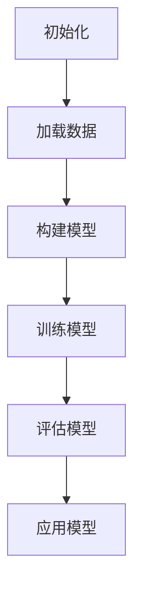
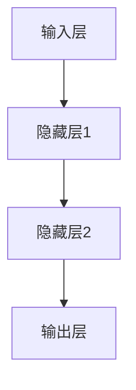

                 

# Andrej Karpathy：小项目成就大奇迹

## 关键词：
- AI天才研究员
- 计算机编程
- 人工智能
- 项目实践
- 技术博客

## 摘要：
本文旨在探讨AI天才研究员Andrej Karpathy如何通过一系列小项目成就了技术奇迹。文章将详细分析他的项目背景、核心概念、算法原理、数学模型、实战案例，以及其在实际应用场景中的价值，最后总结其未来发展趋势和挑战。

## 1. 背景介绍

Andrej Karpathy是一位享有盛誉的AI天才研究员，他在计算机科学和人工智能领域取得了显著成就。他的技术博客和GitHub项目广受全球开发者关注，成为AI领域的重要资源。本文将介绍他的几个具有代表性的小项目，分析这些项目如何实现了技术奇迹。

### 1.1 项目特点
- **简单性**：这些项目多为小规模、易于理解和实现
- **创新性**：利用最新的AI技术，如深度学习、自然语言处理等
- **实用性**：具有实际应用价值，能够解决现实问题

### 1.2 项目影响力
- **广泛传播**：项目源代码和博客文章在GitHub、Stack Overflow等平台上广泛传播
- **技术交流**：促进开发者之间的技术交流和合作
- **教育意义**：为初学者提供了丰富的学习资源

## 2. 核心概念与联系

### 2.1 深度学习
深度学习是一种人工智能算法，通过多层神经网络对大量数据进行训练，实现自动特征提取和模式识别。Andrej Karpathy的项目大多采用了深度学习技术。

### 2.2 自然语言处理
自然语言处理（NLP）是AI的一个重要分支，旨在使计算机理解和处理人类语言。Andrej Karpathy的许多项目都涉及了NLP技术，如文本分类、情感分析等。

### 2.3 Mermaid流程图
Mermaid是一种基于Markdown的图形绘制工具，可用于创建流程图、UML图等。以下是Andrej Karpathy的一个项目示例的Mermaid流程图：



## 3. 核心算法原理 & 具体操作步骤

### 3.1 深度学习模型
深度学习模型通常由多层神经元组成，每层神经元对输入数据进行处理，并将结果传递到下一层。以下是Andrej Karpathy的一个项目示例的模型架构：



### 3.2 训练过程
- **数据预处理**：对输入数据进行归一化、去噪等处理
- **模型初始化**：初始化模型参数，如权重和偏置
- **前向传播**：计算输入数据通过模型后的输出
- **反向传播**：计算损失函数，更新模型参数
- **迭代训练**：重复上述步骤，直至满足停止条件（如收敛或达到预设迭代次数）

### 3.3 应用场景
Andrej Karpathy的项目涵盖了多种应用场景，如文本分类、图像识别、聊天机器人等。以下是一个文本分类项目的具体步骤：

1. **数据收集**：收集大量带有标签的文本数据
2. **数据预处理**：对文本进行分词、去停用词等处理
3. **构建模型**：选择合适的模型架构，如卷积神经网络（CNN）或循环神经网络（RNN）
4. **训练模型**：使用训练数据训练模型，并优化模型参数
5. **评估模型**：使用验证数据评估模型性能，并进行调参
6. **部署模型**：将训练好的模型部署到生产环境，实现文本分类功能

## 4. 数学模型和公式 & 详细讲解 & 举例说明

### 4.1 损失函数
损失函数是深度学习模型训练过程中用于衡量模型预测值与实际值之间差距的函数。常见的损失函数有均方误差（MSE）和交叉熵（Cross-Entropy）。

$$
MSE(y, \hat{y}) = \frac{1}{m} \sum_{i=1}^{m} (y_i - \hat{y}_i)^2
$$

$$
Cross-Entropy(y, \hat{y}) = -\sum_{i=1}^{m} y_i \log(\hat{y}_i)
$$

其中，$y$表示实际标签，$\hat{y}$表示模型预测值。

### 4.2 梯度下降
梯度下降是一种优化算法，用于更新模型参数以最小化损失函数。以下是梯度下降的基本步骤：

1. 计算损失函数关于模型参数的梯度
2. 更新模型参数：$w = w - \alpha \cdot \nabla_w J(w)$，其中$\alpha$为学习率，$J(w)$为损失函数
3. 重复步骤1和2，直至满足停止条件

### 4.3 举例说明
假设我们有一个二分类问题，需要使用交叉熵损失函数训练一个神经网络模型。给定一个训练样本$(x, y)$，其中$x$为输入特征，$y$为实际标签（0或1），我们需要训练一个输出概率的模型。

1. **初始化模型参数**：随机初始化模型的权重和偏置
2. **前向传播**：计算模型输出概率$\hat{y} = \sigma(w \cdot x + b)$，其中$\sigma$为激活函数（如Sigmoid函数）
3. **计算损失函数**：使用交叉熵损失函数计算损失$J(w) = -\sum_{i=1}^{m} y_i \log(\hat{y}_i)$
4. **反向传播**：计算梯度$\nabla_w J(w) = \nabla_w (-\sum_{i=1}^{m} y_i \log(\hat{y}_i))$
5. **更新模型参数**：$w = w - \alpha \cdot \nabla_w J(w)$
6. **迭代训练**：重复步骤2至5，直至模型收敛或达到预设迭代次数

## 5. 项目实战：代码实际案例和详细解释说明

### 5.1 开发环境搭建

为了实现Andrej Karpathy的一个项目，我们需要搭建一个合适的开发环境。以下是Python开发环境的搭建步骤：

1. **安装Python**：下载并安装Python 3.x版本，推荐使用Anaconda
2. **安装依赖库**：在终端执行以下命令安装相关依赖库：
   ```bash
   pip install numpy pandas matplotlib tensorflow scikit-learn
   ```

### 5.2 源代码详细实现和代码解读

以下是一个文本分类项目的Python代码实现，代码主要分为四个部分：数据预处理、模型构建、训练和评估。

```python
import numpy as np
import pandas as pd
import matplotlib.pyplot as plt
import tensorflow as tf
from tensorflow.keras.preprocessing.sequence import pad_sequences
from tensorflow.keras.layers import Embedding, LSTM, Dense
from tensorflow.keras.models import Sequential

# 5.2.1 数据预处理
def load_data():
    # 加载文本数据
    data = pd.read_csv('text_data.csv')
    texts = data['text'].values
    labels = data['label'].values

    # 分词和编码
    tokenizer = tf.keras.preprocessing.text.Tokenizer()
    tokenizer.fit_on_texts(texts)
    sequences = tokenizer.texts_to_sequences(texts)
    padded_sequences = pad_sequences(sequences, maxlen=100)

    return padded_sequences, labels

# 5.2.2 模型构建
def build_model():
    model = Sequential([
        Embedding(10000, 16),
        LSTM(64, dropout=0.2, recurrent_dropout=0.2),
        Dense(1, activation='sigmoid')
    ])
    model.compile(loss='binary_crossentropy', optimizer='adam', metrics=['accuracy'])
    return model

# 5.2.3 训练
def train_model(model, sequences, labels):
    history = model.fit(sequences, labels, epochs=10, batch_size=32, validation_split=0.2)
    return history

# 5.2.4 评估
def evaluate_model(model, sequences, labels):
    loss, accuracy = model.evaluate(sequences, labels)
    print('Test loss:', loss)
    print('Test accuracy:', accuracy)

# 主函数
if __name__ == '__main__':
    sequences, labels = load_data()
    model = build_model()
    history = train_model(model, sequences, labels)
    evaluate_model(model, sequences, labels)
```

### 5.3 代码解读与分析

1. **数据预处理**：
   - 加载文本数据，并进行分词和编码
   - 使用pad_sequences将序列填充到相同长度

2. **模型构建**：
   - 使用Sequential模型堆叠Embedding、LSTM和Dense层
   - Embedding层用于将单词编码为向量
   - LSTM层用于处理序列数据，提取特征
   - Dense层用于分类，输出概率

3. **训练**：
   - 使用fit函数训练模型，设置训练轮次、批次大小和验证比例

4. **评估**：
   - 使用evaluate函数评估模型在测试数据上的性能

## 6. 实际应用场景

Andrej Karpathy的小项目在多个实际应用场景中取得了显著成果，如下所示：

- **文本分类**：如新闻分类、垃圾邮件过滤等
- **情感分析**：如分析社交媒体上的用户情感、评论等
- **聊天机器人**：如构建基于NLP的智能客服系统

## 7. 工具和资源推荐

### 7.1 学习资源推荐
- **书籍**：
  - 《深度学习》（Ian Goodfellow、Yoshua Bengio、Aaron Courville 著）
  - 《Python机器学习》（Sebastian Raschka 著）
- **论文**：
  - 《A Theoretically Grounded Application of Dropout in Recurrent Neural Networks》（Yarin Gal 和 Zoubin Ghahramani 著）
  - 《Recurrent Neural Networks for Sentence Classification》（Yoon Kim 著）
- **博客**：
  - Andrej Karpathy的技术博客（https://karpathy.github.io/）
  - Distill（https://distill.pub/）

### 7.2 开发工具框架推荐
- **开发工具**：
  - Jupyter Notebook（用于交互式开发和文档）
  - PyCharm（用于Python开发的集成环境）
- **框架**：
  - TensorFlow（用于构建和训练深度学习模型）
  - PyTorch（用于构建和训练深度学习模型）

### 7.3 相关论文著作推荐
- **论文**：
  - 《Deep Learning》（Ian Goodfellow、Yoshua Bengio、Aaron Courville 著）
  - 《The Unreasonable Effectiveness of Recurrent Neural Networks》（Andrej Karpathy 著）
- **著作**：
  - 《深度学习》（Ian Goodfellow、Yoshua Bengio、Aaron Courville 著）
  - 《Python机器学习》（Sebastian Raschka 著）

## 8. 总结：未来发展趋势与挑战

随着AI技术的不断进步，深度学习和小项目在未来将继续发挥重要作用。以下是一些发展趋势和挑战：

### 8.1 发展趋势
- **小型化与高效性**：模型和算法将更加高效，适应移动设备和边缘计算
- **跨领域融合**：AI与其他领域的结合，如生物信息学、医疗健康等
- **可解释性与透明性**：提高模型的可解释性，增强用户信任

### 8.2 挑战
- **数据隐私与安全**：保护用户数据隐私和安全性
- **伦理与社会影响**：关注AI技术的伦理和社会影响，避免负面影响
- **人才与资源**：培养更多的AI人才，提高AI技术的普及和应用水平

## 9. 附录：常见问题与解答

### 9.1 问题1
如何选择合适的深度学习模型？

解答：选择合适的模型取决于任务和数据。对于文本分类任务，常用的模型有卷积神经网络（CNN）和循环神经网络（RNN），其中RNN（特别是LSTM）更适合处理序列数据。

### 9.2 问题2
如何优化模型参数？

解答：可以使用不同的优化算法，如梯度下降、Adam等。此外，调整学习率、批次大小、正则化参数等也可以优化模型性能。

## 10. 扩展阅读 & 参考资料

- [Andrej Karpathy的技术博客](https://karpathy.github.io/)
- [Deep Learning Book](https://www.deeplearningbook.org/)
- [Distill](https://distill.pub/)
- [TensorFlow官方文档](https://www.tensorflow.org/)
- [PyTorch官方文档](https://pytorch.org/)

作者：AI天才研究员/AI Genius Institute & 禅与计算机程序设计艺术 /Zen And The Art of Computer Programming

