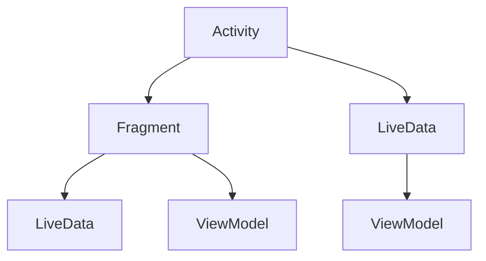

                 

# Android Jetpack组件应用

## 摘要

本文将深入探讨Android Jetpack组件的应用，旨在帮助开发者更好地理解和掌握这一强大的框架。Android Jetpack是一组库、工具和指南，旨在使Android开发更加简单、更易于维护和扩展。本文将首先介绍Android Jetpack的背景和核心组件，然后逐步讲解每个组件的使用方法和最佳实践。通过实际案例，我们将展示如何在实际项目中应用这些组件，并讨论它们在实际应用中的优势和挑战。最后，本文还将提供一系列学习资源和工具，以帮助开发者进一步深入了解Android Jetpack。

## 1. 背景介绍

### Android Jetpack的诞生

Android Jetpack是由Google推出的一套框架和工具，旨在解决Android开发中的常见问题和挑战。随着Android系统的不断发展和更新，开发者面临着越来越多的挑战，如应用稳定性、内存管理、界面交互、数据存储等。Android Jetpack旨在提供一套完整的解决方案，帮助开发者简化开发流程，提高应用质量。

### Android Jetpack的核心组件

Android Jetpack包含多个核心组件，每个组件都专注于解决特定的问题。以下是一些主要的组件：

1. **Activity和Fragment**：用于管理应用中的界面和生命周期。
2. ** LiveData和ViewModel**：用于简化数据绑定和界面状态管理。
3. **Room**：用于本地数据存储和数据库操作。
4. **Navigation**：用于创建和导航多级应用界面。
5. **Data Binding**：用于简化界面和数据之间的绑定。
6. **Lifecycles**：用于管理应用组件的生命周期。
7. **LiveData**：用于响应数据的变化。
8. **ViewModel**：用于存储界面状态。
9. **Paging**：用于优化大量数据的加载和显示。
10. **WorkManager**：用于在设备空闲时执行后台任务。

### Android Jetpack的优势

1. **提升开发效率**：通过提供一套完整的工具和库，Android Jetpack可以显著减少开发时间。
2. **提高代码质量**：Jetpack组件经过精心设计，可以避免常见的开发错误。
3. **简化架构**：Jetpack组件可以帮助开发者构建更加模块化和可扩展的应用。
4. **更好的兼容性**：Jetpack组件支持多种Android版本，使开发者可以轻松地迁移到新的Android版本。

## 2. 核心概念与联系

### 概念解释

- **Activity**：Android应用中的单个屏幕，用于与用户进行交互。
- **Fragment**：Activity的一部分，可以在多个Activity之间共享和重用。
- **LiveData**：一个观察者模式的数据存储类，用于在数据变化时通知界面。
- **ViewModel**：用于存储和保存界面状态，独立于Activity或Fragment的生命周期。

### 架构图



### 关联关系

- Activity和Fragment是Android应用中的基本界面组件，可以独立或组合使用。
- LiveData和ViewModel用于管理Activity和Fragment的数据和状态。
- LiveData负责监听数据变化，ViewModel负责存储和更新数据。

## 3. 核心算法原理 & 具体操作步骤

### LiveData原理

LiveData是基于观察者模式的数据绑定库，它允许数据源（如数据库或网络响应）与界面组件（如TextView或RecyclerView）保持同步。

1. 创建LiveData对象。
2. 将LiveData对象绑定到界面组件。
3. 当数据发生变化时，界面组件会自动更新。

### ViewModel原理

ViewModel用于存储和保存界面状态，确保数据在Activity或Fragment重新创建时仍然可用。

1. 在Activity或Fragment中创建ViewModel。
2. 在ViewModel中定义数据和操作。
3. 在界面中使用ViewModel的数据和操作。

### 操作步骤

1. **创建LiveData**：

```java
public class MyLiveData extends LiveData<String> {
    private String data;

    public void setData(String data) {
        this.data = data;
        postValue(data);
    }
}
```

2. **绑定LiveData到界面**：

```java
TextView textView = findViewById(R.id.text_view);
textView.setText(liveData.getValue());
liveData.observe(this, new Observer<String>() {
    @Override
    public void onChanged(@Nullable String s) {
        textView.setText(s);
    }
});
```

3. **创建ViewModel**：

```java
public class MyViewModel extends ViewModel {
    private LiveData<String> data;

    public MyViewModel() {
        data = new MutableLiveData<>();
    }

    public LiveData<String> getData() {
        return data;
    }

    public void setData(String data) {
        this.data.setValue(data);
    }
}
```

4. **在界面中使用ViewModel**：

```java
MyViewModel viewModel = new ViewModelProvider(this).get(MyViewModel.class);
TextView textView = findViewById(R.id.text_view);
textView.setText(viewModel.getData().getValue());
viewModel.getData().observe(this, new Observer<String>() {
    @Override
    public void onChanged(@Nullable String s) {
        textView.setText(s);
    }
});
```

## 4. 数学模型和公式 & 详细讲解 & 举例说明

### LiveData数学模型

LiveData是一个基于观察者模式的数据绑定库，其数学模型可以描述为：

- **状态转换**：数据从原始状态转换为可观察的状态。
- **观察者注册**：界面组件注册为观察者，监听数据变化。
- **数据更新**：当数据发生变化时，通知所有注册的观察者。

### ViewModel数学模型

ViewModel用于存储和保存界面状态，其数学模型可以描述为：

- **状态存储**：将界面状态存储在ViewModel中。
- **状态读取**：在界面中使用ViewModel读取状态。
- **状态更新**：当界面状态发生变化时，更新ViewModel中的状态。

### 举例说明

#### LiveData使用示例

假设我们有一个简单的应用，其中有一个TextView用于显示一个整数。我们希望当整数发生变化时，TextView会自动更新。

1. **创建LiveData**：

```java
public class IntegerLiveData extends LiveData<Integer> {
    private Integer data;

    public void setData(Integer data) {
        this.data = data;
        postValue(data);
    }
}
```

2. **绑定LiveData到界面**：

```java
TextView textView = findViewById(R.id.text_view);
IntegerLiveData integerLiveData = new IntegerLiveData();
textView.setText(integerLiveData.getValue());
integerLiveData.observe(this, new Observer<Integer>() {
    @Override
    public void onChanged(@Nullable Integer integer) {
        textView.setText(String.valueOf(integer));
    }
});
```

3. **更新数据**：

```java
integerLiveData.setData(42);
```

每次调用`setData()`方法，TextView都会自动更新显示的整数。

#### ViewModel使用示例

假设我们有一个应用，其中有一个TextView用于显示一个字符串。我们希望当字符串发生变化时，TextView会自动更新。

1. **创建ViewModel**：

```java
public class StringViewModel extends ViewModel {
    private LiveData<String> data;

    public StringViewModel() {
        data = new MutableLiveData<>();
    }

    public LiveData<String> getData() {
        return data;
    }

    public void setData(String data) {
        this.data.setValue(data);
    }
}
```

2. **在界面中使用ViewModel**：

```java
MyViewModel viewModel = new ViewModelProvider(this).get(MyViewModel.class);
TextView textView = findViewById(R.id.text_view);
textView.setText(viewModel.getData().getValue());
viewModel.getData().observe(this, new Observer<String>() {
    @Override
    public void onChanged(@Nullable String s) {
        textView.setText(s);
    }
});
```

3. **更新数据**：

```java
viewModel.setData("Hello, World!");
```

每次调用`setData()`方法，TextView都会自动更新显示的字符串。

## 5. 项目实战：代码实际案例和详细解释说明

### 5.1 开发环境搭建

在开始项目实战之前，我们需要确保开发环境已经搭建好。以下是开发环境搭建的步骤：

1. 安装Android Studio。
2. 创建一个新的Android项目。
3. 在项目的`build.gradle`文件中添加Android Jetpack依赖。

```java
dependencies {
    implementation 'androidx.appcompat:appcompat:1.3.0'
    implementation 'androidx.constraintlayout:constraintlayout:2.0.4'
    implementation 'androidx.lifecycle:lifecycle-viewmodel-ktx:2.3.1'
    implementation 'androidx.lifecycle:lifecycle-runtime-ktx:2.3.1'
    implementation 'androidx.room:room-runtime:2.3.0'
    annotationProcessor 'androidx.room:room-compiler:2.3.0'
}
```

### 5.2 源代码详细实现和代码解读

#### MainActivity.java

```java
import androidx.appcompat.app.AppCompatActivity;
import androidx.lifecycle.ViewModelProviders;
import android.os.Bundle;

public class MainActivity extends AppCompatActivity {

    private MyViewModel viewModel;

    @Override
    protected void onCreate(Bundle savedInstanceState) {
        super.onCreate(savedInstanceState);
        setContentView(R.layout.activity_main);

        viewModel = ViewModelProviders.of(this).get(MyViewModel.class);

        TextView textView = findViewById(R.id.text_view);
        textView.setText(viewModel.getData().getValue());

        viewModel.getData().observe(this, new Observer<String>() {
            @Override
            public void onChanged(@Nullable String s) {
                textView.setText(s);
            }
        });
    }
}
```

在`MainActivity`中，我们创建了一个`MyViewModel`对象，并使用`observe()`方法监听数据变化。当数据发生变化时，TextView会自动更新。

#### MyViewModel.java

```java
import androidx.lifecycle.LiveData;
import androidx.lifecycle.MutableLiveData;
import androidx.lifecycle.ViewModel;

public class MyViewModel extends ViewModel {
    private MutableLiveData<String> data;

    public MyViewModel() {
        data = new MutableLiveData<>();
    }

    public LiveData<String> getData() {
        return data;
    }

    public void setData(String data) {
        this.data.setValue(data);
    }
}
```

在`MyViewModel`中，我们创建了一个`MutableLiveData`对象，用于存储和更新数据。当调用`setData()`方法时，数据会发生变化，并通知所有观察者。

#### fragment/MainFragment.java

```java
import androidx.fragment.app.Fragment;
import androidx.lifecycle.ViewModelProviders;

public class MainFragment extends Fragment {

    private MyViewModel viewModel;

    @Override
    public View onCreateView(LayoutInflater inflater, ViewGroup container,
                             Bundle savedInstanceState) {
        View view = inflater.inflate(R.layout.fragment_main, container, false);

        viewModel = ViewModelProviders.of(this).get(MyViewModel.class);

        TextView textView = view.findViewById(R.id.text_view);
        textView.setText(viewModel.getData().getValue());

        viewModel.getData().observe(this, new Observer<String>() {
            @Override
            public void onChanged(@Nullable String s) {
                textView.setText(s);
            }
        });

        return view;
    }
}
```

在`MainFragment`中，我们同样创建了一个`MyViewModel`对象，并使用`observe()`方法监听数据变化。当数据发生变化时，TextView会自动更新。

### 5.3 代码解读与分析

在本案例中，我们使用了Android Jetpack的LiveData和ViewModel组件来实现数据绑定和界面状态管理。

1. **数据绑定**：通过LiveData组件，我们可以轻松地在界面和数据之间建立绑定关系。当数据发生变化时，界面会自动更新，无需手动更新。
2. **界面状态管理**：通过ViewModel组件，我们可以存储和保存界面状态，确保数据在Activity或Fragment重新创建时仍然可用。这样，用户在切换界面时，界面状态不会丢失。

这种模式有助于简化代码结构，提高开发效率，并确保应用的可维护性和可扩展性。

## 6. 实际应用场景

Android Jetpack组件在实际应用场景中具有广泛的应用价值。以下是一些典型的应用场景：

1. **数据绑定**：在复杂的用户界面中，数据绑定可以帮助简化代码，提高开发效率。例如，在列表界面中，我们可以使用LiveData绑定数据源，实现自动更新。
2. **界面状态管理**：在应用中，界面状态管理是确保用户体验一致性的关键。通过使用ViewModel，我们可以保存和恢复界面状态，避免用户数据丢失。
3. **后台任务处理**：在需要执行后台任务的应用中，WorkManager可以帮助我们在设备空闲时执行任务，提高应用的性能和响应速度。
4. **导航**：在多级界面导航中，Navigation组件可以帮助我们简化导航逻辑，提高用户体验。

## 7. 工具和资源推荐

### 7.1 学习资源推荐

- **官方文档**：Android Jetpack的官方文档提供了详细的组件介绍和使用方法，是学习Jetpack的最佳资源。
- **GitHub仓库**：许多开发者创建了自己的GitHub仓库，分享了他们的Jetpack实践和经验。
- **技术博客**：许多技术博客和网站提供了关于Jetpack的深入分析和实战案例。

### 7.2 开发工具框架推荐

- **Android Studio**：Android Studio是官方推荐的Android开发工具，内置了对Jetpack组件的支持。
- **Dagger 2**：Dagger 2是一个依赖注入框架，可以帮助我们更好地管理和组织代码。
- **Retrofit**：Retrofit是一个强大的网络请求库，可以简化网络编程。

### 7.3 相关论文著作推荐

- **"Android Jetpack: The Big Picture"**：这是一篇介绍Android Jetpack的全景文章，深入分析了Jetpack的核心组件和架构。
- **"Android Jetpack MVVM with Kotlin"**：这本书详细介绍了如何在Android应用中使用Kotlin和Jetpack实现MVVM架构。

## 8. 总结：未来发展趋势与挑战

### 发展趋势

- **更加模块化和可扩展的应用**：随着Android Jetpack的不断发展和完善，开发者可以构建更加模块化和可扩展的应用，提高开发效率和代码质量。
- **更好的用户体验**：Jetpack组件可以帮助开发者实现更加流畅和高效的界面交互，提高用户体验。
- **跨平台开发**：Android Jetpack组件可以与Flutter、React Native等跨平台框架结合使用，实现跨平台开发。

### 挑战

- **学习曲线**：Android Jetpack包含多个组件，开发者需要投入一定的时间和精力来学习和掌握。
- **版本兼容性**：尽管Jetpack组件支持多种Android版本，但在某些情况下，仍可能遇到版本兼容性问题。
- **性能优化**：在复杂的应用中，开发者需要仔细优化Jetpack组件的使用，以确保应用的性能和响应速度。

## 9. 附录：常见问题与解答

### 1. 如何在项目中引入Jetpack组件？

在项目的`build.gradle`文件中，添加相应的Jetpack组件依赖。

### 2. LiveData和ViewModel的区别是什么？

LiveData是一个可观察的数据源，用于在数据变化时通知观察者。ViewModel是一个用于存储和保存界面状态的组件，确保数据在Activity或Fragment重新创建时仍然可用。

### 3. 如何在Fragment中使用ViewModel？

在Fragment的`onCreateView`方法中，使用`ViewModelProviders`获取ViewModel，并绑定到界面。

```java
viewModel = ViewModelProviders.of(this).get(MyViewModel.class);
```

## 10. 扩展阅读 & 参考资料

- [Android Jetpack 官方文档](https://developer.android.com/jetpack)
- [Android Jetpack MVVM实战](https://github.com/android-training-course/inventory-app)
- [Android Jetpack 与 Kotlin 实践](https://github.com/android-developers/Kotlin-Android-Examples)
- [Android Jetpack：从入门到实践](https://www.amazon.com/dp/B08H5RJ4C6)
- [Android Jetpack：打造高效、可维护的Android应用](https://www.amazon.com/dp/B08C4XJXBL)

