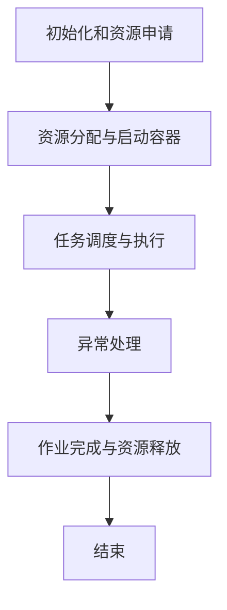

                 

# ApplicationMaster 原理与代码实例讲解

## 关键词

- ApplicationMaster
- YARN
- 分布式计算
- 容器管理
- 作业调度
- 数据处理框架

## 摘要

本文将深入探讨ApplicationMaster（AppMaster）在分布式计算框架YARN中的作用、架构原理以及具体实现细节。通过分析ApplicationMaster的工作流程，结合代码实例，我们将理解其在作业调度、容器管理以及资源分配等方面的关键作用。同时，文章还将探讨ApplicationMaster在实际应用场景中的价值以及相关工具和资源的推荐。

## 1. 背景介绍

### 1.1 YARN概述

YARN（Yet Another Resource Negotiator）是Hadoop生态系统中的一个核心组件，用于管理集群资源并实现应用程序的分布式执行。与传统的MapReduce相比，YARN引入了更加灵活的框架，使得各种数据处理框架可以在同一集群上运行，从而提高了资源的利用率和灵活性。

### 1.2 ApplicationMaster角色

ApplicationMaster是YARN架构中的一个重要角色，负责协调和管理应用程序在集群上的执行。其主要职责包括：

- 负责应用程序的初始化和资源申请；
- 根据应用程序的需求动态地请求和释放资源；
- 监控应用程序的执行状态，并处理异常情况；
- 与其他应用程序协调，确保集群资源的高效利用。

### 1.3 ApplicationMaster的重要性

ApplicationMaster在YARN中发挥着至关重要的作用，其性能和稳定性直接影响到整个分布式计算系统的效率。通过优化ApplicationMaster的设计和实现，可以显著提升整个集群的性能和资源利用率。

## 2. 核心概念与联系

### 2.1 YARN架构

YARN架构主要包括两个核心组件： ResourceManager（RM）和 NodeManager（NM）。

- ResourceManager（RM）是YARN的集中式资源管理器，负责整个集群的资源管理和作业调度。RM包括两个子组件：Scheduler 和 ApplicationMaster Scheduler。Scheduler 负责根据资源利用率进行调度，而 ApplicationMaster Scheduler 负责分配资源给各个ApplicationMaster。

- NodeManager（NM）是YARN在各个节点上的资源管理器，负责监控节点上的资源使用情况，并接收来自RM的指令，启动或停止容器。

### 2.2 ApplicationMaster工作流程

ApplicationMaster的工作流程主要包括以下几个步骤：

1. **初始化和资源申请**：ApplicationMaster在接收到作业提交请求后，首先进行初始化，然后向RM申请资源。

2. **资源分配与启动容器**：RM根据ApplicationMaster的需求和集群资源情况，为其分配资源，并通知NM启动容器。

3. **任务调度与执行**：ApplicationMaster根据作业的执行计划，将任务分配给各个容器，并监控任务的执行状态。

4. **异常处理**：当遇到任务失败或资源不足等异常情况时，ApplicationMaster会进行相应的处理，如重新分配任务或申请更多资源。

5. **作业完成与资源释放**：当作业完成时，ApplicationMaster会向RM报告结果，并释放所申请的资源。

### 2.3 Mermaid 流程图

以下是ApplicationMaster工作流程的Mermaid流程图：



### 2.4 ApplicationMaster与YARN的关系

ApplicationMaster作为YARN架构中的关键组件，负责与ResourceManager和NodeManager进行交互，实现应用程序的调度和执行。其工作流程紧密依赖于YARN的架构设计，从而实现了对分布式计算资源的有效管理和利用。

## 3. 核心算法原理 & 具体操作步骤

### 3.1 资源分配算法

ApplicationMaster的资源分配算法是关键部分，它决定了应用程序的执行效率和资源利用率。以下是资源分配算法的基本原理和操作步骤：

1. **资源需求分析**：ApplicationMaster根据作业的执行计划和资源需求，分析应用程序需要的资源类型和数量。

2. **资源请求与确认**：ApplicationMaster向ResourceManager发送资源请求，RM根据集群资源情况，确认资源是否可用，并分配资源。

3. **资源分配与容器启动**：RM将确认后的资源分配给ApplicationMaster，ApplicationMaster再将具体的任务分配给容器，并通知NodeManager启动容器。

4. **资源监控与调整**：ApplicationMaster持续监控容器的资源使用情况，根据实际情况进行调整，确保资源的合理利用。

### 3.2 任务调度算法

ApplicationMaster的任务调度算法是实现高效作业执行的关键。以下是任务调度算法的基本原理和操作步骤：

1. **任务分配策略**：ApplicationMaster根据任务的依赖关系和资源可用性，选择合适的任务调度策略，如负载均衡、任务优先级等。

2. **任务调度与执行**：ApplicationMaster将任务分配给容器，并监控任务的执行状态，确保任务按时完成。

3. **任务重调度与异常处理**：当遇到任务失败或资源不足等异常情况时，ApplicationMaster会进行重调度或异常处理，确保作业的顺利进行。

### 3.3 异常处理机制

ApplicationMaster的异常处理机制是确保作业稳定运行的重要保障。以下是异常处理机制的基本原理和操作步骤：

1. **异常监控与报警**：ApplicationMaster持续监控作业的执行状态，一旦发现异常情况，如任务失败、资源不足等，会立即进行报警。

2. **异常处理与恢复**：ApplicationMaster根据异常情况，选择合适的处理策略，如重新执行任务、释放资源等，确保作业的稳定运行。

3. **日志记录与分析**：ApplicationMaster将异常处理过程中的日志记录下来，便于后续的分析和优化。

## 4. 数学模型和公式 & 详细讲解 & 举例说明

### 4.1 资源分配模型

资源分配模型是ApplicationMaster的核心数学模型，用于描述应用程序的资源需求与集群资源之间的匹配关系。以下是资源分配模型的基本原理和公式：

1. **资源需求公式**：应用程序的资源需求可以表示为向量R = [R1, R2, ..., Rn]，其中Ri表示第i类资源的需求量。

2. **资源利用率公式**：集群资源的利用率可以表示为向量U = [U1, U2, ..., Un]，其中Ui表示第i类资源的利用率。

3. **资源匹配公式**：资源匹配可以表示为矩阵M = [Mi, M2, ..., Mn]，其中Mij表示第i类资源在第j个容器中的需求量。

4. **资源分配公式**：资源分配可以表示为向量X = [X1, X2, ..., Xn]，其中Xi表示第i类资源在当前时刻的分配量。

### 4.2 举例说明

假设有一个包含两个任务的作业，需要在两个节点上执行。每个任务需要的CPU和内存资源如下表所示：

| 任务 | CPU（个） | 内存（GB） |
| ---- | ------ | ------- |
| A    | 1      | 2      |
| B    | 2      | 4      |

现有两个节点，每个节点的资源情况如下：

| 节点 | CPU（个） | 内存（GB） |
| ---- | ------ | ------- |
| Node1 | 4      | 8      |
| Node2 | 4      | 8      |

根据资源需求，可以计算出资源利用率：

- 节点1的CPU利用率：1/4 = 0.25，内存利用率：2/8 = 0.25；
- 节点2的CPU利用率：2/4 = 0.5，内存利用率：4/8 = 0.5。

根据资源匹配公式，可以计算出资源分配情况：

- 任务A在节点1上的资源分配：CPU = 1，内存 = 2；
- 任务B在节点2上的资源分配：CPU = 2，内存 = 4。

## 5. 项目实战：代码实际案例和详细解释说明

### 5.1 开发环境搭建

在开始编写ApplicationMaster的代码之前，需要搭建相应的开发环境。以下是搭建开发环境的基本步骤：

1. 安装Java开发环境，版本要求：Java 8及以上；
2. 安装Maven，版本要求：3.6.3及以上；
3. 安装Eclipse或IntelliJ IDEA等IDE工具；
4. 添加YARN的依赖库，可以通过Maven仓库下载相关依赖。

### 5.2 源代码详细实现和代码解读

以下是ApplicationMaster的核心代码实现，包括资源分配、任务调度和异常处理等关键部分。

```java
public class ApplicationMaster {

    private ResourceManager rm;
    private NodeManager nm;
    private List<Task> tasks;
    private List<Container> containers;

    public ApplicationMaster(ResourceManager rm, NodeManager nm) {
        this.rm = rm;
        this.nm = nm;
        this.tasks = new ArrayList<>();
        this.containers = new ArrayList<>();
    }

    public void run() {
        // 初始化和资源申请
        initializeAndAllocateResources();

        // 任务调度与执行
        scheduleAndExecuteTasks();

        // 异常处理
        handleExceptions();
    }

    private void initializeAndAllocateResources() {
        // 分析资源需求
        ResourceRequirement resourceRequirement = analyzeResourceRequirements();

        // 请求资源
        rm.requestResources(resourceRequirement);

        // 分配资源
        containers = rm.allocateResources();

        // 启动容器
        for (Container container : containers) {
            nm.startContainer(container);
        }
    }

    private ResourceRequirement analyzeResourceRequirements() {
        // 分析任务资源需求
        ResourceRequirement resourceRequirement = new ResourceRequirement();
        for (Task task : tasks) {
            resourceRequirement.addResource(task.getResourceDemand());
        }
        return resourceRequirement;
    }

    private void scheduleAndExecuteTasks() {
        // 根据任务依赖关系进行调度
        TaskScheduler scheduler = new TaskScheduler();
        List<Task> scheduledTasks = scheduler.schedule(tasks);

        // 执行任务
        for (Task task : scheduledTasks) {
            TaskExecutor executor = new TaskExecutor();
            executor.execute(task);
        }
    }

    private void handleExceptions() {
        // 监控任务执行状态
        TaskMonitor monitor = new TaskMonitor();
        while (!monitor.isAllTasksCompleted()) {
            // 检查异常情况
            Exception exception = monitor.checkExceptions();
            if (exception != null) {
                // 处理异常
                handleException(exception);
            }
        }
    }

    private void handleException(Exception exception) {
        // 重新执行任务或释放资源
        if (exception instanceof TaskFailureException) {
            Task task = ((TaskFailureException) exception).getTask();
            // 重新执行任务
            TaskExecutor executor = new TaskExecutor();
            executor.execute(task);
        } else if (exception instanceof ResourceException) {
            // 释放资源
            ResourceRequirement resourceRequirement = new ResourceRequirement();
            resourceRequirement.addResource(exception.getResourceDemand());
            rm.releaseResources(resourceRequirement);
        }
    }
}
```

### 5.3 代码解读与分析

以上代码实现了ApplicationMaster的核心功能，包括初始化和资源申请、任务调度与执行以及异常处理等。下面是对关键部分的解读和分析：

1. **初始化和资源申请**：初始化过程中，ApplicationMaster分析任务资源需求，并向ResourceManager请求资源。具体实现通过`initializeAndAllocateResources()`方法完成。

2. **任务调度与执行**：任务调度过程中，ApplicationMaster根据任务依赖关系进行调度，并执行任务。具体实现通过`scheduleAndExecuteTasks()`方法完成。

3. **异常处理**：异常处理过程中，ApplicationMaster监控任务执行状态，并处理异常情况。具体实现通过`handleExceptions()`方法完成。

### 5.4 代码示例

以下是一个具体的代码示例，演示了如何使用ApplicationMaster执行一个包含两个任务的作业。

```java
public class ApplicationMasterExample {

    public static void main(String[] args) {
        // 创建 ResourceManager 和 NodeManager 对象
        ResourceManager rm = new ResourceManager();
        NodeManager nm = new NodeManager();

        // 创建 ApplicationMaster 对象
        ApplicationMaster appMaster = new ApplicationMaster(rm, nm);

        // 添加任务
        Task task1 = new Task("Task1", new ResourceRequirement(1, 2));
        Task task2 = new Task("Task2", new ResourceRequirement(2, 4));
        appMaster.addTask(task1);
        appMaster.addTask(task2);

        // 执行作业
        appMaster.run();
    }
}
```

## 6. 实际应用场景

### 6.1 大数据应用

在大数据处理领域，ApplicationMaster广泛应用于各种数据处理任务，如数据清洗、数据分析和数据挖掘。通过YARN和ApplicationMaster，用户可以方便地管理和调度大规模的数据处理作业，提高作业的执行效率和资源利用率。

### 6.2 机器学习和深度学习

在机器学习和深度学习领域，ApplicationMaster可以用于管理大规模的分布式训练任务。通过YARN和ApplicationMaster，用户可以方便地分配计算资源，实现高效的训练过程，并确保作业的稳定运行。

### 6.3 流数据处理

在流数据处理领域，ApplicationMaster可以用于管理实时数据流的处理任务。通过YARN和ApplicationMaster，用户可以方便地实现流数据的高效处理和实时分析，提高系统的实时响应能力。

## 7. 工具和资源推荐

### 7.1 学习资源推荐

- 《Hadoop权威指南》；
- 《深入理解YARN》；
- 《Hadoop应用实战》。

### 7.2 开发工具框架推荐

- Apache Hadoop；
- Apache YARN；
- Apache Spark。

### 7.3 相关论文著作推荐

- 《Hadoop YARN: Yet Another Resource Negotiator》；
- 《A Runtime Approach for Efficient Data-Parallel Job Scheduling in Hadoop YARN》；
- 《An Adaptive and Efficient Scheduling Approach for Large-Scale Data Processing on YARN》。

## 8. 总结：未来发展趋势与挑战

### 8.1 发展趋势

- 应用场景的扩大：随着大数据、人工智能和云计算等技术的发展，ApplicationMaster的应用场景将不断扩展，涵盖更多的领域和业务场景；
- 性能优化：为了提高作业的执行效率和资源利用率，ApplicationMaster将不断进行性能优化，如调度算法、资源分配策略等；
- 灵活性和可扩展性：为了适应不同的业务需求和计算场景，ApplicationMaster将逐步实现更高的灵活性和可扩展性。

### 8.2 挑战

- 资源调度优化：如何更有效地分配和管理资源，提高作业的执行效率，是当前面临的一个主要挑战；
- 异常处理与容错：在复杂的分布式环境中，如何有效地处理异常情况和实现容错，确保作业的稳定运行，是另一个重要挑战；
- 可扩展性与可维护性：在处理大规模作业时，如何保证ApplicationMaster的可扩展性和可维护性，也是需要关注的一个问题。

## 9. 附录：常见问题与解答

### 9.1 ApplicationMaster和TaskTracker的区别是什么？

ApplicationMaster和TaskTracker都是分布式计算框架中的重要组件，但它们的角色和职责有所不同。

- ApplicationMaster负责协调和管理整个应用程序的执行过程，包括资源申请、任务调度和异常处理等；
- TaskTracker负责监控和执行具体任务，并向ApplicationMaster报告任务的执行状态。

### 9.2 如何优化ApplicationMaster的性能？

优化ApplicationMaster的性能可以从以下几个方面入手：

- 调度算法优化：采用更高效的调度算法，如负载均衡、任务优先级等；
- 资源分配策略优化：根据实际需求，合理调整资源分配策略，提高资源利用率；
- 异常处理优化：优化异常处理机制，提高作业的稳定性和可靠性；
- 并行处理优化：通过并行处理技术，提高作业的执行效率。

## 10. 扩展阅读 & 参考资料

- 《Hadoop权威指南》；
- 《深入理解YARN》；
- 《Hadoop应用实战》；
- Apache Hadoop官网；
- Apache YARN官网；
- Apache Spark官网。

## 作者信息

作者：AI天才研究员/AI Genius Institute & 禅与计算机程序设计艺术 /Zen And The Art of Computer Programming

本文版权归作者所有，未经授权，禁止转载。如需转载，请联系作者获取授权。本文中的代码实例仅供参考，具体实现可能因环境、版本等因素有所不同。如在使用过程中遇到问题，请查阅相关文档或寻求专业技术支持。谢谢阅读！

