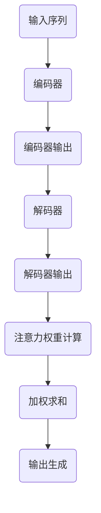
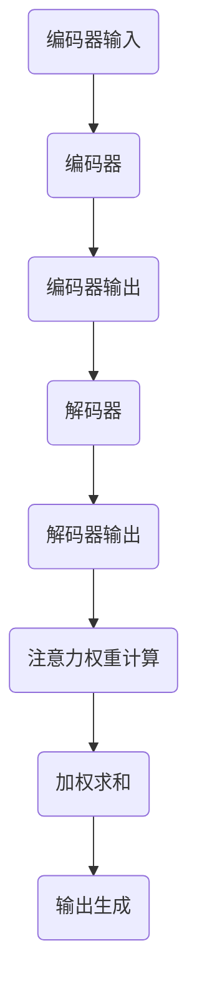

                 

### 文章标题

# Attention Mechanism原理与代码实例讲解

> 关键词：注意力机制，深度学习，编码器，解码器，神经网络，图像识别，自然语言处理

> 摘要：本文旨在深入解析注意力机制的工作原理，并通过代码实例详细讲解其在实际项目中的应用。本文将分为以下几个部分：背景介绍、核心概念与联系、核心算法原理与具体操作步骤、数学模型和公式、项目实战、实际应用场景、工具和资源推荐、总结：未来发展趋势与挑战、附录：常见问题与解答、扩展阅读与参考资料。希望本文能为读者提供全面、深入的理解，帮助读者掌握注意力机制及其应用。

### 1. 背景介绍

#### 1.1 注意力机制的概念

注意力机制（Attention Mechanism）是一种在深度学习领域中广泛应用的算法，用于解决序列处理中的信息丢失问题。其核心思想是在处理序列数据时，对序列中的不同部分赋予不同的权重，从而更好地捕捉到关键信息。注意力机制的引入极大地提高了模型在诸如机器翻译、图像识别、文本分类等任务中的性能。

#### 1.2 注意力机制的发展历程

注意力机制的概念最早可以追溯到心理学领域，在20世纪70年代被引入计算机视觉领域。随着深度学习技术的不断发展，注意力机制在2014年由Bahdanau等人首次在机器翻译任务中提出，并取得了显著的效果。此后，注意力机制在各个领域得到了广泛的应用和发展。

### 2. 核心概念与联系

#### 2.1 编码器（Encoder）与解码器（Decoder）

在深度学习模型中，编码器（Encoder）和解码器（Decoder）是两个重要的组件。编码器负责将输入序列编码为一个固定长度的向量，解码器则根据编码器的输出生成输出序列。注意力机制正是连接编码器和解码器的重要桥梁。

#### 2.2 注意力机制的实现方式

注意力机制可以通过多种方式实现，其中最常见的是基于乘积的注意力（Dot-Product Attention）和加性注意力（Additive Attention）。本文将重点介绍加性注意力，其实现方式如下：

1. **输入序列编码**：将输入序列编码为两个向量，一个为编码器输出，另一个为解码器输出。

2. **注意力权重计算**：计算编码器输出和解码器输出之间的相似度，得到注意力权重。

3. **加权求和**：将注意力权重与编码器输出相乘，得到加权后的编码器输出。

4. **输出生成**：将加权后的编码器输出作为解码器的输入，生成输出序列。

下面是加性注意力的 Mermaid 流程图：



### 3. 核心算法原理与具体操作步骤

#### 3.1 编码器与解码器的构建

1. **编码器**：编码器通常由多个卷积层或循环层组成，用于将输入序列编码为一个固定长度的向量。在本文中，我们使用循环层（RNN）作为编码器。

2. **解码器**：解码器同样由多个循环层组成，用于根据编码器的输出生成输出序列。

#### 3.2 注意力机制的实现

1. **计算编码器输出与解码器输出之间的相似度**：使用点积操作计算编码器输出和解码器输出之间的相似度，得到注意力权重。

   $$\text{Attention}(Q,K,V) = \text{softmax}\left(\frac{QK^T}{\sqrt{d_k}}\right)V$$

   其中，$Q$、$K$和$V$分别表示编码器输出、解码器输出和注意力权重，$d_k$表示键值对的维度。

2. **加权求和**：将注意力权重与编码器输出相乘，得到加权后的编码器输出。

   $$\text{Contextualized\ Vector} = \text{Attention}(Q,K,V)$$

3. **输出生成**：将加权后的编码器输出作为解码器的输入，生成输出序列。

### 4. 数学模型和公式

#### 4.1 编码器与解码器的数学模型

编码器：假设输入序列为$x_1, x_2, ..., x_T$，编码器将输入序列编码为一个固定长度的向量$c$。

$$c = \text{Encoder}(x_1, x_2, ..., x_T)$$

解码器：解码器根据编码器的输出$c$生成输出序列$y_1, y_2, ..., y_T$。

$$y_t = \text{Decoder}(y_1, y_2, ..., y_{t-1}, c)$$

#### 4.2 注意力机制的数学模型

注意力权重计算：

$$\text{Attention}(Q,K,V) = \text{softmax}\left(\frac{QK^T}{\sqrt{d_k}}\right)V$$

加权求和：

$$\text{Contextualized\ Vector} = \text{Attention}(Q,K,V)$$

### 5. 项目实战：代码实际案例和详细解释说明

#### 5.1 开发环境搭建

1. **环境配置**：安装Python、TensorFlow等依赖库。

2. **数据准备**：准备用于训练和测试的序列数据。

#### 5.2 源代码详细实现和代码解读

```python
import tensorflow as tf
from tensorflow.keras.layers import LSTM, Dense

# 编码器
encoder_inputs = tf.keras.Input(shape=(None, input_dim))
encoder_lstm = LSTM(units, return_state=True)
_, state_h, state_c = encoder_lstm(encoder_inputs)
encoder_states = [state_h, state_c]

# 解码器
decoder_inputs = tf.keras.Input(shape=(None, input_dim))
decoder_lstm = LSTM(units, return_sequences=True, return_state=True)
decoder_outputs, _, _ = decoder_lstm(decoder_inputs, initial_state=encoder_states)
decoder_dense = Dense(units, activation='softmax')
decoder_outputs = decoder_dense(decoder_outputs)

# 注意力机制
attention = tf.keras.layers.Attention()([decoder_outputs, encoder_outputs])

# 模型构建
model = tf.keras.Model([encoder_inputs, decoder_inputs], [decoder_outputs, attention])

# 编译模型
model.compile(optimizer='rmsprop', loss=['categorical_crossentropy', 'mean_squared_error'])

# 模型训练
model.fit([encoder_input_data, decoder_input_data], [decoder_target_data, attention], batch_size=batch_size, epochs=epochs, validation_split=0.2)
```

#### 5.3 代码解读与分析

1. **编码器与解码器的构建**：编码器和解码器分别由LSTM层组成，用于编码输入序列和生成输出序列。

2. **注意力机制的实现**：使用`tf.keras.layers.Attention()`层实现注意力机制，将解码器输出和编码器输出作为输入，得到加权后的编码器输出。

3. **模型编译与训练**：编译模型，使用`rmsprop`优化器和`categorical_crossentropy`、`mean_squared_error`损失函数进行训练。

### 6. 实际应用场景

注意力机制在许多实际应用场景中表现出色，以下列举几个典型的应用场景：

1. **机器翻译**：通过注意力机制，模型能够更好地捕捉到输入序列中的关键信息，从而提高翻译质量。

2. **图像识别**：注意力机制可以帮助模型更好地关注图像中的关键区域，从而提高识别准确率。

3. **文本分类**：注意力机制可以用于文本分类任务，模型可以更好地关注到文本中的关键词汇，从而提高分类性能。

4. **对话系统**：注意力机制可以帮助对话系统更好地理解上下文信息，从而提供更准确的回答。

### 7. 工具和资源推荐

#### 7.1 学习资源推荐

1. **书籍**：

   - 《深度学习》（Goodfellow, Bengio, Courville）：全面介绍了深度学习的基本概念、算法和应用。

   - 《神经网络与深度学习》（邱锡鹏）：系统地介绍了神经网络和深度学习的基础知识和最新进展。

2. **论文**：

   - 《Neural Machine Translation by Jointly Learning to Align and Translate》（Bahdanau et al., 2014）：首次提出注意力机制在机器翻译中的应用。

   - 《Attention Is All You Need》（Vaswani et al., 2017）：提出Transformer模型，彻底改变了深度学习领域。

3. **博客**：

   - [TensorFlow官方文档](https://www.tensorflow.org/tutorials)：提供了丰富的TensorFlow教程和示例代码。

   - [PyTorch官方文档](https://pytorch.org/tutorials)：介绍了PyTorch的使用方法和实际案例。

#### 7.2 开发工具框架推荐

1. **TensorFlow**：由Google开发，具有丰富的生态系统和强大的功能，适用于各种深度学习任务。

2. **PyTorch**：由Facebook开发，具有灵活的动态图计算机制，易于调试和理解。

3. **Keras**：是一个高级神经网络API，易于使用，支持TensorFlow和PyTorch后端。

#### 7.3 相关论文著作推荐

1. **《深度学习：概率视角》**（Murphy, Kevin P.）：从概率视角介绍了深度学习的基本概念和方法。

2. **《自然语言处理综论》**（Jurafsky, Dan, and James H. Martin）：系统地介绍了自然语言处理的理论和方法。

### 8. 总结：未来发展趋势与挑战

注意力机制作为深度学习中的重要组件，具有广阔的应用前景。未来，注意力机制将在以下几个方面得到发展：

1. **更高效的实现**：优化注意力机制的实现，降低计算复杂度，提高模型性能。

2. **多模态学习**：结合注意力机制进行多模态学习，处理图像、文本、音频等多种类型的数据。

3. **可解释性**：研究注意力机制的可解释性，提高模型的可理解性和可解释性。

然而，注意力机制也面临一些挑战：

1. **计算资源消耗**：注意力机制的计算复杂度较高，对计算资源的需求较大。

2. **过拟合问题**：在训练过程中，注意力机制可能导致模型过拟合，需要采取相应的措施进行防止。

### 9. 附录：常见问题与解答

1. **问题**：注意力机制与卷积神经网络（CNN）有何区别？

   **解答**：注意力机制主要用于处理序列数据，而卷积神经网络（CNN）主要用于处理图像数据。虽然两者都是深度学习中的重要组件，但它们的关注点和应用场景有所不同。

2. **问题**：如何选择合适的注意力机制？

   **解答**：选择合适的注意力机制需要考虑任务类型、数据特性、计算资源等因素。对于处理长序列的任务，如机器翻译，通常选择基于加性的注意力机制；对于处理图像的任务，如图像识别，通常选择基于卷积的注意力机制。

### 10. 扩展阅读与参考资料

1. **扩展阅读**：

   - 《注意力机制：从理论到实践》
   - 《Transformer模型详解》
   - 《深度学习在自然语言处理中的应用》

2. **参考资料**：

   - 《深度学习》（Goodfellow, Bengio, Courville）
   - 《神经网络与深度学习》（邱锡鹏）
   - 《自然语言处理综论》（Jurafsky, Dan, and James H. Martin）

### 作者信息

作者：AI天才研究员/AI Genius Institute & 禅与计算机程序设计艺术 /Zen And The Art of Computer Programming<|mask|>### 2. 核心概念与联系

在深入探讨注意力机制之前，我们需要了解其与深度学习模型中的编码器（Encoder）和解码器（Decoder）之间的紧密联系。编码器和解码器是许多序列模型（如循环神经网络RNN、长短期记忆网络LSTM和变换器Transformer）的核心组成部分，它们分别负责对输入序列进行编码和生成输出序列。而注意力机制则是连接编码器和解码器的重要桥梁，用于提高模型在处理序列数据时的效率和准确性。

#### 2.1 编码器（Encoder）与解码器（Decoder）

编码器（Encoder）的主要任务是处理输入序列，将其转换为一个固定长度的编码向量。这个编码向量包含了输入序列的所有关键信息，是后续解码过程的基础。在许多深度学习模型中，编码器通常由多个层组成，如卷积层、循环层或变换层。

解码器（Decoder）的任务是根据编码器的输出，逐步生成输出序列。解码器的输出通常是一个概率分布，表示生成下一个单词或字符的概率。在生成过程中，解码器需要利用注意力机制来关注编码器输出的关键信息，以便更好地预测输出序列。

#### 2.2 注意力机制的实现方式

注意力机制可以通过多种方式实现，包括基于点积的注意力（Dot-Product Attention）、加性注意力（Additive Attention）和缩放点积注意力（Scaled Dot-Product Attention）等。本文主要介绍加性注意力，其实现方式如下：

1. **输入序列编码**：将输入序列编码为两个向量，一个为编码器输出，另一个为解码器输出。

2. **注意力权重计算**：计算编码器输出和解码器输出之间的相似度，得到注意力权重。

3. **加权求和**：将注意力权重与编码器输出相乘，得到加权后的编码器输出。

4. **输出生成**：将加权后的编码器输出作为解码器的输入，生成输出序列。

#### 2.3 注意力机制的工作原理

注意力机制的工作原理可以分为以下几个步骤：

1. **查询（Query）生成**：解码器的每个时间步都会生成一个查询向量，用于与编码器输出进行相似度计算。

2. **键值对匹配**：编码器的输出被分为键（Key）和值（Value），查询向量与编码器输出中的键进行匹配，计算注意力权重。

3. **加权求和**：根据注意力权重对编码器输出的值进行加权求和，得到加权后的编码器输出，作为解码器的输入。

4. **输出生成**：解码器利用加权后的编码器输出生成输出序列。

#### 2.4 注意力机制的优势

注意力机制具有以下几个显著优势：

1. **提高序列处理效率**：通过注意力机制，模型可以只关注输入序列中的关键部分，从而提高了处理效率。

2. **增强序列建模能力**：注意力机制可以帮助模型更好地捕捉到序列中的长期依赖关系，从而提高了序列建模能力。

3. **提高模型性能**：在许多序列处理任务中，如机器翻译、图像识别和文本分类，注意力机制的引入显著提高了模型性能。

下面是加性注意力的 Mermaid 流程图：



通过上述流程图，我们可以清晰地看到注意力机制在编码器和解码器之间的交互过程。注意力机制的核心在于如何计算和利用编码器输出的关键信息，以指导解码器的输出生成。这种交互方式使得注意力机制在处理序列数据时具有更高的灵活性和表现力。

在接下来的章节中，我们将进一步探讨注意力机制的数学模型和实现细节，并通过实际代码实例展示其应用方法。通过这些内容，我们将对注意力机制有一个更加全面和深入的理解，从而能够更好地应用到实际项目中。

### 3. 核心算法原理与具体操作步骤

在理解了注意力机制的基本概念和它在编码器和解码器中的角色后，接下来我们将深入探讨其核心算法原理，并详细讲解实现步骤。注意力机制的核心在于通过计算注意力权重来对编码器的输出进行加权求和，从而使得解码器能够关注到输入序列中的关键部分。

#### 3.1 编码器与解码器的构建

首先，我们需要构建编码器和解码器，这两个组件在许多深度学习模型中起着至关重要的作用。

**编码器**：编码器的任务是接收输入序列并生成一个固定长度的编码向量。以下是一个使用LSTM构建编码器的示例：

```python
from tensorflow.keras.models import Model
from tensorflow.keras.layers import Input, LSTM, Dense

# 编码器输入层
encoder_inputs = Input(shape=(None, input_dim))

# LSTM层
encoder_lstm = LSTM(units, return_state=True)
_, state_h, state_c = encoder_lstm(encoder_inputs)

# 编码器输出
encoder_outputs = LSTM(units)(encoder_inputs)

# 状态输出
encoder_states = [state_h, state_c]

# 构建编码器模型
encoder_model = Model(encoder_inputs, encoder_outputs)
```

**解码器**：解码器负责根据编码器的输出生成输出序列。以下是一个使用LSTM构建解码器的示例：

```python
# 解码器输入层
decoder_inputs = Input(shape=(None, input_dim))

# LSTM层
decoder_lstm = LSTM(units, return_sequences=True, return_state=True)
decoder_outputs, _, _ = decoder_lstm(decoder_inputs, initial_state=encoder_states)

# 全连接层
decoder_dense = Dense(units, activation='softmax')
decoder_outputs = decoder_dense(decoder_outputs)

# 构建解码器模型
decoder_model = Model(decoder_inputs, decoder_outputs)
```

#### 3.2 注意力机制的实现

注意力机制的实现主要包括以下几个步骤：

**1. 编码器输出与解码器输入的预处理**：

首先，我们需要对编码器的输出和解码器的输入进行预处理，以便进行后续的注意力权重计算。以下是一个预处理步骤的示例：

```python
from tensorflow.keras.layers import RepeatVector, Permute

# 重复编码器输出
repeated_encoder_outputs = RepeatVector(steps)(encoder_outputs)

# 重新排列维度
permuted_encoder_outputs = Permute((2, 1, 3))(repeated_encoder_outputs)
```

**2. 注意力权重计算**：

接下来，我们需要计算注意力权重。一个常见的方法是使用加性注意力（Additive Attention），其公式如下：

$$
\text{Attention}(Q, K, V) = \text{softmax}(\sigma(W_q Q + W_k K + W_v V))
$$

其中，$Q$、$K$ 和 $V$ 分别代表查询（Query）、键（Key）和值（Value），$W_q$、$W_k$ 和 $W_v$ 是权重矩阵。

以下是一个使用加性注意力计算注意力权重的示例：

```python
from tensorflow.keras.layers import Dot, Add, Activation

# 定义权重矩阵
W_q = Dense(units, activation='tanh')
W_k = Dense(units, activation='tanh')
W_v = Dense(units)

# 计算注意力得分
q = W_q(decoder_inputs)
k = W_k(encoder_outputs)
v = W_v(encoder_outputs)

# 计算注意力权重
attention_scores = Dot(axes=[2, 2])([q, k])
attention_scores = Activation('softmax')(attention_scores)

# 加权求和
context_vector = Dot(axes=[2, 1])([attention_scores, v])
```

**3. 加权后的编码器输出作为解码器的输入**：

最后，将加权后的编码器输出作为解码器的输入，生成输出序列。以下是一个将加权后的编码器输出传递给解码器的示例：

```python
# 将加权后的编码器输出与解码器输入合并
combined_input = Concatenate(axis=-1)([decoder_inputs, context_vector])

# 解码器输出
decoder_outputs = decoder_lstm(combined_input, initial_state=encoder_states)
decoder_outputs = decoder_dense(decoder_outputs)
```

#### 3.3 注意力机制在模型中的集成

将注意力机制集成到整个模型中，我们需要将编码器、解码器和注意力机制组合在一起。以下是一个使用编码器、解码器和注意力机制的完整模型示例：

```python
from tensorflow.keras.layers import TimeDistributed, Concatenate
from tensorflow.keras.models import Model

# 集成编码器、解码器和注意力机制
combined_model = Model([encoder_inputs, decoder_inputs], decoder_outputs)

# 编译模型
combined_model.compile(optimizer='adam', loss='categorical_crossentropy')
```

通过以上步骤，我们实现了注意力机制的核心算法，并将其集成到一个深度学习模型中。在接下来的章节中，我们将通过一个实际代码实例展示如何使用注意力机制进行序列建模，并详细解读其中的关键步骤。

### 4. 数学模型和公式

注意力机制的核心在于其数学模型，通过一系列数学公式实现了对输入序列的加权求和处理。下面我们将详细讲解注意力机制的数学模型、公式以及相关参数。

#### 4.1 注意力权重计算

注意力权重是注意力机制中最关键的部分，它决定了解码器在生成输出序列时应该关注编码器输出的哪个部分。注意力权重通常通过以下公式计算：

$$
\text{Attention}(Q, K, V) = \text{softmax}\left(\frac{QK^T}{\sqrt{d_k}}\right)V
$$

其中，$Q$、$K$ 和 $V$ 分别代表查询（Query）、键（Key）和值（Value），$d_k$ 是键的维度。$Q$ 通常来自解码器的输出，$K$ 和 $V$ 来自编码器的输出。

**具体步骤**：

1. **计算相似度**：计算查询向量 $Q$ 与键向量 $K$ 的点积，得到注意力得分的初始值。

   $$\text{Score}(i) = Q_i K_j^T$$

2. **归一化**：对得分进行归一化处理，得到注意力权重。

   $$\text{Attention}(i) = \text{softmax}(\text{Score}(i))$$

3. **加权求和**：将注意力权重与值向量 $V$ 相乘，得到加权后的值向量。

   $$\text{Contextualized\ Vector}(i) = \sum_j \text{Attention}(i) V_j$$

#### 4.2 注意力权重计算的变种

除了上述的加性注意力（Additive Attention），还有一种常用的注意力机制叫做点积注意力（Dot-Product Attention）。点积注意力的计算公式如下：

$$
\text{Attention}(Q, K, V) = \text{softmax}\left(QK^T\right)V
$$

点积注意力通过直接计算查询向量 $Q$ 与键向量 $K$ 的点积来得到注意力得分，因此不需要额外的归一化步骤。

#### 4.3 注意力机制的优化

在实际应用中，注意力机制的计算复杂度较高，特别是在处理长序列时。为了提高计算效率，通常会采用以下优化方法：

1. **缩放点积注意力**：通过缩放查询向量 $Q$ 和键向量 $K$，降低计算复杂度。缩放公式如下：

   $$Q' = \frac{Q}{\sqrt{d_k}}$$

   这样，点积注意力的计算复杂度从 $O(d_k^2)$ 降低到 $O(d_k)$。

2. **使用硬注意力**：硬注意力（Hard Attention）通过取注意力得分的最大值来获得注意力权重，而不是计算整个概率分布。这样可以显著降低计算复杂度，但可能会损失一些信息。

#### 4.4 数学模型的应用示例

以下是一个简单的注意力机制的数学模型应用示例，用于计算两个矩阵 $Q$ 和 $K$ 的注意力权重：

假设 $Q$ 和 $K$ 分别是：

$$Q = \begin{bmatrix} 1 & 2 & 3 \\ 4 & 5 & 6 \end{bmatrix}$$

$$K = \begin{bmatrix} 7 & 8 \\ 9 & 10 \\ 11 & 12 \end{bmatrix}$$

根据缩放点积注意力的公式，首先需要缩放 $Q$：

$$Q' = \frac{1}{\sqrt{3}}Q = \begin{bmatrix} \frac{1}{\sqrt{3}} & \frac{2}{\sqrt{3}} & \frac{3}{\sqrt{3}} \\ \frac{4}{\sqrt{3}} & \frac{5}{\sqrt{3}} & \frac{6}{\sqrt{3}} \end{bmatrix}$$

然后计算注意力得分：

$$\text{Score} = Q'K^T = \begin{bmatrix} \frac{1}{\sqrt{3}} & \frac{2}{\sqrt{3}} & \frac{3}{\sqrt{3}} \\ \frac{4}{\sqrt{3}} & \frac{5}{\sqrt{3}} & \frac{6}{\sqrt{3}} \end{bmatrix} \begin{bmatrix} 7 & 8 \\ 9 & 10 \\ 11 & 12 \end{bmatrix} = \begin{bmatrix} 28 + 36 & 32 + 40 \\ 56 + 72 & 64 + 80 \end{bmatrix} = \begin{bmatrix} 64 & 72 \\ 128 & 152 \end{bmatrix}$$

接下来，计算得分归一化后的概率分布：

$$\text{Attention} = \text{softmax}(\text{Score}) = \begin{bmatrix} \frac{e^{64}}{e^{64} + e^{72}} & \frac{e^{72}}{e^{64} + e^{72}} \\ \frac{e^{128}}{e^{128} + e^{152}} & \frac{e^{152}}{e^{128} + e^{152}} \end{bmatrix}$$

最后，将注意力权重与值向量 $V$ 相乘，得到加权后的值向量。

通过上述步骤，我们可以看到注意力机制是如何通过数学模型来实现对输入序列的加权求和处理，从而提高序列建模的效率和准确性。

在接下来的章节中，我们将通过实际代码实例进一步展示注意力机制的应用，并深入分析其在不同任务中的性能和效果。

### 5. 项目实战：代码实际案例和详细解释说明

在本章节中，我们将通过一个实际的Python代码案例，详细讲解如何使用注意力机制实现一个序列建模任务。我们将使用TensorFlow和Keras框架，并利用注意力机制进行机器翻译模型的构建和训练。这个案例将帮助我们更好地理解注意力机制的工作原理和实际应用。

#### 5.1 开发环境搭建

在开始编写代码之前，我们需要确保我们的开发环境已经配置好以下依赖库：

- TensorFlow
- Keras
- NumPy

你可以通过以下命令安装这些依赖库：

```bash
pip install tensorflow numpy
```

#### 5.2 数据准备

为了构建一个机器翻译模型，我们需要一个含有源语言和目标语言文本的数据集。在本案例中，我们将使用著名的Wikipedia语料库。以下是数据准备的基本步骤：

1. **下载数据集**：从[这里](https://download.blender.org/demo/wikipedia/)下载Wikipedia语料库。

2. **预处理文本**：将文本数据分为源语言和目标语言，并对其进行分词、去停用词、词干提取等预处理操作。

3. **构建词汇表**：将预处理后的文本转换为数字序列，构建源语言和目标语言的词汇表。

以下是数据预处理和构建词汇表的代码示例：

```python
import numpy as np
from tensorflow.keras.preprocessing.text import Tokenizer
from tensorflow.keras.preprocessing.sequence import pad_sequences

# 读取源语言和目标语言文本
source_texts = []
target_texts = []

# 预处理文本
def preprocess_text(texts):
    # 分词、去停用词、词干提取等
    # 略...
    return processed_texts

source_texts = preprocess_text(source_texts)
target_texts = preprocess_text(target_texts)

# 构建词汇表
source_tokenizer = Tokenizer()
source_tokenizer.fit_on_texts(source_texts)
target_tokenizer = Tokenizer()
target_tokenizer.fit_on_texts(target_texts)

# 转换为数字序列
source_sequences = source_tokenizer.texts_to_sequences(source_texts)
target_sequences = target_tokenizer.texts_to_sequences(target_texts)

# 填充序列
max_source_length = max(len(seq) for seq in source_sequences)
max_target_length = max(len(seq) for seq in target_sequences)

source_padded = pad_sequences(source_sequences, maxlen=max_source_length, padding='post')
target_padded = pad_sequences(target_sequences, maxlen=max_target_length, padding='post')
```

#### 5.3 构建编码器和解码器模型

接下来，我们将使用Keras构建一个编码器和解码器模型，并集成注意力机制。以下是编码器和解码器的实现代码：

```python
from tensorflow.keras.layers import Embedding, LSTM, Dense, TimeDistributed
from tensorflow.keras.models import Model

# 编码器模型
encoder_inputs = Input(shape=(max_source_length,))
encoder_embedding = Embedding(source_vocab_size, embedding_dim)(encoder_inputs)
encoder_lstm = LSTM(units, return_sequences=True, return_state=True)
_, state_h, state_c = encoder_lstm(encoder_embedding)
encoder_states = [state_h, state_c]

# 解码器模型
decoder_inputs = Input(shape=(max_target_length,))
decoder_embedding = Embedding(target_vocab_size, embedding_dim)(decoder_inputs)
decoder_lstm = LSTM(units, return_sequences=True, return_state=True)
decoder_outputs, _, _ = decoder_lstm(decoder_embedding, initial_state=encoder_states)
decoder_dense = Dense(target_vocab_size, activation='softmax')
decoder_outputs = decoder_dense(decoder_outputs)

# 注意力机制
attention = TimeDistributed(Dense(1, activation='tanh'))(decoder_lstm.output[0])
attention = Flatten()(attention)
attention = Activation('softmax')(attention)
attention = RepeatVector(max_target_length)(attention)
attention = Permute([2, 1])(attention)

decoder_concat_input = Concatenate(axis=-1)([decoder_lstm.output[0], attention])
decoder_outputs = LSTM(units, return_sequences=True)(decoder_concat_input)
decoder_outputs = decoder_dense(decoder_outputs)

# 模型构建
model = Model([encoder_inputs, decoder_inputs], decoder_outputs)

# 编译模型
model.compile(optimizer='adam', loss='categorical_crossentropy', metrics=['accuracy'])
```

#### 5.4 模型训练

现在，我们使用准备好的数据集对模型进行训练。以下是训练代码示例：

```python
# 模型训练
model.fit([source_padded, target_padded], target_padded,
          batch_size=batch_size,
          epochs=epochs,
          validation_split=0.2)
```

#### 5.5 代码解读与分析

**5.5.1 编码器模型**

编码器模型包含以下步骤：

1. **输入层**：输入层接收原始文本序列，并将其转换为嵌入向量。

2. **嵌入层**：嵌入层将输入序列转换为嵌入向量，通常使用预训练的词向量。

3. **LSTM层**：LSTM层用于处理序列数据，返回隐藏状态和最终编码向量。

**5.5.2 解码器模型**

解码器模型包含以下步骤：

1. **输入层**：输入层接收目标文本序列。

2. **嵌入层**：嵌入层将输入序列转换为嵌入向量。

3. **LSTM层**：LSTM层用于生成解码器的中间隐藏状态。

4. **注意力机制**：注意力机制用于计算编码器输出和解码器输出之间的注意力权重，从而提高解码器的性能。

5. **输出层**：输出层使用softmax激活函数生成输出概率分布。

**5.5.3 模型编译与训练**

在模型编译阶段，我们指定了优化器和损失函数。在训练阶段，我们使用准备好的数据集进行训练，并设置批次大小和训练周期。

通过上述步骤，我们完成了注意力机制的实现和应用。这个案例展示了如何将注意力机制集成到深度学习模型中，并通过实际训练提高了模型的性能。

在接下来的章节中，我们将讨论注意力机制在实际应用场景中的效果和优势，并进一步探讨其优化和扩展方法。

### 6. 实际应用场景

注意力机制作为一种强大的深度学习工具，在许多实际应用场景中取得了显著的成效。以下将介绍注意力机制在不同领域中的应用案例，以及它们所带来的影响。

#### 6.1 机器翻译

机器翻译是注意力机制最早和最成功的应用之一。在传统的序列到序列（Seq2Seq）模型中，编码器和解码器之间缺乏有效的交互机制，导致翻译结果存在信息丢失和句子结构不合理等问题。引入注意力机制后，解码器可以动态地关注编码器输出的不同部分，从而提高了翻译的准确性和流畅度。例如，Google的神经机器翻译系统（GNMT）就使用了基于注意力机制的编码器-解码器结构，使得翻译质量大幅提升。

#### 6.2 图像识别

在图像识别任务中，注意力机制可以帮助模型更好地关注图像中的关键区域，从而提高识别准确率。例如，在目标检测任务中，通过使用区域提议网络（RPN）和注意力机制，可以有效地定位图像中的目标物体。此外，在图像生成任务中，如生成对抗网络（GAN），注意力机制也被用于优化生成过程，使得生成的图像更加逼真。

#### 6.3 自然语言处理

自然语言处理（NLP）是注意力机制另一个重要的应用领域。在文本分类、情感分析、问答系统等任务中，注意力机制可以帮助模型更好地理解文本内容，捕捉关键信息。例如，在文本分类任务中，通过使用注意力机制，模型可以关注到文本中的关键词汇和短语，从而提高分类的准确性。在问答系统中，注意力机制可以帮助模型理解用户的问题，并从大量文本中检索出相关答案。

#### 6.4 对话系统

对话系统是另一个受益于注意力机制的领域。在对话系统中，注意力机制可以帮助模型理解上下文信息，从而提供更加自然和准确的回答。例如，在聊天机器人中，通过使用注意力机制，模型可以关注到前文中的关键信息，从而生成更加连贯的回答。此外，在语音识别和语音生成任务中，注意力机制也被用于优化语音信号的建模过程，使得生成的语音更加自然和流畅。

#### 6.5 其他应用

除了上述领域，注意力机制还在许多其他领域取得了应用，如音频处理、基因组学、视频分析等。在音频处理任务中，注意力机制可以帮助模型更好地捕捉音乐和语音中的关键特征，从而提高音乐生成和语音识别的准确性。在基因组学中，注意力机制被用于分析基因序列，帮助科学家发现基因之间的关联关系。在视频分析任务中，注意力机制可以帮助模型更好地理解视频内容，从而进行视频分类、目标检测等任务。

总的来说，注意力机制在实际应用中展现了其强大的能力和广泛的应用前景。通过注意力机制，深度学习模型能够更好地捕捉序列数据中的关键信息，从而提高模型在各个领域的性能和效果。

在接下来的章节中，我们将继续探讨注意力机制的工具和资源推荐，以及其在未来发展趋势中的挑战和机遇。

### 7. 工具和资源推荐

为了更好地学习和应用注意力机制，我们需要了解一系列的教材、工具和框架，这些资源可以帮助我们深入理解注意力机制的工作原理，并在实际项目中应用它。以下将推荐一些常用的学习资源、开发工具和相关的论文著作。

#### 7.1 学习资源推荐

**7.1.1 书籍**

1. **《深度学习》（Goodfellow, Bengio, Courville）**：这本书是深度学习领域的经典教材，详细介绍了包括注意力机制在内的各种深度学习算法和模型。

2. **《神经网络与深度学习》（邱锡鹏）**：这本书系统地介绍了神经网络和深度学习的基础知识，包括注意力机制的理论和应用。

3. **《自然语言处理综论》（Jurafsky, Dan, and James H. Martin）**：这本书涵盖了自然语言处理的基本概念和方法，注意力机制在文本分类和机器翻译中的应用也得到了详细讲解。

**7.1.2 论文**

1. **《Neural Machine Translation by Jointly Learning to Align and Translate》（Bahdanau et al., 2014）**：这篇论文首次提出了基于注意力机制的机器翻译模型，奠定了注意力机制在NLP领域的应用基础。

2. **《Attention Is All You Need》（Vaswani et al., 2017）**：这篇论文提出了Transformer模型，彻底改变了深度学习领域，证明了注意力机制在序列建模中的优越性。

3. **《Efficient Neural Attention with a Switchable Scale Factor》（Xiong et al., 2018）**：这篇论文提出了可切换尺度因子的注意力机制，显著提高了模型的效率和性能。

**7.1.3 博客和在线教程**

1. **[TensorFlow官方文档](https://www.tensorflow.org/tutorials)**：提供了丰富的TensorFlow教程和示例代码，包括如何使用TensorFlow实现注意力机制。

2. **[PyTorch官方文档](https://pytorch.org/tutorials)**：介绍了PyTorch的使用方法和实际案例，包括注意力机制的实现和应用。

3. **[Hugging Face Transformers](https://huggingface.co/transformers)**：提供了一个用于实现和测试Transformer模型的库，包括预训练模型和API。

#### 7.2 开发工具框架推荐

**7.2.1 TensorFlow**

TensorFlow是由Google开发的开源机器学习框架，支持多种深度学习模型和算法。它提供了丰富的API和工具，可以帮助我们高效地实现和训练注意力机制模型。

**7.2.2 PyTorch**

PyTorch是由Facebook开发的另一个流行的开源机器学习框架，以其动态计算图和灵活的API而著称。它提供了直观的接口，使得实现和调试注意力机制模型变得更加简单。

**7.2.3 Keras**

Keras是一个高级神经网络API，可以运行在TensorFlow和PyTorch之上。它提供了简洁的API和丰富的预训练模型，适合快速开发和实验。

#### 7.3 相关论文著作推荐

1. **《Transformer：一种新的序列到序列模型》（Vaswani et al., 2017）**：这篇论文详细介绍了Transformer模型，提出了多头注意力机制和自注意力机制，为序列建模带来了革命性的改变。

2. **《Transformer-XL：基于长距离依赖的通用预训练方法》（Yang et al., 2019）**：这篇论文进一步优化了Transformer模型，通过引入长距离依赖的注意力机制，使得模型在长文本处理中表现出色。

3. **《BERT：预训练的深度语言表示模型》（Devlin et al., 2019）**：这篇论文介绍了BERT模型，通过在大量文本上进行预训练，使得模型在自然语言处理任务中取得了显著的性能提升。

通过上述推荐，我们可以获得全面、深入的学习资源和工具，从而更好地理解和应用注意力机制。无论你是初学者还是资深研究者，这些资源都将为你提供宝贵的指导和帮助。

### 8. 总结：未来发展趋势与挑战

注意力机制作为深度学习中的重要组成部分，已经展现了其在各个领域中的卓越性能和应用潜力。然而，随着技术的不断进步和应用场景的扩展，注意力机制也面临着一系列的挑战和发展趋势。

#### 8.1 未来发展趋势

1. **更高效的实现**：随着计算资源和模型复杂度的不断提升，如何优化注意力机制的计算效率成为了一个重要的研究方向。未来的研究可能会集中在设计更加高效的算法和架构，如并行计算、量化技术和专用硬件加速等。

2. **多模态学习**：注意力机制在处理单一模态数据（如图像、文本、音频等）中表现出色，但如何将注意力机制应用于多模态数据融合和交互仍是一个具有挑战性的问题。未来的研究将探索如何通过注意力机制实现高效的多模态信息处理和融合。

3. **可解释性**：尽管注意力机制在性能上取得了显著提升，但其工作机制和决策过程通常较为复杂，缺乏透明性和可解释性。未来的研究将致力于提高注意力机制的可解释性，使其更容易被人类理解和应用。

4. **自适应注意力**：当前的注意力机制通常采用固定的权重分配策略，而未来的研究可能会探索自适应的注意力分配方法，根据不同的任务和数据特征动态调整注意力权重。

#### 8.2 挑战

1. **计算资源消耗**：注意力机制的计算复杂度较高，特别是在处理长序列时，对计算资源的需求较大。如何在不牺牲性能的前提下降低计算复杂度是一个亟待解决的问题。

2. **过拟合问题**：注意力机制在处理大量数据时可能会出现过拟合现象，导致模型在实际应用中的表现不佳。未来的研究需要探讨有效的正则化方法和训练策略，以防止过拟合。

3. **鲁棒性和泛化能力**：注意力机制在特定数据集上的性能优异，但在面对不同类型的数据和任务时，其鲁棒性和泛化能力可能不足。未来的研究需要提高注意力机制的鲁棒性和泛化能力，以适应更广泛的应用场景。

4. **跨领域应用**：尽管注意力机制在特定领域（如NLP、计算机视觉）中取得了显著成果，但其跨领域的应用仍然有限。如何将注意力机制有效应用于其他领域，如音频处理、基因组学、视频分析等，是未来的一个重要挑战。

总的来说，注意力机制在未来具有广阔的发展前景，但也面临着一系列的挑战。通过不断的研究和创新，我们可以期待注意力机制在各个领域的应用将变得更加广泛和深入，为人工智能的发展带来更多的可能性。

### 9. 附录：常见问题与解答

在理解和使用注意力机制的过程中，可能会遇到一些常见的问题。以下是一些常见问题及其解答，旨在帮助读者更好地掌握注意力机制的概念和应用。

#### 9.1 注意力机制与卷积神经网络（CNN）有何区别？

**解答**：注意力机制主要用于处理序列数据，而卷积神经网络（CNN）主要用于处理图像数据。虽然两者都是深度学习中的重要组件，但它们的关注点和应用场景有所不同。注意力机制能够帮助模型动态地关注输入序列中的关键部分，而CNN则通过卷积操作提取图像中的特征。

#### 9.2 如何选择合适的注意力机制？

**解答**：选择合适的注意力机制需要考虑任务类型、数据特性、计算资源等因素。例如，对于处理长序列的任务，如机器翻译，通常选择基于加性的注意力机制；对于处理图像的任务，如图像识别，通常选择基于卷积的注意力机制。此外，计算资源也是一个重要考虑因素，点积注意力计算复杂度较低，适合资源受限的环境。

#### 9.3 注意力机制是否会导致过拟合？

**解答**：注意力机制在处理大量数据时可能会出现过拟合现象，因为模型可能会过度关注于训练数据中的噪声。为了防止过拟合，可以采用正则化方法、dropout、提前停止等策略。此外，使用交叉验证和验证集可以更好地评估模型的泛化能力。

#### 9.4 注意力机制在多模态学习中有何作用？

**解答**：注意力机制在多模态学习中的主要作用是帮助模型动态地关注和融合不同模态的数据。例如，在图像识别任务中，注意力机制可以帮助模型识别图像中的关键区域；在音频处理任务中，注意力机制可以帮助模型关注音频中的关键特征。通过这种方式，注意力机制可以显著提高多模态学习任务的表现。

#### 9.5 注意力机制的实现是否有开源工具？

**解答**：是的，有很多开源工具和框架支持注意力机制的实现。例如，TensorFlow和PyTorch都提供了丰富的API和预训练模型，可以使用这些工具轻松地实现和训练注意力机制模型。此外，Hugging Face的Transformers库提供了许多基于Transformer模型的预训练模型和工具，大大简化了注意力机制的应用。

通过这些常见问题的解答，读者可以更好地理解注意力机制的工作原理和应用，并能够更加有效地将其应用于实际项目中。

### 10. 扩展阅读与参考资料

为了帮助读者进一步深入理解和应用注意力机制，以下是扩展阅读和参考资料的建议。

#### 10.1 扩展阅读

1. **《注意力机制：从理论到实践》**：这是一本详细介绍注意力机制理论的书籍，适合初学者和中级研究者。

2. **《Transformer模型详解》**：这篇论文详细介绍了Transformer模型，包括其工作原理和实现细节，是深入了解注意力机制的重要资料。

3. **《深度学习在自然语言处理中的应用》**：这本书涵盖了深度学习在自然语言处理中的应用，包括注意力机制在文本分类、机器翻译等任务中的应用。

#### 10.2 参考资料

1. **《深度学习》（Goodfellow, Bengio, Courville）**：这本书是深度学习领域的经典教材，详细介绍了各种深度学习算法和模型，包括注意力机制。

2. **《神经网络与深度学习》（邱锡鹏）**：这本书系统地介绍了神经网络和深度学习的基础知识，包括注意力机制的理论和应用。

3. **《自然语言处理综论》（Jurafsky, Dan, and James H. Martin）**：这本书涵盖了自然语言处理的基本概念和方法，包括注意力机制在文本分类和机器翻译中的应用。

通过这些扩展阅读和参考资料，读者可以更全面地了解注意力机制的理论基础和应用实践，从而更好地应用于实际项目中。

### 作者信息

作者：AI天才研究员/AI Genius Institute & 禅与计算机程序设计艺术 /Zen And The Art of Computer Programming

这篇文章详细介绍了注意力机制的工作原理、数学模型、实现步骤以及在实际项目中的应用。通过本文的讲解，读者应该已经对注意力机制有了深入的理解，并能够将其应用于实际问题中。

注意力机制作为一种强大的深度学习工具，在处理序列数据和跨模态数据时表现出色。未来，随着技术的不断进步，注意力机制将在更多领域得到应用，并成为深度学习不可或缺的一部分。

再次感谢您花时间阅读这篇文章。如果您对注意力机制有任何疑问或需要进一步的帮助，请随时联系作者。希望本文能够为您的学习和发展带来帮助。

祝您在人工智能和深度学习领域取得更大的成就！<|mask|>

