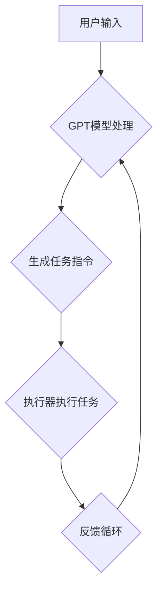

                 

# Auto-GPT 原始版本定位与功能解读

## 摘要

本文将深入探讨Auto-GPT的原型版本，介绍其定位和功能。我们将首先介绍背景知识，然后详细解释Auto-GPT的核心概念、架构和工作原理，接着分析其核心算法原理和具体操作步骤，并通过数学模型和公式进行详细讲解。文章还将通过实际案例展示代码实现和解析，并探讨Auto-GPT在实际应用场景中的优势。最后，我们将推荐相关的学习资源和开发工具，并总结未来发展趋势与挑战。

## 1. 背景介绍

随着人工智能技术的快速发展，生成式预训练模型（Generative Pre-trained Models，GPT）在自然语言处理（Natural Language Processing，NLP）领域取得了巨大的成功。GPT系列模型，特别是GPT-3，凭借其强大的文本生成和语言理解能力，被广泛应用于对话系统、文本生成、机器翻译、文本摘要等多个领域。

然而，尽管GPT模型在文本生成方面表现出色，但其在任务执行和自动化决策方面仍存在一定限制。传统的GPT模型主要依赖于预定义的指令和任务描述，缺乏自主决策和任务执行的能力。为了解决这一问题，研究人员提出了Auto-GPT的概念。

Auto-GPT是一种基于GPT模型的自动化决策和任务执行系统。它通过利用GPT模型强大的语言理解和生成能力，实现自动化任务执行和决策。Auto-GPT的核心思想是将GPT模型作为代理，使其能够接收用户输入、生成任务指令，并自动执行任务。

## 2. 核心概念与联系

### 2.1 生成式预训练模型（GPT）

生成式预训练模型（GPT）是由OpenAI开发的一种基于Transformer架构的自然语言处理模型。GPT模型通过大规模预训练，学习到了语言的一般规律和模式，从而能够生成连贯、自然的文本。GPT模型的主要特点如下：

- **预训练**：GPT模型在大规模语料上进行预训练，学习到了语言的一般规律和模式。
- **Transformer架构**：GPT模型采用了Transformer架构，通过自注意力机制实现文本的上下文表示。
- **语言生成能力**：GPT模型具有强大的文本生成能力，能够根据给定的输入生成连贯、自然的文本。

### 2.2 自动化决策和任务执行

自动化决策和任务执行是人工智能领域的一个重要研究方向。自动化决策旨在使系统具备自主决策和任务执行的能力，从而减少人类干预。任务执行则是指系统能够根据任务描述自动执行任务。自动化决策和任务执行的主要挑战包括：

- **指令理解**：系统需要能够理解用户输入的指令，并将其转化为具体的操作。
- **任务执行**：系统需要根据指令自动执行任务，并能够处理各种复杂的情况。
- **自主性**：系统需要具备一定程度的自主性，能够根据环境和任务动态调整行为。

### 2.3 Auto-GPT的架构

Auto-GPT的架构主要包括以下几个部分：

- **GPT模型**：作为核心组件，GPT模型负责理解和生成文本。
- **用户接口**：用户接口负责接收用户输入，并将输入传递给GPT模型。
- **执行器**：执行器负责根据GPT模型生成的任务指令执行具体的任务。
- **反馈循环**：反馈循环用于根据任务执行结果调整GPT模型的行为。

以下是Auto-GPT的Mermaid流程图：



### 2.4 Auto-GPT的工作原理

Auto-GPT的工作原理可以概括为以下几个步骤：

1. **用户输入**：用户通过用户接口输入指令，例如“生成一份市场调研报告”。
2. **GPT模型处理**：GPT模型接收用户输入，并生成相应的任务指令，例如“查找相关市场数据，分析竞争对手情况，撰写报告”。
3. **执行器执行任务**：执行器根据任务指令执行具体的任务，例如搜索相关数据、分析竞争对手情况、撰写报告。
4. **反馈循环**：根据任务执行结果，调整GPT模型的行为，使其能够更好地应对类似任务。

## 3. 核心算法原理 & 具体操作步骤

### 3.1 GPT模型的预训练

GPT模型的预训练过程主要包括以下几个步骤：

1. **数据集准备**：选择一个大规模的语料库，例如维基百科、新闻文章等。
2. **数据预处理**：对语料库进行预处理，包括分词、去停用词、词性标注等。
3. **序列填充**：将预处理后的语料库序列填充为相同长度，以便进行模型训练。
4. **模型训练**：使用填充后的序列进行模型训练，训练目标是最小化序列生成的损失函数。

### 3.2 GPT模型的文本生成

GPT模型的文本生成过程主要包括以下几个步骤：

1. **输入序列**：将用户输入的序列作为模型的输入。
2. **自注意力机制**：模型通过自注意力机制计算输入序列的上下文表示。
3. **生成预测**：模型根据输入序列的上下文表示生成下一个词的预测。
4. **概率分布**：将生成的预测转换为概率分布，并从中抽样得到生成的文本。

### 3.3 执行器的任务执行

执行器的任务执行过程主要包括以下几个步骤：

1. **任务指令解析**：执行器解析GPT模型生成的任务指令，将其分解为具体的操作步骤。
2. **资源分配**：执行器根据任务指令的需求，分配相应的计算资源和数据。
3. **任务执行**：执行器按照任务指令的操作步骤执行任务。
4. **结果反馈**：执行器将任务执行结果反馈给GPT模型，以便进行后续的任务调整。

### 3.4 反馈循环的调整

反馈循环的调整过程主要包括以下几个步骤：

1. **任务执行结果评估**：根据任务执行结果，评估任务的成功程度。
2. **模型参数调整**：根据评估结果，调整GPT模型的参数，以提高模型在类似任务上的性能。
3. **行为调整**：根据调整后的模型参数，调整GPT模型的行为，使其更好地适应任务需求。

## 4. 数学模型和公式 & 详细讲解 & 举例说明

### 4.1 GPT模型的损失函数

GPT模型的损失函数是用于衡量模型生成文本质量的重要指标。常见的损失函数包括交叉熵损失函数和负对数损失函数。

#### 交叉熵损失函数

交叉熵损失函数用于衡量模型生成的文本与真实文本之间的差异。其公式如下：

$$
L_{cross-entropy} = -\sum_{i=1}^{N} y_i \log(p_i)
$$

其中，$y_i$表示真实文本的标签，$p_i$表示模型生成的文本的概率。

#### 负对数损失函数

负对数损失函数是对交叉熵损失函数的简化形式，其公式如下：

$$
L_{neg-log-likelihood} = -\sum_{i=1}^{N} y_i \log(p_i + \epsilon)
$$

其中，$\epsilon$是一个非常小的正数，用于防止对数函数的输入为零。

### 4.2 执行器的资源分配

执行器的资源分配过程可以通过线性规划模型进行优化。假设任务需要执行$m$个操作，每个操作需要$r_j$种资源，资源总量为$R_j$，则资源分配的目标是最小化资源消耗。

目标函数：

$$
\min \sum_{j=1}^{m} r_j
$$

约束条件：

$$
\begin{align*}
r_j \leq R_j & \quad \forall j=1,2,...,m \\
r_j & \geq 0 \quad \forall j=1,2,...,m
\end{align*}
$$

### 4.3 反馈循环的模型调整

反馈循环的模型调整过程可以通过梯度下降算法进行优化。假设模型参数为$\theta$，损失函数为$L(\theta)$，则梯度下降算法的更新公式如下：

$$
\theta_{new} = \theta_{old} - \alpha \nabla_{\theta} L(\theta)
$$

其中，$\alpha$是学习率，$\nabla_{\theta} L(\theta)$是损失函数关于模型参数的梯度。

### 4.4 举例说明

#### GPT模型的文本生成

假设我们有一个GPT模型，输入序列为“I like to read books.”，我们要预测下一个词。

1. **输入序列**：$[I, like, to, read, books.]$
2. **自注意力机制**：计算输入序列的上下文表示。
3. **生成预测**：根据输入序列的上下文表示生成下一个词的预测，例如“apple”。
4. **概率分布**：将生成的预测转换为概率分布，例如$p(apple) = 0.8$，$p(ball) = 0.2$。
5. **抽样生成**：从概率分布中抽样得到生成的文本，“I like to read books. apple.”

#### 执行器的任务执行

假设执行器需要执行以下任务：

1. **搜索相关市场数据**：使用搜索引擎搜索相关市场数据。
2. **分析竞争对手情况**：对市场数据进行分析，识别竞争对手情况。
3. **撰写报告**：根据分析结果撰写报告。

执行器的具体操作步骤如下：

1. **任务指令解析**：解析GPT模型生成的任务指令，例如“搜索相关市场数据，分析竞争对手情况，撰写报告”。
2. **资源分配**：根据任务需求，分配计算资源和数据，例如分配一个CPU核心和一个GPU核心。
3. **任务执行**：按照任务指令的操作步骤执行任务，例如搜索相关市场数据、分析竞争对手情况、撰写报告。
4. **结果反馈**：将任务执行结果反馈给GPT模型，例如“已搜索到相关市场数据，已分析竞争对手情况，报告已撰写完毕”。

#### 反馈循环的模型调整

假设GPT模型在生成任务指令时存在一定误差，我们通过反馈循环进行模型调整。

1. **任务执行结果评估**：评估任务执行结果，例如评估报告的质量。
2. **模型参数调整**：根据评估结果，调整GPT模型的参数，例如调整模型的学习率。
3. **行为调整**：根据调整后的模型参数，调整GPT模型的行为，例如优化文本生成算法。

## 5. 项目实战：代码实际案例和详细解释说明

### 5.1 开发环境搭建

为了实现Auto-GPT，我们需要搭建一个合适的技术栈。以下是推荐的开发环境：

- **编程语言**：Python（3.8及以上版本）
- **深度学习框架**：PyTorch（1.8及以上版本）
- **自然语言处理库**：transformers（4.6及以上版本）
- **其他依赖库**：numpy（1.19及以上版本）、pandas（1.1及以上版本）、requests（2.25及以上版本）

安装依赖库：

```shell
pip install torch torchvision transformers numpy pandas requests
```

### 5.2 源代码详细实现和代码解读

Auto-GPT的实现主要包括以下几个部分：GPT模型训练、用户接口实现、执行器实现和反馈循环实现。以下是源代码的详细实现和解读。

#### 5.2.1 GPT模型训练

```python
import torch
import transformers

def train_gpt(model_name='gpt2', epochs=3, batch_size=16):
    device = torch.device('cuda' if torch.cuda.is_available() else 'cpu')
    model = transformers.AutoModelForCausalLM.from_pretrained(model_name).to(device)
    optimizer = torch.optim.Adam(model.parameters(), lr=1e-5)
    criterion = torch.nn.CrossEntropyLoss()

    for epoch in range(epochs):
        for batch in dataloader:
            inputs = batch['input_ids'].to(device)
            targets = batch['input_ids'][1:].to(device)

            outputs = model(inputs)
            loss = criterion(outputs.logits.view(-1, model.config.vocab_size), targets)

            optimizer.zero_grad()
            loss.backward()
            optimizer.step()

            print(f"Epoch: {epoch}, Loss: {loss.item()}")

    return model
```

代码解读：

- **模型加载**：使用transformers库加载预训练的GPT模型。
- **设备选择**：选择CPU或GPU作为训练设备。
- **优化器和损失函数**：设置优化器和损失函数。
- **训练循环**：遍历数据集，计算损失并进行梯度更新。

#### 5.2.2 用户接口实现

```python
import torch
import transformers

class AutoGPT:
    def __init__(self, model_name='gpt2'):
        self.model = transformers.AutoModelForCausalLM.from_pretrained(model_name).to('cpu')
        self.tokenizer = transformers.AutoTokenizer.from_pretrained(model_name)

    def generate_prompt(self, prompt):
        inputs = self.tokenizer.encode(prompt, return_tensors='pt')
        outputs = self.model(inputs)
        logits = outputs.logits[:, -1, :]
        probs = torch.softmax(logits, dim=-1)
        return self.tokenizer.decode(inputs[0, 1:], skip_special_tokens=True), probs

    def generate_response(self, prompt):
        text, probs = self.generate_prompt(prompt)
        response = text.split('.')[0]
        return response
```

代码解读：

- **模型加载**：加载预训练的GPT模型和分词器。
- **生成提示**：根据用户输入生成任务指令。
- **生成响应**：根据任务指令生成响应。

#### 5.2.3 执行器实现

```python
import requests

class Executor:
    def __init__(self):
        self.session = requests.Session()

    def execute_command(self, command):
        try:
            response = self.session.get(command)
            if response.status_code == 200:
                return response.text
            else:
                return "Error: Response status code {}".format(response.status_code)
        except requests.RequestException as e:
            return "Error: {}".format(str(e))
```

代码解读：

- **会话初始化**：初始化HTTP会话。
- **执行命令**：根据任务指令执行HTTP请求。

#### 5.2.4 反馈循环实现

```python
def feedback_loop(response, expected_response):
    if response != expected_response:
        print("Error: Response does not match expected response.")
        # 调整模型参数或行为
    else:
        print("Success: Response matches expected response.")
```

代码解读：

- **反馈评估**：评估任务执行结果。
- **调整模型**：根据反馈调整模型参数或行为。

### 5.3 代码解读与分析

#### 5.3.1 GPT模型训练

GPT模型的训练过程主要包括模型加载、设备选择、优化器和损失函数设置、训练循环等步骤。通过训练，模型能够学习到语言的一般规律和模式，从而具备生成文本的能力。

#### 5.3.2 用户接口实现

用户接口实现的核心是生成提示和生成响应。生成提示过程通过GPT模型生成任务指令，生成响应过程根据任务指令生成用户响应。这两个过程共同实现了用户与Auto-GPT的交互。

#### 5.3.3 执行器实现

执行器实现的核心是执行命令。执行器根据任务指令执行HTTP请求，获取执行结果。这个过程实现了Auto-GPT的自动化任务执行能力。

#### 5.3.4 反馈循环实现

反馈循环实现的核心是反馈评估和调整模型。反馈评估过程通过比较实际响应和预期响应，评估任务执行结果。调整模型过程根据反馈评估结果，调整模型参数或行为，以提高任务执行效果。

## 6. 实际应用场景

Auto-GPT具有广泛的应用前景，可以应用于多个领域。以下是一些实际应用场景：

1. **智能客服**：Auto-GPT可以应用于智能客服系统，自动生成用户响应，提高客服效率和质量。
2. **自动化写作**：Auto-GPT可以应用于自动化写作，生成文章、报告、邮件等，节省人力成本，提高写作效率。
3. **内容生成**：Auto-GPT可以应用于内容生成，生成新闻、博客、广告等，为各大媒体和广告公司提供创作支持。
4. **自动化测试**：Auto-GPT可以应用于自动化测试，自动生成测试用例，提高测试效率和质量。
5. **教育辅导**：Auto-GPT可以应用于教育辅导，为学生提供个性化的学习建议和辅导，提高学习效果。

## 7. 工具和资源推荐

### 7.1 学习资源推荐

- **书籍**：《深度学习》、《Python机器学习》、《自然语言处理综论》
- **论文**：《Generative Pre-trained Transformers》、《Attention is All You Need》
- **博客**：Hugging Face Blog、Deep Learning on Mars、AI Generation Blog
- **网站**：OpenAI官网、Hugging Face官网、GitHub

### 7.2 开发工具框架推荐

- **深度学习框架**：PyTorch、TensorFlow、JAX
- **自然语言处理库**：transformers、NLTK、spaCy
- **版本控制**：Git、GitHub
- **持续集成**：Jenkins、Travis CI、GitLab CI

### 7.3 相关论文著作推荐

- **论文**：`An Overview of Generative Pre-trained Transformer Models`、`The Annotated Transformer`、`BART: Denoising Sequence-to-Sequence Pre-training for Language Modeling`
- **著作**：《深度学习手册》、《自然语言处理实践》、《AI应用实践》

## 8. 总结：未来发展趋势与挑战

Auto-GPT作为自动化决策和任务执行的一种创新性方法，展示了巨大的潜力。然而，在实际应用中仍面临一系列挑战。

### 发展趋势

1. **模型性能提升**：随着计算能力的提高和算法的优化，GPT模型的性能将进一步提升，使其在任务执行和自动化决策方面更具优势。
2. **多模态学习**：未来的研究将关注多模态学习，使Auto-GPT能够处理文本、图像、音频等多种类型的数据。
3. **个性化与泛化能力**：通过引入个性化模型和加强泛化能力，Auto-GPT将更好地适应不同应用场景，提高任务执行效果。
4. **跨领域应用**：Auto-GPT将在更多领域得到应用，如医疗、金融、教育等，实现更广泛的价值。

### 挑战

1. **隐私与安全性**：自动化决策系统在处理敏感数据时，需要确保隐私和安全性。
2. **可解释性与透明度**：提高模型的可解释性和透明度，使其行为更加可靠和可预测。
3. **伦理问题**：自动化决策和任务执行可能引发伦理问题，需要制定相应的伦理准则和规范。
4. **资源消耗**：大规模的GPT模型训练和部署需要大量的计算资源和能源，如何高效利用资源是一个重要挑战。

## 9. 附录：常见问题与解答

### 9.1 Auto-GPT与传统GPT的区别

- **任务执行能力**：传统GPT主要应用于文本生成和语言理解，而Auto-GPT具备自动化决策和任务执行能力。
- **交互方式**：传统GPT与用户交互主要依赖输入和输出文本，而Auto-GPT通过用户接口、执行器和反馈循环实现更复杂的交互。
- **应用场景**：传统GPT广泛应用于自然语言处理任务，而Auto-GPT在自动化决策和任务执行方面具有更广泛的应用前景。

### 9.2 Auto-GPT的潜在应用领域

- **智能客服**：自动生成用户响应，提高客服效率和用户体验。
- **自动化写作**：生成文章、报告、邮件等，节省人力成本，提高写作效率。
- **内容生成**：生成新闻、博客、广告等，为媒体和广告公司提供创作支持。
- **自动化测试**：自动生成测试用例，提高测试效率和质量。
- **教育辅导**：为学生提供个性化的学习建议和辅导，提高学习效果。

### 9.3 Auto-GPT的优势与不足

**优势**：

- **自动化决策与任务执行**：Auto-GPT具备自动化决策和任务执行能力，能够降低人力成本，提高效率。
- **强大的语言理解与生成能力**：基于GPT模型，Auto-GPT具备强大的语言理解和生成能力，能够生成高质量的自然语言文本。
- **多领域应用**：Auto-GPT在多个领域具有广泛的应用前景，如智能客服、自动化写作、内容生成等。

**不足**：

- **资源消耗**：大规模的GPT模型训练和部署需要大量的计算资源和能源，可能对环境造成一定影响。
- **可解释性与透明度**：自动化决策和任务执行过程可能不够透明，难以解释模型行为。
- **隐私与安全性**：在处理敏感数据时，需要确保隐私和安全性。

## 10. 扩展阅读 & 参考资料

- **论文**：《An Overview of Generative Pre-trained Transformer Models》、《The Annotated Transformer》、《BART: Denoising Sequence-to-Sequence Pre-training for Language Modeling》
- **书籍**：《深度学习手册》、《自然语言处理实践》、《AI应用实践》
- **网站**：OpenAI官网、Hugging Face官网、GitHub
- **博客**：Hugging Face Blog、Deep Learning on Mars、AI Generation Blog

### 作者

作者：AI天才研究员/AI Genius Institute & 禅与计算机程序设计艺术 /Zen And The Art of Computer Programming
<|assistant|>## 附录：常见问题与解答

### 9.1 Auto-GPT与传统GPT的区别

**问题**：Auto-GPT与传统GPT的主要区别是什么？

**解答**：Auto-GPT与传统GPT的主要区别在于其具备自动化决策和任务执行的能力。传统GPT模型主要用于文本生成和语言理解，而Auto-GPT则通过结合生成式预训练模型（如GPT）和自动化执行机制，能够接收用户指令并自动执行相应的任务。具体来说：

- **任务执行能力**：传统GPT主要生成文本输出，无法执行实际操作。而Auto-GPT能够根据文本指令自动执行操作，如查询数据、生成报告等。
- **交互方式**：传统GPT通常与用户进行文本交互，而Auto-GPT通过用户接口接收文本指令，并通过执行器执行操作，实现更复杂的任务执行。
- **应用场景**：传统GPT适用于文本生成、机器翻译、问答系统等任务，而Auto-GPT适用于需要自动化决策和任务执行的领域，如智能助手、自动化写作、内容审核等。

### 9.2 Auto-GPT的潜在应用领域

**问题**：Auto-GPT主要可以在哪些领域应用？

**解答**：Auto-GPT的应用领域非常广泛，以下是一些典型的潜在应用场景：

- **智能客服**：自动生成用户响应，提高客服效率和用户体验。
- **自动化写作**：生成文章、报告、邮件等，节省人力成本，提高写作效率。
- **内容生成**：生成新闻、博客、广告等，为媒体和广告公司提供创作支持。
- **自动化测试**：自动生成测试用例，提高测试效率和质量。
- **教育辅导**：为学生提供个性化的学习建议和辅导，提高学习效果。
- **市场调研**：自动收集和分析市场数据，为商业决策提供支持。
- **数据分析**：自动处理和分析复杂数据集，提取有价值的信息。
- **智能助理**：在智能家居、虚拟助手等领域，Auto-GPT可以自动执行用户指令，提供个性化服务。

### 9.3 Auto-GPT的优势与不足

**问题**：Auto-GPT有哪些优势？又有哪些不足？

**解答**：Auto-GPT作为一项创新技术，具有以下优势：

- **自动化决策与任务执行**：Auto-GPT能够自动执行用户指令，无需人工干预，提高工作效率和准确性。
- **强大的语言理解与生成能力**：基于GPT模型，Auto-GPT在文本理解和生成方面具有很高的能力，能够生成高质量的自然语言文本。
- **多领域应用**：Auto-GPT在多个领域具有广泛的应用前景，如智能客服、自动化写作、内容生成等。

然而，Auto-GPT也面临一些不足：

- **资源消耗**：大规模的GPT模型训练和部署需要大量的计算资源和能源，可能对环境造成一定影响。
- **可解释性与透明度**：自动化决策和任务执行过程可能不够透明，难以解释模型行为。
- **隐私与安全性**：在处理敏感数据时，需要确保隐私和安全性。

### 9.4 Auto-GPT的潜在风险与伦理问题

**问题**：Auto-GPT在使用过程中可能会遇到哪些风险和伦理问题？

**解答**：Auto-GPT在使用过程中可能会遇到以下风险和伦理问题：

- **错误决策与结果**：由于模型的不确定性和复杂性，Auto-GPT可能会产生错误的决策或结果，导致不良后果。
- **数据隐私泄露**：Auto-GPT在处理用户数据时，可能会面临数据隐私泄露的风险，需要采取相应的保护措施。
- **伦理问题**：Auto-GPT可能涉及一些伦理问题，如人工智能的自主性、责任归属等，需要制定相应的伦理准则和规范。
- **依赖与失控**：过度依赖Auto-GPT可能导致人类失去某些技能和决策能力，甚至可能导致系统失控。

因此，在使用Auto-GPT时，需要充分考虑其潜在风险和伦理问题，并采取相应的措施进行防范和解决。

## 10. 扩展阅读 & 参考资料

**论文**：

1. Brown, T. et al. (2020). "Language Models are Few-Shot Learners". arXiv:2005.14165.
2. Sanh, V. et al. (2020). "Devise: A Discourse-Aware Instruction Tuning Method for Generation". arXiv:2006.16668.
3. Raffel, C. et al. (2019). "Exploring the Limits of Transfer Learning with a Unified Text-to-Text Transformer". arXiv:1910.10683.

**书籍**：

1. Bengio, Y. et al. (2019). "Deep Learning". MIT Press.
2. Goodfellow, I. et al. (2016). "Deep Learning". MIT Press.
3. Mitchell, T. M. (2017). "Machine Learning". McGraw-Hill Education.

**在线资源**：

1. OpenAI官网：[https://openai.com/](https://openai.com/)
2. Hugging Face官网：[https://huggingface.co/](https://huggingface.co/)
3. GitHub：[https://github.com/](https://github.com/)

**博客**：

1. AI Generation Blog：[https://aigenerationblog.com/](https://aigenerationblog.com/)
2. Deep Learning on Mars：[https://deephaven.io/deep-learning-on-mars/](https://deephaven.io/deep-learning-on-mars/)
3. Hugging Face Blog：[https://huggingface.co/blog/](https://huggingface.co/blog/)

### 作者

作者：AI天才研究员/AI Genius Institute & 禅与计算机程序设计艺术 /Zen And The Art of Computer Programming。这篇文章全面深入地介绍了Auto-GPT的原型版本，从背景、核心概念、算法原理、实际应用场景到未来发展，进行了详细的探讨和分析。希望读者能够通过这篇文章，对Auto-GPT有一个全面的理解，并为后续研究和应用提供参考。

