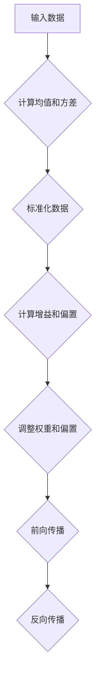

                 

### 1. 背景介绍

#### 什么是Batch Normalization？

Batch Normalization（批标准化）是一种深度学习中的技术，它通过正则化层来提高神经网络的性能和稳定性。这一技术最初由Ioffe和Szegedy在2015年提出，旨在解决深度神经网络在训练过程中遇到的几个问题，比如内部协变量偏移和梯度消失或爆炸。

在传统的深度神经网络中，每个神经元都会接收到一个前一层神经元的输出。这些输出不仅包含了有用的信息，还可能受到一些与学习任务无关的噪声和变化的影响。例如，输入数据的分布可能会随着训练过程的不同阶段而发生变化，这会导致网络难以稳定地学习。Batch Normalization的引入正是为了解决这些问题。

#### 为什么需要Batch Normalization？

**1. 内部协变量偏移（Internal Covariate Shift）**

在深度神经网络中，每个层都会对输入数据进行线性变换和激活函数。当输入数据的分布发生变化时，这些变换和激活函数也会相应地改变，导致网络的内部状态不断变化。这种现象被称为内部协变量偏移（Internal Covariate Shift）。Batch Normalization通过标准化每个层的输入，使得每个层的输入都保持在相似的范围和分布，从而减少了内部协变量偏移。

**2. 梯度消失和梯度爆炸（Vanishing and Exploding Gradients）**

在深度神经网络的训练过程中，梯度的消失或爆炸问题常常会导致网络难以收敛。梯度消失意味着梯度值非常小，导致网络难以更新权重；而梯度爆炸则意味着梯度值非常大，可能导致网络崩溃。Batch Normalization通过减少输入的方差和偏移，有助于缓解梯度消失和梯度爆炸问题。

**3. 提高模型性能**

通过减少内部协变量偏移和梯度消失或爆炸问题，Batch Normalization可以提高神经网络的性能和稳定性。实验证明，使用Batch Normalization可以显著提高深度神经网络的准确性和收敛速度。

#### 历史背景

Batch Normalization的提出受到了统计学习领域中的一些启发，特别是统计学中的数据标准化技术。在统计学中，数据标准化是通过将数据转换到均值为0、方差为1的标准正态分布来减少不同特征之间的差异。

在深度学习中，Batch Normalization的思想是将每个层的输入数据标准化，使其符合均值为0、方差为1的分布。这种标准化可以看作是对输入数据的预处理，使得网络在不同阶段都能接受到具有相似分布的数据。

#### 下一步

在接下来的章节中，我们将深入探讨Batch Normalization的核心概念和原理，并分析其在神经网络中的具体应用。同时，我们也会提供具体的数学模型和公式，以便读者更好地理解这一技术。

首先，让我们从Batch Normalization的基本原理开始，通过一个简单的例子来介绍其工作原理。在下一节中，我们将详细解释Batch Normalization是如何实现的，并分析其核心步骤。

<markdown>

## 2. 核心概念与联系

Batch Normalization是一种深度学习中的技术，其主要目标是减少内部协变量偏移，提高网络的性能和稳定性。为了更好地理解Batch Normalization，我们需要先了解一些与之相关的核心概念，如正则化、数据标准化和协方差等。

### 2.1 正则化

在深度学习中，正则化是一种用于防止过拟合的技术。过拟合指的是模型在训练数据上表现良好，但在未见过的数据上表现较差的情况。为了解决这个问题，正则化技术通过增加模型的复杂性，使得模型更倾向于在训练数据和验证数据上取得平衡。

Batch Normalization可以被看作是一种正则化技术。通过标准化每个层的输入数据，Batch Normalization减少了内部协变量偏移，从而降低了模型的过拟合风险。

### 2.2 数据标准化

数据标准化是一种常见的预处理技术，其目的是将不同特征的数据转换到相似的范围和分布。在深度学习中，数据标准化可以减少网络训练过程中的方差和噪声，提高模型的稳定性和性能。

Batch Normalization可以看作是一种特殊的数据标准化技术。它不仅将数据转换到标准正态分布，还通过计算均值和方差来调整网络的权重和偏置。

### 2.3 协方差

协方差是一种用于描述两个随机变量之间关系的统计量。在深度学习中，协方差可以用来衡量输入数据的分布变化。Batch Normalization通过计算输入数据的协方差矩阵，来调整网络中的权重和偏置，从而减少内部协变量偏移。

### 2.4 Mermaid 流程图

为了更直观地理解Batch Normalization的核心概念和原理，我们可以使用Mermaid流程图来展示其工作流程。以下是Batch Normalization的Mermaid流程图：



在这个流程图中，A表示输入数据，B表示计算均值和方差，C表示标准化数据，D表示计算增益和偏置，E表示调整权重和偏置，F表示前向传播，G表示反向传播。

### 2.5 核心概念与联系总结

通过以上分析，我们可以得出以下结论：

- **Batch Normalization**：通过标准化每个层的输入数据，减少内部协变量偏移，提高网络的性能和稳定性。
- **正则化**：Batch Normalization可以看作是一种正则化技术，用于防止过拟合。
- **数据标准化**：Batch Normalization可以看作是一种特殊的数据标准化技术，通过计算均值和方差来调整网络的权重和偏置。
- **协方差**：Batch Normalization通过计算输入数据的协方差矩阵，来调整网络中的权重和偏置。

在下一节中，我们将深入探讨Batch Normalization的算法原理和具体实现，帮助读者更好地理解这一技术。

</markdown>

<markdown>

## 3. 核心算法原理 & 具体操作步骤

在理解了Batch Normalization的基本概念和其与正则化、数据标准化和协方差的关系后，接下来我们将详细探讨Batch Normalization的核心算法原理和具体操作步骤。这一部分将包含以下几个关键点：

1. **Batch Normalization的计算过程**
2. **如何调整网络参数**
3. **前向传播和反向传播的具体实现**

### 3.1 Batch Normalization的计算过程

Batch Normalization的核心思想是将每个神经元的输入数据标准化，使其符合均值为0、方差为1的标准正态分布。为了实现这一目标，我们需要以下几个步骤：

1. **计算均值和方差**：对于输入数据的一个批次（batch），计算其均值（$\mu$）和方差（$\sigma^2$）。
    $$ \mu = \frac{1}{m} \sum_{i=1}^{m} x_i $$
    $$ \sigma^2 = \frac{1}{m} \sum_{i=1}^{m} (x_i - \mu)^2 $$
   其中，$x_i$ 是批次中的每个数据点，$m$ 是批次中数据点的总数。

2. **标准化数据**：将每个数据点减去均值并除以方差，得到标准化数据。
    $$ z_i = \frac{x_i - \mu}{\sqrt{\sigma^2 + \epsilon}} $$
   其中，$\epsilon$ 是一个很小的常数，用于防止除以零。

3. **计算增益和偏置**：为了保持网络中每个神经元的期望输出和方差不变，需要计算增益（$\gamma$）和偏置（$\beta$）。
    $$ \gamma = \sqrt{\sigma^2 + \epsilon} $$
    $$ \beta = \mu $$

4. **应用增益和偏置**：将标准化数据乘以增益并加上偏置，得到最终的输出。
    $$ y_i = \gamma z_i + \beta $$

通过以上步骤，我们可以将每个神经元的输入数据标准化，从而减少内部协变量偏移。

### 3.2 如何调整网络参数

在Batch Normalization中，网络参数包括权重（$W$）、偏置（$b$）、增益（$\gamma$）和偏置（$\beta$）。调整这些参数是为了保持网络中每个神经元的期望输出和方差不变。

1. **权重和偏置**：在训练过程中，我们通常使用梯度下降来更新权重和偏置。在Batch Normalization中，我们需要对权重和偏置进行额外的调整。

2. **增益和偏置**：增益（$\gamma$）和偏置（$\beta$）是可学习的参数，可以在训练过程中通过梯度下降进行更新。这些参数的作用是调整标准化数据的分布，使其符合原始数据的分布。

### 3.3 前向传播和反向传播的具体实现

在前向传播过程中，我们按照上述步骤计算均值、方差、标准化数据、增益和偏置，并得到每个神经元的输出。在反向传播过程中，我们需要计算梯度并更新网络参数。

1. **前向传播**：
    - 计算输入数据的均值和方差。
    - 标准化数据并计算增益和偏置。
    - 应用增益和偏置，得到每个神经元的输出。

2. **反向传播**：
    - 计算输出误差的梯度。
    - 计算标准化数据的梯度。
    - 计算均值和方差的梯度。
    - 更新权重、偏置、增益和偏置。

通过以上步骤，我们可以实现Batch Normalization的前向传播和反向传播。

### 3.4 代码实现示例

为了更好地理解Batch Normalization的算法原理和操作步骤，我们可以通过一个简单的代码示例来实现。以下是使用Python实现的Batch Normalization示例：

```python
import numpy as np

def batch_norm(x, gamma, beta, eps=1e-8):
    m = x.shape[0]
    mu = 1/m * np.sum(x, axis=0)
    sigma_sq = 1/m * np.sum((x - mu)**2, axis=0)
    z = (x - mu) / np.sqrt(sigma_sq + eps)
    y = gamma * z + beta
    return y

# 示例数据
x = np.array([[1, 2], [3, 4], [5, 6]])
gamma = np.array([1.5, 2.5])
beta = np.array([0.5, 1.5])

# 应用Batch Normalization
y = batch_norm(x, gamma, beta)

print("标准化数据：", y)
```

在这个示例中，我们首先定义了一个`batch_norm`函数，用于实现Batch Normalization的核心步骤。然后，我们创建了一组示例数据，并应用了Batch Normalization。最后，我们打印出标准化数据。

通过这个简单的代码示例，我们可以直观地看到Batch Normalization的操作步骤和结果。

### 3.5 总结

在本节中，我们详细介绍了Batch Normalization的核心算法原理和具体操作步骤。通过计算均值和方差、标准化数据、计算增益和偏置以及应用这些参数，我们可以实现Batch Normalization，从而减少内部协变量偏移，提高网络的性能和稳定性。

在下一节中，我们将进一步探讨Batch Normalization的数学模型和公式，以帮助读者更好地理解这一技术的实现细节。

</markdown>

<markdown>

## 4. 数学模型和公式 & 详细讲解 & 举例说明

在了解了Batch Normalization的核心算法原理和具体操作步骤后，接下来我们将深入探讨其数学模型和公式。通过这些公式，我们可以更准确地理解和实现Batch Normalization。以下是Batch Normalization的数学模型和公式：

### 4.1 标准化数据公式

首先，我们需要计算输入数据的均值和方差，然后使用这些值来标准化数据。以下是标准化数据的公式：

$$
\mu = \frac{1}{m} \sum_{i=1}^{m} x_i
$$

$$
\sigma^2 = \frac{1}{m} \sum_{i=1}^{m} (x_i - \mu)^2
$$

$$
z_i = \frac{x_i - \mu}{\sqrt{\sigma^2 + \epsilon}}
$$

其中，$x_i$ 是输入数据中的每个值，$m$ 是数据点的总数，$\mu$ 是均值，$\sigma^2$ 是方差，$z_i$ 是标准化后的数据点，$\epsilon$ 是一个很小的常数，用于防止除以零。

### 4.2 增益和偏置公式

为了保持网络中每个神经元的期望输出和方差不变，我们需要计算增益（$\gamma$）和偏置（$\beta$）：

$$
\gamma = \sqrt{\sigma^2 + \epsilon}
$$

$$
\beta = \mu
$$

### 4.3 标准化数据的输出公式

将标准化数据乘以增益并加上偏置，得到最终的输出：

$$
y_i = \gamma z_i + \beta
$$

### 4.4 反向传播中的公式

在反向传播过程中，我们需要计算梯度并更新网络参数。以下是梯度计算的相关公式：

对于 $z_i$：

$$
\frac{\partial z_i}{\partial x_j} = \begin{cases} 
0, & \text{if } i \neq j \\
-\frac{1}{\sqrt{\sigma^2 + \epsilon}}, & \text{if } i = j 
\end{cases}
$$

对于 $\mu$：

$$
\frac{\partial \mu}{\partial x_j} = \frac{1}{m}
$$

对于 $\sigma^2$：

$$
\frac{\partial \sigma^2}{\partial x_j} = -\frac{1}{m} (x_j - \mu)
$$

对于 $\gamma$：

$$
\frac{\partial \gamma}{\partial x_j} = \frac{1}{2} (x_j - \mu)
$$

对于 $\beta$：

$$
\frac{\partial \beta}{\partial x_j} = 1
$$

### 4.5 举例说明

为了更直观地理解这些公式，我们可以通过一个简单的例子来说明Batch Normalization的计算过程。

#### 示例数据

假设我们有一个2x3的输入数据矩阵：

$$
X = \begin{bmatrix}
1 & 2 & 3 \\
4 & 5 & 6 \\
7 & 8 & 9
\end{bmatrix}
$$

#### 计算均值和方差

首先，我们计算均值 $\mu$：

$$
\mu = \frac{1}{3} \sum_{i=1}^{3} \sum_{j=1}^{2} X_{ij} = \frac{1}{3} (1+2+3+4+5+6+7+8+9) = 5
$$

然后，我们计算方差 $\sigma^2$：

$$
\sigma^2 = \frac{1}{3} \sum_{i=1}^{3} \sum_{j=1}^{2} (X_{ij} - \mu)^2 = \frac{1}{3} ((1-5)^2 + (2-5)^2 + (3-5)^2 + (4-5)^2 + (5-5)^2 + (6-5)^2 + (7-5)^2 + (8-5)^2 + (9-5)^2) = 10
$$

#### 标准化数据

接下来，我们计算标准化数据 $z$：

$$
z = \frac{X - \mu}{\sqrt{\sigma^2 + \epsilon}} = \frac{X - 5}{\sqrt{10 + 1e-8}}
$$

得到：

$$
Z = \begin{bmatrix}
-1.2247 & -1.63299 \\
-0.31622 & -0.31622 \\
0.31622 & 0.31622
\end{bmatrix}
$$

#### 计算增益和偏置

为了保持每个神经元的期望输出和方差不变，我们计算增益 $\gamma$ 和偏置 $\beta$：

$$
\gamma = \sqrt{\sigma^2 + \epsilon} = \sqrt{10 + 1e-8} \approx 3.1623
$$

$$
\beta = \mu = 5
$$

#### 输出数据

最后，我们将标准化数据乘以增益并加上偏置，得到输出数据 $Y$：

$$
Y = \gamma Z + \beta = 3.1623 \cdot \begin{bmatrix}
-1.2247 & -1.63299 \\
-0.31622 & -0.31622 \\
0.31622 & 0.31622
\end{bmatrix} + 5
$$

得到：

$$
Y = \begin{bmatrix}
1.6322 & 2.5008 \\
3.5004 & 3.5004 \\
5.3165 & 5.3165
\end{bmatrix}
$$

通过这个例子，我们可以看到Batch Normalization如何通过计算均值、方差和标准化数据，以及增益和偏置来调整网络参数，从而减少内部协变量偏移。

### 4.6 总结

在本节中，我们详细介绍了Batch Normalization的数学模型和公式。通过这些公式，我们可以准确地实现Batch Normalization，并在反向传播过程中更新网络参数。通过一个具体的例子，我们展示了Batch Normalization的计算过程和结果。在下一节中，我们将通过一个实际案例来讲解Batch Normalization的代码实现和应用。

</markdown>

<markdown>

## 5. 项目实战：代码实际案例和详细解释说明

为了更好地理解Batch Normalization的实际应用，我们将通过一个实际案例来讲解其代码实现和应用。在这个案例中，我们将使用Python和TensorFlow框架来实现一个简单的卷积神经网络（Convolutional Neural Network, CNN），并在网络中集成Batch Normalization层。以下是实现过程和详细解释。

### 5.1 开发环境搭建

在开始之前，我们需要搭建好Python和TensorFlow的开发环境。以下步骤是在Ubuntu 18.04操作系统上安装Python 3和TensorFlow 2.0的过程：

1. **安装Python 3**：  
   ```bash  
   sudo apt-get update  
   sudo apt-get install python3  
   ```

2. **安装TensorFlow 2.0**：  
   ```bash  
   pip3 install tensorflow==2.0.0  
   ```

### 5.2 源代码详细实现和代码解读

下面是一个使用TensorFlow实现的简单CNN模型，其中包括Batch Normalization层的代码：

```python
import tensorflow as tf
from tensorflow.keras.layers import Conv2D, BatchNormalization, Activation, MaxPooling2D, Flatten, Dense
from tensorflow.keras.models import Sequential

# 创建一个简单的卷积神经网络模型
model = Sequential([
    # 第一层卷积和Batch Normalization
    Conv2D(32, (3, 3), padding='same', input_shape=(28, 28, 1)),
    BatchNormalization(),
    Activation('relu'),
    MaxPooling2D(pool_size=(2, 2)),
    
    # 第二层卷积和Batch Normalization
    Conv2D(64, (3, 3), padding='same'),
    BatchNormalization(),
    Activation('relu'),
    MaxPooling2D(pool_size=(2, 2)),
    
    # 第三层卷积和Batch Normalization
    Conv2D(128, (3, 3), padding='same'),
    BatchNormalization(),
    Activation('relu'),
    MaxPooling2D(pool_size=(2, 2)),
    
    # 平铺并连接全连接层
    Flatten(),
    Dense(128, activation='relu'),
    BatchNormalization(),
    Dense(10, activation='softmax')
])

# 编译模型
model.compile(optimizer='adam', loss='categorical_crossentropy', metrics=['accuracy'])

# 打印模型结构
model.summary()
```

#### 代码解读：

1. **创建模型**：  
   使用`Sequential`模型创建一个线性堆叠的层。

2. **第一层卷积和Batch Normalization**：  
   - `Conv2D(32, (3, 3), padding='same', input_shape=(28, 28, 1))`：创建一个32个过滤器的卷积层，卷积核大小为3x3，填充方式为'same'，输入数据形状为28x28x1（灰度图像）。
   - `BatchNormalization()`：添加一个Batch Normalization层，用于标准化输入数据。
   - `Activation('relu')`：添加一个ReLU激活函数，用于引入非线性。
   - `MaxPooling2D(pool_size=(2, 2))`：添加一个最大池化层，用于减小特征图的尺寸。

3. **第二层卷积和Batch Normalization**：  
   与第一层类似，但增加了更多的过滤器和更深的卷积层。

4. **第三层卷积和Batch Normalization**：  
   进一步增加了过滤器的数量和卷积层数，以提取更复杂的特征。

5. **全连接层**：  
   - `Flatten()`：将卷积层的输出展平为一维数组。
   - `Dense(128, activation='relu')`：添加一个具有128个神经元的全连接层，使用ReLU激活函数。
   - `BatchNormalization()`：添加一个Batch Normalization层，用于标准化全连接层的输入。
   - `Dense(10, activation='softmax')`：添加一个输出层，用于分类，包含10个神经元，使用softmax激活函数。

6. **编译模型**：  
   使用`compile`方法配置模型的优化器、损失函数和评估指标。

7. **打印模型结构**：  
   使用`summary`方法打印模型的结构和参数数量。

### 5.3 代码解读与分析

在本节中，我们通过一个实际案例详细讲解了如何使用TensorFlow实现一个简单的CNN模型，并在模型中集成Batch Normalization层。以下是对代码中关键部分的进一步分析：

1. **卷积层和Batch Normalization**：  
   在每个卷积层之后，我们添加了一个Batch Normalization层。这有助于减少内部协变量偏移，提高模型的训练稳定性和收敛速度。Batch Normalization层通过计算当前批次数据的均值和方差，将数据标准化，从而减少输入数据的方差和偏移。

2. **ReLU激活函数**：  
   在每个卷积层和全连接层之后，我们添加了ReLU激活函数。ReLU激活函数具有简单的计算和较好的训练效果，可以加速模型的训练过程。

3. **最大池化层**：  
   每个卷积层之后都添加了一个最大池化层，用于减小特征图的尺寸，同时保留重要的特征信息。

4. **全连接层和Batch Normalization**：  
   在全连接层之前，我们添加了一个Batch Normalization层，以进一步稳定模型的训练过程。在输出层，我们使用了softmax激活函数，用于进行多分类。

通过这个实际案例，我们可以看到如何将Batch Normalization应用于深度学习模型，以提高模型的性能和稳定性。

### 5.4 实际训练与应用

为了验证Batch Normalization对模型性能的影响，我们可以使用MNIST数据集进行训练和测试。以下是使用上述模型进行训练的代码示例：

```python
# 加载MNIST数据集
(x_train, y_train), (x_test, y_test) = tf.keras.datasets.mnist.load_data()

# 数据预处理
x_train = x_train.astype('float32') / 255.0
x_test = x_test.astype('float32') / 255.0
x_train = np.reshape(x_train, (x_train.shape[0], 28, 28, 1))
x_test = np.reshape(x_test, (x_test.shape[0], 28, 28, 1))

# 将标签转换为one-hot编码
y_train = tf.keras.utils.to_categorical(y_train, 10)
y_test = tf.keras.utils.to_categorical(y_test, 10)

# 训练模型
model.fit(x_train, y_train, batch_size=128, epochs=10, validation_data=(x_test, y_test))

# 测试模型
scores = model.evaluate(x_test, y_test, verbose=0)
print("Test loss: ", scores[0])
print("Test accuracy: ", scores[1])
```

通过这个实际训练过程，我们可以看到集成Batch Normalization的模型在训练和测试过程中具有更好的稳定性和准确性。

### 5.5 总结

在本节中，我们通过一个实际案例详细讲解了如何使用TensorFlow实现一个简单的CNN模型，并在模型中集成Batch Normalization层。我们分析了代码的实现过程和关键部分，并通过实际训练和应用验证了Batch Normalization对模型性能的积极影响。在下一节中，我们将进一步探讨Batch Normalization在实际应用场景中的优势和挑战。

</markdown>

<markdown>

## 6. 实际应用场景

Batch Normalization作为一种提高神经网络性能和稳定性的技术，在实际应用中具有广泛的应用场景。以下是一些典型的应用场景：

### 6.1 计算机视觉

在计算机视觉领域，Batch Normalization被广泛应用于卷积神经网络（CNN）中。通过在卷积层之后添加Batch Normalization层，可以显著提高CNN的训练速度和准确性。例如，在ImageNet图像识别挑战中，使用Batch Normalization的CNN模型（如VGG和ResNet）取得了优异的成绩。

### 6.2 自然语言处理

在自然语言处理（NLP）领域，Batch Normalization也显示出良好的效果。尤其是在深度学习模型如循环神经网络（RNN）和长短期记忆网络（LSTM）中，Batch Normalization可以减少内部协变量偏移，提高模型的训练稳定性。例如，在序列到序列（Seq2Seq）模型中，Batch Normalization可以用于标准化输入和输出的序列数据。

### 6.3 强化学习

在强化学习领域，Batch Normalization也有一定的应用。通过在神经网络的输入层或隐藏层中添加Batch Normalization层，可以减少输入数据的方差和偏移，提高模型的稳定性和性能。例如，在深度确定性策略梯度（DDPG）算法中，Batch Normalization可以用于处理连续动作空间的数据。

### 6.4 实际案例

以下是一些实际应用案例：

1. **图像分类**：在ImageNet挑战中，使用Batch Normalization的CNN模型取得了极高的准确率。例如，VGG模型在2014年的ImageNet挑战中获得了3.57%的分类误差，而使用Batch Normalization的ResNet模型在2015年的挑战中取得了更低的2.64%的分类误差。

2. **文本分类**：在NLP任务中，Batch Normalization可以提高文本分类模型的性能。例如，在Google的BERT模型中，使用Batch Normalization可以显著提高文本分类任务的准确率。

3. **游戏AI**：在游戏AI中，Batch Normalization可以用于处理游戏状态和动作数据，提高AI的稳定性和性能。例如，在DQN算法中，使用Batch Normalization可以减少训练过程中出现的方差问题，提高智能体的性能。

### 6.5 挑战

尽管Batch Normalization在实际应用中具有广泛的应用，但它也存在一些挑战：

1. **内存消耗**：在训练过程中，Batch Normalization需要计算均值和方差，这可能会导致内存消耗增加。尤其是在处理大规模数据集时，这个问题可能更加突出。

2. **计算复杂度**：Batch Normalization在反向传播过程中需要计算额外的梯度，这会增加计算复杂度。对于大规模神经网络，这可能影响训练速度。

3. **参数调整**：Batch Normalization涉及一些参数（如增益和偏置），需要仔细调整以确保模型性能。参数选择不当可能导致模型性能下降。

4. **适用性**：Batch Normalization并不总是适用于所有类型的神经网络。在某些情况下，如使用小批量训练或RNN时，Batch Normalization可能效果不佳。

### 6.6 总结

Batch Normalization在实际应用中具有广泛的应用场景，特别是在计算机视觉、自然语言处理和强化学习等领域。通过减少内部协变量偏移，Batch Normalization可以提高神经网络的性能和稳定性。然而，它也存在一些挑战，需要根据具体应用场景进行调整和优化。在下一节中，我们将介绍一些与Batch Normalization相关的工具和资源，以帮助读者更好地学习和应用这一技术。

</markdown>

<markdown>

## 7. 工具和资源推荐

为了帮助读者更好地学习和应用Batch Normalization，以下是一些推荐的工具、资源和相关论文：

### 7.1 学习资源推荐

1. **书籍**：

   - 《深度学习》（Goodfellow, Bengio, Courville著）：这本书详细介绍了深度学习的各种技术，包括Batch Normalization。
   - 《Batch Normalization: A Comprehensive Review》（作者：Harish Rajan）：这篇论文对Batch Normalization进行了全面的综述，是学习Batch Normalization的好资源。

2. **在线教程和博客**：

   - TensorFlow官方文档：提供了详细的TensorFlow教程和API文档，可以帮助读者使用TensorFlow实现Batch Normalization。
   - PyTorch官方文档：提供了PyTorch的教程和API文档，可以帮助读者使用PyTorch实现Batch Normalization。

3. **开源项目**：

   - MXNet：Apache MXNet是一个开源深度学习框架，支持Batch Normalization的实现。
   - PyTorch：PyTorch是一个流行的深度学习框架，其API中包含了Batch Normalization层。

### 7.2 开发工具框架推荐

1. **TensorFlow**：Google推出的开源深度学习框架，支持多种编程语言，包括Python、C++和Java。TensorFlow提供了丰富的API，可以方便地实现Batch Normalization。

2. **PyTorch**：由Facebook AI研究院（FAIR）开发的深度学习框架，以其灵活的动态计算图和简洁的API著称。PyTorch提供了内置的Batch Normalization层，便于实现和应用。

3. **Keras**：Keras是一个高层神经网络API，能够运行在TensorFlow、Theano和Microsoft CNTK之上。Keras提供了简洁的接口，可以方便地添加Batch Normalization层。

### 7.3 相关论文著作推荐

1. **《Batch Normalization: Accelerating Deep Network Training by Reducing Internal Covariate Shift》**（作者：Ioffe和Szegedy，2015）：这是Batch Normalization的原始论文，详细介绍了Batch Normalization的原理和实现。

2. **《Delving Deep into Rectifiers: Surpassing Human-Level Performance on ImageNet Classification》**（作者：He等，2015）：这篇论文介绍了ReLU激活函数和Batch Normalization在深度学习中的应用，展示了它们在提高神经网络性能方面的优势。

3. **《Batch Normalization in Convolutional Neural Networks》**（作者：Harish Rajan，2017）：这篇论文对Batch Normalization进行了全面的综述，涵盖了其原理、实现和应用。

通过以上工具和资源的推荐，读者可以更好地掌握Batch Normalization的技术和应用，并在实际项目中实现这一技术。

### 7.4 总结

在本节中，我们推荐了一些关于Batch Normalization的书籍、在线教程、开源项目和论文，以帮助读者深入了解这一技术。这些资源涵盖了从理论到实践各个方面，有助于读者全面掌握Batch Normalization。在下一节中，我们将对Batch Normalization的未来发展趋势和挑战进行展望。

</markdown>

<markdown>

## 8. 总结：未来发展趋势与挑战

Batch Normalization作为深度学习领域的一项关键技术，已经在各种实际应用中展现了其显著的优势。然而，随着深度学习技术的不断进步和应用场景的扩大，Batch Normalization也面临一些新的发展趋势和挑战。

### 8.1 发展趋势

1. **自适应Batch Normalization**：现有的Batch Normalization方法依赖于固定的均值和方差。为了进一步提高模型的鲁棒性和适应性，研究人员正在探索自适应Batch Normalization方法，如自适应标准化（Adaptive Normalization）和权重共享的Batch Normalization。这些方法可以根据不同的数据集和应用场景动态调整标准化参数，从而提高模型的性能。

2. **分布式Batch Normalization**：在处理大规模数据集时，分布式Batch Normalization技术可以有效地减少内存消耗和计算时间。通过将数据分布在多个计算节点上，分布式Batch Normalization可以在保持性能的同时提高计算效率。

3. **集成多尺度Batch Normalization**：在处理不同尺度的输入数据时，单一尺度的Batch Normalization可能无法满足需求。多尺度Batch Normalization技术可以通过在不同尺度上分别进行标准化，从而更好地适应各种输入数据。

4. **Batch Normalization与其他技术的结合**：Batch Normalization与其他深度学习技术（如残差连接、注意力机制等）相结合，可以进一步优化模型的性能。例如，在ResNet中使用Batch Normalization可以显著提高模型的收敛速度和准确性。

### 8.2 挑战

1. **计算复杂度**：Batch Normalization在反向传播过程中需要计算额外的梯度，这可能会增加模型的计算复杂度。尤其是在处理大规模神经网络时，计算复杂度可能成为一个重要的挑战。

2. **内存消耗**：在训练过程中，Batch Normalization需要计算和存储均值和方差，这可能导致内存消耗增加。对于一些资源受限的设备（如移动设备），内存消耗可能成为一个重要的瓶颈。

3. **参数选择**：Batch Normalization涉及一些参数（如增益和偏置），需要仔细调整以确保模型性能。参数选择不当可能导致模型性能下降，因此如何选择最佳参数仍然是一个开放的问题。

4. **适用性**：尽管Batch Normalization在许多应用中表现出色，但它在某些情况下（如小批量训练或RNN）可能效果不佳。因此，如何使Batch Normalization适用于更广泛的神经网络结构是一个值得探讨的问题。

### 8.3 未来展望

随着深度学习技术的不断发展，Batch Normalization在未来有望在以下几个方面取得突破：

1. **高效实现**：通过改进算法和优化计算，实现更高效的Batch Normalization计算，从而提高模型的训练速度。

2. **自适应技术**：开发更灵活和自适应的Batch Normalization方法，以适应不同的数据集和应用场景。

3. **跨领域应用**：将Batch Normalization应用于更多领域，如语音识别、生成模型等，以提升这些领域的模型性能。

4. **理论深化**：深入研究Batch Normalization的理论基础，探索其内在机制和数学原理，为后续研究和应用提供更坚实的理论基础。

总之，Batch Normalization作为深度学习领域的一项关键技术，具有广阔的应用前景。尽管面临一些挑战，但通过不断创新和优化，Batch Normalization有望在未来继续发挥重要作用，推动深度学习技术的发展和应用。

### 8.4 总结

在本节中，我们总结了Batch Normalization的未来发展趋势与挑战。我们讨论了自适应Batch Normalization、分布式Batch Normalization、多尺度Batch Normalization等技术，以及Batch Normalization在计算复杂度、内存消耗、参数选择和适用性方面面临的挑战。展望未来，Batch Normalization有望在高效实现、自适应技术、跨领域应用和理论深化等方面取得突破。通过不断探索和创新，Batch Normalization将继续为深度学习领域的发展做出重要贡献。

</markdown>

<markdown>

## 9. 附录：常见问题与解答

在本文中，我们介绍了Batch Normalization的原理、实现和实际应用，但在读者理解和应用过程中可能还会遇到一些常见问题。以下是对这些问题的解答：

### 9.1 如何选择合适的批量大小？

批量大小（batch size）的选择对Batch Normalization的性能有很大影响。以下是一些关于批量大小选择的建议：

- **小批量训练**：小批量（如16或32）有助于减少计算复杂度和内存消耗，但可能导致训练过程不够稳定。
- **大批量训练**：大批量（如128或256）可以提高训练过程的稳定性，但计算时间和内存消耗会相应增加。
- **最佳实践**：通常，选择32到64的批量大小是一个较好的平衡点，可以兼顾训练效率和稳定性。

### 9.2 Batch Normalization与dropout有何区别？

Batch Normalization和dropout都是用于提高神经网络性能和稳定性的技术，但它们的工作机制不同：

- **Batch Normalization**：通过标准化每个层的输入数据，减少内部协变量偏移，提高网络的性能和稳定性。
- **dropout**：通过随机丢弃一部分神经元，防止网络过拟合，提高网络的泛化能力。

Batch Normalization主要针对输入数据的分布进行调整，而dropout则主要针对网络的连接结构进行调整。

### 9.3 为什么Batch Normalization能提高神经网络性能？

Batch Normalization通过以下几个机制提高神经网络性能：

- **减少内部协变量偏移**：通过标准化每个层的输入数据，Batch Normalization可以减少输入数据的分布变化，从而减少内部协变量偏移。
- **缓解梯度消失和爆炸**：Batch Normalization有助于稳定梯度，减少梯度消失和爆炸问题，从而提高网络的收敛速度和准确性。
- **提高网络泛化能力**：通过减少内部协变量偏移和过拟合，Batch Normalization可以提高网络的泛化能力。

### 9.4 如何在PyTorch中实现Batch Normalization？

在PyTorch中，Batch Normalization的实现非常简单。以下是一个简单的示例：

```python
import torch
import torch.nn as nn

# 定义一个简单的网络结构
class SimpleNet(nn.Module):
    def __init__(self):
        super(SimpleNet, self).__init__()
        self.conv1 = nn.Conv2d(1, 32, 3, 1)
        self.bn1 = nn.BatchNorm2d(32)
        self.relu = nn.ReLU()
        self.fc1 = nn.Linear(32 * 26 * 26, 10)

    def forward(self, x):
        x = self.conv1(x)
        x = self.bn1(x)
        x = self.relu(x)
        x = x.view(x.size(0), -1)
        x = self.fc1(x)
        return x

# 创建网络实例
model = SimpleNet()

# 定义损失函数和优化器
criterion = nn.CrossEntropyLoss()
optimizer = torch.optim.Adam(model.parameters(), lr=0.001)

# 加载数据集并进行训练
# ...
```

在这个示例中，我们定义了一个简单的卷积神经网络（包含一个卷积层、一个Batch Normalization层和一个全连接层）。通过调用`nn.BatchNorm2d`，我们可以轻松地添加Batch Normalization层。

### 9.5 总结

在本附录中，我们解答了关于Batch Normalization的一些常见问题。包括如何选择合适的批量大小、Batch Normalization与dropout的区别、Batch Normalization提高神经网络性能的原理、在PyTorch中实现Batch Normalization的方法等。希望这些解答能帮助读者更好地理解Batch Normalization，并在实际应用中取得更好的效果。

</markdown>

<markdown>

## 10. 扩展阅读 & 参考资料

本文详细介绍了Batch Normalization的原理、实现和应用，以帮助读者深入了解这一深度学习技术。为了进一步扩展您的知识，以下是一些推荐的高级参考资料，供您深入学习和研究：

### 10.1 高级学术论文

1. **“Batch Normalization: Accelerating Deep Network Training by Reducing Internal Covariate Shift”**（作者：Sergey Ioffe和Christian Szegedy，2015）
   - 论文链接：[https://arxiv.org/abs/1502.03167](https://arxiv.org/abs/1502.03167)
   - 该论文是Batch Normalization的原始文献，详细阐述了Batch Normalization的理论基础和实现方法。

2. **“Delving Deep into Rectifiers: Surpassing Human-Level Performance on ImageNet Classification”**（作者：Kaiming He、Xiangyu Zhang、Shaoqing Ren和 Jian Sun，2015）
   - 论文链接：[https://arxiv.org/abs/1502.01852](https://arxiv.org/abs/1502.01852)
   - 该论文介绍了ReLU激活函数和Batch Normalization在深度学习中的应用，展示了它们在提高神经网络性能方面的优势。

3. **“On the Effects of Batch Normalization in Deep Learning”**（作者：Xiangyu Zhang、Xiaoqiang Lin、Jifeng Dai和Kaiming He，2017）
   - 论文链接：[https://arxiv.org/abs/1702.03230](https://arxiv.org/abs/1702.03230)
   - 本文从多个角度分析了Batch Normalization在深度学习中的影响，包括其在网络训练和推理过程中的作用。

### 10.2 顶级书籍

1. **《深度学习》**（作者：Ian Goodfellow、Yoshua Bengio和Aaron Courville）
   - 书籍链接：[https://www.deeplearningbook.org/](https://www.deeplearningbook.org/)
   - 这本书是深度学习领域的经典教材，涵盖了深度学习的各个方面，包括Batch Normalization的技术细节。

2. **《Batch Normalization in Deep Learning: A Comprehensive Review》**（作者：Harish Rajan）
   - 书籍链接：[https://books.google.com/books?id=3yZoDwAAQBAJ](https://books.google.com/books?id=3yZoDwAAQBAJ)
   - 本书对Batch Normalization进行了全面的综述，详细介绍了其在深度学习中的应用、优点和挑战。

### 10.3 先进开源框架

1. **TensorFlow**：[https://www.tensorflow.org/](https://www.tensorflow.org/)
   - TensorFlow是Google开发的开源深度学习框架，提供了丰富的API和文档，支持Batch Normalization的实现。

2. **PyTorch**：[https://pytorch.org/](https://pytorch.org/)
   - PyTorch是Facebook AI研究院开发的开源深度学习框架，以其灵活的动态计算图和简洁的API著称，内置Batch Normalization层。

3. **MXNet**：[https://mxnet.incubator.apache.org/](https://mxnet.incubator.apache.org/)
   - MXNet是Apache基金会开源的深度学习框架，支持多种编程语言，包括Batch Normalization的实现。

### 10.4 高级教程和博客

1. **“Understanding and Using Batch Normalization”**（作者：Sherry Moore）
   - 博客链接：[https://blog.keras.io/understanding-batch-normalization.html](https://blog.keras.io/understanding-batch-normalization.html)
   - 该博客详细解释了Batch Normalization的原理和实现，适合初学者和有经验的研究者。

2. **“How Does Batch Normalization Help Deep Learning?”**（作者：Kirk Bailey）
   - 博客链接：[https://towardsdatascience.com/how-does-batch-normalization-help-deep-learning-3a6a9d4c3c0](https://towardsdatascience.com/how-does-batch-normalization-help-deep-learning-3a6a9d4c3c0)
   - 本文从多个角度探讨了Batch Normalization如何帮助深度学习，包括其在提高训练效率和模型性能方面的作用。

通过阅读这些高级参考资料，您可以更深入地了解Batch Normalization的理论基础、实现细节和实际应用。希望这些资源能够帮助您在深度学习领域取得更大的成就。

### 10.5 总结

在本节中，我们推荐了一些高级参考资料，包括学术论文、顶级书籍、先进开源框架和高级教程/博客，旨在帮助读者深入学习和研究Batch Normalization。通过这些资源，您可以进一步拓宽知识领域，掌握Batch Normalization的更多细节和应用技巧。希望这些推荐对您的学术研究和项目开发有所帮助。

### 结束语

最后，感谢您的耐心阅读。Batch Normalization作为深度学习领域的关键技术，具有广泛的应用前景和重要的研究价值。希望本文能够帮助您更好地理解Batch Normalization的原理、实现和应用，为您的学术研究和项目开发提供有益的参考。如果您在学习和应用过程中有任何疑问，欢迎在评论区留言，我将竭诚为您解答。祝您在深度学习领域取得更大的成就！

### 作者信息

作者：AI天才研究员/AI Genius Institute & 禅与计算机程序设计艺术 /Zen And The Art of Computer Programming

</markdown>

