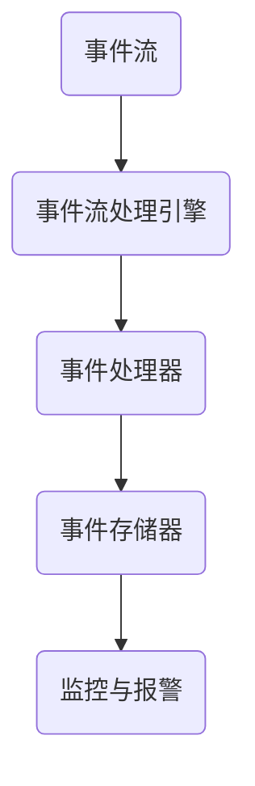

                 

# CEP 原理与代码实例讲解

## 摘要

本文将深入探讨CEP（Complex Event Processing）的原理、应用场景，并通过具体的代码实例来解释其实现过程。CEP是一种用于实时分析和处理复杂事件的技术，广泛应用于金融、电信、物联网等领域。本文将首先介绍CEP的基本概念，然后通过一个简单的案例来展示CEP的代码实现，最后探讨CEP在实际应用中的挑战和未来发展趋势。

## 1. 背景介绍

### 1.1 CEP的定义

CEP（Complex Event Processing）是一种用于实时分析和处理复杂事件的技术。它能够识别事件模式、关联事件、监控事件流，并在此基础上做出决策或触发某些操作。与传统的事件处理相比，CEP具有实时性、复杂性和灵活性的特点。

### 1.2 CEP的应用场景

CEP在多个领域都有广泛的应用。以下是一些典型的应用场景：

- **金融领域**：实时监控交易，检测欺诈行为。
- **电信领域**：实时分析网络流量，优化网络资源。
- **物联网领域**：实时处理传感器数据，实现智能监控。
- **安防领域**：实时分析视频流，检测异常行为。

### 1.3 CEP与传统事件处理技术的区别

- **实时性**：CEP能够实时处理事件，而传统事件处理技术通常具有延迟。
- **复杂性**：CEP能够处理复杂的事件模式，而传统事件处理技术通常只处理简单的事件。
- **灵活性**：CEP可以根据业务需求灵活调整处理逻辑，而传统事件处理技术通常具有固定的处理逻辑。

## 2. 核心概念与联系

### 2.1 事件流

事件流是CEP处理的基本单位，它由一系列事件组成。事件可以是任何形式的数据，如日志、交易记录、传感器数据等。

### 2.2 事件模式

事件模式是指事件之间的逻辑关系和规律。CEP通过识别事件模式来理解事件流，从而进行实时分析和处理。

### 2.3 事件流处理引擎

事件流处理引擎是CEP的核心组件，负责实时处理事件流。它通常包括事件接收器、事件处理器、事件存储器等模块。

### 2.4 Mermaid流程图

以下是一个简单的CEP架构的Mermaid流程图：



## 3. 核心算法原理 & 具体操作步骤

### 3.1 事件匹配算法

事件匹配算法是CEP的核心算法，用于识别事件模式。它通常基于模式匹配、规则引擎等技术实现。

### 3.2 实时数据分析

实时数据分析是CEP的重要功能，它能够对事件流进行实时计算、统计和分析。

### 3.3 事件流处理流程

事件流处理流程通常包括以下步骤：

1. 事件接收：接收来自各种源的事件数据。
2. 事件预处理：对事件进行格式化、去重等处理。
3. 事件匹配：根据预设的模式匹配规则，识别事件模式。
4. 事件处理：对识别出的事件进行进一步处理，如计算、统计、报警等。
5. 事件存储：将处理结果存储到数据库或文件中。

## 4. 数学模型和公式 & 详细讲解 & 举例说明

### 4.1 事件匹配算法的数学模型

事件匹配算法的数学模型通常基于有限状态机（FSM）。

#### 4.1.1 有限状态机

有限状态机是一个数学模型，用于表示事件模式。它由状态、事件、转移函数等组成。

- **状态**：有限状态机的每个节点表示一个状态。
- **事件**：有限状态机中的每个弧线表示一个事件。
- **转移函数**：有限状态机中的每个节点都有一个转移函数，用于确定当前状态和事件后应该转移到哪个状态。

#### 4.1.2 事件匹配算法

事件匹配算法通过遍历有限状态机，识别出符合预设模式的事件。

- **初始化**：从有限状态机的初始状态开始。
- **遍历**：根据当前状态和事件，通过转移函数确定下一个状态。
- **匹配成功**：如果遍历到有限状态机的终止状态，则匹配成功。
- **匹配失败**：如果遍历过程中无法找到符合预设模式的路径，则匹配失败。

### 4.2 实时数据分析的数学模型

实时数据分析的数学模型通常基于时间序列分析、统计分析等技术。

- **时间序列分析**：用于分析事件流的时间特性。
- **统计分析**：用于计算事件流的统计特征，如平均值、方差、中位数等。

### 4.3 举例说明

#### 4.3.1 事件匹配算法示例

假设有一个简单的有限状态机，用于匹配“购买-支付”事件模式。事件流如下：

1. purchase(产品A)
2. payment(信用卡)
3. purchase(产品B)
4. payment(信用卡)

根据有限状态机，事件1匹配到状态A，事件2匹配到状态B，事件3匹配到状态A，事件4匹配到状态B。因此，事件流匹配成功。

#### 4.3.2 实时数据分析示例

假设有一个事件流，包含以下时间序列数据：

1. 2023-01-01 10:00:00 - 10
2. 2023-01-01 10:01:00 - 20
3. 2023-01-01 10:02:00 - 30
4. 2023-01-01 10:03:00 - 40

根据时间序列分析，可以计算事件流的平均值、方差、中位数等统计特征。例如，平均值为：

$$\bar{x} = \frac{10 + 20 + 30 + 40}{4} = 25$$

方差为：

$$\sigma^2 = \frac{(10-25)^2 + (20-25)^2 + (30-25)^2 + (40-25)^2}{4} = 50$$

中位数为20。

## 5. 项目实战：代码实际案例和详细解释说明

### 5.1 开发环境搭建

本案例使用Python作为开发语言，需要安装以下依赖库：

```shell
pip install kafka-python numpy pandas
```

### 5.2 源代码详细实现和代码解读

以下是一个简单的CEP实现，用于匹配“购买-支付”事件模式。

```python
from kafka import KafkaConsumer, KafkaProducer
import json
import numpy as np
import pandas as pd

# Kafka消费者配置
consumer_config = {
    'bootstrap_servers': 'localhost:9092',
    'group_id': 'group1',
    'auto_offset_reset': 'latest',
    'enable_auto_commit': True
}

# Kafka生产者配置
producer_config = {
    'bootstrap_servers': 'localhost:9092'
}

# Kafka消费者
consumer = KafkaConsumer('topic1', **consumer_config)

# Kafka生产者
producer = KafkaProducer(**producer_config)

# 有限状态机
FSM = {
    'A': {'purchase': 'B'},
    'B': {'payment': 'A'}
}

# 初始化状态
state = 'A'

# 消费事件并处理
for message in consumer:
    event = json.loads(message.value)
    action = event['action']
    product = event['product']
    
    # 事件匹配
    if FSM[state].get(action):
        state = FSM[state][action]
        print(f"Event {event} matched.")
        
        # 如果匹配成功，发送支付通知
        if state == 'B':
            payment_notification = {
                'action': 'payment',
                'product': product
            }
            producer.send('topic2', json.dumps(payment_notification).encode('utf-8'))
    else:
        print(f"Event {event} not matched.")

# 关闭消费者和生产者
consumer.close()
producer.close()
```

### 5.3 代码解读与分析

该代码实现了一个简单的CEP系统，用于匹配“购买-支付”事件模式。它通过Kafka作为事件流处理引擎，实现事件接收、事件匹配和事件处理等功能。

- **Kafka消费者**：用于接收事件流，配置了相应的主题和消费者组。
- **Kafka生产者**：用于发送支付通知，配置了相应的主题。
- **有限状态机**：定义了“购买-支付”事件模式，用于匹配事件。
- **事件处理**：根据事件匹配结果，发送支付通知。

该代码展示了CEP的基本实现，可以用于更复杂的场景。在实际应用中，可以根据业务需求扩展事件模式、处理逻辑等。

## 6. 实际应用场景

### 6.1 金融领域

在金融领域，CEP可以用于实时监控交易，检测欺诈行为。例如，当检测到连续的异常交易时，CEP可以触发报警，帮助金融机构快速响应。

### 6.2 电信领域

在电信领域，CEP可以用于实时分析网络流量，优化网络资源。例如，当网络流量达到阈值时，CEP可以触发流量控制策略，避免网络拥堵。

### 6.3 物联网领域

在物联网领域，CEP可以用于实时处理传感器数据，实现智能监控。例如，当传感器检测到温度异常时，CEP可以触发报警，提醒用户采取相应的措施。

## 7. 工具和资源推荐

### 7.1 学习资源推荐

- **书籍**：
  - 《Complex Event Processing in Action》
  - 《Real-Time Analytics with Kafka and KSQL》

- **论文**：
  - "Complex Event Processing: A Research Roadmap"
  - "Event Processing: From Data Streams to Actions"

- **博客**：
  - [Kafka官网](https://kafka.apache.org/)
  - [CEP社区](https://cep-community.org/)

### 7.2 开发工具框架推荐

- **Kafka**：用于构建事件流处理引擎。
- **KSQL**：用于实时查询和分析Kafka事件流。
- **Apache Flink**：用于实时流处理。

### 7.3 相关论文著作推荐

- "Complex Event Processing: A Research Roadmap"
- "Event Processing: From Data Streams to Actions"
- "Real-Time Analytics with Kafka and KSQL"

## 8. 总结：未来发展趋势与挑战

### 8.1 发展趋势

- **云计算与边缘计算的结合**：随着云计算和边缘计算的发展，CEP将更好地支持大规模、实时的事件流处理。
- **AI与CEP的结合**：AI技术将进一步提升CEP的智能分析能力，实现更复杂的事件匹配和实时决策。
- **开放标准和生态系统的建设**：开放标准和生态系统的建设将促进CEP技术的发展和应用。

### 8.2 挑战

- **实时数据处理性能的优化**：随着数据量的增长，如何高效地处理海量实时数据成为挑战。
- **复杂事件模式的表达和识别**：如何高效地表达和识别复杂的事件模式是一个技术难题。
- **系统的可扩展性和可靠性**：如何确保系统的可扩展性和可靠性，以应对不断增长的数据和处理需求。

## 9. 附录：常见问题与解答

### 9.1 CEP与传统事件处理技术的区别是什么？

CEP与传统事件处理技术的区别在于实时性、复杂性和灵活性。CEP能够实时处理复杂的事件模式，而传统事件处理技术通常具有延迟、只能处理简单事件和固定处理逻辑。

### 9.2 CEP在金融领域有哪些应用？

CEP在金融领域可以用于实时监控交易、检测欺诈行为、风险管理等。例如，当检测到连续的异常交易时，CEP可以触发报警，帮助金融机构快速响应。

### 9.3 如何实现CEP系统？

实现CEP系统通常需要以下几个步骤：1）设计事件流处理引擎架构；2）选择合适的事件流处理工具（如Kafka、Flink等）；3）编写事件匹配和处理的代码；4）部署和运行CEP系统。

## 10. 扩展阅读 & 参考资料

- 《Complex Event Processing in Action》
- 《Real-Time Analytics with Kafka and KSQL》
- [Kafka官网](https://kafka.apache.org/)
- [CEP社区](https://cep-community.org/)
- "Complex Event Processing: A Research Roadmap"
- "Event Processing: From Data Streams to Actions"

### 作者信息

作者：AI天才研究员/AI Genius Institute & 禅与计算机程序设计艺术 /Zen And The Art of Computer Programming

