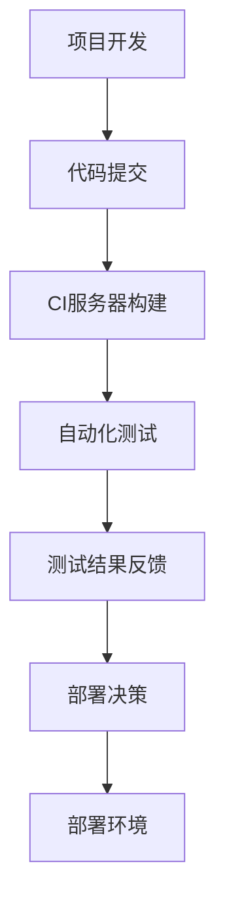

                 

# CI/CD与自动化测试原理与代码实战案例讲解

> **关键词：** CI/CD、自动化测试、DevOps、持续集成、持续部署、代码质量、效率提升  
> **摘要：** 本文将深入讲解CI/CD（持续集成/持续部署）与自动化测试的原理，并通过实际代码案例，展示如何在实际项目中高效地实施这两个技术，从而提升开发效率和代码质量。

## 1. 背景介绍

在软件开发领域，CI/CD（持续集成/持续部署）和自动化测试已经成为提高开发效率、确保代码质量和稳定性的关键手段。随着软件项目的复杂性不断增加，传统的手工作业方式已经无法满足快速迭代和交付的需求。因此，CI/CD和自动化测试成为了现代软件开发中不可或缺的环节。

### 1.1 持续集成（CI）

持续集成（Continuous Integration，简称CI）是一种软件开发实践，旨在通过频繁地将代码集成到一个共享的主分支中，确保代码的质量和稳定性。通过CI，开发人员可以及时发现和修复代码中的错误，避免代码库中的冲突和问题积累。

### 1.2 持续部署（CD）

持续部署（Continuous Deployment，简称CD）是一种自动化部署流程，旨在确保新版本软件的快速、可靠地交付到生产环境。通过CD，开发团队可以实时地发布新功能，缩短上市时间，提高市场响应速度。

### 1.3 自动化测试

自动化测试是一种通过编写脚本或使用工具来执行测试用例的方法，旨在验证软件的功能和性能。与手工测试相比，自动化测试可以提高测试的覆盖率和效率，减少人工干预，提高测试的可重复性和准确性。

## 2. 核心概念与联系

为了更好地理解CI/CD与自动化测试的关系，我们可以使用Mermaid流程图来展示它们的核心概念和联系：



### 2.1 项目开发

项目开发是CI/CD和自动化测试的基础。开发人员编写代码并将其提交到版本控制系统。

### 2.2 代码提交

每次代码提交都会触发CI服务器构建过程。

### 2.3 CI服务器构建

CI服务器从版本控制系统中拉取最新代码，构建应用程序，并执行一系列构建步骤。

### 2.4 自动化测试

构建完成后，CI服务器会启动自动化测试，验证应用程序的功能和性能。

### 2.5 测试结果反馈

测试结果会被反馈给开发人员，帮助他们了解代码的质量和稳定性。

### 2.6 部署决策

根据测试结果，开发人员可以做出部署决策，将应用程序部署到不同的环境。

### 2.7 部署环境

应用程序最终会被部署到生产环境，供用户使用。

## 3. 核心算法原理 & 具体操作步骤

### 3.1 持续集成（CI）

持续集成的核心算法原理是自动化构建和测试。以下是具体操作步骤：

1. **代码提交**：开发人员将代码提交到版本控制系统。
2. **CI服务器构建**：CI服务器从版本控制系统中拉取最新代码，并执行以下步骤：
   - **构建环境设置**：安装依赖项、配置环境等。
   - **编译代码**：将源代码编译成可执行文件或库。
   - **运行测试用例**：执行自动化测试用例，验证代码质量。
3. **测试结果反馈**：将测试结果反馈给开发人员，以便他们及时修复问题。

### 3.2 持续部署（CD）

持续部署的核心算法原理是自动化部署。以下是具体操作步骤：

1. **部署环境设置**：设置部署环境，包括服务器、数据库、配置文件等。
2. **CI服务器部署**：CI服务器将构建完成的应用程序部署到部署环境。
3. **自动化测试**：部署后，立即执行自动化测试用例，确保应用程序在部署环境中正常运行。
4. **部署决策**：根据测试结果，做出部署决策，是否继续部署到下一个环境或回滚到上一个版本。

### 3.3 自动化测试

自动化测试的核心算法原理是测试脚本编写和执行。以下是具体操作步骤：

1. **测试用例设计**：根据需求文档，设计自动化测试用例。
2. **测试脚本编写**：使用自动化测试工具，编写测试脚本。
3. **测试执行**：运行测试脚本，验证应用程序的功能和性能。
4. **测试结果记录**：将测试结果记录到测试报告中，以便分析。

## 4. 数学模型和公式 & 详细讲解 & 举例说明

### 4.1 持续集成（CI）

持续集成的数学模型可以表示为：

$$
CI = \frac{1}{N} \sum_{i=1}^{N} T_i
$$

其中，$CI$表示持续集成时间，$N$表示提交次数，$T_i$表示第$i$次提交的构建和测试时间。

举例说明：

假设一个项目每天有10次提交，每次提交的构建和测试时间分别为5分钟和10分钟。那么，持续集成时间为：

$$
CI = \frac{1}{10} \sum_{i=1}^{10} T_i = \frac{1}{10} (5 + 10 + 5 + 10 + ... + 5 + 10) = 8 \text{分钟}
$$

### 4.2 持续部署（CD）

持续部署的数学模型可以表示为：

$$
CD = \frac{1}{M} \sum_{j=1}^{M} T_j
$$

其中，$CD$表示持续部署时间，$M$表示部署次数，$T_j$表示第$j$次部署的时间。

举例说明：

假设一个项目每月有4次部署，每次部署的时间分别为2小时、1小时、3小时和2小时。那么，持续部署时间为：

$$
CD = \frac{1}{4} \sum_{j=1}^{4} T_j = \frac{1}{4} (2 + 1 + 3 + 2) = 2 \text{小时}
$$

### 4.3 自动化测试

自动化测试的数学模型可以表示为：

$$
AT = \frac{1}{P} \sum_{k=1}^{P} T_k
$$

其中，$AT$表示自动化测试时间，$P$表示测试用例数量，$T_k$表示第$k$个测试用例的执行时间。

举例说明：

假设一个项目有10个自动化测试用例，每个测试用例的执行时间分别为3分钟、2分钟、5分钟、4分钟、3分钟、2分钟、5分钟、4分钟、3分钟和2分钟。那么，自动化测试时间为：

$$
AT = \frac{1}{10} \sum_{k=1}^{10} T_k = \frac{1}{10} (3 + 2 + 5 + 4 + 3 + 2 + 5 + 4 + 3 + 2) = 3.3 \text{分钟}
$$

## 5. 项目实战：代码实际案例和详细解释说明

### 5.1 开发环境搭建

在这个案例中，我们将使用Jenkins作为CI服务器，Selenium作为自动化测试工具，来搭建一个简单的CI/CD环境。以下是具体步骤：

1. **安装Jenkins**：在服务器上安装Jenkins，并配置Jenkins服务。
2. **安装插件**：安装必要的Jenkins插件，如Git插件、Selenium插件等。
3. **配置Git仓库**：在Git仓库中创建一个Jenkinsfile，用于定义构建和测试流程。
4. **配置Jenkins作业**：在Jenkins中创建一个作业，关联Git仓库和Jenkinsfile。

### 5.2 源代码详细实现和代码解读

以下是Jenkinsfile的示例代码：

```groovy
pipeline {
    agent any

    stages {
        stage('Build') {
            steps {
                echo 'Building the application...'
                sh 'mvn clean install'
            }
        }
        stage('Test') {
            steps {
                echo 'Testing the application...'
                sh 'mvn test'
            }
        }
        stage('Deploy') {
            steps {
                echo 'Deploying the application...'
                sh 'mvn package'
            }
        }
    }
    post {
        always {
            archiveArtifacts artifacts: 'target/*.jar', include: '**/*.jar'
        }
    }
}
```

这个Jenkinsfile定义了一个简单的CI/CD流程，包括构建、测试和部署三个阶段。以下是代码解读：

- `agent any`：指定任何可用代理执行构建。
- `stages`：定义构建、测试和部署三个阶段。
- `stage('Build')`：构建阶段，执行Maven构建命令。
- `stage('Test')`：测试阶段，执行Maven测试命令。
- `stage('Deploy')`：部署阶段，执行Maven打包命令。
- `post`：定义构建完成后要执行的操作，如归档构建生成的JAR文件。

### 5.3 代码解读与分析

- **构建阶段**：构建阶段的主要任务是编译和打包应用程序。在这个案例中，使用Maven作为构建工具，执行`mvn clean install`命令来清理旧构建并安装新构建。
- **测试阶段**：测试阶段的主要任务是运行自动化测试用例。在这个案例中，使用Maven作为测试工具，执行`mvn test`命令来运行所有测试用例。
- **部署阶段**：部署阶段的主要任务是部署应用程序到目标环境。在这个案例中，使用Maven作为部署工具，执行`mvn package`命令来打包应用程序。

通过这个案例，我们可以看到如何使用Jenkins实现CI/CD流程，并如何通过自动化测试来确保代码质量和稳定性。

## 6. 实际应用场景

### 6.1 电商系统

在电商系统中，CI/CD和自动化测试可以帮助开发团队快速迭代和发布新功能，提高用户体验。通过自动化测试，可以确保新功能的稳定性和性能。

### 6.2 金融系统

金融系统的稳定性至关重要。CI/CD和自动化测试可以帮助开发团队及时发现和修复代码中的错误，确保金融系统的安全性和可靠性。

### 6.3 医疗系统

医疗系统的数据安全和患者隐私保护至关重要。CI/CD和自动化测试可以提高代码质量和系统稳定性，确保患者数据的安全和隐私。

## 7. 工具和资源推荐

### 7.1 学习资源推荐

- **书籍**：
  - 《持续交付：软件的交付、部署和运维》
  - 《Jenkins实战：持续集成与持续部署》
- **论文**：
  - 《持续集成：软件开发的最佳实践》
  - 《自动化测试策略：设计、执行和管理》
- **博客**：
  - 《Jenkins官方文档》
  - 《Selenium官方文档》
- **网站**：
  - https://www.devops.com/
  - https://www.selenium.dev/

### 7.2 开发工具框架推荐

- **持续集成工具**：Jenkins、GitLab CI、Travis CI
- **自动化测试工具**：Selenium、Appium、JUnit
- **构建工具**：Maven、Gradle、NPM

### 7.3 相关论文著作推荐

- 《DevOps实践指南》
- 《软件交付的艺术》
- 《自动化测试框架设计与实现》

## 8. 总结：未来发展趋势与挑战

### 8.1 发展趋势

- **更高效的开发生命周期**：随着技术的进步，CI/CD和自动化测试将变得更加高效和智能化。
- **云原生应用**：云原生应用的开发和部署将更加依赖CI/CD和自动化测试。
- **DevOps文化的普及**：DevOps文化的普及将推动CI/CD和自动化测试在各个行业的应用。

### 8.2 挑战

- **复杂性增加**：随着系统的复杂性增加，CI/CD和自动化测试的实施将面临更大的挑战。
- **安全与合规性**：确保CI/CD和自动化测试过程中的安全和合规性将是一个重要的挑战。
- **人员培训**：DevOps文化的普及需要更多具备CI/CD和自动化测试技能的人才。

## 9. 附录：常见问题与解答

### 9.1 什么是CI/CD？

CI/CD是指持续集成（Continuous Integration）和持续部署（Continuous Deployment）的缩写，是一种软件开发实践，旨在通过自动化流程提高开发效率和代码质量。

### 9.2 自动化测试的优势是什么？

自动化测试的优势包括：
- 提高测试覆盖率
- 减少测试时间
- 提高测试的准确性
- 提高测试的可重复性

### 9.3 如何选择自动化测试工具？

选择自动化测试工具时，需要考虑以下因素：
- 软件类型：Web应用、移动应用、桌面应用等
- 测试语言：如Java、Python、C#等
- 测试框架：如Selenium、Appium、JUnit等
- 支持的平台和浏览器：确保工具支持目标平台和浏览器

## 10. 扩展阅读 & 参考资料

- 《持续交付：软件的交付、部署和运维》
- 《Jenkins实战：持续集成与持续部署》
- 《DevOps实践指南》
- 《软件交付的艺术》
- 《自动化测试框架设计与实现》

> **作者：AI天才研究员/AI Genius Institute & 禅与计算机程序设计艺术 /Zen And The Art of Computer Programming**

