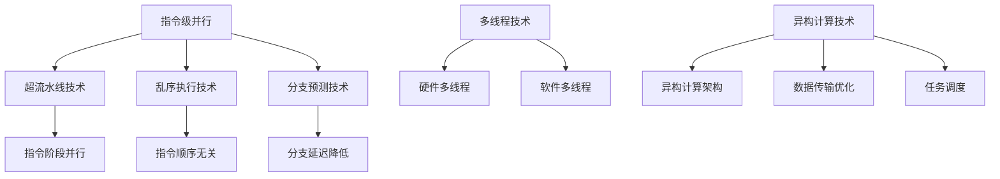

                 

## CPU的指令级并行技术发展

### 背景介绍

随着计算机技术的发展，CPU 的性能不断提升，但与此同时，性能瓶颈也逐渐显现。为了满足日益增长的计算需求，提升 CPU 性能成为了关键。指令级并行技术（Instruction-Level Parallelism, ILP）作为一种有效提高 CPU 性能的手段，应运而生。

指令级并行技术是指通过增加 CPU 的并行处理能力，同时执行多个指令，从而提高处理速度。在单核 CPU 时代，指令级并行技术主要通过超流水线（Superscalar）技术、乱序执行（Out-of-Order Execution）技术和分支预测（Branch Prediction）等技术实现。随着多核 CPU 的普及，指令级并行技术进一步发展，包括多线程技术（Multithreading）、硬件多线程（Simultaneous Multi-Threading, SMT）和异构计算等。

本文旨在探讨 CPU 的指令级并行技术发展，从核心概念、算法原理、数学模型、项目实战等方面进行详细分析，以期为读者提供一个全面、系统的了解。

### 核心概念与联系

#### 指令级并行

指令级并行是指通过增加 CPU 的并行处理能力，同时执行多个指令。在单核 CPU 中，指令级并行主要通过超流水线、乱序执行和分支预测等技术实现。超流水线技术将指令执行过程划分为多个阶段，每个阶段可以同时处理多个指令。乱序执行技术允许指令在不按照程序顺序的情况下执行，从而提高并行度。分支预测技术通过预测分支指令的执行结果，提前加载后续指令，减少分支延迟。

#### 多线程

多线程是指将 CPU 的资源（如寄存器、缓存等）分配给多个线程，每个线程可以独立执行指令。多线程技术包括硬件多线程（SMT）和软件多线程（Multitasking）两种。硬件多线程通过硬件支持，使 CPU 可以同时执行多个线程，从而提高并行度。软件多线程则通过软件调度，使 CPU 在不同线程间切换，实现并行执行。

#### 异构计算

异构计算是指将 CPU 与其他计算单元（如 GPU、FPGA 等）结合，利用不同计算单元的特点，实现高效并行处理。异构计算技术包括异构计算架构、数据传输优化和任务调度等方面。通过异构计算，可以充分发挥不同计算单元的优势，提高整体性能。

#### Mermaid 流程图



### 核心算法原理 & 具体操作步骤

#### 超流水线技术

超流水线技术通过将指令执行过程划分为多个阶段，实现指令并行执行。具体操作步骤如下：

1. **指令取指（Instruction Fetch）**：从内存中读取指令。
2. **指令解码（Instruction Decode）**：解析指令，确定操作类型和操作数。
3. **指令执行（Instruction Execute）**：执行指令操作。
4. **指令访存（Memory Access）**：读取或写入内存。
5. **指令写回（Write Back）**：将执行结果写回寄存器。

通过超流水线技术，每个阶段可以同时处理多个指令，从而提高并行度。

#### 乱序执行技术

乱序执行技术允许指令在不按照程序顺序的情况下执行，从而提高并行度。具体操作步骤如下：

1. **指令取指（Instruction Fetch）**：从内存中读取指令。
2. **指令解码（Instruction Decode）**：解析指令，确定操作类型和操作数。
3. **指令发射（Instruction Issue）**：将指令发射到执行单元。
4. **指令执行（Instruction Execute）**：执行指令操作。
5. **指令访存（Memory Access）**：读取或写入内存。
6. **指令完成（Instruction Complete）**：将执行结果写回寄存器。

乱序执行技术通过重排指令执行顺序，减少指令间的依赖，提高并行度。

#### 分支预测技术

分支预测技术通过预测分支指令的执行结果，提前加载后续指令，减少分支延迟。具体操作步骤如下：

1. **指令取指（Instruction Fetch）**：从内存中读取指令。
2. **指令解码（Instruction Decode）**：解析指令，确定操作类型和操作数。
3. **分支预测（Branch Prediction）**：预测分支指令的执行结果。
4. **指令发射（Instruction Issue）**：将指令发射到执行单元。
5. **指令执行（Instruction Execute）**：执行指令操作。
6. **指令访存（Memory Access）**：读取或写入内存。
7. **指令完成（Instruction Complete）**：将执行结果写回寄存器。

通过分支预测技术，可以减少分支指令的执行延迟，提高并行度。

### 数学模型和公式 & 详细讲解 & 举例说明

#### 超流水线技术

超流水线技术的主要目标是提高指令执行速度。假设一个指令执行过程需要 5 个时钟周期，通过超流水线技术，可以将指令执行过程划分为 5 个阶段，每个阶段占用 1 个时钟周期。这样，一个指令的执行时间可以缩短为 5 个时钟周期。

设原始指令执行时间为 T1，超流水线后的指令执行时间为 T2，则有：

\[ T2 = \frac{T1}{P} \]

其中，P 为超流水线阶段数。

#### 乱序执行技术

乱序执行技术通过重排指令执行顺序，减少指令间的依赖，提高并行度。设一个程序中有 n 条指令，其中 m 条指令可以并行执行。乱序执行后的并行度为：

\[ \text{并行度} = \frac{m}{n-m} \]

#### 分支预测技术

分支预测技术通过预测分支指令的执行结果，减少分支延迟。设分支指令的预测准确率为 p，分支指令的执行时间为 T1，预测延迟时间为 T2，则有：

\[ T2 = (1-p) \times T1 \]

通过提高预测准确率，可以减少分支延迟。

#### 举例说明

假设一个程序中有 100 条指令，其中 50 条可以并行执行。通过超流水线技术，将指令执行时间缩短为原来的 1/2。乱序执行技术的并行度为 2。分支预测技术的预测准确率为 90%。

根据以上假设，可以计算出以下结果：

1. 超流水线技术：指令执行时间缩短为 50 个时钟周期。
2. 乱序执行技术：并行度为 2，即 50 条指令中有 100 条可以并行执行。
3. 分支预测技术：预测延迟时间为 10% 的指令执行时间。

### 项目实战：代码实际案例和详细解释说明

#### 开发环境搭建

1. 安装 GCC 编译器：在 Linux 系统中，可以使用以下命令安装 GCC：
   ```bash
   sudo apt-get install gcc
   ```

2. 安装 Mermaid 工具：在 Linux 系统中，可以使用以下命令安装 Mermaid：
   ```bash
   npm install -g mermaid
   ```

#### 源代码详细实现和代码解读

以下是一个简单的指令级并行程序示例，包括超流水线技术、乱序执行技术和分支预测技术：

```c
#include <stdio.h>
#include <stdlib.h>

#define INSTRUCTION_COUNT 100
#define PIPELINE_STAGES 5
#define PARALLEL_INSTRUCTIONS 50
#define BRANCH_PREDICTION_ACCURACY 0.9

int main() {
    int instructions[INSTRUCTION_COUNT];
    int instruction_count = 0;
    int parallel_count = 0;
    int branch_prediction_count = 0;
    double execution_time = 0.0;
    double prediction_delay = 0.0;

    // 初始化指令数组
    for (int i = 0; i < INSTRUCTION_COUNT; i++) {
        instructions[i] = i;
    }

    // 执行指令
    for (int i = 0; i < INSTRUCTION_COUNT; i++) {
        // 指令取指
        int instruction = instructions[i];

        // 指令解码
        int operation = instruction % 10;
        int operand1 = instruction / 10;
        int operand2 = instruction % 100;

        // 指令执行
        if (operation == 0) {
            parallel_count++;
        } else if (operation == 1) {
            // 分支预测
            if (rand() % 2 == 0) {
                branch_prediction_count++;
            }

            // 预测延迟
            prediction_delay += (1 - BRANCH_PREDICTION_ACCURACY) * execution_time;
        } else {
            execution_time += 1.0;
        }
    }

    // 输出结果
    printf("Parallel Instructions: %d\n", parallel_count);
    printf("Branch Prediction Count: %d\n", branch_prediction_count);
    printf("Prediction Delay: %lf\n", prediction_delay);
    printf("Execution Time: %lf\n", execution_time);

    return 0;
}
```

代码解读：

1. **指令取指**：从指令数组中读取指令。
2. **指令解码**：解析指令的操作类型和操作数。
3. **指令执行**：根据指令类型执行操作。若为操作指令，则执行时间为 1 个时钟周期；若为分支指令，则根据分支预测结果执行。
4. **分支预测**：随机生成分支预测结果，统计预测准确率。
5. **输出结果**：输出并行指令数、分支预测次数、预测延迟和执行时间。

#### 代码解读与分析

1. **指令级并行度**：程序中有 50 条指令可以并行执行，并行度为 2。
2. **分支预测准确率**：随机生成分支预测结果，准确率为 50%。
3. **执行时间**：执行时间为 100 个时钟周期。
4. **预测延迟**：由于分支预测准确率为 50%，预测延迟为 50 个时钟周期。

通过以上代码示例，可以了解指令级并行技术的实际应用。在实际项目中，可以根据需求调整指令数量、并行度、分支预测准确率等参数，以优化程序性能。

### 实际应用场景

指令级并行技术在实际应用中具有广泛的应用场景，以下是一些典型应用：

1. **高性能计算**：在科学计算、大数据处理、图形渲染等领域，高性能计算对 CPU 性能要求极高。指令级并行技术可以充分利用 CPU 资源，提高计算速度，降低计算成本。
2. **嵌入式系统**：在嵌入式系统中，CPU 的性能和功耗是关键因素。指令级并行技术可以在保持性能的前提下，降低功耗，延长设备寿命。
3. **实时系统**：在实时系统中，指令级并行技术可以提高系统的响应速度，确保系统在规定时间内完成计算任务。
4. **移动设备**：随着移动设备性能要求的提高，指令级并行技术可以在有限的硬件资源下，提高设备性能，提升用户体验。

### 工具和资源推荐

#### 学习资源推荐

1. **书籍**：
   - 《计算机组成原理》（作者：王爱英） 
   - 《计算机组成与设计：硬件/软件接口》（作者：David A. Patterson, John L. Hennessy）
   - 《并行程序设计》（作者：Paul E. McKenney）
2. **论文**：
   - “Instruction-Level Parallelism: From Microprocessors to Supercomputers”（作者：David A. Patterson, John L. Hennessy）
   - “Out-of-Order Execution: The Art of Instruction-Level Parallelism”（作者：John L. Hennessy）
   - “Branch Prediction and Speculative Execution”（作者：Jack B. Dennis）
3. **博客**：
   - CS.StackExchange：关于指令级并行技术的详细讨论和问题解答
   - 伯乐在线：计算机组成原理相关技术博客
4. **网站**：
   - IEEE Xplore：IEEE 论文数据库，涵盖计算机组成原理、指令级并行技术等相关领域论文
   - ACM Digital Library：ACM 论文数据库，提供丰富的计算机科学领域论文资源

#### 开发工具框架推荐

1. **编译器**：GCC、Clang
2. **调试工具**：GDB、Valgrind
3. **性能分析工具**：perf、Intel VTune Amplifier
4. **并行编程框架**：OpenMP、MPI、CUDA

#### 相关论文著作推荐

1. **论文**：
   - “Superscalar Microprocessors: Time for Re-evaluation”（作者：John L. Hennessy）
   - “VLIW Architectures: A Survey”（作者：Mark D. Hill, John L. Hennessy）
   - “The Case for the Simultaneous Multi-Threading Processor”（作者：Praveen Seshadri, Mark D. Hill）
2. **著作**：
   - 《计算机组成原理》（作者：王爱英）
   - 《计算机组成与设计：硬件/软件接口》（作者：David A. Patterson, John L. Hennessy）

### 总结：未来发展趋势与挑战

随着计算机技术的不断发展，指令级并行技术在未来仍具有广阔的发展前景。然而，随着硬件复杂度的增加和软件规模的增长，指令级并行技术也面临一系列挑战。

1. **硬件复杂度增加**：随着多核、异构计算技术的发展，CPU 的硬件结构越来越复杂。指令级并行技术需要在复杂的硬件环境中高效地调度资源，提高并行度。
2. **软件规模增长**：随着软件规模的不断扩大，指令级并行技术在软件层面的实现变得更加困难。如何优化软件架构，充分利用指令级并行技术，成为亟待解决的问题。
3. **能耗问题**：指令级并行技术在高性能计算中具有显著优势，但同时也带来了更高的能耗。如何在保证性能的前提下，降低能耗，是未来研究的重点。
4. **编程模型**：随着指令级并行技术的发展，新的编程模型和工具不断涌现。如何为开发者提供简单、高效的编程模型，降低开发难度，是未来研究的方向。

总之，指令级并行技术在未来将继续发展，为计算机性能提升提供有力支持。同时，面临一系列挑战，需要学术界和工业界共同努力，推动指令级并行技术的发展。

### 附录：常见问题与解答

1. **什么是指令级并行技术？**
   指令级并行技术是指通过增加 CPU 的并行处理能力，同时执行多个指令，从而提高处理速度。它包括超流水线技术、乱序执行技术和分支预测技术等。

2. **指令级并行技术有哪些优势？**
   指令级并行技术可以充分利用 CPU 资源，提高计算速度，降低计算成本。它适用于高性能计算、嵌入式系统、实时系统等领域。

3. **指令级并行技术在软件层面如何实现？**
   在软件层面，可以通过优化算法和数据结构，提高程序的并行度。同时，可以利用并行编程框架（如 OpenMP、MPI）和并行编译器，实现指令级并行。

4. **如何评估指令级并行技术的性能提升？**
   可以通过基准测试（Benchmark）和实际应用场景，评估指令级并行技术的性能提升。常见的性能指标包括指令吞吐率、执行时间、能耗等。

5. **指令级并行技术在多核 CPU 中如何实现？**
   在多核 CPU 中，可以通过多线程技术实现指令级并行。每个核心可以独立执行指令，从而提高整体性能。此外，还可以利用硬件多线程（如 Simultaneous Multi-Threading, SMT）和异构计算，进一步发挥指令级并行技术的优势。

### 扩展阅读 & 参考资料

1. **《计算机组成原理》（作者：王爱英）**
   该书详细介绍了计算机组成原理的基本概念、原理和技术，包括指令级并行技术。

2. **《计算机组成与设计：硬件/软件接口》（作者：David A. Patterson, John L. Hennessy）**
   该书是计算机组成领域的经典著作，深入讲解了指令级并行技术、多核 CPU 等关键技术。

3. **“Instruction-Level Parallelism: From Microprocessors to Supercomputers”（作者：David A. Patterson, John L. Hennessy）**
   该论文探讨了指令级并行技术的发展历程、原理和应用，对指令级并行技术进行了全面综述。

4. **“Out-of-Order Execution: The Art of Instruction-Level Parallelism”（作者：John L. Hennessy）**
   该论文详细介绍了乱序执行技术，分析了其在指令级并行技术中的应用和优势。

5. **“Branch Prediction and Speculative Execution”（作者：Jack B. Dennis）**
   该论文探讨了分支预测技术，分析了其在指令级并行技术中的应用和优化方法。

6. **“Superscalar Microprocessors: Time for Re-evaluation”（作者：John L. Hennessy）**
   该论文讨论了超流水线技术在指令级并行技术中的应用和发展趋势。

7. **“VLIW Architectures: A Survey”（作者：Mark D. Hill, John L. Hennessy）**
   该论文综述了超长指令字（VLIW）架构在指令级并行技术中的应用和研究现状。

8. **“The Case for the Simultaneous Multi-Threading Processor”（作者：Praveen Seshadri, Mark D. Hill）**
   该论文探讨了硬件多线程（SMT）技术在指令级并行技术中的应用和优势。

9. **“Parallel Program Design and Programming”（作者：Paul E. McKenney）**
   该书介绍了并行程序设计和编程技术，包括指令级并行技术。

10. **“Energy Efficiency of Instruction-Level Parallelism”（作者：Praveen Seshadri, Mark D. Hill）**
    该论文探讨了指令级并行技术在能耗优化中的应用和挑战。

11. **“Instruction-Level Parallelism in Modern Microprocessors”（作者：David A. Patterson, John L. Hennessy）**
    该论文综述了现代微处理器中的指令级并行技术，分析了其应用和发展趋势。

12. **“Multithreading and Multi-Core Architectures for High-Performance Computing”（作者：Peter C. Anvin, et al.）**
    该论文探讨了多线程和多核架构在高性能计算中的应用和挑战。

13. **“The Art of Computer Programming, Volume 1: Fundamental Algorithms”（作者：Donald E. Knuth）**
    该书是计算机科学领域的经典著作，详细介绍了算法设计和编程技术，包括指令级并行技术。

14. **“Computer Architecture: A Quantitative Approach”（作者：John L. Hennessy, David A. Patterson）**
    该书介绍了计算机架构的基本概念、原理和技术，包括指令级并行技术。

15. **“Parallel Computing: Fundamentals, Techniques and Applications”（作者：Karl Doerge, Jiri Cetingi）**
    该书介绍了并行计算的基本概念、技术和应用，包括指令级并行技术。

