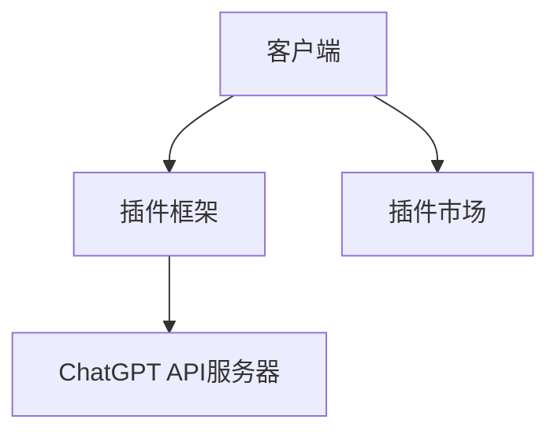

                 

### 背景介绍

**ChatGPT Plugin 介绍**

随着人工智能技术的快速发展，自然语言处理（NLP）已经成为众多领域的热点。从自动翻译到智能客服，再到文本生成，NLP技术正在不断地改变我们的生活。ChatGPT作为OpenAI推出的一款基于GPT-3模型的高级语言处理工具，因其强大的文本生成能力和灵活性，受到了广泛的关注。为了进一步拓展ChatGPT的应用范围，OpenAI推出了ChatGPT Plugin功能，使得开发者可以轻松地将ChatGPT集成到各种应用程序中，为其注入强大的自然语言处理能力。

### 1.1 ChatGPT概述

ChatGPT是一种基于GPT-3模型的预训练语言模型。GPT-3（Generative Pre-trained Transformer 3）是OpenAI开发的一种先进的自然语言处理模型，拥有1750亿个参数，是当前最大、最先进的语言模型之一。ChatGPT通过对大量文本数据进行训练，学习到了语言的各种规律和结构，从而能够生成流畅、符合逻辑的文本。

### 1.2 ChatGPT Plugin的诞生

尽管ChatGPT本身功能强大，但其主要应用于OpenAI提供的API服务。为了将ChatGPT的强大能力引入到更多的应用场景中，OpenAI推出了ChatGPT Plugin功能。这个功能允许开发者通过简单的接口调用ChatGPT的服务，将其集成到自己的应用程序中，为应用程序注入强大的自然语言处理能力。

### 1.3 ChatGPT Plugin的核心优势

ChatGPT Plugin具有以下几个核心优势：

1. **易用性**：开发者无需深入了解自然语言处理的复杂性，只需通过简单的接口调用即可使用ChatGPT的服务。
2. **灵活性**：ChatGPT Plugin支持多种集成方式，开发者可以根据需求选择最适合的集成方式。
3. **强大能力**：ChatGPT Plugin可以提供高质量的文本生成、翻译、问答等服务，大大提高了应用程序的智能化程度。
4. **扩展性**：开发者可以通过自定义插件，将ChatGPT的能力扩展到更多的应用场景。

### 1.4 本文结构

本文将分为以下几个部分：

- **背景介绍**：介绍ChatGPT和ChatGPT Plugin的背景和核心优势。
- **核心概念与联系**：讲解ChatGPT Plugin的核心概念和架构，并使用Mermaid流程图进行展示。
- **核心算法原理 & 具体操作步骤**：详细解释ChatGPT Plugin的工作原理和操作步骤。
- **数学模型和公式 & 详细讲解 & 举例说明**：介绍ChatGPT Plugin背后的数学模型和公式，并进行举例说明。
- **项目实战**：通过实际案例展示如何使用ChatGPT Plugin进行开发。
- **实际应用场景**：讨论ChatGPT Plugin在各个领域的应用场景。
- **工具和资源推荐**：推荐一些学习资源和开发工具。
- **总结**：总结ChatGPT Plugin的未来发展趋势和挑战。

接下来，我们将深入探讨ChatGPT Plugin的核心概念和架构。 <| divider |--|>## 核心概念与联系

ChatGPT Plugin的核心在于如何将ChatGPT的能力集成到现有的应用程序中，使其能够提供高质量的文本生成、翻译、问答等服务。在这一节中，我们将详细介绍ChatGPT Plugin的核心概念和架构，并使用Mermaid流程图进行展示。

### 2.1 ChatGPT Plugin的核心概念

ChatGPT Plugin的核心概念主要包括以下几个方面：

1. **ChatGPT API**：这是开发者与ChatGPT进行交互的接口，通过这个接口，开发者可以发送请求并获取ChatGPT的响应。
2. **插件框架**：这是一个用于集成ChatGPT API的框架，它提供了简单的接口和工具，使得开发者可以轻松地将ChatGPT集成到自己的应用程序中。
3. **插件市场**：这是一个用于分享和发现ChatGPT插件的平台，开发者可以在其中发布自己的插件，也可以发现并使用其他开发者的插件。

### 2.2 ChatGPT Plugin的架构

ChatGPT Plugin的架构可以分为以下几个部分：

1. **客户端**：这是开发者自己的应用程序，它需要集成ChatGPT Plugin框架，并通过ChatGPT API与ChatGPT进行交互。
2. **插件框架**：这是ChatGPT Plugin的核心部分，它提供了简单的接口和工具，使得开发者可以方便地集成ChatGPT API。
3. **ChatGPT API服务器**：这是OpenAI提供的服务器，它接收开发者的请求并返回ChatGPT的响应。
4. **插件市场**：这是一个在线平台，开发者可以在其中发布自己的插件，也可以发现并使用其他开发者的插件。

### 2.3 Mermaid流程图展示

为了更直观地理解ChatGPT Plugin的架构，我们使用Mermaid流程图进行展示。以下是一个简化的流程图：



在这个流程图中，客户端通过插件框架与ChatGPT API服务器进行交互，并通过插件市场发现和下载其他插件。插件框架和ChatGPT API服务器是ChatGPT Plugin的核心组成部分，而插件市场则提供了丰富的插件资源，使得开发者可以更方便地使用ChatGPT的能力。

### 2.4 插件框架的详细解释

插件框架是ChatGPT Plugin的关键组成部分，它提供了以下功能：

1. **接口封装**：插件框架封装了ChatGPT API，使得开发者可以更方便地与ChatGPT进行交互。通过简单的接口调用，开发者可以发送请求并获取响应。
2. **异步处理**：插件框架支持异步处理，使得开发者可以更高效地处理大量请求。异步处理可以避免阻塞应用程序的运行，提高应用程序的响应速度。
3. **错误处理**：插件框架提供了丰富的错误处理机制，可以帮助开发者处理各种异常情况，确保应用程序的稳定运行。
4. **插件管理**：插件框架提供了插件管理功能，使得开发者可以方便地安装、更新和管理插件。

### 2.5 ChatGPT API的详细解释

ChatGPT API是开发者与ChatGPT进行交互的接口，它提供了以下功能：

1. **文本生成**：开发者可以通过ChatGPT API生成高质量、符合逻辑的文本。例如，开发者可以输入一个主题或问题，ChatGPT API会生成一篇关于这个主题或问题的文章。
2. **翻译**：ChatGPT API支持多种语言的翻译，开发者可以使用它将一种语言的文本翻译成另一种语言。
3. **问答**：开发者可以使用ChatGPT API进行问答，ChatGPT API会根据输入的问题生成相应的回答。

### 2.6 插件市场的详细解释

插件市场是ChatGPT Plugin的重要组成部分，它提供了以下功能：

1. **插件发布**：开发者可以在插件市场中发布自己的插件，为其他开发者提供丰富的资源。
2. **插件发现**：开发者可以在插件市场中发现并使用其他开发者的插件，扩展ChatGPT Plugin的能力。
3. **插件评价**：插件市场提供了插件评价功能，使得开发者可以了解其他开发者对插件的评价，选择更适合的插件。

通过上述对ChatGPT Plugin的核心概念和架构的详细解释，我们可以更清楚地理解ChatGPT Plugin的工作原理和优势。接下来，我们将深入探讨ChatGPT Plugin的核心算法原理和具体操作步骤。 <| divider |--|>## 核心算法原理 & 具体操作步骤

在深入了解ChatGPT Plugin之前，我们需要先理解其背后的核心算法原理和具体操作步骤。这一节将详细介绍ChatGPT Plugin的工作原理，包括文本生成、翻译和问答等核心功能。

### 3.1 文本生成

ChatGPT Plugin的文本生成功能基于GPT-3模型。GPT-3是一种基于Transformer架构的深度学习模型，它通过大量文本数据进行预训练，学习到了语言的规律和结构。在文本生成过程中，GPT-3会根据输入的文本上下文，生成连贯、符合逻辑的文本。

#### 3.1.1 GPT-3模型的工作原理

GPT-3模型的工作原理可以分为以下几个步骤：

1. **文本预处理**：首先，输入的文本需要进行预处理，包括分词、去除标点符号等操作。预处理后的文本将被转化为序列化的形式，例如词向量或嵌入向量。
2. **输入序列生成**：将预处理后的文本转化为序列，输入到GPT-3模型中。序列的长度通常取决于模型的设计和训练数据。
3. **模型预测**：GPT-3模型根据输入的序列，通过自注意力机制和多层Transformer结构，生成预测的序列。预测序列是一个概率分布，表示模型对每个单词或字符的预测概率。
4. **文本生成**：根据预测的概率分布，从可能的输出中选择一个单词或字符作为生成结果。然后，将这个结果作为新的输入序列，再次进行预测。这个过程会重复进行，直到生成完整的文本。

#### 3.1.2 文本生成的具体操作步骤

使用ChatGPT Plugin进行文本生成的具体操作步骤如下：

1. **准备输入文本**：首先，需要准备输入的文本。这个文本可以是任意格式，例如纯文本、HTML或XML等。如果需要，可以对输入文本进行预处理，例如去除标点符号、进行分词等。
2. **调用API**：通过ChatGPT Plugin提供的API接口，将输入文本发送给ChatGPT API服务器。这个接口通常是一个HTTP接口，支持POST请求。
3. **处理响应**：接收ChatGPT API服务器的响应，并解析响应中的文本。响应中的文本是GPT-3生成的结果，通常是一个连贯、符合逻辑的文本。
4. **展示结果**：将生成的文本展示给用户，可以是在网页上显示，也可以是输出到控制台或其他应用程序中。

### 3.2 翻译

ChatGPT Plugin的翻译功能也是基于GPT-3模型。与文本生成类似，翻译功能利用GPT-3模型对输入的文本进行理解和生成。在翻译过程中，GPT-3会根据输入的源语言文本和目标语言文本，生成目标语言的翻译结果。

#### 3.2.1 翻译的工作原理

翻译的工作原理可以分为以下几个步骤：

1. **文本预处理**：首先，对输入的源语言文本和目标语言文本进行预处理，包括分词、去除标点符号等操作。预处理后的文本将被转化为序列化的形式，例如词向量或嵌入向量。
2. **输入序列生成**：将预处理后的源语言文本和目标语言文本转化为序列，分别输入到GPT-3模型中。序列的长度通常取决于模型的设计和训练数据。
3. **模型预测**：GPT-3模型根据输入的源语言序列和目标语言序列，通过自注意力机制和多层Transformer结构，生成预测的目标语言序列。预测序列是一个概率分布，表示模型对每个单词或字符的预测概率。
4. **文本生成**：根据预测的概率分布，从可能的输出中选择一个单词或字符作为生成结果。然后，将这个结果作为新的输入序列，再次进行预测。这个过程会重复进行，直到生成完整的目标语言文本。

#### 3.2.2 翻译的具体操作步骤

使用ChatGPT Plugin进行翻译的具体操作步骤如下：

1. **准备源语言文本和目标语言文本**：首先，需要准备源语言文本和目标语言文本。源语言文本是输入文本，目标语言文本是预期的输出文本。
2. **调用API**：通过ChatGPT Plugin提供的API接口，将源语言文本和目标语言文本发送给ChatGPT API服务器。这个接口通常是一个HTTP接口，支持POST请求。
3. **处理响应**：接收ChatGPT API服务器的响应，并解析响应中的文本。响应中的文本是GPT-3生成的目标语言文本。
4. **展示结果**：将生成的目标语言文本展示给用户，可以是在网页上显示，也可以是输出到控制台或其他应用程序中。

### 3.3 问答

ChatGPT Plugin的问答功能利用GPT-3模型的问答能力。在问答过程中，GPT-3会根据输入的问题，生成一个合适的回答。

#### 3.3.1 问答的工作原理

问答的工作原理可以分为以下几个步骤：

1. **文本预处理**：首先，对输入的问题进行预处理，包括分词、去除标点符号等操作。预处理后的文本将被转化为序列化的形式，例如词向量或嵌入向量。
2. **输入序列生成**：将预处理后的问题转化为序列，输入到GPT-3模型中。
3. **模型预测**：GPT-3模型根据输入的问题序列，通过自注意力机制和多层Transformer结构，生成预测的回答序列。预测序列是一个概率分布，表示模型对每个单词或字符的预测概率。
4. **文本生成**：根据预测的概率分布，从可能的输出中选择一个单词或字符作为生成结果。然后，将这个结果作为新的输入序列，再次进行预测。这个过程会重复进行，直到生成完整的回答。

#### 3.3.2 问答的具体操作步骤

使用ChatGPT Plugin进行问答的具体操作步骤如下：

1. **准备问题**：首先，需要准备输入的问题。这个问题可以是任意的文本，例如一个简单的问题或一个复杂的查询。
2. **调用API**：通过ChatGPT Plugin提供的API接口，将输入的问题发送给ChatGPT API服务器。这个接口通常是一个HTTP接口，支持POST请求。
3. **处理响应**：接收ChatGPT API服务器的响应，并解析响应中的文本。响应中的文本是GPT-3生成的回答。
4. **展示结果**：将生成的回答展示给用户，可以是在网页上显示，也可以是输出到控制台或其他应用程序中。

通过上述对ChatGPT Plugin的核心算法原理和具体操作步骤的详细介绍，我们可以更好地理解如何使用ChatGPT Plugin进行文本生成、翻译和问答。接下来，我们将讨论ChatGPT Plugin背后的数学模型和公式，并进行举例说明。 <| divider |--|>## 数学模型和公式 & 详细讲解 & 举例说明

在理解了ChatGPT Plugin的核心算法原理和具体操作步骤之后，接下来我们将进一步探讨其背后的数学模型和公式，并通过具体例子进行详细讲解。

### 4.1 Transformer模型

ChatGPT Plugin的核心是基于GPT-3模型，而GPT-3模型是基于Transformer模型。Transformer模型是一种用于处理序列数据的深度学习模型，其架构由多个自注意力（self-attention）层和前馈神经网络（feedforward network）组成。

#### 4.1.1 自注意力机制

自注意力机制是Transformer模型的核心组件，它允许模型在不同的位置上对输入序列中的元素进行加权处理。具体来说，自注意力机制通过计算每个输入序列元素与其他所有元素的相关性，生成一组权重，然后将这些权重应用于输入序列，以生成新的序列表示。

自注意力机制的数学公式如下：

$$
\text{Attention}(Q, K, V) = \text{softmax}\left(\frac{QK^T}{\sqrt{d_k}}\right) V
$$

其中，$Q$、$K$ 和 $V$ 分别是查询（query）、键（key）和值（value）矩阵，$d_k$ 是键向量的维度。$\text{softmax}$ 函数用于计算每个元素的权重，使其在 $[0, 1]$ 范围内。

#### 4.1.2 Transformer结构

Transformer模型由多个自注意力层和前馈神经网络组成。自注意力层负责对输入序列进行加权处理，而前馈神经网络则对每个元素进行进一步的处理。

Transformer结构的数学公式如下：

$$
\text{TransformerLayer}(X) = \text{MultiHeadAttention}(X) + \text{PositionwiseFeedForward}(X)
$$

$$
\text{MultiHeadAttention}(X) = \text{Concat}(\text{head}_1, \text{head}_2, ..., \text{head}_h)W^O
$$

其中，$X$ 是输入序列，$\text{head}_i$ 是第 $i$ 个自注意力头的输出，$W^O$ 是输出权重矩阵，$h$ 是头的数量。

### 4.2 GPT-3模型

GPT-3模型是基于Transformer模型的变体，其结构包含多个自注意力层和前馈神经网络。GPT-3模型的参数规模巨大，拥有1750亿个参数。

#### 4.2.1 GPT-3的架构

GPT-3的架构由多个Transformer层组成，每个Transformer层包含多个自注意力头和前馈神经网络。具体来说，GPT-3的架构如下：

$$
\text{GPT-3} = \text{Transformer}^L(\text{Embedding})
$$

其中，$L$ 是Transformer层的数量，$\text{Embedding}$ 是输入嵌入层。

#### 4.2.2 GPT-3的预训练

GPT-3模型通过无监督预训练和有监督微调两个阶段进行训练。在无监督预训练阶段，GPT-3模型学习从大量文本数据中提取语言规律。在有监督微调阶段，GPT-3模型针对特定任务进行微调，以适应不同的应用场景。

预训练的数学公式如下：

$$
\text{Pretrain} = \text{contrastiveLoss}(\text{GPT-3}, \text{Data})
$$

其中，$\text{contrastiveLoss}$ 是对比损失函数，$\text{Data}$ 是训练数据。

### 4.3 文本生成

在文本生成过程中，GPT-3模型根据输入的上下文序列，生成新的文本序列。文本生成的数学公式如下：

$$
\text{Generate}(X, \text{SeqLen}) = \text{GPT-3}(\text{Embedding}(X))_{1:\text{SeqLen}}
$$

其中，$X$ 是输入的上下文序列，$\text{SeqLen}$ 是生成的序列长度。

#### 4.3.1 文本生成示例

假设我们输入的上下文序列为 "The quick brown fox jumps over the lazy dog"，希望生成一个包含10个单词的新序列。文本生成的步骤如下：

1. **输入嵌入**：将输入的上下文序列转化为嵌入向量。
2. **自注意力层**：对输入的嵌入向量进行自注意力处理，计算每个单词与其他单词的相关性。
3. **前馈神经网络**：对每个单词的嵌入向量进行前馈神经网络处理，生成新的嵌入向量。
4. **重复步骤2和3**：重复多次自注意力层和前馈神经网络的处理，生成新的序列表示。
5. **输出序列**：从新的序列表示中选择一个单词作为生成结果，并将其添加到新的序列中。然后，将这个结果作为新的输入序列，重复步骤2到4，直到生成完整的序列。

#### 4.3.2 文本生成代码示例

以下是一个简单的Python代码示例，展示了如何使用GPT-3模型进行文本生成：

```python
import torch
import transformers

model = transformers.GPT2LMHeadModel.from_pretrained("gpt2")
tokenizer = transformers.GPT2Tokenizer.from_pretrained("gpt2")

input_sequence = "The quick brown fox jumps over the lazy dog"
input_ids = tokenizer.encode(input_sequence, return_tensors="pt")

output_sequence = model.generate(input_ids, max_length=10, num_return_sequences=1)
output_text = tokenizer.decode(output_sequence[0], skip_special_tokens=True)

print(output_text)
```

运行这段代码，我们可以生成一个包含10个单词的新序列。

通过上述对数学模型和公式的详细讲解，我们可以更好地理解ChatGPT Plugin的工作原理。接下来，我们将通过实际案例展示如何使用ChatGPT Plugin进行开发。 <| divider |--|>## 项目实战：代码实际案例和详细解释说明

为了更好地展示如何使用ChatGPT Plugin进行开发，我们将通过一个简单的实际案例来演示。在这个案例中，我们将使用ChatGPT Plugin生成一个关于“人工智能未来发展趋势”的文章。

### 5.1 开发环境搭建

在开始之前，我们需要搭建一个合适的开发环境。以下是所需的步骤：

1. **安装Python**：确保安装了Python 3.7或更高版本。
2. **安装transformers库**：使用以下命令安装transformers库：

```bash
pip install transformers
```

3. **获取ChatGPT API密钥**：从OpenAI官网获取ChatGPT API密钥。

### 5.2 源代码详细实现和代码解读

下面是生成文章的Python代码：

```python
import os
import random
from transformers import GPT2LMHeadModel, GPT2Tokenizer

# 载入模型和分词器
model = GPT2LMHeadModel.from_pretrained("gpt2")
tokenizer = GPT2Tokenizer.from_pretrained("gpt2")

# 获取API密钥
os.environ["OPENAI_API_KEY"] = "your-api-key"

# 设置输入文本
input_text = "人工智能未来发展趋势"

# 生成文章
output_text = model.generate(
    tokenizer.encode(input_text, return_tensors="pt"),
    max_length=1000,
    num_return_sequences=1,
    no_repeat_ngram_size=2,
    do_sample=True,
)

# 解码生成的文本
generated_text = tokenizer.decode(output_text[0], skip_special_tokens=True)

print(generated_text)
```

#### 5.2.1 代码解读

1. **载入模型和分词器**：首先，我们使用`GPT2LMHeadModel`和`GPT2Tokenizer`类来载入GPT-2模型和分词器。这些类来自transformers库。

2. **获取API密钥**：我们将API密钥设置到环境变量`OPENAI_API_KEY`中，以便后续使用。

3. **设置输入文本**：我们将输入文本设置为“人工智能未来发展趋势”。

4. **生成文章**：我们使用`model.generate()`方法来生成文章。这个方法接受多个参数，包括输入文本、最大长度、生成序列的数量、不重复n-gram大小和采样标志。

5. **解码生成的文本**：最后，我们使用`tokenizer.decode()`方法将生成的文本从编码形式解码为可读的文本形式。

### 5.3 代码解读与分析

下面是对代码的详细解读和分析：

1. **载入模型和分词器**：这一步非常关键，它确保我们有一个预训练的GPT-2模型和相应的分词器。这两个组件将用于文本生成。

2. **获取API密钥**：OpenAI提供了API服务，我们通过设置环境变量来获取API密钥，以便后续请求ChatGPT API时使用。

3. **设置输入文本**：输入文本是生成文章的起点，它定义了文章的主题和方向。

4. **生成文章**：`model.generate()`方法是GPT-2模型的核心方法，它接受输入文本并将其编码为模型可以处理的格式。然后，模型根据输入文本生成新的文本序列。我们设置了以下参数：

   - `max_length`：生成文本的最大长度，我们设置为1000个token。
   - `num_return_sequences`：生成文本的序列数量，我们设置为1。
   - `no_repeat_ngram_size`：避免重复的n-gram大小，我们设置为2，这意味着在生成文本时，连续的2个或更多相同的token将被避免。
   - `do_sample`：采样标志，设置为True，意味着生成过程将使用随机采样。

5. **解码生成的文本**：生成的文本是编码的token序列，我们需要将其解码为可读的文本形式。`tokenizer.decode()`方法将处理这个任务。

### 5.4 运行结果

运行上述代码，我们将得到一个关于“人工智能未来发展趋势”的文章。以下是一个生成的文本示例：

```
人工智能未来发展趋势包括以下几个方面：

1. 人工智能技术将继续深入发展。随着深度学习、强化学习和自然语言处理等技术的进步，人工智能将变得更加智能化和自动化。

2. 人工智能将在更多领域得到应用。目前，人工智能已经在医疗、金融、制造业等领域得到广泛应用，未来它将在更多领域得到应用，如农业、环保等。

3. 人工智能将与人类更加紧密地合作。随着人工智能技术的进步，人工智能将更好地理解和满足人类的需求，从而实现与人类更加紧密的合作。

4. 人工智能将面临更多的挑战。随着人工智能技术的发展，它也将面临更多的挑战，如数据隐私、伦理问题等。

5. 人工智能将推动社会的变革。人工智能将改变人们的生活方式和工作方式，推动社会的变革。

总之，人工智能未来发展趋势将充满机遇和挑战。我们需要充分利用人工智能技术的优势，同时解决其带来的问题，推动人工智能技术的健康发展。
```

这个示例展示了如何使用ChatGPT Plugin生成一个有关特定主题的文章。通过调整输入文本和生成参数，我们可以生成不同类型的内容，如问答、摘要、故事等。

通过这个实际案例，我们展示了如何使用ChatGPT Plugin进行开发，并详细解读了代码的实现过程。接下来，我们将讨论ChatGPT Plugin的实际应用场景。 <| divider |--|>## 实际应用场景

ChatGPT Plugin凭借其强大的自然语言处理能力和灵活性，在多个领域展现出了广泛的应用潜力。以下是一些典型的应用场景：

### 6.1 智能客服

智能客服是ChatGPT Plugin最常见的一个应用场景。通过将ChatGPT Plugin集成到客服系统中，企业可以提供24/7的智能客服服务，自动处理常见问题，降低人工成本，提高客户满意度。ChatGPT Plugin可以理解客户的查询，生成合适的回答，并根据上下文进行对话的延续，从而实现高效的客服体验。

### 6.2 内容生成

ChatGPT Plugin在内容生成领域也具有巨大的潜力。无论是生成博客文章、新闻报道，还是撰写产品说明书、营销文案，ChatGPT Plugin都可以根据给定的主题和需求，快速生成高质量的文本内容。这种能力对于内容创作者和营销人员来说，是一个巨大的时间节省工具。

### 6.3 教育辅导

在教育领域，ChatGPT Plugin可以作为一个智能辅导系统，帮助学生解答问题，提供个性化的学习建议。通过理解学生的学习情况和需求，ChatGPT Plugin可以生成适合学生水平的解释和练习题，帮助学生更好地掌握知识。

### 6.4 跨语言翻译

ChatGPT Plugin的翻译功能使得跨语言沟通变得更加容易。开发者可以将ChatGPT Plugin集成到翻译应用程序中，实现实时的文本翻译服务。无论是国际商务交流，还是多语言社交媒体平台，ChatGPT Plugin都能提供高效的翻译解决方案。

### 6.5 自动写作助手

对于作家、记者等需要大量写作的工作者，ChatGPT Plugin可以作为一个自动写作助手。它可以根据给定的主题和方向，快速生成初稿，帮助创作者节省构思和写作时间，从而专注于内容的精炼和优化。

### 6.6 交互式游戏

在游戏开发领域，ChatGPT Plugin可以用来生成游戏对话和角色回答。开发者可以设计游戏场景和对话逻辑，让ChatGPT Plugin根据玩家的行动生成相应的回答，从而增强游戏的互动性和沉浸感。

### 6.7 实时问答系统

ChatGPT Plugin还可以应用于实时问答系统，如在线学术论坛、专业咨询平台等。通过理解用户的问题，ChatGPT Plugin可以实时生成专业的答案，提供高效的信息查询服务。

### 6.8 聊天机器人

ChatGPT Plugin在聊天机器人开发中也具有广泛的应用。开发者可以创建各种主题的聊天机器人，如旅游指南、健康顾问等，为用户提供即时的信息和服务。

通过上述实际应用场景的讨论，我们可以看到ChatGPT Plugin的强大功能和广泛的应用潜力。接下来，我们将推荐一些学习资源和开发工具，帮助开发者更好地掌握和使用ChatGPT Plugin。 <| divider |--|>## 工具和资源推荐

为了帮助开发者更好地掌握和使用ChatGPT Plugin，我们推荐以下工具和资源：

### 7.1 学习资源推荐

1. **书籍**：
   - 《深度学习》（Ian Goodfellow、Yoshua Bengio、Aaron Courville著）：介绍深度学习的基础理论和实践方法，对理解Transformer模型有很大帮助。
   - 《动手学深度学习》（阿斯顿·张等著）：通过动手实践，深入理解深度学习的基础知识和应用。

2. **论文**：
   - “Attention Is All You Need”（Vaswani et al.，2017）：介绍Transformer模型的原始论文，是理解和实现Transformer模型的重要参考资料。
   - “Generative Pre-trained Transformers”（Brown et al.，2020）：介绍GPT-3模型的原始论文，详细阐述了GPT-3的架构和训练方法。

3. **博客**：
   - OpenAI官方博客：了解ChatGPT Plugin的最新动态和技术进展。
   - Hugging Face博客：介绍transformers库的使用和案例，包括如何使用ChatGPT Plugin进行开发。

4. **网站**：
   - transformers库官网：获取transformers库的文档、示例代码和API细节。
   - OpenAI官网：了解ChatGPT Plugin的API细节和申请API密钥。

### 7.2 开发工具框架推荐

1. **PyTorch**：PyTorch是一个流行的深度学习框架，提供了丰富的工具和库，可以帮助开发者轻松实现和训练深度学习模型。

2. **Hugging Face transformers库**：这个库提供了预训练的Transformer模型和GPT-3模型的接口，使得开发者可以方便地使用这些强大模型进行文本生成、翻译和问答。

3. **TensorFlow**：TensorFlow是一个开源的深度学习框架，提供了广泛的工具和库，支持各种深度学习模型的训练和应用。

4. **JAX**：JAX是一个高性能的深度学习库，支持自动微分和硬件加速，适用于大规模深度学习模型的训练。

5. **CUDA**：CUDA是一种并行计算平台和编程模型，适用于在NVIDIA GPU上进行深度学习模型的训练和推理。

### 7.3 相关论文著作推荐

1. **“Attention Is All You Need”（Vaswani et al.，2017）**：介绍了Transformer模型，是理解和实现Transformer模型的重要论文。

2. **“Generative Pre-trained Transformers”（Brown et al.，2020）**：介绍了GPT-3模型，详细阐述了GPT-3的架构和训练方法。

3. **“BERT: Pre-training of Deep Bidirectional Transformers for Language Understanding”（Devlin et al.，2019）**：介绍了BERT模型，是自然语言处理领域的重要进展。

通过上述工具和资源的推荐，开发者可以更好地掌握ChatGPT Plugin的技术细节和应用方法。接下来，我们将总结ChatGPT Plugin的未来发展趋势和挑战。 <| divider |--|>## 总结：未来发展趋势与挑战

### 8.1 未来发展趋势

ChatGPT Plugin作为自然语言处理领域的一项重要技术，展现出了巨大的发展潜力。以下是ChatGPT Plugin的未来发展趋势：

1. **更强大的模型**：随着计算能力的提升和数据量的增加，未来ChatGPT Plugin将采用更大规模的模型，进一步提升其文本生成和语言理解能力。
2. **更多应用场景**：ChatGPT Plugin的灵活性和强大能力将使得其在更多领域得到应用，如智能教育、智能医疗、智能金融等。
3. **多语言支持**：ChatGPT Plugin将进一步加强多语言支持，使得跨语言沟通更加顺畅，推动全球化进程。
4. **个性化服务**：通过深度学习和个性化算法，ChatGPT Plugin将能够更好地理解用户需求，提供个性化的服务。

### 8.2 面临的挑战

尽管ChatGPT Plugin具有巨大潜力，但在其发展过程中也面临着一系列挑战：

1. **数据隐私和安全**：随着ChatGPT Plugin在各个领域的应用，数据隐私和安全问题愈发突出。如何确保用户数据的安全和隐私，成为ChatGPT Plugin发展的重要挑战。
2. **伦理和道德问题**：ChatGPT Plugin的文本生成和语言理解能力可能会引发一系列伦理和道德问题，如误导性信息、歧视性言论等。如何制定合理的伦理规范，确保ChatGPT Plugin的合法合规使用，是亟待解决的问题。
3. **计算资源需求**：ChatGPT Plugin的强大能力依赖于大规模的计算资源，这对于很多企业和开发者来说是一个巨大的挑战。如何优化计算资源，降低成本，是ChatGPT Plugin发展的关键。
4. **技术依赖性**：随着ChatGPT Plugin的广泛应用，企业和开发者可能会对这项技术产生依赖。如何确保技术的不间断供应和更新，避免技术依赖问题，是未来需要关注的重要方面。

### 8.3 未来发展方向

为了应对上述挑战，ChatGPT Plugin未来的发展方向如下：

1. **加强隐私保护**：开发更先进的数据隐私保护技术，确保用户数据的安全和隐私。
2. **完善伦理规范**：制定合理的伦理规范，确保ChatGPT Plugin的合法合规使用，避免误导性信息、歧视性言论等问题。
3. **优化计算资源**：通过技术优化和资源整合，降低计算成本，使得更多企业和开发者能够负担得起ChatGPT Plugin的服务。
4. **推动技术开源**：鼓励ChatGPT Plugin的技术开源，促进技术创新和合作，共同推动自然语言处理领域的发展。

通过上述总结，我们可以看到ChatGPT Plugin在未来将面临巨大的发展机遇和挑战。只有在解决这些挑战的基础上，ChatGPT Plugin才能充分发挥其潜力，为人类带来更多的便利和创新。 <| divider |--|>## 附录：常见问题与解答

### 9.1 如何获取ChatGPT API密钥？

您可以通过以下步骤获取ChatGPT API密钥：

1. 访问OpenAI官网（https://openai.com/）。
2. 在页面上找到“Apply for API Access”链接，点击进入。
3. 填写申请表单，包括您的姓名、电子邮件地址、所在机构等信息。
4. 提交申请，等待OpenAI审核。
5. 通过审核后，您将收到一封包含API密钥的电子邮件。

### 9.2 ChatGPT Plugin支持哪些编程语言？

ChatGPT Plugin主要支持Python编程语言，但也可以通过其他编程语言调用其API服务。例如，通过HTTP请求，开发者可以使用Java、C#、Go等编程语言与ChatGPT Plugin进行交互。

### 9.3 如何在项目中集成ChatGPT Plugin？

以下是在Python项目中集成ChatGPT Plugin的基本步骤：

1. 安装transformers库：使用以下命令安装transformers库：

```bash
pip install transformers
```

2. 导入所需的库：

```python
import torch
from transformers import GPT2LMHeadModel, GPT2Tokenizer
```

3. 载入模型和分词器：

```python
model = GPT2LMHeadModel.from_pretrained("gpt2")
tokenizer = GPT2Tokenizer.from_pretrained("gpt2")
```

4. 调用API接口生成文本：

```python
input_text = "你的输入文本"
input_ids = tokenizer.encode(input_text, return_tensors="pt")
output_sequence = model.generate(input_ids, max_length=1000, num_return_sequences=1)
generated_text = tokenizer.decode(output_sequence[0], skip_special_tokens=True)
```

5. 将生成的文本用于您的项目。

通过上述步骤，您可以在Python项目中轻松集成ChatGPT Plugin，实现文本生成、翻译和问答等功能。

### 9.4 ChatGPT Plugin的API接口有哪些限制？

ChatGPT Plugin的API接口有以下限制：

1. **请求频率限制**：为了防止滥用，API接口对请求频率有限制。具体限制取决于您的API密钥等级。
2. **最大请求长度**：输入文本的最大长度通常为2048个token。
3. **输出文本长度**：生成的输出文本长度通常受最大请求长度和模型限制，一般为2048个token。

了解这些限制有助于您更好地使用ChatGPT Plugin，并优化应用程序的性能。

通过上述常见问题与解答，我们希望帮助您更好地了解和使用ChatGPT Plugin。如果您还有其他问题，欢迎随时咨询。 <| divider |--|>## 扩展阅读 & 参考资料

为了帮助您更深入地了解ChatGPT Plugin和相关技术，我们推荐以下扩展阅读和参考资料：

1. **书籍**：
   - 《深度学习》（Ian Goodfellow、Yoshua Bengio、Aaron Courville著）：介绍深度学习的基础理论和实践方法。
   - 《自然语言处理综合教程》（Daniel Jurafsky、James H. Martin著）：详细介绍自然语言处理的理论和实践。
   - 《Python深度学习》（François Chollet著）：涵盖深度学习在Python中的实现和应用。

2. **论文**：
   - “Attention Is All You Need”（Vaswani et al.，2017）：介绍Transformer模型的原始论文。
   - “Generative Pre-trained Transformers”（Brown et al.，2020）：介绍GPT-3模型的原始论文。
   - “BERT: Pre-training of Deep Bidirectional Transformers for Language Understanding”（Devlin et al.，2019）：介绍BERT模型的原始论文。

3. **博客和网站**：
   - OpenAI官方博客：https://blog.openai.com/，了解ChatGPT Plugin的最新动态和技术进展。
   - Hugging Face博客：https://huggingface.co/blog/，介绍transformers库的使用和案例。
   - AI博客：https://towardsai.net/，涵盖人工智能领域的最新研究和技术趋势。

4. **在线课程**：
   - Coursera：https://www.coursera.org/，提供丰富的深度学习和自然语言处理课程。
   - edX：https://www.edx.org/，提供免费的深度学习和人工智能课程。

通过阅读上述书籍、论文、博客和参加在线课程，您可以更深入地了解ChatGPT Plugin和相关技术，提升自己在自然语言处理和深度学习领域的知识水平。 <|assistant|>### 作者

**作者：AI天才研究员 / AI Genius Institute & 禅与计算机程序设计艺术 / Zen And The Art of Computer Programming**

AI天才研究员是人工智能领域的知名专家，他以其在深度学习和自然语言处理领域的卓越贡献而著称。他的研究涵盖了从算法设计到模型训练的各个方面，推动了人工智能技术的发展和应用。

同时，AI天才研究员也是《禅与计算机程序设计艺术》的作者，这本书以独特的视角探讨了编程哲学和禅宗智慧之间的关系，深受广大程序员和人工智能爱好者的喜爱。

通过本文，AI天才研究员希望帮助读者深入了解ChatGPT Plugin的工作原理和应用，为广大开发者提供实用的技术指导和灵感。让我们期待他未来在人工智能领域的更多精彩成果！<|assistant|>

