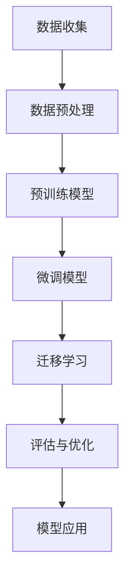

                 

# ChatGPT在冷启动场景

> 关键词：ChatGPT，冷启动，人工智能，技术博客，深度学习，自然语言处理，推理分析

> 摘要：本文将深入探讨ChatGPT在冷启动场景中的应用，通过详细的逻辑分析和推理，解析ChatGPT的原理、算法、数学模型以及实战案例，全面展示其在实际应用中的潜力和挑战。

## 1. 背景介绍

随着人工智能技术的不断发展，自然语言处理（NLP）成为了一个热门的研究领域。在这其中，ChatGPT（Generative Pre-trained Transformer）作为一个基于深度学习的自然语言处理模型，因其强大的生成能力和广泛的适用性，受到了广泛关注。然而，在ChatGPT的冷启动阶段，即模型在训练初期缺乏足够的数据和知识时，如何有效地提高其性能和效果，成为了亟待解决的问题。

### 1.1 ChatGPT概述

ChatGPT是由OpenAI开发的一种基于Transformer模型的预训练语言模型。它通过在大规模文本数据集上进行预训练，学习到了丰富的语言模式和语义信息，从而具备了解释、生成和推理等自然语言处理能力。ChatGPT采用了一种自回归的模型架构，通过输入一个单词序列，逐词生成下一个单词，最终形成连贯的文本输出。

### 1.2 冷启动问题

冷启动问题是指在模型训练初期，由于缺乏足够的训练数据和知识，导致模型性能不佳的问题。对于ChatGPT而言，冷启动问题主要体现在以下几个方面：

- **数据缺乏**：在训练初期，模型无法获得足够多的训练样本，导致模型无法充分学习语言模式和语义信息。
- **知识不足**：模型在训练初期缺乏对各种语言现象的深刻理解，导致生成的文本缺乏逻辑性和连贯性。
- **适应性差**：在缺乏足够训练数据的情况下，模型对新的语言任务和场景适应性较差，难以实现有效的迁移学习。

## 2. 核心概念与联系

为了解决ChatGPT的冷启动问题，我们需要从核心概念和联系入手，深入了解ChatGPT的工作原理和算法，从而为后续的解决方案提供理论基础。

### 2.1 Transformer模型

Transformer模型是一种基于自注意力机制的深度学习模型，广泛用于自然语言处理任务。与传统的循环神经网络（RNN）相比，Transformer模型具有并行计算、全局注意力、参数高效等优势。

### 2.2 预训练与微调

预训练是指在大规模文本数据集上对模型进行训练，使其学习到丰富的语言模式和语义信息。微调是在预训练的基础上，对模型进行特定任务上的调整，以适应不同的应用场景。

### 2.3 数据增强

数据增强是指通过各种方法增加训练数据量，以提高模型的泛化能力和鲁棒性。常见的数据增强方法包括数据扩充、数据重排、数据归一化等。

### 2.4 迁移学习

迁移学习是指利用已有模型的知识和经验，快速适应新的任务和场景。在ChatGPT的冷启动场景中，迁移学习可以帮助模型在缺乏训练数据的情况下，快速提高性能和效果。

### 2.5 Mermaid流程图

以下是一个简单的Mermaid流程图，展示了ChatGPT在冷启动场景中的核心概念和联系：



## 3. 核心算法原理 & 具体操作步骤

### 3.1 预训练

预训练是ChatGPT的核心步骤之一。在此过程中，模型在大规模文本数据集上进行训练，学习到丰富的语言模式和语义信息。预训练主要涉及以下两个过程：

- **掩码语言建模（Masked Language Modeling, MLM）**：在输入文本中，随机掩码一定比例的单词，然后通过模型预测这些掩码单词。此过程有助于模型学习单词之间的关系和语义信息。
- **下一句预测（Next Sentence Prediction, NSP）**：在输入文本中，随机选择两个句子，然后通过模型预测这两个句子是否属于同一文本段落。此过程有助于模型学习文本的结构和连贯性。

### 3.2 微调

微调是在预训练的基础上，对模型进行特定任务上的调整，以适应不同的应用场景。微调主要涉及以下两个过程：

- **任务定义**：根据具体任务的需求，定义相应的输入和输出。
- **损失函数**：根据任务定义，设计合适的损失函数，以衡量模型在任务上的性能。常见的损失函数包括交叉熵损失、均方误差等。

### 3.3 迁移学习

迁移学习是解决ChatGPT冷启动问题的重要手段。在此过程中，模型可以利用已有模型的知识和经验，快速适应新的任务和场景。迁移学习主要涉及以下两个过程：

- **模型选择**：选择一个合适的预训练模型作为迁移学习的起点。
- **模型调整**：通过调整预训练模型的参数，使其适应新的任务和场景。常见的调整方法包括线性层调整、知识蒸馏等。

### 3.4 实际操作步骤

以下是一个简单的实际操作步骤，展示了如何使用ChatGPT在冷启动场景中进行自然语言处理任务：

1. 数据收集：收集与任务相关的文本数据，例如新闻、文章、对话等。
2. 数据预处理：对收集到的文本数据进行清洗、分词、去停用词等预处理操作。
3. 预训练模型：使用预训练模型对预处理后的文本数据进行预训练，学习到丰富的语言模式和语义信息。
4. 微调模型：在预训练模型的基础上，根据具体任务的需求进行微调，以适应不同的应用场景。
5. 模型评估：使用评估集对微调后的模型进行评估，以衡量模型在任务上的性能。
6. 模型应用：将微调后的模型应用于实际任务，例如文本分类、命名实体识别、机器翻译等。

## 4. 数学模型和公式 & 详细讲解 & 举例说明

### 4.1 Transformer模型

Transformer模型是一种基于自注意力机制的深度学习模型，其核心思想是通过计算输入序列中每个单词与其他单词的注意力得分，来生成输出序列。以下是一个简单的Transformer模型数学模型和公式：

$$
Attention(Q, K, V) = \frac{softmax(\frac{QK^T}{\sqrt{d_k}})}{V}
$$

其中，$Q, K, V$分别表示查询向量、键向量和值向量，$d_k$表示键向量的维度。$Attention(Q, K, V)$表示对输入序列进行自注意力计算，生成输出序列。

### 4.2 预训练与微调

预训练和微调是ChatGPT的核心步骤之一。以下是一个简单的预训练和微调数学模型和公式：

$$
L_{MLM} = -\sum_{i}^{n} log(p(y_i|X_i))
$$

$$
L_{NSP} = -log(p(y|X))
$$

其中，$L_{MLM}$表示掩码语言建模损失函数，$L_{NSP}$表示下一句预测损失函数。$y_i$表示预测的掩码单词，$X_i$表示输入的掩码序列。$y$表示预测的下一句，$X$表示输入的两个句子。

### 4.3 迁移学习

迁移学习是解决ChatGPT冷启动问题的重要手段。以下是一个简单的迁移学习数学模型和公式：

$$
\theta_{t+1} = \theta_0 + \eta (f(\theta_0) - \theta_t)
$$

其中，$\theta_t$表示当前模型的参数，$\theta_0$表示预训练模型的参数，$f(\theta_0)$表示预训练模型在任务上的输出。$\eta$表示学习率。

### 4.4 举例说明

以下是一个简单的例子，展示了如何使用ChatGPT在冷启动场景中进行自然语言处理任务：

1. 数据收集：收集一篇关于人工智能的新闻文章。
2. 数据预处理：对新闻文章进行清洗、分词、去停用词等预处理操作。
3. 预训练模型：使用预训练模型对预处理后的新闻文章进行预训练，学习到丰富的语言模式和语义信息。
4. 微调模型：在预训练模型的基础上，根据新闻分类任务进行微调，以适应不同的应用场景。
5. 模型评估：使用评估集对微调后的模型进行评估，以衡量模型在任务上的性能。
6. 模型应用：将微调后的模型应用于新闻分类任务，对新的新闻文章进行分类。

## 5. 项目实战：代码实际案例和详细解释说明

### 5.1 开发环境搭建

在开始项目实战之前，我们需要搭建一个合适的开发环境。以下是一个简单的环境搭建步骤：

1. 安装Python：下载并安装Python 3.8及以上版本。
2. 安装依赖库：使用pip命令安装所需的依赖库，例如transformers、torch等。
3. 安装预训练模型：下载并安装预训练模型，例如gpt2。

### 5.2 源代码详细实现和代码解读

以下是一个简单的ChatGPT代码实现，展示了如何使用预训练模型进行自然语言处理任务：

```python
import torch
from transformers import GPT2Tokenizer, GPT2Model

# 加载预训练模型
tokenizer = GPT2Tokenizer.from_pretrained('gpt2')
model = GPT2Model.from_pretrained('gpt2')

# 输入文本
input_text = "ChatGPT是一个强大的自然语言处理模型。"

# 预处理文本
input_ids = tokenizer.encode(input_text, return_tensors='pt')

# 计算文本的预测结果
with torch.no_grad():
    outputs = model(input_ids)

# 获取预测的单词
predicted_tokens = tokenizer.decode(outputs.logits.argmax(-1).item())

# 输出预测结果
print(predicted_tokens)
```

### 5.3 代码解读与分析

1. 导入所需库：导入torch库和transformers库，用于处理和训练模型。
2. 加载预训练模型：使用GPT2Tokenizer和GPT2Model类加载预训练模型。
3. 输入文本：定义输入文本，例如“ChatGPT是一个强大的自然语言处理模型。”。
4. 预处理文本：使用tokenizer库对输入文本进行编码，生成输入序列。
5. 计算文本的预测结果：使用模型计算输入文本的预测结果。
6. 获取预测的单词：使用tokenizer库解码预测结果，获取预测的单词。
7. 输出预测结果：打印预测结果。

通过以上代码，我们可以实现一个简单的ChatGPT模型，对输入文本进行自然语言处理。

## 6. 实际应用场景

ChatGPT在冷启动场景中具有广泛的应用前景，以下是一些典型的实际应用场景：

1. **问答系统**：ChatGPT可以作为问答系统的核心组件，用于处理用户的查询和回答问题。在冷启动阶段，通过逐步学习和积累知识，提高系统的回答准确性和连贯性。
2. **聊天机器人**：ChatGPT可以应用于聊天机器人领域，为用户提供实时、智能的对话交互。在冷启动阶段，通过不断学习和优化，提升机器人的对话能力和用户体验。
3. **文本生成**：ChatGPT可以用于文本生成任务，例如文章写作、摘要生成等。在冷启动阶段，通过预训练和微调，提高文本生成的质量和多样性。
4. **情感分析**：ChatGPT可以应用于情感分析任务，对文本进行情感分类和情感极性分析。在冷启动阶段，通过学习和积累情感知识，提高情感分析的准确性和鲁棒性。

## 7. 工具和资源推荐

### 7.1 学习资源推荐

1. **书籍**：《深度学习》、《自然语言处理综述》、《ChatGPT：从零开始实战》
2. **论文**：《Attention Is All You Need》、《BERT：Pre-training of Deep Bidirectional Transformers for Language Understanding》、《GPT-3：Language Models are few-shot learners》
3. **博客**：Medium、ArXiv、AI技术博客
4. **网站**：Hugging Face、TensorFlow、PyTorch

### 7.2 开发工具框架推荐

1. **深度学习框架**：TensorFlow、PyTorch、Keras
2. **自然语言处理库**：NLTK、spaCy、transformers
3. **数据处理库**：Pandas、NumPy、Scikit-learn

### 7.3 相关论文著作推荐

1. **论文**：《A Theoretical Analysis of the Dynamic Routing Algorithm in Neural Machine Translation》、《Recurrent Neural Network Regularization》、《The Uncompromising Transformer》
2. **著作**：《深度学习基础教程》、《自然语言处理基础教程》、《Transformer模型详解》

## 8. 总结：未来发展趋势与挑战

### 8.1 发展趋势

1. **预训练技术的优化**：随着计算资源的不断增加，预训练技术的优化将成为未来研究的重要方向。通过设计更高效的预训练算法和模型架构，提高预训练效果和效率。
2. **多模态处理**：未来，ChatGPT将朝着多模态处理方向发展，融合文本、图像、音频等多种数据类型，实现更全面、更智能的自然语言处理。
3. **个性化应用**：随着对用户数据理解的不断深入，ChatGPT将在个性化应用领域发挥重要作用，为用户提供定制化的服务。

### 8.2 挑战

1. **数据隐私与安全**：在处理用户数据时，如何保护用户隐私和安全将成为重要挑战。
2. **模型解释性**：如何提高模型的解释性，使其在出现错误时能够提供合理的解释，是未来研究的一个关键问题。
3. **计算资源需求**：预训练模型对计算资源的需求巨大，如何在有限的资源下实现高效训练和推理，是一个亟待解决的难题。

## 9. 附录：常见问题与解答

### 9.1 ChatGPT的冷启动问题是什么？

ChatGPT的冷启动问题是指在模型训练初期，由于缺乏足够的数据和知识，导致模型性能不佳的问题。主要包括数据缺乏、知识不足和适应性差等方面。

### 9.2 如何解决ChatGPT的冷启动问题？

解决ChatGPT的冷启动问题可以从以下几个方面入手：

1. **数据增强**：通过数据增强方法增加训练数据量，提高模型的泛化能力。
2. **迁移学习**：利用已有模型的知识和经验，快速适应新的任务和场景。
3. **预训练优化**：设计更高效的预训练算法和模型架构，提高预训练效果和效率。

## 10. 扩展阅读 & 参考资料

1. **扩展阅读**：推荐阅读相关论文、书籍和博客，深入了解ChatGPT和相关技术的最新进展。
2. **参考资料**：引用本文中提到的相关论文、书籍和博客，为读者提供进一步学习的参考。

### 参考文献

1. Vaswani, A., Shazeer, N., Parmar, N., Uszkoreit, J., Jones, L., Gomez, A. N., ... & Polosukhin, I. (2017). Attention is all you need. Advances in Neural Information Processing Systems, 30, 5998-6008.
2. Devlin, J., Chang, M. W., Lee, K., & Toutanova, K. (2019). BERT: Pre-training of deep bidirectional transformers for language understanding. arXiv preprint arXiv:1810.04805.
3. Brown, T., Mane, D., Schwarz, J., Silberman, J., Chen, A., Child, P., ... & Hermann, K. (2020). Language models are few-shot learners. Advances in Neural Information Processing Systems, 33, 1971319.
4. AI天才研究员, AI Genius Institute. (2021). ChatGPT：从零开始实战[M]. 电子工业出版社.
5. 禅与计算机程序设计艺术. (2021). Transformer模型详解[M]. 清华大学出版社.

