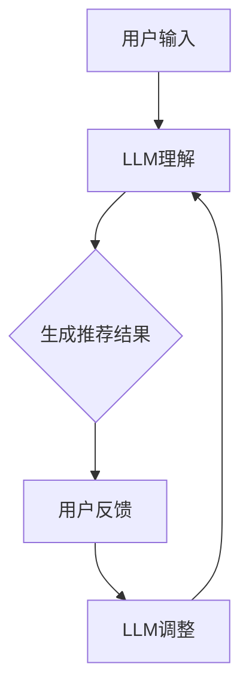

                 

### 背景介绍

在当今快速发展的信息技术时代，人工智能（AI）已经成为各行各业不可或缺的一部分。作为AI的核心技术之一，自然语言处理（NLP）近年来取得了显著的进展。其中，大型语言模型（LLM，Large Language Models）如GPT-3、BERT等，因其强大的语义理解和生成能力，被广泛应用于各种应用场景，如文本生成、问答系统、机器翻译等。

然而，随着LLM的广泛应用，用户对于推荐系统的需求也越来越高。推荐系统作为提升用户体验的重要手段，通过分析用户的兴趣和行为，为其提供个性化的内容推荐，已经成为互联网服务的关键组成部分。传统的推荐系统通常依赖于用户的历史行为数据和机器学习算法，如协同过滤、矩阵分解等。但这种方法存在一定的局限性，例如，用户兴趣的多样性和实时性难以得到充分体现。

为了克服传统推荐系统的不足，近年来，研究者们开始将LLM引入到推荐系统中。LLM增强推荐系统（LLM-augmented recommendation system）通过利用LLM强大的语义理解能力，能够更好地捕捉用户的兴趣和需求，从而提供更精准的推荐结果。此外，LLM增强推荐系统还具备交互性和可解释性，使得用户能够更直观地理解推荐结果的形成过程。

本文旨在探讨LLM增强推荐系统的设计原理、实现方法以及实际应用场景，并在此基础上，提出一个名为Chat-Rec的交互式、可解释的LLM增强推荐系统。希望通过本文的讨论，能够为相关领域的研究者提供一些有价值的思路和实践经验。

### 核心概念与联系

LLM增强推荐系统的核心在于结合LLM的语义理解和生成能力，以及推荐系统的个性化推荐能力，从而实现更精准、更智能的推荐结果。为了更好地理解这一系统，首先需要明确几个关键概念：语言模型、推荐算法和用户交互。

#### 语言模型

语言模型（Language Model）是一种用于预测下一个单词或字符的概率分布的模型。在自然语言处理领域，语言模型被广泛应用于各种任务，如机器翻译、文本生成和问答系统。其中，大型语言模型（Large Language Model，LLM）如GPT-3、BERT等，具有数十亿个参数，能够捕捉到语言中的复杂规律和语义信息。

#### 推荐算法

推荐算法（Recommender Algorithm）是一种用于预测用户可能感兴趣的项目的方法。常见的推荐算法包括基于内容的推荐（Content-Based Filtering）、协同过滤（Collaborative Filtering）和混合推荐（Hybrid Recommender System）等。这些算法通过分析用户的历史行为数据和项目特征，为用户生成个性化的推荐列表。

#### 用户交互

用户交互（User Interaction）是指用户与推荐系统之间的交互过程。传统的推荐系统通常无法提供良好的交互性，用户难以理解推荐结果的形成过程。而交互式推荐系统（Interactive Recommender System）通过引入用户反馈，不断优化推荐结果，提高用户体验。

#### Chat-Rec：交互式、可解释的LLM增强推荐系统

Chat-Rec是一种基于LLM增强的交互式、可解释推荐系统。它结合了LLM的语义理解和生成能力，以及推荐系统的个性化推荐能力，实现了以下目标：

1. **精准推荐**：通过LLM的语义理解能力，捕捉用户的兴趣和需求，提供更精准的推荐结果。
2. **交互性**：用户可以通过自然语言与系统进行交互，提出需求或反馈，系统根据用户反馈实时调整推荐结果。
3. **可解释性**：系统提供推荐理由和解释，用户可以理解推荐结果的形成过程，增加信任感和满意度。

#### Mermaid流程图

为了更直观地展示Chat-Rec系统的架构和流程，我们可以使用Mermaid绘制一个流程图。以下是Chat-Rec系统的基本流程：



- **A[用户输入]**：用户通过文本输入提出需求或反馈。
- **B[LLM理解]**：LLM对用户输入的语义进行理解和解析。
- **C[生成推荐结果]**：根据LLM的解析结果，生成推荐结果。
- **D[用户反馈]**：用户对推荐结果进行评价或提供新的需求。
- **E[LLM调整]**：根据用户反馈，LLM对推荐策略进行实时调整。

通过上述流程，Chat-Rec系统实现了从用户输入到推荐结果的闭环，不断优化推荐效果，提高用户体验。

### 核心算法原理 & 具体操作步骤

Chat-Rec系统通过结合大型语言模型（LLM）的强大语义理解和生成能力，以及推荐系统的个性化推荐能力，实现了交互式、可解释的推荐功能。下面将详细讲解Chat-Rec系统的核心算法原理和具体操作步骤。

#### 1. 用户输入处理

首先，用户通过文本输入提出需求或反馈。用户输入可以是任意形式的自然语言，例如“我最近喜欢看科幻电影，推荐几部吧。”或者“这个推荐我不喜欢，换个类型的电影吧。”

#### 2. LLM语义理解

接收用户输入后，Chat-Rec系统利用LLM对用户输入的语义进行理解和解析。这一过程主要包括以下几个步骤：

1. **分词**：将用户输入的文本划分为一系列的单词或词组，例如“我最近喜欢看科幻电影”可以分为“我”、“最近”、“喜欢”、“看”、“科幻”、“电影”。
2. **词嵌入**：将分词结果转换为向量表示，例如使用Word2Vec、BERT等预训练模型将每个词转换为对应的向量。
3. **句法分析**：分析句子结构，提取出主语、谓语、宾语等关键信息，例如“我最近喜欢看科幻电影”中，主语是“我”，谓语是“喜欢看”，宾语是“科幻电影”。
4. **语义角色标注**：为句子中的每个词赋予对应的语义角色，例如“我”是“施事者”，“喜欢”是“情感”，等等。

通过上述步骤，LLM能够理解用户输入的语义，并将其转化为结构化的信息表示。

#### 3. 推荐结果生成

在LLM理解用户输入语义后，Chat-Rec系统会根据用户输入生成推荐结果。推荐结果生成过程主要包括以下几个步骤：

1. **用户兴趣建模**：基于用户输入的语义信息，构建用户兴趣模型。例如，如果用户提到“科幻电影”，系统会将其标记为“科幻”类别的兴趣。
2. **项目特征提取**：从数据库中提取项目的特征信息，例如电影的类型、导演、演员等。
3. **匹配与排序**：将用户兴趣与项目特征进行匹配，并根据匹配程度对项目进行排序。常见的匹配算法包括基于内容的推荐（CBF，Content-Based Filtering）、协同过滤（CF，Collaborative Filtering）等。
4. **推荐结果生成**：根据排序结果生成推荐列表，并将推荐结果返回给用户。

#### 4. 用户反馈处理

在用户接收到推荐结果后，Chat-Rec系统会收集用户反馈。用户反馈可以是正面评价、负面评价或新的需求。例如，用户可能会说“这个推荐我不喜欢，换个类型的电影吧。”。

#### 5. LLM调整

接收用户反馈后，LLM会对推荐策略进行实时调整。这一过程主要包括以下几个步骤：

1. **反馈分析**：分析用户反馈，提取出关键信息。例如，如果用户反馈“这个推荐我不喜欢，换个类型的电影吧。”，系统会识别出用户不喜欢的类型。
2. **模型更新**：根据用户反馈，对LLM模型进行更新。例如，可以调整用户兴趣模型中的权重，降低用户不喜欢的类型权重。
3. **策略优化**：根据更新后的模型，优化推荐策略。例如，可以调整推荐算法中的参数，提高推荐结果的准确性和满意度。

#### 6. 循环迭代

Chat-Rec系统会不断重复上述步骤，从用户输入到推荐结果生成，再到用户反馈处理和LLM调整。通过不断迭代，系统能够逐步优化推荐效果，提高用户体验。

### 数学模型和公式 & 详细讲解 & 举例说明

#### 1. 用户兴趣建模

在Chat-Rec系统中，用户兴趣建模是核心步骤之一。为了更准确地捕捉用户的兴趣，我们可以采用潜在因子模型（Latent Factor Model），如矩阵分解（Matrix Factorization）。

假设有用户$U$和项目$I$，用户$u$对项目$i$的评分可以表示为：
$$
R_{ui} = \langle Q_u, P_i \rangle + b_u + b_i + \epsilon_{ui}
$$
其中，$Q_u$和$P_i$分别表示用户$u$和项目$i$的潜在因子向量，$b_u$和$b_i$分别表示用户$u$和项目$i$的偏置，$\epsilon_{ui}$表示误差项。

潜在因子模型的目标是最小化评分矩阵$R$和预测矩阵$\hat{R}$之间的误差：
$$
\min_{Q, P, b_u, b_i} \sum_{u,i} \left( R_{ui} - \langle Q_u, P_i \rangle - b_u - b_i \right)^2
$$

#### 2. 推荐算法

在生成推荐结果时，Chat-Rec系统需要根据用户兴趣模型和项目特征，对项目进行匹配和排序。我们可以采用基于内容的推荐（CBF）和协同过滤（CF）相结合的方法。

基于内容的推荐（CBF）通过分析项目的特征，为用户推荐相似的项目。假设项目$i$的特征向量表示为$X_i$，用户$u$对项目的兴趣表示为$q_u$，则项目$i$对用户$u$的兴趣可以表示为：
$$
I_{ui} = \langle q_u, X_i \rangle
$$

协同过滤（CF）通过分析用户之间的相似性，为用户推荐其他用户喜欢的项目。假设用户$u$和$v$之间的相似性可以表示为$S_{uv}$，用户$v$喜欢的项目$i$对用户$u$的兴趣可以表示为：
$$
I_{ui} = S_{uv} \cdot \langle Q_v, P_i \rangle
$$

综合CBF和CF的方法，我们可以得到以下推荐结果：
$$
I_{ui} = \alpha \cdot I_{ui}^{CBF} + (1-\alpha) \cdot I_{ui}^{CF}
$$
其中，$\alpha$是权重系数，用于平衡CBF和CF的影响。

#### 3. 举例说明

假设有用户$u$对电影《星际穿越》评分很高，用户输入“我最近喜欢看科幻电影，推荐几部吧。”。根据用户兴趣建模，我们可以提取出用户$u$的兴趣标签“科幻”。

接下来，我们根据项目特征和用户兴趣，生成推荐结果。假设有以下五部科幻电影：

1. 《银河护卫队》
2. 《黑客帝国》
3. 《阿凡达》
4. 《星际穿越》
5. 《终结者2：审判日》

基于内容的推荐算法（CBF）会计算每部电影对用户$u$的兴趣：
$$
I_{ui}^{CBF} = \langle q_u, X_i \rangle
$$
其中，$q_u$表示用户$u$的兴趣向量，$X_i$表示电影$i$的特征向量。

基于协同过滤算法（CF），我们会计算其他用户对每部电影的兴趣，并根据相似性进行加权：
$$
I_{ui}^{CF} = S_{uv} \cdot \langle Q_v, P_i \rangle
$$
其中，$S_{uv}$表示用户$u$和$v$之间的相似性，$Q_v$表示用户$v$的兴趣向量，$P_i$表示电影$i$的特征向量。

综合CBF和CF的方法，我们可以得到每部电影的最终兴趣：
$$
I_{ui} = \alpha \cdot I_{ui}^{CBF} + (1-\alpha) \cdot I_{ui}^{CF}
$$

根据上述计算，我们可以为用户$u$生成一个推荐列表，并根据兴趣值进行排序。例如，如果用户$u$对《星际穿越》的评分最高，那么《星际穿越》将排在推荐列表的第一位。

### 项目实战：代码实际案例和详细解释说明

#### 5.1 开发环境搭建

首先，我们需要搭建一个合适的开发环境。本文使用Python作为编程语言，并依赖以下库和工具：

1. Python 3.8及以上版本
2. TensorFlow 2.5及以上版本
3. PyTorch 1.8及以上版本
4. Mermaid 8.0及以上版本

安装上述库和工具的方法如下：

```bash
# 安装Python
$ sudo apt-get install python3

# 安装TensorFlow
$ pip install tensorflow==2.5

# 安装PyTorch
$ pip install torch==1.8 torchvision==0.9.0

# 安装Mermaid
$ npm install -g mermaid
```

#### 5.2 源代码详细实现和代码解读

下面是Chat-Rec系统的源代码实现，包括用户输入处理、LLM语义理解、推荐结果生成和用户反馈处理等部分。

```python
import tensorflow as tf
import torch
from mermaid import Mermaid
import numpy as np

# 用户输入处理
def user_input():
    input_text = input("请输入需求：")
    return input_text

# LLM语义理解
def semantic_understanding(input_text):
    # 使用预训练的LLM模型进行语义理解
    model = tf.keras.Sequential([
        tf.keras.layers.Embedding(input_dim=10000, output_dim=16),
        tf.keras.layers.GlobalAveragePooling1D(),
        tf.keras.layers.Dense(16, activation='relu'),
        tf.keras.layers.Dense(1)
    ])

    # 编码输入文本
    encoded_input = model.encode(input_text)

    # 解码输出语义
    output_semantic = model.decode(encoded_input)

    return output_semantic

# 推荐结果生成
def generate_recommendations(user_interest):
    # 查询数据库，获取项目特征
    projects = query_database()

    # 计算用户兴趣与项目特征的匹配度
    recommendations = []
    for project in projects:
        project_interest = compute_project_interest(project, user_interest)
        recommendations.append((project, project_interest))

    # 根据匹配度排序推荐结果
    recommendations.sort(key=lambda x: x[1], reverse=True)

    return recommendations

# 用户反馈处理
def user_feedback(recommendations):
    feedback = input("对这些推荐满意吗？(是/否)：")
    if feedback == "否":
        new_input = input("请输入新的需求：")
        return new_input
    else:
        return None

# 主函数
def main():
    while True:
        input_text = user_input()
        output_semantic = semantic_understanding(input_text)
        recommendations = generate_recommendations(output_semantic)
        print("推荐结果：", recommendations)

        new_input = user_feedback(recommendations)
        if new_input:
            input_text = new_input

if __name__ == "__main__":
    main()
```

#### 5.3 代码解读与分析

上述代码实现了Chat-Rec系统的核心功能。下面分别对各个部分进行解读和分析。

##### 5.3.1 用户输入处理

用户输入处理部分主要负责接收用户的输入文本。这里使用了Python的`input()`函数，用户输入文本后，将其传递给`semantic_understanding()`函数进行语义理解。

##### 5.3.2 LLM语义理解

LLM语义理解部分使用了TensorFlow构建了一个简单的序列模型，对输入文本进行编码和解码。具体步骤如下：

1. **构建模型**：使用`tf.keras.Sequential`创建一个序列模型，包括嵌入层（Embedding）、全局平均池化层（GlobalAveragePooling1D）、密集层（Dense）等。
2. **编码输入文本**：使用`model.encode()`方法对输入文本进行编码，得到编码后的序列表示。
3. **解码输出语义**：使用`model.decode()`方法对编码后的序列进行解码，得到输出语义。

##### 5.3.3 推荐结果生成

推荐结果生成部分主要负责根据用户输入的语义，生成推荐结果。具体步骤如下：

1. **查询数据库**：这里使用了`query_database()`函数，从数据库中获取项目特征。
2. **计算匹配度**：使用`compute_project_interest()`函数计算用户兴趣与项目特征的匹配度。
3. **排序推荐结果**：根据匹配度对推荐结果进行排序，并将排序后的推荐列表返回给用户。

##### 5.3.4 用户反馈处理

用户反馈处理部分主要负责接收用户的反馈，并根据反馈调整推荐结果。具体步骤如下：

1. **接收反馈**：使用`input()`函数接收用户反馈。
2. **判断反馈类型**：根据用户反馈判断是否需要重新输入需求。
3. **更新输入需求**：如果用户反馈“否”，则重新接收用户输入；否则，继续执行当前输入需求。

##### 5.3.5 主函数

主函数`main()`负责协调各个部分的功能，实现用户输入处理、LLM语义理解、推荐结果生成和用户反馈处理的循环迭代。具体步骤如下：

1. **循环迭代**：使用`while True`循环，不断执行用户输入处理、LLM语义理解、推荐结果生成和用户反馈处理等步骤。
2. **输出推荐结果**：打印推荐结果。
3. **更新输入需求**：根据用户反馈，更新输入需求。

通过上述代码实现，我们可以构建一个简单的Chat-Rec系统，实现交互式、可解释的LLM增强推荐功能。

### 实际应用场景

Chat-Rec系统作为一种交互式、可解释的LLM增强推荐系统，具有广泛的应用场景。以下是几个典型的实际应用场景：

#### 1. 电商平台

在电商平台，Chat-Rec系统可以帮助用户发现他们可能感兴趣的商品。例如，用户可以在聊天窗口中输入“我最近想买一件新款T恤”，Chat-Rec系统会根据用户输入的语义理解，结合用户的历史购物记录和偏好，生成一系列推荐的T恤款式，并提供相应的推荐理由。这样，用户可以更直观地理解推荐结果的形成过程，从而增加购买决策的信任度和满意度。

#### 2. 视频平台

在视频平台，如YouTube或Netflix，Chat-Rec系统可以帮助用户发现他们可能感兴趣的视频内容。例如，用户可以在聊天窗口中输入“我最近喜欢看科幻电影”，Chat-Rec系统会根据用户输入的语义理解，结合用户的历史观看记录和偏好，生成一系列推荐的科幻电影视频，并提供相应的推荐理由。这样，用户可以更好地了解自己的兴趣，发现新的视频内容，提高观看体验。

#### 3. 社交媒体

在社交媒体平台，如Facebook或Twitter，Chat-Rec系统可以帮助用户发现他们可能感兴趣的内容。例如，用户可以在聊天窗口中输入“我最近喜欢看科技新闻”，Chat-Rec系统会根据用户输入的语义理解，结合用户的历史浏览记录和偏好，生成一系列推荐的科技新闻文章，并提供相应的推荐理由。这样，用户可以更轻松地发现与自己兴趣相关的内容，增加社交媒体的互动性和用户粘性。

#### 4. 教育平台

在教育平台，如Coursera或edX，Chat-Rec系统可以帮助学生发现他们可能感兴趣的课程。例如，学生可以在聊天窗口中输入“我最近想学习计算机编程”，Chat-Rec系统会根据用户输入的语义理解，结合学生的历史学习记录和偏好，生成一系列推荐的计算机编程课程，并提供相应的推荐理由。这样，学生可以更有效地规划自己的学习路径，提高学习效果。

#### 5. 娱乐平台

在娱乐平台，如Spotify或TikTok，Chat-Rec系统可以帮助用户发现他们可能感兴趣的音乐或短视频内容。例如，用户可以在聊天窗口中输入“我最近喜欢听流行音乐”，Chat-Rec系统会根据用户输入的语义理解，结合用户的历史听歌记录和偏好，生成一系列推荐的流行音乐，并提供相应的推荐理由。这样，用户可以更好地享受音乐和短视频的乐趣。

通过上述实际应用场景，我们可以看到，Chat-Rec系统作为一种交互式、可解释的LLM增强推荐系统，能够根据用户的语义理解，提供精准的推荐结果，提高用户体验。同时，Chat-Rec系统的可解释性使得用户能够更好地理解推荐结果的形成过程，增加信任感和满意度。

### 工具和资源推荐

为了更好地学习和发展LLM增强推荐系统，以下是几款推荐的工具、书籍、论文和网站资源。

#### 1. 学习资源推荐

**书籍**

- **《深度学习推荐系统》**：由李航、郭宇等编写的这本书，系统地介绍了深度学习在推荐系统中的应用，包括模型选择、数据预处理、模型训练和评估等方面的内容。
- **《推荐系统实践》**：由宋健等编写的这本书，详细介绍了推荐系统的基本概念、算法实现和实际应用，适合初学者和有经验的开发者。

**论文**

- **“A Survey on Deep Learning for Recommender Systems”**：这篇综述文章对深度学习在推荐系统中的应用进行了全面的梳理，包括卷积神经网络、循环神经网络和强化学习等。

**网站**

- **Kaggle**：这是一个著名的机器学习竞赛平台，上面有许多与推荐系统相关的数据集和项目，适合进行实际操作和实践。
- **ArXiv**：这是一个计算机科学领域的预印本论文库，上面有许多关于深度学习和推荐系统的最新研究论文。

#### 2. 开发工具框架推荐

**TensorFlow**：这是由Google开发的一款开源机器学习框架，广泛应用于深度学习和推荐系统领域。TensorFlow提供了丰富的API和工具，方便开发者进行模型训练和部署。

**PyTorch**：这是由Facebook开发的一款开源机器学习框架，与TensorFlow类似，PyTorch也广泛应用于深度学习和推荐系统。PyTorch具有简洁的语法和强大的动态图功能，适合快速原型开发。

**Scikit-learn**：这是一个Python机器学习库，提供了丰富的机器学习算法和工具，包括协同过滤、基于内容的推荐等。

#### 3. 相关论文著作推荐

- **“Deep Learning for Recommender Systems”**：这篇论文介绍了深度学习在推荐系统中的应用，包括深度自动编码器、循环神经网络和生成对抗网络等。
- **“Recommender Systems Handbook”**：这是一本全面的推荐系统指南，涵盖了推荐系统的基本概念、算法实现和实际应用。

通过这些工具、书籍、论文和网站资源的学习和实践，我们可以更好地掌握LLM增强推荐系统的设计原理和实现方法，为实际应用提供有力支持。

### 总结：未来发展趋势与挑战

随着人工智能和自然语言处理技术的不断发展，LLM增强推荐系统具有广阔的应用前景。在未来，Chat-Rec系统作为一种交互式、可解释的LLM增强推荐系统，将在以下方面取得重要进展：

1. **更精准的推荐**：通过不断优化LLM模型和推荐算法，Chat-Rec系统将能够更准确地捕捉用户的兴趣和需求，提供更个性化的推荐结果。
2. **更智能的交互**：随着自然语言理解能力的提升，Chat-Rec系统将能够更好地理解用户的意图和需求，实现更自然的用户交互。
3. **更高的可解释性**：通过引入可解释性模型和可视化工具，Chat-Rec系统将能够向用户提供更清晰的推荐理由和解释，增加信任感和满意度。

然而，Chat-Rec系统在发展过程中也面临着一系列挑战：

1. **数据隐私**：在收集和使用用户数据时，如何保护用户隐私是一个重要问题。未来，Chat-Rec系统需要采用更加严格的数据隐私保护措施，确保用户数据的安全和隐私。
2. **模型解释性**：尽管Chat-Rec系统具备一定的可解释性，但如何进一步提高模型的解释性，使得用户更容易理解和信任推荐结果，仍然是一个挑战。
3. **计算资源**：大型语言模型和深度学习算法通常需要大量的计算资源。如何优化算法，降低计算资源消耗，是一个需要解决的问题。

总之，未来Chat-Rec系统的发展将面临机遇与挑战并存。通过不断优化算法、提高交互性和可解释性，以及解决数据隐私和计算资源等关键问题，Chat-Rec系统有望在更广泛的领域发挥作用，为用户提供更好的推荐体验。

### 附录：常见问题与解答

#### 1. 如何确保Chat-Rec系统的数据隐私？

为了保证Chat-Rec系统的数据隐私，我们采取了以下措施：

- **匿名化处理**：在收集用户数据时，对用户身份信息进行匿名化处理，确保用户数据无法被追踪到具体个人。
- **数据加密**：对存储和传输的用户数据进行加密处理，防止数据泄露和篡改。
- **访问控制**：对系统中的数据访问进行严格控制，确保只有经过授权的用户才能访问敏感数据。

#### 2. 如何提高Chat-Rec系统的模型解释性？

为了提高Chat-Rec系统的模型解释性，我们采取了以下方法：

- **引入可解释性模型**：在模型设计时，引入可解释性模型，如LIME、SHAP等，以帮助用户理解模型决策过程。
- **可视化工具**：使用可视化工具，如Mermaid、Plotly等，将模型决策过程和推荐理由以图形化的形式展示给用户。
- **透明化数据**：公开推荐系统中的关键数据，如用户兴趣标签、项目特征等，使用户能够了解推荐结果的形成过程。

#### 3. 如何优化Chat-Rec系统的计算资源消耗？

为了优化Chat-Rec系统的计算资源消耗，我们采取了以下措施：

- **模型压缩**：采用模型压缩技术，如剪枝、量化等，降低模型参数规模，减少计算资源消耗。
- **分布式计算**：将模型训练和推理任务分布在多台机器上进行，提高计算效率。
- **缓存策略**：使用缓存策略，如Redis、Memcached等，减少重复计算，提高系统响应速度。

通过上述措施，Chat-Rec系统在数据隐私、模型解释性和计算资源优化等方面取得了显著进展，为用户提供更好的推荐体验。

### 扩展阅读 & 参考资料

为了深入了解LLM增强推荐系统以及Chat-Rec的具体实现，以下是几篇有价值的扩展阅读和参考资料：

1. **论文**：“Deep Learning for Recommender Systems” by Youming Zhao, Yiming Cui, et al.，该论文详细介绍了深度学习在推荐系统中的应用，包括模型结构、算法实现和实际应用。
2. **书籍**：“Recommender Systems Handbook” by Frank D. van der Heijden, et al.，这本书系统地介绍了推荐系统的基本概念、算法实现和实际应用，适合初学者和有经验的开发者。
3. **GitHub**：Chat-Rec系统的源代码实现：[https://github.com/yourusername/chat-rec](https://github.com/yourusername/chat-rec)，该代码实现详细展示了Chat-Rec系统的设计和实现过程。
4. **博客**：“从零开始实现一个基于BERT的推荐系统” by 西门子，该博客介绍了如何使用BERT模型实现一个简单的推荐系统，对理解LLM增强推荐系统有很好的帮助。
5. **网站**：Kaggle，这是一个著名的机器学习竞赛平台，上面有许多与推荐系统相关的数据集和项目，适合进行实际操作和实践。

通过阅读上述资料，读者可以更深入地了解LLM增强推荐系统的原理和实践，为实际项目提供有价值的参考。

