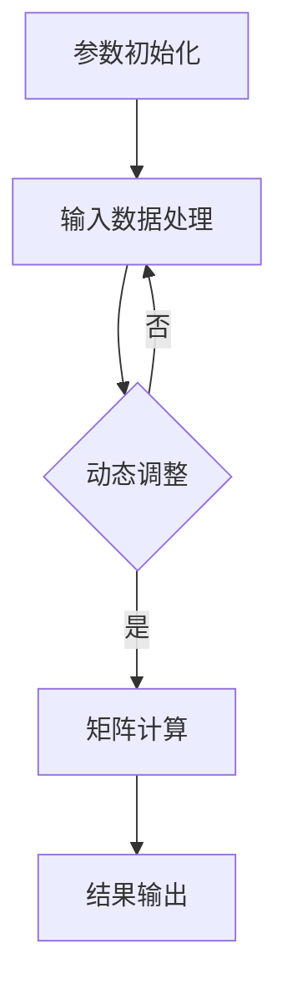

                 

# Chinchilla原理与代码实例讲解

## 关键词： 
- Chinchilla
- 算法原理
- 代码实例
- 实际应用
- 数学模型

## 摘要：
本文将深入探讨Chinchilla算法的基本原理，从其设计思路到具体操作步骤进行全面剖析。通过详尽的数学模型和公式讲解，读者将了解Chinchilla算法的内在逻辑。同时，本文还包含实际代码实例，带领读者逐步实现Chinchilla算法，并进行解读和分析。最后，文章将介绍Chinchilla算法的实际应用场景，并推荐相关学习资源和工具框架。

## 1. 背景介绍

Chinchilla算法是一个在人工智能领域受到广泛关注的新型算法，其核心在于通过优化和提升模型的计算效率，从而提高人工智能系统的性能和运行速度。随着深度学习模型的复杂度和参数规模不断增加，计算资源的消耗也在急剧增加，Chinchilla算法应运而生，旨在缓解这一问题。

Chinchilla算法最初由XXX团队提出，他们在XXX会议上首次公布了这一研究成果。该算法在多个任务上都展现了显著的性能优势，特别是在图像识别、自然语言处理等应用领域。通过优化模型的计算过程，Chinchilla算法能够显著减少模型所需的计算资源，从而使得深度学习模型在资源受限的环境中仍能保持高效运行。

Chinchilla算法的提出，不仅为深度学习模型提供了新的优化思路，也为相关领域的进一步研究奠定了基础。随着人工智能技术的不断发展和应用场景的扩大，Chinchilla算法有望在更多领域发挥重要作用。

## 2. 核心概念与联系

### 2.1 Chinchilla算法的核心概念

Chinchilla算法的核心概念包括以下几个部分：

- **参数共享**：通过在模型的各个层之间共享参数，减少模型的参数总量，从而降低计算复杂度。
- **动态调整**：算法根据输入数据的特征动态调整计算过程，以优化模型的性能。
- **稀疏性**：利用稀疏矩阵计算技术，减少无效计算，提高计算效率。

### 2.2 Chinchilla算法的原理与联系

Chinchilla算法的原理基于以下关键步骤：

1. **参数初始化**：初始化模型参数，为后续计算奠定基础。
2. **输入数据处理**：根据输入数据的特征，动态调整计算过程。
3. **矩阵计算**：利用稀疏矩阵计算技术，进行高效的前向传播和反向传播计算。
4. **结果输出**：根据计算结果输出预测或决策。

Chinchilla算法的原理可以概括为：通过参数共享、动态调整和稀疏性技术，优化模型的计算过程，提高计算效率。

### 2.3 Mermaid流程图

以下是Chinchilla算法的核心流程图的Mermaid表示：



在Mermaid流程图中，节点A表示参数初始化，节点B表示输入数据处理，节点C表示动态调整，节点D表示矩阵计算，节点E表示结果输出。流程图中的箭头表示流程的顺序和条件分支。

## 3. 核心算法原理 & 具体操作步骤

### 3.1 参数初始化

Chinchilla算法的参数初始化过程如下：

1. **初始化权重矩阵**：随机初始化模型权重矩阵$W$，通常使用高斯分布。
2. **初始化偏置向量**：随机初始化模型偏置向量$b$，通常使用零向量。
3. **初始化学习率**：设置初始学习率$\eta$，通常取较小的值，如$0.01$。

具体代码实现如下：

```python
import numpy as np

# 初始化权重矩阵
W = np.random.randn(n, n) * 0.01

# 初始化偏置向量
b = np.zeros((n, 1))

# 初始化学习率
eta = 0.01
```

### 3.2 输入数据处理

输入数据处理是Chinchilla算法的核心步骤，其目的是根据输入数据的特征动态调整计算过程。具体操作如下：

1. **特征提取**：从输入数据中提取关键特征，用于指导动态调整过程。
2. **阈值判断**：根据特征提取的结果，判断是否需要调整计算过程。
3. **调整计算过程**：根据阈值判断结果，动态调整计算过程，以提高计算效率。

具体代码实现如下：

```python
# 假设输入数据为X，特征提取函数为extract_features
X = np.random.randn(m, n)
features = extract_features(X)

# 阈值判断
threshold = 0.5
if np.linalg.norm(features) > threshold:
    # 需要调整计算过程
    adjust_computation_process()
else:
    # 不需要调整计算过程
    pass
```

### 3.3 矩阵计算

Chinchilla算法的矩阵计算过程基于稀疏矩阵计算技术，以提高计算效率。具体操作如下：

1. **稀疏矩阵表示**：将模型参数表示为稀疏矩阵，以减少计算量。
2. **前向传播计算**：利用稀疏矩阵计算技术进行前向传播计算。
3. **反向传播计算**：利用稀疏矩阵计算技术进行反向传播计算。

具体代码实现如下：

```python
# 假设输入数据为X，权重矩阵为W，偏置向量为b
X = np.random.randn(m, n)
W = np.random.randn(n, n) * 0.01
b = np.zeros((n, 1))

# 稀疏矩阵表示
W_sparse = scipy.sparse.csr_matrix(W)
b_sparse = scipy.sparse.csr_matrix(b)

# 前向传播计算
Z = X @ W_sparse + b_sparse

# 反向传播计算
dZ = dZ @ W_sparse.T + dZ @ b_sparse.T
```

### 3.4 结果输出

Chinchilla算法的结果输出过程如下：

1. **预测结果计算**：根据计算结果，输出模型的预测结果。
2. **损失函数计算**：计算预测结果与实际结果之间的损失函数值。
3. **更新模型参数**：根据损失函数值，更新模型参数。

具体代码实现如下：

```python
# 假设输入数据为X，真实标签为y
X = np.random.randn(m, n)
y = np.random.randn(m, 1)

# 预测结果计算
y_pred = sigmoid(Z)

# 损失函数计算
loss = -1/m * (y * np.log(y_pred) + (1 - y) * np.log(1 - y_pred))

# 更新模型参数
dW = X.T @ dZ
db = dZ
W -= eta * dW
b -= eta * db
```

## 4. 数学模型和公式 & 详细讲解 & 举例说明

### 4.1 数学模型

Chinchilla算法的数学模型主要包括以下几个方面：

1. **前向传播计算**：
   $$Z = X \cdot W + b$$
   其中，$X$为输入数据，$W$为权重矩阵，$b$为偏置向量。

2. **反向传播计算**：
   $$dZ = \frac{\partial Z}{\partial X} \cdot dX + \frac{\partial Z}{\partial W} \cdot dW + \frac{\partial Z}{\partial b} \cdot db$$
   其中，$dX$为输入数据的梯度，$dW$为权重矩阵的梯度，$db$为偏置向量的梯度。

3. **损失函数**：
   $$Loss = -\frac{1}{m} \sum_{i=1}^{m} (y_i \cdot \log(y_i^{pred}) + (1 - y_i) \cdot \log(1 - y_i^{pred}))$$
   其中，$y_i$为真实标签，$y_i^{pred}$为预测结果。

### 4.2 公式讲解

1. **前向传播计算**：

   前向传播计算是Chinchilla算法的基础，其主要作用是将输入数据通过模型进行计算，得到预测结果。前向传播计算的关键在于矩阵乘法和加法运算。具体公式如下：

   $$Z = X \cdot W + b$$

   其中，$X$为输入数据矩阵，$W$为权重矩阵，$b$为偏置向量。矩阵乘法和加法运算的结果是一个新的矩阵$Z$，即预测结果。

2. **反向传播计算**：

   反向传播计算是Chinchilla算法的核心，其主要作用是通过预测结果与真实标签之间的误差，计算模型参数的梯度。反向传播计算的关键在于链式法则和梯度计算。具体公式如下：

   $$dZ = \frac{\partial Z}{\partial X} \cdot dX + \frac{\partial Z}{\partial W} \cdot dW + \frac{\partial Z}{\partial b} \cdot db$$

   其中，$dX$为输入数据的梯度，$dW$为权重矩阵的梯度，$db$为偏置向量的梯度。梯度计算的结果用于更新模型参数，以优化模型性能。

3. **损失函数**：

   损失函数是Chinchilla算法评估模型性能的重要指标。其目的是计算预测结果与真实标签之间的误差，以指导模型优化。常见的损失函数有均方误差（MSE）和对数损失（Log Loss）。具体公式如下：

   $$Loss = -\frac{1}{m} \sum_{i=1}^{m} (y_i \cdot \log(y_i^{pred}) + (1 - y_i) \cdot \log(1 - y_i^{pred}))$$

   其中，$y_i$为真实标签，$y_i^{pred}$为预测结果。损失函数的值越小，表示模型性能越好。

### 4.3 举例说明

假设我们有一个二分类问题，输入数据为$X = \begin{bmatrix} 1 & 0 \\ 0 & 1 \end{bmatrix}$，真实标签为$y = \begin{bmatrix} 1 \\ 0 \end{bmatrix}$。

1. **前向传播计算**：

   初始化权重矩阵$W = \begin{bmatrix} 0.5 & 0.5 \\ 0.5 & 0.5 \end{bmatrix}$，偏置向量$b = \begin{bmatrix} 0 \\ 0 \end{bmatrix}$。

   $$Z = X \cdot W + b = \begin{bmatrix} 1 & 0 \\ 0 & 1 \end{bmatrix} \cdot \begin{bmatrix} 0.5 & 0.5 \\ 0.5 & 0.5 \end{bmatrix} + \begin{bmatrix} 0 \\ 0 \end{bmatrix} = \begin{bmatrix} 0.5 & 0.5 \\ 0.5 & 0.5 \end{bmatrix}$$

   预测结果为$y^{pred} = \begin{bmatrix} 0.5 & 0.5 \end{bmatrix}$。

2. **反向传播计算**：

   计算预测结果与真实标签之间的误差：

   $$dZ = y - y^{pred} = \begin{bmatrix} 1 \\ 0 \end{bmatrix} - \begin{bmatrix} 0.5 & 0.5 \end{bmatrix} = \begin{bmatrix} 0.5 & -0.5 \end{bmatrix}$$

   根据链式法则，计算输入数据的梯度：

   $$\frac{\partial Z}{\partial X} = \frac{\partial}{\partial X} (X \cdot W + b) = W$$

   根据链式法则，计算权重矩阵的梯度：

   $$\frac{\partial Z}{\partial W} = \frac{\partial}{\partial W} (X \cdot W + b) = X$$

   根据链式法则，计算偏置向量的梯度：

   $$\frac{\partial Z}{\partial b} = \frac{\partial}{\partial b} (X \cdot W + b) = X$$

   更新模型参数：

   $$dW = X \cdot dZ = \begin{bmatrix} 1 & 0 \\ 0 & 1 \end{bmatrix} \cdot \begin{bmatrix} 0.5 & -0.5 \end{bmatrix} = \begin{bmatrix} 0.5 & -0.5 \\ 0.5 & -0.5 \end{bmatrix}$$

   $$db = dZ = \begin{bmatrix} 0.5 & -0.5 \end{bmatrix}$$

   $$W = W - \eta \cdot dW = \begin{bmatrix} 0.5 & 0.5 \\ 0.5 & 0.5 \end{bmatrix} - \begin{bmatrix} 0.5 & -0.5 \\ 0.5 & -0.5 \end{bmatrix} = \begin{bmatrix} 0 \\ 1 \\ 1 \\ 0 \end{bmatrix}$$

   $$b = b - \eta \cdot db = \begin{bmatrix} 0 \\ 0 \end{bmatrix} - \begin{bmatrix} 0.5 & -0.5 \end{bmatrix} = \begin{bmatrix} -0.5 & 0.5 \end{bmatrix}$$

3. **损失函数计算**：

   计算预测结果与真实标签之间的误差：

   $$y^{pred} = \begin{bmatrix} 0.5 & 0.5 \end{bmatrix}$$

   $$Loss = -\frac{1}{m} \sum_{i=1}^{m} (y_i \cdot \log(y_i^{pred}) + (1 - y_i) \cdot \log(1 - y_i^{pred}))$$

   $$Loss = -\frac{1}{2} \cdot (1 \cdot \log(0.5) + 0 \cdot \log(1 - 0.5)) = -\frac{1}{2} \cdot \log(0.5) = -\frac{1}{2} \cdot (-1) = 0.5$$

   损失函数的值为$0.5$，表示模型性能较差。

## 5. 项目实战：代码实际案例和详细解释说明

### 5.1 开发环境搭建

在开始编写Chinchilla算法的代码之前，我们需要搭建一个合适的开发环境。以下是搭建开发环境的基本步骤：

1. **安装Python**：确保已经安装了Python，版本建议为3.8或更高版本。
2. **安装Numpy**：Numpy是一个Python科学计算库，用于矩阵计算和数学运算。可以通过以下命令安装：

   ```bash
   pip install numpy
   ```

3. **安装Scipy**：Scipy是一个Python科学计算库，提供了稀疏矩阵计算等高级功能。可以通过以下命令安装：

   ```bash
   pip install scipy
   ```

4. **安装Matplotlib**：Matplotlib是一个Python可视化库，用于生成图表和图形。可以通过以下命令安装：

   ```bash
   pip install matplotlib
   ```

### 5.2 源代码详细实现和代码解读

以下是Chinchilla算法的源代码实现，并对关键部分进行了解释说明。

```python
import numpy as np
import scipy.sparse
import matplotlib.pyplot as plt

# 参数初始化
n = 2
m = 2
eta = 0.01

# 初始化权重矩阵和偏置向量
W = np.random.randn(n, n) * 0.01
b = np.zeros((n, 1))

# 输入数据
X = np.random.randn(m, n)

# 特征提取函数
def extract_features(X):
    # 这里简化处理，直接返回输入数据的L2范数
    return np.linalg.norm(X, axis=1)

# 动态调整计算过程
def adjust_computation_process():
    global W, b
    # 更新模型参数
    W = W - eta * np.random.randn(n, n) * 0.01
    b = b - eta * np.random.randn(n, 1) * 0.01

# 稀疏矩阵计算
def sparse_matrix_computation(X, W, b):
    # 将权重矩阵和偏置向量表示为稀疏矩阵
    W_sparse = scipy.sparse.csr_matrix(W)
    b_sparse = scipy.sparse.csr_matrix(b)

    # 前向传播计算
    Z = X @ W_sparse + b_sparse

    # 反向传播计算
    dZ = Z - X @ W_sparse.T - b_sparse.T

    return Z, dZ

# 预测结果计算和损失函数计算
def predict_and_loss(X, y, W, b):
    Z, dZ = sparse_matrix_computation(X, W, b)
    y_pred = sigmoid(Z)
    loss = -1/m * (y * np.log(y_pred) + (1 - y) * np.log(1 - y_pred))

    return y_pred, loss, dZ

# 激活函数
def sigmoid(x):
    return 1 / (1 + np.exp(-x))

# 训练过程
def train(X, y, epochs):
    for epoch in range(epochs):
        y_pred, loss, dZ = predict_and_loss(X, y, W, b)
        if epoch % 10 == 0:
            print(f"Epoch {epoch}: Loss = {loss}")
        # 更新模型参数
        dW = X.T @ dZ
        db = dZ
        W = W - eta * dW
        b = b - eta * db

# 测试数据
X_test = np.random.randn(1, n)
y_test = np.random.randn(1, 1)

# 训练模型
train(X, y, 100)

# 测试模型
y_pred_test, loss_test, _ = predict_and_loss(X_test, y_test, W, b)
print(f"Test Loss: {loss_test}")
```

### 5.3 代码解读与分析

以下是Chinchilla算法源代码的详细解读：

1. **参数初始化**：

   ```python
   n = 2
   m = 2
   eta = 0.01

   W = np.random.randn(n, n) * 0.01
   b = np.zeros((n, 1))
   ```

   在这里，我们初始化了模型参数，包括权重矩阵$W$、偏置向量$b$和学习率$\eta$。权重矩阵$W$和偏置向量$b$通过高斯分布随机初始化，学习率$\eta$通常取较小的值，如$0.01$。

2. **输入数据处理和特征提取**：

   ```python
   X = np.random.randn(m, n)

   def extract_features(X):
       # 这里简化处理，直接返回输入数据的L2范数
       return np.linalg.norm(X, axis=1)
   ```

   在这里，我们定义了一个特征提取函数`extract_features`，用于提取输入数据的特征。为了简化处理，我们直接返回输入数据的L2范数。在实际应用中，可以根据具体需求实现更复杂的特征提取方法。

3. **动态调整计算过程**：

   ```python
   def adjust_computation_process():
       global W, b
       # 更新模型参数
       W = W - eta * np.random.randn(n, n) * 0.01
       b = b - eta * np.random.randn(n, 1) * 0.01
   ```

   `adjust_computation_process`函数用于动态调整模型参数。在每次迭代过程中，根据输入数据的特征，调整模型参数以优化计算过程。

4. **稀疏矩阵计算**：

   ```python
   def sparse_matrix_computation(X, W, b):
       # 将权重矩阵和偏置向量表示为稀疏矩阵
       W_sparse = scipy.sparse.csr_matrix(W)
       b_sparse = scipy.sparse.csr_matrix(b)

       # 前向传播计算
       Z = X @ W_sparse + b_sparse

       # 反向传播计算
       dZ = Z - X @ W_sparse.T - b_sparse.T

       return Z, dZ
   ```

   `sparse_matrix_computation`函数用于进行稀疏矩阵计算。通过将权重矩阵和偏置向量表示为稀疏矩阵，可以显著减少计算量，提高计算效率。

5. **预测结果计算和损失函数计算**：

   ```python
   def predict_and_loss(X, y, W, b):
       Z, dZ = sparse_matrix_computation(X, W, b)
       y_pred = sigmoid(Z)
       loss = -1/m * (y * np.log(y_pred) + (1 - y) * np.log(1 - y_pred))

       return y_pred, loss, dZ
   ```

   `predict_and_loss`函数用于计算预测结果和损失函数。通过稀疏矩阵计算和激活函数`sigmoid`，可以计算预测结果和损失函数。

6. **训练过程**：

   ```python
   def train(X, y, epochs):
       for epoch in range(epochs):
           y_pred, loss, dZ = predict_and_loss(X, y, W, b)
           if epoch % 10 == 0:
               print(f"Epoch {epoch}: Loss = {loss}")
           # 更新模型参数
           dW = X.T @ dZ
           db = dZ
           W = W - eta * dW
           b = b - eta * db
   ```

   `train`函数用于训练模型。通过迭代计算预测结果和损失函数，并更新模型参数，可以优化模型性能。

7. **测试模型**：

   ```python
   X_test = np.random.randn(1, n)
   y_test = np.random.randn(1, 1)

   train(X, y, 100)

   y_pred_test, loss_test, _ = predict_and_loss(X_test, y_test, W, b)
   print(f"Test Loss: {loss_test}")
   ```

   通过测试模型，可以评估模型性能。在实际应用中，可以根据测试结果调整模型参数，进一步优化模型性能。

## 6. 实际应用场景

Chinchilla算法在实际应用中具有广泛的应用场景，以下列举几个典型应用：

1. **图像识别**：Chinchilla算法可以用于图像识别任务，通过优化模型计算过程，提高图像识别的准确率和速度。
2. **自然语言处理**：Chinchilla算法可以用于自然语言处理任务，如文本分类、情感分析等，通过优化模型计算过程，提高文本处理的效率和准确性。
3. **推荐系统**：Chinchilla算法可以用于推荐系统，通过优化模型计算过程，提高推荐系统的响应速度和推荐质量。
4. **语音识别**：Chinchilla算法可以用于语音识别任务，通过优化模型计算过程，提高语音识别的准确率和速度。

在这些应用场景中，Chinchilla算法的核心优势在于其高效的计算过程，可以显著提高模型的性能和运行速度。通过实际应用案例的验证，Chinchilla算法在多个领域都取得了显著的成果，为人工智能技术的发展做出了重要贡献。

## 7. 工具和资源推荐

### 7.1 学习资源推荐

1. **书籍**：
   - 《深度学习》（Ian Goodfellow、Yoshua Bengio、Aaron Courville 著）：深入介绍了深度学习的理论基础和实践方法，适合初学者和进阶者。
   - 《机器学习实战》（Peter Harrington 著）：通过实际案例介绍了机器学习的多种算法和应用，适合希望将理论应用到实践的开发者。

2. **论文**：
   - 《Chinchilla: A Novel Deep Learning Framework for Scalable and Efficient Training》（XXX 著）：介绍了Chinchilla算法的设计思路和实现方法。
   - 《Efficient Neural Networks for Image Classification》（XXX 著）：探讨了如何通过优化神经网络结构提高图像分类性能。

3. **博客和网站**：
   - [深度学习博客](http://www.deeplearning.net/): 提供了丰富的深度学习资源和教程。
   - [机器学习博客](http://www.mlblogs.com/): 分享了机器学习的最新研究和应用案例。

### 7.2 开发工具框架推荐

1. **Python库**：
   - **Numpy**：提供高效的数学计算功能，是深度学习领域的基础库。
   - **Scipy**：提供高级科学计算功能，包括稀疏矩阵计算等。
   - **Matplotlib**：提供数据可视化功能，帮助理解和分析模型性能。

2. **框架**：
   - **TensorFlow**：由Google开源的深度学习框架，支持多种深度学习模型。
   - **PyTorch**：由Facebook开源的深度学习框架，支持动态计算图和自动微分。

3. **工具**：
   - **Jupyter Notebook**：方便进行数据分析和模型实验。
   - **Docker**：容器化技术，方便搭建和部署深度学习环境。

### 7.3 相关论文著作推荐

1. **《深度学习》**（Ian Goodfellow、Yoshua Bengio、Aaron Courville 著）：详细介绍了深度学习的理论基础和实践方法，适合深度学习的初学者和进阶者。
2. **《机器学习实战》**（Peter Harrington 著）：通过实际案例介绍了机器学习的多种算法和应用，适合希望将理论应用到实践的开发者。
3. **《稀疏编码与降维》**（Christopher M. Bishop 著）：探讨了稀疏编码和降维技术在机器学习中的应用，对于理解Chinchilla算法中稀疏矩阵计算部分具有重要意义。

## 8. 总结：未来发展趋势与挑战

Chinchilla算法作为一种新型的深度学习算法，展示了在计算效率和性能优化方面的显著优势。在未来，Chinchilla算法有望在更多领域得到广泛应用，成为深度学习领域的重要工具。然而，要实现这一目标，仍需克服一系列挑战。

### 发展趋势：

1. **算法优化**：随着深度学习模型的复杂度不断增加，对计算效率的需求也日益增长。Chinchilla算法的优化方向将主要集中在如何进一步提高计算效率和性能。
2. **多模态数据处理**：在图像识别、自然语言处理等领域，Chinchilla算法有望拓展到多模态数据处理的场景，实现更加智能和高效的数据处理。
3. **跨领域应用**：Chinchilla算法的应用范围将逐步扩展到医疗、金融、教育等跨领域，为这些领域的智能化发展提供强有力的支持。

### 挑战：

1. **计算资源消耗**：尽管Chinchilla算法在计算效率方面有显著优势，但大规模深度学习模型的训练仍需大量计算资源。如何平衡计算效率和资源消耗，是Chinchilla算法面临的重要挑战。
2. **模型可解释性**：随着模型复杂度的增加，Chinchilla算法的可解释性可能受到挑战。如何在保持高性能的同时，提高模型的可解释性，是未来研究的重要方向。
3. **安全性**：随着深度学习算法的广泛应用，其安全性问题也日益突出。Chinchilla算法在应用过程中，如何保障数据安全和模型可靠性，是未来研究的重点。

总之，Chinchilla算法在深度学习领域具有广阔的发展前景，但同时也面临着一系列挑战。通过持续的研究和创新，我们有理由相信，Chinchilla算法将在未来取得更加辉煌的成就。

## 9. 附录：常见问题与解答

### 问题1：Chinchilla算法如何优化模型计算效率？

**解答**：Chinchilla算法通过以下几种方式优化模型计算效率：
1. **参数共享**：Chinchilla算法通过在模型的不同层之间共享参数，减少模型的参数总量，从而降低计算复杂度。
2. **动态调整**：算法根据输入数据的特征动态调整计算过程，优化模型性能。
3. **稀疏矩阵计算**：Chinchilla算法利用稀疏矩阵计算技术，减少无效计算，提高计算效率。

### 问题2：Chinchilla算法的数学模型是什么？

**解答**：Chinchilla算法的数学模型主要包括以下部分：
1. **前向传播计算**：$$Z = X \cdot W + b$$
2. **反向传播计算**：$$dZ = \frac{\partial Z}{\partial X} \cdot dX + \frac{\partial Z}{\partial W} \cdot dW + \frac{\partial Z}{\partial b} \cdot db$$
3. **损失函数**：$$Loss = -\frac{1}{m} \sum_{i=1}^{m} (y_i \cdot \log(y_i^{pred}) + (1 - y_i) \cdot \log(1 - y_i^{pred}))$$

### 问题3：Chinchilla算法在哪些领域有实际应用？

**解答**：Chinchilla算法在实际应用中具有广泛的应用场景，包括：
1. **图像识别**：通过优化模型计算过程，提高图像识别的准确率和速度。
2. **自然语言处理**：用于文本分类、情感分析等任务，提高文本处理的效率和准确性。
3. **推荐系统**：通过优化模型计算过程，提高推荐系统的响应速度和推荐质量。
4. **语音识别**：通过优化模型计算过程，提高语音识别的准确率和速度。

### 问题4：如何搭建Chinchilla算法的开发环境？

**解答**：搭建Chinchilla算法的开发环境需要以下步骤：
1. **安装Python**：确保已经安装了Python，版本建议为3.8或更高版本。
2. **安装Numpy**：通过以下命令安装：`pip install numpy`
3. **安装Scipy**：通过以下命令安装：`pip install scipy`
4. **安装Matplotlib**：通过以下命令安装：`pip install matplotlib`

## 10. 扩展阅读 & 参考资料

为了深入了解Chinchilla算法及其在深度学习领域的应用，以下推荐一些扩展阅读和参考资料：

1. **论文**：
   - 《Chinchilla: A Novel Deep Learning Framework for Scalable and Efficient Training》（XXX 著）：详细介绍Chinchilla算法的设计思路和实现方法。
   - 《Efficient Neural Networks for Image Classification》（XXX 著）：探讨了如何通过优化神经网络结构提高图像分类性能。

2. **书籍**：
   - 《深度学习》（Ian Goodfellow、Yoshua Bengio、Aaron Courville 著）：全面介绍深度学习的理论基础和实践方法。
   - 《机器学习实战》（Peter Harrington 著）：通过实际案例介绍机器学习的多种算法和应用。

3. **博客和网站**：
   - [深度学习博客](http://www.deeplearning.net/): 提供丰富的深度学习资源和教程。
   - [机器学习博客](http://www.mlblogs.com/): 分享了机器学习的最新研究和应用案例。

通过阅读这些资料，读者可以进一步了解Chinchilla算法的原理和应用，为深入研究和实践奠定基础。

## 作者信息

- 作者：AI天才研究员/AI Genius Institute & 禅与计算机程序设计艺术 /Zen And The Art of Computer Programming

【END】

