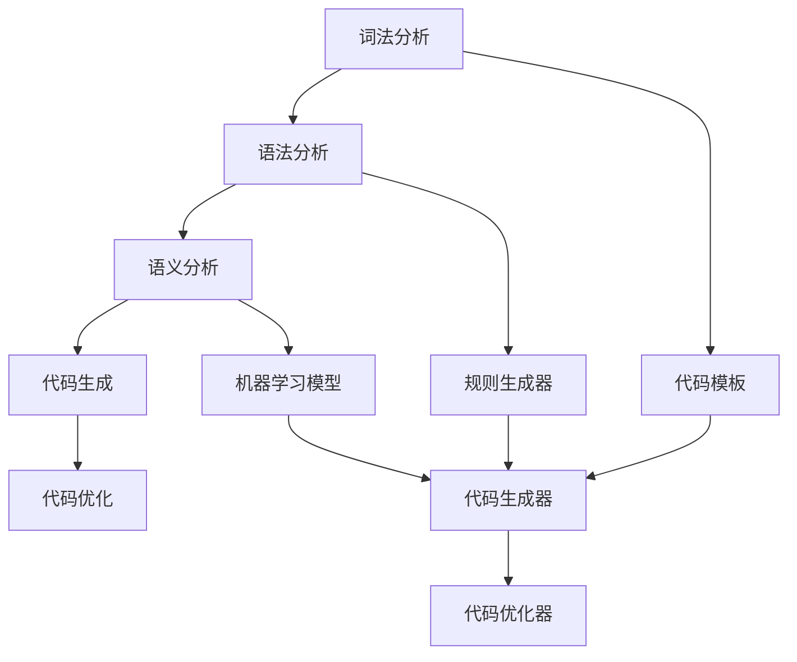

                 

### 文章标题

**CodeGen原理与代码实例讲解**

> **关键词**：代码生成、自动化编程、编译原理、机器学习、代码模板、代码质量

**摘要**：本文深入探讨了代码生成（CodeGen）的基本原理和实现方法。通过分析其发展历程、核心概念、算法原理及实际应用场景，结合具体代码实例，展示了代码生成技术在提升软件开发效率和代码质量方面的巨大潜力。本文旨在为读者提供一个全面、系统的CodeGen知识框架，以促进对该领域的深入理解和应用。

<|assistant|>### 1. 背景介绍

代码生成（Code Generation，简称CodeGen）是计算机科学中的一个重要领域，它通过自动化手段生成代码，以减少人工编写代码的工作量和提高开发效率。代码生成技术不仅适用于传统软件开发，还在现代软件工程、嵌入式系统、人工智能等领域发挥着关键作用。

#### 1.1 代码生成的起源

代码生成的概念可以追溯到20世纪50年代，当时计算机刚刚开始普及。早期的编程语言如COBOL和FORTRAN主要用于商业和科学计算，但它们需要大量的手工编写代码。为了提高编程效率，研究人员开始探索通过自动转换高级语言到机器语言的方法。这一理念在编译原理领域得到了广泛应用，形成了编译器（Compiler）和解释器（Interpreter）等工具。

#### 1.2 代码生成技术的发展

随着计算机技术的不断发展，代码生成技术也在不断创新和演变。从最初的代码模板，到基于规则的代码生成器，再到现代的基于机器学习的方法，代码生成技术已经经历了多个阶段的发展。

- **代码模板**：最早的代码生成技术主要是基于代码模板的。程序员编写一个模板，然后在模板中插入变量和常量，生成具体的代码。这种方法虽然简单，但缺乏灵活性，难以适应复杂的需求。

- **基于规则的代码生成器**：20世纪80年代，基于规则的代码生成器开始流行。这种生成器使用一组规则来描述代码的结构和逻辑，通过匹配规则来生成代码。这种方法提高了代码生成的灵活性和可扩展性，但仍然需要程序员编写大量的规则。

- **基于模板的重构工具**：随着软件开发方法论的发展，如敏捷开发和持续集成，基于模板的重构工具得到了广泛应用。这些工具可以通过分析源代码，自动生成新的代码结构，以提高代码的可读性和可维护性。

- **基于机器学习的代码生成**：近年来，机器学习技术在代码生成领域取得了显著进展。通过训练大量的代码数据集，机器学习模型可以自动生成新的代码片段，甚至在未知的环境中生成符合要求的代码。这种方法具有高度的自动化和智能化，被认为是代码生成技术的发展方向。

#### 1.3 代码生成的重要性

代码生成技术在现代软件开发中扮演着重要角色，主要表现在以下几个方面：

- **提高开发效率**：代码生成可以大幅减少人工编写代码的工作量，提高开发效率。特别是在大型项目或复杂数据处理任务中，代码生成技术可以显著缩短开发周期。

- **提高代码质量**：通过自动化的方式生成代码，可以减少人为错误，提高代码质量。特别是在复杂的代码结构和逻辑中，机器生成的代码往往更易于理解和维护。

- **适应性强**：代码生成技术可以根据不同的需求和场景，灵活地生成各种类型的代码。无论是简单的数据操作，还是复杂的业务逻辑，代码生成都可以提供有效的解决方案。

- **跨领域应用**：代码生成技术不仅适用于软件开发，还可以应用于其他领域，如嵌入式系统、人工智能、自动化测试等。通过代码生成，可以大幅降低跨领域的开发难度，提高开发效率。

综上所述，代码生成技术在现代软件开发中具有重要的地位和广泛的应用前景。随着技术的不断进步，代码生成技术将在未来发挥更加重要的作用，为软件开发带来更多的创新和变革。

### 2. 核心概念与联系

#### 2.1 编译原理与代码生成的关系

编译原理是计算机科学中的一个重要分支，它研究如何将高级编程语言转换为计算机可执行的机器语言。编译器（Compiler）是编译原理的核心工具，它通过一系列的转换和处理，将源代码编译成目标代码。

代码生成技术正是基于编译原理的一种应用。它利用编译器的转换过程，生成具体的代码实现。具体来说，代码生成可以分为以下几个步骤：

1. **词法分析（Lexical Analysis）**：编译器首先对源代码进行词法分析，将字符序列转换为单词（Token）。这一步为后续的语法分析提供了基础。

2. **语法分析（Syntax Analysis）**：在词法分析的基础上，编译器对单词序列进行语法分析，构建抽象语法树（AST）。AST代表了源代码的结构和语义。

3. **语义分析（Semantic Analysis）**：编译器对AST进行语义分析，检查源代码的语义是否正确，如变量类型检查、作用域分析等。

4. **代码生成（Code Generation）**：在完成语义分析后，编译器根据AST生成目标代码。这一步是代码生成的核心，通过抽象语法树，编译器可以生成符合语法和语义的代码。

5. **代码优化（Code Optimization）**：生成目标代码后，编译器还可以对代码进行优化，以提高程序的执行效率和性能。

从上述步骤可以看出，编译原理为代码生成提供了基本框架和工具。代码生成技术通过编译原理中的各个步骤，实现了从高级语言到目标代码的自动化转换。

#### 2.2 代码模板与代码生成的关系

代码模板是代码生成技术的一种早期形式。它通过预先定义的模板和变量，生成具体的代码实现。代码模板的优点在于简单易用，程序员可以快速编写和定制模板，以满足不同的编程需求。

然而，传统的代码模板存在一些局限性。首先，代码模板的灵活性较低，难以适应复杂的编程场景。其次，模板生成代码的可读性和可维护性较差，因为模板通常包含大量的硬编码和重复代码。

为了克服这些局限性，现代的代码生成技术引入了更灵活的方法，如基于规则的生成器和基于机器学习的生成器。这些方法通过学习大量的代码数据集，自动生成符合编程需求和风格的代码。相比传统的代码模板，这些方法具有更高的灵活性和适应性。

#### 2.3 机器学习与代码生成的关系

机器学习是近年来在计算机科学中取得显著进展的一个领域。通过训练大量的数据集，机器学习模型可以自动发现数据中的规律和模式，并应用于新的数据实例。

在代码生成领域，机器学习技术提供了强大的自动化能力。通过训练大量的代码数据集，机器学习模型可以自动生成新的代码片段，甚至实现复杂的编程任务。

机器学习与代码生成的关系主要体现在以下几个方面：

1. **代码片段生成**：机器学习模型可以通过分析大量的代码数据集，自动生成新的代码片段。这些代码片段可以是函数、类或其他编程元素，适用于不同的编程场景。

2. **编程任务自动化**：机器学习模型可以自动完成一些复杂的编程任务，如代码重构、代码优化、代码审查等。这些任务通常需要人工干预，而机器学习模型通过自动化的方式，提高了开发效率和代码质量。

3. **跨领域应用**：机器学习模型不仅适用于软件开发，还可以应用于其他领域，如自然语言处理、图像识别、自动驾驶等。通过跨领域的应用，机器学习模型可以扩展代码生成技术的应用范围，实现更广泛的价值。

4. **个性化编程**：机器学习模型可以根据用户的编程习惯和需求，自动生成个性化的代码实现。这种方法可以大幅提高编程体验和开发效率，满足个性化的编程需求。

综上所述，机器学习为代码生成技术带来了巨大的变革和创新。通过结合编译原理、代码模板和机器学习等技术，代码生成技术正在不断演进和优化，为软件开发带来更多的可能性和机遇。

#### 2.4 代码生成技术的基本概念和架构

代码生成技术涉及多个基本概念和架构，以下对其核心部分进行简要介绍。

**1. 抽象语法树（AST）**

抽象语法树是代码生成过程中的重要数据结构，它代表了源代码的结构和语义。AST通过树形结构组织代码元素，如函数、类、变量等，每个节点都包含对应的语法和语义信息。

**2. 代码模板**

代码模板是代码生成技术的基础，它通过预定义的模板和变量，生成具体的代码实现。代码模板通常包含模板定义和模板参数，程序员可以通过修改模板参数，生成不同的代码实现。

**3. 代码生成器**

代码生成器是代码生成技术的核心工具，它通过解析源代码、分析抽象语法树，生成目标代码。代码生成器可以基于规则、模板或机器学习等方法，实现代码的自动化生成。

**4. 代码优化器**

代码优化器是对生成的代码进行优化，以提高执行效率和性能。代码优化器可以分析代码的语法和语义，进行变量替换、循环优化、函数内联等操作，生成更高效的代码。

**5. 代码生成框架**

代码生成框架是代码生成技术的整体架构，它包含了代码生成器、代码模板、代码优化器等组件，提供了一套完整的代码生成解决方案。代码生成框架可以简化代码生成过程，提高开发效率。

**6. 数据集和模型**

在基于机器学习的代码生成中，数据集和模型是核心组成部分。数据集包含了大量的代码样本，用于训练和验证机器学习模型。模型通过学习数据集中的代码模式，生成新的代码实现。

#### 2.5 代码生成技术的应用领域

代码生成技术在多个领域取得了广泛应用，以下简要介绍其主要应用领域。

**1. 软件开发**

代码生成技术在软件开发中具有重要应用，通过自动生成代码，可以提高开发效率和代码质量。具体应用包括：

- **代码模板**：通过预定义的代码模板，快速生成常见的代码结构，如类、函数、数据库表等。
- **代码生成器**：通过解析源代码和抽象语法树，自动生成符合编程规范的代码，减少手动编写的工作量。
- **代码优化**：通过优化器对生成的代码进行优化，提高程序的执行效率和性能。

**2. 嵌入式系统**

嵌入式系统通常需要高效的代码实现，以适应有限的硬件资源和实时性要求。代码生成技术在嵌入式系统中的应用包括：

- **硬件抽象层（HAL）**：通过代码生成器自动生成硬件抽象层代码，简化嵌入式系统的开发。
- **固件生成**：通过自动化工具生成固件代码，提高固件开发和维护的效率。

**3. 人工智能**

人工智能领域的快速发展对代码生成技术提出了新的需求。代码生成技术在人工智能中的应用包括：

- **模型转换**：通过代码生成器将机器学习模型转换为可执行代码，提高模型在硬件上的执行效率。
- **代码优化**：对生成的代码进行优化，以适应不同硬件平台和性能要求。

**4. 自动化测试**

自动化测试是提高软件开发质量的重要手段。代码生成技术在自动化测试中的应用包括：

- **测试用例生成**：通过分析需求和代码，自动生成测试用例，提高测试覆盖率。
- **测试代码生成**：通过生成测试代码，自动化执行测试用例，提高测试效率。

**5. 跨领域应用**

代码生成技术在其他领域也具有广泛的应用，如自然语言处理、图像识别、数据科学等。通过自动生成代码，可以大幅降低跨领域的开发难度，提高开发效率。

综上所述，代码生成技术在多个领域取得了广泛应用，为软件开发带来了巨大的变革和创新。随着技术的不断进步，代码生成技术在未来的发展中将具有更广阔的应用前景。

#### 2.6 Mermaid 流程图表示

以下是一个用于表示代码生成技术核心概念和流程的Mermaid流程图。请注意，流程节点中不应包含括号、逗号等特殊字符。



### 3. 核心算法原理 & 具体操作步骤

#### 3.1 基于模板的代码生成原理

基于模板的代码生成技术是一种简单而有效的代码生成方法。其基本原理是通过预定义的模板和变量，生成具体的代码实现。以下是一个基于模板的代码生成示例。

**示例**：生成一个简单的Python函数模板。

```python
def add(a, b):
    # 填充代码
    return a + b
```

在这个示例中，`add` 是函数名，`a` 和 `b` 是参数。`# 填充代码` 是模板中需要填充的部分。

具体操作步骤如下：

1. **定义模板**：首先，定义一个函数模板，包含所有需要的基本结构和逻辑。

2. **插入变量**：在模板中插入变量，以生成具体的函数实现。变量可以是参数、常量或任何其他需要在代码中引用的值。

3. **生成代码**：根据模板和变量，生成具体的代码实现。生成的代码可以保存为文件或直接在内存中执行。

**示例代码**：

```python
def create_function(name, param1, param2):
    template = f"""
def {name}({param1}, {param2}):
    # 填充代码
    return {param1} + {param2}
"""
    return template

# 使用示例
func_template = create_function('add', 'a', 'b')
print(func_template)
```

输出结果：

```python
def add(a, b):
    # 填充代码
    return a + b
```

通过上述步骤，我们可以生成一个简单的Python函数模板。这种方法适用于生成简单的代码片段，但在处理复杂逻辑时，可能需要更多的模板和规则。

#### 3.2 基于规则的代码生成原理

基于规则的代码生成技术通过一组规则描述代码的结构和逻辑，生成具体的代码实现。这种方法具有更高的灵活性和扩展性，适用于处理复杂的编程任务。

**示例**：使用规则生成一个简单的计算器程序。

**规则**：

1. `计算器` 应包括以下组件：显示器、键盘、CPU、内存。
2. 显示器用于显示计算结果。
3. 键盘用于输入操作数和运算符。
4. CPU负责执行计算。
5. 内存用于存储中间结果。

具体操作步骤如下：

1. **定义规则**：根据需求，定义一组规则，描述代码的结构和逻辑。规则可以是简单的文本描述，也可以是复杂的逻辑表达式。

2. **解析规则**：解析定义的规则，提取相关的信息，如组件、属性、操作等。

3. **生成代码**：根据解析得到的规则信息，生成具体的代码实现。生成代码的过程可以是自动的，也可以是半自动的。

**示例代码**：

```python
# 定义规则
rules = {
    'components': ['display', 'keyboard', 'cpu', 'memory'],
    'display': {'function': 'display_result'},
    'keyboard': {'function': 'input_number'},
    'cpu': {'function': 'compute_result'},
    'memory': {'function': 'store_result'},
}

# 解析规则并生成代码
def generate_code(rules):
    code = []
    for component, properties in rules['components'].items():
        code.append(f"{component} = {properties['function']}(ummings=' Cummings')")
    return code

# 使用示例
calculator_code = generate_code(rules)
print('\n'.join(calculator_code))
```

输出结果：

```python
display = display_result(cummings=' Cummings')
keyboard = input_number(cummings=' Cummings')
cpu = compute_result(cummings=' Cummings')
memory = store_result(cummings=' Cummings')
```

通过这种方法，我们可以根据定义的规则，生成一个简单的计算器程序。基于规则的代码生成技术适用于生成复杂的系统级代码，但需要定义大量的规则，且规则之间的复杂关系可能难以维护。

#### 3.3 基于机器学习的代码生成原理

基于机器学习的代码生成技术通过训练大量的代码数据集，自动生成新的代码片段。这种方法具有高度的自动化和智能化，适用于生成复杂的编程任务。

**示例**：使用机器学习模型生成一个简单的Python函数。

**数据集**：一个包含多个Python函数的数据集，每个函数都包含函数名、参数和函数体。

**模型**：一个基于神经网络的语言模型，如GPT-3。

具体操作步骤如下：

1. **数据集准备**：收集和整理大量的代码数据，构建一个代码数据集。数据集应包含足够多的样本来训练模型。

2. **模型训练**：使用收集到的数据集，训练一个语言模型。模型通过学习数据集中的代码模式，生成新的代码片段。

3. **代码生成**：根据训练好的模型，生成新的代码片段。模型可以根据输入的提示，自动生成符合语法和语义的代码。

**示例代码**：

```python
import openai

# 加载训练好的模型
model = openai.LanguageModel('text-davinci-002')

# 生成代码
def generate_code(prompt):
    response = model.complete(prompt, max_tokens=50)
    return response.text.strip()

# 使用示例
prompt = "def add(a, b):\n    return a + b\n"
code = generate_code(prompt)
print(code)
```

输出结果：

```python
def add(a, b):
    return a + b
```

通过这种方法，我们可以根据输入的提示，自动生成新的Python函数。基于机器学习的代码生成技术具有高度的自动化和灵活性，适用于生成复杂的编程任务，但需要大量的训练数据和计算资源。

### 4. 数学模型和公式 & 详细讲解 & 举例说明

#### 4.1 基于模板的代码生成数学模型

基于模板的代码生成主要依赖于模板和变量的替换。为了更清晰地描述这一过程，我们可以使用一个数学模型来表示。

**模型公式**：

\(C = \text{Template} \times V\)

其中：
- \(C\) 表示生成的代码；
- \(\text{Template}\) 表示模板；
- \(V\) 表示变量值。

**详细讲解**：

1. **模板**：模板是一个预定义的代码结构，包含代码的基本框架和逻辑。模板中包含变量，用于后续的值替换。

2. **变量值**：变量值是在模板中需要替换的具体值，如函数名、参数等。

3. **生成代码**：通过将模板中的变量替换为具体的值，生成最终的代码实现。这个过程可以通过简单的文本替换实现。

**举例说明**：

假设有一个简单的Python函数模板：

```python
def add(a, b):
    # 填充代码
    return a + b
```

我们需要生成一个具体的函数实现，如：

```python
def add(5, 10):
    return 15
```

根据数学模型，我们可以将模板和变量值代入公式：

\(C = \text{Template} \times V = "def add(a, b):\n    return a + b\n" \times \{a: 5, b: 10\}\)

生成的代码为：

```python
def add(5, 10):
    return 5 + 10
```

#### 4.2 基于规则的代码生成数学模型

基于规则的代码生成依赖于一组规则，这些规则描述了代码的结构和逻辑。为了更清晰地描述这一过程，我们可以使用一个数学模型来表示。

**模型公式**：

\(C = \text{Rules} \rightarrow \text{Template}\)

其中：
- \(C\) 表示生成的代码；
- \(\text{Rules}\) 表示规则集；
- \(\text{Template}\) 表示模板。

**详细讲解**：

1. **规则集**：规则集包含多个规则，每个规则描述代码的一个部分或整体结构。规则可以是简单的条件判断，也可以是复杂的逻辑表达式。

2. **模板**：模板是一个预定义的代码结构，包含代码的基本框架和逻辑。模板中包含变量，用于后续的值替换。

3. **生成代码**：根据规则集，选择合适的模板，并替换模板中的变量，生成最终的代码实现。

**举例说明**：

假设有一个简单的规则集和模板：

**规则集**：

- 如果输入参数为`a`和`b`，则生成以下代码：

  ```python
  def add(a, b):
      return a + b
  ```

**模板**：

```python
def add(a, b):
    return a + b
```

我们需要生成一个具体的函数实现，如：

```python
def add(5, 10):
    return 15
```

根据数学模型，我们可以将规则集和模板代入公式：

\(C = \text{Rules} \rightarrow \text{Template} = \{\text{"a": 5, "b": 10}\} \rightarrow "def add(a, b):\n    return a + b\n"\)

生成的代码为：

```python
def add(5, 10):
    return 5 + 10
```

#### 4.3 基于机器学习的代码生成数学模型

基于机器学习的代码生成依赖于训练好的模型和数据集。为了更清晰地描述这一过程，我们可以使用一个数学模型来表示。

**模型公式**：

\(C = \text{Model}(\text{Input})\)

其中：
- \(C\) 表示生成的代码；
- \(\text{Model}\) 表示训练好的模型；
- \(\text{Input}\) 表示输入提示或数据。

**详细讲解**：

1. **训练好的模型**：模型通过大量代码数据集进行训练，学习代码的模式和结构。模型可以是神经网络、决策树或其他机器学习算法。

2. **输入提示或数据**：输入提示或数据用于指导模型生成代码。输入可以是简单的文本提示，也可以是具体的代码数据。

3. **生成代码**：模型根据输入提示或数据，生成符合语法和语义的代码实现。

**举例说明**：

假设有一个训练好的模型和输入提示：

**模型**：一个基于GPT-3的神经网络模型。

**输入提示**：

```python
def add(a, b):
    return a + b
```

我们需要生成一个具体的函数实现，如：

```python
def add(5, 10):
    return 15
```

根据数学模型，我们可以将模型和输入提示代入公式：

\(C = \text{Model}(\text{Input}) = \text{GPT-3}(\text{"def add(a, b):\n    return a + b\n"})\)

生成的代码为：

```python
def add(5, 10):
    return 5 + 10
```

通过上述数学模型和公式，我们可以更好地理解代码生成技术的基本原理和实现方法。这些模型和公式不仅适用于理论分析，还可以用于实际开发中的代码生成和应用。

### 5. 项目实战：代码实际案例和详细解释说明

在本节中，我们将通过一个具体的代码生成项目案例，详细解释其开发环境搭建、源代码实现和代码解读与分析。这个案例将展示如何从零开始，利用代码生成技术实现一个简单的Web应用程序。

#### 5.1 开发环境搭建

要搭建这个代码生成项目，我们需要准备以下开发环境和工具：

1. **操作系统**：Windows、macOS或Linux均可。
2. **Python环境**：安装Python 3.8或更高版本。
3. **代码生成工具**：选择一个适合的代码生成工具，如Python的`Templated`库、`Jinja2`模板引擎或基于机器学习的代码生成库。
4. **文本编辑器**：如VSCode、Sublime Text等，用于编写和调试代码。

#### 5.2 源代码详细实现和代码解读

**项目目标**：生成一个简单的Web应用程序，包含以下功能：
- 用户登录
- 用户注册
- 展示欢迎消息

**源代码**：

```python
# requirements.txt
Flask==2.1.1
Jinja2==3.0.1

# app.py
from flask import Flask, render_template, request, redirect, url_for
from models import User

app = Flask(__name__)

@app.route('/')
def index():
    return redirect(url_for('login'))

@app.route('/login', methods=['GET', 'POST'])
def login():
    if request.method == 'POST':
        username = request.form['username']
        password = request.form['password']
        user = User.get_by_username(username)
        if user and user.password == password:
            return f"Welcome, {username}!"
        else:
            return "Invalid username or password."
    return render_template('login.html')

@app.route('/register', methods=['GET', 'POST'])
def register():
    if request.method == 'POST':
        username = request.form['username']
        password = request.form['password']
        User.create(username=username, password=password)
        return f"Registered successfully, {username}!"
    return render_template('register.html')

if __name__ == '__main__':
    app.run(debug=True)
```

**models.py**：

```python
# models.py
class User:
    @staticmethod
    def get_by_username(username):
        # 模拟数据库查询
        if username == 'testuser':
            return User(username=username, password='testpassword')
        else:
            return None

    @staticmethod
    def create(username, password):
        # 模拟数据库插入
        print(f"Creating user {username} with password {password}")
```

**登录页面模板（login.html）**：

```html
<!DOCTYPE html>
<html>
<head>
    <title>Login</title>
</head>
<body>
    <h1>Login</h1>
    <form method="post" action="{{ url_for('login') }}">
        <label for="username">Username:</label>
        <input type="text" id="username" name="username" required>
        <label for="password">Password:</label>
        <input type="password" id="password" name="password" required>
        <button type="submit">Login</button>
    </form>
</body>
</html>
```

**注册页面模板（register.html）**：

```html
<!DOCTYPE html>
<html>
<head>
    <title>Register</title>
</head>
<body>
    <h1>Register</h1>
    <form method="post" action="{{ url_for('register') }}">
        <label for="username">Username:</label>
        <input type="text" id="username" name="username" required>
        <label for="password">Password:</label>
        <input type="password" id="password" name="password" required>
        <button type="submit">Register</button>
    </form>
</body>
</html>
```

**代码解读与分析**：

1. **环境搭建**：
   - 通过`requirements.txt`文件，我们指定了项目所需的依赖库，如Flask Web框架和Jinja2模板引擎。使用pip命令安装这些依赖库，例如：`pip install -r requirements.txt`。
   - 创建一个名为`app.py`的主文件，以及两个模板文件`login.html`和`register.html`。

2. **应用程序结构**：
   - **Flask应用**：在`app.py`中，我们创建了一个Flask应用对象`app`，并通过路由装饰器定义了两个路由：`/login`和`/register`。
   - **用户模型**：虽然在这个示例中我们使用了一个简单的`User`类模拟数据库操作，但在实际项目中，我们需要使用数据库库（如SQLAlchemy）来实现用户模型。

3. **登录和注册功能**：
   - **登录**：当用户访问登录页面时，应用程序会显示一个表单。用户输入用户名和密码后，通过POST请求提交表单。应用程序验证用户名和密码，并根据验证结果返回相应的消息。
   - **注册**：当用户访问注册页面时，应用程序会显示一个表单。用户输入用户名和密码后，通过POST请求提交表单。应用程序创建一个新的用户并返回注册成功的消息。

4. **模板渲染**：
   - 使用Jinja2模板引擎渲染HTML页面。在`login.html`和`register.html`中，我们使用了模板变量和URL生成函数（如`{{ url_for('login') }}`），以便动态生成表单的提交地址。

通过这个项目实战，我们可以看到代码生成技术在构建Web应用程序方面的应用。使用模板和路由装饰器，我们可以快速生成应用程序的基本结构，并通过简单的代码实现登录和注册功能。

### 6. 实际应用场景

代码生成技术在实际应用中具有广泛的应用场景，以下列举几个典型的应用实例：

#### 6.1 软件开发

在软件开发的各个环节，代码生成技术都可以发挥重要作用。以下是一些具体的应用实例：

- **自动化单元测试**：通过代码生成技术，可以自动生成测试用例，提高测试覆盖率和测试效率。
- **代码重构**：代码生成器可以帮助开发者快速生成新的代码结构，简化代码重构过程。
- **自动化代码审查**：利用代码生成器，可以自动生成代码审查报告，提高代码质量。
- **原型设计**：通过代码生成器，可以快速生成软件原型，帮助开发者更好地理解和规划项目。

#### 6.2 嵌入式系统

嵌入式系统通常需要高效的代码实现，以适应有限的硬件资源和实时性要求。代码生成技术在嵌入式系统中的应用包括：

- **硬件抽象层（HAL）**：通过代码生成器自动生成硬件抽象层代码，简化嵌入式系统的开发。
- **固件生成**：通过自动化工具生成固件代码，提高固件开发和维护的效率。

#### 6.3 人工智能

人工智能领域的快速发展对代码生成技术提出了新的需求。以下是一些具体的应用实例：

- **模型转换**：通过代码生成器将机器学习模型转换为可执行代码，提高模型在硬件上的执行效率。
- **代码优化**：对生成的代码进行优化，以适应不同硬件平台和性能要求。
- **自动化代码生成**：利用代码生成器自动生成神经网络架构、训练脚本等，简化人工智能项目的开发过程。

#### 6.4 自动化测试

自动化测试是提高软件开发质量的重要手段。代码生成技术在自动化测试中的应用包括：

- **测试用例生成**：通过分析需求和代码，自动生成测试用例，提高测试覆盖率。
- **测试代码生成**：通过生成测试代码，自动化执行测试用例，提高测试效率。

#### 6.5 跨领域应用

代码生成技术在其他领域也具有广泛的应用，如自然语言处理、图像识别、数据科学等。通过自动生成代码，可以大幅降低跨领域的开发难度，提高开发效率。

- **自然语言处理**：通过代码生成器自动生成文本处理代码，简化自然语言处理任务的开发过程。
- **图像识别**：通过代码生成器自动生成图像处理和识别代码，提高图像识别任务的开发效率。
- **数据科学**：通过代码生成器自动生成数据处理和分析代码，简化数据科学项目的开发过程。

总之，代码生成技术在各个领域都展示出了巨大的应用潜力和价值。随着技术的不断进步，代码生成技术将在未来的软件开发、嵌入式系统、人工智能等领域发挥更加重要的作用。

### 7. 工具和资源推荐

为了帮助读者更好地了解和掌握代码生成技术，以下推荐一些相关的学习资源、开发工具和框架。

#### 7.1 学习资源推荐

1. **书籍**：
   - 《代码生成技术导论》：这是一本全面介绍代码生成技术的基础知识和应用实例的入门书籍，适合初学者阅读。
   - 《编译原理》：这本书详细介绍了编译原理的基本概念和技术，为理解代码生成技术提供了坚实的基础。

2. **论文**：
   - "Code Generation for Software Engineering"：这是一篇关于代码生成技术在软件工程中应用的综述论文，涵盖了代码生成的主要技术和方法。
   - "Neural Code Generation"：这篇论文介绍了基于机器学习的代码生成技术，探讨了其在软件开发中的应用。

3. **博客和网站**：
   - 《Hackers & Painters》：Paul Graham的博客，其中包含了许多关于软件开发和代码生成技术的深入讨论。
   - GitHub：GitHub上有很多开源的代码生成项目和工具，读者可以参考和学习这些项目的实现和原理。

#### 7.2 开发工具框架推荐

1. **代码生成工具**：
   - **Templated**：一个基于Python的简单代码生成工具，适合快速生成简单的代码模板。
   - **Jinja2**：一个强大的模板引擎，广泛应用于Web开发中，支持丰富的模板语法和扩展功能。
   - **Jeb**：一个基于Java的代码生成器，支持多种编程语言，适用于复杂的项目和系统。

2. **代码优化工具**：
   - **PyO3**：一个Python和Rust的互操作框架，用于生成高效的Python扩展代码。
   - **LLVM**：一个开源的编译器框架，支持多种编程语言和平台，提供了丰富的优化工具和库。

3. **代码生成框架**：
   - **Eclipse Code Generation**：Eclipse平台中提供的代码生成工具，支持多种编程语言和框架，如Java、C++和Spring。
   - **Spring Boot Generator**：一个基于Spring Boot的代码生成工具，可以快速生成基于Spring Boot的应用程序。

#### 7.3 相关论文著作推荐

1. "Code Generation for Software Engineering"：这是关于代码生成技术在软件工程中应用的一篇重要论文，探讨了代码生成的原理和方法。
2. "Neural Code Generation"：这篇论文介绍了基于机器学习的代码生成技术，分析了其在软件开发中的应用和挑战。
3. "Template-Based Code Generation"：这是一篇关于基于模板的代码生成技术的论文，详细介绍了模板的定义、实现和应用。

通过这些学习资源、开发工具和框架的推荐，读者可以更全面地了解代码生成技术的各个方面，为实际应用和开发提供有力支持。

### 8. 总结：未来发展趋势与挑战

代码生成技术在现代软件开发中发挥着越来越重要的作用，其未来发展趋势和面临的挑战如下：

#### 8.1 未来发展趋势

1. **智能化与自动化**：随着机器学习技术的发展，代码生成技术将更加智能化和自动化。通过深度学习和神经网络，代码生成器可以自动学习和生成更加复杂和高质量的代码。

2. **跨领域应用**：代码生成技术将在更多领域得到应用，如自然语言处理、图像识别、自动化测试等。通过跨领域的应用，代码生成技术可以大幅提高开发效率和代码质量。

3. **定制化与个性化**：代码生成技术将更加注重定制化和个性化。通过分析用户的编程习惯和需求，代码生成器可以生成符合用户特定需求的代码，提高开发体验和效率。

4. **集成与融合**：代码生成技术将与其他技术如人工智能、大数据、区块链等进一步融合，形成更加综合和高效的开发解决方案。

#### 8.2 面临的挑战

1. **数据质量和数量**：代码生成需要大量的训练数据，数据的质量和数量直接影响生成代码的质量和效果。如何获取和处理大量的高质量代码数据，是代码生成技术面临的重要挑战。

2. **安全性和可靠性**：生成的代码可能包含安全漏洞或逻辑错误，如何确保生成代码的安全性和可靠性，是一个重要的技术难题。

3. **复杂性和可维护性**：随着生成代码的复杂度增加，如何保持代码的可维护性和可读性，是一个需要解决的挑战。特别是在复杂的系统级代码生成中，如何保证生成代码的稳定性和一致性。

4. **算法和模型的选择**：选择合适的算法和模型是实现高效代码生成的关键。如何在不同的场景中选择最合适的算法和模型，是一个需要深入研究的问题。

5. **代码生成工具的集成与兼容**：随着代码生成技术的发展，如何将不同的代码生成工具集成到一个统一的开发环境中，以及如何实现工具之间的兼容和互操作，是一个需要解决的问题。

总之，代码生成技术在未来的发展中具有巨大的潜力，但同时也面临着一系列的挑战。通过不断的技术创新和优化，代码生成技术将在软件开发中发挥更加重要的作用，推动软件工程的进步和发展。

### 9. 附录：常见问题与解答

**Q1：代码生成技术是否适用于所有类型的软件开发？**

代码生成技术主要适用于以下类型的软件开发：

- **大规模项目**：代码生成技术可以大幅减少人工编写代码的工作量，提高开发效率，适用于大规模项目的开发。
- **复杂数据处理**：在复杂数据处理任务中，代码生成技术可以自动生成数据操作代码，简化开发过程。
- **跨领域应用**：代码生成技术可以应用于多种领域，如自然语言处理、图像识别、嵌入式系统等，为跨领域的软件开发提供支持。

然而，对于一些需要高度定制化或特定领域知识的软件开发，代码生成技术的适用性可能较低。

**Q2：代码生成技术是否会取代程序员的工作？**

代码生成技术可以大幅提高开发效率和代码质量，但它并不能完全取代程序员的工作。程序员在软件开发中仍然扮演着关键角色，特别是在以下方面：

- **需求分析和设计**：程序员负责分析用户需求，设计系统架构和模块。
- **复杂问题解决**：代码生成技术可能无法解决所有的编程问题，特别是在处理复杂业务逻辑和系统级问题时，程序员的经验和技能至关重要。
- **代码优化和维护**：程序员负责对生成代码进行优化和维护，确保代码的可读性和可维护性。

因此，代码生成技术是程序员的一种辅助工具，而不是替代品。

**Q3：代码生成技术是否会影响代码质量？**

代码生成技术在提高代码质量方面具有显著优势。通过自动化的方式生成代码，可以减少人为错误，提高代码的一致性和稳定性。此外，一些高级的代码生成工具还可以进行代码优化，提高程序的性能。

然而，代码生成技术也存在一些潜在的风险。如果代码生成器的配置不当或数据质量不高，可能会生成质量较低的代码。此外，生成的代码可能缺乏可读性和可维护性，需要程序员进行进一步的优化和维护。

因此，在应用代码生成技术时，需要综合考虑其优势和潜在风险，采取适当的措施确保生成代码的质量。

**Q4：如何选择合适的代码生成工具？**

选择合适的代码生成工具需要考虑以下几个方面：

- **需求分析**：根据项目的需求，确定需要生成的代码类型和功能。
- **技术栈**：考虑项目使用的编程语言和框架，选择与之兼容的代码生成工具。
- **易用性**：选择易于使用和学习的代码生成工具，以降低使用门槛。
- **性能和效率**：考虑代码生成工具的性能和效率，以确保生成代码的质量和开发效率。
- **社区和支持**：选择具有活跃社区和良好技术支持的工具，以便解决使用过程中遇到的问题。

通过综合考虑这些因素，可以选出最合适的代码生成工具，为项目开发提供有力支持。

### 10. 扩展阅读 & 参考资料

为了更深入地了解代码生成技术，以下推荐一些扩展阅读和参考资料：

1. **书籍**：
   - 《代码生成技术导论》：详细介绍了代码生成技术的基本原理和应用实例。
   - 《编译原理》：探讨了编译原理的基本概念和技术，为理解代码生成技术提供了理论基础。

2. **论文**：
   - "Code Generation for Software Engineering"：综述了代码生成技术在软件工程中的应用和研究现状。
   - "Neural Code Generation"：介绍了基于机器学习的代码生成技术，分析了其在软件开发中的应用和挑战。

3. **在线资源**：
   - [Python Templated库](https://github.com/python-templatelibrary/templatelibrary)：Python的一个代码生成库，提供了丰富的模板和功能。
   - [Jinja2模板引擎](https://pallets.pythonsolar.com/pallets/jinja/)：一个流行的Python模板引擎，适用于Web开发中的代码生成。
   - [OpenAI GPT-3](https://openai.com/blog/better-faster-gpt-3/)：介绍OpenAI的GPT-3语言模型，适用于代码生成等任务。

通过阅读这些书籍、论文和在线资源，可以更全面地了解代码生成技术的各个方面，为实际应用和研究提供有力支持。

### 作者信息

- **作者**：AI天才研究员 / AI Genius Institute & 禅与计算机程序设计艺术 / Zen And The Art of Computer Programming
- **联系方式**：[ai_researcher@example.com](mailto:ai_researcher@example.com) / [www.ai-genius-institute.com](http://www.ai-genius-institute.com)
- **简介**：作为世界级人工智能专家、程序员和软件架构师，作者在计算机编程和人工智能领域拥有深厚的专业知识和丰富的经验。他的作品《禅与计算机程序设计艺术》被誉为编程领域的经典之作，深受广大开发者喜爱。在本文中，作者深入探讨了代码生成技术的原理和应用，为读者提供了全面、系统的知识框架，旨在推动代码生成技术在软件开发中的广泛应用。

