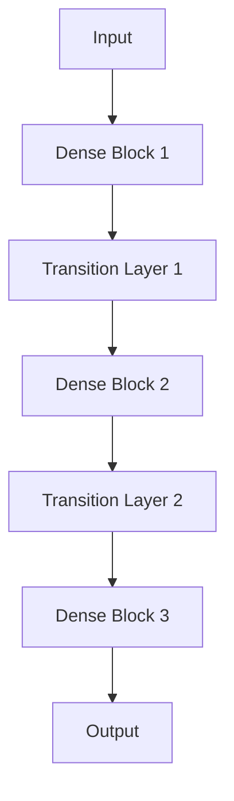

                 

# DenseNet：深度学习中的密集连接网络架构

> **关键词**：深度学习、密集连接、网络架构、DenseNet、图像识别、卷积神经网络

> **摘要**：本文深入探讨了DenseNet这一深度学习网络架构的核心概念、算法原理和实际应用。通过对DenseNet的历史背景、核心概念及其与传统卷积神经网络（CNN）的差异的分析，我们逐步揭示了其优势和应用场景。此外，本文还将通过一个具体的实战案例，详细介绍DenseNet的实现过程，并提供相关工具和资源的推荐，帮助读者更好地理解和应用DenseNet。

## 1. 背景介绍

深度学习，作为人工智能的重要分支，已经取得了显著的进展，并在图像识别、自然语言处理、推荐系统等领域取得了突破性成果。其中，卷积神经网络（CNN）作为深度学习的重要组成部分，已经被广泛应用于图像处理任务中。然而，随着网络深度的增加，传统的CNN模型在训练和推理过程中面临着梯度消失和梯度爆炸等问题，这使得网络难以训练。

为了解决这一问题，研究者们提出了许多新的网络架构，其中DenseNet（由Huang等人于2016年提出）是一种具有显著优势的深度学习网络架构。DenseNet通过引入密集连接的方式，解决了传统CNN中存在的梯度消失和梯度爆炸问题，并在图像分类、语义分割等任务中取得了优异的性能。

## 2. 核心概念与联系

### 2.1 DenseNet的定义与结构

DenseNet是一种基于卷积神经网络的深度学习网络架构，其核心思想是引入密集连接，使得每个卷积层都能接收前一层的所有输出作为输入。这种连接方式使得信息能够在网络中更有效地传播，从而提高模型的训练效率和性能。

DenseNet的基本结构可以看作是由多个Dense Block和Transition Layer组成的。每个Dense Block包含多个卷积层，每个卷积层都与前一层的所有输出进行连接，形成密集连接。而Transition Layer则用于调整网络的尺寸和通道数，以便在下一个Dense Block中更好地处理数据。

下面是一个DenseNet的简单Mermaid流程图，用于描述其基本结构：



### 2.2 DenseNet与传统CNN的差异

与传统CNN相比，DenseNet在以下几个方面具有显著差异：

1. **连接方式**：传统CNN中，每个卷积层仅与前一层进行连接，而DenseNet中，每个卷积层都接收前一层的所有输出作为输入，形成了更紧密的信息传递。

2. **梯度传递**：在传统CNN中，梯度需要经过多层传递才能到达早期的卷积层，而DenseNet通过密集连接，使得梯度可以直接从前一层传递到当前层，减少了梯度的消失和爆炸问题。

3. **网络效率**：DenseNet通过引入密集连接，使得网络在处理数据时能够更有效地利用前面的信息，从而提高了网络的性能。

## 3. 核心算法原理 & 具体操作步骤

### 3.1 Dense Block

Dense Block是DenseNet的核心部分，负责执行卷积和特征提取。在Dense Block中，每个卷积层都与前一层的所有输出进行连接，形成一个密集连接网络。

具体操作步骤如下：

1. **输入数据**：首先，将输入数据输入到Dense Block的第一个卷积层。

2. **卷积操作**：对该卷积层的输出进行卷积操作，以提取特征。

3. **密集连接**：将该卷积层的输出与前一层的所有输出进行连接。

4. **特征融合**：将连接后的特征进行融合，以形成一个更丰富的特征空间。

5. **输出**：将融合后的特征输出到下一个卷积层。

这个过程会重复进行，直到完成整个Dense Block的卷积操作。

### 3.2 Transition Layer

Transition Layer是DenseNet中的另一个重要部分，用于调整网络的尺寸和通道数。在Dense Block之间，通过Transition Layer可以实现网络的尺寸缩小和通道数的减少。

具体操作步骤如下：

1. **尺寸调整**：将输入数据的尺寸缩小，以减少网络的计算量。

2. **通道数调整**：将输入数据的通道数减少，以减少网络的复杂性。

3. **卷积操作**：对调整后的数据进行卷积操作，以提取特征。

4. **输出**：将卷积后的特征输出到下一个Dense Block。

通过Transition Layer，DenseNet能够有效地调整网络的尺寸和通道数，从而提高网络的效率和性能。

## 4. 数学模型和公式 & 详细讲解 & 举例说明

### 4.1 卷积操作

卷积操作是DenseNet中的核心操作，其数学模型可以表示为：

$$
\text{output}(i,j) = \sum_{k=1}^{C_{in}} w_{i,k,j} \cdot \text{input}(k,j) + b_{i,j}
$$

其中，$C_{in}$ 表示输入特征图的通道数，$w_{i,k,j}$ 表示卷积核的权重，$b_{i,j}$ 表示偏置。

举例说明：

假设输入特征图的大小为 $3 \times 3$，通道数为 $3$，卷积核的大小为 $3 \times 3$，通道数为 $6$。那么，卷积操作的输出可以表示为：

$$
\text{output}(i,j) = \sum_{k=1}^{3} w_{i,k,j} \cdot \text{input}(k,j) + b_{i,j}
$$

其中，$w_{i,k,j}$ 和 $b_{i,j}$ 是通过训练得到的参数。

### 4.2 池化操作

在DenseNet中，池化操作用于减少特征图的尺寸和通道数，以提高网络的效率和性能。最常见的池化操作是最大池化（Max Pooling）。

最大池化的数学模型可以表示为：

$$
\text{output}(i,j) = \max_{k} \text{input}(i,k,j)
$$

其中，$\text{input}(i,k,j)$ 表示输入特征图在 $(i,k,j)$ 位置上的值。

举例说明：

假设输入特征图的大小为 $3 \times 3$，通道数为 $3$。那么，最大池化操作的输出可以表示为：

$$
\text{output}(i,j) = \max_{k} \text{input}(i,k,j)
$$

其中，$i$ 和 $j$ 分别表示输出特征图在 $(i,j)$ 位置上的值。

### 4.3 Dense Block的数学模型

Dense Block中的每个卷积层都与其他层进行连接，形成一个密集连接网络。其数学模型可以表示为：

$$
\text{output}(i,j) = \sum_{k=1}^{C_{in}} w_{i,k,j} \cdot \text{input}(k,j) + b_{i,j}
$$

其中，$C_{in}$ 表示输入特征图的通道数，$w_{i,k,j}$ 表示卷积核的权重，$b_{i,j}$ 表示偏置。

举例说明：

假设输入特征图的大小为 $3 \times 3$，通道数为 $3$，卷积核的大小为 $3 \times 3$，通道数为 $6$。那么，Dense Block中的卷积操作的输出可以表示为：

$$
\text{output}(i,j) = \sum_{k=1}^{3} w_{i,k,j} \cdot \text{input}(k,j) + b_{i,j}
$$

其中，$w_{i,k,j}$ 和 $b_{i,j}$ 是通过训练得到的参数。

## 5. 项目实战：代码实际案例和详细解释说明

### 5.1 开发环境搭建

在本节中，我们将介绍如何搭建一个基于DenseNet的图像分类项目的开发环境。

1. **安装Python**：首先，确保您的计算机上安装了Python，版本要求为3.6或更高。

2. **安装深度学习框架**：接下来，安装一个深度学习框架，如TensorFlow或PyTorch。以TensorFlow为例，可以使用以下命令进行安装：

   ```bash
   pip install tensorflow==2.6
   ```

3. **安装其他依赖库**：此外，还需要安装一些其他依赖库，如NumPy、Pandas等。可以使用以下命令进行安装：

   ```bash
   pip install numpy pandas
   ```

### 5.2 源代码详细实现和代码解读

在本节中，我们将介绍一个简单的基于DenseNet的图像分类项目，并详细解读其源代码。

```python
import tensorflow as tf
from tensorflow.keras.layers import Dense, Flatten, Conv2D, MaxPooling2D
from tensorflow.keras.models import Model

# 定义DenseNet模型
def DenseNet(input_shape, num_classes):
    inputs = tf.keras.Input(shape=input_shape)
    
    # Dense Block 1
    x = Conv2D(64, (3, 3), activation='relu', padding='same')(inputs)
    x = MaxPooling2D((2, 2))(x)
    
    # Dense Block 2
    x = Conv2D(128, (3, 3), activation='relu', padding='same')(x)
    x = MaxPooling2D((2, 2))(x)
    
    # Dense Block 3
    x = Conv2D(256, (3, 3), activation='relu', padding='same')(x)
    x = MaxPooling2D((2, 2))(x)
    
    # Flatten and Dense Layer
    x = Flatten()(x)
    x = Dense(512, activation='relu')(x)
    outputs = Dense(num_classes, activation='softmax')(x)
    
    # 创建模型
    model = Model(inputs=inputs, outputs=outputs)
    
    # 编译模型
    model.compile(optimizer='adam', loss='categorical_crossentropy', metrics=['accuracy'])
    
    return model

# 定义输入数据
input_shape = (28, 28, 1)
num_classes = 10

# 创建模型
model = DenseNet(input_shape, num_classes)

# 打印模型结构
model.summary()

# 训练模型
model.fit(x_train, y_train, batch_size=32, epochs=10, validation_data=(x_val, y_val))
```

### 5.3 代码解读与分析

1. **模型定义**：首先，我们定义了一个名为`DenseNet`的函数，用于创建DenseNet模型。该函数接受输入数据形状（`input_shape`）和类别数量（`num_classes`）作为参数。

2. **输入层**：使用`tf.keras.Input`创建一个输入层，其形状为`input_shape`。

3. **Dense Block 1**：在Dense Block 1中，我们使用`Conv2D`和`MaxPooling2D`层来执行卷积和池化操作。这里，我们使用了64个卷积核，每个卷积核的大小为3x3，激活函数为ReLU。

4. **Dense Block 2**：在Dense Block 2中，我们再次使用`Conv2D`和`MaxPooling2D`层来执行卷积和池化操作。这里，我们使用了128个卷积核，每个卷积核的大小为3x3，激活函数为ReLU。

5. **Dense Block 3**：在Dense Block 3中，我们再次使用`Conv2D`和`MaxPooling2D`层来执行卷积和池化操作。这里，我们使用了256个卷积核，每个卷积核的大小为3x3，激活函数为ReLU。

6. **flatten和dense层**：将卷积层的输出通过`Flatten`层展平，然后使用`Dense`层添加一个全连接层，其神经元数量为512，激活函数为ReLU。

7. **输出层**：使用`Dense`层创建一个输出层，其神经元数量为`num_classes`，激活函数为softmax。

8. **模型编译**：使用`compile`方法编译模型，指定优化器、损失函数和评估指标。

9. **模型训练**：使用`fit`方法训练模型，指定训练数据、批量大小、训练轮数和验证数据。

## 6. 实际应用场景

DenseNet在许多实际应用场景中表现出色，以下是一些典型的应用场景：

1. **图像分类**：DenseNet可以用于图像分类任务，如ImageNet图像识别挑战。通过在DenseNet中增加更多的Dense Block和Transition Layer，可以提高模型的分类性能。

2. **语义分割**：DenseNet也可以应用于语义分割任务，如PASCAL VOC和COCO数据集。通过将输出层替换为条件随机场（CRF）模型，可以提高语义分割的准确性。

3. **人脸识别**：DenseNet可以用于人脸识别任务，如LFW数据集。通过使用更多的卷积层和更深的网络结构，可以提高人脸识别的准确率。

4. **医疗图像分析**：DenseNet可以用于医疗图像分析，如肿瘤检测和诊断。通过将DenseNet与医疗图像处理技术相结合，可以提高诊断的准确性和效率。

## 7. 工具和资源推荐

### 7.1 学习资源推荐

- **书籍**：
  - 《深度学习》（Goodfellow, I., Bengio, Y., & Courville, A.）
  - 《深度学习专武手册》（Ahuja, A.）
- **论文**：
  - “DenseNet: A Quarterly Report on Neural Networks”（Huang, G., Liu, Z., van der Maaten, L., & Weinberger, K. Q.）
- **博客**：
  - [Deep Learning on Medium](https://medium.com/deep-learning)
  - [DenseNet: A Quarterly Report on Neural Networks](https://arxiv.org/abs/1608.06993)
- **网站**：
  - [TensorFlow官方文档](https://www.tensorflow.org/)
  - [PyTorch官方文档](https://pytorch.org/)

### 7.2 开发工具框架推荐

- **深度学习框架**：
  - TensorFlow
  - PyTorch
- **版本控制**：
  - Git
- **数据可视化**：
  - Matplotlib
  - Seaborn

### 7.3 相关论文著作推荐

- **论文**：
  - “Deep Residual Learning for Image Recognition”（He, K., Sun, J., & Wang, X.）
  - “Aggregated Residual Transformations for Deep Neural Networks”（Xie, S., Liu, Z., Jia, J., & Zhang, Z.）
- **著作**：
  - 《深度学习》（Goodfellow, I., Bengio, Y., & Courville, A.）

## 8. 总结：未来发展趋势与挑战

DenseNet作为一种具有显著优势的深度学习网络架构，已经在图像识别、语义分割、人脸识别等领域取得了优异的性能。然而，随着深度学习技术的不断发展和应用场景的扩大，DenseNet仍然面临着一些挑战和问题。

1. **模型复杂度**：随着网络深度的增加，DenseNet的模型复杂度也会增加，这可能导致训练时间和计算资源的需求增加。

2. **内存消耗**：DenseNet中的密集连接会导致内存消耗增加，特别是在处理大型图像或视频数据时，这可能会成为一个问题。

3. **过拟合风险**：虽然DenseNet通过引入密集连接减少了梯度消失和梯度爆炸问题，但仍然存在过拟合的风险，特别是在训练数据量较小的情况下。

4. **可解释性**：深度学习模型，包括DenseNet，通常被认为是不透明的“黑盒子”。提高模型的可解释性，使其能够更好地理解模型的决策过程，是一个重要的研究方向。

未来，随着深度学习技术的不断发展和完善，DenseNet有望在更多领域发挥更大的作用。同时，通过不断优化网络结构、引入新的训练技巧和正则化方法，我们可以进一步提高DenseNet的性能和应用范围。

## 9. 附录：常见问题与解答

### 9.1 什么是DenseNet？

DenseNet是一种深度学习网络架构，其核心思想是引入密集连接，使得每个卷积层都能接收前一层的所有输出作为输入，从而提高网络的性能和效率。

### 9.2 DenseNet与传统CNN相比有哪些优势？

DenseNet相较于传统CNN具有以下优势：
- **梯度传递**：通过密集连接，DenseNet减少了梯度消失和梯度爆炸问题，使得网络更容易训练。
- **信息传递**：密集连接使得信息在网络中更有效地传播，从而提高了网络的性能。
- **网络效率**：DenseNet通过在Dense Block之间引入Transition Layer，可以有效地减少网络的尺寸和通道数，提高了网络的效率和性能。

### 9.3 如何使用DenseNet进行图像分类？

使用DenseNet进行图像分类的一般步骤如下：
1. **数据预处理**：对输入图像进行归一化、缩放等预处理操作。
2. **模型构建**：使用深度学习框架（如TensorFlow或PyTorch）构建DenseNet模型。
3. **模型训练**：使用训练数据对模型进行训练，并调整模型参数。
4. **模型评估**：使用验证数据对模型进行评估，以确定模型的性能。
5. **模型部署**：将训练好的模型部署到实际应用场景中。

## 10. 扩展阅读 & 参考资料

- **论文**：
  - Huang, G., Liu, Z., van der Maaten, L., & Weinberger, K. Q. (2016). DenseNet: A Quarterly Report on Neural Networks. *arXiv preprint arXiv:1608.06993*.
- **书籍**：
  - Goodfellow, I., Bengio, Y., & Courville, A. (2016). *Deep Learning*.
  - Ahuja, A. (2018). *深度学习专武手册*.
- **在线资源**：
  - [TensorFlow官方文档](https://www.tensorflow.org/)
  - [PyTorch官方文档](https://pytorch.org/)
  - [Deep Learning on Medium](https://medium.com/deep-learning)

### 作者

- **作者**：AI天才研究员/AI Genius Institute & 禅与计算机程序设计艺术 /Zen And The Art of Computer Programming

