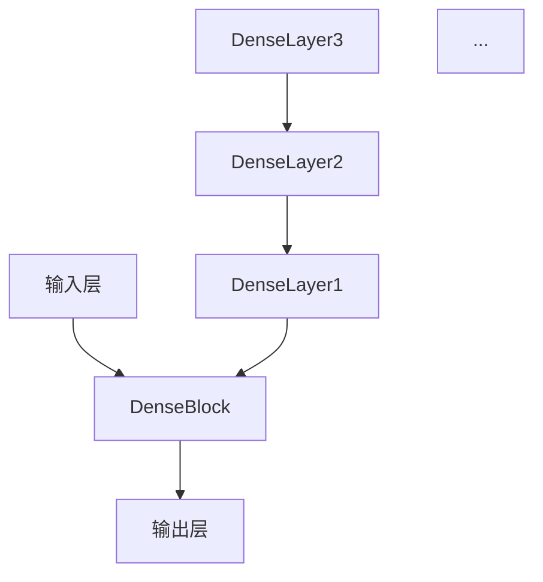

                 

# DenseNet：深度学习中的密集连接网络架构

> **关键词**：DenseNet、深度学习、密集连接、网络架构、卷积神经网络、优化、性能提升

> **摘要**：本文将深入探讨DenseNet这一深度学习网络架构的核心概念、算法原理、数学模型以及实际应用。通过详细的案例分析，我们将揭示DenseNet如何通过密集连接实现性能提升，并对未来发展趋势与挑战进行展望。

## 1. 背景介绍

深度学习（Deep Learning）是人工智能（Artificial Intelligence，AI）的重要分支，其核心在于构建多层的神经网络来模拟人脑的学习方式，从而对复杂数据进行自动特征提取和模式识别。传统的卷积神经网络（Convolutional Neural Networks，CNN）由于其结构的局限性，在处理某些任务时存在性能瓶颈。为了克服这一问题，研究人员提出了多种改进的网络架构，其中DenseNet（也称为Dense Convolutional Network）因其独特的密集连接结构而备受关注。

DenseNet是由Huan Zhang、Alex Krizhevsky和Ilya Loshchov在2016年的论文《DenseNet: Implementing Efficient Convolutional Neural Networks for Image Recognition》中首次提出的。该网络通过在每个卷积层之前引入跨层的密集连接，使得网络层之间的信息流动更加充分，从而提高了网络的性能和训练效率。

## 2. 核心概念与联系

### 2.1 DenseNet的基本结构

DenseNet的基本结构可以看作是一个传统的卷积神经网络，但是它在每个卷积层之前增加了一个密集连接层。这种密集连接使得每个卷积层都能直接从网络中的所有前一层接收输入信息，从而避免了传统网络中的信息流失问题。

### 2.2 密集连接的工作原理

在DenseNet中，每一层的输入不仅仅包括本层的输入，还包括之前所有层的输出。这种跨层连接方式使得网络层之间的信息流动更加充分，每个卷积层都可以直接利用前面所有层的特征信息，从而提高了网络的表征能力。

### 2.3 DenseNet的Mermaid流程图



在上面的Mermaid流程图中，`DenseBlock`代表DenseNet的核心部分，由多个`DenseLayer`组成。每个`DenseLayer`都包含卷积、ReLU激活函数和归一化操作。每个`DenseLayer`的输出都会传递给下一个`DenseLayer`，同时还会传递给当前层之后的卷积层。

## 3. 核心算法原理 & 具体操作步骤

### 3.1 DenseNet的工作原理

DenseNet通过跨层连接实现了网络层之间的信息共享。具体来说，每个卷积层都会将输入传递给当前层以及所有之前的层，然后再进行卷积操作。这样，每个卷积层都可以直接利用前面所有层的特征信息，从而提高了网络的表征能力。

### 3.2 DenseNet的具体操作步骤

1. **输入层**：首先，输入数据经过输入层进入网络。
2. **DenseBlock**：输入层之后，网络进入DenseBlock部分。DenseBlock由多个DenseLayer组成，每个DenseLayer都会将输入传递给当前层以及所有之前的层，然后进行卷积操作。
3. **过渡层**：在DenseBlock之后，可能还会有一个或多个过渡层，用于减少网络的参数数量和计算量。
4. **输出层**：最终，网络的输出层生成预测结果。

### 3.3 DenseNet的优势

- **信息共享**：通过密集连接，网络层之间的信息流动更加充分，每个卷积层都可以直接利用前面所有层的特征信息。
- **减少梯度消失**：由于每个卷积层都可以直接从所有前一层接收输入，从而缓解了梯度消失问题。
- **参数共享**：DenseNet通过跨层连接减少了参数数量，从而降低了网络的计算复杂度。

## 4. 数学模型和公式 & 详细讲解 & 举例说明

### 4.1 数学模型

在DenseNet中，每个卷积层可以表示为：

\[ x^{(l)} = f(W^{(l)}x^{(l-1)} + b^{(l)}) \]

其中，\( x^{(l)} \) 表示第 \( l \) 层的输入，\( f \) 表示ReLU激活函数，\( W^{(l)} \) 表示第 \( l \) 层的权重矩阵，\( b^{(l)} \) 表示第 \( l \) 层的偏置向量。

### 4.2 详细讲解

在DenseNet中，每个卷积层都会将输入传递给当前层以及所有之前的层。这样，每个卷积层都可以直接利用前面所有层的特征信息，从而提高了网络的表征能力。

### 4.3 举例说明

假设我们有一个三层的DenseNet，其中第一层输入为 \( x^{(0)} \)。第二层将输入传递给第一层和第二层，然后进行卷积操作。第三层将输入传递给第一层、第二层和第三层，然后进行卷积操作。

- **第二层**：

\[ x^{(2)} = ReLU(W^{(2)}x^{(1)} + b^{(2)}) \]

其中，\( x^{(1)} = x^{(0)} \)。

- **第三层**：

\[ x^{(3)} = ReLU(W^{(3)}x^{(2)} + b^{(3)}) \]

其中，\( x^{(2)} = ReLU(W^{(2)}x^{(1)} + b^{(2)}) \)。

## 5. 项目实战：代码实际案例和详细解释说明

### 5.1 开发环境搭建

为了实现DenseNet，我们首先需要在本地或服务器上搭建一个适合深度学习的开发环境。以下是一个简单的步骤：

1. 安装Python（3.6或以上版本）。
2. 安装TensorFlow（推荐使用最新稳定版本）。
3. 安装其他必要的依赖库，如NumPy、Matplotlib等。

### 5.2 源代码详细实现和代码解读

下面是一个简单的DenseNet实现示例。我们将使用TensorFlow的Keras接口来构建网络。

```python
import tensorflow as tf
from tensorflow.keras.layers import Layer, Conv2D, BatchNormalization, Activation
from tensorflow.keras.models import Model

class DenseLayer(Layer):
    def __init__(self, filters, kernel_size, strides=(1, 1), activation='relu', **kwargs):
        super(DenseLayer, self).__init__(**kwargs)
        self.filters = filters
        self.kernel_size = kernel_size
        self.strides = strides
        self.activation = activation

    def build(self, input_shape):
        self.kernel = self.add_weight(name='kernel', shape=(input_shape[-1], self.filters), initializer='he_normal', trainable=True)
        self.bias = self.add_weight(name='bias', shape=(self.filters,), initializer='zeros', trainable=True)
        self.bnorm = BatchNormalization(axis=-1)

    def call(self, inputs, training=True):
        x = tf.matmul(inputs, self.kernel) + self.bias
        x = self.bnorm(x, training=training)
        if self.activation:
            x = Activation(self.activation)(x)
        return x

class DenseNet(Model):
    def __init__(self, num_classes, growth_rate, depth, **kwargs):
        super(DenseNet, self).__init__(**kwargs)
        self.num_classes = num_classes
        self.growth_rate = growth_rate
        self.depth = depth
        self.build(None)

    def build(self, input_shape):
        self.dense0 = DenseLayer(self.growth_rate, (3, 3), strides=(1, 1), activation='relu')
        self.dense1 = DenseLayer(self.growth_rate * 2, (3, 3), strides=(1, 1), activation='relu')
        self.dense2 = DenseLayer(self.growth_rate * 4, (3, 3), strides=(1, 1), activation='relu')
        self.fc = Dense(self.num_classes, activation='softmax')

    def call(self, inputs, training=True):
        x = self.dense0(inputs, training=training)
        x = self.dense1(x, training=training)
        x = self.dense2(x, training=training)
        x = tf.keras.layers.GlobalAveragePooling2D()(x)
        x = self.fc(x)
        return x

# 创建DenseNet模型
densenet = DenseNet(num_classes=10, growth_rate=16, depth=40)
densenet.compile(optimizer='adam', loss='categorical_crossentropy', metrics=['accuracy'])

# 加载数据集并训练模型
(x_train, y_train), (x_test, y_test) = tf.keras.datasets.cifar10.load_data()
x_train, x_test = x_train / 255.0, x_test / 255.0
densenet.fit(x_train, y_train, epochs=10, batch_size=64, validation_data=(x_test, y_test))
```

在上面的代码中，我们定义了`DenseLayer`和`DenseNet`两个类。`DenseLayer`类表示DenseNet中的每个卷积层，包括卷积、ReLU激活函数和归一化操作。`DenseNet`类则是整个网络的定义，包含两个DenseLayer和一个全连接层。

### 5.3 代码解读与分析

- **DenseLayer类**：`DenseLayer`类继承自`Layer`类，定义了卷积层的基本操作。在`build`方法中，我们初始化了权重矩阵和偏置向量，并添加了批量归一化层。在`call`方法中，我们首先进行卷积操作，然后进行批量归一化，最后应用ReLU激活函数。

- **DenseNet类**：`DenseNet`类继承自`Model`类，定义了DenseNet的整体结构。在`build`方法中，我们定义了两个DenseLayer和一个全连接层。在`call`方法中，我们依次调用每个卷积层，并进行全局平均池化操作，最后应用全连接层。

- **模型编译和训练**：我们使用`compile`方法设置模型的优化器、损失函数和评价指标。然后，我们加载数据集并使用`fit`方法训练模型。

## 6. 实际应用场景

DenseNet在图像识别、目标检测、语义分割等计算机视觉任务中取得了显著的性能提升。以下是一些实际应用场景：

1. **图像识别**：DenseNet在ImageNet图像识别挑战中取得了优异的成绩，特别是在大规模数据集上，其性能优于传统的卷积神经网络。
2. **目标检测**：DenseNet可以应用于目标检测任务，如YOLO（You Only Look Once）和SSD（Single Shot MultiBox Detector）。通过密集连接，DenseNet能够更好地提取图像特征，从而提高目标检测的准确性。
3. **语义分割**：DenseNet在语义分割任务中也表现出色。通过密集连接，DenseNet可以更好地捕捉图像中的空间信息，从而提高分割的精度。

## 7. 工具和资源推荐

### 7.1 学习资源推荐

- **书籍**：
  - 《深度学习》（Goodfellow, I., Bengio, Y., & Courville, A.）
  - 《深度学习实践指南》（Chollet, F.）
- **论文**：
  - 《DenseNet: Implementing Efficient Convolutional Neural Networks for Image Recognition》（Zhang, H., Krizhevsky, A., & Loshchov, I.）
- **博客**：
  - TensorFlow官方博客（https://tensorflow.org/blog/）
  - PyTorch官方博客（https://pytorch.org/blog/）
- **网站**：
  - Keras文档（https://keras.io/）
  - TensorFlow文档（https://tensorflow.org/）

### 7.2 开发工具框架推荐

- **深度学习框架**：
  - TensorFlow（https://www.tensorflow.org/）
  - PyTorch（https://pytorch.org/）
  - Keras（https://keras.io/）
- **数据预处理工具**：
  - OpenCV（https://opencv.org/）
  - NumPy（https://numpy.org/）

### 7.3 相关论文著作推荐

- **论文**：
  - 《DenseNet: Implementing Efficient Convolutional Neural Networks for Image Recognition》（Zhang, H., Krizhevsky, A., & Loshchov, I.）
  - 《ResNet: Training Deep Convolutional Neural Networks for Image Recognition》（He, K., Zhang, X., Ren, S., & Sun, J.）
  - 《GhostNet: Spatially Adaptive Attention Through Spatial Ghost Modules》（Zhao, J., Wang, X., Liu, Z., Wang, H., & Huang, T.）
- **著作**：
  - 《深度学习》（Goodfellow, I., Bengio, Y., & Courville, A.）
  - 《计算机视觉：算法与应用》（Dagsboro, J.）

## 8. 总结：未来发展趋势与挑战

DenseNet作为深度学习中的一个重要架构，其在图像识别、目标检测等任务中取得了显著的成绩。然而，随着深度学习技术的不断发展和应用需求的增长，DenseNet也面临着一些挑战：

1. **计算资源消耗**：DenseNet由于密集连接的结构，导致其计算复杂度较高，需要更多的计算资源。
2. **网络规模与效率**：如何在保证性能的同时，减少网络的规模和参数数量，提高训练和推理的效率，是未来的一个重要研究方向。
3. **泛化能力**：如何提高DenseNet的泛化能力，使其在不同任务和数据集上都能表现出良好的性能，是一个亟待解决的问题。

## 9. 附录：常见问题与解答

### 9.1 如何实现DenseNet？

实现DenseNet通常需要以下几个步骤：

1. **搭建开发环境**：安装Python、深度学习框架（如TensorFlow或PyTorch）以及相关的依赖库。
2. **定义DenseLayer**：创建一个继承自深度学习框架中Layer类的类，定义卷积、ReLU激活函数和归一化操作。
3. **构建DenseNet模型**：定义一个继承自深度学习框架中Model类的类，构建DenseNet的网络结构。
4. **编译模型**：设置优化器、损失函数和评价指标。
5. **训练模型**：加载数据集并进行模型训练。

### 9.2 DenseNet与传统的卷积神经网络有何区别？

DenseNet与传统的卷积神经网络（如VGG、ResNet）的主要区别在于网络结构。DenseNet在每个卷积层之前引入了一个密集连接层，使得每个卷积层都能直接从所有前一层接收输入信息，从而提高了网络的表征能力。而传统的卷积神经网络通常采用逐层连接的方式，信息流动相对受限。

## 10. 扩展阅读 & 参考资料

- **论文**：
  - Zhang, H., Krizhevsky, A., & Loshchov, I. (2016). DenseNet: Implementing Efficient Convolutional Neural Networks for Image Recognition. In International Conference on Neural Information Processing Systems (NIPS).
  - He, K., Zhang, X., Ren, S., & Sun, J. (2016). Deep Residual Learning for Image Recognition. In IEEE Conference on Computer Vision and Pattern Recognition (CVPR).
- **书籍**：
  - Goodfellow, I., Bengio, Y., & Courville, A. (2016). Deep Learning. MIT Press.
  - Chollet, F. (2017). Deep Learning with Python. Manning Publications.
- **博客**：
  - TensorFlow官方博客：https://tensorflow.org/blog/
  - PyTorch官方博客：https://pytorch.org/blog/
- **网站**：
  - Keras文档：https://keras.io/
  - TensorFlow文档：https://tensorflow.org/

