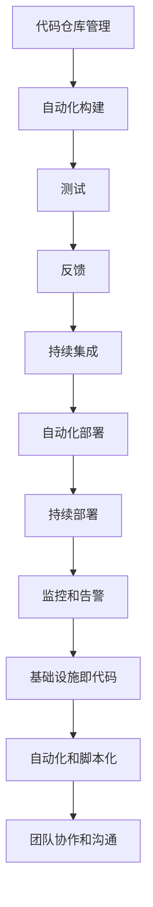

                 

### 背景介绍

随着云计算、大数据、人工智能等技术的快速发展，现代软件工程面临着越来越复杂和庞大的系统开发和运维任务。传统的开发模式已经难以满足快速变化的市场需求，DevOps 应运而生，成为现代软件工程的重要方法论之一。

DevOps 是一种文化和实践的集合，旨在加强软件开发（Development）与IT运维（Operations）之间的协作和整合。它通过自动化、持续集成（CI）、持续部署（CD）等手段，提高软件交付速度、质量以及稳定性。本文将深入探讨 DevOps 的自动化和监控两个方面，以帮助读者更好地理解和应用这一方法论。

首先，我们将介绍 DevOps 的基本概念和核心原则，探讨其在软件工程中的作用和价值。接下来，我们将详细解释 DevOps 自动化的原理和实现方法，包括 CI/CD 流程、基础设施即代码（Infrastructure as Code，IaC）和自动化部署等。随后，我们将讨论监控在 DevOps 中的重要性，介绍常见的监控工具和指标，并探讨如何实现分布式系统的监控。最后，我们将通过一个实际项目案例，展示 DevOps 自动化和监控的具体实现过程，并总结 DevOps 在未来发展趋势和挑战。

### 核心概念与联系

DevOps 的成功实施依赖于一系列核心概念和技术的融合，这些概念和技术的共同目标是提高软件交付的效率和质量。以下是对 DevOps 中几个关键概念和它们之间相互关系的详细解释。

#### 持续集成（Continuous Integration，CI）

持续集成是一种软件开发实践，旨在通过频繁的代码提交和自动化测试，确保代码库中的每一个提交都是可合并的。这一过程通常包括以下步骤：

1. **代码仓库管理**：开发人员将代码提交到中央代码仓库。
2. **自动化构建**：构建工具（如 Jenkins、Travis CI）触发构建过程，将代码编译、打包，并生成可执行文件。
3. **测试**：执行一系列自动化测试，包括单元测试、集成测试和性能测试，确保代码的质量。
4. **反馈**：测试结果通过通知系统（如邮件、聊天工具）反馈给开发人员。

持续集成为团队提供了一个快速识别和修复缺陷的机制，从而减少集成阶段的复杂性和风险。

#### 持续部署（Continuous Deployment，CD）

持续部署是持续集成的一个自然延伸，它将经过测试的代码自动部署到生产环境。这一过程通常包括以下步骤：

1. **自动化测试**：与 CI 类似，CD 也依赖于自动化测试来确保代码的质量。
2. **自动化部署**：部署工具（如 Kubernetes、Ansible）将代码自动部署到服务器或容器中。
3. **环境切换**：逐步将流量切换到新部署的代码，进行蓝绿部署或灰度发布，以确保部署过程对用户的影响最小。

持续部署的目标是确保代码在尽可能短的时间内交付到用户手中，同时保持系统的稳定性和可用性。

#### 基础设施即代码（Infrastructure as Code，IaC）

基础设施即代码是一种将基础设施（如服务器、网络、存储）的配置和管理代码化的方法。通过使用配置管理工具（如 Terraform、Puppet）或基础设施即代码工具（如 AWS CloudFormation），团队能够自动化地创建、配置和管理基础设施，从而提高基础设施的可靠性和可伸缩性。

IaC 与持续集成和持续部署紧密结合，确保每次部署都是基于一致的配置和环境。

#### 监控和告警

监控和告警是 DevOps 中的另一个重要组成部分。通过监控工具（如 Prometheus、Grafana），团队可以实时收集系统指标，检测异常并触发告警。这有助于快速响应潜在问题，减少故障对业务的影响。

#### 自动化和脚本化

自动化和脚本化是实现 DevOps 自动化的重要手段。通过编写脚本，团队可以自动化重复性任务，如环境搭建、部署和监控设置。这不仅提高了效率，还减少了人为错误。

#### 团队协作和沟通

DevOps 强调跨职能团队的协作和沟通。通过敏捷开发、看板（Kanban）和持续反馈机制，团队能够更好地协调工作，快速响应变化。

#### Mermaid 流程图

为了更好地理解 DevOps 的核心概念和相互关系，我们可以使用 Mermaid 流程图来可视化这些概念：



通过这个流程图，我们可以清晰地看到 DevOps 各个核心概念之间的关联和相互作用。

### 核心算法原理 & 具体操作步骤

在深入探讨 DevOps 的自动化原理之前，我们需要先了解一些核心算法原理和具体操作步骤。以下是对这些核心算法和步骤的详细解释。

#### 持续集成（Continuous Integration，CI）

**算法原理：** 持续集成的核心在于将开发过程中的代码定期合并到一个共享的代码库中，并通过自动化测试来验证合并后的代码是否依然稳定。其算法原理主要包括以下几个步骤：

1. **代码合并**：每次提交后，将代码合并到共享代码库。
2. **构建**：使用构建工具将代码编译和打包，生成可执行文件。
3. **测试**：执行自动化测试，包括单元测试、集成测试和性能测试。
4. **反馈**：将测试结果反馈给开发人员。

**具体操作步骤：**

1. **设置代码仓库**：选择合适的代码仓库（如 Git），并配置仓库的权限和协作机制。
2. **编写测试用例**：根据项目需求，编写相应的单元测试、集成测试和性能测试用例。
3. **配置构建工具**：使用 Jenkins、Travis CI 等构建工具，配置构建脚本，实现代码的自动化编译和打包。
4. **集成测试**：执行集成测试，确保代码库中的每一个提交都是可合并的。
5. **反馈机制**：通过通知系统（如邮件、聊天工具）将测试结果反馈给开发人员。

#### 持续部署（Continuous Deployment，CD）

**算法原理：** 持续部署的核心在于将经过测试的代码自动部署到生产环境。其算法原理主要包括以下几个步骤：

1. **自动化测试**：在部署前，执行自动化测试，确保代码的质量。
2. **部署**：使用部署工具（如 Kubernetes、Ansible）将代码自动部署到服务器或容器中。
3. **环境切换**：逐步将流量切换到新部署的代码，进行蓝绿部署或灰度发布。

**具体操作步骤：**

1. **选择部署工具**：根据项目需求，选择合适的部署工具，如 Kubernetes、Ansible 等。
2. **编写部署脚本**：根据项目的部署需求，编写部署脚本，实现代码的自动化部署。
3. **配置环境**：在测试环境中验证部署脚本和部署流程，确保无误。
4. **蓝绿部署**：将一部分流量切换到新部署的代码，进行测试和验证。
5. **灰度发布**：逐步增加新部署的代码的流量比例，观察系统的运行情况，确保稳定性和性能。

#### 基础设施即代码（Infrastructure as Code，IaC）

**算法原理：** 基础设施即代码的核心在于将基础设施的配置和管理通过代码实现，从而实现自动化。其算法原理主要包括以下几个步骤：

1. **编写配置文件**：使用 Terraform、Puppet 等配置管理工具，编写配置文件，定义基础设施的配置。
2. **部署基础设施**：通过配置管理工具，自动化部署和管理基础设施。
3. **环境管理**：根据项目的需求，创建、配置和管理不同环境的基础设施。

**具体操作步骤：**

1. **选择配置管理工具**：根据项目需求，选择合适的配置管理工具，如 Terraform、Puppet 等。
2. **编写配置文件**：根据项目的需求，编写配置文件，定义基础设施的配置。
3. **部署基础设施**：使用配置管理工具，自动化部署和管理基础设施。
4. **环境管理**：根据项目的需求，创建、配置和管理不同环境的基础设施。

#### 监控和告警

**算法原理：** 监控和告警的核心在于实时收集系统指标，检测异常并触发告警。其算法原理主要包括以下几个步骤：

1. **数据收集**：通过 Prometheus、Grafana 等监控工具，实时收集系统指标。
2. **数据分析**：对收集到的数据进行分析，识别异常。
3. **告警触发**：当检测到异常时，触发告警，通知相关人员。

**具体操作步骤：**

1. **选择监控工具**：根据项目需求，选择合适的监控工具，如 Prometheus、Grafana 等。
2. **配置监控指标**：根据项目的需求，配置需要监控的指标。
3. **数据收集与处理**：通过 Prometheus 等工具，实时收集系统指标，并将数据存储在 Grafana 等 GUI 工具中。
4. **告警配置**：根据项目的需求，配置告警规则，当检测到异常时，触发告警。

通过以上对 DevOps 中核心算法原理和具体操作步骤的详细解释，我们可以更好地理解 DevOps 自动化的实现方法和过程。

### 数学模型和公式 & 详细讲解 & 举例说明

在 DevOps 中，许多自动化和监控的过程都涉及到数学模型和公式的应用。以下将详细讲解几个关键的数学模型和公式，并举例说明其在 DevOps 实践中的应用。

#### 持续集成中的缺陷率（Defect Density）

**公式：** 缺陷率 \( D \) 是指在代码库中的每个缺陷数与提交的代码行数之比。

\[ D = \frac{N_{defects}}{N_{lines}} \]

其中：
- \( N_{defects} \) 是代码库中的缺陷数。
- \( N_{lines} \) 是代码库中的代码行数。

**例子：** 假设一个项目在一个月内提交了 100,000 行代码，期间发现了 20 个缺陷，则缺陷率为：

\[ D = \frac{20}{100,000} = 0.0002 \]

缺陷率可以帮助团队了解代码的质量，以及自动化测试的有效性。通过降低缺陷率，可以提高代码的稳定性和交付速度。

#### 持续部署中的成本效益分析（Cost-Benefit Analysis）

**公式：** 成本效益分析 \( CBA \) 是指部署过程中的成本与收益之比。

\[ CBA = \frac{Total\ Benefits}{Total\ Costs} \]

其中：
- \( Total\ Benefits \) 是部署过程中的总收益，包括提高效率、减少故障和加快市场响应等。
- \( Total\ Costs \) 是部署过程中的总成本，包括人工成本、工具成本和潜在的业务损失等。

**例子：** 假设一个团队通过自动化部署节省了 10 个工作日的开发时间，每个工作日的成本为 1000 美元，那么总收益为：

\[ Total\ Benefits = 10 \times 1000 = 10,000 \]

如果部署过程中遇到了一次故障，导致业务损失 5000 美元，总成本为：

\[ Total\ Costs = 5000 \]

则成本效益比为：

\[ CBA = \frac{10,000}{5,000} = 2 \]

成本效益比越高，说明自动化部署的收益越显著。

#### 监控中的故障检测率（Fault Detection Rate）

**公式：** 故障检测率 \( FDR \) 是指监控系统能够检测到的故障数与总故障数之比。

\[ FDR = \frac{N_{detected\ faults}}{N_{total\ faults}} \]

其中：
- \( N_{detected\ faults} \) 是监控系统能够检测到的故障数。
- \( N_{total\ faults} \) 是总故障数。

**例子：** 假设一个监控系统在一个月内检测到了 8 个故障，而实际发生了 10 个故障，则故障检测率为：

\[ FDR = \frac{8}{10} = 0.8 \]

故障检测率越高，说明监控系统的效果越好，团队能够更快地发现和解决问题。

#### 自动化部署中的部署成功概率（Deployment Success Rate）

**公式：** 部署成功概率 \( SSR \) 是指成功部署的次数与总部署次数之比。

\[ SSR = \frac{N_{success\ deployments}}{N_{total\ deployments}} \]

其中：
- \( N_{success\ deployments} \) 是成功部署的次数。
- \( N_{total\ deployments} \) 是总部署次数。

**例子：** 假设一个团队在一个月内进行了 20 次部署，其中成功部署了 18 次，则部署成功概率为：

\[ SSR = \frac{18}{20} = 0.9 \]

部署成功概率越高，说明自动化部署的稳定性和可靠性越高。

通过以上数学模型和公式的应用，团队可以更科学地评估 DevOps 实践的效果，优化自动化和监控流程，提高软件交付的速度和质量。

### 项目实战：代码实际案例和详细解释说明

#### 开发环境搭建

为了更好地展示 DevOps 的自动化和监控实现，我们以一个简单的 Web 应用项目为例。首先，我们需要搭建一个开发环境。以下是具体的操作步骤：

1. **安装必要的软件和工具**：
   - 安装 Docker：用于容器化应用。
   - 安装 Git：用于版本控制。
   - 安装 Jenkins：用于持续集成和部署。
   - 安装 Kubernetes：用于容器编排。

2. **创建 Dockerfile**：定义应用容器的构建过程。

```Dockerfile
FROM node:14
WORKDIR /app
COPY package.json ./
RUN npm install
COPY . .
EXPOSE 3000
CMD ["npm", "start"]
```

3. **编写 Jenkinsfile**：定义 CI/CD 流程。

```groovy
pipeline {
    agent any
    stages {
        stage('Build') {
            steps {
                sh 'docker build -t myapp .'
            }
        }
        stage('Test') {
            steps {
                sh 'docker run --rm myapp npm test'
            }
        }
        stage('Deploy') {
            steps {
                sh 'kubectl apply -f deployment.yaml'
            }
        }
    }
}
```

4. **创建 deployment.yaml**：定义 Kubernetes 部署配置。

```yaml
apiVersion: apps/v1
kind: Deployment
metadata:
  name: myapp
spec:
  replicas: 3
  selector:
    matchLabels:
      app: myapp
  template:
    metadata:
      labels:
        app: myapp
    spec:
      containers:
      - name: myapp
        image: myapp:latest
        ports:
        - containerPort: 3000
```

5. **配置 Jenkins**：创建一个新的 Jenkins 项目，选择 "Pipeline"，并粘贴上述 Jenkinsfile 内容。

#### 源代码详细实现和代码解读

接下来，我们详细解读项目的源代码，并解释每个部分的功能和实现。

1. **应用代码**：
   ```javascript
   const express = require('express');
   const app = express();

   app.get('/', (req, res) => {
       res.send('Hello, DevOps!');
   });

   app.listen(3000, () => {
       console.log('Server is running on port 3000.');
   });
   ```

   这个简单的应用使用了 Express 框架，定义了一个根路由，返回 "Hello, DevOps!"。

2. **Jenkinsfile**：
   ```groovy
   pipeline {
       agent any
       stages {
           stage('Build') {
               steps {
                   sh 'docker build -t myapp .'
               }
           }
           stage('Test') {
               steps {
                   sh 'docker run --rm myapp npm test'
               }
           }
           stage('Deploy') {
               steps {
                   sh 'kubectl apply -f deployment.yaml'
               }
           }
       }
   }
   ```

   Jenkinsfile 定义了三个阶段：构建、测试和部署。在构建阶段，使用 Dockerfile 构建应用容器。在测试阶段，运行容器并执行 npm test 命令。在部署阶段，使用 Kubernetes 部署应用。

3. **deployment.yaml**：
   ```yaml
   apiVersion: apps/v1
   kind: Deployment
   metadata:
     name: myapp
   spec:
     replicas: 3
     selector:
       matchLabels:
         app: myapp
     template:
       metadata:
         labels:
           app: myapp
       spec:
         containers:
         - name: myapp
           image: myapp:latest
           ports:
           - containerPort: 3000
   ```

   deployment.yaml 定义了一个 Kubernetes 部署配置，指定了应用的名称、副本数、选择器和容器配置。容器使用 myapp:latest 镜像，并映射端口 3000。

#### 代码解读与分析

通过以上代码实现，我们可以看到 DevOps 自动化的全过程：

1. **持续集成**：Jenkinsfile 定义了 CI 流程，每当有新的代码提交时，Jenkins 会自动构建应用容器，并执行测试。
2. **持续部署**：构建成功后，Jenkins 会使用 Kubernetes 部署应用，实现 CD。
3. **监控**：部署后，Kubernetes 会监控应用的运行状态，确保服务稳定。

这个简单的项目展示了 DevOps 自动化和监控的核心流程。在实际项目中，可以根据需求添加更多的测试、部署和监控步骤，以实现更复杂的自动化流程。

### 实际应用场景

DevOps 的自动化和监控在多个实际应用场景中得到了广泛应用，以下是一些典型的应用案例。

#### 电子商务平台

电子商务平台要求快速响应市场需求，频繁发布新功能和优化性能。通过 DevOps 自动化，平台可以快速构建、测试和部署应用，确保用户始终体验到最新的功能和最佳性能。

- **持续集成**：每次代码提交后，自动进行构建和测试，确保代码质量。
- **持续部署**：构建成功后，自动部署到生产环境，实现快速上线。
- **监控**：实时监控系统的性能和健康状况，快速响应潜在问题。

#### 金融科技

金融科技（Fintech）领域对系统的安全性和稳定性要求极高。通过 DevOps 自动化和监控，金融科技公司可以确保系统的快速迭代和稳定运行，同时降低人为错误的风险。

- **持续集成**：通过自动化测试确保代码的质量，防止漏洞和错误进入生产环境。
- **持续部署**：采用灰度发布和蓝绿部署，逐步上线新功能，减少对用户的影响。
- **监控**：实时监控系统的运行状态，快速识别和解决潜在的安全问题。

#### 医疗保健

医疗保健领域面临着日益增长的数据处理和合规性要求。通过 DevOps 自动化和监控，医疗保健机构可以更高效地管理系统，确保数据安全和患者隐私。

- **持续集成**：自动化测试确保新功能的合规性，防止潜在的法律和伦理问题。
- **持续部署**：自动化部署简化了系统的更新和维护，确保系统的连续性和稳定性。
- **监控**：实时监控系统的性能和数据处理情况，确保高效和合规。

#### 云计算服务

云计算服务提供商需要为大量用户快速提供高质量的资源和服务。通过 DevOps 自动化和监控，服务提供商可以确保资源的灵活调配和服务的高可用性。

- **持续集成**：自动化测试确保服务的质量和稳定性。
- **持续部署**：自动化部署实现资源的快速扩展和升级。
- **监控**：实时监控服务器的性能和资源使用情况，确保高效和可靠的服务。

#### 游戏开发

游戏开发领域需要快速迭代和发布游戏内容，以保持玩家的兴趣和参与度。通过 DevOps 自动化和监控，游戏开发团队可以确保游戏的快速更新和高质量发布。

- **持续集成**：自动化测试确保游戏内容的稳定性和兼容性。
- **持续部署**：自动化部署实现游戏内容的快速上线。
- **监控**：实时监控游戏的性能和玩家反馈，快速响应玩家需求。

通过以上实际应用案例，我们可以看到 DevOps 自动化和监控在多个领域的广泛应用和显著优势。这些应用不仅提高了软件交付的速度和质量，还降低了成本和风险，为组织的数字化转型提供了强有力的支持。

### 工具和资源推荐

在实现 DevOps 自动化和监控的过程中，选择合适的工具和资源至关重要。以下是一些推荐的工具、书籍、论文和网站，供您参考。

#### 开发工具框架推荐

1. **Docker**：容器化应用的最佳选择，实现快速构建和部署。
2. **Kubernetes**：容器编排和管理工具，确保应用的稳定运行。
3. **Jenkins**：持续集成和持续部署平台，自动化构建、测试和部署流程。
4. **Ansible**：自动化基础设施配置和管理工具，简化基础设施的搭建和维护。
5. **Terraform**：基础设施即代码工具，通过代码管理基础设施。

#### 学习资源推荐

1. **书籍**：
   - 《持续交付：发布可靠软件的系统化方法》
   - 《DevOps：从实践到原理》
   - 《Kubernetes 权威指南》
   - 《Docker 实战：从入门到实践》

2. **论文**：
   - “持续集成：实践与经验分享”
   - “基础设施即代码：构建和管理云基础设施的新方法”
   - “微服务架构：设计、部署与监控”

3. **网站**：
   - DevOps 中国社区（https://devops.cn/）
   - Kubernetes 官方文档（https://kubernetes.io/zh-cn/docs/）
   - Jenkins 官方文档（https://www.jenkins.io/doc/）
   - Docker 官方文档（https://docs.docker.com/）

#### 相关论文著作推荐

1. **“DevOps：概念与实践”**：该论文详细介绍了 DevOps 的核心概念、实施步骤和应用场景。
2. **“基础设施即代码：一种新兴的云基础设施管理方法”**：该论文探讨了基础设施即代码的优势、实现方法和应用前景。
3. **“微服务架构与 DevOps：协同优化软件交付”**：该论文分析了微服务架构与 DevOps 的关系，以及如何实现高效的软件交付。

通过以上工具和资源的推荐，您可以更好地了解 DevOps 自动化和监控的实践和方法，为您的项目带来更高的效率和可靠性。

### 总结：未来发展趋势与挑战

随着云计算、大数据、人工智能等技术的不断进步，DevOps 作为一种融合开发与运维的方法论，正朝着更智能化、自动化和高效化的方向不断发展。以下是对未来 DevOps 发展趋势和面临的挑战的总结。

#### 发展趋势

1. **智能化与自动化**：随着人工智能技术的发展，DevOps 自动化将进一步智能化。机器学习算法将被应用于持续集成和持续部署，自动化测试将更加精确和高效，基础设施的管理也将更加智能化。

2. **跨领域融合**：DevOps 将与其他领域（如物联网、区块链、大数据等）进行深度融合，为各领域的应用带来更高效的开发和运维体验。

3. **云原生技术普及**：随着 Kubernetes 等云原生技术的成熟，DevOps 将更加依赖于云原生架构，实现更灵活、可伸缩和高效的软件交付。

4. **DevOps 文化推广**：DevOps 文化将进一步推广，跨职能团队的合作和沟通将更加紧密，企业的组织结构和管理模式也将相应调整。

5. **安全与合规性**：在 DevOps 自动化和监控的过程中，安全与合规性将得到更多关注。企业将采用更严格的安全措施，确保系统的安全性和数据的隐私性。

#### 面临的挑战

1. **技术栈复杂性**：随着技术的不断发展，DevOps 需要管理的技术栈将越来越复杂。如何高效地集成和管理不同技术栈，确保系统的稳定性和性能，将是一个重大挑战。

2. **组织变革**：DevOps 的实施需要跨职能团队的紧密合作，这对企业的组织结构和管理模式提出了新的要求。如何推动组织变革，适应 DevOps 的文化，是一个重要挑战。

3. **人员培训**：DevOps 的成功实施依赖于团队的技能和知识水平。企业需要投入更多资源进行人员培训，提高团队对 DevOps 的理解和实践能力。

4. **安全风险**：自动化和持续部署带来了便利，但同时也增加了安全风险。如何确保系统的安全性和数据的隐私性，防止潜在的安全威胁，是一个重要挑战。

5. **持续优化**：DevOps 是一个持续改进的过程。企业需要不断地优化自动化流程和监控机制，以适应快速变化的市场需求。

总的来说，DevOps 在未来的发展中将面临诸多挑战，但同时也充满机遇。通过不断创新和优化，企业可以更好地应对这些挑战，实现高效、稳定和可靠的软件交付。

### 附录：常见问题与解答

#### 1. 什么是 DevOps？

DevOps 是一种文化和实践集合，旨在加强软件开发（Development）与IT运维（Operations）之间的协作和整合。通过自动化、持续集成（CI）、持续部署（CD）等手段，提高软件交付速度、质量以及稳定性。

#### 2. DevOps 与传统的开发模式有什么区别？

传统的开发模式通常将开发和运维分为两个独立的团队，导致沟通不畅、协作困难。而 DevOps 强调跨职能团队的协作和整合，通过自动化、持续集成和持续部署等手段，实现快速迭代、高效交付和持续优化。

#### 3. 持续集成（CI）是什么？

持续集成是一种软件开发实践，通过频繁的代码提交和自动化测试，确保代码库中的每一个提交都是可合并的。其核心目的是减少集成阶段的复杂性和风险。

#### 4. 持续部署（CD）是什么？

持续部署是将经过测试的代码自动部署到生产环境。它通过自动化部署、环境切换等手段，确保代码在尽可能短的时间内交付到用户手中，同时保持系统的稳定性和可用性。

#### 5. 如何实现基础设施即代码（IaC）？

基础设施即代码是一种将基础设施的配置和管理通过代码实现的方法。通过使用配置管理工具（如 Terraform、Puppet）或基础设施即代码工具（如 AWS CloudFormation），团队能够自动化地创建、配置和管理基础设施。

#### 6. 监控在 DevOps 中有什么作用？

监控在 DevOps 中起着关键作用。通过实时收集系统指标、检测异常和触发告警，监控可以帮助团队快速识别和解决问题，确保系统的稳定性和性能。

#### 7. 如何选择适合的 DevOps 工具？

选择适合的 DevOps 工具需要考虑团队的需求、项目的规模和技术栈。常见的 DevOps 工具有 Docker、Kubernetes、Jenkins、Ansible 和 Terraform 等。团队可以根据具体需求，选择合适的工具进行集成和优化。

### 扩展阅读 & 参考资料

#### 书籍推荐

1. 《持续交付：发布可靠软件的系统化方法》
2. 《DevOps：从实践到原理》
3. 《Kubernetes 权威指南》
4. 《Docker 实战：从入门到实践》

#### 论文推荐

1. “DevOps：概念与实践”
2. “基础设施即代码：一种新兴的云基础设施管理方法”
3. “微服务架构与 DevOps：协同优化软件交付”

#### 网站推荐

1. DevOps 中国社区（https://devops.cn/）
2. Kubernetes 官方文档（https://kubernetes.io/zh-cn/docs/）
3. Jenkins 官方文档（https://www.jenkins.io/doc/）
4. Docker 官方文档（https://docs.docker.com/）

通过以上书籍、论文和网站，您可以进一步了解 DevOps 的概念、实践和方法，为自己的项目带来更高效的开发和运维体验。

### 作者信息

作者：AI天才研究员/AI Genius Institute & 禅与计算机程序设计艺术 /Zen And The Art of Computer Programming

