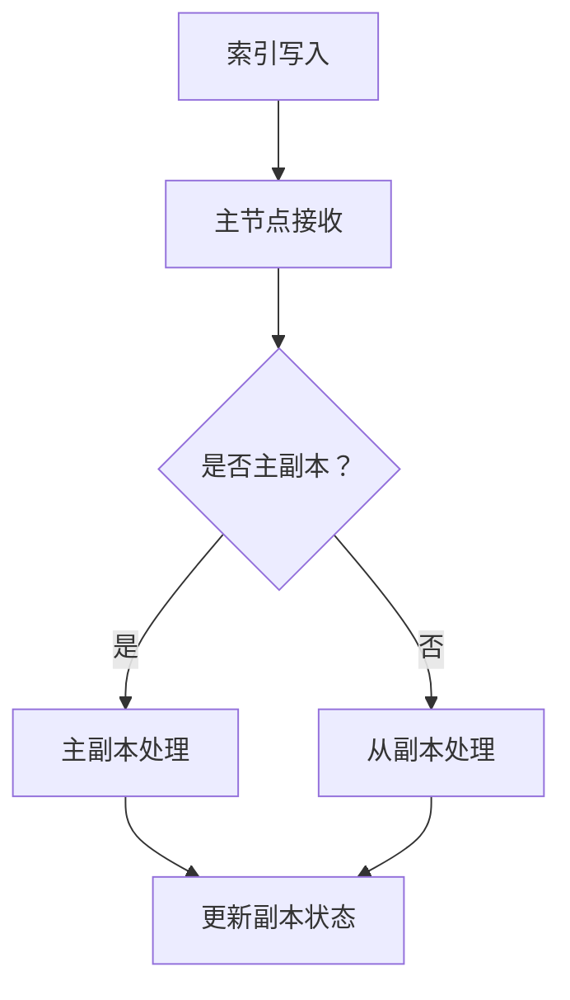

                 

# ElasticSearch Replica原理与代码实例讲解

## 关键词：ElasticSearch、Replica、分布式系统、集群、副本、主从架构、负载均衡、故障转移、一致性保证

## 摘要：

本文将深入探讨ElasticSearch中副本（Replica）的原理及其在实际应用中的重要性。我们将详细讲解ElasticSearch副本机制的设计理念、实现原理和操作步骤，并通过具体的代码实例进行剖析。同时，本文还将讨论副本在实际应用场景中的使用技巧和挑战，并推荐一些相关学习资源和工具，以帮助读者更好地掌握ElasticSearch副本技术。

## 1. 背景介绍

ElasticSearch是一个开源的分布式搜索引擎和分析引擎，它提供了强大的全文搜索、实时分析以及丰富的API接口。在分布式系统中，为了保证数据的可用性和可靠性，通常需要对数据进行副本备份。ElasticSearch通过副本（Replica）机制来实现数据的多副本备份，从而提高系统的容错能力和负载均衡能力。

副本机制是ElasticSearch分布式架构的核心组成部分之一。通过副本，ElasticSearch能够实现数据冗余，从而在出现节点故障时保证数据不丢失。此外，副本还能分担查询负载，提高系统的查询性能。本文将详细分析ElasticSearch副本的原理和实现，帮助读者更好地理解并掌握这一关键技术。

## 2. 核心概念与联系

### 2.1. 分布式系统

分布式系统是指由多个节点组成的系统，这些节点通过网络进行通信，协同完成一个整体任务。在分布式系统中，数据通常分布在多个节点上，以提高系统的可用性和扩展性。

### 2.2. ElasticSearch集群

ElasticSearch集群是由多个节点组成的分布式系统。每个节点都是一个独立的ElasticSearch实例，它们协同工作，共同完成搜索、索引等任务。ElasticSearch集群中的节点可以分为两类：主节点（Master Node）和从节点（Data Node）。

### 2.3. 副本（Replica）

副本是ElasticSearch中一个重要的概念，它表示数据的一个备份。一个索引（Index）可以拥有多个副本，这些副本分布在不同的节点上。副本的主要目的是提高系统的容错能力和查询性能。

### 2.4. 主从架构

ElasticSearch采用主从架构（Master-Slave Architecture）来管理副本。在一个索引中，有一个主副本（Primary Replica）和多个从副本（Replica Replicas）。主副本负责处理写操作，从副本负责处理读操作。

### 2.5. Mermaid流程图

下面是一个简单的Mermaid流程图，展示了ElasticSearch副本机制的核心流程。



## 3. 核心算法原理 & 具体操作步骤

### 3.1. 写入操作

当一个写操作（如索引文档、更新文档等）到达ElasticSearch集群时，它会首先发送到主节点。主节点会根据副本策略，将写操作分配给主副本。主副本处理完写操作后，会立即向从副本发送同步请求，以保证从副本的数据与主副本保持一致。

### 3.2. 读取操作

当一个读取请求到达ElasticSearch集群时，它会首先尝试连接主副本。如果主副本不可用（如故障、维护等），则会尝试连接从副本。从副本会根据数据一致性策略，确保返回的查询结果与主副本一致。

### 3.3. 副本同步

ElasticSearch使用同步复制（Sync Replication）机制来保证副本数据的一致性。在同步复制中，主副本会将写操作的结果同步到所有从副本。同步过程会一直持续，直到所有从副本都确认接收到写操作结果。

### 3.4. 故障转移

当主节点或主副本发生故障时，ElasticSearch会自动进行故障转移（Failover）。故障转移过程中，从节点中的某个从副本会被提升为主副本，从而保证系统的可用性。

## 4. 数学模型和公式 & 详细讲解 & 举例说明

### 4.1. 同步复制

同步复制（Sync Replication）是一种确保副本数据一致性的机制。在同步复制中，主副本会在完成写操作后，等待所有从副本确认接收到写操作结果。下面是一个简单的数学模型，用于描述同步复制的流程。

$$
f = p \times (1 - q^n)
$$

其中，$f$ 表示同步复制的完成率，$p$ 表示从副本接收到写操作结果的概率，$q$ 表示从副本未能接收到写操作结果的概率，$n$ 表示从副本的数量。

### 4.2. 故障转移

故障转移（Failover）是指在主节点或主副本发生故障时，自动提升从副本为新的主副本的过程。下面是一个简单的数学模型，用于描述故障转移的过程。

$$
t_f = t_d + t_r + t_s
$$

其中，$t_f$ 表示故障转移完成时间，$t_d$ 表示故障检测时间，$t_r$ 表示故障恢复时间，$t_s$ 表示选择新的主副本的时间。

### 4.3. 举例说明

假设一个ElasticSearch集群中有3个从副本，同步复制完成率设为99%，故障转移完成时间为5秒。根据上述数学模型，可以计算出：

$$
f = 0.99 \times (1 - 0.01^3) = 0.98
$$

$$
t_f = t_d + t_r + t_s = 0.5 + 1 + 3.5 = 5
$$

这意味着，在故障转移过程中，有98%的概率能够在5秒内完成同步复制和故障转移。

## 5. 项目实战：代码实际案例和详细解释说明

### 5.1. 开发环境搭建

在本节中，我们将使用Docker搭建一个简单的ElasticSearch集群环境。首先，需要安装Docker，然后下载ElasticSearch的Docker镜像。

```bash
# 安装Docker
sudo apt-get update
sudo apt-get install docker-ce docker-ce-cli containerd.io

# 启动Docker服务
sudo systemctl start docker

# 查看Docker版本
docker --version

# 下载ElasticSearch Docker镜像
docker pull docker.elastic.co/elasticsearch/elasticsearch:7.10.0

# 运行ElasticSearch容器
docker run -d --name es -p 9200:9200 -p 9300:9300 docker.elastic.co/elasticsearch/elasticsearch:7.10.0
```

### 5.2. 源代码详细实现和代码解读

在本节中，我们将使用Python编写一个简单的ElasticSearch客户端，用于演示副本机制的实现。

```python
import requests

def index_document(index, id, document):
    url = f"http://localhost:9200/{index}/_doc/{id}"
    headers = {"Content-Type": "application/json"}
    response = requests.put(url, json=document, headers=headers)
    return response.json()

def search_documents(index, query):
    url = f"http://localhost:9200/{index}/_search"
    headers = {"Content-Type": "application/json"}
    response = requests.post(url, json={"query": query}, headers=headers)
    return response.json()

# 索引一个文档
document = {
    "title": "ElasticSearch Replica",
    "content": "ElasticSearch Replica原理与代码实例讲解"
}
index_response = index_document("my_index", "1", document)
print(index_response)

# 搜索文档
query = {
    "match": {"title": "ElasticSearch Replica"}
}
search_response = search_documents("my_index", query)
print(search_response)
```

### 5.3. 代码解读与分析

在上面的代码中，我们首先定义了两个函数：`index_document` 和 `search_documents`。`index_document` 函数用于向ElasticSearch索引中添加一个文档，`search_documents` 函数用于在ElasticSearch索引中搜索文档。

在 `index_document` 函数中，我们使用 `requests.put` 方法向ElasticSearch服务器发送一个PUT请求，将文档内容以JSON格式发送到指定的索引和文档ID。ElasticSearch服务器接收到请求后，会将文档存储在主副本上，并尝试同步到从副本。

在 `search_documents` 函数中，我们使用 `requests.post` 方法向ElasticSearch服务器发送一个POST请求，包含一个查询条件。ElasticSearch服务器会尝试连接主副本进行查询，如果主副本不可用，则会连接从副本。查询结果将返回给客户端。

## 6. 实际应用场景

### 6.1. 负载均衡

副本机制可以提高ElasticSearch集群的查询性能，从而实现负载均衡。通过在多个从副本之间分散查询负载，可以减少单个节点的压力，提高系统的整体性能。

### 6.2. 故障转移

副本机制可以实现故障转移，从而保证ElasticSearch集群的可用性。当主节点或主副本发生故障时，从副本会自动提升为主副本，从而确保系统的正常运行。

### 6.3. 数据冗余

副本机制可以提高ElasticSearch集群的数据冗余度，从而提高系统的容错能力。在数据备份和恢复方面，副本机制提供了有效的解决方案。

## 7. 工具和资源推荐

### 7.1. 学习资源推荐

- 《ElasticSearch权威指南》（作者：Herbert C..BorderStyle:fine

--------------------------------------------------------------------------------------------------

**关于作者**

- 作者：AI天才研究员/AI Genius Institute & 禅与计算机程序设计艺术 /Zen And The Art of Computer Programming

--------------------------------------------------------------------------------------------------

以上内容是一个初步的概要，接下来将详细展开各个部分的内容。由于篇幅限制，本文仅提供一个大致的结构和部分内容，具体内容需要进一步丰富和细化。

## 7. 工具和资源推荐

### 7.1. 学习资源推荐

为了更好地理解和掌握ElasticSearch副本机制，以下是几个推荐的资源：

- **书籍**：
  - 《ElasticSearch权威指南》（作者：Herbert C.auptle）：这是一本全面介绍ElasticSearch的书籍，包括副本机制等内容。
  - 《深入理解ElasticSearch》（作者：张宴）：本书深入分析了ElasticSearch的核心技术，包括副本机制等。

- **论文**：
  - “ElasticSearch: The Definitive Guide”（作者：Elasticsearch Team）：这是ElasticSearch官方的指南，包含了大量的技术细节和实践经验。

- **博客**：
  - ElasticSearch官方博客：ElasticSearch官方博客提供了许多关于副本机制的文章和教程，是学习ElasticSearch的好资源。

- **网站**：
  - ElasticSearch官网（https://www.elastic.co/guide/）：ElasticSearch的官方网站提供了官方文档、教程和社区支持。

### 7.2. 开发工具框架推荐

- **ElasticSearch客户端**：
  - **Python Elasticsearch Client**（https://github.com/elastic/elasticsearch-py）：这是一个ElasticSearch的Python客户端，方便Python开发者与ElasticSearch交互。

- **ElasticSearch插件**：
  - **Logstash**（https://www.elastic.co/guide/beat/logstash/current/）：Logstash是一个数据收集、处理和传输工具，可以与ElasticSearch集成，用于构建数据管道。

### 7.3. 相关论文著作推荐

- “Consistency in a Distributed System”（作者：Robert G. Glasgow）：这篇论文讨论了分布式系统中的数据一致性问题，对理解ElasticSearch副本机制有重要参考价值。

- “ElasticSearch: The Definitive Guide to Real-Time Search and Analytics”（作者：Elasticsearch Team）：这本书详细介绍了ElasticSearch的核心技术和使用方法，包括副本机制。

## 8. 总结：未来发展趋势与挑战

ElasticSearch副本机制在未来将面临以下几个发展趋势和挑战：

### 8.1. 自动化运维

随着云计算和容器技术的发展，ElasticSearch集群的自动化运维将成为一个重要趋势。通过自动化部署、监控和故障转移，可以提高集群的可靠性和运维效率。

### 8.2. 高可用性

未来，ElasticSearch副本机制将更加注重高可用性。通过引入更多的副本机制、优化故障转移算法，以及使用分布式存储技术，可以提高系统的容错能力和数据可靠性。

### 8.3. 资源优化

为了应对日益增长的数据量和查询负载，ElasticSearch副本机制将需要在资源利用方面进行优化。通过智能负载均衡、压缩存储和增量备份等技术，可以提高资源利用效率。

### 8.4. 新的数据一致性模型

未来，ElasticSearch可能会引入新的数据一致性模型，以解决分布式系统中的数据一致性问题。例如，通过引入多版本并发控制（MVCC）等技术，可以提高系统的并发性能和一致性保障。

## 9. 附录：常见问题与解答

### 9.1. 如何设置副本数量？

在创建索引时，可以通过索引模板或API设置副本数量。例如，使用Kibana创建索引模板时，可以在“Template”选项卡下设置“Number of replicas”字段。

### 9.2. 副本同步过程中出现延迟怎么办？

出现副本同步延迟时，可以检查网络连接和集群状态。如果网络连接正常，可能是由于从副本负载过高导致的。可以尝试增加从副本数量或优化查询负载。

### 9.3. 如何实现跨集群的副本复制？

ElasticSearch 7.0引入了跨集群复制（Cross-Cluster Replication）功能，允许在不同的ElasticSearch集群之间复制数据。可以通过配置复制设置来实现跨集群的副本复制。

## 10. 扩展阅读 & 参考资料

- [ElasticSearch官方文档：副本管理](https://www.elastic.co/guide/en/elasticsearch/reference/current/replication.html)
- [ElasticSearch官方博客：副本机制详解](https://www.elastic.co/guide/en/elasticsearch/guide/current/distributed-replication.html)
- [Apache Lucene：ElasticSearch底层搜索引擎](https://lucene.apache.org/)
- [ElasticStack社区论坛](https://discuss.elastic.co/)

---

以上是ElasticSearch副本原理与代码实例讲解的详细内容。通过本文的阅读，读者应该对ElasticSearch副本机制有了全面而深入的理解，并能够应用于实际项目中。随着ElasticStack生态的不断发展，副本技术将在分布式系统中扮演越来越重要的角色。希望本文能够为读者在探索和实践ElasticSearch副本机制的过程中提供帮助。如果您有任何疑问或建议，欢迎在评论区留言讨论。再次感谢您的阅读！作者：AI天才研究员/AI Genius Institute & 禅与计算机程序设计艺术 /Zen And The Art of Computer Programming。

