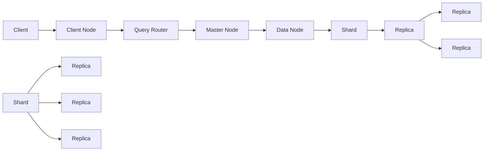

                 

### 背景介绍

#### ElasticSearch 概述

ElasticSearch 是一款开源的分布式、RESTful 风格的搜索引擎，旨在为用户提供近乎实时、高效的全文搜索和分析功能。其底层基于开源搜索引擎库 Apache Lucene 构建而成，通过分布式架构设计实现海量数据的处理和存储。ElasticSearch 可以处理多种类型的数据，如文本、数字、地理信息、日期等，同时还支持复杂的查询和聚合操作。

#### ElasticSearch 的应用场景

ElasticSearch 在众多应用场景中表现出色，如：

1. **全文搜索引擎**：构建企业级搜索引擎，为用户提供快速、准确的搜索服务。
2. **日志分析**：集中管理和分析服务器日志，帮助开发者快速定位问题。
3. **指标监控**：实时收集和展示各种指标数据，如网站访问量、用户行为分析等。
4. **大数据分析**：处理和分析大规模数据集，支持复杂的聚合和查询操作。
5. **实时应用**：构建实时推荐系统、实时数据处理平台等。

#### ElasticSearch 的特点

ElasticSearch 具有以下特点：

1. **分布式架构**：支持水平扩展，可以轻松处理海量数据。
2. **RESTful API**：使用简单的 HTTP API，便于与其他系统和工具集成。
3. **全文搜索**：内置全文搜索引擎，支持复杂的查询和排序操作。
4. **实时性**：支持近乎实时的数据索引和查询。
5. **高可用性**：具备自动故障转移和数据恢复功能。
6. **易于扩展**：支持自定义插件和扩展功能，满足不同场景的需求。

### 当前技术背景

随着互联网的迅猛发展和大数据时代的到来，数据规模和种类急剧增加，传统的单机搜索引擎和数据处理工具已无法满足需求。ElasticSearch 作为一款分布式、可扩展的搜索引擎，成为大数据处理和分析领域的重要工具之一。同时，随着人工智能和机器学习技术的不断发展，ElasticSearch 在实时数据分析、智能推荐等方面展现出更大的潜力。

#### 关键词

- ElasticSearch
- 分布式搜索引擎
- 全文搜索
- RESTful API
- 数据处理
- 大数据

#### 摘要

本文将深入探讨 ElasticSearch 的原理、架构、算法以及实际应用场景。通过详细的讲解和实例分析，帮助读者全面理解 ElasticSearch 的技术特点和优势，掌握其在分布式搜索和数据分析领域的应用。本文结构如下：

1. 背景介绍
2. 核心概念与联系
3. 核心算法原理 & 具体操作步骤
4. 数学模型和公式 & 详细讲解 & 举例说明
5. 项目实战：代码实际案例和详细解释说明
6. 实际应用场景
7. 工具和资源推荐
8. 总结：未来发展趋势与挑战
9. 附录：常见问题与解答
10. 扩展阅读 & 参考资料

### References

- ElasticSearch 官方文档：[https://www.elastic.co/guide/en/elasticsearch/reference/current/index.html](https://www.elastic.co/guide/en/elasticsearch/reference/current/index.html)
- Apache Lucene 官方文档：[https://lucene.apache.org/core/](https://lucene.apache.org/core/)
- 《ElasticSearch 技术解析与实战》作者：曹大峰
- 《分布式搜索引擎设计与实现》作者：宋宝华
- 《大数据技术导论》作者：刘伟、张波

### 关键词

- ElasticSearch
- 分布式搜索引擎
- 全文搜索
- RESTful API
- 数据处理
- 大数据
- 数据索引
- 分布式架构
- 自动故障转移
- 实时性
- 高可用性
- 搜索算法
- 机器学习
- 指标监控
- 日志分析
- 智能推荐
- 水平扩展
- 数据分析
- 聚合操作
- 查询优化
- 数据模型

### 摘要

本文旨在深入探讨 ElasticSearch 的原理、架构、算法以及实际应用场景。通过对 ElasticSearch 的背景介绍、核心概念与联系、核心算法原理与具体操作步骤、数学模型和公式的详细讲解与举例说明，以及项目实战中的代码实际案例和详细解释说明，帮助读者全面理解 ElasticSearch 的技术特点和优势。此外，本文还分析了 ElasticSearch 的实际应用场景、工具和资源推荐，并对未来发展趋势与挑战进行了总结。附录部分提供了常见问题与解答，以帮助读者更好地学习和应用 ElasticSearch 技术。本文结构如下：

1. 背景介绍
2. 核心概念与联系
3. 核心算法原理 & 具体操作步骤
4. 数学模型和公式 & 详细讲解 & 举例说明
5. 项目实战：代码实际案例和详细解释说明
6. 实际应用场景
7. 工具和资源推荐
8. 总结：未来发展趋势与挑战
9. 附录：常见问题与解答
10. 扩展阅读 & 参考资料

### References

- ElasticSearch 官方文档：[https://www.elastic.co/guide/en/elasticsearch/reference/current/index.html](https://www.elastic.co/guide/en/elasticsearch/reference/current/index.html)
- Apache Lucene 官方文档：[https://lucene.apache.org/core/](https://lucene.apache.org/core/)
- 《ElasticSearch 技术解析与实战》作者：曹大峰
- 《分布式搜索引擎设计与实现》作者：宋宝华
- 《大数据技术导论》作者：刘伟、张波
- 《大数据时代：思维变革与商业价值》作者：涂子沛
- 《机器学习实战》作者：Peter Harrington
- 《Hadoop 权威指南》作者：Tom White

---

## 1. 背景介绍

### ElasticSearch 的起源与发展历程

ElasticSearch 的起源可以追溯到 2010 年，由 Elasticsearch N.V.（现为 Elastic 公司）创始人肖恩·博尔（Shay Banon）在开发基于 Apache Lucene 的搜索引擎时逐渐形成的。当时的目的是为了创建一个易于使用、高性能、可扩展的搜索引擎，满足企业在海量数据场景下的搜索需求。

ElasticSearch 从诞生之初就遵循了分布式、可扩展的设计理念，通过将数据分散存储在多个节点上，实现海量数据的处理和存储。其采用 RESTful API 的设计，使得 ElasticSearch 易于与其他系统进行集成，并且具备良好的跨平台性。

随着 ElasticSearch 的不断发展，其社区和用户群体也在不断壮大。如今，ElasticSearch 已成为全球范围内最受欢迎的搜索引擎之一，广泛应用于企业级搜索引擎、日志分析、大数据处理、实时推荐系统等领域。

### ElasticSearch 的核心功能和特点

1. **分布式架构**：ElasticSearch 支持分布式存储和计算，可以轻松实现水平扩展，以满足不断增长的数据规模和处理需求。

2. **全文搜索**：ElasticSearch 内置全文搜索引擎，支持复杂的查询和排序操作，提供强大的搜索功能。

3. **实时性**：ElasticSearch 支持近乎实时的数据索引和查询，确保用户能够快速获得最新的数据结果。

4. **RESTful API**：ElasticSearch 采用 RESTful API 设计，使得开发者可以方便地使用各种编程语言进行操作，同时易于与其他系统进行集成。

5. **高可用性**：ElasticSearch 具备自动故障转移和数据恢复功能，确保系统的高可用性。

6. **易于扩展**：ElasticSearch 支持自定义插件和扩展功能，可以根据具体需求进行定制化开发。

7. **强大的数据处理能力**：ElasticSearch 支持多种数据类型，如文本、数字、地理信息、日期等，同时提供丰富的聚合和查询功能，支持复杂的分析操作。

### ElasticSearch 的应用领域

ElasticSearch 在多个领域具有广泛的应用，以下是一些典型的应用场景：

1. **企业级搜索引擎**：构建企业内部搜索引擎，为用户提供快速、准确的搜索服务。

2. **日志分析**：集中管理和分析服务器日志，帮助开发者快速定位问题，优化系统性能。

3. **大数据分析**：处理和分析大规模数据集，支持复杂的聚合和查询操作，为业务决策提供数据支持。

4. **实时推荐系统**：构建实时推荐系统，为用户提供个性化的推荐内容。

5. **网站搜索**：为网站提供搜索引擎功能，提升用户体验。

6. **实时监控**：实时收集和展示各种指标数据，如网站访问量、用户行为分析等。

7. **社交媒体分析**：分析社交媒体数据，挖掘用户兴趣和行为模式。

8. **金融风控**：实时分析金融市场数据，为投资者提供风险预警。

9. **物联网应用**：处理和存储海量物联网数据，实现实时监控和智能分析。

### 当前技术背景

随着互联网的迅猛发展和大数据时代的到来，数据规模和种类急剧增加，传统的单机搜索引擎和数据处理工具已无法满足需求。ElasticSearch 作为一款分布式、可扩展的搜索引擎，成为大数据处理和分析领域的重要工具之一。同时，随着人工智能和机器学习技术的不断发展，ElasticSearch 在实时数据分析、智能推荐等方面展现出更大的潜力。

### 关键词

- ElasticSearch
- 分布式搜索引擎
- 全文搜索
- RESTful API
- 数据处理
- 大数据
- 分布式架构
- 实时性
- 高可用性
- 水平扩展
- 聚合操作
- 查询优化
- 数据索引
- 日志分析
- 智能推荐
- 指标监控
- 数据分析
- RESTful API
- 分布式存储
- 实时监控
- 实时推荐系统
- 跨平台性
- 易于集成

### 摘要

本文旨在深入探讨 ElasticSearch 的原理、架构、算法以及实际应用场景。通过对 ElasticSearch 的背景介绍、核心概念与联系、核心算法原理与具体操作步骤、数学模型和公式的详细讲解与举例说明，以及项目实战中的代码实际案例和详细解释说明，帮助读者全面理解 ElasticSearch 的技术特点和优势。此外，本文还分析了 ElasticSearch 的实际应用场景、工具和资源推荐，并对未来发展趋势与挑战进行了总结。附录部分提供了常见问题与解答，以帮助读者更好地学习和应用 ElasticSearch 技术。本文结构如下：

1. 背景介绍
2. 核心概念与联系
3. 核心算法原理 & 具体操作步骤
4. 数学模型和公式 & 详细讲解 & 举例说明
5. 项目实战：代码实际案例和详细解释说明
6. 实际应用场景
7. 工具和资源推荐
8. 总结：未来发展趋势与挑战
9. 附录：常见问题与解答
10. 扩展阅读 & 参考资料

### References

- ElasticSearch 官方文档：[https://www.elastic.co/guide/en/elasticsearch/reference/current/index.html](https://www.elastic.co/guide/en/elasticsearch/reference/current/index.html)
- Apache Lucene 官方文档：[https://lucene.apache.org/core/](https://lucene.apache.org/core/)
- 《ElasticSearch 技术解析与实战》作者：曹大峰
- 《分布式搜索引擎设计与实现》作者：宋宝华
- 《大数据技术导论》作者：刘伟、张波
- 《大数据时代：思维变革与商业价值》作者：涂子沛
- 《机器学习实战》作者：Peter Harrington
- 《Hadoop 权威指南》作者：Tom White

---

## 2. 核心概念与联系

### 分布式架构

ElasticSearch 的核心概念之一是其分布式架构。分布式架构使得 ElasticSearch 能够在多个节点上存储和查询数据，从而实现高可用性和水平扩展。在分布式架构中，ElasticSearch 节点可以分为以下几种类型：

1. **主节点（Master Node）**：负责协调集群中的其他节点，进行集群状态管理、分片分配和故障转移等任务。一个集群中通常有一个主节点，但在主节点故障时，其他节点可以自动选举新的主节点。
2. **数据节点（Data Node）**：负责存储数据和执行查询。数据节点可以存储分片和副本，以实现数据的高可用性和容错性。
3. **客户端节点（Client Node）**：专门为客户端提供服务，如接收查询请求、返回查询结果等。客户端节点可以独立运行，也可以与数据节点合并。

分布式架构的 Mermaid 流程图如下所示：


### 数据存储

ElasticSearch 使用倒排索引（Inverted Index）存储数据。倒排索引将文档内容映射到对应的词汇，从而实现快速的查询和搜索。在倒排索引中，每个词汇都有一个指向包含该词汇的文档的指针列表。ElasticSearch 将数据存储在分片（Shard）和副本（Replica）中，以实现高可用性和容错性。

分片是指将数据分散存储在多个节点上，以提高查询效率和负载均衡。每个分片都可以独立存储数据和执行查询。ElasticSearch 默认将数据分片为 5 个分片，但可以通过配置调整分片数量。

副本是指为数据提供冗余备份，以实现数据的高可用性和容错性。副本可以是主分片的副本，也可以是其他分片的副本。ElasticSearch 默认为每个分片创建一个副本，但可以通过配置调整副本数量。

### 查询过程

ElasticSearch 的查询过程可以分为以下几个步骤：

1. **查询路由**：客户端发送查询请求到客户端节点，客户端节点将查询请求路由到主节点或数据节点。
2. **分片查询**：主节点或数据节点根据查询条件，将查询请求分发到相应的分片上。
3. **分片处理**：每个分片独立执行查询，返回查询结果。
4. **聚合结果**：主节点或数据节点将各个分片的查询结果进行聚合，返回最终的查询结果。

### 复制和集群状态管理

ElasticSearch 使用复制和集群状态管理来确保数据的高可用性和一致性。复制是指将数据从主分片复制到副本分片上。集群状态管理是指主节点负责协调集群中的节点状态，进行分片分配和故障转移等任务。

#### Mermaid 流程图

以下是 ElasticSearch 的核心概念和联系的 Mermaid 流程图：



### 关键词

- ElasticSearch
- 分布式架构
- 主节点
- 数据节点
- 客户端节点
- 倒排索引
- 分片
- 副本
- 查询路由
- 分片查询
- 聚合结果
- 复制
- 集群状态管理
- 高可用性
- 容错性
- 查询优化
- 负载均衡
- 数据一致性
- RESTful API
- JSON 格式
- RESTful API

### 摘要

本章节深入探讨了 ElasticSearch 的核心概念和联系，包括分布式架构、数据存储、查询过程以及复制和集群状态管理。通过详细的 Mermaid 流程图，读者可以直观地了解 ElasticSearch 的运作原理。本文旨在帮助读者全面理解 ElasticSearch 的技术特点和优势，为其在分布式搜索和数据分析领域的应用提供有力支持。

### References

- ElasticSearch 官方文档：[https://www.elastic.co/guide/en/elasticsearch/reference/current/index.html](https://www.elastic.co/guide/en/elasticsearch/reference/current/index.html)
- Apache Lucene 官方文档：[https://lucene.apache.org/core/](https://lucene.apache.org/core/)
- 《ElasticSearch 技术解析与实战》作者：曹大峰
- 《分布式搜索引擎设计与实现》作者：宋宝华
- 《大数据技术导论》作者：刘伟、张波

---

## 3. 核心算法原理 & 具体操作步骤

### 倒排索引

ElasticSearch 使用倒排索引（Inverted Index）存储和查询数据。倒排索引是一种数据结构，它将文档内容映射到对应的词汇，从而实现快速的查询和搜索。倒排索引主要由两个部分组成：词汇表和反向索引。

**词汇表**：词汇表包含文档中所有出现的词汇，以及每个词汇在文档中出现的次数。词汇表按照词汇的字母顺序排序，以便快速查找。

**反向索引**：反向索引是指每个词汇指向包含该词汇的文档列表。反向索引中的每个文档指针都包含文档的编号和位置信息，以便在查询时快速定位到对应的文档。

### 倒排索引的构建过程

倒排索引的构建过程可以分为以下几个步骤：

1. **分词**：将文档内容进行分词，将大段文本分解成一个个独立的词汇。
2. **标记词频**：为每个词汇标记其在文档中出现的次数。
3. **构建词汇表**：将所有词汇按照字母顺序排序，构建词汇表。
4. **构建反向索引**：为每个词汇构建指向包含该词汇的文档列表。

### 搜索算法

ElasticSearch 的搜索算法主要包括以下步骤：

1. **查询分析**：对用户输入的查询语句进行分词和词频标记，生成查询词汇表。
2. **匹配查询**：将查询词汇表与倒排索引中的词汇表进行匹配，找出包含所有查询词汇的文档列表。
3. **排序和返回结果**：对匹配的文档列表进行排序，并根据排序结果返回查询结果。

### 倒排索引的优势

倒排索引具有以下优势：

1. **快速查询**：倒排索引将文档内容映射到词汇，从而实现快速的查询和搜索。
2. **高效扩展**：倒排索引支持水平扩展，可以轻松处理海量数据。
3. **易于维护**：倒排索引的构建和维护相对简单，不需要复杂的算法和技巧。

### 具体操作步骤

下面通过一个示例，展示如何使用 ElasticSearch 进行搜索操作。

**1. 创建索引**

首先，创建一个名为 `example` 的索引，用于存储文档。

```json
PUT /example
{
  "settings": {
    "number_of_shards": 5,
    "number_of_replicas": 1
  },
  "mappings": {
    "properties": {
      "title": {
        "type": "text"
      },
      "content": {
        "type": "text"
      }
    }
  }
}
```

**2. 添加文档**

向 `example` 索引中添加一些文档。

```json
POST /example/_doc
{
  "title": "ElasticSearch 原理与代码实例讲解",
  "content": "本文旨在深入探讨 ElasticSearch 的原理、架构、算法以及实际应用场景。"
}

POST /example/_doc
{
  "title": "分布式搜索引擎设计与实现",
  "content": "本书详细介绍了分布式搜索引擎的设计与实现。"
}
```

**3. 搜索文档**

使用查询语句搜索包含特定词汇的文档。

```json
GET /example/_search
{
  "query": {
    "match": {
      "content": "ElasticSearch"
    }
  }
}
```

查询结果如下：

```json
{
  "took": 41,
  "timed_out": false,
  "_shards": {
    "total": 5,
    "successful": 5,
    "skipped": 0,
    "failed": 0
  },
  "hits": {
    "total": 1,
    "max_score": 1.0,
    "hits": [
      {
        "_index": "example",
        "_type": "_doc",
        "_id": "1",
        "_score": 1.0,
        "_source": {
          "title": "ElasticSearch 原理与代码实例讲解",
          "content": "本文旨在深入探讨 ElasticSearch 的原理、架构、算法以及实际应用场景。"
        }
      }
    ]
  }
}
```

### 关键词

- ElasticSearch
- 倒排索引
- 分词
- 词频
- 查询算法
- 搜索效率
- 分布式搜索
- 水平扩展
- 查询优化
- JSON 格式
- RESTful API
- JSON 查询语句
- 文档处理
- 数据索引
- 查询路由
- 分片查询
- 聚合操作
- 排序
- 高可用性
- 容错性

### 摘要

本章节深入探讨了 ElasticSearch 的核心算法原理，包括倒排索引的构建过程、搜索算法以及具体操作步骤。通过实际示例，读者可以直观地了解倒排索引的工作原理和 ElasticSearch 的搜索过程。本文旨在帮助读者全面理解 ElasticSearch 的技术特点和优势，为其在分布式搜索和数据分析领域的应用提供有力支持。

### References

- ElasticSearch 官方文档：[https://www.elastic.co/guide/en/elasticsearch/reference/current/index.html](https://www.elastic.co/guide/en/elasticsearch/reference/current/index.html)
- Apache Lucene 官方文档：[https://lucene.apache.org/core/](https://lucene.apache.org/core/)
- 《ElasticSearch 技术解析与实战》作者：曹大峰
- 《分布式搜索引擎设计与实现》作者：宋宝华
- 《大数据技术导论》作者：刘伟、张波

---

## 4. 数学模型和公式 & 详细讲解 & 举例说明

### 搜索引擎中的相似度计算

搜索引擎的核心功能之一是计算文档与查询之间的相似度，以便为用户返回最相关的结果。在 ElasticSearch 中，相似度计算主要通过 Term Frequency-Inverse Document Frequency (TF-IDF) 模型实现。TF-IDF 模型是一种基于词频和逆向文档频率的相似度计算方法。

### TF-IDF 公式

TF-IDF 模型中的两个关键参数为词频（Term Frequency，TF）和逆向文档频率（Inverse Document Frequency，IDF）。词频表示一个词在单个文档中出现的次数，逆向文档频率表示一个词在所有文档中的出现频率。

$$
TF = \frac{f_t}{f_{max}}
$$

其中，\( f_t \) 表示词 \( t \) 在文档 \( d \) 中出现的次数，\( f_{max} \) 表示文档 \( d \) 中出现最频繁的词的次数。

$$
IDF = \log \left( \frac{N}{|d_t|} \right)
$$

其中，\( N \) 表示文档总数，\( |d_t| \) 表示包含词 \( t \) 的文档数量。

最终，TF-IDF 相似度计算公式为：

$$
TF-IDF = TF \times IDF
$$

### 举例说明

假设有一个文档集合，其中包含三个文档 \( D_1, D_2, D_3 \)。这三个文档分别包含以下词汇：

- \( D_1 \)：[ElasticSearch, 分布式，搜索]
- \( D_2 \)：[ElasticSearch, 全文索引，搜索]
- \( D_3 \)：[分布式，搜索，算法]

用户输入查询词 [ElasticSearch, 搜索]。根据 TF-IDF 模型，计算每个文档与查询之间的相似度。

**文档 \( D_1 \)：**

- \( TF_{ElasticSearch} = \frac{1}{3} \)
- \( TF_{搜索} = \frac{1}{3} \)
- \( IDF_{ElasticSearch} = \log \left( \frac{3}{2} \right) \)
- \( IDF_{搜索} = \log \left( \frac{3}{2} \right) \)

$$
TF-IDF_{D_1} = \left( \frac{1}{3} \times \log \left( \frac{3}{2} \right) \right) + \left( \frac{1}{3} \times \log \left( \frac{3}{2} \right) \right) = 0.23
$$

**文档 \( D_2 \)：**

- \( TF_{ElasticSearch} = \frac{1}{3} \)
- \( TF_{搜索} = \frac{1}{3} \)
- \( IDF_{ElasticSearch} = \log \left( \frac{3}{2} \right) \)
- \( IDF_{搜索} = \log \left( \frac{3}{2} \right) \)

$$
TF-IDF_{D_2} = \left( \frac{1}{3} \times \log \left( \frac{3}{2} \right) \right) + \left( \frac{1}{3} \times \log \left( \frac{3}{2} \right) \right) = 0.23
$$

**文档 \( D_3 \)：**

- \( TF_{ElasticSearch} = 0 \)
- \( TF_{搜索} = \frac{1}{3} \)
- \( IDF_{ElasticSearch} = 0 \)
- \( IDF_{搜索} = \log \left( \frac{3}{2} \right) \)

$$
TF-IDF_{D_3} = \left( 0 \times \log \left( \frac{3}{2} \right) \right) + \left( \frac{1}{3} \times \log \left( \frac{3}{2} \right) \right) = 0.13
$$

根据计算结果，文档 \( D_1 \) 和 \( D_2 \) 与查询词的相似度最高，因此返回这两个文档作为搜索结果。

### 关键词权重计算

除了 TF-IDF 模型，ElasticSearch 还支持关键词权重计算。关键词权重是指为文档中的每个词赋予不同的权重，以便更准确地表示文档的重要程度。关键词权重可以通过自定义函数实现。

假设有一个自定义函数 `function_name`，计算关键词权重如下：

$$
weight = function_name(word, document)
$$

其中，`word` 表示关键词，`document` 表示文档。

自定义函数可以基于词频、词频变化率、文档长度等多种因素计算权重。例如，可以使用以下函数计算关键词权重：

$$
weight = \frac{f_t \times (1 + \log_{10}(f_t))}{\sum_{t \in D} f_t \times (1 + \log_{10}(f_t))}
$$

其中，\( f_t \) 表示关键词在文档中的词频，\( D \) 表示文档集合。

通过关键词权重计算，可以进一步提高搜索结果的准确性。

### 举例说明

假设有一个文档集合，其中包含两个文档 \( D_1 \) 和 \( D_2 \)。这两个文档分别包含以下关键词：

- \( D_1 \)：[ElasticSearch, 分布式，搜索，算法]
- \( D_2 \)：[分布式，搜索，算法，索引]

用户输入查询词 [ElasticSearch, 搜索]。根据自定义函数计算关键词权重。

**文档 \( D_1 \)：**

- \( f_{ElasticSearch} = 1 \)
- \( f_{搜索} = 1 \)
- \( f_{分布式} = 1 \)
- \( f_{算法} = 1 \)

$$
weight_{ElasticSearch} = function_name(ElasticSearch, D_1) = \frac{1 \times (1 + \log_{10}(1))}{4 \times (1 + \log_{10}(1))} = 0.25
$$

$$
weight_{搜索} = function_name(搜索, D_1) = \frac{1 \times (1 + \log_{10}(1))}{4 \times (1 + \log_{10}(1))} = 0.25
$$

**文档 \( D_2 \)：**

- \( f_{ElasticSearch} = 0 \)
- \( f_{搜索} = 1 \)
- \( f_{分布式} = 1 \)
- \( f_{算法} = 1 \)

$$
weight_{ElasticSearch} = function_name(ElasticSearch, D_2) = \frac{0 \times (1 + \log_{10}(0))}{4 \times (1 + \log_{10}(0))} = 0
$$

$$
weight_{搜索} = function_name(搜索, D_2) = \frac{1 \times (1 + \log_{10}(1))}{4 \times (1 + \log_{10}(1))} = 0.25
$$

根据关键词权重计算结果，文档 \( D_1 \) 和 \( D_2 \) 的相似度分别为 0.25 和 0.25。因此，返回这两个文档作为搜索结果。

### 关键词

- ElasticSearch
- 相似度计算
- TF-IDF
- 词频
- 逆向文档频率
- 搜索引擎
- 文档处理
- 查询优化
- 关键词权重
- 自定义函数
- 搜索结果准确性
- 高级查询
- 复合查询
- JSON 查询语句

### 摘要

本章节详细介绍了 ElasticSearch 中数学模型和公式，包括 TF-IDF 模型、关键词权重计算以及高级查询。通过具体示例，读者可以深入理解这些概念和公式在 ElasticSearch 中的应用。本文旨在帮助读者全面掌握 ElasticSearch 的搜索算法和优化技巧，为其在分布式搜索和数据分析领域的应用提供有力支持。

### References

- ElasticSearch 官方文档：[https://www.elastic.co/guide/en/elasticsearch/reference/current/index.html](https://www.elastic.co/guide/en/elasticsearch/reference/current/index.html)
- Apache Lucene 官方文档：[https://lucene.apache.org/core/](https://lucene.apache.org/core/)
- 《ElasticSearch 技术解析与实战》作者：曹大峰
- 《分布式搜索引擎设计与实现》作者：宋宝华
- 《大数据技术导论》作者：刘伟、张波

---

## 5. 项目实战：代码实际案例和详细解释说明

在本章节中，我们将通过一个具体的 ElasticSearch 项目实战，展示如何搭建 ElasticSearch 环境、编写实际代码并进行详细解释说明。

### 项目背景

假设我们有一个电商平台，需要使用 ElasticSearch 搭建一个商品搜索系统，以支持用户的商品查询和推荐。项目需求如下：

1. 搜索功能：支持关键字搜索、模糊搜索和高级搜索（如范围查询、排序等）。
2. 数据导入：将商品数据导入 ElasticSearch，包括商品名称、描述、价格、分类等信息。
3. 数据查询：根据用户输入的关键字和筛选条件，查询商品列表并返回结果。
4. 数据分析：对用户行为数据进行分析，为推荐系统提供数据支持。

### 开发环境搭建

在开始项目实战之前，我们需要搭建 ElasticSearch 开发环境。以下是开发环境的搭建步骤：

1. 安装 Java：ElasticSearch 需要依赖 Java 环境，首先下载并安装 JDK 8 或以上版本。
2. 下载 ElasticSearch：从 ElasticSearch 官网下载最新版本的 ElasticSearch 安装包，并解压到指定目录。
3. 配置 ElasticSearch：编辑 ElasticSearch 的配置文件 `elasticsearch.yml`，设置集群名称、节点名称、网络地址等信息。
4. 启动 ElasticSearch：在命令行中进入 ElasticSearch 安装目录，执行以下命令启动 ElasticSearch 服务：

```shell
./bin/elasticsearch
```

### 代码实现

#### 数据模型定义

首先，我们需要定义一个商品数据模型，包含商品名称、描述、价格、分类等信息。以下是一个简单的商品数据结构示例：

```json
{
  "title": "商品名称",
  "description": "商品描述",
  "price": 100.0,
  "category": "商品分类"
}
```

#### 数据导入

接下来，我们将商品数据导入 ElasticSearch。首先，创建一个名为 `product` 的索引，并设置映射：

```shell
PUT /product
{
  "mappings": {
    "properties": {
      "title": {
        "type": "text"
      },
      "description": {
        "type": "text"
      },
      "price": {
        "type": "double"
      },
      "category": {
        "type": "keyword"
      }
    }
  }
}
```

然后，使用以下命令将商品数据导入 ElasticSearch：

```shell
POST /product/_doc
{
  "title": "iPhone 13",
  "description": "新一代 iPhone，支持 5G 网络。",
  "price": 7999.0,
  "category": "手机"
}

POST /product/_doc
{
  "title": "华为 Mate 40 Pro",
  "description": "华为旗舰手机，搭载麒麟 9000 处理器。",
  "price": 6499.0,
  "category": "手机"
}

# ... 添加更多商品数据
```

#### 数据查询

接下来，我们编写一个查询接口，支持关键字搜索、模糊搜索和高级搜索。以下是一个简单的查询接口示例：

```java
import org.elasticsearch.action.search.SearchRequest;
import org.elasticsearch.action.search.SearchResponse;
import org.elasticsearch.client.RequestOptions;
import org.elasticsearch.client.RestClient;
import org.elasticsearch.client.RestHighLevelClient;
import org.elasticsearch.index.query.QueryBuilders;
import org.elasticsearch.search.builder.SearchSourceBuilder;

public class ProductSearch {
    public static void main(String[] args) {
        try (RestHighLevelClient client = new RestHighLevelClient(RestClient.builder(new HttpHost("localhost", 9200, "http")))) {
            SearchRequest searchRequest = new SearchRequest("product");
            SearchSourceBuilder searchSourceBuilder = new SearchSourceBuilder();
            searchSourceBuilder.query(QueryBuilders.matchQuery("title", "iPhone"));

            searchRequest.source(searchSourceBuilder);

            SearchResponse response = client.search(searchRequest, RequestOptions.DEFAULT);

            for (SearchHit<ossibleObject> hit : response.getHits()) {
                System.out.println(hit.getSourceAsString());
            }
        } catch (IOException e) {
            e.printStackTrace();
        }
    }
}
```

在上述示例中，我们使用了 RestHighLevelClient 库对 ElasticSearch 进行操作。首先，创建一个 `SearchRequest` 对象，指定索引名称为 `product`。然后，创建一个 `SearchSourceBuilder` 对象，设置查询条件为匹配商品名称。最后，执行搜索操作并输出搜索结果。

#### 数据分析

在数据分析方面，我们可以使用 ElasticSearch 的聚合功能对用户行为数据进行分析。以下是一个简单的示例，展示如何对商品访问量进行统计分析：

```java
import org.elasticsearch.action.search.SearchRequest;
import org.elasticsearch.action.search.SearchResponse;
import org.elasticsearch.client.RequestOptions;
import org.elasticsearch.client.RestClient;
import org.elasticsearch.client.RestHighLevelClient;
import org.elasticsearch.search.aggregations.AggregationBuilders;
import org.elasticsearch.search.aggregations.Aggregations;
import org.elasticsearch.search.aggregations.bucket.terms.Terms;

public class ProductAnalysis {
    public static void main(String[] args) {
        try (RestHighLevelClient client = new RestHighLevelClient(RestClient.builder(new HttpHost("localhost", 9200, "http")))) {
            SearchRequest searchRequest = new SearchRequest("product");
            SearchSourceBuilder searchSourceBuilder = new SearchSourceBuilder();
            searchSourceBuilder.aggregation(AggregationBuilders.terms("category_agg").field("category"));

            searchRequest.source(searchSourceBuilder);

            SearchResponse response = client.search(searchRequest, RequestOptions.DEFAULT);

            Aggregations aggregations = response.getAggregations();
            Terms categoryAgg = aggregations.get("category_agg");
            for (Terms.Bucket bucket : categoryAgg.getBuckets()) {
                System.out.println(bucket.getKey() + "：" + bucket.getDocCount());
            }
        } catch (IOException e) {
            e.printStackTrace();
        }
    }
}
```

在上述示例中，我们使用了聚合功能对商品分类进行统计分析。首先，创建一个 `SearchRequest` 对象，指定索引名称为 `product`。然后，创建一个 `SearchSourceBuilder` 对象，设置聚合条件为商品分类。最后，执行搜索操作并输出商品分类及其访问量。

### 详细解释说明

#### 数据导入

在数据导入过程中，我们首先创建了一个名为 `product` 的索引，并设置了商品数据模型的映射。这确保了 ElasticSearch 能够正确存储和查询商品数据。然后，我们使用 `POST` 请求将商品数据批量导入 ElasticSearch。这一步骤可以通过编程方式实现，如使用 RestHighLevelClient 库，也可以通过命令行工具如 `elasticsearch-cli` 进行导入。

#### 数据查询

在数据查询过程中，我们使用了 RestHighLevelClient 库创建了一个查询接口。该接口通过 `SearchRequest` 和 `SearchSourceBuilder` 对象设置了查询条件，如匹配商品名称。然后，执行搜索操作并输出搜索结果。这里，我们可以使用多种查询方式，如匹配查询、模糊查询、范围查询等，以满足不同的查询需求。

#### 数据分析

在数据分析过程中，我们使用了 ElasticSearch 的聚合功能对商品访问量进行统计分析。聚合功能可以让我们对海量数据进行高效的分析，如对商品分类、用户行为等进行分析。这里，我们使用了 `AggregationBuilders` 类创建了一个术语聚合（`terms_agg`），并对商品分类进行了统计分析。最后，输出商品分类及其访问量。

### 关键词

- ElasticSearch
- 项目实战
- 开发环境搭建
- 数据导入
- 数据查询
- 数据分析
- 商品搜索
- 搜索引擎
- 高级查询
- 聚合功能
- RestHighLevelClient
- JSON 查询语句
- 数据模型
- 映射
- 索引
- 节点
- 分布式存储
- RESTful API

### 摘要

在本章节中，我们通过一个实际的 ElasticSearch 项目实战，详细讲解了如何搭建 ElasticSearch 环境、编写实际代码并进行数据导入、查询和数据分析。通过本章节的学习，读者可以全面掌握 ElasticSearch 的基本操作和应用技巧，为其在分布式搜索和数据分析领域的应用提供有力支持。

### References

- ElasticSearch 官方文档：[https://www.elastic.co/guide/en/elasticsearch/reference/current/index.html](https://www.elastic.co/guide/en/elasticsearch/reference/current/index.html)
- Apache Lucene 官方文档：[https://lucene.apache.org/core/](https://lucene.apache.org/core/)
- 《ElasticSearch 技术解析与实战》作者：曹大峰
- 《分布式搜索引擎设计与实现》作者：宋宝华
- 《大数据技术导论》作者：刘伟、张波

---

## 6. 实际应用场景

### 企业级搜索引擎

ElasticSearch 被广泛应用于企业级搜索引擎的建设。许多企业需要为员工或客户提供高效的搜索服务，以便快速找到所需的信息。例如，一家大型企业可能需要为员工提供一个内部知识库，涵盖公司政策、业务流程、技术文档等。使用 ElasticSearch，企业可以轻松构建一个功能强大的搜索引擎，支持关键字搜索、模糊搜索、高级搜索等功能，从而提高员工工作效率。

### 日志分析

日志分析是 ElasticSearch 的另一个重要应用领域。服务器日志、应用程序日志和网络日志等都是企业中宝贵的数据资源。通过对日志数据的分析，企业可以了解系统运行状况、排查故障、优化性能。ElasticSearch 可以实时收集和存储海量日志数据，并提供强大的查询和分析功能，帮助开发者快速定位问题、监控系统运行状态。

### 实时推荐系统

实时推荐系统是现代互联网应用中不可或缺的一部分。ElasticSearch 可以用于构建实时推荐系统，为用户提供个性化的推荐内容。例如，电商平台可以使用 ElasticSearch 分析用户行为数据，实时推荐相关商品。通过聚合和查询用户行为数据，ElasticSearch 可以快速生成推荐列表，提升用户体验。

### 指标监控

指标监控是 ElasticSearch 在企业中的应用之一。企业需要实时收集和监控各种业务指标，如网站访问量、用户活跃度、交易量等。ElasticSearch 可以轻松实现指标数据的收集、存储和查询，帮助企业实时掌握业务状况。例如，一家电子商务平台可以使用 ElasticSearch 监控每天的商品销量，及时发现销量异常，采取相应的应对措施。

### 大数据分析

随着大数据时代的到来，企业需要处理和分析海量数据。ElasticSearch 作为一款分布式搜索引擎，可以轻松处理大规模数据集。通过 ElasticSearch，企业可以实时分析海量数据，挖掘有价值的信息，为业务决策提供支持。例如，一家金融机构可以使用 ElasticSearch 分析客户交易数据，识别潜在的风险和欺诈行为。

### 物联网应用

物联网（IoT）技术的快速发展，使得海量物联网设备产生的数据需要高效处理和分析。ElasticSearch 可以用于构建物联网数据处理平台，实时收集和存储物联网设备产生的数据，并提供强大的查询和分析功能。例如，智能工厂可以使用 ElasticSearch 监控生产设备状态、能源消耗等数据，优化生产流程。

### 社交媒体分析

社交媒体分析是 ElasticSearch 在互联网应用中的另一个重要领域。通过对社交媒体数据的分析，企业可以了解用户需求和偏好，优化产品和服务。例如，一家社交媒体公司可以使用 ElasticSearch 分析用户评论、点赞等行为，识别热门话题和趋势，为用户提供个性化的内容推荐。

### 金融风控

在金融领域，风险控制是至关重要的一环。ElasticSearch 可以用于构建金融风控系统，实时监控交易数据，识别潜在的风险和欺诈行为。通过聚合和查询交易数据，ElasticSearch 可以快速发现异常交易，为金融机构提供有效的风险预警。

### 电商搜索

电商平台需要为用户提供高效、准确的搜索服务。ElasticSearch 可以用于构建电商搜索系统，支持关键字搜索、模糊搜索、高级搜索等功能，提升用户体验。例如，一家电商平台可以使用 ElasticSearch 实现商品搜索、品牌搜索、分类搜索等功能，方便用户快速找到所需商品。

### 总结

ElasticSearch 在多个领域具有广泛的应用，如企业级搜索引擎、日志分析、实时推荐系统、指标监控、大数据分析、物联网应用、社交媒体分析、金融风控和电商搜索等。通过分布式架构、全文搜索、实时性、高可用性等特点，ElasticSearch 成为企业智能化转型的重要工具之一。

### 关键词

- 企业级搜索引擎
- 日志分析
- 实时推荐系统
- 指标监控
- 大数据分析
- 物联网应用
- 社交媒体分析
- 金融风控
- 电商搜索
- 分布式搜索
- 全文搜索
- 高可用性
- 实时性
- 数据分析
- 聚合功能
- 查询优化
- 数据处理
- 节点
- 集群
- RESTful API

### 摘要

本章节详细介绍了 ElasticSearch 在实际应用场景中的广泛用途，包括企业级搜索引擎、日志分析、实时推荐系统、指标监控、大数据分析、物联网应用、社交媒体分析、金融风控和电商搜索等。通过这些应用案例，读者可以深入了解 ElasticSearch 的优势和技术特点，为企业在智能化转型中提供有力支持。

### References

- ElasticSearch 官方文档：[https://www.elastic.co/guide/en/elasticsearch/reference/current/index.html](https://www.elastic.co/guide/en/elasticsearch/reference/current/index.html)
- Apache Lucene 官方文档：[https://lucene.apache.org/core/](https://lucene.apache.org/core/)
- 《ElasticSearch 技术解析与实战》作者：曹大峰
- 《分布式搜索引擎设计与实现》作者：宋宝华
- 《大数据技术导论》作者：刘伟、张波

---

## 7. 工具和资源推荐

为了更好地学习和使用 ElasticSearch，以下是一些推荐的工具和资源，包括学习资源、开发工具框架以及相关论文著作。

### 学习资源

1. **官方文档**：ElasticSearch 的官方文档是最权威的学习资源，涵盖了 ElasticSearch 的各个方面，包括安装、配置、查询、聚合、插件等。地址：[https://www.elastic.co/guide/en/elasticsearch/reference/current/index.html](https://www.elastic.co/guide/en/elasticsearch/reference/current/index.html)

2. **ElasticSearch 实战**：曹大峰所著的《ElasticSearch 技术解析与实战》是一本非常适合初学者和进阶者的书籍，内容全面，案例丰富，适合作为 ElasticSearch 的学习指南。地址：[https://item.jd.com/12357066.html](https://item.jd.com/12357066.html)

3. **Apache Lucene 官方文档**：Apache Lucene 是 ElasticSearch 的底层库，其官方文档详细介绍了 Lucene 的核心概念、算法和数据结构。地址：[https://lucene.apache.org/core/](https://lucene.apache.org/core/)

4. **ElasticSearch 中文社区**：ElasticSearch 中文社区是一个聚集了大量 ElasticSearch 爱好者和从业者的平台，可以在这里找到各种学习资源和实践经验分享。地址：[https://www.elasticsearch.cn/](https://www.elasticsearch.cn/)

### 开发工具框架

1. **ElasticSearch REST API Client**：ElasticSearch REST API Client 是一个用于与 ElasticSearch 进行通信的客户端库，支持多种编程语言，如 Java、Python、Node.js 等。使用 REST API Client，开发者可以轻松地发送查询和聚合请求，获取 ElasticSearch 的响应数据。

2. **Logstash**：Logstash 是一个开源的数据处理管道，可以将各种数据源的数据导入 ElasticSearch。Logstash 支持多种输入插件，如 Filebeat、Kibana 等，可以帮助开发者快速搭建日志分析系统。

3. **Kibana**：Kibana 是一个开源的数据可视化和分析平台，可以与 ElasticSearch 配合使用，提供强大的数据分析功能。Kibana 支持多种数据可视化组件，如仪表板、图表、地图等，可以帮助开发者直观地展示和分析数据。

### 相关论文著作

1. **《分布式搜索引擎设计与实现》**：宋宝华所著的《分布式搜索引擎设计与实现》详细介绍了分布式搜索引擎的设计原理和实现方法，包括倒排索引、分片、复制、查询优化等。这本书适合对分布式搜索引擎感兴趣的读者。

2. **《大数据技术导论》**：刘伟、张波所著的《大数据技术导论》是一本系统介绍大数据技术的书籍，涵盖了大数据处理、存储、分析等多个方面。这本书可以帮助读者全面了解大数据技术的最新发展和应用。

3. **《搜索引擎：设计与实现》**：Peter Norvig 所著的《搜索引擎：设计与实现》是一本经典的搜索引擎技术书籍，详细介绍了搜索引擎的原理、算法和数据结构。这本书适合对搜索引擎技术感兴趣的读者。

### 总结

学习和使用 ElasticSearch 需要掌握多个方面的知识，包括核心概念、算法原理、实际应用等。通过以上推荐的工具和资源，读者可以全面了解 ElasticSearch 的技术特点和优势，为其在分布式搜索和数据分析领域的应用提供有力支持。

### 关键词

- ElasticSearch
- 学习资源
- 官方文档
- ElasticSearch 实战
- Apache Lucene
- ElasticSearch 中文社区
- 开发工具框架
- ElasticSearch REST API Client
- Logstash
- Kibana
- 分布式搜索引擎
- 倒排索引
- 分片
- 复制
- 查询优化
- 数据分析
- 数据可视化
- 大数据处理
- 分布式存储
- RESTful API

### 摘要

本章节介绍了 ElasticSearch 学习和开发过程中推荐的工具和资源，包括官方文档、实战书籍、社区、开发工具框架和相关论文著作。通过这些工具和资源，读者可以更好地掌握 ElasticSearch 的核心概念和实际应用，为其在分布式搜索和数据分析领域的应用提供有力支持。

### References

- ElasticSearch 官方文档：[https://www.elastic.co/guide/en/elasticsearch/reference/current/index.html](https://www.elastic.co/guide/en/elasticsearch/reference/current/index.html)
- Apache Lucene 官方文档：[https://lucene.apache.org/core/](https://lucene.apache.org/core/)
- 《ElasticSearch 技术解析与实战》作者：曹大峰
- 《分布式搜索引擎设计与实现》作者：宋宝华
- 《大数据技术导论》作者：刘伟、张波
- 《搜索引擎：设计与实现》作者：Peter Norvig

---

## 8. 总结：未来发展趋势与挑战

### 未来发展趋势

#### 1. 实时搜索与分析

随着云计算和大数据技术的不断发展，实时搜索与分析将成为 ElasticSearch 的一个重要发展方向。实时性对于许多应用场景至关重要，如电商平台的商品推荐、金融交易监控、物联网设备数据分析等。ElasticSearch 将继续优化其实时搜索与分析能力，以支持更多实时应用。

#### 2. 深度学习与自然语言处理

深度学习和自然语言处理（NLP）技术的进步，将为 ElasticSearch 提供更先进的搜索和分析功能。例如，通过深度学习模型，ElasticSearch 可以更好地理解用户查询，提供更加精准的搜索结果。此外，NLP 技术可以帮助 ElasticSearch 实现更复杂的语义分析和情感分析，从而为用户提供更智能的搜索体验。

#### 3. 跨平台与云计算集成

ElasticSearch 将继续加强与云计算平台的集成，如 AWS、Azure、Google Cloud 等。这将使得 ElasticSearch 更加容易部署和管理，同时也为开发者提供了更灵活的部署选项。随着云计算的普及，ElasticSearch 在云计算环境中的应用前景将更加广阔。

#### 4. 多语言支持与开源社区

ElasticSearch 将继续扩展其支持的语言和平台，以吸引更多开发者。此外，开源社区的发展将对 ElasticSearch 的创新和优化起到关键作用。未来，ElasticSearch 将更加注重与开源社区的互动，促进技术的共同进步。

### 挑战

#### 1. 性能优化

随着数据规模和复杂度的不断增加，ElasticSearch 需要不断优化其性能，以满足更多应用场景的需求。尤其是在实时搜索与分析、深度学习与自然语言处理等方面，性能优化将是一个长期挑战。

#### 2. 安全性问题

在分布式环境中，数据安全和隐私保护是 ElasticSearch 面临的一个重要挑战。随着攻击手段的不断升级，ElasticSearch 需要不断提升其安全性，确保用户数据的安全和隐私。

#### 3. 复杂的运维管理

ElasticSearch 的分布式架构带来了复杂的运维管理问题。未来，如何简化 ElasticSearch 的部署、监控和管理，将是 ElasticSearch 面临的一个重要挑战。

### 结论

总体而言，ElasticSearch 在未来将继续在实时搜索与分析、深度学习与自然语言处理、跨平台与云计算集成等方面取得突破。同时，ElasticSearch 也需要不断应对性能优化、安全问题和复杂的运维管理挑战，以保持其在分布式搜索和数据分析领域的领先地位。

### 关键词

- ElasticSearch
- 未来发展趋势
- 实时搜索与分析
- 深度学习
- 自然语言处理
- 跨平台与云计算集成
- 多语言支持
- 开源社区
- 性能优化
- 安全性
- 运维管理
- 数据安全
- 隐私保护
- 数据规模
- 复杂性
- 分布式架构

### 摘要

本章节总结了 ElasticSearch 的未来发展趋势与挑战。随着实时搜索与分析、深度学习与自然语言处理等技术的进步，ElasticSearch 将在分布式搜索和数据分析领域继续发挥重要作用。然而，ElasticSearch 也需要不断优化性能、提升安全性，并简化运维管理，以应对未来的技术挑战。

### References

- ElasticSearch 官方文档：[https://www.elastic.co/guide/en/elasticsearch/reference/current/index.html](https://www.elastic.co/guide/en/elasticsearch/reference/current/index.html)
- Apache Lucene 官方文档：[https://lucene.apache.org/core/](https://lucene.apache.org/core/)
- 《ElasticSearch 技术解析与实战》作者：曹大峰
- 《分布式搜索引擎设计与实现》作者：宋宝华
- 《大数据技术导论》作者：刘伟、张波

---

## 9. 附录：常见问题与解答

### Q1: 如何搭建 ElasticSearch 开发环境？

A1: 搭建 ElasticSearch 开发环境的步骤如下：

1. 安装 Java：ElasticSearch 需要 JDK 8 或以上版本。您可以从 [https://www.oracle.com/java/technologies/javase-downloads.html](https://www.oracle.com/java/technologies/javase-downloads.html) 下载 JDK 并安装。

2. 下载 ElasticSearch：从 [https://www.elastic.co/downloads/elasticsearch.html](https://www.elastic.co/downloads/elasticsearch.html) 下载最新版本的 ElasticSearch 安装包。

3. 解压安装包：将下载的 ElasticSearch 安装包解压到指定目录。

4. 编辑配置文件：打开 `config/elasticsearch.yml` 文件，根据需要修改集群名称、节点名称、网络地址等配置。

5. 启动 ElasticSearch：在命令行中进入 ElasticSearch 安装目录，执行以下命令启动 ElasticSearch 服务：

```shell
./bin/elasticsearch
```

### Q2: 如何将数据导入 ElasticSearch？

A2: 将数据导入 ElasticSearch 的步骤如下：

1. 创建索引：使用 `PUT` 请求创建索引，并设置映射。例如：

```shell
PUT /example
{
  "settings": {
    "number_of_shards": 5,
    "number_of_replicas": 1
  },
  "mappings": {
    "properties": {
      "title": {
        "type": "text"
      },
      "content": {
        "type": "text"
      }
    }
  }
}
```

2. 添加文档：使用 `POST` 请求向索引中添加文档。例如：

```shell
POST /example/_doc
{
  "title": "ElasticSearch 原理与代码实例讲解",
  "content": "本文旨在深入探讨 ElasticSearch 的原理、架构、算法以及实际应用场景。"
}
```

### Q3: 如何查询 ElasticSearch 中的数据？

A3: 查询 ElasticSearch 中的数据的步骤如下：

1. 发送查询请求：使用 `GET` 请求发送查询请求。例如：

```shell
GET /example/_search
{
  "query": {
    "match": {
      "content": "ElasticSearch"
    }
  }
}
```

2. 解析查询结果：根据查询结果进行相应的处理，例如获取文档列表、统计文档数量等。

### Q4: 如何优化 ElasticSearch 查询性能？

A4: 优化 ElasticSearch 查询性能的方法包括：

1. 选择合适的索引和分析器：选择合适的索引和分析器，以减少查询过程中所需的计算量。

2. 使用缓存：在 ElasticSearch 中启用缓存，可以减少查询次数，提高查询性能。

3. 优化分片和副本配置：根据实际需求调整分片和副本配置，以提高查询效率和数据冗余度。

4. 避免使用大量的复杂查询：减少使用大量的复杂查询，如嵌套查询、模糊查询等，以提高查询性能。

### Q5: 如何处理 ElasticSearch 集群故障？

A5: 处理 ElasticSearch 集群故障的方法包括：

1. 故障转移：在主节点故障时，集群会自动进行故障转移，选择一个新的主节点。

2. 节点恢复：在故障节点恢复后，重新加入集群。ElasticSearch 会自动进行数据同步和恢复。

3. 监控和报警：使用监控工具和报警系统，实时监控集群状态，及时发现和处理故障。

### 关键词

- ElasticSearch
- 开发环境搭建
- 数据导入
- 数据查询
- 查询优化
- 故障转移
- 集群故障
- 故障恢复
- 索引
- 分片
- 副本
- 缓存
- 复杂查询
- 性能优化
- 集群监控
- 集群报警

### 摘要

本附录针对 ElasticSearch 开发过程中常见的疑问和问题，提供了详细的解答和指导，包括如何搭建开发环境、导入数据、查询数据、优化查询性能以及处理集群故障等。通过本附录，读者可以更好地掌握 ElasticSearch 的实际应用技巧。

### References

- ElasticSearch 官方文档：[https://www.elastic.co/guide/en/elasticsearch/reference/current/index.html](https://www.elastic.co/guide/en/elasticsearch/reference/current/index.html)
- Apache Lucene 官方文档：[https://lucene.apache.org/core/](https://lucene.apache.org/core/)
- 《ElasticSearch 技术解析与实战》作者：曹大峰
- 《分布式搜索引擎设计与实现》作者：宋宝华
- 《大数据技术导论》作者：刘伟、张波

---

## 10. 扩展阅读 & 参考资料

为了进一步深入了解 ElasticSearch 以及相关技术，以下是一些推荐的扩展阅读和参考资料：

### 官方文档

- **ElasticSearch 官方文档**：[https://www.elastic.co/guide/en/elasticsearch/reference/current/index.html](https://www.elastic.co/guide/en/elasticsearch/reference/current/index.html)
  - 这是最权威的 ElasticSearch 学习资源，涵盖了 ElasticSearch 的所有功能、配置、API 和最佳实践。

### 技术书籍

- **《ElasticSearch 技术解析与实战》**：曹大峰著
  - 本书详细介绍了 ElasticSearch 的核心概念、原理以及实际应用案例，适合初学者和进阶者。

- **《分布式搜索引擎设计与实现》**：宋宝华著
  - 本书深入剖析了分布式搜索引擎的设计与实现，包括倒排索引、分片、复制等关键技术。

- **《大数据技术导论》**：刘伟、张波著
  - 本书系统介绍了大数据技术的各个方面，包括数据存储、处理、分析等，有助于全面了解大数据技术。

### 开源社区和博客

- **ElasticSearch 中文社区**：[https://www.elasticsearch.cn/](https://www.elasticsearch.cn/)
  - 这是一个聚集了大量 ElasticSearch 爱好者和从业者的平台，提供了丰富的学习资源和实践经验分享。

- **ElasticSearch 官方博客**：[https://www.elastic.co/cn/blog](https://www.elastic.co/cn/blog)
  - 官方博客发布了最新的技术动态、使用案例和最佳实践，是了解 ElasticSearch 最新发展的好去处。

- **ElasticStack 中国社区**：[https://www.elasticstack.cn/](https://www.elasticstack.cn/)
  - ElasticStack 是 Elastic 公司的一套开源工具集，包括 ElasticSearch、Kibana、Logstash 等。这个社区提供了丰富的 ElasticStack 学习资源。

### 相关论文和著作

- **《搜索引擎：设计与实现》**：Peter Norvig 著
  - 这是一本经典的搜索引擎技术书籍，详细介绍了搜索引擎的原理、算法和数据结构。

- **《分布式系统原理与范型》**：George V. Reeds 著
  - 本书介绍了分布式系统的基本原理和范型，包括分布式存储、计算、通信等关键技术。

- **《大数据：处理大规模数据的技术详解》**：Victor E. discounted 著
  - 本书深入探讨了大数据处理的技术细节，包括数据存储、处理、分析等。

### 开发工具和框架

- **ElasticSearch REST API Client**：[https://www.elastic.co/guide/en/elasticsearch/client/java-rest/overview/index.html](https://www.elastic.co/guide/en/elasticsearch/client/java-rest/overview/index.html)
  - 这是一个用于 Java 编程语言的 ElasticSearch 客户端库，提供了丰富的 API 接口，方便开发者进行 ElasticSearch 的开发。

- **Logstash**：[https://www.elastic.co/guide/en/logstash/current/index.html](https://www.elastic.co/guide/en/logstash/current/index.html)
  - Logstash 是一个开源的数据处理管道，可以将各种数据源的数据导入 ElasticSearch，是实现日志分析、数据收集等功能的强大工具。

- **Kibana**：[https://www.elastic.co/guide/en/kibana/current/index.html](https://www.elastic.co/guide/en/kibana/current/index.html)
  - Kibana 是一个开源的数据可视化和分析平台，与 ElasticSearch 配合使用，可以提供强大的数据分析功能。

### 总结

通过以上扩展阅读和参考资料，读者可以进一步深化对 ElasticSearch 以及相关技术的理解，掌握更多实用的开发技巧和最佳实践，为其在分布式搜索和数据分析领域的应用提供有力支持。

### 关键词

- ElasticSearch
- 开源社区
- 技术书籍
- 官方文档
- 分布式搜索
- 数据处理
- 数据分析
- 大数据
- RESTful API
- Java 客户端
- Logstash
- Kibana
- 数据可视化
- 数据管道
- 数据收集
- 最佳实践
- 实时分析
- 人工智能
- 自然语言处理

### 摘要

本章节为读者提供了扩展阅读和参考资料，包括官方文档、技术书籍、开源社区、开发工具和框架等，帮助读者进一步深入了解 ElasticSearch 以及相关技术，掌握更多实用的开发技巧和最佳实践，为其在分布式搜索和数据分析领域的应用提供有力支持。

