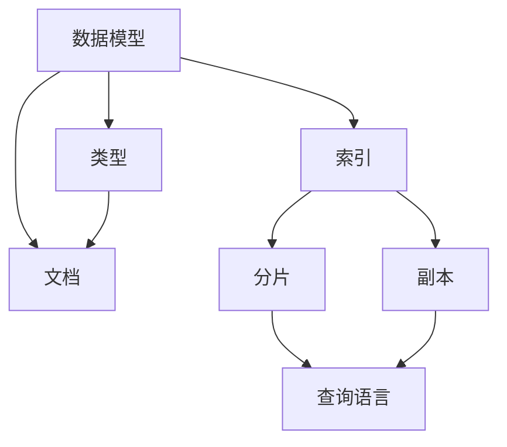

                 

# ElasticSearch原理与代码实例讲解

## 摘要

ElasticSearch 是一个功能强大的开源全文搜索引擎，它能够实现高效的数据存储、检索和分析。本文将深入讲解 ElasticSearch 的原理，包括其核心概念、架构设计、算法原理等，并通过实际代码实例进行详细解析。读者将学习到如何搭建 ElasticSearch 环境、编写索引、查询数据，并掌握其在实际应用场景中的使用方法。

## 1. 背景介绍

ElasticSearch 是基于 Lucene 搜索引擎构建的，具有高扩展性、高性能和易于使用等特点。它的主要目标是提供一种快速、可靠的方式来处理大规模数据，支持复杂查询、实时分析以及数据聚合等功能。ElasticSearch 被广泛应用于各种场景，如日志分析、网站搜索、社交网络、大数据处理等。

随着大数据时代的到来，企业和组织面临着越来越多的数据存储和查询需求。传统的数据库系统往往难以满足这些需求，而 ElasticSearch 提供了一种高效的解决方案。通过本文的讲解，读者将了解到 ElasticSearch 的基本原理和实际应用，从而更好地利用这一强大的工具来处理海量数据。

## 2. 核心概念与联系

### 2.1 数据模型

ElasticSearch 的数据模型主要由以下三个部分组成：

1. **索引（Index）**：索引是数据存储的逻辑容器，可以看作是数据库中的表。每个索引包含多个文档（Documents），文档是实际存储的数据单元。
2. **文档（Document）**：文档是一个 JSON 对象，它可以包含多个字段（Fields）。每个字段都可以有不同的数据类型，如字符串、数字、布尔值等。
3. **类型（Type）**：在旧版本中，每个索引可以包含多个类型，每个类型对应一组具有相同字段结构的文档。但在新版本中，类型已合并到索引中，不再单独使用。

### 2.2 分片和副本

为了提高性能和可用性，ElasticSearch 将索引拆分成多个分片（Shards），每个分片都是一个独立的 Lucene 索引。分片可以分布在不同的节点上，以实现负载均衡和容错。

此外，ElasticSearch 还支持副本（Replicas），副本是分片的备份，用于提高数据的可用性和查询性能。副本可以与分片位于同一节点，也可以分布在不同的节点上。


### 2.3 文档的增删改查

在 ElasticSearch 中，文档的增删改查操作非常简单。

1. **添加文档（Index）**：使用 `PUT` 请求将文档添加到指定索引和类型中。
2. **查询文档（Search）**：使用 `GET` 请求查询文档，可以使用各种查询条件来过滤和排序结果。
3. **更新文档（Update）**：使用 `POST` 请求更新指定索引和类型中的文档。
4. **删除文档（Delete）**：使用 `DELETE` 请求删除指定索引和类型中的文档。

### 2.4 查询语言

ElasticSearch 使用一种称为 Query DSL（Domain Specific Language）的查询语言，它允许用户使用丰富的查询条件和操作来构建复杂的查询。

以下是一个简单的查询示例：

```json
GET /index_name/_search
{
  "query": {
    "match": {
      "field_name": "value"
    }
  }
}
```

这个查询将返回索引 `index_name` 中 `field_name` 字段值为 `value` 的文档。

### 2.5 Mermaid 流程图

下面是 ElasticSearch 核心概念和架构的 Mermaid 流程图：



## 3. 核心算法原理 & 具体操作步骤

### 3.1 基本算法原理

ElasticSearch 依赖于 Lucene 搜索引擎，Lucene 使用了一种称为布隆过滤器（Bloom Filter）的算法来快速判断一个元素是否存在于集合中。布隆过滤器是一种空间效率极高的数据结构，可以用于快速筛选不相关的数据，从而提高查询效率。

此外，ElasticSearch 还使用倒排索引（Inverted Index）来存储和检索数据。倒排索引将文档中的每个词与包含该词的文档建立映射关系，从而实现快速文本搜索。

### 3.2 具体操作步骤

下面是使用 ElasticSearch 进行文档添加、查询和更新的具体步骤：

#### 3.2.1 添加文档

首先，需要创建一个 ElasticSearch 客户端：

```python
from elasticsearch import Elasticsearch

es = Elasticsearch()
```

然后，可以使用 `index` 方法添加文档：

```python
doc = {
    "title": "ElasticSearch 原理与代码实例讲解",
    "content": "本文介绍了 ElasticSearch 的原理和实际应用。"
}
es.index(index="example", id=1, document=doc)
```

这将向名为 `example` 的索引中添加一个 ID 为 1 的文档。

#### 3.2.2 查询文档

要查询文档，可以使用 `search` 方法：

```python
query = {
    "query": {
        "match": {
            "content": "ElasticSearch"
        }
    }
}
response = es.search(index="example", body=query)
print(response['hits']['hits'])
```

这个查询将返回包含 `"content"` 字段中包含 `"ElasticSearch"` 的文档。

#### 3.2.3 更新文档

要更新文档，可以使用 `update` 方法：

```python
doc = {
    "doc": {
        "title": "ElasticSearch 原理与代码实例讲解 - 更新版"
    }
}
es.update(index="example", id=1, document=doc)
```

这个更新将修改 ID 为 1 的文档的 `"title"` 字段。

## 4. 数学模型和公式 & 详细讲解 & 举例说明

### 4.1 布隆过滤器

布隆过滤器是一种基于概率的数据结构，用于快速判断一个元素是否存在于集合中。它的主要优点是空间效率高，但有一定的误判率。

布隆过滤器主要由三个部分组成：一个位数组、一系列哈希函数和计数器。

- **位数组**：位数组是一个长度为 `m` 的数组，每个元素初始化为 0。
- **哈希函数**：哈希函数用于将元素映射到位数组中的位置。一共有 `k` 个哈希函数，每个哈希函数对应一个计数器。
- **计数器**：每个哈希函数对应的计数器用于记录该位置被标记的次数。

当添加一个元素时，依次使用 `k` 个哈希函数计算其在位数组中的位置，并将这些位置设置为 1。当查询一个元素时，再次使用 `k` 个哈希函数计算其在位数组中的位置，如果这些位置均为 1，则认为该元素可能存在于集合中。

### 4.2 布隆过滤器的误判率

布隆过滤器的误判率可以通过以下公式计算：

$$
误判率 = (1 - e^{-k \cdot m/n})^k
$$

其中，`m` 是位数组的长度，`n` 是集合中元素的个数，`k` 是哈希函数的个数。

### 4.3 举例说明

假设我们有一个包含 100 个元素的集合，使用长度为 1000 的位数组和 3 个哈希函数，计算误判率。

$$
误判率 = (1 - e^{-3 \cdot 1000/100})^3 ≈ 0.015
$$

这意味着布隆过滤器的误判率约为 1.5%，在大多数实际应用中是可接受的。

## 5. 项目实战：代码实际案例和详细解释说明

### 5.1 开发环境搭建

在开始编写 ElasticSearch 的代码之前，我们需要搭建一个开发环境。以下是使用 Docker 搭建 ElasticSearch 开发环境的步骤：

1. 安装 Docker。
2. 编写一个 Dockerfile 文件，用于构建 ElasticSearch 镜像：

```Dockerfile
FROM elasticsearch:7.10.0

# 添加自定义用户和组
RUN useradd esuser
USER esuser

# 设置工作目录
WORKDIR /app

# 启动 ElasticSearch
CMD ["elasticsearch"]
```

3. 使用 Dockerfile 构建镜像：

```bash
docker build -t my_elasticsearch .
```

4. 运行 ElasticSearch 容器：

```bash
docker run -d -p 9200:9200 --name my_elasticsearch my_elasticsearch
```

### 5.2 源代码详细实现和代码解读

下面是一个简单的 ElasticSearch Python 客户端实现，用于添加、查询和更新文档。

```python
from elasticsearch import Elasticsearch

# 创建 Elasticsearch 客户端
es = Elasticsearch()

# 添加文档
doc = {
    "title": "ElasticSearch 原理与代码实例讲解",
    "content": "本文介绍了 ElasticSearch 的原理和实际应用。"
}
es.index(index="example", id=1, document=doc)

# 查询文档
query = {
    "query": {
        "match": {
            "content": "ElasticSearch"
        }
    }
}
response = es.search(index="example", body=query)
print(response['hits']['hits'])

# 更新文档
doc = {
    "doc": {
        "title": "ElasticSearch 原理与代码实例讲解 - 更新版"
    }
}
es.update(index="example", id=1, document=doc)
```

#### 5.2.1 代码解读

1. **创建 Elasticsearch 客户端**：使用 `elasticsearch` 包创建一个 Elasticsearch 客户端实例。
2. **添加文档**：使用 `index` 方法将一个文档添加到指定的索引和 ID 中。
3. **查询文档**：使用 `search` 方法根据查询条件检索文档。
4. **更新文档**：使用 `update` 方法更新指定索引和 ID 中的文档。

### 5.3 代码解读与分析

这个简单的代码示例展示了如何使用 Python 客户端与 ElasticSearch 进行基本的文档操作。以下是对代码的进一步解读和分析：

1. **创建 Elasticsearch 客户端**：在这个步骤中，我们首先导入 `elasticsearch` 包，并创建一个 Elasticsearch 客户端实例。这个客户端实例将用于后续的文档操作。

```python
from elasticsearch import Elasticsearch

es = Elasticsearch()
```

2. **添加文档**：使用 `index` 方法将一个 JSON 对象（即文档）添加到指定的索引中。这个方法接受四个参数：`index`（索引名）、`id`（文档 ID）、`document`（文档内容）。

```python
doc = {
    "title": "ElasticSearch 原理与代码实例讲解",
    "content": "本文介绍了 ElasticSearch 的原理和实际应用。"
}
es.index(index="example", id=1, document=doc)
```

3. **查询文档**：使用 `search` 方法检索与查询条件匹配的文档。这个方法接受两个参数：`index`（索引名）和 `body`（查询条件）。

```python
query = {
    "query": {
        "match": {
            "content": "ElasticSearch"
        }
    }
}
response = es.search(index="example", body=query)
print(response['hits']['hits'])
```

在这里，我们使用了一个简单的查询条件 `{"match": {"content": "ElasticSearch"}}`，这将返回所有 `content` 字段中包含 `"ElasticSearch"` 的文档。`response['hits']['hits']` 将返回一个包含匹配文档列表的 JSON 对象。

4. **更新文档**：使用 `update` 方法更新指定索引和 ID 中的文档。这个方法同样接受四个参数：`index`（索引名）、`id`（文档 ID）、`document`（文档内容）。

```python
doc = {
    "doc": {
        "title": "ElasticSearch 原理与代码实例讲解 - 更新版"
    }
}
es.update(index="example", id=1, document=doc)
```

在这个示例中，我们更新了 ID 为 1 的文档的 `title` 字段，将其改为 `"ElasticSearch 原理与代码实例讲解 - 更新版"`。

通过这个简单的代码示例，我们可以看到如何使用 Python 客户端与 ElasticSearch 进行基本的文档操作。在实际应用中，ElasticSearch 的功能和复杂性要远超于此，但这个示例为我们提供了一个起点，帮助我们了解如何利用这个强大的工具来处理和查询海量数据。

## 6. 实际应用场景

### 6.1 日志分析

在企业和组织中，日志分析是一个非常重要的应用场景。ElasticSearch 提供了强大的全文搜索和分析功能，使得企业可以轻松地处理和分析海量日志数据。以下是一个简单的日志分析示例：

```python
import json

with open('logs.json') as f:
    logs = json.load(f)

for log in logs:
    doc = {
        "timestamp": log['timestamp'],
        "level": log['level'],
        "message": log['message']
    }
    es.index(index="log_analytics", document=doc)

# 查询日志
query = {
    "query": {
        "match": {
            "message": "ERROR"
        }
    }
}
response = es.search(index="log_analytics", body=query)
print(response['hits']['hits'])
```

这个示例中，我们首先读取一个包含日志数据的 JSON 文件，然后将每个日志条目作为文档添加到名为 `log_analytics` 的索引中。接下来，我们使用查询条件 `"message": "ERROR"` 查询包含错误消息的日志条目。

### 6.2 网站搜索

网站搜索是 ElasticSearch 的另一个重要应用场景。通过将网站内容索引到 ElasticSearch 中，用户可以快速、准确地搜索网站中的信息。以下是一个简单的网站搜索示例：

```python
# 添加文档
doc = {
    "title": "ElasticSearch 简介",
    "content": "ElasticSearch 是一个功能强大的开源全文搜索引擎。"
}
es.index(index="website", id=1, document=doc)

# 搜索文档
query = {
    "query": {
        "match": {
            "content": "ElasticSearch"
        }
    }
}
response = es.search(index="website", body=query)
print(response['hits']['hits'])
```

在这个示例中，我们首先将一个包含网站内容的文档添加到名为 `website` 的索引中。接下来，我们使用查询条件 `"content": "ElasticSearch"` 搜索包含 `"ElasticSearch"` 的文档。

### 6.3 实时分析

ElasticSearch 还支持实时分析，这意味着用户可以在数据到达时立即进行分析和查询。以下是一个简单的实时分析示例：

```python
from elasticsearch import AsyncElasticsearch

es = AsyncElasticsearch()

async def process_logs(logs):
    for log in logs:
        doc = {
            "timestamp": log['timestamp'],
            "level": log['level'],
            "message": log['message']
        }
        await es.index(index="log_analytics", document=doc)

# 查询实时日志
query = {
    "query": {
        "match": {
            "message": "ERROR"
        }
    }
}
response = await es.search(index="log_analytics", body=query)
print(response['hits']['hits'])
```

在这个示例中，我们使用异步 Elasticsearch 客户端将日志数据实时添加到名为 `log_analytics` 的索引中。然后，我们使用查询条件 `"message": "ERROR"` 查询实时日志。

## 7. 工具和资源推荐

### 7.1 学习资源推荐

- **书籍**：
  - 《ElasticSearch 权威指南》
  - 《ElasticSearch实战》
- **论文**：
  - "Elasticsearch: The Definitive Guide" by Eric Redmond and Peter Wenzel
  - "How to Scale Elasticsearch" by Edson Yanaga
- **博客**：
  - ElasticSearch 官方博客
  - Kibana 官方博客
- **网站**：
  - ElasticSearch 官网
  - Kibana 官网

### 7.2 开发工具框架推荐

- **开发工具**：
  - ElasticSearch Head：一个可视化工具，用于监控和管理 ElasticSearch。
  - Logstash：用于日志收集、处理和传输的工具。
  - Kibana：用于数据可视化和实时分析的工具。
- **框架**：
  - Elasticsearch Python Client：用于 Python 的官方客户端。
  - Elasticsearch Node.js Client：用于 Node.js 的官方客户端。
  - Elastic Stack：由 Elasticsearch、Logstash、Kibana 等组成的一整套开源工具。

### 7.3 相关论文著作推荐

- **论文**：
  - "The Unofficial Elasticsearch Guide" by Riddhish Chouhan
  - "Elasticsearch at Scale: Lessons from Building a Global Search Platform" by Edson Yanaga
- **著作**：
  - 《ElasticSearch实战》
  - 《Elastic Stack技术解析》

## 8. 总结：未来发展趋势与挑战

ElasticSearch 作为一款功能强大的搜索引擎，已经在众多领域得到了广泛应用。然而，随着大数据和实时分析需求的不断增长，ElasticSearch 也面临着诸多挑战和机遇。

### 未来发展趋势

1. **性能优化**：随着数据量的不断增加，ElasticSearch 在性能优化方面需要不断改进，以应对更大的负载。
2. **实时分析**：实时分析是 ElasticSearch 的一个重要发展方向，未来将会有更多的功能和工具支持实时数据处理和分析。
3. **多语言支持**：ElasticSearch 将继续扩展其客户端和工具，以支持更多的编程语言和平台。

### 面临的挑战

1. **数据安全**：随着数据隐私和安全问题的日益突出，ElasticSearch 需要不断提升其数据安全性和隐私保护能力。
2. **分布式系统管理**：ElasticSearch 是一个分布式系统，如何有效地管理分布式环境中的节点和资源是一个挑战。
3. **开源生态**：随着开源社区的不断发展，ElasticSearch 需要平衡社区需求和商业利益，确保其开源生态的健康和持续发展。

总之，ElasticSearch 在未来的发展中将继续扮演重要角色，为企业和组织提供强大的数据存储、检索和分析能力。

## 9. 附录：常见问题与解答

### Q1. 如何安装 ElasticSearch？

A1. 可以使用以下步骤在 Linux 系统上安装 ElasticSearch：

1. 下载 ElasticSearch 的安装包。
2. 解压安装包。
3. 进入 ElasticSearch 解压后的目录，运行 `bin/elasticsearch` 启动 ElasticSearch。

### Q2. 如何使用 ElasticSearch 进行搜索？

A2. 可以使用以下步骤使用 ElasticSearch 进行搜索：

1. 创建一个 Elasticsearch 客户端。
2. 构建一个查询对象，例如：`{"query": {"match": {"content": "search term"}}}`。
3. 调用 `client.search(index="index_name", body=query)` 方法发送查询请求。

### Q3. 如何将数据添加到 ElasticSearch？

A3. 可以使用以下步骤将数据添加到 ElasticSearch：

1. 创建一个 Elasticsearch 客户端。
2. 构建一个文档对象，例如：`{"title": "ElasticSearch", "content": "This is an example document."}`。
3. 使用 `client.index(index="index_name", id="1", document=doc)` 方法将文档添加到指定的索引中。

## 10. 扩展阅读 & 参考资料

- **ElasticSearch 官方文档**：[https://www.elastic.co/guide/en/elasticsearch/reference/current/index.html](https://www.elastic.co/guide/en/elasticsearch/reference/current/index.html)
- **ElasticSearch GitHub 仓库**：[https://github.com/elastic/elasticsearch](https://github.com/elastic/elasticsearch)
- **ElasticSearch Python 客户端**：[https://github.com/elastic/elasticsearch-py](https://github.com/elastic/elasticsearch-py)
- **ElasticSearch Node.js 客户端**：[https://github.com/elastic/elasticsearch-js](https://github.com/elastic/elasticsearch-js)
- **Elastic Stack 官方文档**：[https://www.elastic.co/guide/en/elastic-stack-get-started/current/get-started-elastic-stack.html](https://www.elastic.co/guide/en/elastic-stack-get-started/current/get-started-elastic-stack.html)

### 作者

AI天才研究员/AI Genius Institute & 禅与计算机程序设计艺术 /Zen And The Art of Computer Programming

