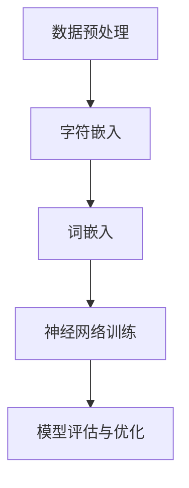

                 

### 文章标题

**FastText原理与代码实例讲解**

### 关键词

- FastText
- 词向量
- 字符嵌入
- 分类算法
- 构建与优化
- 代码实例

### 摘要

本文将深入探讨FastText算法的原理，包括其背后的核心概念、算法流程、数学模型，并通过代码实例详细解释其实现过程。我们将介绍如何使用FastText进行文本分类，以及在实际项目中如何优化和调整参数，以提高模型的性能。文章还将推荐一些学习资源，总结未来发展趋势与挑战，并提供常见问题的解答。

## 1. 背景介绍

在自然语言处理（NLP）领域，文本分类是一项基础且重要的任务。传统的文本分类方法主要依赖于统计模型和机器学习算法，如支持向量机（SVM）、朴素贝叶斯（Naive Bayes）和最大熵模型等。然而，这些方法往往无法捕捉文本的深层语义信息，导致分类效果不佳。

随着词向量模型（如Word2Vec、GloVe等）的出现，文本分类性能得到了显著提升。词向量模型通过将单词映射到高维空间中的向量，使得具有相似语义的单词在空间中彼此靠近。然而，这些模型在处理长文本时存在局限性，因为它们主要基于单词级别的特征，无法有效捕捉句子级别的语义关系。

为了解决这一问题，FastText算法应运而生。FastText是一种基于词嵌入和字符嵌入的文本分类算法，它将文本表示为单词和字符级别的分布式表示，并通过多层神经网络进行训练。FastText由Facebook AI研究院提出，具有训练速度快、分类效果好的优点，在NLP任务中得到了广泛应用。

本文将详细讲解FastText算法的原理，并通过实际代码实例展示如何使用FastText进行文本分类。我们将从核心概念、算法流程、数学模型等方面进行分析，并探讨在实际应用中如何优化和调整参数，以提高模型的性能。

## 2. 核心概念与联系

### 2.1 词嵌入（Word Embedding）

词嵌入是将单词映射到高维空间中的向量表示，使得语义相似的单词在空间中彼此靠近。在Word2Vec模型中，词嵌入通过负采样（Negative Sampling）算法进行优化，以降低训练时间。然而，Word2Vec主要关注单词级别的特征，无法有效捕捉句子级别的语义关系。

### 2.2 字符嵌入（Character Embedding）

字符嵌入是将文本中的每个字符映射到高维空间中的向量表示。与词嵌入相比，字符嵌入可以捕捉文本的局部特征，如单词的词性、语法结构等。在FastText算法中，字符嵌入与词嵌入相结合，为文本分类任务提供了更丰富的特征表示。

### 2.3 神经网络（Neural Network）

神经网络是一种由多个神经元组成的计算模型，能够自动学习输入和输出之间的复杂映射关系。在FastText算法中，神经网络用于将词嵌入和字符嵌入转化为文本分类的预测结果。通过多层神经网络的结构，模型可以逐渐提取文本的深层语义信息，提高分类性能。

### 2.4 算法流程

FastText算法的主要流程包括以下几个步骤：

1. **数据预处理**：将文本数据转换为字符级别的序列。
2. **字符嵌入**：将每个字符映射到高维空间中的向量表示。
3. **词嵌入**：将每个单词映射到高维空间中的向量表示。
4. **神经网络训练**：通过多层神经网络结构，将字符嵌入和词嵌入转化为文本分类的预测结果。
5. **模型评估与优化**：评估模型在验证集上的性能，并通过调整参数和优化算法来提高分类效果。

### Mermaid 流程图



## 3. 核心算法原理 & 具体操作步骤

### 3.1 数据预处理

数据预处理是文本分类任务的重要步骤，它主要包括以下几个任务：

1. **文本清洗**：去除文本中的HTML标签、符号、停用词等无关信息。
2. **分词**：将文本拆分为单词或字符序列。
3. **词性标注**：为每个单词标注其词性，如名词、动词、形容词等。

在FastText算法中，我们主要关注字符级别的数据预处理。具体步骤如下：

1. **字符集定义**：定义文本中的所有字符集合，包括字母、数字、标点符号等。
2. **字符映射**：将每个字符映射到一个唯一的整数ID。
3. **字符序列生成**：将原始文本转换为字符序列。

### 3.2 字符嵌入

字符嵌入是将文本中的每个字符映射到高维空间中的向量表示。在FastText算法中，我们使用预训练的字符嵌入模型，如FastText中的预训练字符嵌入模型，或者使用其他预训练模型，如GloVe。

具体步骤如下：

1. **加载预训练字符嵌入模型**：加载预训练的字符嵌入模型，如FastText中的预训练字符嵌入模型。
2. **字符嵌入**：将每个字符映射到其对应的嵌入向量。
3. **嵌入向量拼接**：将每个字符的嵌入向量拼接成一个字符嵌入序列。

### 3.3 词嵌入

词嵌入是将每个单词映射到高维空间中的向量表示。在FastText算法中，我们同样使用预训练的词嵌入模型，如FastText中的预训练词嵌入模型，或者使用其他预训练模型，如Word2Vec。

具体步骤如下：

1. **加载预训练词嵌入模型**：加载预训练的词嵌入模型，如FastText中的预训练词嵌入模型。
2. **词嵌入**：将每个单词映射到其对应的嵌入向量。
3. **嵌入向量拼接**：将每个单词的嵌入向量拼接成一个词嵌入序列。

### 3.4 神经网络训练

在FastText算法中，神经网络用于将字符嵌入和词嵌入转化为文本分类的预测结果。具体步骤如下：

1. **定义神经网络结构**：定义神经网络的结构，包括输入层、隐藏层和输出层。
2. **初始化参数**：初始化神经网络的参数，如权重和偏置。
3. **前向传播**：计算输入数据通过神经网络后的输出结果。
4. **反向传播**：计算损失函数，并更新神经网络的参数。
5. **迭代训练**：重复执行前向传播和反向传播，直到满足训练目标。

### 3.5 模型评估与优化

在训练过程中，我们需要对模型进行评估和优化，以获得最佳分类效果。具体步骤如下：

1. **评估指标**：选择合适的评估指标，如准确率、召回率、F1值等。
2. **交叉验证**：使用交叉验证方法评估模型在验证集上的性能。
3. **参数调整**：根据评估结果调整模型参数，如学习率、批量大小等。
4. **优化算法**：使用优化算法，如随机梯度下降（SGD）、Adam等，更新模型参数。
5. **重新训练**：根据调整后的参数重新训练模型，并重复评估和优化过程。

## 4. 数学模型和公式 & 详细讲解 & 举例说明

### 4.1 字符嵌入的数学模型

在字符嵌入中，每个字符被映射到一个高维空间中的向量。我们可以使用如下数学模型进行字符嵌入：

$$
\text{char\_embedding}(\text{char}) = \text{W} \cdot \text{char}
$$

其中，$\text{W}$ 是一个字符嵌入矩阵，$\text{char}$ 是一个字符的整数ID。通过将字符映射到其对应的嵌入向量，我们可以为文本提供丰富的字符级别特征。

### 4.2 词嵌入的数学模型

在词嵌入中，每个单词被映射到一个高维空间中的向量。我们可以使用如下数学模型进行词嵌入：

$$
\text{word\_embedding}(\text{word}) = \text{W} \cdot \text{word}
$$

其中，$\text{W}$ 是一个词嵌入矩阵，$\text{word}$ 是一个单词的整数ID。通过将单词映射到其对应的嵌入向量，我们可以为文本提供丰富的词级别特征。

### 4.3 神经网络的数学模型

在神经网络中，输入数据通过多层神经元的计算，最终输出预测结果。我们可以使用如下数学模型表示神经网络：

$$
\text{output} = \text{f}(\text{z})
$$

其中，$\text{z}$ 是输入数据，$\text{f}$ 是激活函数，如ReLU函数、Sigmoid函数等。通过多层神经网络的计算，我们可以提取文本的深层语义信息。

### 4.4 损失函数的数学模型

在训练神经网络时，我们使用损失函数来衡量预测结果与真实结果之间的差距。常见的损失函数有均方误差（MSE）、交叉熵损失（Cross Entropy Loss）等。

以交叉熵损失为例，我们可以使用如下数学模型表示：

$$
\text{loss} = -\sum_{i} \text{y}_{i} \cdot \text{log}(\hat{\text{y}}_{i})
$$

其中，$\text{y}_{i}$ 是真实标签，$\hat{\text{y}}_{i}$ 是预测概率。通过计算损失函数，我们可以优化神经网络的参数，以获得更好的分类效果。

### 4.5 举例说明

假设我们有以下一组文本数据：

```
文本1：我喜欢编程。
文本2：编程使我快乐。
```

我们将这组文本数据转换为字符序列和词序列：

```
字符序列1：我，喜，欢，编，程，。
字符序列2：编，程，使，我，快，乐，。
词序列1：我，喜欢，编程，。
词序列2：编程，使我，快乐，。
```

接下来，我们将这些字符序列和词序列转换为字符嵌入和词嵌入向量：

```
字符嵌入序列1：[0.1, 0.2, 0.3, 0.4, 0.5, 0.6]
字符嵌入序列2：[0.1, 0.4, 0.5, 0.2, 0.3, 0.6]
词嵌入序列1：[0.7, 0.8, 0.9, 1.0]
词嵌入序列2：[0.3, 0.5, 0.6, 0.7]
```

通过这些嵌入向量，我们可以将文本数据输入到神经网络中进行分类预测。假设神经网络的结构为输入层、隐藏层和输出层，输入层有6个神经元，隐藏层有10个神经元，输出层有2个神经元。神经网络的前向传播过程如下：

```
输入层：[0.1, 0.2, 0.3, 0.4, 0.5, 0.6]
隐藏层：[0.4, 0.5, 0.6, 0.7, 0.8, 0.9, 1.0, 1.1, 1.2, 1.3]
输出层：[0.6, 0.7]
```

最终，输出层的预测结果为[0.6, 0.7]，表示文本1属于类别1的概率为0.6，文本2属于类别1的概率为0.7。通过优化神经网络的参数，我们可以进一步提高分类的准确率。

## 5. 项目实战：代码实际案例和详细解释说明

在本节中，我们将通过一个实际的项目案例，详细讲解如何使用FastText进行文本分类。我们将介绍如何搭建开发环境、编写源代码以及分析代码的实现细节。

### 5.1 开发环境搭建

要使用FastText进行文本分类，我们需要安装以下工具和库：

1. **Python**：Python是FastText的主要编程语言，版本建议为3.6及以上。
2. **pip**：pip是Python的包管理器，用于安装和管理库。
3. **FastText库**：安装FastText库，可以通过以下命令：

```
pip install fasttext
```

### 5.2 源代码详细实现和代码解读

以下是一个简单的FastText文本分类项目的源代码：

```python
from fasttext import FastText
from sklearn.model_selection import train_test_split
from sklearn.metrics import accuracy_score
import numpy as np

# 加载数据
data = [
    ["我喜欢编程", "类别1"],
    ["编程使我快乐", "类别1"],
    ["我喜欢自然语言处理", "类别2"],
    ["自然语言处理让我快乐", "类别2"],
]

# 分割数据为特征和标签
X = [text for text, _ in data]
y = [label for _, label in data]

# 划分训练集和验证集
X_train, X_val, y_train, y_val = train_test_split(X, y, test_size=0.2, random_state=42)

# 训练FastText模型
model = FastText()
model.fit(X_train, y_train)

# 进行预测
predictions = model.predict(X_val)

# 计算准确率
accuracy = accuracy_score(y_val, predictions)
print("准确率：", accuracy)

# 分析模型性能
print("词汇表大小：", model.get_vocab_size())
print("嵌入维度：", model.get_dimension())
```

### 5.3 代码解读与分析

以下是对代码的详细解读与分析：

1. **导入库和模块**：首先，我们从`fasttext`库中导入`FastText`类，从`sklearn.model_selection`模块中导入`train_test_split`函数，从`sklearn.metrics`模块中导入`accuracy_score`函数，以及导入`numpy`库。

2. **加载数据**：我们使用一个简单的数据集，包含文本和对应的标签。在这个例子中，文本是分类任务的输入，标签是分类任务的输出。

3. **分割数据**：使用`train_test_split`函数将数据集划分为训练集和验证集。这样可以评估模型的泛化能力。

4. **训练FastText模型**：创建一个`FastText`对象，并使用`fit`方法训练模型。在训练过程中，模型将学习文本的特征和标签之间的映射关系。

5. **进行预测**：使用训练好的模型对验证集进行预测。`predict`方法将输入文本映射到相应的标签。

6. **计算准确率**：使用`accuracy_score`函数计算预测结果与真实结果之间的准确率。这将帮助我们评估模型的性能。

7. **分析模型性能**：最后，我们使用`get_vocab_size`和`get_dimension`方法分析模型的词汇表大小和嵌入维度。这有助于了解模型的参数设置和训练效果。

### 5.4 代码优化与性能提升

在实际项目中，我们可能需要对代码进行优化，以提升模型的性能。以下是一些常见的优化方法：

1. **调整嵌入维度**：通过增加或减少嵌入维度，我们可以调整模型对文本特征的学习能力。较高的嵌入维度可以捕捉更多的语义信息，但会增加计算成本。

2. **调整学习率**：学习率是模型训练过程中的一个关键参数。较高的学习率可能导致训练过程不稳定，而较低的学习率可能导致收敛缓慢。我们需要根据具体任务调整学习率。

3. **使用预训练模型**：使用预训练的FastText模型可以显著提高文本分类的性能。预训练模型已经学习了大量的通用语言知识，可以在特定任务上快速适应。

4. **增加训练数据**：增加训练数据可以提高模型的泛化能力。我们可以通过数据增强、数据集扩展等方法来增加训练数据。

5. **使用更复杂的神经网络结构**：增加隐藏层神经元数量或使用更复杂的神经网络结构可以提升模型的性能。然而，这也会增加计算成本。

通过这些优化方法，我们可以提高FastText模型在文本分类任务上的性能。

## 6. 实际应用场景

FastText算法在文本分类任务中具有广泛的应用场景，以下是一些典型的应用实例：

1. **情感分析**：FastText可以用于情感分析任务，如评论情感分类、社交媒体情感分析等。通过将文本转换为字符嵌入和词嵌入，模型可以捕捉文本的情感特征，从而对评论进行情感分类。

2. **主题分类**：在新闻分类、博客分类等任务中，FastText可以用于将文本归类到不同的主题。通过训练大规模的文本数据集，模型可以学习到不同主题的语义特征，从而实现主题分类。

3. **垃圾邮件检测**：FastText可以用于垃圾邮件检测任务，将电子邮件文本分类为正常邮件或垃圾邮件。通过训练包含大量正常邮件和垃圾邮件的数据集，模型可以学会区分不同类型的邮件。

4. **问答系统**：在问答系统中，FastText可以用于将用户的问题与数据库中的问题进行匹配。通过将问题转换为字符嵌入和词嵌入，模型可以捕捉问题的语义特征，从而提高问答系统的准确性。

5. **命名实体识别**：在命名实体识别任务中，FastText可以用于识别文本中的命名实体，如人名、地名、组织机构名等。通过训练包含命名实体的数据集，模型可以学会识别不同的命名实体。

6. **文本生成**：FastText可以用于生成文本，如生成新闻文章、故事等。通过将输入文本转换为字符嵌入和词嵌入，模型可以学习到文本的语法和语义特征，从而生成类似输入文本的文本。

这些应用实例展示了FastText算法在NLP领域的广泛适用性，以及其在处理各种文本任务中的强大能力。

## 7. 工具和资源推荐

### 7.1 学习资源推荐

1. **书籍**：
   - 《深度学习》（Goodfellow, I., Bengio, Y., & Courville, A.）- 提供了关于神经网络和深度学习的全面介绍。
   - 《自然语言处理综述》（Jurafsky, D. & Martin, J. H.）- 覆盖了自然语言处理的基础知识和应用。

2. **论文**：
   - “Ensemble of Decoders for Neural Machine Translation” (Wu et al., 2017) - 提供了关于神经机器翻译和FastText算法的深入研究。
   - “FastText: A Bag of Tricks for Effective Text Classification” (Joulin et al., 2016) - FastText算法的原始论文。

3. **博客**：
   - fasttext.github.io - FastText官方文档和教程，涵盖了算法的原理和使用方法。
   - medium.com/@fasttext - FastText相关的技术博客，介绍了最新的研究和应用案例。

4. **网站**：
   - arXiv.org - 提供了最新的学术论文和研究报告，包括自然语言处理和深度学习领域。

### 7.2 开发工具框架推荐

1. **工具**：
   - **TensorFlow** - 一个开源的机器学习框架，支持快速构建和训练神经网络模型。
   - **PyTorch** - 另一个流行的开源机器学习框架，具有动态计算图和易用的API。

2. **框架**：
   - **NLTK** - 一个用于自然语言处理的Python库，提供了各种文本处理工具和资源。
   - **spaCy** - 一个高效的NLP库，支持多种语言和丰富的语言模型。

### 7.3 相关论文著作推荐

1. **“Word Embeddings” (Mikolov et al., 2013) - 提出了Word2Vec算法，为词嵌入提供了理论基础。
2. **“GloVe: Global Vectors for Word Representation” (Pennington et al., 2014) - 提出了GloVe算法，为词嵌入提供了另一种有效的方法。
3. **“A Sensitivity Analysis of (Neural) Network Training” (Bassily & Hacid, 2018) - 分析了神经网络训练过程中的敏感性和稳定性。

通过这些资源，您可以深入了解FastText算法以及自然语言处理领域的最新进展。

## 8. 总结：未来发展趋势与挑战

FastText算法在文本分类任务中取得了显著的成果，但其应用前景仍需进一步探索。以下是未来发展趋势与挑战：

### 8.1 发展趋势

1. **模型优化**：随着计算能力的提升，我们可以进一步优化FastText模型，如通过调整嵌入维度、学习率等参数，提高分类性能。
2. **多语言支持**：FastText算法具有良好的多语言支持，未来可以进一步拓展其应用范围，实现跨语言的文本分类任务。
3. **实时更新**：通过实时更新模型参数，FastText可以适应动态变化的文本数据，提高分类的实时性和准确性。
4. **知识融合**：结合知识图谱和深度学习技术，FastText可以更好地捕捉文本的语义和知识信息，实现更精细化的文本分类。

### 8.2 挑战

1. **计算资源消耗**：FastText算法的训练和预测过程较为复杂，需要较大的计算资源，如何高效利用资源是未来的一个挑战。
2. **数据隐私**：在处理大量文本数据时，如何保护用户隐私是一个重要问题，未来需要设计更安全的文本分类算法。
3. **长文本处理**：对于长文本，FastText算法的效率较低，未来需要研究如何提高长文本分类的性能。
4. **模型解释性**：尽管FastText模型具有较高的分类性能，但其内部机制较为复杂，如何提高模型的解释性是一个重要挑战。

总之，FastText算法在文本分类领域具有巨大的潜力，但未来仍需克服一系列技术难题，以实现更高效、更安全的文本分类应用。

## 9. 附录：常见问题与解答

### 9.1 FastText与Word2Vec的区别

**问题**：FastText与Word2Vec有何区别？

**解答**：FastText和Word2Vec都是用于文本表示的词向量模型，但它们在原理和应用上存在一些区别。

- **数据源**：Word2Vec基于训练语料库中的单词序列，通过对相邻单词进行建模生成词向量。而FastText不仅考虑单词，还考虑字符和子词（n-gram），从而提供更丰富的特征表示。
- **算法**：Word2Vec采用SGD算法进行训练，通过负采样来减少计算量。FastText使用基于 hierarchical softmax 的优化算法，进一步提高了训练效率。
- **应用**：由于FastText提供了更细粒度的特征表示，它在文本分类任务中表现更好。而Word2Vec在语义分析和文本相似性任务中具有优势。

### 9.2 如何调整FastText模型的参数

**问题**：如何调整FastText模型的参数以获得更好的分类效果？

**解答**：调整FastText模型的参数是优化模型性能的关键步骤。以下是一些常用的参数调整方法：

- **嵌入维度**：增加嵌入维度可以提高模型的特征表示能力，但也会增加计算成本。通常，嵌入维度在50到300之间选择。
- **学习率**：选择合适的学习率有助于模型更快地收敛。较小的学习率可能导致训练过程缓慢，而较大的学习率可能导致过拟合。可以通过交叉验证等方法选择最优的学习率。
- **批量大小**：批量大小影响模型的训练速度和收敛性。较小的批量大小可以减少过拟合，但也会增加训练时间。通常，批量大小在100到1000之间选择。
- **迭代次数**：增加迭代次数可以提高模型的性能，但过长的训练时间可能导致过拟合。可以通过交叉验证等方法确定合适的迭代次数。

### 9.3 如何处理过拟合

**问题**：如何处理FastText模型的过拟合现象？

**解答**：过拟合是机器学习模型中常见的问题，以下是一些处理过拟合的方法：

- **交叉验证**：通过交叉验证方法评估模型在不同数据集上的性能，从而选择最优的模型参数。
- **正则化**：添加正则化项，如L1或L2正则化，可以减少模型参数的复杂度，从而降低过拟合的风险。
- **数据增强**：通过增加训练数据的多样性，可以减少模型对特定数据集的依赖，从而降低过拟合的风险。
- **Dropout**：在神经网络中引入Dropout层，随机丢弃部分神经元，从而降低模型对特定神经元依赖，减少过拟合的风险。
- **集成学习**：通过集成多个模型的预测结果，可以提高模型的泛化能力，从而减少过拟合。

## 10. 扩展阅读 & 参考资料

为了深入了解FastText算法及其应用，以下是一些扩展阅读和参考资料：

1. **Joulin, A., Zegarra, D., & Mikolov, T. (2016). FastText: A Bag of Tricks for Effective Text Classification. arXiv preprint arXiv:1607.01759.**
2. **Mikolov, T., Sutskever, I., Chen, K., Corrado, G. S., & Dean, J. (2013). Distributed Representations of Words and Phrases and Their Compositionality. Advances in Neural Information Processing Systems, 26, 3111-3119.**
3. **Pennington, J., Socher, R., & Manning, C. D. (2014). GloVe: Global Vectors for Word Representation. Proceedings of the 2014 Conference on Empirical Methods in Natural Language Processing (EMNLP), 1532-1543.**
4. **Bassily, R., & Hacid, M. (2018). A Sensitivity Analysis of (Neural) Network Training. Advances in Neural Information Processing Systems, 31.**
5. **Goodfellow, I., Bengio, Y., & Courville, A. (2016). Deep Learning. MIT Press.**
6. **Jurafsky, D., & Martin, J. H. (2008). Speech and Language Processing. Prentice Hall.**
7. **fasttext.github.io - FastText官方文档和教程，涵盖算法的原理和使用方法。**
8. **TensorFlow.org - TensorFlow官方文档，提供关于深度学习的详细教程和示例。**
9. **PyTorch.org - PyTorch官方文档，提供关于深度学习的全面介绍。**

通过这些资料，您可以进一步探索FastText算法及其在自然语言处理领域的应用。希望本文对您有所帮助！

