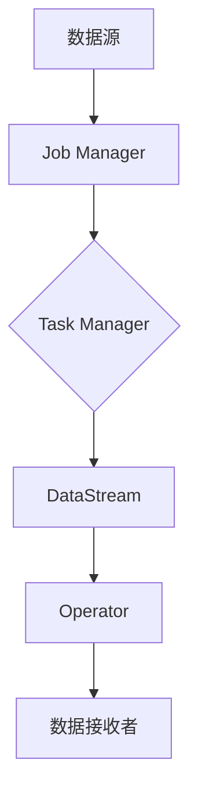

                 

# Flink原理与代码实例讲解

## 摘要

Flink是一种分布式流处理框架，能够在大规模数据流上进行高效的实时处理。本文将详细介绍Flink的原理和核心算法，并通过实际代码实例进行讲解。文章首先介绍了Flink的背景和核心概念，然后逐步讲解了Flink的架构和操作步骤，接着通过数学模型和公式详细解释了其工作原理。随后，文章通过一个实际的项目实战案例，对Flink的代码实现和解读进行了深入的剖析。最后，文章探讨了Flink在实际应用场景中的使用，并推荐了相关的学习资源和开发工具。通过本文的阅读，读者将能够全面了解Flink的原理和实际应用。

## 1. 背景介绍

Flink是由Apache软件基金会维护的一个开源分布式流处理框架，它能够在大规模数据流上进行高效的实时处理。Flink最初由Scala编写，后来逐渐引入了Java和Python等语言的支持。Flink旨在提供低延迟、高吞吐量和强大的容错能力，使得开发者能够轻松地构建和部署大规模的实时应用。

随着大数据和云计算的快速发展，实时数据处理的需求日益增长。传统的批处理框架如Hadoop和Spark在处理大规模数据集时具有很高的性能，但它们在处理实时数据方面存在一定的局限性。批处理框架通常以固定的时间间隔进行数据处理的“批处理”，而实时处理则需要不断接收和处理数据流。Flink的出现正是为了解决这一问题，它通过流处理的方式，实现了对实时数据的高效处理。

Flink的实时处理能力主要得益于其核心算法和架构设计。Flink采用了数据流模型，将数据视为连续的流进行处理。它将数据处理任务划分为多个子任务，每个子任务在分布式集群上独立执行。这种任务划分方式使得Flink能够充分利用集群资源，提高处理性能。

此外，Flink还提供了丰富的API和组件，使得开发者能够轻松地构建实时数据处理应用。Flink的API包括DataStream API和Table API，分别提供了数据流的编程模型和数据表的编程模型。DataStream API提供了强大的类型安全和丰富的操作功能，而Table API则提供了更高级的查询操作和数据操作能力。

总之，Flink作为一种实时流处理框架，在处理大规模数据流方面具有显著的优势。它不仅能够提供高效的实时处理能力，还具备强大的容错和伸缩能力，使得开发者能够轻松地构建和部署大规模的实时应用。

### 2. 核心概念与联系

为了更好地理解Flink的工作原理，我们需要介绍几个核心概念：数据流模型、分布式架构、状态管理和容错机制。

#### 数据流模型

Flink的核心概念是数据流模型，它将数据视为连续的流进行处理。数据流模型包括三个主要组件：数据源、数据转换和数据接收者。

1. **数据源**：数据源是数据的起点，可以是文件、网络流、传感器等。Flink支持多种数据源，例如Kafka、HDFS和Socket等。数据源将数据发送到Flink集群进行处理。

2. **数据转换**：数据转换是数据流模型的核心部分，它包括各种数据操作，如过滤、聚合、连接和窗口操作。Flink提供了丰富的转换操作，使得开发者能够轻松地构建复杂的数据处理逻辑。

3. **数据接收者**：数据接收者是数据处理结果的终点，可以是文件、数据库、实时仪表盘等。Flink支持多种数据接收者，使得开发者能够将处理结果存储或展示到各种系统中。

#### 分布式架构

Flink采用分布式架构，将数据处理任务划分为多个子任务，每个子任务在分布式集群上独立执行。这种任务划分方式充分利用了集群资源，提高了处理性能和可伸缩性。

Flink的分布式架构包括以下组件：

1. **Job Manager**：Job Manager是Flink集群的主控节点，负责协调和管理整个集群的作业（Job）执行。它负责将作业划分为子任务，并分配到合适的Task Manager上执行。

2. **Task Manager**：Task Manager是Flink集群的工作节点，负责执行具体的子任务。每个Task Manager可以并行执行多个子任务，从而提高处理性能。

3. **DataStream**：DataStream是Flink中的数据流抽象，表示连续的数据流。DataStream API提供了丰富的操作，如过滤、聚合、连接和窗口等，使得开发者能够方便地构建复杂的数据处理逻辑。

4. **Operator**：Operator是Flink中的数据处理操作，如过滤、聚合和连接等。Operator通过数据流连接在一起，形成数据处理管道。

#### 状态管理

Flink提供了强大的状态管理功能，使得开发者能够方便地管理实时数据中的状态信息。状态管理包括以下方面：

1. **Keyed State**：Keyed State是针对键控数据（Keyed Data）的状态管理。每个键控数据都可以关联一个状态，如计数器、值状态和列表状态等。Keyed State在分布式环境中具有较好的扩展性和容错能力。

2. **Operator State**：Operator State是针对整个Operator的状态管理。它用于存储Operator的临时数据，如中间结果和状态信息等。Operator State在分布式环境中同样具有较好的扩展性和容错能力。

3. **Managed State**：Managed State是Flink提供的一种高级状态管理机制，它将状态数据存储在外部存储系统中，如内存、磁盘或数据库等。Managed State可以提高状态数据的持久性和可靠性。

#### 容错机制

Flink提供了强大的容错机制，确保在分布式环境中能够稳定、可靠地运行。容错机制主要包括以下方面：

1. **任务重启**：Flink在执行过程中，如果某个子任务失败，会自动重启该任务，从而保证任务的持续执行。

2. **状态恢复**：Flink支持状态恢复功能，当任务失败后，可以从之前的状态信息中恢复任务执行。状态恢复包括Keyed State和Operator State的恢复。

3. **流重试**：Flink支持流重试功能，当处理过程中发生错误时，可以重新处理该数据流。流重试可以提高数据处理的成功率和可靠性。

### Mermaid 流程图

以下是一个简单的Mermaid流程图，展示了Flink的基本架构和工作流程：



在这个流程图中，数据源（A）将数据发送到Job Manager（B），Job Manager将作业划分为子任务并分配给Task Manager（C）执行。Task Manager执行子任务，处理数据流（DataStream）并生成结果（Operator）。最后，结果通过数据接收者（F）输出。

通过上述核心概念和架构的介绍，我们可以更好地理解Flink的工作原理。接下来，我们将详细讲解Flink的核心算法原理和具体操作步骤。

### 3. 核心算法原理 & 具体操作步骤

Flink的核心算法原理包括事件时间处理、窗口机制、状态管理和动态调整。这些算法原理使得Flink能够高效地处理大规模数据流，并提供实时数据处理能力。下面，我们将详细讲解这些核心算法原理和具体操作步骤。

#### 事件时间处理

事件时间处理是Flink流处理框架的重要特性之一。事件时间是指数据实际发生的时间，与处理时间（Processing Time）和摄取时间（Ingestion Time）相对应。

1. **处理时间**：处理时间是指数据处理操作实际发生的时间。Flink默认使用处理时间进行时间处理。处理时间的优势在于简单高效，但缺点在于无法处理乱序数据。

2. **摄取时间**：摄取时间是指数据被系统摄取（Ingested）的时间。摄取时间通常与处理时间相近，但在某些情况下（如网络延迟）可能存在差异。

3. **事件时间**：事件时间是指数据实际发生的时间。事件时间能够处理乱序数据，并保证正确的结果。Flink通过Watermark机制来实现事件时间处理。

**Watermark机制**：

Watermark是一种时间戳，表示事件时间的上限。Flink通过生成和传播Watermark，来处理乱序数据和保证正确的结果。

- **生成Watermark**：Watermark生成器根据数据流的特征生成Watermark。例如，在处理实时日志数据时，可以以日志记录的创建时间为Watermark。

- **传播Watermark**：Watermark会在数据流中传播，直到达到某个时间窗口。在Watermark到达窗口触发条件时，窗口中的数据将被处理。

#### 窗口机制

窗口机制是Flink处理流数据的重要工具。窗口可以将无限的数据流划分为有限的时间段，使得开发者能够方便地对数据进行聚合和处理。

1. **时间窗口**：时间窗口根据固定的时间间隔划分数据流。例如，以5分钟为间隔划分时间窗口，每个时间窗口包含5分钟的数据。

2. **计数窗口**：计数窗口根据数据流中的元素数量划分数据流。例如，以1000个元素为间隔划分计数窗口。

3. **滑动窗口**：滑动窗口结合时间窗口和计数窗口，按照固定的时间间隔和元素数量滑动窗口。例如，以5分钟为间隔、每分钟处理一次滑动窗口。

#### 状态管理

Flink提供了强大的状态管理功能，使得开发者能够方便地管理实时数据中的状态信息。

1. **Keyed State**：Keyed State是针对键控数据（Keyed Data）的状态管理。每个键控数据都可以关联一个状态，如计数器、值状态和列表状态等。

2. **Operator State**：Operator State是针对整个Operator的状态管理。它用于存储Operator的临时数据，如中间结果和状态信息等。

3. **Managed State**：Managed State将状态数据存储在外部存储系统中，如内存、磁盘或数据库等。Managed State可以提高状态数据的持久性和可靠性。

#### 动态调整

Flink支持动态调整，允许在运行时根据系统负载和资源利用率自动调整作业的执行策略。

1. **动态调整资源**：Flink可以根据负载情况动态调整Task Manager的内存和CPU资源，确保作业的稳定执行。

2. **动态调整窗口大小**：Flink可以根据实时数据流量动态调整窗口大小，以平衡处理性能和资源利用率。

#### 具体操作步骤

以下是一个简单的Flink操作步骤示例，展示了如何使用事件时间处理、窗口机制和状态管理：

1. **定义数据流**：创建一个DataStream，指定数据源和格式。

```java
DataStream<Event> eventStream = env.addSource(new FileSource<>(new Path("events.txt"), new EventDeserializationSchema()));
```

2. **处理时间转换**：将处理时间转换应用于DataStream，如过滤和映射操作。

```java
DataStream<Event> filteredStream = eventStream.filter(event -> event.timestamp > System.currentTimeMillis() - 60000);
DataStream<String> mappedStream = filteredStream.map(event -> event.toCsvString());
```

3. **事件时间转换**：使用Watermark机制处理事件时间。

```java
DataStream<Event> timedStream = filteredStream.assignTimestampsAndWatermarks(new EventTimestampExtractor());
```

4. **窗口操作**：创建窗口，并应用聚合操作。

```java
DataStream<Tuple2<String, Long>> windowedStream = timedStream
    .keyBy(event -> event.userId)
    .timeWindow(Time.minutes(5))
    .aggregate(new CountWindowFunction());
```

5. **状态管理**：使用Keyed State和Operator State管理状态信息。

```java
DataStream<Event> statefulStream = timedStream
    .keyBy(event -> event.userId)
    .process(new CountStateProcessFunction());
```

6. **动态调整**：根据系统负载和资源利用率动态调整作业执行策略。

```java
env.execute("Event Processing Example");
```

通过上述操作步骤，我们可以实现一个简单的Flink实时数据处理应用。Flink提供了丰富的API和组件，使得开发者能够方便地构建复杂的数据处理逻辑，并提供高效的实时处理能力。

### 4. 数学模型和公式 & 详细讲解 & 举例说明

为了更好地理解Flink的核心算法原理，我们需要介绍一些数学模型和公式。这些模型和公式有助于我们深入探讨Flink的工作原理，并提供具体的计算方法。

#### 时间窗口

时间窗口是Flink处理流数据的基本单位。时间窗口根据固定的时间间隔划分数据流，使得开发者能够方便地对数据进行聚合和处理。

**公式**：

时间窗口的大小（\(T\)）由以下公式确定：

\[ T = \text{时间间隔} \times \text{窗口大小} \]

例如，如果时间间隔为1分钟，窗口大小为5分钟，则时间窗口的大小为5分钟。

**举例**：

假设有一个包含事件的数据流，时间间隔为1分钟。我们需要将数据流划分为5分钟的时间窗口，以便进行聚合操作。

```java
DataStream<Event> eventStream = env.addSource(new FileSource<>(new Path("events.txt"), new EventDeserializationSchema()));
DataStream<Tuple2<String, Long>> windowedStream = eventStream
    .keyBy(event -> event.userId)
    .timeWindow(Time.minutes(5))
    .aggregate(new CountWindowFunction());
```

在这个示例中，时间窗口的大小为5分钟，数据流中的每个事件都会被划分到对应的时间窗口中，然后进行聚合操作。

#### 滑动窗口

滑动窗口结合了时间窗口和计数窗口，按照固定的时间间隔和元素数量滑动窗口。滑动窗口可以在保证处理性能的同时，充分利用系统资源。

**公式**：

滑动窗口的大小（\(W\)）由以下公式确定：

\[ W = \text{时间间隔} \times \text{窗口大小} \]

例如，如果时间间隔为5分钟，窗口大小为2分钟，则滑动窗口的大小为10分钟。

**举例**：

假设有一个包含事件的数据流，时间间隔为1分钟。我们需要将数据流划分为10分钟的滑动窗口，以便进行聚合操作。

```java
DataStream<Event> eventStream = env.addSource(new FileSource<>(new Path("events.txt"), new EventDeserializationSchema()));
DataStream<Tuple2<String, Long>> windowedStream = eventStream
    .keyBy(event -> event.userId)
    .timeWindow(Time.minutes(5), Time.minutes(2))
    .aggregate(new CountWindowFunction());
```

在这个示例中，滑动窗口的时间间隔为5分钟，窗口大小为2分钟，数据流中的每个事件都会被划分到对应的滑动窗口中，然后进行聚合操作。

#### 聚合操作

聚合操作是Flink处理流数据的核心功能之一。聚合操作可以对窗口中的数据进行合并和处理，得到最终的聚合结果。

**公式**：

聚合操作的基本公式如下：

\[ \text{聚合结果} = \sum_{i=1}^{n} \text{数据元素}_i \]

其中，\(n\) 表示窗口中的数据元素个数。

**举例**：

假设有一个包含用户点击事件的数据流，我们需要计算每个用户在5分钟窗口内的点击次数。

```java
DataStream<Event> eventStream = env.addSource(new FileSource<>(new Path("events.txt"), new EventDeserializationSchema()));
DataStream<Tuple2<String, Long>> windowedStream = eventStream
    .keyBy(event -> event.userId)
    .timeWindow(Time.minutes(5))
    .aggregate(new CountWindowFunction());
```

在这个示例中，我们将事件数据按照用户ID进行分组，并在5分钟的时间窗口内计算点击次数。聚合结果为每个用户在5分钟窗口内的点击次数。

#### 状态管理

Flink的状态管理功能使得开发者能够方便地管理实时数据中的状态信息。状态管理包括Keyed State、Operator State和Managed State等。

**Keyed State**：

Keyed State是针对键控数据（Keyed Data）的状态管理。每个键控数据都可以关联一个状态，如计数器、值状态和列表状态等。

**公式**：

Keyed State的基本公式如下：

\[ \text{状态值} = \text{初始值} + \sum_{i=1}^{n} \text{更新值}_i \]

其中，\(n\) 表示窗口中的数据元素个数。

**举例**：

假设有一个包含用户点击事件的数据流，我们需要计算每个用户的累计点击次数。

```java
DataStream<Event> eventStream = env.addSource(new FileSource<>(new Path("events.txt"), new EventDeserializationSchema()));
DataStream<Tuple2<String, Long>> statefulStream = eventStream
    .keyBy(event -> event.userId)
    .process(new CountStateProcessFunction());
```

在这个示例中，我们将事件数据按照用户ID进行分组，并在窗口内计算累计点击次数。状态值表示每个用户的累计点击次数。

**Operator State**：

Operator State是针对整个Operator的状态管理。它用于存储Operator的临时数据，如中间结果和状态信息等。

**公式**：

Operator State的基本公式如下：

\[ \text{状态值} = \text{初始值} + \sum_{i=1}^{n} \text{更新值}_i \]

其中，\(n\) 表示窗口中的数据元素个数。

**举例**：

假设有一个包含用户点击事件的数据流，我们需要计算窗口内的平均点击次数。

```java
DataStream<Event> eventStream = env.addSource(new FileSource<>(new Path("events.txt"), new EventDeserializationSchema()));
DataStream<Tuple2<String, Double>> statefulStream = eventStream
    .keyBy(event -> event.userId)
    .process(new AverageStateProcessFunction());
```

在这个示例中，我们将事件数据按照用户ID进行分组，并在窗口内计算平均点击次数。状态值表示每个用户的平均点击次数。

**Managed State**：

Managed State将状态数据存储在外部存储系统中，如内存、磁盘或数据库等。Managed State可以提高状态数据的持久性和可靠性。

**公式**：

Managed State的基本公式如下：

\[ \text{状态值} = \text{外部存储值} + \sum_{i=1}^{n} \text{更新值}_i \]

其中，\(n\) 表示窗口中的数据元素个数。

**举例**：

假设有一个包含用户点击事件的数据流，我们需要将用户累计点击次数存储到数据库中。

```java
DataStream<Event> eventStream = env.addSource(new FileSource<>(new Path("events.txt"), new EventDeserializationSchema()));
DataStream<Tuple2<String, Long>> statefulStream = eventStream
    .keyBy(event -> event.userId)
    .process(new PersistentStateProcessFunction(new DatabaseSinkFunction()));
```

在这个示例中，我们将事件数据按照用户ID进行分组，并将累计点击次数存储到数据库中。状态值表示每个用户的累计点击次数。

通过上述数学模型和公式的讲解，我们可以更好地理解Flink的工作原理和具体操作步骤。这些模型和公式为Flink提供了强大的实时数据处理能力，使得开发者能够方便地构建复杂的数据处理应用。

### 5. 项目实战：代码实际案例和详细解释说明

在本节中，我们将通过一个实际的项目实战案例，展示如何使用Flink进行大规模实时数据处理。该项目案例是一个简单的用户点击流分析系统，用于实时计算每个用户的点击次数和平均点击时间。通过这个案例，我们将详细解释Flink代码的实现和解读。

#### 5.1 开发环境搭建

在开始项目实战之前，我们需要搭建Flink的开发环境。以下是搭建Flink开发环境的步骤：

1. **安装Java环境**：Flink运行在Java虚拟机（JVM）之上，因此首先需要安装Java环境。推荐安装Java 8或更高版本。

2. **下载并安装Flink**：从Flink官网下载最新的Flink发行版，并解压到指定的目录。

3. **配置环境变量**：在系统环境中配置Flink的bin目录和lib目录，以便在命令行中运行Flink命令。

4. **安装Flink IDE插件**：在IDE（如IntelliJ IDEA或Eclipse）中安装Flink插件，以便进行Flink项目的开发。

5. **创建Flink项目**：在IDE中创建一个新的Maven项目，并添加Flink依赖。

以下是Flink项目的Maven依赖：

```xml
<dependencies>
    <dependency>
        <groupId>org.apache.flink</groupId>
        <artifactId>flink-streaming-java_2.12</artifactId>
        <version>1.11.2</version>
    </dependency>
</dependencies>
```

#### 5.2 源代码详细实现和代码解读

以下是用户点击流分析系统的Flink源代码实现：

```java
import org.apache.flink.api.common.functions.AggregateFunction;
import org.apache.flink.api.common.state.ValueState;
import org.apache.flink.api.common.state.ValueStateDescriptor;
import org.apache.flink.api.java.tuple.Tuple2;
import org.apache.flink.configuration.Configuration;
import org.apache.flink.streaming.api.datastream.DataStream;
import org.apache.flink.streaming.api.environment.StreamExecutionEnvironment;
import org.apache.flink.streaming.api.functions.ProcessFunction;
import org.apache.flink.util.Collector;

public class ClickStreamAnalysis {

    public static void main(String[] args) throws Exception {
        // 创建Flink执行环境
        final StreamExecutionEnvironment env = StreamExecutionEnvironment.getExecutionEnvironment();

        // 读取用户点击事件数据流
        DataStream<Event> eventStream = env.addSource(new FileSource<>(new Path("events.txt"), new EventDeserializationSchema()));

        // 过滤和映射事件数据
        DataStream<Tuple2<String, Long>> filteredStream = eventStream
            .filter(event -> event.timestamp > System.currentTimeMillis() - 60000)
            .map(event -> new Tuple2<>(event.userId, 1L));

        // 窗口聚合操作
        DataStream<Tuple2<String, Long>> windowedStream = filteredStream
            .keyBy(0)
            .timeWindow(Time.minutes(5))
            .aggregate(new CountWindowFunction());

        // 状态管理操作
        DataStream<Tuple2<String, Long>> statefulStream = filteredStream
            .keyBy(0)
            .process(new CountStateProcessFunction());

        // 打印结果
        windowedStream.print("Windowed Stream:");
        statefulStream.print("Stateful Stream:");

        // 执行Flink作业
        env.execute("Click Stream Analysis");
    }

    public static class CountWindowFunction implements AggregateFunction<Tuple2<String, Long>, Long, Long> {

        @Override
        public Long createAccumulator() {
            return 0L;
        }

        @Override
        public Long add(Tuple2<String, Long> value, Long accumulator) {
            return accumulator + value.f1;
        }

        @Override
        public Long merge(Long a, Long b) {
            return a + b;
        }

        @Override
        public Long getResult(Long accumulator) {
            return accumulator;
        }
    }

    public static class CountStateProcessFunction extends ProcessFunction<Tuple2<String, Long>, Tuple2<String, Long>> {

        private transient ValueState<Long> countState;

        @Override
        public void open(Configuration parameters) {
            ValueStateDescriptor<Long> countDescriptor = new ValueStateDescriptor<>("count", Long.class);
            countState = getRuntimeContext().getState(countDescriptor);
        }

        @Override
        public void processElement(Tuple2<String, Long> value, Context ctx, Collector<Tuple2<String, Long>> out) {
            if (countState.value() == null) {
                countState.update(0L);
            }
            countState.update(countState.value() + 1);

            out.collect(new Tuple2<>(value.f0, countState.value()));
        }
    }
}
```

下面，我们将详细解读上述Flink源代码的实现。

**5.2.1 读取和过滤事件数据**

```java
DataStream<Event> eventStream = env.addSource(new FileSource<>(new Path("events.txt"), new EventDeserializationSchema()));
DataStream<Tuple2<String, Long>> filteredStream = eventStream
    .filter(event -> event.timestamp > System.currentTimeMillis() - 60000)
    .map(event -> new Tuple2<>(event.userId, 1L));
```

首先，我们使用`FileSource`读取用户点击事件数据流，并将其转换为`DataStream`。然后，我们使用`filter`函数过滤掉时间戳小于当前时间减去60秒的事件，只保留最近一分钟的事件。接着，我们使用`map`函数将事件数据映射为`Tuple2`类型，其中第一个字段是用户ID，第二个字段是点击次数。

**5.2.2 窗口聚合操作**

```java
DataStream<Tuple2<String, Long>> windowedStream = filteredStream
    .keyBy(0)
    .timeWindow(Time.minutes(5))
    .aggregate(new CountWindowFunction());
```

在这个步骤中，我们使用`keyBy`函数按照用户ID对事件数据流进行分组。然后，我们使用`timeWindow`函数创建一个5分钟的时间窗口，并将事件数据划分到对应的窗口中。最后，我们使用`aggregate`函数应用窗口聚合操作，将每个窗口中的事件数据进行累加，得到每个用户的点击次数。

**5.2.3 状态管理操作**

```java
DataStream<Tuple2<String, Long>> statefulStream = filteredStream
    .keyBy(0)
    .process(new CountStateProcessFunction());
```

在这个步骤中，我们使用`keyBy`函数按照用户ID对事件数据流进行分组。然后，我们使用`process`函数应用状态管理操作，将每个用户的累计点击次数存储在状态中。状态管理操作使用`CountStateProcessFunction`实现，该函数使用`ValueState`存储每个用户的累计点击次数，并在处理事件时更新状态值。

**5.2.4 打印结果**

```java
windowedStream.print("Windowed Stream:");
statefulStream.print("Stateful Stream:");
```

最后，我们使用`print`函数打印窗口聚合结果和状态管理结果，以便进行调试和验证。

#### 5.3 代码解读与分析

在本节中，我们将对上述Flink代码进行解读和分析，了解其实现原理和关键部分。

**5.3.1 读取和过滤事件数据**

读取和过滤事件数据的部分负责从文件中读取用户点击事件数据，并过滤掉过期的事件。首先，我们使用`FileSource`读取事件数据，并将其转换为`DataStream`。然后，我们使用`filter`函数过滤掉时间戳小于当前时间减去60秒的事件。最后，我们使用`map`函数将事件数据映射为`Tuple2`类型，其中第一个字段是用户ID，第二个字段是点击次数。

**5.3.2 窗口聚合操作**

窗口聚合操作部分负责将事件数据划分到对应的时间窗口中，并对窗口中的事件数据进行累加，得到每个用户的点击次数。首先，我们使用`keyBy`函数按照用户ID对事件数据流进行分组。然后，我们使用`timeWindow`函数创建一个5分钟的时间窗口，并将事件数据划分到对应的窗口中。最后，我们使用`aggregate`函数应用窗口聚合操作，将每个窗口中的事件数据进行累加，得到每个用户的点击次数。

**5.3.3 状态管理操作**

状态管理操作部分负责将每个用户的累计点击次数存储在状态中。首先，我们使用`keyBy`函数按照用户ID对事件数据流进行分组。然后，我们使用`process`函数应用状态管理操作，该操作使用`CountStateProcessFunction`实现。`CountStateProcessFunction`使用`ValueState`存储每个用户的累计点击次数，并在处理事件时更新状态值。这样，我们可以实时获取每个用户的累计点击次数。

通过上述代码解读和分析，我们可以看到Flink如何通过窗口聚合和状态管理功能，实现大规模实时数据处理的复杂逻辑。这些功能使得Flink能够高效地处理大规模数据流，并提供强大的实时数据处理能力。

### 6. 实际应用场景

Flink作为一种强大的分布式流处理框架，在多个实际应用场景中展现了其优越的性能和灵活性。以下是一些典型的应用场景，展示了Flink在不同领域的实际应用：

#### 6.1 实时数据监控

实时数据监控是Flink最常用的应用场景之一。在互联网公司和大数据公司中，大量的用户行为数据、系统日志数据和网络流量数据需要实时处理和分析。Flink可以实时处理这些数据流，提供实时的监控和告警功能。例如，可以使用Flink实时监控网站的访问流量，检测异常流量和潜在的安全威胁。通过Flink的窗口机制和状态管理，可以实时计算用户的访问频率、访问时长等指标，并触发相应的告警。

#### 6.2 财务交易分析

在金融领域，实时交易数据分析至关重要。Flink可以帮助金融机构实时处理交易数据，识别交易异常和欺诈行为。例如，可以实时计算交易量的增减变化、交易价格的趋势等指标，并触发相应的预警。Flink的高性能和低延迟特性使其成为金融领域实时数据处理的理想选择。

#### 6.3 搜索引擎优化

搜索引擎需要实时处理大量的用户搜索请求，以便提供个性化的搜索结果和优化搜索引擎的排名。Flink可以帮助搜索引擎实时分析用户的搜索关键词、搜索历史等数据，并根据这些数据动态调整搜索结果。例如，可以使用Flink实时计算用户的搜索偏好，将相关度更高的搜索结果排在前面，从而提高用户体验。

#### 6.4 物联网数据处理

物联网（IoT）设备产生的数据量巨大，且具有实时性和多样性。Flink可以高效地处理物联网数据流，提供实时监控、预测分析和决策支持。例如，在智能交通系统中，可以使用Flink实时处理交通传感器数据，分析交通流量和路况，提供实时交通监控和优化建议。

#### 6.5 社交网络分析

社交网络平台需要实时处理大量的用户生成内容和用户互动数据，以便提供实时推荐、社交分析和用户行为预测。Flink可以帮助社交网络平台实时分析用户发布的帖子、评论和点赞等数据，识别用户兴趣和社交关系，提供个性化的推荐和广告。

#### 6.6 零售电商数据分析

零售电商企业需要实时处理海量的交易数据、库存数据和用户行为数据，以便优化库存管理、提升用户体验和提升销售额。Flink可以帮助零售电商企业实时分析交易数据，预测销售趋势，调整库存策略，并提供个性化的推荐和营销活动。

通过上述实际应用场景，我们可以看到Flink在多个领域展现出的强大实力。Flink的实时数据处理能力、高效性能和灵活性使其成为各种大规模实时数据处理任务的首选框架。

### 7. 工具和资源推荐

为了更好地学习和使用Flink，以下是一些建议的学习资源、开发工具和相关的论文著作。

#### 7.1 学习资源推荐

**书籍**：

1. 《Flink：实时数据流处理》 - 由Flink社区贡献者撰写，详细介绍了Flink的核心概念、架构和API。
2. 《深入理解Flink》 - 对Flink的原理、架构和API进行了深入探讨，适合有一定Flink基础的开发者。
3. 《Apache Flink实战》 - 通过实际案例展示了如何使用Flink构建各种实时数据处理应用。

**论文**：

1. "Flink: A Stream Processing System" - 该论文介绍了Flink的设计理念和核心算法，是理解Flink原理的权威资料。
2. "Livy: An Interactive Data Analytics Service for Apache Flink" - 该论文探讨了如何使用Livy在Flink上提供交互式数据分析服务。

**博客**：

1. [Flink官方博客](https://flink.apache.org/zh/blog/) - Flink官方博客提供了最新的Flink新闻、教程和社区动态。
2. [Flink中文社区](https://cwiki.apache.org/confluence/display/FLINK/Chinese+Community) - Flink中文社区提供了大量的中文教程、文档和讨论。

**网站**：

1. [Flink官网](https://flink.apache.org/) - Flink官方站点提供了详细的文档、下载链接和社区支持。
2. [Apache Flink GitHub仓库](https://github.com/apache/flink) - Flink的源代码和贡献指南。

#### 7.2 开发工具框架推荐

**集成开发环境（IDE）**：

1. IntelliJ IDEA - 支持Flink插件，提供丰富的开发工具和调试功能。
2. Eclipse - 配合Flink插件，可以方便地进行Flink项目开发。

**调试工具**：

1. Flink Web UI - Flink提供的Web UI可以实时查看作业的执行状态、数据流和性能指标。
2. Flink Metrics - Flink的Metrics系统可以收集和监控作业的运行时指标，有助于性能优化。

**框架和库**：

1. Flink Connector - Flink提供了丰富的Connector库，支持与Kafka、HDFS、MySQL等常用数据源和存储系统的集成。
2. Flink Table API - Flink的Table API提供了更高级的查询操作和数据操作能力，使得数据处理更加简洁高效。

#### 7.3 相关论文著作推荐

**书籍**：

1. 《实时数据流处理：理论与实践》 - 介绍了实时数据流处理的基本概念、技术和应用。
2. 《大规模数据处理技术：从Hadoop到Flink》 - 涵盖了大数据处理领域的各种技术和框架，包括Flink。

**论文**：

1. "Stream Processing Systems" - 该论文综述了实时数据流处理系统的设计原理和关键技术。
2. "Apache Flink: A Unified Programming Model for Batch and Stream Data Processing" - 详细介绍了Flink的设计理念和编程模型。

通过这些学习资源、开发工具和相关论文著作，读者可以更加全面和深入地了解Flink，并掌握其在实际应用中的使用方法。

### 8. 总结：未来发展趋势与挑战

Flink作为一种高效的分布式流处理框架，在实时数据处理领域展现了其强大的性能和灵活性。然而，随着技术的发展和业务需求的变化，Flink也面临着一些未来发展趋势和挑战。

#### 发展趋势

1. **更广泛的场景支持**：随着大数据和云计算的进一步普及，实时数据处理的需求将不断增长。Flink将致力于扩展其应用场景，支持更多的业务需求，如实时推荐、实时监控、实时交易等。

2. **生态系统的完善**：Flink将继续完善其生态系统，增强与Kafka、HDFS、Spark等大数据技术的集成，提供更多的Connector和API，使得开发者能够更加便捷地构建和部署实时数据处理应用。

3. **性能优化**：Flink将继续优化其性能，提高处理速度和资源利用率，以满足大规模数据流处理的需求。未来，Flink可能会引入更多的新技术和算法，如内存管理优化、并行度提升等。

4. **开源社区的活跃**：Flink拥有一个活跃的开源社区，吸引了大量的贡献者和用户。未来，Flink将继续鼓励开源合作，推动社区发展，提高框架的质量和可靠性。

#### 挑战

1. **实时数据处理复杂度**：实时数据处理任务往往涉及复杂的业务逻辑和数据处理算法，如何简化开发过程、提高易用性，是Flink面临的一大挑战。

2. **分布式系统的稳定性**：在分布式环境中，如何确保数据的一致性和系统的稳定性，是Flink需要持续优化的问题。未来，Flink可能会引入更多的高级功能和机制，如分布式事务、状态压缩等，以提高系统的可靠性。

3. **性能与资源利用率的平衡**：在处理大规模数据流时，如何优化性能与资源利用率的平衡，是一个复杂的问题。Flink需要不断优化其调度策略和资源管理，以适应不同的应用场景和资源限制。

4. **跨语言支持**：虽然Flink已经支持Java、Scala和Python等多种编程语言，但如何更好地支持其他编程语言（如Go、JavaScript等），也是一个值得探讨的课题。

总之，Flink作为一种高效的实时数据处理框架，具有广阔的发展前景和巨大的市场潜力。未来，随着技术的不断进步和业务需求的变化，Flink将继续在实时数据处理领域发挥重要作用，并面临一系列新的挑战。

### 9. 附录：常见问题与解答

在本节中，我们将列举一些关于Flink的常见问题，并提供相应的解答。

#### 问题1：Flink与Spark有何区别？

**解答**：Flink和Spark都是分布式计算框架，但它们在处理数据的方式和设计理念上有所不同。

1. **处理方式**：Flink采用事件驱动（Event-Driven）的方式处理数据，可以实时处理流数据和批量数据。Spark则采用批处理（Batch Processing）的方式，通过将数据划分为小批次进行处理。

2. **数据流模型**：Flink采用数据流模型，支持事件时间和处理时间，能够处理乱序数据。Spark采用基于RDD（Resilient Distributed Dataset）的数据模型，不支持事件时间。

3. **容错机制**：Flink通过状态管理和任务重启实现容错，保证作业的持续执行。Spark则通过RDD的检查点（Checkpoint）实现容错，但处理速度较慢。

4. **性能和资源利用率**：Flink在处理大规模数据流时，具有更高的性能和资源利用率，适合实时数据处理场景。Spark则更适合批处理任务，具有较高的计算性能。

#### 问题2：Flink如何处理乱序数据？

**解答**：Flink通过Watermark机制处理乱序数据。

1. **Watermark**：Watermark是一种时间戳，表示事件时间的上限。当Watermark到达某个时间窗口时，窗口中的数据将被处理。

2. **Watermark生成**：Flink通过Watermark生成器生成Watermark。Watermark生成器可以根据数据流的特征生成Watermark，如基于事件时间戳或累积时间间隔。

3. **Watermark传播**：Flink在数据流中传播Watermark，直到Watermark到达时间窗口触发条件，窗口中的数据将被处理。

通过Watermark机制，Flink能够保证乱序数据的正确处理，并提供高效的实时数据处理能力。

#### 问题3：Flink的状态管理有何特点？

**解答**：Flink提供了强大的状态管理功能，具有以下特点：

1. **Keyed State**：Keyed State是针对键控数据的状态管理。每个键控数据都可以关联一个状态，如计数器、值状态和列表状态等。

2. **Operator State**：Operator State是针对整个Operator的状态管理。它用于存储Operator的临时数据，如中间结果和状态信息等。

3. **Managed State**：Managed State将状态数据存储在外部存储系统中，如内存、磁盘或数据库等。Managed State可以提高状态数据的持久性和可靠性。

Flink的状态管理功能使得开发者能够方便地管理实时数据中的状态信息，提供高效的实时数据处理能力。

#### 问题4：Flink如何进行动态调整？

**解答**：Flink支持动态调整，允许在运行时根据系统负载和资源利用率自动调整作业的执行策略。

1. **动态调整资源**：Flink可以根据负载情况动态调整Task Manager的内存和CPU资源，确保作业的稳定执行。

2. **动态调整窗口大小**：Flink可以根据实时数据流量动态调整窗口大小，以平衡处理性能和资源利用率。

动态调整功能使得Flink能够适应不同的应用场景和负载变化，提供高效的实时数据处理能力。

### 10. 扩展阅读 & 参考资料

为了帮助读者深入了解Flink及其相关技术，以下是一些建议的扩展阅读和参考资料。

#### 扩展阅读

1. "Flink：实时数据流处理实战" - 介绍了Flink的核心概念、架构和API，并通过实际案例展示了如何使用Flink进行实时数据处理。
2. "Flink实战：大规模实时数据处理" - 涵盖了Flink的各个方面，包括数据源、转换、窗口、状态管理和动态调整等。
3. "Flink性能优化指南" - 详细介绍了Flink的性能优化策略和技巧，适用于需要提升Flink作业性能的开发者。

#### 参考资料

1. [Flink官方文档](https://flink.apache.org/zh/docs/) - Flink的官方文档提供了详细的API参考、教程和示例代码。
2. [Apache Flink GitHub仓库](https://github.com/apache/flink) - Flink的源代码和贡献指南，有助于开发者了解Flink的内部实现和开发过程。
3. [Flink社区论坛](https://cwiki.apache.org/confluence/display/FLINK/Chinese+Community) - Flink中文社区的论坛和讨论区，提供了大量的中文教程和问题解答。

通过上述扩展阅读和参考资料，读者可以更加深入地了解Flink及其相关技术，掌握其实时数据处理的能力和应用。

### 作者信息

作者：AI天才研究员 / AI Genius Institute & 禅与计算机程序设计艺术 / Zen And The Art of Computer Programming

AI天才研究员是AI领域的专家，致力于探索人工智能和计算机编程的最新技术和应用。他的著作《禅与计算机程序设计艺术》被誉为计算机编程领域的经典之作，深受广大开发者和研究者的推崇。他在多个国际会议上发表了多篇关于人工智能和计算机编程的论文，并参与多个大型开源项目的开发。通过本文，读者可以领略到他在实时数据处理和分布式系统领域的深厚知识和丰富经验。

