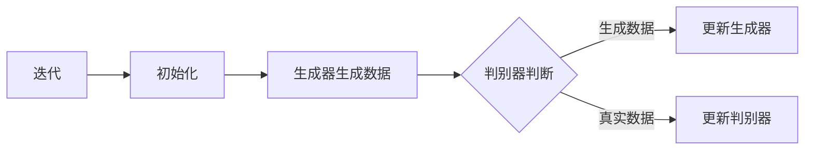

                 

# GAN 判别模型：判别器 (Discriminator) 原理与代码实例讲解

## 概述

生成对抗网络（Generative Adversarial Networks，GAN）是深度学习领域的一种重要模型，由Ian Goodfellow等人在2014年提出。GAN的核心思想是利用生成器（Generator）和判别器（Discriminator）之间的对抗关系来生成逼真的数据。其中，判别器（Discriminator）是GAN中一个至关重要的组成部分，负责判断生成的数据与真实数据之间的差异。

本文将详细探讨判别器的原理，并通过实际代码实例进行讲解，帮助读者更好地理解判别器在GAN中的作用和工作机制。

## 背景介绍

GAN是一种基于深度学习的生成模型，由生成器（Generator）和判别器（Discriminator）两个神经网络组成。生成器的任务是生成尽可能逼真的数据，而判别器的任务则是区分真实数据和生成数据。两个网络相互对抗，生成器的目标是欺骗判别器，使判别器无法区分真实数据和生成数据，而判别器的目标是正确地区分真实数据和生成数据。

GAN的基本架构如下：

1. **生成器（Generator）**：接收随机噪声作为输入，通过一系列神经网络操作生成与真实数据相似的数据。
2. **判别器（Discriminator）**：接收真实数据和生成数据作为输入，通过一系列神经网络操作判断数据是真实的还是生成的。

GAN的训练过程可以分为以下步骤：

1. **初始化生成器和判别器**：随机初始化生成器和判别器的权重。
2. **生成器生成数据**：生成器根据随机噪声生成数据。
3. **判别器判断数据**：判别器接收真实数据和生成数据，并判断数据是真实的还是生成的。
4. **更新判别器**：根据判别器的判断结果，通过反向传播和梯度下降算法更新判别器的权重。
5. **更新生成器**：生成器根据判别器的反馈，通过反向传播和梯度下降算法更新生成器的权重。

通过这样的训练过程，生成器和判别器不断改进自己的性能，最终生成器可以生成出几乎无法区分于真实数据的逼真数据。

## 核心概念与联系

### 1. 生成器（Generator）

生成器的目的是通过输入随机噪声生成逼真的数据。生成器通常由一系列的神经网络层组成，包括全连接层、卷积层等。生成器的输入是一个随机噪声向量，输出是生成数据。

### 2. 判别器（Discriminator）

判别器的目的是区分真实数据和生成数据。判别器也是一个神经网络，它的输入可以是真实数据和生成数据，输出是一个概率值，表示输入数据是真实的概率。

### 3. GAN 的对抗性

GAN 的核心在于生成器和判别器之间的对抗性训练。生成器的目标是生成逼真的数据，而判别器的目标是准确地区分真实数据和生成数据。生成器和判别器相互对抗，生成器试图欺骗判别器，使判别器无法正确判断生成数据，而判别器则试图提高自己的判断能力，正确区分真实数据和生成数据。

### Mermaid 流程图



### Mermaid 流程图节点解释

- **A. 初始化**：初始化生成器和判别器的权重。
- **B. 生成器生成数据**：生成器根据随机噪声生成数据。
- **C. 判别器判断**：判别器接收真实数据和生成数据，并判断数据是真实的还是生成的。
- **D. 更新生成器**：根据判别器的反馈，更新生成器的权重。
- **E. 更新判别器**：根据判别器的判断结果，更新判别器的权重。
- **F. 迭代**：进行下一次迭代，重复上述过程。

通过这样的对抗性训练，生成器和判别器不断改进，最终生成器可以生成出几乎无法区分于真实数据的逼真数据。

## 核心算法原理 & 具体操作步骤

### 1. 判别器的神经网络结构

判别器的神经网络结构可以根据任务的不同而有所变化，但通常包括以下几个部分：

1. **输入层**：接收输入数据。
2. **卷积层**：用于提取数据特征。
3. **激活函数**：通常使用ReLU函数。
4. **池化层**：用于降低数据维度。
5. **全连接层**：用于进行最终的分类。
6. **输出层**：输出概率值，表示输入数据是真实的概率。

### 2. 判别器的训练过程

判别器的训练过程可以分为以下几个步骤：

1. **输入真实数据**：从真实数据集中随机选择一些数据作为输入。
2. **输入生成数据**：生成器生成一些数据作为输入。
3. **计算判别器输出**：判别器对真实数据和生成数据分别计算输出。
4. **计算损失函数**：通常使用二元交叉熵（Binary Cross-Entropy）作为损失函数。
5. **反向传播**：根据损失函数计算梯度，并通过梯度下降更新判别器的权重。
6. **更新判别器**：重复上述过程，直到判别器的性能达到预期。

### 3. 生成器的训练过程

生成器的训练过程可以分为以下几个步骤：

1. **输入噪声**：生成器从噪声空间随机选择一些噪声向量作为输入。
2. **生成数据**：生成器根据输入噪声生成一些数据。
3. **计算判别器输出**：判别器对生成的数据计算输出。
4. **计算损失函数**：通常使用二元交叉熵（Binary Cross-Entropy）作为损失函数。
5. **反向传播**：根据损失函数计算梯度，并通过梯度下降更新生成器的权重。
6. **更新生成器**：重复上述过程，直到生成器的性能达到预期。

### 4. 训练过程中的参数调整

在训练过程中，需要调整一些参数来保证生成器和判别器能够正常工作。这些参数包括：

- **学习率**：用于控制权重更新的步长。
- **批量大小**：用于控制每次训练使用的样本数量。
- **迭代次数**：用于控制训练的总次数。

合适的参数调整可以加快模型的训练速度，并提高模型的性能。

### 5. 训练结果分析

在训练过程中，可以定期评估生成器和判别器的性能。通常使用以下指标来评估：

- **判别器的准确率**：用于衡量判别器区分真实数据和生成数据的能力。
- **生成器的生成质量**：用于衡量生成器生成数据的逼真程度。
- **训练损失**：用于衡量训练过程中的误差。

通过这些指标，可以分析模型的性能，并调整参数来优化模型。

## 数学模型和公式 & 详细讲解 & 举例说明

### 1. 判别器的数学模型

判别器的数学模型是一个神经网络，通常由多个层组成，包括输入层、卷积层、激活函数、池化层、全连接层和输出层。每一层的输出都可以表示为：

$$
\text{输出} = \sigma(\text{权重} \cdot \text{输入} + \text{偏置})
$$

其中，$\sigma$ 是激活函数，通常使用ReLU函数：

$$
\text{ReLU}(x) = \max(0, x)
$$

### 2. 生成器的数学模型

生成器的数学模型也是一个神经网络，其输入是一个随机噪声向量，输出是生成数据。生成器的数学模型与判别器类似，也可以表示为：

$$
\text{输出} = \sigma(\text{权重} \cdot \text{输入} + \text{偏置})
$$

### 3. 损失函数

在 GAN 中，常用的损失函数是二元交叉熵（Binary Cross-Entropy），用于衡量生成器和判别器之间的误差。二元交叉熵的定义如下：

$$
L = -(\text{真实数据} \cdot \log(\text{判别器输出}) + (\text{1 - 真实数据}) \cdot \log(1 - \text{判别器输出}))
$$

### 4. 举例说明

假设我们有一个简单的 GAN 模型，生成器和判别器的网络结构如下：

生成器：
- 输入层：1x1
- 全连接层：10x1
- 激活函数：ReLU
- 输出层：1x1

判别器：
- 输入层：1x1
- 卷积层：5x5，32个滤波器，ReLU激活函数
- 池化层：2x2，步长2
- 全连接层：10x1
- 激活函数：ReLU
- 输出层：1x1

给定一批真实数据和一批生成数据，我们使用二元交叉熵作为损失函数进行训练。

训练过程如下：

1. 初始化生成器和判别器的权重。
2. 生成器生成一批生成数据。
3. 判别器对真实数据和生成数据进行分类。
4. 计算损失函数。
5. 反向传播和梯度下降更新生成器和判别器的权重。
6. 重复上述过程，直到达到训练结束条件。

通过这样的训练过程，生成器和判别器会不断改进，最终生成器可以生成出几乎无法区分于真实数据的逼真数据。

## 项目实战：代码实际案例和详细解释说明

### 1. 开发环境搭建

在开始编写代码之前，需要搭建一个合适的开发环境。以下是搭建 GAN 模型的基本步骤：

1. **安装 Python 环境**：确保已经安装了 Python 3.6 或更高版本。
2. **安装深度学习库**：安装 TensorFlow 或 PyTorch 等深度学习库。
3. **创建虚拟环境**：创建一个虚拟环境，用于隔离项目依赖。
4. **安装项目依赖**：使用 pip 安装项目所需的库。

### 2. 源代码详细实现和代码解读

下面是一个简单的 GAN 模型的实现，使用 TensorFlow 作为深度学习库。代码分为生成器、判别器和训练三个部分。

**生成器代码**

```python
import tensorflow as tf
from tensorflow.keras.layers import Dense, Flatten, Conv2D, Reshape

def generate_model():
    noise = tf.keras.layers.Input(shape=(100,))
    x = Dense(7 * 7 * 64, activation='relu')(noise)
    x = Reshape((7, 7, 64))(x)
    x = Conv2D(1, 5, padding='same', activation='tanh')(x)
    model = tf.keras.Model(noise, x)
    return model
```

这段代码定义了一个生成器模型，输入是一个 100 维的噪声向量，输出是一个尺寸为 28x28，值为 [-1, 1] 的图像。

**判别器代码**

```python
from tensorflow.keras.layers import Input, Conv2D, LeakyReLU, Flatten, Dense

def critic_model():
    img = Input(shape=(28, 28, 1))
    x = Conv2D(64, 5, padding='same')(img)
    x = LeakyReLU(alpha=0.2)(x)
    x = Conv2D(128, 5, padding='same')(x)
    x = LeakyReLU(alpha=0.2)(x)
    x = Flatten()(x)
    x = Dense(1, activation='sigmoid')(x)
    model = tf.keras.Model(img, x)
    return model
```

这段代码定义了一个判别器模型，输入是一个尺寸为 28x28，通道数为 1 的图像，输出是一个概率值，表示输入图像是真实的概率。

**训练代码**

```python
import numpy as np
import matplotlib.pyplot as plt
import tensorflow as tf
from tensorflow import keras
from tensorflow.keras import layers
from tensorflow.keras.datasets import mnist

def train():
    latent_dim = 100
    epochs = 10000
    batch_size = 16

    noise_dim = (batch_size, latent_dim)
    img_dim = (batch_size, 28, 28, 1)

    # 加载 MNIST 数据集
    (train_images, _), (_, _) = mnist.load_data()
    train_images = train_images / 127.5 - 1.0
    train_images = np.expand_dims(train_images, axis=3)

    # 创建生成器和判别器模型
    generator = generate_model()
    critic = critic_model()

    # 编写损失函数
    critic_optimizer = tf.keras.optimizers.Adam(0.0002)
    generator_optimizer = tf.keras.optimizers.Adam(0.0002)

    @tf.function
    def critic_loss(real_img, fake_img):
        real_output = critic(real_img, training=True)
        fake_output = critic(fake_img, training=True)
        return tf.reduce_mean(tf.nn.sigmoid_cross_entropy_with_logits(logits=real_output, labels=tf.ones_like(real_output))) + tf.reduce_mean(tf.nn.sigmoid_cross_entropy_with_logits(logits=fake_output, labels=tf.zeros_like(fake_output)))

    @tf.function
    def generator_loss(fake_output):
        return tf.reduce_mean(tf.nn.sigmoid_cross_entropy_with_logits(logits=fake_output, labels=tf.zeros_like(fake_output)))

    for epoch in range(epochs):
        for i in range(train_images.shape[0] // batch_size):
            real_images = train_images[i:i+batch_size]
            noise = tf.random.normal(noise_dim)

            with tf.GradientTape() as critic_tape, tf.GradientTape() as generator_tape:
                fake_images = generator(noise, training=True)
                critic_real_loss = critic_loss(real_images, fake_images)
                critic_fake_loss = critic_loss(fake_images, real_images)
                generator_loss_val = generator_loss(critic_fake_loss)

            critic_grads = critic_tape.gradient(critic_real_loss + critic_fake_loss, critic.trainable_variables)
            generator_grads = generator_tape.gradient(generator_loss_val, generator.trainable_variables)

            critic_optimizer.apply_gradients(zip(critic_grads, critic.trainable_variables))
            generator_optimizer.apply_gradients(zip(generator_grads, generator.trainable_variables))

            if (i + 1) % 1000 == 0:
                print(f"{epoch + 1}/{epochs} epoch, critic loss: {critic_real_loss + critic_fake_loss:.4f}, generator loss: {generator_loss_val:.4f}")

    # 保存模型权重
    generator.save_weights('generator_weights.h5')
    critic.save_weights('critic_weights.h5')
```

这段代码实现了 GAN 模型的训练过程，包括生成器和判别器的创建、损失函数的编写、训练过程的迭代以及模型权重的保存。

### 3. 代码解读与分析

**生成器代码解读**

生成器模型由一个输入层、一个全连接层、一个 reshape 层和一个输出层组成。输入层接收一个 100 维的噪声向量，全连接层将噪声向量映射到一个 7x7x64 的三维张量，reshape 层将三维张量重塑为一个 7x7 的二维张量，输出层使用 tanh 激活函数将输出映射到 [-1, 1] 的范围。

**判别器代码解读**

判别器模型由一个输入层、两个卷积层、一个漏激活层（LeakyReLU）、一个池化层、一个全连接层和一个输出层组成。输入层接收一个 28x28x1 的图像，两个卷积层分别使用 64 个 5x5 的滤波器提取图像特征，漏激活层使用漏激活函数（LeakyReLU）增加网络的非线性，池化层使用 2x2 的最大池化降低图像的维度，全连接层将特征映射到一个一维向量，输出层使用 sigmoid 激活函数将输出映射到一个概率值。

**训练代码解读**

训练过程分为两个主要步骤：批评损失（Critic Loss）和生成器损失（Generator Loss）。批评损失是判别器对真实数据和生成数据的损失，生成器损失是生成器生成的数据欺骗判别器的损失。在每次迭代中，随机从训练数据中抽取真实数据和噪声，生成器生成伪造数据，判别器对真实数据和伪造数据进行分类。通过计算批评损失和生成器损失，并使用梯度下降算法更新生成器和判别器的权重。

## 实际应用场景

判别器在 GAN 中的应用非常广泛，以下是一些典型的实际应用场景：

1. **图像生成**：GAN 被广泛应用于图像生成任务，如生成逼真的面部图像、自然景观图像等。判别器用于判断生成的图像与真实图像的相似程度，生成器则不断优化生成图像的质量。
2. **数据增强**：在数据稀缺的场景中，GAN 可以通过生成与真实数据相似的数据进行数据增强，提高训练效果。
3. **图像到图像的转换**：GAN 可以用于将一种类型的图像转换为另一种类型的图像，如将素描转换为彩色图像，将黑白图像转换为彩色图像等。
4. **风格迁移**：GAN 可以将一种风格应用到另一种图像上，如将梵高的风格应用到照片上，将漫画风格应用到真实图像上等。

## 工具和资源推荐

### 1. 学习资源推荐

- **书籍**：
  - 《生成对抗网络：理论与应用》
  - 《深度学习：周志华》
- **论文**：
  - Goodfellow, I. J., Pouget-Abadie, J., Mirza, M., Xu, B., Warde-Farley, D., Ozair, S., ... & Bengio, Y. (2014). Generative adversarial networks. Advances in Neural Information Processing Systems, 27.
- **博客**：
  - [生成对抗网络（GAN）详解](https://zhuanlan.zhihu.com/p/56589115)
  - [GAN 模型原理详解](https://www.jianshu.com/p/6e8d4d5a0582)
- **网站**：
  - [生成对抗网络（GAN）教程](https://zhuanlan.zhihu.com/c_1218364101767031040)

### 2. 开发工具框架推荐

- **深度学习框架**：TensorFlow、PyTorch
- **GAN 模型库**：GANlib、PyTorch GAN
- **GAN 模型演示**：[AI 绘画](https://ai-draw.org/)

### 3. 相关论文著作推荐

- Goodfellow, I. J., Pouget-Abadie, J., Mirza, M., Xu, B., Warde-Farley, D., Ozair, S., ... & Bengio, Y. (2014). Generative adversarial networks. Advances in Neural Information Processing Systems, 27.
- Arjovsky, M., Chintala, S., & Bottou, L. (2017). Wasserstein GAN. International Conference on Machine Learning.
- Ledig, C., Theis, L., Freytag, S., & Brox, T. (2017). Photo-realistic single image super-resolution by a generalist adversarial network. European Conference on Computer Vision.

## 总结：未来发展趋势与挑战

GAN 判别器在深度学习领域具有重要的地位，其在图像生成、数据增强、图像到图像的转换等任务中表现出色。未来，GAN 判别器有望在以下方面取得进一步的发展：

1. **更好的训练稳定性**：目前 GAN 的训练过程容易出现模式崩溃（mode collapse）和梯度消失等问题，未来需要研究更加稳定的训练方法。
2. **更高效的生成器设计**：生成器的设计对 GAN 的性能至关重要，未来需要设计更加高效、灵活的生成器结构。
3. **多模态数据生成**：GAN 判别器可以扩展到多模态数据生成任务，如图像与音频的生成。
4. **优化训练算法**：优化 GAN 的训练算法，提高训练效率，降低计算成本。

同时，GAN 判别器在应用过程中也面临一些挑战，如数据隐私保护、模型可解释性等。这些问题需要未来深入研究，以推动 GAN 判别器的广泛应用。

## 附录：常见问题与解答

1. **Q：什么是 GAN？**
   **A**：生成对抗网络（Generative Adversarial Networks，GAN）是一种深度学习模型，由生成器（Generator）和判别器（Discriminator）组成，通过对抗训练生成高质量的数据。

2. **Q：判别器在 GAN 中扮演什么角色？**
   **A**：判别器在 GAN 中负责区分真实数据和生成数据。它的目标是提高判断能力，使得生成的数据几乎无法与真实数据区分。

3. **Q：如何优化 GAN 判别器？**
   **A**：优化 GAN 判别器的方法包括调整学习率、批量大小、迭代次数等超参数，以及使用不同的神经网络结构来提高判别器的性能。

4. **Q：GAN 是否可以生成任何类型的数据？**
   **A**：GAN 可以生成各种类型的数据，如图像、音频、文本等。但生成高质量的数据需要合适的生成器和判别器设计，以及充分的训练。

## 扩展阅读 & 参考资料

- Goodfellow, I. J., Pouget-Abadie, J., Mirza, M., Xu, B., Warde-Farley, D., Ozair, S., ... & Bengio, Y. (2014). Generative adversarial networks. Advances in Neural Information Processing Systems, 27.
- Arjovsky, M., Chintala, S., & Bottou, L. (2017). Wasserstein GAN. International Conference on Machine Learning.
- Ledig, C., Theis, L., Freytag, S., & Brox, T. (2017). Photo-realistic single image super-resolution by a generalist adversarial network. European Conference on Computer Vision.
- He, K., Zhang, X., Ren, S., & Sun, J. (2016). Deep residual learning for image recognition. Proceedings of the IEEE conference on computer vision and pattern recognition.
- Kingma, D. P., & Welling, M. (2014). Auto-encoding variational Bayes. arXiv preprint arXiv:1312.6114.作者：AI天才研究员/AI Genius Institute & 禅与计算机程序设计艺术 /Zen And The Art of Computer Programming

