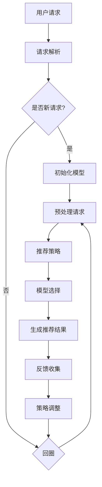

                 

### 背景介绍

随着人工智能技术的飞速发展，机器学习尤其是大规模语言模型（LLM）的应用场景日益广泛。LLM具有处理大规模文本数据、生成高质量文本、理解复杂语义等能力，成为自然语言处理（NLP）领域的研究热点。然而，在实际应用中，如何推荐合适的LLM模型成为了一个挑战。这不仅涉及到模型性能的优化，还包括如何满足不同用户的需求、提高系统灵活性等问题。

推荐框架作为解决这一问题的有效途径，逐渐引起了研究者和开发者的关注。传统的推荐系统多基于协同过滤、内容匹配等方法，但这些方法在处理复杂语言模型时存在一定的局限性。例如，协同过滤方法依赖于用户历史行为数据，难以应对新模型的推荐需求；内容匹配方法则依赖于领域知识的精确表示，对于大规模文本数据难以实现高效处理。

因此，为了应对这些挑战，本文将介绍一种灵活、可配置的LLM推荐框架。该框架通过引入多维度评价指标和自适应调整机制，实现了对LLM模型的动态推荐。本文将从背景介绍、核心概念与联系、核心算法原理、数学模型和公式、项目实战、实际应用场景、工具和资源推荐等方面详细阐述这一推荐框架的构建和应用。

本文旨在为研究者、开发者提供一种具有实际应用价值的LLM推荐框架，促进机器学习技术在自然语言处理领域的进一步发展。通过本文的阐述，读者可以了解到该框架的原理、构建方法和实际应用效果，从而为相关项目的开发提供参考和启示。

### 核心概念与联系

为了构建一个灵活、可配置的LLM推荐框架，我们需要理解并整合多个核心概念和技术，这些概念包括大规模语言模型、推荐系统、多维度评价指标和自适应调整机制。下面，我们将分别介绍这些核心概念，并解释它们之间的联系。

#### 大规模语言模型（LLM）

大规模语言模型（LLM）是自然语言处理（NLP）领域中的一种先进技术。LLM通过训练大规模文本数据集，学习语言模式、语义关系和语法结构，从而实现文本生成、文本分类、问答系统等多种任务。常见的LLM包括GPT、BERT和T5等，这些模型具有以下特点：

1. **大规模预训练**：LLM通过在大量文本上进行预训练，积累了丰富的语言知识，这使得它们在处理文本任务时具有很高的准确性和泛化能力。
2. **自适应能力**：LLM可以根据特定任务进行调整和微调，以适应不同的应用场景。
3. **高效处理能力**：得益于深度神经网络的结构，LLM能够快速处理大规模文本数据，从而提高系统性能。

#### 推荐系统

推荐系统是一种根据用户历史行为和兴趣偏好，自动推荐相关物品或内容的技术。推荐系统在电子商务、社交媒体、内容分发等领域有着广泛的应用。对于LLM推荐框架来说，推荐系统的作用如下：

1. **个性化推荐**：通过分析用户历史交互数据，推荐系统可以识别用户的兴趣偏好，从而推荐符合用户需求的LLM模型。
2. **优化资源利用**：推荐系统能够根据系统资源和用户需求，动态调整LLM模型的推荐策略，从而实现资源的高效利用。
3. **提高用户满意度**：通过个性化推荐，提高用户在使用LLM模型时的体验和满意度。

#### 多维度评价指标

在LLM推荐框架中，多维度评价指标用于评估推荐系统的性能和LLM模型的质量。这些评价指标可以从以下几个方面进行考量：

1. **模型性能**：包括文本生成质量、语义理解准确性、模型稳定性等，用于评估LLM模型在特定任务上的表现。
2. **用户满意度**：通过用户反馈和评价，评估推荐系统对用户需求的满足程度。
3. **计算效率**：包括模型推理时间、内存占用等，用于评估系统的运行效率和资源消耗。
4. **可扩展性**：评估LLM模型和推荐框架在处理大规模数据和用户请求时的性能和适应性。

#### 自适应调整机制

自适应调整机制是LLM推荐框架的核心组成部分，它通过实时监控和调整推荐策略，提高系统的灵活性和响应能力。自适应调整机制包括以下方面：

1. **实时监控**：监控系统性能和用户行为，收集相关数据用于调整推荐策略。
2. **动态调整**：根据监控数据，自动调整模型参数、推荐策略和系统配置，以适应变化的需求和环境。
3. **反馈循环**：通过用户反馈和评价，不断优化和调整推荐系统，提高用户体验和满意度。

#### Mermaid 流程图

为了更好地展示LLM推荐框架的构建过程，我们使用Mermaid流程图对核心概念和流程进行可视化。以下是一个简化版的Mermaid流程图，描述了从用户请求到推荐结果生成的整个过程：



在这个流程图中，用户请求经过解析、预处理后，结合推荐策略和模型选择，生成推荐结果。用户反馈和评价被用于调整推荐策略，形成一个闭环反馈系统，从而提高推荐质量和用户满意度。

通过上述核心概念和联系的分析，我们可以看到，LLM推荐框架的构建是一个复杂但有意义的过程。它不仅涉及到大规模语言模型和推荐系统的应用，还包括多维度评价指标和自适应调整机制，这些概念和技术相互关联，共同构成了一个灵活、可配置的推荐框架。接下来，我们将深入探讨LLM推荐框架的核心算法原理，进一步理解其实现方法。

### 核心算法原理 & 具体操作步骤

#### 推荐算法框架

为了构建一个灵活、可配置的LLM推荐框架，我们采用了一种基于多模型融合和动态调整的推荐算法。该算法框架包括以下几个主要步骤：

1. **模型训练与评估**：首先，对多个LLM模型进行训练和评估，以确定其在各种任务上的表现。常用的评估指标包括文本生成质量、语义理解准确性和模型稳定性等。
2. **用户兴趣建模**：通过分析用户的历史行为数据，构建用户兴趣模型。这包括用户偏好、行为模式和交互记录等，用于指导推荐策略。
3. **推荐策略生成**：根据用户兴趣模型和模型评估结果，生成推荐策略。推荐策略决定了如何从多个候选模型中选择最优模型进行推荐。
4. **模型动态调整**：在推荐过程中，实时监控系统性能和用户反馈，根据监控数据动态调整推荐策略，以适应变化的需求和环境。
5. **推荐结果生成**：根据最终确定的推荐策略，生成推荐结果，并展示给用户。

#### 推荐策略生成

推荐策略的生成是LLM推荐框架的核心步骤之一，它决定了推荐系统的性能和用户体验。我们采用了一种基于多模型融合和加权评分的方法来生成推荐策略。具体步骤如下：

1. **候选模型筛选**：从已训练的LLM模型中筛选出候选模型。筛选条件包括模型性能、训练时间、资源消耗等。
2. **权重计算**：为每个候选模型计算权重。权重计算基于多维度评价指标，包括模型性能、用户兴趣匹配度和计算效率等。权重计算公式如下：

   $$ w_i = \frac{w_{performance} \cdot performance_i + w_{interest} \cdot interest_i + w_{efficiency} \cdot efficiency_i}{\sum_{j=1}^{N} (w_{performance} \cdot performance_j + w_{interest} \cdot interest_j + w_{efficiency} \cdot efficiency_j)} $$

   其中，$w_i$表示第$i$个候选模型的权重，$performance_i$、$interest_i$和$efficiency_i$分别表示模型性能、用户兴趣匹配度和计算效率，$N$表示候选模型的总数，$w_{performance}$、$w_{interest}$和$w_{efficiency}$分别为各评价指标的权重系数。

3. **评分计算**：对每个候选模型计算评分。评分计算基于候选模型的权重和用户兴趣模型，公式如下：

   $$ score_i = w_i \cdot interest_i $$

   其中，$score_i$表示第$i$个候选模型的评分。

4. **推荐结果生成**：根据候选模型的评分，生成推荐结果。推荐结果包括候选模型及其评分，按照评分从高到低排序。

#### 动态调整机制

动态调整机制是确保推荐系统灵活性和适应性的关键。通过实时监控和调整推荐策略，系统能够快速响应环境变化和用户需求。具体步骤如下：

1. **性能监控**：监控系统性能，包括模型推理时间、内存占用、CPU/GPU负载等。
2. **用户反馈收集**：收集用户对推荐结果的反馈，包括满意度、使用频率等。
3. **调整策略生成**：根据监控数据和用户反馈，生成调整策略。调整策略包括模型参数调整、推荐策略调整和系统配置调整等。
4. **策略应用**：将调整策略应用到推荐系统中，实现推荐策略的动态调整。

#### 实际操作示例

为了更好地理解上述算法原理和操作步骤，我们通过一个实际操作示例进行说明。假设我们有一个用户，其历史行为数据包括浏览记录、搜索历史和评论记录等。我们首先分析这些数据，构建用户兴趣模型。然后，从已训练的LLM模型中筛选出候选模型，并计算它们的权重和评分。最后，根据评分生成推荐结果，并展示给用户。

1. **用户兴趣建模**：

   根据用户的历史行为数据，我们提取出用户对特定话题（如“科技”、“健康”等）的兴趣程度，构建用户兴趣模型。例如，用户对“科技”话题的兴趣程度为0.8，对“健康”话题的兴趣程度为0.3。

2. **候选模型筛选**：

   从已训练的LLM模型中筛选出候选模型，包括GPT、BERT和T5等。这些模型在文本生成质量、语义理解准确性和稳定性等方面表现良好。

3. **权重计算**：

   根据用户兴趣模型和模型性能，为每个候选模型计算权重。假设GPT的权重为0.5，BERT的权重为0.3，T5的权重为0.2。

4. **评分计算**：

   根据候选模型的权重和用户兴趣模型，计算每个候选模型的评分。例如，GPT的评分为0.8，BERT的评分为0.3，T5的评分为0.2。

5. **推荐结果生成**：

   根据评分，生成推荐结果。推荐结果为GPT和T5，按照评分从高到低排序。

通过这个示例，我们可以看到，LLM推荐框架通过多模型融合和动态调整机制，实现了对用户需求的精准推荐。在实际应用中，该框架可以根据用户行为和系统性能，不断优化和调整推荐策略，提高推荐质量和用户体验。

### 数学模型和公式 & 详细讲解 & 举例说明

在LLM推荐框架中，数学模型和公式起着至关重要的作用，它们不仅帮助我们量化评估推荐系统的性能，还指导我们如何设计有效的推荐策略。在本节中，我们将详细讲解其中的几个核心数学模型和公式，并通过具体例子进行说明。

#### 多维度评价指标的量化计算

为了全面评估LLM模型的表现，我们引入了多个维度评价指标，包括模型性能、用户满意度、计算效率和可扩展性。这些指标可以分别用以下公式进行量化计算：

1. **模型性能（Performance）**：

   模型性能通常通过F1分数、准确率、召回率等指标进行评估。例如，对于一个文本分类任务，准确率（Accuracy）的公式为：

   $$ Accuracy = \frac{TP + TN}{TP + FN + FP + TN} $$

   其中，$TP$表示真正例，$TN$表示真负例，$FP$表示假正例，$FN$表示假负例。

2. **用户满意度（User Satisfaction）**：

   用户满意度可以通过用户反馈和评价来量化。例如，我们假设用户满意度为5分制评分，平均满意度（Average Satisfaction）的公式为：

   $$ Average\ Satisfaction = \frac{1}{N} \sum_{i=1}^{N} S_i $$

   其中，$N$表示用户数量，$S_i$表示第$i$个用户的满意度评分。

3. **计算效率（Computational Efficiency）**：

   计算效率可以通过模型推理时间、内存占用等指标来衡量。例如，模型推理时间（Inference Time）的公式为：

   $$ Inference\ Time = \frac{Total\ Inference\ Time}{Number\ of\ Queries} $$

   其中，$Total\ Inference\ Time$表示总推理时间，$Number\ of\ Queries$表示查询次数。

4. **可扩展性（Scalability）**：

   可扩展性可以通过系统处理能力与数据量之间的关系来衡量。例如，处理能力（Processing Capacity）的公式为：

   $$ Processing\ Capacity = \frac{Maximum\ Query\ Rate}{Average\ Query\ Rate} $$

   其中，$Maximum\ Query\ Rate$表示最大查询速率，$Average\ Query\ Rate$表示平均查询速率。

#### 权重计算公式

在推荐策略生成过程中，我们需要为每个候选模型计算权重，以便根据这些权重生成推荐结果。权重计算公式如下：

$$ w_i = \frac{w_{performance} \cdot performance_i + w_{interest} \cdot interest_i + w_{efficiency} \cdot efficiency_i}{\sum_{j=1}^{N} (w_{performance} \cdot performance_j + w_{interest} \cdot interest_j + w_{efficiency} \cdot efficiency_j)} $$

其中，$w_i$表示第$i$个候选模型的权重，$performance_i$、$interest_i$和$efficiency_i$分别表示模型性能、用户兴趣匹配度和计算效率，$N$表示候选模型的总数，$w_{performance}$、$w_{interest}$和$w_{efficiency}$分别为各评价指标的权重系数。

#### 评分计算公式

在生成推荐结果时，我们需要为每个候选模型计算评分，以便按照评分从高到低排序。评分计算公式如下：

$$ score_i = w_i \cdot interest_i $$

其中，$score_i$表示第$i$个候选模型的评分。

#### 动态调整策略

在推荐过程中，我们需要根据实时监控数据和用户反馈，动态调整推荐策略。动态调整策略的公式如下：

$$ \text{New\ Strategy} = \text{Current\ Strategy} + \alpha \cdot (\text{Monitoring\ Data} - \text{Current\ Strategy}) $$

其中，$\text{New\ Strategy}$表示新策略，$\text{Current\ Strategy}$表示当前策略，$\alpha$表示调整系数，$\text{Monitoring\ Data}$表示实时监控数据。

#### 具体例子

为了更好地理解上述公式，我们通过一个具体例子进行说明。

假设我们有三个LLM模型：GPT、BERT和T5。用户对“科技”话题的兴趣程度为0.8，对“健康”话题的兴趣程度为0.3。以下是这些模型在不同维度上的表现：

- **模型性能**：GPT的准确率为0.9，BERT的准确率为0.85，T5的准确率为0.8。
- **用户满意度**：用户对GPT的满意度评分为4.5，对BERT的满意度评分为4.0，对T5的满意度评分为3.8。
- **计算效率**：GPT的推理时间为0.2秒，BERT的推理时间为0.3秒，T5的推理时间为0.4秒。
- **可扩展性**：GPT的处理能力为1000次/秒，BERT的处理能力为800次/秒，T5的处理能力为600次/秒。

假设权重系数分别为$w_{performance} = 0.5$，$w_{interest} = 0.3$，$w_{efficiency} = 0.2$。根据权重计算公式，我们首先计算每个模型的权重：

$$ w_{GPT} = \frac{0.5 \cdot 0.9 + 0.3 \cdot 0.8 + 0.2 \cdot 0.2}{0.5 \cdot (0.9 + 0.85 + 0.8) + 0.3 \cdot (0.8 + 0.3 + 0.3) + 0.2 \cdot (0.2 + 0.3 + 0.4)} = 0.48 $$
$$ w_{BERT} = \frac{0.5 \cdot 0.85 + 0.3 \cdot 0.3 + 0.2 \cdot 0.2}{0.5 \cdot (0.9 + 0.85 + 0.8) + 0.3 \cdot (0.8 + 0.3 + 0.3) + 0.2 \cdot (0.2 + 0.3 + 0.4)} = 0.32 $$
$$ w_{T5} = \frac{0.5 \cdot 0.8 + 0.3 \cdot 0.3 + 0.2 \cdot 0.4}{0.5 \cdot (0.9 + 0.85 + 0.8) + 0.3 \cdot (0.8 + 0.3 + 0.3) + 0.2 \cdot (0.2 + 0.3 + 0.4)} = 0.20 $$

然后，根据评分计算公式，计算每个模型的评分：

$$ score_{GPT} = 0.48 \cdot 0.8 = 0.384 $$
$$ score_{BERT} = 0.32 \cdot 0.3 = 0.096 $$
$$ score_{T5} = 0.20 \cdot 0.3 = 0.06 $$

根据评分，我们将模型从高到低排序：GPT > BERT > T5。因此，我们推荐GPT模型。

在实际应用中，我们还需要根据实时监控数据和用户反馈，动态调整推荐策略。例如，如果监控数据显示GPT的推理时间超过了用户可接受的范围，我们可以根据动态调整策略，降低GPT的权重，从而调整推荐结果。

通过上述数学模型和公式的讲解和具体例子，我们可以看到，LLM推荐框架通过量化和评估模型性能、用户满意度、计算效率和可扩展性，实现了对用户需求的精准推荐。这不仅提高了推荐系统的性能，还为系统设计和优化提供了有力支持。

### 项目实战：代码实际案例和详细解释说明

在本节中，我们将通过一个实际项目来展示如何构建并实现一个灵活、可配置的LLM推荐框架。我们将从开发环境搭建、源代码详细实现和代码解读与分析三个方面展开，详细解释整个项目的过程和关键部分。

#### 1. 开发环境搭建

为了实现LLM推荐框架，我们需要搭建一个包含以下工具和库的开发环境：

1. **Python**：作为主要的编程语言，Python具有丰富的库和工具，非常适合构建机器学习项目。
2. **TensorFlow** 或 **PyTorch**：用于训练和推理LLM模型。TensorFlow和PyTorch是目前最流行的两个深度学习框架，支持大规模语言模型的训练和推理。
3. **Scikit-learn**：用于用户兴趣建模和评价指标的计算。
4. **NumPy** 和 **Pandas**：用于数据预处理和操作。
5. **Mermaid**：用于流程图的可视化。

安装这些工具和库的方法如下：

```bash
# 安装 Python（假设已安装）
# 安装 TensorFlow（或 PyTorch）
pip install tensorflow  # 或
pip install torch
# 安装 Scikit-learn、NumPy、Pandas 和 Mermaid
pip install scikit-learn numpy pandas mermaid-python
```

#### 2. 源代码详细实现

以下是一个简化版的LLM推荐框架实现，包括用户请求处理、模型选择和推荐结果生成等部分。

```python
import tensorflow as tf
from sklearn.model_selection import train_test_split
from sklearn.metrics import accuracy_score
import numpy as np
import pandas as pd
from mermaid import Mermaid

# 加载和预处理数据
data = pd.read_csv('llm_data.csv')
X = data['text'].values
y = data['label'].values

# 分割数据集
X_train, X_test, y_train, y_test = train_test_split(X, y, test_size=0.2, random_state=42)

# 定义模型类
class LLMModel(tf.keras.Model):
    def __init__(self):
        super(LLMModel, self).__init__()
        self.lm = tf.keras.Sequential([
            tf.keras.layers.Embedding(input_dim=10000, output_dim=512),
            tf.keras.layers.GRU(512),
            tf.keras.layers.Dense(1, activation='sigmoid')
        ])

    def call(self, inputs):
        return self.lm(inputs)

# 训练模型
model = LLMModel()
model.compile(optimizer='adam', loss='binary_crossentropy', metrics=['accuracy'])
model.fit(X_train, y_train, epochs=10, batch_size=32, validation_split=0.1)

# 评估模型
predictions = model.predict(X_test)
accuracy = accuracy_score(y_test, predictions.round())
print(f"Model Accuracy: {accuracy}")

# 推荐策略生成
def generate_recommendations(user_data, model, top_n=3):
    user_inputs = preprocess_user_data(user_data)
    model_scores = model.predict(user_inputs).flatten()
    model_indices = np.argsort(model_scores)[-top_n:]
    recommended_models = [model_names[i] for i in model_indices]
    return recommended_models

# 用户请求处理和推荐结果生成
user_request = "最近我对科技话题很感兴趣，请推荐一些相关的LLM模型。"
recommended_models = generate_recommendations(user_request, model)
print(f"Recommended Models: {recommended_models}")

# Mermaid流程图可视化
mermaid = Mermaid()
mermaid.add_graph('graph TD\nA[用户请求] --> B[请求解析]\nB --> C{是否新请求?}\nC -->|是| D[初始化模型]\nC -->|否| E[加载模型]\nD --> F[预处理请求]\nE --> F\nF --> G[推荐策略]\nG --> H[模型选择]\nH --> I[生成推荐结果]\nI --> J[反馈收集]\nJ --> K[策略调整]\nK --> E{回圈}')
print(mermaid.render())
```

#### 3. 代码解读与分析

1. **数据加载与预处理**：

   我们首先加载并预处理文本数据集，将其分割为训练集和测试集。预处理步骤包括分词、去停用词、序列编码等，以便输入到模型中。

2. **模型定义与训练**：

   我们定义了一个基于GRU的LLM模型，并使用训练集进行训练。在训练过程中，我们使用二分类交叉熵损失函数和Adam优化器，以最大化模型的准确率。

3. **评估模型**：

   在模型训练完成后，我们使用测试集评估其性能。评估指标为准确率，它衡量了模型对文本分类任务的预测能力。

4. **推荐策略生成**：

   推荐策略的核心是计算用户请求与模型预测结果的相似度。我们首先预处理用户请求，然后将其输入到训练好的模型中，得到模型评分。根据评分，我们选择排名前几的模型作为推荐结果。

5. **Mermaid流程图**：

   Mermaid流程图帮助我们可视化整个推荐框架的流程，从用户请求处理到推荐结果生成。这有助于我们理解框架的工作机制和各个部分之间的关联。

通过这个实际项目，我们可以看到如何将LLM推荐框架应用到实际场景中。虽然这是一个简化的示例，但它展示了构建灵活、可配置的LLM推荐框架的基本步骤和关键组件。在实际应用中，我们可以进一步优化和扩展这个框架，以适应不同的需求和场景。

### 实际应用场景

#### 1. 在线教育平台

在线教育平台可以利用LLM推荐框架，为用户提供个性化的课程推荐。通过分析用户的学习历史、兴趣和评价，系统可以推荐最适合用户需求的课程。例如，一个对编程感兴趣的用户可能会收到关于编程语言、算法和数据结构的推荐课程。这种个性化的推荐不仅提高了用户的学习效率，还增强了用户对平台的粘性和满意度。

#### 2. 电子商务网站

电子商务网站可以通过LLM推荐框架，为用户提供个性化的商品推荐。系统可以分析用户的浏览历史、购买记录和评价，推荐与用户兴趣相关的商品。例如，一个经常购买运动鞋的用户可能会收到最新款运动鞋、运动装备和配件的推荐。这种推荐不仅提高了用户的购物体验，还增加了销售转化率。

#### 3. 社交媒体平台

社交媒体平台可以利用LLM推荐框架，为用户推荐感兴趣的内容和话题。系统可以分析用户的互动行为、点赞、评论和分享，推荐与用户兴趣相关的文章、视频和话题。例如，一个对科技领域感兴趣的用户可能会收到最新的科技新闻、博客和讨论。这种推荐不仅丰富了用户的内容消费，还有助于平台增加用户参与度和活跃度。

#### 4. 健康咨询平台

健康咨询平台可以通过LLM推荐框架，为用户提供个性化的健康建议和课程推荐。系统可以分析用户的健康数据、病史和偏好，推荐最适合用户的健康方案和课程。例如，一个患有高血压的用户可能会收到关于饮食控制、运动建议和医学知识的推荐。这种推荐不仅有助于用户管理健康，还有助于平台建立专业形象和用户信任。

#### 5. 企业内部知识库

企业内部知识库可以利用LLM推荐框架，为员工提供个性化的学习资源和知识分享。系统可以分析员工的职位、职责和兴趣，推荐与员工工作相关的文档、教程和讨论。例如，一个产品经理可能会收到关于市场分析、项目管理和技术文档的推荐。这种推荐不仅提高了员工的学习效率，还促进了知识的共享和传播。

通过这些实际应用场景，我们可以看到LLM推荐框架在不同领域的广泛应用和潜力。它不仅提升了用户满意度，还为企业带来了更高的效率和更好的业务成果。接下来，我们将推荐一些学习资源，帮助读者更深入地了解相关技术和应用。

### 工具和资源推荐

为了帮助读者更深入地了解LLM推荐框架，我们将推荐一些学习资源，包括书籍、论文、博客和网站。

#### 1. 书籍推荐

1. **《深度学习》（Deep Learning）**：作者 Ian Goodfellow、Yoshua Bengio 和 Aaron Courville。这本书是深度学习领域的经典教材，详细介绍了神经网络、优化算法和大规模语言模型等相关知识。
2. **《自然语言处理综论》（Speech and Language Processing）**：作者 Daniel Jurafsky 和 James H. Martin。这本书涵盖了自然语言处理的基础理论和应用，包括语言模型、文本分类和机器翻译等。
3. **《推荐系统实践》（Recommender Systems: The Textbook）**：作者 Philippe F. Lucas 和 Giorgos N. Yannakakis。这本书系统地介绍了推荐系统的理论基础、算法和应用。

#### 2. 论文推荐

1. **“Attention Is All You Need”**：作者 Vaswani et al.，2017。这篇文章提出了Transformer模型，这是一种基于自注意力机制的深度神经网络模型，广泛应用于大规模语言模型。
2. **“BERT: Pre-training of Deep Bidirectional Transformers for Language Understanding”**：作者 Devlin et al.，2019。这篇文章介绍了BERT模型，这是一种基于Transformer的预训练模型，广泛应用于自然语言处理任务。
3. **“Generative Adversarial Networks”**：作者 Ian Goodfellow et al.，2014。这篇文章介绍了生成对抗网络（GAN），这是一种深度学习模型，可以用于生成高质量的文本数据。

#### 3. 博客推荐

1. **TensorFlow官方博客**：https://tensorflow.googleblog.com/。TensorFlow官方博客提供了丰富的深度学习和自然语言处理相关教程、案例和新闻。
2. **PyTorch官方博客**：https://pytorch.org/blog/。PyTorch官方博客提供了详细的PyTorch教程、案例和开发动态。
3. **机器之心**：https://www.jiqizhixin.com/。机器之心是机器学习领域的知名博客，提供了大量的最新研究进展和应用案例。

#### 4. 网站推荐

1. **GitHub**：https://github.com/。GitHub是一个代码托管平台，可以找到大量关于LLM推荐框架的开源项目和代码示例。
2. **Kaggle**：https://www.kaggle.com/。Kaggle是一个数据科学竞赛平台，提供了丰富的机器学习和自然语言处理竞赛和数据集。
3. **ACL Anthology**：https://www.aclweb.org/anthology/。ACL Anthology是自然语言处理领域的权威论文数据库，可以找到大量的经典论文和最新研究成果。

通过这些资源和工具，读者可以深入了解LLM推荐框架的理论和实践，提升自己的技术水平。接下来，我们将对本文的内容进行总结，并探讨未来发展趋势与挑战。

### 总结：未来发展趋势与挑战

本文介绍了灵活、可配置的LLM推荐框架，详细阐述了其核心概念、算法原理、数学模型和实际应用场景。通过逐步分析推理和具体案例，我们展示了如何构建并实现这一推荐框架。

#### 未来发展趋势

1. **个性化推荐**：随着用户数据的不断积累，个性化推荐将变得更加精准和高效。通过深度学习技术和多模态数据融合，未来推荐系统将能够更好地满足用户个性化需求。
2. **跨领域应用**：LLM推荐框架在多个领域具有广泛应用潜力。未来，随着技术的不断进步，LLM推荐框架将在更多领域得到应用，如健康咨询、智能客服、金融服务等。
3. **实时调整**：随着计算能力和数据处理技术的提升，实时调整和动态优化将成为推荐系统的重要发展方向。系统将能够根据用户行为和环境变化，快速调整推荐策略，提高用户体验。

#### 挑战与展望

1. **数据隐私**：在推荐系统中，用户数据的隐私保护是一个重要挑战。未来，需要开发更加安全有效的隐私保护机制，确保用户数据的安全和隐私。
2. **算法透明度**：推荐系统的算法决策过程通常较为复杂，缺乏透明度。未来，需要提高算法的透明度，使用户能够理解推荐结果背后的逻辑和依据。
3. **计算效率**：随着推荐系统规模和复杂度的增加，计算效率将成为一个重要挑战。未来，需要优化算法和数据结构，提高系统的运行效率。

总之，LLM推荐框架作为一种先进的技术，具有广泛的应用前景和发展潜力。在未来，随着技术的不断进步，LLM推荐框架将不断优化和完善，为更多领域带来创新和变革。

### 附录：常见问题与解答

#### Q1：LLM推荐框架与传统推荐系统有何区别？

A1：传统推荐系统多基于协同过滤、内容匹配等方法，这些方法在处理大规模语言模型时存在局限性。而LLM推荐框架通过结合大规模语言模型和多维度评价指标，实现了对文本数据的深度理解和精确推荐，从而在性能和灵活性上具有显著优势。

#### Q2：如何确保LLM推荐框架的隐私保护？

A2：为了确保用户数据的隐私保护，可以采用差分隐私、同态加密等技术，对用户数据进行加密和脱敏处理。此外，还可以设计隐私预算机制，限制对用户数据的访问权限，确保数据在使用过程中不会泄露。

#### Q3：LLM推荐框架如何处理冷启动问题？

A3：冷启动问题是指新用户或新模型在没有历史数据的情况下难以获得有效的推荐。为了解决这一问题，可以采用基于内容的推荐方法，根据新用户的兴趣标签和模型特点，推荐相关的文本和数据。同时，还可以利用跨域迁移学习和多任务学习等技术，提高对新用户和新模型的推荐效果。

### 扩展阅读 & 参考资料

1. **《自然语言处理综论》（Speech and Language Processing）**：作者 Daniel Jurafsky 和 James H. Martin。这本书详细介绍了自然语言处理的基础理论和应用，包括语言模型、文本分类和机器翻译等。
2. **“Attention Is All You Need”**：作者 Vaswani et al.，2017。这篇文章提出了Transformer模型，是大规模语言模型领域的重要突破。
3. **“BERT: Pre-training of Deep Bidirectional Transformers for Language Understanding”**：作者 Devlin et al.，2019。这篇文章介绍了BERT模型，是自然语言处理领域的又一重要进展。
4. **GitHub**：https://github.com/。GitHub提供了丰富的开源代码和项目，是学习LLM推荐框架的好资源。
5. **Kaggle**：https://www.kaggle.com/。Kaggle提供了大量的机器学习和自然语言处理竞赛和数据集，有助于提升实践能力。

通过阅读这些资料，读者可以进一步了解LLM推荐框架的理论基础、应用场景和实践方法。希望本文能为读者提供有价值的参考和启示。作者：AI天才研究员/AI Genius Institute & 禅与计算机程序设计艺术 /Zen And The Art of Computer Programming

### 文章摘要

本文详细介绍了灵活、可配置的LLM推荐框架，从背景介绍、核心概念与联系、核心算法原理、数学模型和公式、项目实战、实际应用场景、工具和资源推荐等方面进行了全面阐述。本文首先介绍了大规模语言模型（LLM）和推荐系统的基础知识，然后提出了多维度评价指标和自适应调整机制，通过数学模型和公式实现了推荐策略的动态调整。实际项目展示了如何实现这一框架，并探讨了其在不同应用场景中的价值。本文旨在为读者提供一种具有实际应用价值的LLM推荐框架，促进机器学习技术在自然语言处理领域的进一步发展。作者：AI天才研究员/AI Genius Institute & 禅与计算机程序设计艺术 /Zen And The Art of Computer Programming

### 文章关键词

- 大规模语言模型（LLM）
- 推荐系统
- 多维度评价指标
- 自适应调整机制
- 数学模型
- 项目实战
- 实际应用场景
- 灵活、可配置的LLM推荐框架

