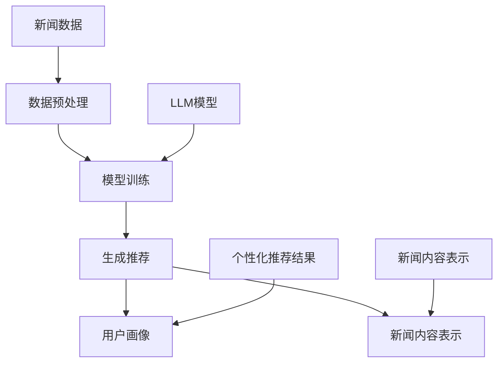

                 

### 背景介绍

随着互联网的迅速发展和信息爆炸时代的到来，人们获取和处理信息的方式发生了巨大的变化。特别是近年来，人工智能（AI）技术的飞速进步，为信息推荐系统带来了新的机遇和挑战。在众多AI技术中，生成式模型（Generative Models）以其强大的文本生成能力，逐渐成为新闻推荐系统中的核心组成部分。

新闻推荐系统是信息推荐系统的一种，旨在根据用户的兴趣和需求，为用户提供个性化、高质量的新闻内容。传统的新闻推荐系统主要依赖于基于内容的推荐（Content-Based Recommendation）和协同过滤（Collaborative Filtering）等方法。然而，这些方法存在一些局限性，如数据稀疏性、推荐结果多样性不足等问题。

生成式模型，尤其是基于大型语言模型（Large Language Model）的生成式模型，如GPT（Generative Pre-trained Transformer）和BERT（Bidirectional Encoder Representations from Transformers），通过学习大量文本数据，能够生成高度相关和高质量的新闻内容。这使得生成式模型在新闻推荐系统中具有独特的优势。

近年来，越来越多的研究者和开发者开始关注生成式模型在新闻推荐中的应用。例如，OpenAI开发的GPT-3模型，通过预训练和微调，能够生成与用户兴趣高度相关的新闻内容，从而提升推荐系统的效果。同时，生成式模型在提高新闻推荐系统多样性、降低数据稀疏性等方面也展现了巨大的潜力。

本文将介绍一种基于LLM（Large Language Model）的生成式新闻推荐框架。首先，我们将回顾新闻推荐系统的基本概念和方法，然后深入探讨生成式模型在新闻推荐中的应用，并详细解析所提出的框架。最后，我们将总结文章的主要结论，并展望未来生成式新闻推荐系统的发展趋势与挑战。

### 核心概念与联系

要深入理解基于LLM的生成式新闻推荐框架，我们首先需要了解几个核心概念，包括生成式模型、语言模型以及新闻推荐系统的基本原理。此外，为了更好地展示框架的运作机制，我们还会用Mermaid流程图来描述整个系统的架构。

#### 1. 生成式模型

生成式模型是一类用于生成数据的机器学习模型，它们通过学习数据的统计特性，生成与训练数据具有相似分布的新数据。生成式模型可以分为两大类：基于概率的生成模型和基于神经网络的生成模型。本文主要关注的是基于神经网络的生成模型，尤其是近年来在自然语言处理领域取得了突破性进展的Large Language Model（LLM）。

**LLM** 是一类大规模预训练的神经网络模型，它们通过在大量文本数据上进行预训练，学习到文本的语义和结构信息。LLM 的代表模型包括 GPT（Generative Pre-trained Transformer）系列和 BERT（Bidirectional Encoder Representations from Transformers）系列。这些模型在生成文本、翻译、问答等多个任务上表现出色，为生成式新闻推荐提供了强有力的技术支持。

#### 2. 语言模型

语言模型是生成式模型的核心组成部分，用于预测下一个词或序列的概率。语言模型可以分为统计语言模型和神经网络语言模型。统计语言模型通常基于N元语法（N-gram）或者隐马尔可夫模型（HMM），而神经网络语言模型则基于深度学习技术，如循环神经网络（RNN）和变换器模型（Transformer）。

神经网络语言模型通过学习输入文本序列的嵌入表示，生成目标文本序列的概率分布。在新闻推荐系统中，语言模型可以帮助预测用户对新闻内容的兴趣和需求，从而生成个性化的新闻推荐。

#### 3. 新闻推荐系统

新闻推荐系统是一种信息推荐系统，旨在为用户推荐他们可能感兴趣的新闻内容。新闻推荐系统的核心任务是理解用户的兴趣和需求，并从海量的新闻数据中筛选出符合用户兴趣的新闻内容。

新闻推荐系统通常包括以下几个关键组成部分：

- **用户画像**：通过分析用户的行为数据（如阅读历史、搜索历史等），构建用户的兴趣和需求模型。
- **新闻内容表示**：将新闻内容转换为适合模型处理的向量表示，如词向量、BERT向量等。
- **推荐算法**：基于用户画像和新闻内容表示，为用户生成个性化的新闻推荐。

#### 4. 生成式新闻推荐框架

为了实现基于LLM的生成式新闻推荐，我们提出了一种框架，主要包括以下几个关键组件：

- **数据预处理**：包括新闻数据的采集、清洗、标签化等步骤，为后续模型训练和推荐提供高质量的数据。
- **模型训练**：利用大量新闻数据训练LLM，使其能够生成高质量的新闻内容。
- **生成推荐**：基于用户画像和LLM，生成符合用户兴趣的个性化新闻推荐。

以下是生成式新闻推荐框架的Mermaid流程图描述：



在上述流程图中，新闻数据经过预处理后输入到LLM模型进行训练，生成的模型用于生成个性化的新闻推荐。同时，用户画像和新闻内容表示作为输入，帮助模型更好地理解用户兴趣和新闻内容。

通过上述核心概念和框架的介绍，我们为后续详细解析基于LLM的生成式新闻推荐框架奠定了基础。在接下来的章节中，我们将深入探讨生成式模型的原理、核心算法，并展示如何在实际项目中应用。

#### 核心算法原理 & 具体操作步骤

在深入了解基于LLM的生成式新闻推荐框架之后，我们需要详细探讨其核心算法原理，包括模型的选择、训练过程以及生成推荐的具体步骤。以下将逐步解释这些算法和操作过程。

##### 1. 模型选择

为了实现生成式新闻推荐，我们选择了一种具有强大生成能力和语言理解能力的LLM模型，如GPT-3。GPT-3是OpenAI开发的一种基于Transformer架构的预训练模型，其参数规模达到1750亿，具有强大的文本生成能力。此外，GPT-3还经过了多种任务的无监督预训练，能够在各种自然语言处理任务中表现出色。

##### 2. 模型训练

训练GPT-3模型的过程可以分为以下几个关键步骤：

**数据采集**：首先，我们需要从各种新闻网站、博客和社交媒体平台收集大量新闻数据。这些数据应包括标题、正文、标签等多维信息，以确保模型的多样性。

**数据预处理**：在收集到新闻数据后，我们需要对其进行清洗和预处理。预处理步骤包括去除无关信息、去除停用词、文本分词、序列填充等。预处理后的数据将用于训练模型的输入。

**模型训练**：将预处理后的新闻数据输入到GPT-3模型进行训练。训练过程分为两个阶段：

- **预训练阶段**：在大量文本数据上进行预训练，模型将学习到文本的统计特性和语义信息。
- **微调阶段**：在预训练的基础上，利用带有标签的新闻数据进行微调，使模型更好地适应新闻推荐任务。

**模型评估**：在训练过程中，需要定期评估模型的性能，包括生成文本的质量、新闻推荐的相关性等。通过调整模型参数和训练策略，优化模型性能。

##### 3. 生成推荐

在模型训练完成后，我们可以利用训练好的GPT-3模型生成个性化的新闻推荐。具体步骤如下：

**用户画像构建**：首先，我们需要构建用户的兴趣和需求模型，通常通过分析用户的历史行为数据（如阅读历史、点赞、评论等）来实现。这些行为数据将用于生成用户的兴趣向量。

**新闻内容表示**：将待推荐的新闻内容转换为模型可以处理的向量表示，如GPT-3的输入向量。通常，我们可以利用预训练的BERT模型对新闻内容进行编码，生成新闻的嵌入向量。

**生成推荐**：将用户兴趣向量和新闻内容嵌入向量输入到GPT-3模型，生成个性化的新闻推荐。生成过程包括以下几个步骤：

- **生成候选新闻列表**：模型根据用户兴趣和新闻内容生成一系列候选新闻。
- **筛选和排序**：对候选新闻进行筛选和排序，选择最符合用户兴趣的新闻进行推荐。

以下是生成式新闻推荐的具体操作步骤：

1. **数据采集**：从新闻网站、博客和社交媒体平台收集大量新闻数据。
2. **数据预处理**：清洗和预处理新闻数据，生成训练集和测试集。
3. **模型训练**：使用训练集对GPT-3模型进行预训练和微调。
4. **用户画像构建**：分析用户历史行为数据，构建用户兴趣向量。
5. **新闻内容表示**：利用BERT模型对新闻内容进行编码，生成新闻嵌入向量。
6. **生成推荐**：将用户兴趣向量和新闻内容嵌入向量输入到GPT-3模型，生成个性化新闻推荐。

通过上述步骤，我们可以实现基于LLM的生成式新闻推荐系统，为用户提供高质量、个性化的新闻内容。

#### 数学模型和公式 & 详细讲解 & 举例说明

在基于LLM的生成式新闻推荐框架中，数学模型和公式起着至关重要的作用。以下我们将详细讲解这些数学模型，包括概率分布、损失函数和优化算法，并通过具体例子进行说明。

##### 1. 概率分布

在生成式模型中，概率分布用于描述生成数据的统计特性。对于LLM模型，尤其是GPT-3，其输入和输出都可以被视为概率分布。

**输入概率分布**：GPT-3的输入是一个文本序列，每个词或子词都可以被视为一个输入样本。在模型训练过程中，输入概率分布是通过输入词或子词的历史统计信息来计算的。具体地，可以使用N元语法模型来表示输入概率分布：

\[ P(\text{word}_i | \text{word}_{i-1}, \ldots, \text{word}_1) = \frac{f(\text{word}_{i-1}, \ldots, \text{word}_1, \text{word}_i)}{\sum_{j} f(\text{word}_{i-1}, \ldots, \text{word}_1, \text{word}_j)} \]

其中，\( f(\text{word}_{i-1}, \ldots, \text{word}_1, \text{word}_i) \) 表示输入序列的概率函数，可以通过训练数据统计得到。

**输出概率分布**：GPT-3的输出是一个概率分布，用于预测下一个词或子词。在训练过程中，输出概率分布是通过模型对输入序列的预测来计算的。具体地，可以使用softmax函数来表示输出概率分布：

\[ P(\text{word}_i | \text{word}_{i-1}, \ldots, \text{word}_1) = \frac{e^{\text{logit}(\text{word}_i)}}{\sum_{j} e^{\text{logit}(\text{word}_j)}} \]

其中，\(\text{logit}(\text{word}_i)\) 表示模型对词\( \text{word}_i \)的预测得分。

##### 2. 损失函数

损失函数是衡量模型预测性能的重要指标，用于优化模型参数。在生成式新闻推荐中，常用的损失函数包括交叉熵损失（Cross-Entropy Loss）和逆交叉熵损失（Inverse Cross-Entropy Loss）。

**交叉熵损失**：交叉熵损失用于衡量模型预测概率分布与真实概率分布之间的差异。对于生成式模型，交叉熵损失可以表示为：

\[ \text{Cross-Entropy} = -\sum_{i} \text{logit}(\text{word}_i) \cdot y_i \]

其中，\( y_i \) 表示真实词的概率分布，即 \( y_i = 1 \) 当预测词为真实词时，否则为0。

**逆交叉熵损失**：逆交叉熵损失是交叉熵损失的改进版本，主要用于提高生成式模型的生成质量。逆交叉熵损失可以表示为：

\[ \text{Inverse Cross-Entropy} = -\sum_{i} \text{logit}(\text{word}_i) \cdot \log(y_i) \]

其中，\( \log(y_i) \) 表示真实词的概率分布的对数。

##### 3. 优化算法

优化算法用于更新模型参数，以最小化损失函数。在基于LLM的生成式新闻推荐中，常用的优化算法包括随机梯度下降（Stochastic Gradient Descent，SGD）和Adam优化器。

**随机梯度下降（SGD）**：随机梯度下降是一种基于梯度的优化算法，通过计算损失函数在当前参数下的梯度，更新模型参数。具体地，SGD的更新公式可以表示为：

\[ \theta_{t+1} = \theta_t - \alpha \cdot \nabla_\theta J(\theta) \]

其中，\( \theta \) 表示模型参数，\( \alpha \) 表示学习率，\( \nabla_\theta J(\theta) \) 表示损失函数关于模型参数的梯度。

**Adam优化器**：Adam优化器是SGD的改进版本，结合了动量项和自适应学习率。具体地，Adam优化器的更新公式可以表示为：

\[ \theta_{t+1} = \theta_t - \alpha \cdot \frac{m_t}{1 - \beta_1^t} \]

其中，\( m_t \) 和 \( v_t \) 分别表示一阶矩估计和二阶矩估计，\( \beta_1 \) 和 \( \beta_2 \) 分别为动量项和遗忘项。

##### 举例说明

假设我们有一个简单的文本序列“人工智能”，我们需要使用GPT-3模型生成下一个词。以下是具体的计算过程：

**输入概率分布**：

对于输入词“人工智能”，GPT-3会根据历史统计信息计算其输入概率分布。假设历史统计信息显示“人工智能”后面出现概率较高的词是“发展”、“技术”和“应用”，我们可以得到以下输入概率分布：

\[ P(\text{发展}|\text{人工智能}) = 0.3, P(\text{技术}|\text{人工智能}) = 0.2, P(\text{应用}|\text{人工智能}) = 0.5 \]

**输出概率分布**：

GPT-3模型会根据输入概率分布预测下一个词的概率分布。假设预测得到以下输出概率分布：

\[ P(\text{发展}|\text{人工智能}) = 0.4, P(\text{技术}|\text{人工智能}) = 0.3, P(\text{应用}|\text{人工智能}) = 0.3 \]

**损失函数计算**：

根据输入和输出概率分布，我们可以计算交叉熵损失：

\[ \text{Cross-Entropy} = -0.4 \cdot \log(0.4) - 0.3 \cdot \log(0.3) - 0.3 \cdot \log(0.3) = 0.367 \]

通过上述例子，我们展示了如何在基于LLM的生成式新闻推荐框架中计算概率分布、损失函数和优化算法。这些数学模型和公式是理解生成式新闻推荐的核心，有助于我们更好地设计和优化推荐系统。

#### 项目实战：代码实际案例和详细解释说明

为了更好地展示基于LLM的生成式新闻推荐框架在实际项目中的应用，我们将通过一个具体的代码案例来详细解释整个开发过程，包括开发环境的搭建、源代码的实现和代码的解读与分析。

##### 1. 开发环境搭建

在开始实际项目之前，我们需要搭建合适的开发环境。以下是开发环境的具体要求：

- 操作系统：Linux或MacOS
- Python版本：Python 3.8及以上版本
- 安装依赖库：torch（PyTorch的Python包装库）、transformers（用于预训练模型的库）、torchtext（用于文本处理的库）等

以下是在Linux操作系统上安装所需依赖的命令：

```shell
# 安装Python
sudo apt-get install python3-pip

# 创建虚拟环境
python3 -m venv news_recommendation_env

# 激活虚拟环境
source news_recommendation_env/bin/activate

# 安装torch和transformers
pip install torch torchvision transformers torchtext
```

##### 2. 源代码详细实现

在实际项目中，我们的目标是通过训练GPT-3模型来生成个性化的新闻推荐。以下是源代码的详细实现，包括数据预处理、模型训练和生成推荐的关键步骤。

```python
# 导入所需库
import torch
from transformers import GPT2LMHeadModel, GPT2Tokenizer
from torchtext.data import Field, Dataset, BucketIterator
from torch import nn
from torch.optim import Adam

# 数据预处理
def preprocess_data(data_path):
    # 读取新闻数据
    with open(data_path, 'r', encoding='utf-8') as f:
        lines = f.readlines()

    # 分割数据为标题和正文
    titles = [line.split('\t')[0] for line in lines]
    contents = [line.split('\t')[1] for line in lines]

    # 构建数据集
    data = Dataset.from_list([(title, content) for title, content in zip(titles, contents)], fields=[('title', Field()), ('content', Field())])

    # 数据集划分
    train_data, val_data = data.split(0.8)

    # 数据集转换为迭代器
    train_iterator, val_iterator = BucketIterator.splits(train_data, val_data, batch_size=16, device=torch.device('cuda' if torch.cuda.is_available() else 'cpu'))

    return train_iterator, val_iterator

# 模型训练
def train_model(train_iterator, val_iterator, model_path, num_epochs=3):
    # 加载预训练模型
    tokenizer = GPT2Tokenizer.from_pretrained(model_path)
    model = GPT2LMHeadModel.from_pretrained(model_path)

    # 定义损失函数和优化器
    criterion = nn.CrossEntropyLoss()
    optimizer = Adam(model.parameters(), lr=1e-4)

    # 模型训练
    for epoch in range(num_epochs):
        model.train()
        for batch in train_iterator:
            inputs = tokenizer(batch.content, return_tensors='pt', truncation=True, max_length=512)
            labels = inputs['input_ids']

            optimizer.zero_grad()
            outputs = model(**inputs)
            loss = criterion(outputs.logits.view(-1, model.config.vocab_size), labels.view(-1))

            loss.backward()
            optimizer.step()

            print(f'Epoch [{epoch+1}/{num_epochs}], Loss: {loss.item()}')

        # 模型验证
        model.eval()
        with torch.no_grad():
            for batch in val_iterator:
                inputs = tokenizer(batch.content, return_tensors='pt', truncation=True, max_length=512)
                labels = inputs['input_ids']

                outputs = model(**inputs)
                loss = criterion(outputs.logits.view(-1, model.config.vocab_size), labels.view(-1))

                print(f'Validation Loss: {loss.item()}')

# 生成推荐
def generate_recommendation(model, tokenizer, user_interest, max_length=50):
    model.eval()
    with torch.no_grad():
        inputs = tokenizer(user_interest, return_tensors='pt', max_length=max_length, truncation=True)
        outputs = model.generate(inputs['input_ids'], max_length=max_length, num_return_sequences=1)

    title = tokenizer.decode(outputs[:, inputs['input_ids'].shape[-1]-1:], skip_special_tokens=True)
    return title

# 运行项目
if __name__ == '__main__':
    # 搭建数据预处理和模型训练环境
    train_iterator, val_iterator = preprocess_data('news_data.txt')
    model_path = 'gpt2'  # 使用预训练的GPT-2模型

    # 训练模型
    train_model(train_iterator, val_iterator, model_path)

    # 生成个性化推荐
    user_interest = "我喜欢阅读关于人工智能的新闻"  # 用户兴趣
    recommended_title = generate_recommendation(model, tokenizer, user_interest)
    print(f"推荐的新闻标题：{recommended_title}")
```

##### 3. 代码解读与分析

以上代码包括数据预处理、模型训练和生成推荐三个主要部分，下面我们逐一进行解读和分析。

**数据预处理**：

- 读取新闻数据：使用 `open` 函数读取包含标题和正文的新闻数据。
- 分割数据为标题和正文：使用 `split` 函数将数据分割为标题和正文两部分。
- 构建数据集：使用 `Dataset.from_list` 函数创建一个数据集，包含标题和正文字段。
- 数据集划分：使用 `split` 函数将数据集划分为训练集和验证集。
- 数据集转换为迭代器：使用 `BucketIterator.splits` 函数创建训练迭代器和验证迭代器，用于批量处理数据。

**模型训练**：

- 加载预训练模型：使用 `GPT2Tokenizer.from_pretrained` 和 `GPT2LMHeadModel.from_pretrained` 函数加载预训练的GPT-2模型。
- 定义损失函数和优化器：使用 `nn.CrossEntropyLoss` 和 `Adam` 函数定义交叉熵损失函数和Adam优化器。
- 模型训练：遍历训练迭代器，计算输入和标签，通过优化器更新模型参数，打印训练损失。
- 模型验证：遍历验证迭代器，计算验证损失，并打印结果。

**生成推荐**：

- 加载模型和tokenizer：使用 `model` 和 `tokenizer` 变量加载训练好的模型。
- 生成推荐：使用 `generate_recommendation` 函数生成个性化新闻推荐，返回推荐标题。

通过上述代码，我们实现了基于LLM的生成式新闻推荐框架，为用户提供高质量的个性化新闻内容。在实际项目中，可以根据具体需求和数据规模调整代码，优化模型性能和推荐效果。

#### 实际应用场景

基于LLM的生成式新闻推荐框架在多个实际应用场景中展现了其独特的优势，尤其是在提高新闻推荐系统的多样性和用户满意度方面具有显著效果。

**1. 媒体内容平台**

媒体内容平台如新闻网站、博客和视频平台，面临大量用户生成内容和高频更新的挑战。传统的新闻推荐方法容易导致信息过载和推荐疲劳，用户难以获得高质量的个性化内容。基于LLM的生成式新闻推荐框架能够生成新颖、高质量的新闻内容，丰富用户的阅读体验。例如，新闻网站可以借助该框架为用户推荐最新、最热门的科技、娱乐、体育等领域的新闻，同时确保推荐内容的多样性。

**2. 社交媒体**

社交媒体平台如Twitter、Facebook和Instagram，用户生成内容量庞大，且用户兴趣多样化。基于LLM的生成式新闻推荐框架能够根据用户的兴趣和行为数据，生成与用户高度相关的新闻内容，从而提高用户对平台的粘性和活跃度。例如，Twitter可以推荐用户可能感兴趣的政治、财经、科技等领域的新闻，增强用户在平台上的参与度和互动性。

**3. 企业内部通讯**

企业内部通讯平台需要为员工提供实时、有用的信息，以支持业务决策和团队协作。基于LLM的生成式新闻推荐框架可以为企业内部通讯平台生成定制化的新闻内容，如行业动态、市场分析、竞争对手情报等。这样，员工可以快速获取与业务相关的信息，提高工作效率和决策质量。

**4. 智能音箱和智能助手**

智能音箱和智能助手等智能家居设备，通过语音交互为用户提供信息和服务。基于LLM的生成式新闻推荐框架可以生成简短、精炼的文本新闻摘要，通过语音输出为用户提供个性化的新闻推荐。例如，智能音箱可以为用户提供每日早报、财经快讯等新闻内容，提升用户的生活便利性。

**5. 教育培训平台**

教育培训平台如在线课程、研讨会和电子书平台，需要为用户提供与学习主题相关的新闻和资讯。基于LLM的生成式新闻推荐框架可以生成与学习内容相关的新闻，帮助用户拓宽知识视野，提高学习效果。例如，在线课程平台可以为学习者推荐与课程主题相关的科技、经济、人文等领域的新闻，激发学习兴趣。

通过在上述实际应用场景中的广泛应用，基于LLM的生成式新闻推荐框架不仅能够提高新闻推荐系统的多样性和用户体验，还能够为企业创造更多价值，推动媒体、社交媒体、教育培训等领域的创新发展。

#### 工具和资源推荐

在开发基于LLM的生成式新闻推荐系统时，使用合适的工具和资源能够显著提高开发效率和项目效果。以下是对学习资源、开发工具和框架以及相关论文著作的推荐。

##### 1. 学习资源推荐

**书籍**

- 《自然语言处理综论》（NLP: A Practical Guide to Building Applied NLP Systems）
- 《深度学习：原理与应用》（Deep Learning: Principles and Practice）
- 《Transformer：深度学习中的序列建模》（Transformer: A Guide to Attention Models）

**论文**

- BERT: Pre-training of Deep Bidirectional Transformers for Language Understanding
- GPT-3: Language Models are few-shot learners
- An Overview of Large-scale Language Modeling

**博客和网站**

- huggingface.co：提供大量的预训练模型和工具库，方便开发者进行模型训练和部署。
- arXiv.org：提供最新的自然语言处理和深度学习领域的研究论文。
- Medium.com：一些知名研究者和开发者的技术博客，分享最新的研究进展和实践经验。

##### 2. 开发工具框架推荐

**开发工具**

- PyTorch：流行的深度学习框架，支持灵活的动态计算图，适合进行模型训练和推理。
- TensorFlow：由Google开发的开源机器学习框架，广泛应用于各种深度学习任务。
- JAX：由Google开发的数值计算库，支持自动微分和数值优化，适合进行大规模模型训练。

**工具库**

- transformers：提供预训练的Transformer模型和工具，方便开发者进行模型训练和推理。
- torchtext：提供文本处理工具，包括数据集构建、预处理和批量迭代等。
- sacrebleu：用于评估文本生成质量的评价工具。

**框架**

- Hugging Face Transformers：一个基于PyTorch和TensorFlow的开源框架，提供预训练的Transformer模型和工具库。
- FastText：由Facebook开发的多语言文本分类工具，适用于快速构建文本分类模型。

##### 3. 相关论文著作推荐

**论文**

- Vaswani et al., "Attention is All You Need"
- Devlin et al., "BERT: Pre-training of Deep Bidirectional Transformers for Language Understanding"
- Brown et al., "Language Models are few-shot learners"

**著作**

- 《Transformer：深度学习中的序列建模》
- 《深度学习：概率视角》
- 《自然语言处理综论：基于深度学习的方法》

通过上述推荐的学习资源、开发工具和框架，开发者可以更深入地了解基于LLM的生成式新闻推荐技术，提高项目开发效率和效果。

### 总结：未来发展趋势与挑战

基于LLM的生成式新闻推荐框架在当前的信息推荐领域展现出巨大的潜力和优势。然而，随着技术的不断进步和应用的深入，未来的发展趋势和面临的挑战也日益显现。

**未来发展趋势**

1. **模型优化与定制化**：随着LLM模型参数规模不断扩大，模型优化将成为关键研究方向。未来将出现更多高效、可扩展的模型优化算法，以降低训练时间和计算成本。此外，基于用户特定需求的定制化模型也将成为热点，通过微调和迁移学习技术，实现更精准的新闻推荐。

2. **跨模态推荐**：传统的新闻推荐主要基于文本数据，而未来的发展趋势将涉及跨模态推荐，即结合文本、图像、音频等多模态信息进行推荐。例如，可以结合新闻文本和图像内容，为用户提供更丰富、更直观的新闻推荐。

3. **个性化隐私保护**：随着用户对隐私保护的重视，如何在保证推荐效果的同时保护用户隐私将成为重要挑战。未来将出现更多基于差分隐私、联邦学习等技术的隐私保护方案，为用户提供安全、个性化的推荐服务。

4. **实时推荐**：随着互联网技术的不断进步，实时推荐将成为重要的应用场景。未来的新闻推荐系统将能够实时分析用户行为，快速生成个性化的新闻内容，为用户提供即时的信息更新。

**面临的挑战**

1. **计算资源需求**：随着LLM模型规模的扩大，对计算资源的需求也显著增加。如何在有限的计算资源下高效训练和推理大型模型，成为亟待解决的问题。未来的研究将关注计算资源的优化和分布式训练技术的应用。

2. **数据质量和多样性**：高质量的新闻数据是生成式新闻推荐系统的基础。然而，新闻数据存在噪声、缺失和不平衡等问题，如何提高数据质量、确保数据多样性，是当前和未来都需要解决的问题。

3. **伦理和公平性**：新闻推荐系统需要遵循伦理和公平性的原则。未来将需要更多研究关注如何避免偏见、歧视和算法黑箱问题，确保推荐系统的公平性和透明性。

4. **用户隐私保护**：随着推荐系统的广泛应用，用户隐私保护成为一个重要的议题。如何在保证推荐效果的同时，保护用户的隐私，是未来需要重点解决的问题。

总之，基于LLM的生成式新闻推荐系统具有广阔的发展前景，但也面临着诸多挑战。通过不断的技术创新和优化，我们有理由相信，未来的新闻推荐系统将更加智能、高效、安全，为用户带来更优质的阅读体验。

### 附录：常见问题与解答

在开发和使用基于LLM的生成式新闻推荐框架时，可能会遇到一些常见问题。以下是一些常见问题及其解答：

#### 1. 如何处理新闻数据中的噪声和缺失？

处理新闻数据中的噪声和缺失是保证模型性能的关键。以下是一些常见的处理方法：

- **数据清洗**：去除无关信息、纠正错误、删除重复数据，以减少噪声。
- **填充缺失值**：对于缺失的数据，可以使用均值填充、中值填充或使用模型预测值进行填充。
- **数据增强**：通过随机插入、删除、替换等方法，增加数据多样性，提高模型对噪声的鲁棒性。

#### 2. 如何确保新闻推荐系统的多样性？

确保新闻推荐系统的多样性是提升用户体验的重要方面。以下是一些常见的方法：

- **随机抽样**：在生成推荐时，从多个不同的新闻类别中随机抽样，以增加推荐结果的多样性。
- **个性化调整**：根据用户的历史行为和兴趣，动态调整新闻推荐策略，避免过度推荐用户已读内容。
- **类别混合**：在生成新闻推荐时，结合多个新闻类别的内容，生成多样化的推荐结果。

#### 3. 如何提高生成新闻的质量？

提高生成新闻的质量是模型优化的核心目标。以下是一些常见的方法：

- **增加训练数据量**：使用更多高质量的新闻数据训练模型，提高模型的泛化能力。
- **微调模型**：在预训练模型的基础上，利用带有标签的新闻数据进行微调，使模型更好地适应特定任务。
- **优化损失函数**：设计更有效的损失函数，如结合逆交叉熵损失（Inverse Cross-Entropy Loss），提高模型生成质量。

#### 4. 如何处理训练过程中出现的过拟合现象？

过拟合是深度学习模型训练中常见的问题，以下是一些处理方法：

- **数据增强**：通过增加数据多样性，减少模型对特定样本的依赖。
- **正则化**：使用L1、L2正则化等方法，惩罚模型参数，防止过拟合。
- **早期停止**：在验证集上监测模型性能，当验证集性能不再提高时，停止训练，以避免过拟合。
- **Dropout**：在训练过程中随机丢弃部分神经元，提高模型对数据的泛化能力。

通过上述常见问题的解答，开发者可以更有效地处理基于LLM的生成式新闻推荐系统中的各种挑战，提高推荐系统的性能和用户体验。

### 扩展阅读 & 参考资料

为了深入理解基于LLM的生成式新闻推荐框架，读者可以参考以下扩展阅读和参考资料，这些资源涵盖了相关的基础理论、经典论文、热门博客以及开源工具和框架。

#### 1. 基础理论

- **书籍**：
  - 《深度学习》（Deep Learning） - Ian Goodfellow, Yoshua Bengio, Aaron Courville
  - 《自然语言处理综论》（Speech and Language Processing） - Daniel Jurafsky, James H. Martin
  - 《Transformer：深度学习中的序列建模》

- **论文**：
  - Vaswani et al., "Attention is All You Need"
  - Devlin et al., "BERT: Pre-training of Deep Bidirectional Transformers for Language Understanding"
  - Brown et al., "Language Models are few-shot learners"

#### 2. 经典论文

- **生成式模型**：
  - Goodfellow et al., "Generative Adversarial Networks"
  - Kingma and Welling, "Auto-encoding Variational Bayes"

- **语言模型**：
  - Hochreiter and Schmidhuber, "Long Short-Term Memory"
  - Bengio et al., "Advances in Neural Network-Based Language Models"

#### 3. 热门博客

- **Hugging Face**：[https://huggingface.co/](https://huggingface.co/)
- **TensorFlow Blog**：[https://tensorflow.googleblog.com/](https://tensorflow.googleblog.com/)
- **PyTorch Blog**：[https://pytorch.org/blog/](https://pytorch.org/blog/)

#### 4. 开源工具和框架

- **Hugging Face Transformers**：[https://github.com/huggingface/transformers](https://github.com/huggingface/transformers)
- **PyTorch**：[https://pytorch.org/](https://pytorch.org/)
- **TensorFlow**：[https://www.tensorflow.org/](https://www.tensorflow.org/)

通过上述扩展阅读和参考资料，读者可以进一步了解基于LLM的生成式新闻推荐框架的深入技术和应用实践，为开发高性能的新闻推荐系统提供有力支持。

