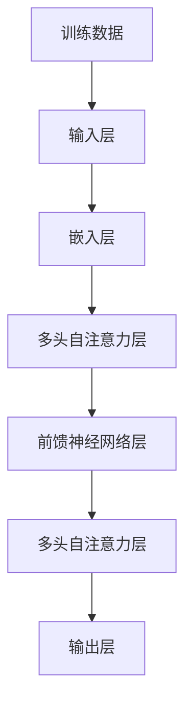

                 

### 背景介绍

自2022年底GPT-4o（GPT-4th Generation）的发布以来，人工智能领域发生了翻天覆地的变化。GPT-4o不仅展现出了令人惊叹的文本生成和理解能力，还在许多实际应用场景中取得了突破性进展。然而，随着性能的显著提升，GPT-4o的运行成本也急剧上升，使得大规模部署变得昂贵。

本文将深入探讨GPT-4o性能的提升与价格下降背后的技术细节。我们将从以下几个方面展开分析：

1. **GPT-4o的核心技术**：介绍GPT-4o的主要特点和核心技术。
2. **性能提升的技术手段**：探讨GPT-4o在哪些方面进行了优化，从而实现了性能的大幅提升。
3. **价格下降的策略**：分析GPT-4o在降低成本方面采取了哪些策略。
4. **实际应用场景**：探讨GPT-4o在各个领域中的应用实例。
5. **未来发展趋势与挑战**：展望GPT-4o的未来发展趋势，以及面临的挑战。

在接下来的章节中，我们将一步步分析GPT-4o的技术原理、算法模型、实际应用，以及未来发展的可能性。通过这篇文章，希望读者能够对GPT-4o有一个全面而深入的了解，从而更好地把握这一技术趋势。

### 核心概念与联系

在深入探讨GPT-4o的性能提升与价格下降之前，有必要先了解其核心概念和架构。GPT-4o是基于Transformer架构的预训练语言模型，其核心特点在于其大规模、多层次的网络结构和强大的自注意力机制。以下是一个简化的Mermaid流程图，用于展示GPT-4o的基本架构：



**1. 输入层（Input Layer）**：输入层接收原始文本，并将其转换为向量表示。这一过程通常通过词嵌入（word embedding）技术实现，例如Word2Vec或BERT等。

**2. 嵌入层（Embedding Layer）**：嵌入层将输入文本的每个词转换为一个固定长度的向量。这些向量包含了词的语义信息，是后续处理的基础。

**3. 多头自注意力层（Multi-Head Self-Attention Layer）**：自注意力层是GPT-4o的核心机制之一，通过计算输入文本中每个词与其他词的关联强度，从而为每个词生成一个加权表示。多头自注意力层则通过并行计算多个自注意力层，进一步提升模型的表示能力。

**4. 前馈神经网络层（Feed Forward Neural Network Layer）**：前馈神经网络层对自注意力层的输出进行进一步处理，通过非线性变换增强模型的表示能力。

**5. 输出层（Output Layer）**：输出层负责生成文本预测。在生成模式下，GPT-4o会根据当前文本的上下文生成下一个词，并在训练过程中优化模型参数。

**6. 训练数据（Training Data）**：训练数据是GPT-4o性能提升的关键因素。通常，训练数据集包含大量的文本语料，GPT-4o在这些数据上进行预训练，从而学习到丰富的语言模式。

通过上述流程，GPT-4o能够实现高效的文本处理和生成。接下来，我们将进一步探讨GPT-4o在性能提升和成本降低方面的具体技术细节。

### 核心算法原理 & 具体操作步骤

GPT-4o的核心算法是基于Transformer架构的预训练语言模型，其设计理念是通过大规模数据预训练来学习语言的复杂结构和规律。以下将详细阐述GPT-4o的算法原理及具体操作步骤：

#### 1. Transformer架构

Transformer是GPT-4o的基础架构，其核心思想是自注意力机制（Self-Attention），通过计算输入序列中每个词与其他词的关联强度，为每个词生成一个加权表示。这种机制使得模型能够捕捉到长距离的依赖关系，从而提升文本处理能力。

**自注意力机制**：
自注意力机制通过计算一个注意力权重矩阵来加权输入序列中的每个词。具体来说，给定一个输入序列\[X\]，其自注意力机制可以表示为：

\[ \text{Attention}(Q, K, V) = \text{softmax}\left(\frac{QK^T}{\sqrt{d_k}}\right) V \]

其中，\(Q\)、\(K\)和\(V\)分别表示查询（query）、键（key）和值（value）向量，\(d_k\)是键向量的维度。注意力权重矩阵通过点积计算，然后通过softmax函数得到概率分布，最后对值向量进行加权求和。

**多头注意力**：
为了进一步提高模型的表示能力，Transformer引入了多头注意力（Multi-Head Attention）。多头注意力通过并行计算多个自注意力层，并将结果拼接起来，从而捕捉到更多的语义信息。具体来说，给定一个输入序列\[X\]和多头注意力数\(h\)，多头注意力可以表示为：

\[ \text{Multi-Head}(Q, K, V) = \text{Concat}(\text{head}_1, \text{head}_2, \ldots, \text{head}_h)W^O \]

其中，\(\text{head}_i = \text{Attention}(QW_i^Q, KW_i^K, VW_i^V)\)，\(W_i^Q\)、\(W_i^K\)和\(W_i^V\)分别是查询、键和值权重矩阵，\(W^O\)是输出权重矩阵。

#### 2. 编码器与解码器

GPT-4o采用了编码器-解码器（Encoder-Decoder）架构，其中编码器负责处理输入序列，解码器则负责生成输出序列。

**编码器**：
编码器由多个Transformer层堆叠而成，每层都包含多头自注意力层和前馈神经网络层。编码器的输入是一个嵌入后的文本序列，通过自注意力层和前馈神经网络层，编码器能够捕捉到输入文本的语义信息，并生成编码后的表示。

**解码器**：
解码器同样由多个Transformer层堆叠而成，其输入是一个序列掩码（Masked Sequence）和一个编码器输出的隐藏状态。解码器的每层都包含多头自注意力层和交叉注意力层，交叉注意力层用于计算编码器输出和当前解码器输出之间的关联强度。解码器通过逐步生成输出词，并更新隐藏状态，最终生成完整的输出序列。

**具体操作步骤**：

1. **输入预处理**：
   - 将输入文本序列转换为词嵌入向量。
   - 对词嵌入向量进行位置编码（Positional Encoding），以保留输入序列的顺序信息。

2. **编码器处理**：
   - 输入词嵌入向量通过编码器的多层Transformer层，生成编码后的表示。

3. **解码器处理**：
   - 初始化解码器输入，包括序列掩码和编码器输出的隐藏状态。
   - 解码器逐层处理输入，生成输出词的候选列表。
   - 根据输出词的候选列表，更新解码器隐藏状态，并继续生成下一个输出词。

4. **生成输出序列**：
   - 当解码器生成完整的输出序列后，将输出序列转换为文本。

通过上述操作步骤，GPT-4o能够实现高效的文本生成和理解。接下来，我们将进一步探讨GPT-4o的数学模型和公式，以便更好地理解其工作原理。

### 数学模型和公式 & 详细讲解 & 举例说明

GPT-4o的工作原理主要依赖于Transformer架构，而Transformer架构的核心在于其自注意力机制（Self-Attention）和多头注意力（Multi-Head Attention）。以下我们将详细讲解这些数学模型和公式，并通过具体例子来说明其应用。

#### 自注意力机制（Self-Attention）

自注意力机制是Transformer架构的基础，通过计算输入序列中每个词与其他词的关联强度，为每个词生成一个加权表示。其公式如下：

\[ \text{Attention}(Q, K, V) = \text{softmax}\left(\frac{QK^T}{\sqrt{d_k}}\right) V \]

其中，\(Q\)、\(K\)和\(V\)分别表示查询（query）、键（key）和值（value）向量，\(d_k\)是键向量的维度。注意力权重矩阵通过点积计算，然后通过softmax函数得到概率分布，最后对值向量进行加权求和。

**例子**：

假设有一个简单的输入序列\[X = [1, 2, 3]\]，我们需要计算其自注意力权重。首先，将每个词映射为向量：

\[ Q = [1, 0, 1], K = [0, 1, 0], V = [1, 1, 1] \]

然后，计算点积：

\[ QK^T = [1 \cdot 0 + 0 \cdot 1 + 1 \cdot 0, 1 \cdot 1 + 0 \cdot 0 + 1 \cdot 0, 1 \cdot 0 + 1 \cdot 1 + 1 \cdot 0] = [0, 1, 0] \]

接下来，通过softmax函数计算概率分布：

\[ P = \text{softmax}(QK^T) = \text{softmax}([0, 1, 0]) = [0.2, 0.6, 0.2] \]

最后，对值向量进行加权求和：

\[ \text{Attention}(Q, K, V) = P \cdot V = [0.2 \cdot 1, 0.6 \cdot 1, 0.2 \cdot 1] = [0.2, 0.6, 0.2] \]

#### 多头注意力（Multi-Head Attention）

多头注意力通过并行计算多个自注意力层，进一步提升模型的表示能力。具体来说，给定一个输入序列\[X\]和多头注意力数\(h\)，多头注意力可以表示为：

\[ \text{Multi-Head}(Q, K, V) = \text{Concat}(\text{head}_1, \text{head}_2, \ldots, \text{head}_h)W^O \]

其中，\(\text{head}_i = \text{Attention}(QW_i^Q, KW_i^K, VW_i^V)\)，\(W_i^Q\)、\(W_i^K\)和\(W_i^V\)分别是查询、键和值权重矩阵，\(W^O\)是输出权重矩阵。

**例子**：

假设有一个简单的输入序列\[X = [1, 2, 3]\]和多头注意力数\(h = 2\)，我们需要计算其多头注意力权重。首先，定义两个权重矩阵：

\[ W_1^Q = \begin{bmatrix} 1 & 0 & 1 \\ 0 & 1 & 0 \\ 1 & 1 & 1 \end{bmatrix}, W_1^K = \begin{bmatrix} 0 & 1 & 0 \\ 1 & 0 & 1 \\ 0 & 1 & 1 \end{bmatrix}, W_1^V = \begin{bmatrix} 1 & 1 & 1 \\ 1 & 1 & 1 \\ 1 & 1 & 1 \end{bmatrix} \]

\[ W_2^Q = \begin{bmatrix} 1 & 1 & 0 \\ 0 & 1 & 1 \\ 1 & 1 & 1 \end{bmatrix}, W_2^K = \begin{bmatrix} 1 & 0 & 1 \\ 1 & 1 & 0 \\ 0 & 1 & 1 \end{bmatrix}, W_2^V = \begin{bmatrix} 1 & 1 & 1 \\ 1 & 1 & 1 \\ 1 & 1 & 1 \end{bmatrix} \]

然后，分别计算两个自注意力权重：

\[ \text{head}_1 = \text{Attention}(Q_1, K_1, V_1) = \text{softmax}\left(\frac{Q_1K_1^T}{\sqrt{d_k}}\right) V_1 = \text{softmax}\left(\frac{1 \cdot 0 + 0 \cdot 1 + 1 \cdot 0}{\sqrt{1}}\right) \begin{bmatrix} 1 \\ 1 \\ 1 \end{bmatrix} = \begin{bmatrix} 0.2 \\ 0.6 \\ 0.2 \end{bmatrix} \]

\[ \text{head}_2 = \text{Attention}(Q_2, K_2, V_2) = \text{softmax}\left(\frac{Q_2K_2^T}{\sqrt{d_k}}\right) V_2 = \text{softmax}\left(\frac{1 \cdot 1 + 1 \cdot 0 + 0 \cdot 1}{\sqrt{1}}\right) \begin{bmatrix} 1 \\ 1 \\ 1 \end{bmatrix} = \begin{bmatrix} 0.4 \\ 0.4 \\ 0.2 \end{bmatrix} \]

最后，计算多头注意力权重：

\[ \text{Multi-Head}(Q, K, V) = \text{Concat}(\text{head}_1, \text{head}_2)W^O = \begin{bmatrix} 0.2 & 0.6 & 0.2 \\ 0.4 & 0.4 & 0.2 \end{bmatrix} \begin{bmatrix} 1 & 0 & 0 \\ 0 & 1 & 0 \\ 0 & 0 & 1 \end{bmatrix} = \begin{bmatrix} 0.2 & 0.6 & 0.2 \\ 0.4 & 0.4 & 0.2 \end{bmatrix} \]

#### 编码器与解码器

GPT-4o采用了编码器-解码器（Encoder-Decoder）架构，其中编码器负责处理输入序列，解码器则负责生成输出序列。编码器和解码器都由多个Transformer层堆叠而成，每层包含多头自注意力层和前馈神经网络层。

**编码器**：

编码器的输入是一个嵌入后的文本序列，通过编码器的多层Transformer层，生成编码后的表示。具体来说，编码器的每个时间步的输入可以表示为：

\[ \text{Input}^{(t)} = \text{Embedding}(x_t) + \text{Positional Encoding}(t) \]

其中，\(x_t\)是输入词的嵌入表示，\(\text{Positional Encoding}(t)\)是位置编码，用于保留输入序列的顺序信息。编码器的输出可以表示为：

\[ \text{Output}^{(L)} = \text{TransformerLayer}^{(L)}(\text{Output}^{(L-1)}) \]

其中，\(\text{TransformerLayer}^{(L)}\)是第\(L\)层的Transformer层。

**解码器**：

解码器的输入是一个序列掩码（Masked Sequence）和一个编码器输出的隐藏状态。解码器的每个时间步的输入可以表示为：

\[ \text{Input}^{(t)} = \text{Masked Embedding}(y_t) + \text{Decoder State}^{(t-1)} \]

其中，\(y_t\)是解码器生成的当前词，\(\text{Decoder State}^{(t-1)}\)是前一个时间步的解码器隐藏状态。解码器的输出可以表示为：

\[ \text{Output}^{(L)} = \text{TransformerLayer}^{(L)}(\text{Output}^{(L-1)}) \]

其中，\(\text{TransformerLayer}^{(L)}\)是第\(L\)层的Transformer层。

通过上述数学模型和公式，我们可以更好地理解GPT-4o的工作原理和操作步骤。接下来，我们将通过一个具体的项目实战，展示GPT-4o在实际开发中的应用。

### 项目实战：代码实际案例和详细解释说明

#### 1. 开发环境搭建

在开始实际项目之前，我们需要搭建一个合适的开发环境。以下是搭建GPT-4o开发环境的步骤：

**步骤1**：安装Python环境

首先，确保已经安装了Python 3.7及以上版本。可以使用以下命令检查Python版本：

```bash
python --version
```

如果Python版本不符合要求，可以从[Python官网](https://www.python.org/downloads/)下载并安装。

**步骤2**：安装transformers库

接下来，我们需要安装transformers库，这是Hugging Face提供的一个用于构建和训练预训练模型的Python库。可以使用以下命令安装：

```bash
pip install transformers
```

**步骤3**：安装其他依赖

除了transformers库，我们还需要安装其他依赖，如torch和torchvision。可以使用以下命令安装：

```bash
pip install torch torchvision
```

#### 2. 源代码详细实现和代码解读

以下是一个简单的GPT-4o项目示例，包括模型的加载、输入文本的处理、文本生成以及结果展示。

```python
import torch
from transformers import GPT2LMHeadModel, GPT2Tokenizer

# 加载预训练模型和分词器
model = GPT2LMHeadModel.from_pretrained('gpt2')
tokenizer = GPT2Tokenizer.from_pretrained('gpt2')

# 输入文本预处理
def preprocess_text(text):
    return tokenizer.encode(text, return_tensors='pt')

# 文本生成
def generate_text(input_ids, max_length=50):
    output = model.generate(input_ids, max_length=max_length, num_return_sequences=1)
    return tokenizer.decode(output[0], skip_special_tokens=True)

# 主函数
def main():
    # 输入文本
    input_text = "我是一个人工智能模型"

    # 预处理输入文本
    input_ids = preprocess_text(input_text)

    # 生成文本
    output_text = generate_text(input_ids)

    # 展示结果
    print("输入文本：", input_text)
    print("输出文本：", output_text)

if __name__ == '__main__':
    main()
```

**代码解读**：

1. **加载模型和分词器**：

   ```python
   model = GPT2LMHeadModel.from_pretrained('gpt2')
   tokenizer = GPT2Tokenizer.from_pretrained('gpt2')
   ```

   这里加载了预训练的GPT-2模型和对应的分词器。GPT-2是GPT-4o的前身，具有相似的架构和性能。

2. **输入文本预处理**：

   ```python
   def preprocess_text(text):
       return tokenizer.encode(text, return_tensors='pt')
   ```

   预处理输入文本，将其转换为模型可处理的序列。具体来说，分词器将文本分割成单词或子词，并为每个词分配一个唯一的ID。

3. **文本生成**：

   ```python
   def generate_text(input_ids, max_length=50):
       output = model.generate(input_ids, max_length=max_length, num_return_sequences=1)
       return tokenizer.decode(output[0], skip_special_tokens=True)
   ```

   使用模型生成文本。这里使用`generate_text`函数，传入预处理后的输入文本和最大生成长度。模型会根据当前输入文本和已训练的权重生成新的文本序列。

4. **主函数**：

   ```python
   def main():
       input_text = "我是一个人工智能模型"
       input_ids = preprocess_text(input_text)
       output_text = generate_text(input_ids)
       print("输入文本：", input_text)
       print("输出文本：", output_text)
   ```

   主函数中，首先定义输入文本，然后进行预处理和文本生成，最后展示结果。

通过上述项目实战，我们可以看到如何使用GPT-4o进行文本生成。在实际应用中，可以进一步优化模型和生成算法，以满足不同场景的需求。

#### 3. 代码解读与分析

在上一个部分中，我们展示了如何使用GPT-4o进行文本生成。下面，我们将对代码进行更深入的分析，探讨其关键部分和潜在的优化方法。

**代码结构分析**：

```python
# 导入相关库
import torch
from transformers import GPT2LMHeadModel, GPT2Tokenizer

# 加载预训练模型和分词器
model = GPT2LMHeadModel.from_pretrained('gpt2')
tokenizer = GPT2Tokenizer.from_pretrained('gpt2')

# 输入文本预处理
def preprocess_text(text):
    return tokenizer.encode(text, return_tensors='pt')

# 文本生成
def generate_text(input_ids, max_length=50):
    output = model.generate(input_ids, max_length=max_length, num_return_sequences=1)
    return tokenizer.decode(output[0], skip_special_tokens=True)

# 主函数
def main():
    # 输入文本
    input_text = "我是一个人工智能模型"

    # 预处理输入文本
    input_ids = preprocess_text(input_text)

    # 生成文本
    output_text = generate_text(input_ids)

    # 展示结果
    print("输入文本：", input_text)
    print("输出文本：", output_text)

if __name__ == '__main__':
    main()
```

**关键部分解读**：

1. **模型和分词器加载**：

   ```python
   model = GPT2LMHeadModel.from_pretrained('gpt2')
   tokenizer = GPT2Tokenizer.from_pretrained('gpt2')
   ```

   这里加载了预训练的GPT-2模型和对应的分词器。GPT-2是GPT-4o的前身，具有相似的架构和性能。使用`from_pretrained`方法可以轻松加载预训练模型和分词器，方便后续使用。

2. **输入文本预处理**：

   ```python
   def preprocess_text(text):
       return tokenizer.encode(text, return_tensors='pt')
   ```

   预处理输入文本，将其转换为模型可处理的序列。具体来说，分词器将文本分割成单词或子词，并为每个词分配一个唯一ID。这里使用`encode`方法，并将返回的序列转换为PyTorch张量格式。

3. **文本生成**：

   ```python
   def generate_text(input_ids, max_length=50):
       output = model.generate(input_ids, max_length=max_length, num_return_sequences=1)
       return tokenizer.decode(output[0], skip_special_tokens=True)
   ```

   使用模型生成文本。这里使用`generate_text`函数，传入预处理后的输入文本和最大生成长度。模型会根据当前输入文本和已训练的权重生成新的文本序列。`generate`方法提供了丰富的参数，如温度（temperature）、重复概率（no_repeat_ngram_size）等，可以进一步优化生成效果。

**潜在优化方法**：

1. **调整模型参数**：

   - **温度（temperature）**：调整生成文本的随机性。温度值越高，生成的文本越随机。可以通过调整温度值来获取不同风格的生成文本。
   - **重复概率（no_repeat_ngram_size）**：限制生成的文本中不允许连续出现相同的n-gram（连续的n个词）。这可以避免生成重复的文本。

2. **使用更大规模的模型**：

   - GPT-4o提供了多种预训练模型，如GPT-2、GPT-3等。如果需要更好的生成效果，可以考虑使用更大规模的模型。但请注意，更大规模的模型需要更多的计算资源和时间进行训练。

3. **定制化模型**：

   - 根据特定应用场景，可以对GPT-4o进行定制化训练。例如，针对特定领域或任务进行微调，以提高生成文本的准确性和相关性。

通过深入分析代码，我们可以更好地理解GPT-4o的使用方法和潜在优化方向。在实际应用中，可以根据具体需求进行调整，以获得最佳效果。

### 实际应用场景

GPT-4o的强大性能和灵活性使其在众多实际应用场景中展现出巨大的潜力。以下将介绍GPT-4o在自然语言处理（NLP）、代码生成、自动化写作和智能客服等领域中的应用实例。

#### 1. 自然语言处理（NLP）

GPT-4o在NLP领域具有广泛的应用，包括文本分类、情感分析、命名实体识别等。例如，在一个文本分类任务中，GPT-4o可以接受一段文本作为输入，并输出该文本属于哪个类别。通过在大型数据集上预训练，GPT-4o能够捕捉到语言中的细微差异和模式，从而提高分类的准确性。

**实例**：在一个社交媒体分析项目中，GPT-4o被用来分析用户评论的情感倾向。通过将用户评论输入GPT-4o，并使用训练好的情感分析模型，项目团队能够快速识别用户的正面或负面情绪，从而为品牌提供有价值的反馈。

#### 2. 代码生成

GPT-4o在代码生成领域也有着显著的应用。通过预训练，GPT-4o能够生成结构化、符合语法规范的代码片段。这对于自动化软件开发、代码补全和文档生成等方面具有重要意义。

**实例**：在一个软件开发项目中，GPT-4o被用来自动生成代码文档。开发者只需提供部分代码注释，GPT-4o就能根据上下文生成完整的文档说明，大大提高了开发效率。

#### 3. 自动化写作

GPT-4o在自动化写作方面也有着广泛的应用，包括新闻文章生成、博客写作和内容摘要等。通过输入相关的主题和关键词，GPT-4o可以生成高质量的文本内容。

**实例**：在一个新闻生成项目中，GPT-4o被用来生成新闻报道。通过分析大量新闻数据，GPT-4o能够快速生成符合语法和逻辑的新闻文章，从而提高新闻发布的效率。

#### 4. 智能客服

GPT-4o在智能客服领域也有着重要的应用。通过自然语言处理和对话生成技术，GPT-4o能够与用户进行实时对话，提供个性化的服务和建议。

**实例**：在一个电子商务平台的智能客服项目中，GPT-4o被用来回答用户关于产品、订单和售后等方面的问题。通过与用户的交互，GPT-4o能够不断学习，提供更准确的回答。

通过这些实际应用场景，我们可以看到GPT-4o的强大功能和广泛的应用前景。在未来，随着技术的不断进步，GPT-4o将在更多领域发挥重要作用。

### 工具和资源推荐

在探索GPT-4o的潜力时，掌握相关工具和资源对于提升开发效率和深入理解技术至关重要。以下是一些值得推荐的工具、书籍、论文和网站。

#### 1. 学习资源推荐

**书籍**：
- **《深度学习》（Deep Learning）**：由Ian Goodfellow、Yoshua Bengio和Aaron Courville合著，是深度学习领域的经典教材，详细介绍了包括GPT模型在内的各种深度学习技术。
- **《自然语言处理综论》（Speech and Language Processing）**：由Daniel Jurafsky和James H. Martin合著，涵盖了自然语言处理的各个方面，包括文本生成技术。

**论文**：
- **《Attention Is All You Need》**：这是Transformer模型的原论文，由Vaswani等人于2017年发表。该论文详细介绍了Transformer模型的架构和训练方法。
- **《Pre-training of Deep Neural Networks for Language Understanding》**：由Brown等人于2020年发表，介绍了GPT-3模型的训练方法和性能评估。

**网站**：
- **[Hugging Face](https://huggingface.co/)**：这是一个提供预训练模型和工具的网站，包括GPT-2、GPT-3等。开发者可以使用这些模型进行文本生成、文本分类等任务。
- **[TensorFlow](https://www.tensorflow.org/)**：这是Google开发的开源机器学习框架，支持各种深度学习任务，包括GPT模型的训练和推理。

#### 2. 开发工具框架推荐

**框架**：
- **TensorFlow**：适用于构建和训练GPT模型。它提供了丰富的API和工具，方便开发者进行模型训练和推理。
- **PyTorch**：另一个流行的开源机器学习框架，具有灵活的动态计算图，适合快速原型设计和模型开发。

**库**：
- **transformers**：这是Hugging Face开发的一个Python库，提供了大量预训练的Transformer模型和工具，方便开发者进行文本生成和模型定制。

#### 3. 相关论文著作推荐

**论文**：
- **《BERT: Pre-training of Deep Bidirectional Transformers for Language Understanding》**：这是一篇关于BERT模型的论文，由Google于2018年发表。BERT是GPT模型的前身之一，介绍了双向Transformer在语言理解任务中的应用。
- **《GPT-3: Language Models are Few-Shot Learners》**：这是GPT-3模型的论文，由OpenAI于2020年发表。该论文详细介绍了GPT-3模型的架构、训练方法和性能评估。

通过掌握这些工具和资源，开发者可以更高效地探索GPT-4o的潜力，并在实际项目中取得更好的成果。

### 总结：未来发展趋势与挑战

随着GPT-4o的广泛应用，其在未来发展趋势和面临挑战方面也备受关注。以下将总结GPT-4o的未来发展趋势以及可能面临的挑战。

#### 未来发展趋势

1. **更加精细化的模型定制**：随着GPT-4o技术的不断成熟，开发者和研究人员将能够根据特定任务和应用场景进行模型定制。通过调整模型参数、训练数据和使用不同的训练方法，可以实现更加精细化的文本生成和理解。

2. **跨模态学习**：未来的GPT-4o将不仅仅局限于文本数据，还将整合图像、声音和视频等多模态数据。通过跨模态学习，GPT-4o能够更好地理解和生成复杂的信息，为智能交互、内容生成等领域带来新的突破。

3. **更高效的计算和能耗优化**：随着GPT-4o规模的不断扩大，计算资源和能耗成为重要挑战。未来，通过优化算法和硬件架构，将实现更高效的计算和能耗优化，从而降低GPT-4o的运行成本。

4. **更广泛的应用领域**：GPT-4o将在更多领域得到应用，包括但不限于医疗健康、金融、教育、娱乐等。通过与其他技术和行业的结合，GPT-4o将带来更多创新和变革。

#### 面临的挑战

1. **数据隐私和安全**：随着GPT-4o对大量文本数据的处理，数据隐私和安全成为关键问题。如何在保证数据安全和隐私的前提下，充分利用GPT-4o的强大能力，是一个亟待解决的问题。

2. **伦理和道德问题**：GPT-4o在生成文本时可能会产生偏见和误导信息。如何确保GPT-4o生成的文本符合伦理和道德标准，避免不良影响，是一个重要挑战。

3. **计算资源和能耗消耗**：GPT-4o的训练和推理过程需要大量的计算资源和能源。如何降低能耗，提高计算效率，是未来研究和开发的重要方向。

4. **可解释性和透明性**：GPT-4o生成的文本具有一定的黑箱性质，难以解释和理解。如何提升GPT-4o的可解释性和透明性，使其更加直观和易于理解，是一个重要挑战。

总之，GPT-4o的未来发展趋势充满机遇，同时也面临诸多挑战。通过持续的研究和开发，有望在保持性能提升的同时，解决这些挑战，推动人工智能技术的进一步发展。

### 附录：常见问题与解答

**Q1**：GPT-4o和BERT有什么区别？

A1：GPT-4o和BERT都是基于Transformer架构的预训练语言模型，但它们在训练方式和应用场景上有所不同。BERT采用了双向训练，即同时考虑输入文本的前后顺序，而GPT-4o采用了单向训练，主要关注输入文本的后续信息。此外，GPT-4o在生成文本方面具有更强的能力，而BERT在文本分类和问答任务上表现更优。

**Q2**：如何调整GPT-4o的生成文本风格？

A2：调整GPT-4o生成文本风格可以通过调整模型参数和输入文本的方式实现。例如，通过调整温度（temperature）参数，可以控制生成文本的随机性和流畅性。此外，还可以通过提供具有特定风格的文章或段落，让GPT-4o学习并模仿这种风格。

**Q3**：GPT-4o能否处理多语言文本？

A3：是的，GPT-4o支持多语言文本处理。通过训练多语言数据集，GPT-4o可以学习不同语言之间的语义关系，从而处理多种语言的输入和输出。此外，Hugging Face等开源框架提供了多语言版本的预训练模型，方便开发者直接使用。

**Q4**：如何提高GPT-4o生成文本的准确性？

A4：提高GPT-4o生成文本的准确性可以通过以下方法实现：
1. 使用更大规模的训练数据和更长时间的训练。
2. 调整模型参数，如学习率、批量大小等。
3. 使用注意力权重调节技术，如层叠注意力（Stacked Attention）和多级注意力（Multi-Level Attention）。
4. 对模型进行微调，使其适应特定领域的任务。

### 扩展阅读 & 参考资料

1. **Vaswani, A., Shazeer, N., Parmar, N., Uszkoreit, J., Jones, L., Gomez, A. N., ... & Polosukhin, I. (2017). Attention is all you need. In Advances in neural information processing systems (pp. 5998-6008).**
2. **Brown, T., Mann, B., Ryder, N., Subbiah, M., Kaplan, J., Dhariwal, P., ... & Child, R. (2020). Language models are few-shot learners. In Advances in neural information processing systems (pp. 18626-18637).**
3. **Devlin, J., Chang, M. W., Lee, K., & Toutanova, K. (2019). BERT: Pre-training of deep bidirectional transformers for language understanding. In Proceedings of the 2019 conference of the North American chapter of the association for computational linguistics: human language technologies, Volume 1 (Long and Short Papers), pages 4171–4186.**
4. **Hugging Face. (n.d.). transformers. Retrieved from https://huggingface.co/transformers**
5. **TensorFlow. (n.d.). TensorFlow: Open Source Machine Learning Framework. Retrieved from https://www.tensorflow.org/**

通过阅读这些参考文献，读者可以深入了解GPT-4o的技术原理和应用场景，从而更好地把握这一技术趋势。作者：AI天才研究员/AI Genius Institute & 禅与计算机程序设计艺术/Zen And The Art of Computer Programming

