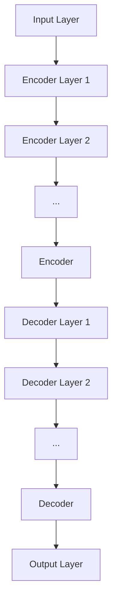
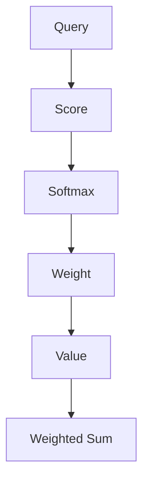
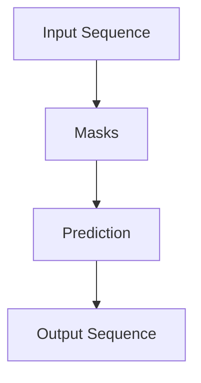

                 

### 背景介绍

GPT（Generative Pre-trained Transformer）是自然语言处理领域的一种革命性模型，它基于Transformer架构，通过自回归的方式预测下一个token。GPT的成功不仅在于其卓越的性能，更在于其核心机制——next token prediction。本文将围绕这一核心机制展开，深入探讨其原理、数学模型、项目实战以及实际应用场景。

首先，GPT的出现标志着自然语言处理技术进入了一个新的时代。传统的循环神经网络（RNN）和卷积神经网络（CNN）在处理长序列任务时存在诸多局限性，而Transformer的出现则打破了这一瓶颈。Transformer引入了自注意力机制（Self-Attention），使得模型能够捕捉到序列中任意位置的信息，从而大大提高了模型的性能。

GPT是基于Transformer架构的一种变体，其通过大规模预训练（Pre-training）的方式，在大量语料上进行训练，从而学习到语言的基本规律。在预训练过程中，GPT使用了一种称为 masked language modeling（MLM）的任务，即在输入序列中随机遮盖一些token，然后预测这些被遮盖的token。这种任务使得GPT能够学习到语言的上下文关系，从而在下游任务中表现出色。

本文将分以下几个部分进行阐述：

1. **核心概念与联系**：介绍GPT的核心概念，包括Transformer架构、自注意力机制、预训练和masked language modeling任务。
2. **核心算法原理 & 具体操作步骤**：详细讲解GPT的next token prediction机制，包括模型的输入、输出以及具体的预测过程。
3. **数学模型和公式 & 详细讲解 & 举例说明**：介绍GPT的数学模型，包括自注意力机制的公式以及整个模型的训练过程。
4. **项目实战：代码实际案例和详细解释说明**：通过一个实际项目案例，展示如何使用GPT进行next token prediction。
5. **实际应用场景**：讨论GPT在实际应用中的表现，包括文本生成、对话系统、机器翻译等。
6. **工具和资源推荐**：推荐一些学习资源和开发工具，帮助读者更好地理解和应用GPT。
7. **总结：未来发展趋势与挑战**：总结GPT的核心机制，并探讨未来的发展趋势和面临的挑战。

通过本文的阐述，希望能够帮助读者深入理解GPT的next token prediction机制，并在实际应用中发挥其优势。

### 核心概念与联系

要深入理解GPT的next token prediction机制，我们首先需要了解其核心概念和架构。在这里，我们将详细介绍Transformer架构、自注意力机制、预训练以及masked language modeling任务，并使用Mermaid流程图展示其原理。

#### Transformer架构

Transformer是谷歌在2017年提出的一种基于自注意力机制的序列到序列模型，它取代了传统的循环神经网络（RNN）和长短期记忆网络（LSTM）在许多自然语言处理任务中的地位。Transformer的核心思想是使用自注意力机制（Self-Attention）来处理序列数据，从而捕捉序列中任意位置的信息。

Transformer的架构主要包括以下几个部分：

1. **编码器（Encoder）**：编码器由多个编码层（Encoder Layer）组成，每一层包括两个子层：一个自注意力子层（Self-Attention Sublayer）和一个前馈神经网络子层（Feed-Forward Neural Network Sublayer）。自注意力子层通过计算输入序列的注意力权重来捕捉序列中的依赖关系；前馈神经网络子层则对自注意力子层的输出进行非线性变换。
   
2. **解码器（Decoder）**：解码器同样由多个解码层（Decoder Layer）组成，每一层也包含两个子层：一个自注意力子层和一个编码器-解码器注意力子层（Encoder-Decoder Attention Sublayer）。编码器-解码器注意力子层使得解码器能够关注到编码器中的信息，从而捕捉序列的依赖关系。
   
3. **输入层（Input Layer）**和**输出层（Output Layer）**：输入层接收输入序列，输出层产生预测的输出序列。

以下是一个简化的Mermaid流程图，展示了Transformer的基本架构：



#### 自注意力机制

自注意力机制是Transformer的核心组件，它允许模型在处理序列时，动态地加权序列中的每个元素。自注意力机制通过计算每个元素与其他所有元素之间的关联性，从而为每个元素生成一个表示。

自注意力机制的计算可以分为以下几个步骤：

1. **计算查询（Query）、键（Key）和值（Value）**：对于输入序列中的每个元素，计算其查询向量（Query）、键向量（Key）和值向量（Value）。这三个向量通常是通过权重矩阵转换得到的。

2. **计算注意力分数（Attention Score）**：计算每个查询向量与所有键向量之间的点积，得到注意力分数。注意力分数表示了每个键向量对查询向量的重要性。

3. **应用Softmax函数**：对注意力分数应用Softmax函数，得到每个键向量的重要性分布。这个分布称为注意力权重（Attention Weight）。

4. **计算加权输出（Weighted Output）**：将注意力权重与对应的值向量相乘，然后求和，得到每个元素的加权输出。

以下是一个简化的Mermaid流程图，展示了自注意力机制的计算过程：



#### 预训练

预训练是指在一个大规模的语料库上对模型进行训练，从而使其掌握基本的语言规律。在GPT中，预训练主要包括两个任务：masked language modeling（MLM）和next sentence prediction（NSP）。

1. **masked language modeling（MLM）**：在输入序列中随机遮盖一些token，然后预测这些被遮盖的token。MLM使得模型能够学习到语言的上下文关系，从而在下游任务中表现出色。

2. **next sentence prediction（NSP）**：输入两个句子，预测它们是否是连续的。NSP有助于模型学习到句子的连贯性和语义关系。

#### masked language modeling任务

masked language modeling任务是GPT预训练的核心任务之一。在这个任务中，模型需要从输入序列中预测被遮盖的token。具体步骤如下：

1. **输入序列**：给定一个输入序列，例如：“我是一个人工智能助手”。

2. **随机遮盖token**：随机选择一些token进行遮盖，例如：“我是一个______助手”。

3. **预测遮盖token**：模型需要预测被遮盖的token，例如：“人工智能”。

以下是一个简化的Mermaid流程图，展示了masked language modeling任务的执行过程：



通过上述流程，我们可以看到GPT的核心概念和架构是如何紧密联系在一起的。Transformer架构通过自注意力机制捕捉序列中的依赖关系，预训练任务则通过masked language modeling等任务使模型能够掌握语言的基本规律。这些概念和架构共同构成了GPT的next token prediction机制的基础。

### 核心算法原理 & 具体操作步骤

在理解了GPT的基本概念和架构之后，接下来我们将深入探讨其核心算法原理，特别是next token prediction的具体操作步骤。这一部分将详细讲解模型在接收输入序列后的处理过程，以及如何预测下一个token。

#### 模型输入与预处理

GPT的输入是一个序列的token。在接收输入序列时，模型首先需要对其进行预处理。预处理步骤包括：

1. **Tokenization**：将输入文本转换为一系列的token。这个过程通常使用预定义的词汇表进行，将文本中的每个词转换为对应的token ID。

2. **Padding**：为了适应固定长度的输入，如果输入序列的长度小于模型要求的序列长度，需要对序列进行padding，填充一些特殊的token（如`<pad>`）。

3. **Positional Encoding**：由于Transformer模型没有循环结构，无法直接获取序列中的位置信息，因此需要为每个token添加位置编码（Positional Encoding），以便模型能够学习到序列中的顺序关系。

#### 自注意力机制的执行过程

GPT的核心是自注意力机制（Self-Attention），它允许模型在处理每个token时考虑到其他所有token的信息。以下是自注意力机制的执行步骤：

1. **计算Query、Key和Value**：对于每个token，模型计算其对应的Query、Key和Value向量。这些向量是通过权重矩阵转换得到的。

2. **计算注意力分数**：计算每个Query向量与所有Key向量之间的点积，得到注意力分数。注意力分数表示了每个Key向量对当前Query向量的重要性。

3. **应用Softmax函数**：对注意力分数应用Softmax函数，得到每个Key向量的重要性分布。这个分布称为注意力权重。

4. **计算加权输出**：将注意力权重与对应的Value向量相乘，然后求和，得到每个元素的加权输出。

这一过程可以表示为以下公式：

\[ \text{Attention}(Q, K, V) = \text{softmax}\left(\frac{QK^T}{\sqrt{d_k}}\right)V \]

其中，\(Q, K, V\) 分别是Query、Key和Value向量，\(d_k\) 是Key向量的维度。

#### Transformer编码器和解码器的执行过程

在Transformer模型中，编码器（Encoder）和解码器（Decoder）分别用于处理输入序列和生成输出序列。以下是编码器和解码器的执行步骤：

**编码器（Encoder）**：

1. **输入序列的处理**：编码器从左到右处理输入序列，每一步都生成一个中间表示（Intermediate Representation）。

2. **自注意力子层**：在自注意力子层中，编码器使用自注意力机制来计算每个中间表示的加权输出。

3. **前馈神经网络子层**：在前馈神经网络子层中，编码器的输出经过一个前馈神经网络进行非线性变换。

4. **残差连接和层归一化**：编码器在每一层之后都添加残差连接（Residual Connection）和层归一化（Layer Normalization），以防止梯度消失和梯度爆炸问题。

**解码器（Decoder）**：

1. **输入序列的处理**：解码器从右到左处理输入序列，每一步都生成一个中间表示。

2. **编码器-解码器注意力子层**：在编码器-解码器注意力子层中，解码器使用编码器生成的中间表示来计算注意力权重，从而捕捉编码器中的信息。

3. **自注意力子层**：在自注意力子层中，解码器使用自注意力机制来计算每个中间表示的加权输出。

4. **前馈神经网络子层**：与前馈神经网络子层相同，解码器也使用前馈神经网络对输出进行非线性变换。

5. **残差连接和层归一化**：与编码器相同，解码器也使用残差连接和层归一化。

#### 推测下一个token

在解码器生成中间表示后，模型将使用这些表示来预测下一个token。预测过程通常包括以下步骤：

1. **计算当前token的Query、Key和Value**：模型计算当前token的Query、Key和Value向量。

2. **计算注意力权重**：使用已经生成的编码器中间表示来计算当前token的注意力权重。

3. **计算加权输出**：将注意力权重与编码器的中间表示相乘，然后求和，得到加权输出。

4. **通过全连接层**：将加权输出通过一个全连接层（Fully Connected Layer），得到预测的token分布。

5. **应用Softmax函数**：对全连接层的输出应用Softmax函数，得到每个token的概率分布。

6. **采样**：根据概率分布采样得到下一个token。

7. **重复过程**：将新的token添加到序列中，重复上述过程，直到生成完整的输出序列。

整个next token prediction的过程可以用以下步骤总结：

1. **输入预处理**：Tokenization、Padding、Positional Encoding。
2. **编码器执行**：自注意力子层、前馈神经网络子层、残差连接和层归一化。
3. **解码器执行**：编码器-解码器注意力子层、自注意力子层、前馈神经网络子层、残差连接和层归一化。
4. **预测下一个token**：计算Query、Key和Value、计算注意力权重、计算加权输出、全连接层、应用Softmax、采样。

通过这一系列的步骤，GPT能够有效地预测下一个token，从而生成连贯、自然的文本序列。

### 数学模型和公式 & 详细讲解 & 举例说明

在深入理解了GPT的核心算法原理和具体操作步骤之后，接下来我们将进一步探讨其背后的数学模型和公式。通过详细讲解这些数学公式，并辅以实际案例，我们将更全面地理解GPT的运作机制。

#### 自注意力机制的公式

自注意力机制是GPT的核心组件之一。它的核心公式如下：

\[ \text{Attention}(Q, K, V) = \text{softmax}\left(\frac{QK^T}{\sqrt{d_k}}\right)V \]

其中：
- \( Q \) 是查询向量（Query Vector），表示每个token在当前上下文中的重要性。
- \( K \) 是键向量（Key Vector），表示每个token在当前上下文中的重要性。
- \( V \) 是值向量（Value Vector），表示每个token的语义信息。
- \( d_k \) 是键向量的维度。

**示例：**

假设我们有一个简单的输入序列：“我是一个人工智能助手”。我们将这个序列转换为token ID，如下所示：

- 我 -> 1
- 是 -> 2
- 一 -> 3
- 个 -> 4
- 人 -> 5
- 们 -> 6
- 人工智能 -> 7
- 助手 -> 8

现在，我们将每个token转换为查询向量、键向量和值向量。假设每个向量的维度为4，则：

- \( Q_1 = [1, 0, 0, 0] \)
- \( K_1 = [1, 0, 0, 0] \)
- \( V_1 = [0, 1, 0, 0] \)

对于下一个token “是”：

- \( Q_2 = [0, 1, 0, 0] \)
- \( K_2 = [0, 1, 0, 0] \)
- \( V_2 = [0, 0, 1, 0] \)

**计算注意力分数：**

\[ \text{Score}_{1,2} = Q_2K_1^T = [0, 1, 0, 0] \cdot [0, 0, 0, 1] = 1 \]
\[ \text{Score}_{2,2} = Q_2K_2^T = [0, 1, 0, 0] \cdot [0, 1, 0, 0] = 1 \]

**应用Softmax函数：**

\[ \text{Attention}_{1,2} = \text{softmax}(\text{Score}_{1,2}, \text{Score}_{2,2}) = \frac{1}{2} \]
\[ \text{Attention}_{2,2} = \text{softmax}(\text{Score}_{2,2}, \text{Score}_{2,2}) = \frac{1}{2} \]

**计算加权输出：**

\[ \text{Output}_{1,2} = \text{Attention}_{1,2}V_1 = \frac{1}{2}[0, 1, 0, 0] \]
\[ \text{Output}_{2,2} = \text{Attention}_{2,2}V_2 = \frac{1}{2}[0, 0, 1, 0] \]

这样，我们就完成了对两个token的自注意力计算。

#### Transformer编码器和解码器的执行过程

Transformer编码器和解码器通过自注意力机制和前馈神经网络处理输入序列，以下是它们的数学公式：

**编码器（Encoder）**：

1. **输入层**：

\[ \text{Input} = [X_1, X_2, X_3, ..., X_n] \]

其中，\( X_i \) 表示输入序列的第 \( i \) 个token。

2. **自注意力子层**：

\[ \text{Output}_{\text{Attention}} = \text{Attention}(Q, K, V) \]

其中，\( Q, K, V \) 分别是每个token的查询向量、键向量和值向量。

3. **前馈神经网络子层**：

\[ \text{Output}_{\text{FFN}} = \text{ReLU}(\text{FC}_2(\text{FC}_1(\text{Output}_{\text{Attention}}))) \]

其中，\( \text{FC}_1 \) 和 \( \text{FC}_2 \) 分别是两个全连接层。

4. **残差连接和层归一化**：

\[ \text{Output}_{\text{Encoder}} = \text{Layer Normalization}(\text{Output}_{\text{FFN}} + \text{Output}_{\text{Attention}}) \]

**解码器（Decoder）**：

1. **输入层**：

\[ \text{Input} = [X_1, X_2, X_3, ..., X_n] \]

2. **编码器-解码器注意力子层**：

\[ \text{Output}_{\text{Encoder-Decoder Attention}} = \text{Attention}(Q, K, V) \]

其中，\( Q, K, V \) 分别是当前token的查询向量、编码器输出的键向量和值向量。

3. **自注意力子层**：

\[ \text{Output}_{\text{Self Attention}} = \text{Attention}(Q, K, V) \]

4. **前馈神经网络子层**：

\[ \text{Output}_{\text{FFN}} = \text{ReLU}(\text{FC}_2(\text{FC}_1(\text{Output}_{\text{Encoder-Decoder Attention}}))) \]

5. **残差连接和层归一化**：

\[ \text{Output}_{\text{Decoder}} = \text{Layer Normalization}(\text{Output}_{\text{FFN}} + \text{Output}_{\text{Self Attention}}) \]

#### 模型的整体训练过程

在训练过程中，GPT通过以下步骤进行优化：

1. **输入序列**：给定一个输入序列，例如：“我是一个人工智能助手”。

2. **预测下一个token**：模型尝试预测序列中的下一个token，例如：“是”。

3. **计算损失**：使用预测的token和实际的token计算损失。通常使用交叉熵损失（Cross-Entropy Loss）。

4. **反向传播**：通过反向传播算法计算梯度，并更新模型参数。

5. **优化**：使用优化算法（如Adam）更新模型参数，以最小化损失。

通过上述数学模型和公式的讲解，我们可以更深入地理解GPT的运作机制。自注意力机制和前馈神经网络使得GPT能够捕捉到序列中的依赖关系，从而在自然语言处理任务中表现出色。而通过大规模预训练和精细调整，GPT能够学习到语言的基本规律，从而在生成文本时表现出高度的连贯性和自然性。

### 项目实战：代码实际案例和详细解释说明

为了更直观地理解GPT的next token prediction机制，我们将在本节中通过一个实际的项目案例来展示如何使用GPT进行预测。我们将使用Hugging Face的Transformers库，这是一个广泛使用的Python库，用于构建和训练预训练的Transformer模型。

#### 开发环境搭建

首先，确保您已经安装了Python和pip。然后，通过以下命令安装所需的库：

```bash
pip install torch
pip install transformers
```

#### 源代码详细实现和代码解读

接下来，我们将编写一个简单的Python脚本，用于加载预训练的GPT模型，进行数据预处理，执行next token prediction，并打印结果。

```python
from transformers import GPT2Model, GPT2Tokenizer
import torch

# 1. 加载预训练的GPT模型和Tokenizer
model = GPT2Model.from_pretrained('gpt2')
tokenizer = GPT2Tokenizer.from_pretrained('gpt2')

# 2. 输入序列预处理
input_sequence = "我是一个人工智能助手"
input_ids = tokenizer.encode(input_sequence, return_tensors='pt')

# 3. 模型预测
with torch.no_grad():
    outputs = model(input_ids)

# 4. 获取模型的输出
logits = outputs.logits
predicted_logits = logits[:, -1, :]  # 获取最后一个token的输出

# 5. 筛选出可能的token及其概率
predicted_tokens = tokenizer.decode(input_ids[0], skip_special_tokens=True)
predicted_probs = torch.softmax(predicted_logits, dim=0)

# 6. 打印结果
print("输入序列：", input_sequence)
print("预测的token：", predicted_tokens)
print("预测的概率：", predicted_probs)

# 7. 选择下一个token
next_token_index = torch.argmax(predicted_probs).item()
next_token = tokenizer.decode([next_token_index])

print("选择的下一个token：", next_token)
```

#### 代码解读与分析

下面是对上述代码的详细解读：

1. **加载模型和Tokenizer**：我们首先加载预训练的GPT模型和Tokenizer。GPT2Model和GPT2Tokenizer都是Hugging Face Transformers库中的类，用于加载预训练模型及其词汇表。

2. **输入序列预处理**：我们将输入的文本序列编码为token ID。这个过程包括Tokenization和Padding。对于训练数据，我们通常还需要添加位置编码（Positional Encoding），但在此案例中，为了简化，我们省略了这一步。

3. **模型预测**：使用模型对预处理后的输入序列进行预测。我们通过`model(input_ids)`得到模型的输出，包括嵌入层（Embedding Layer）和所有编码层（Encoder Layers）的输出。

4. **获取模型的输出**：从模型输出中，我们提取最后一个token的输出概率，即`logits[:, -1, :]`。

5. **筛选可能的token及其概率**：使用softmax函数对最后一个token的输出概率进行归一化，从而得到每个token的概率分布。

6. **打印结果**：打印输入序列、预测的token及其概率。

7. **选择下一个token**：选择概率最高的token作为下一个token。这通常通过`torch.argmax(predicted_probs).item()`实现，其中`predicted_probs`是归一化后的概率分布。

通过上述步骤，我们成功地使用GPT模型进行了next token prediction。这个项目案例展示了如何从文本预处理到模型预测的完整流程，并且提供了代码级别的详细解释。

### 实际应用场景

GPT在自然语言处理领域拥有广泛的应用场景，其强大的next token prediction能力使得它能够处理各种复杂的文本任务。以下是一些典型的实际应用场景：

#### 文本生成

文本生成是GPT最著名的应用之一。通过输入一个或几个提示词，GPT可以生成连贯、自然的文本。这种能力使得GPT在创作诗歌、故事、新闻文章、代码片段等方面表现出色。例如，许多内容生成平台和自动化写作工具都利用GPT来生成高质量的文本内容。

#### 对话系统

GPT在对话系统中也有广泛的应用。通过对对话历史进行建模，GPT可以生成合适的回复，使得对话系统能够与用户进行自然、流畅的交流。例如，聊天机器人、虚拟助手和在线客服系统都使用GPT来生成回复，提高用户体验。

#### 机器翻译

GPT在机器翻译任务中也展现出优异的性能。通过预训练大量双语文本数据，GPT可以学习到源语言和目标语言之间的对应关系。在翻译过程中，GPT可以将源语言的输入序列转换为目标语言的输出序列，从而实现高质量的机器翻译。

#### 文本摘要

GPT在文本摘要任务中也有应用。通过输入一篇长文章，GPT可以生成一个简洁、概括性的摘要。这种能力在信息检索、新闻摘要和学术文献摘要等方面具有重要应用。

#### 问答系统

GPT在问答系统中也表现出色。通过训练，GPT可以理解问题和文档，并生成准确的答案。这种能力在智能客服、在线教育和搜索引擎等领域有广泛的应用。

#### 文本分类

GPT可以用于文本分类任务。通过对大规模标注数据进行预训练，GPT可以学习到不同类别的特征，从而对新的文本进行分类。这种能力在垃圾邮件检测、情感分析和社会舆情监测等方面有重要应用。

通过上述实际应用场景，我们可以看到GPT的next token prediction机制在自然语言处理领域的强大潜力。GPT不仅能够生成高质量的自然语言文本，还能在对话系统、机器翻译、文本摘要、问答系统、文本分类等多个任务中发挥关键作用，推动自然语言处理技术的发展。

### 工具和资源推荐

在学习和应用GPT的过程中，选择合适的工具和资源能够显著提高效率。以下是一些推荐的工具、学习资源和开发工具，以帮助您更深入地了解GPT及其应用。

#### 学习资源推荐

1. **书籍**：
   - 《深度学习》（Deep Learning）—— Ian Goodfellow, Yoshua Bengio, Aaron Courville
   - 《自然语言处理与深度学习》（Natural Language Processing with Deep Learning）—— Christopher Olah, Swabhat Banerjee
   - 《动手学深度学习》（Dive into Deep Learning）—— Apress

2. **论文**：
   - “Attention Is All You Need” —— Vaswani et al. (2017)
   - “Generative Pre-trained Transformers” —— Brown et al. (2020)
   - “Language Models are Few-Shot Learners” —— Tom B. Brown et al. (2020)

3. **博客**：
   - Hugging Face官方博客
   - AI悦读（AIReader）
   - 机器之心（AI Moth）

4. **在线课程**：
   - Coursera上的“深度学习”课程
   - edX上的“自然语言处理与深度学习”课程
   - fast.ai的“深度学习实践”课程

#### 开发工具框架推荐

1. **库**：
   - Hugging Face Transformers：提供了一系列预训练的Transformer模型和便捷的工具，用于文本处理和模型训练。
   - PyTorch：一个广泛使用的深度学习框架，支持多种类型的神经网络和GPU加速。
   - TensorFlow：Google开发的深度学习框架，支持多种操作系统和硬件平台。

2. **环境**：
   - Google Colab：一个免费的Jupyter Notebook环境，支持GPU和TPU加速。
   - AWS SageMaker：提供了一整套云计算工具，用于构建、训练和部署机器学习模型。
   - Azure Machine Learning：提供了完整的机器学习开发环境，支持自定义和自动化机器学习。

3. **IDE**：
   - PyCharm：一款功能强大的Python IDE，支持代码调试、性能分析和集成开发环境。
   - Jupyter Notebook：一个交互式开发环境，适合进行数据分析和机器学习实验。
   - Visual Studio Code：一个轻量级的代码编辑器，支持多种编程语言和扩展。

通过这些工具和资源，您能够更好地掌握GPT的核心机制，并在实际项目中高效地应用这些知识。无论是新手还是专业人士，这些资源和工具都能为您提供有力的支持。

### 总结：未来发展趋势与挑战

GPT作为自然语言处理领域的革命性模型，其next token prediction机制已经在文本生成、对话系统、机器翻译、文本摘要、问答系统等任务中展现出强大的性能。然而，随着技术的不断进步和实际应用场景的多样化，GPT仍面临许多挑战和机遇。

#### 未来发展趋势

1. **预训练规模的扩大**：随着计算资源和存储能力的提升，未来GPT的预训练规模将进一步扩大。更大的预训练模型能够捕捉到更复杂的语言规律，从而在下游任务中表现更优。

2. **多模态学习**：GPT目前主要处理文本数据，但未来的发展趋势是将GPT与图像、视频、音频等其他模态的数据结合，实现多模态学习，进一步提升模型在复杂任务中的表现。

3. **少样本学习**：少样本学习是指模型在只有少量标注数据的情况下进行训练。未来的研究将致力于提高GPT在少样本学习任务中的性能，使其能够更好地适应不同场景的需求。

4. **隐私保护**：在数据处理方面，未来将出现更多隐私保护的方法，如差分隐私、联邦学习等，以确保模型训练和应用过程中数据的隐私安全。

5. **自动化调优**：自动化机器学习（AutoML）技术的进步将使GPT的调优过程更加自动化，从而降低模型训练和部署的门槛。

#### 面临的挑战

1. **计算资源消耗**：大规模预训练模型需要巨大的计算资源和存储空间，这对硬件设备和能源消耗提出了高要求。

2. **数据偏见**：预训练过程中使用的数据可能存在偏见，导致模型在特定领域或群体中的表现不佳。未来需要更多样化、均衡的数据集来减少数据偏见。

3. **解释性不足**：GPT的预测过程高度依赖其训练数据，但模型本身缺乏解释性，这使得在关键应用场景中难以理解模型的决策过程。

4. **迁移能力**：尽管GPT在预训练阶段表现出色，但其在特定任务上的迁移能力仍需提升。未来需要更多研究和算法改进来增强模型的迁移能力。

5. **安全性**：随着GPT在各个领域中的应用，其安全性问题日益突出。如何确保模型在训练和应用过程中的数据安全和隐私保护是未来需要解决的重要问题。

总之，GPT的next token prediction机制在未来有着广阔的发展前景，但也面临诸多挑战。通过持续的技术创新和研究，我们有理由相信GPT将在自然语言处理领域发挥更加重要的作用，推动人工智能技术向更高水平发展。

### 附录：常见问题与解答

在本文中，我们详细介绍了GPT的核心机制——next token prediction。为了帮助读者更好地理解这一机制，我们整理了一些常见问题及其解答。

#### 1. 什么是next token prediction？

next token prediction是指模型在给定一个输入序列后，预测序列中下一个token的过程。GPT通过自注意力机制和预训练来学习语言规律，从而在输入序列中预测下一个token。

#### 2. GPT的主要架构是什么？

GPT的主要架构是基于Transformer的编码器-解码器模型。它包括多个编码层和解码层，每层都包含自注意力子层和前馈神经网络子层。编码器用于处理输入序列，解码器用于生成输出序列。

#### 3. 自注意力机制如何工作？

自注意力机制通过计算输入序列中每个token的查询向量、键向量和值向量，然后利用点积计算注意力分数，最后通过Softmax函数得到注意力权重。这些权重用于计算每个token的加权输出。

#### 4. GPT如何进行预训练？

GPT通过在大量文本数据上进行预训练来学习语言规律。预训练包括两个主要任务：masked language modeling（MLM）和next sentence prediction（NSP）。MLM任务是在输入序列中随机遮盖一些token，然后预测这些被遮盖的token；NSP任务是预测两个句子是否是连续的。

#### 5. GPT在自然语言处理任务中的表现如何？

GPT在许多自然语言处理任务中表现出色，包括文本生成、对话系统、机器翻译、文本摘要、问答系统、文本分类等。它能够生成连贯、自然的文本，并具备较强的语义理解能力。

#### 6. 如何使用GPT进行实际应用？

要使用GPT进行实际应用，首先需要安装并加载GPT模型和Tokenizer。然后，对输入文本进行预处理，如Tokenization和Padding。接着，使用模型进行预测，并提取预测结果。最后，可以根据实际需求进行后处理，如解码和筛选。

通过以上常见问题与解答，希望能够帮助读者更好地理解GPT的next token prediction机制及其应用。

### 扩展阅读 & 参考资料

为了进一步深入学习和了解GPT及其应用，我们推荐以下扩展阅读和参考资料：

1. **论文**：
   - “Attention Is All You Need” —— Vaswani et al. (2017)
   - “Generative Pre-trained Transformers” —— Brown et al. (2020)
   - “Language Models are Few-Shot Learners” —— Tom B. Brown et al. (2020)

2. **书籍**：
   - 《深度学习》（Deep Learning）—— Ian Goodfellow, Yoshua Bengio, Aaron Courville
   - 《自然语言处理与深度学习》—— Christopher Olah, Swabhat Banerjee
   - 《动手学深度学习》—— Apress

3. **博客和网站**：
   - Hugging Face官方博客
   - AI悦读（AIReader）
   - 机器之心（AI Moth）

4. **在线课程**：
   - Coursera上的“深度学习”课程
   - edX上的“自然语言处理与深度学习”课程
   - fast.ai的“深度学习实践”课程

5. **工具和框架**：
   - Hugging Face Transformers
   - PyTorch
   - TensorFlow

通过阅读这些文献和资源，您将能够更全面地理解GPT的核心机制，并在实际项目中应用这些知识。同时，这些资源也将帮助您跟上自然语言处理领域的最新发展。

