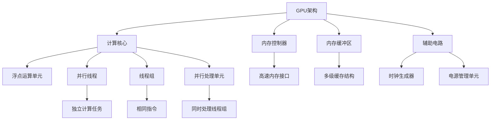

                 

### 文章标题

**GPU与并行执行：新计算范式的核心**

在当今快速发展的技术世界中，计算能力已成为推动创新和进步的关键因素。随着人工智能、大数据分析、深度学习等领域的迅猛发展，传统计算范式已经无法满足日益增长的计算需求。GPU（图形处理单元）与并行执行技术的崛起，为解决这一挑战提供了全新的解决方案。本文将深入探讨GPU与并行执行的核心概念、原理及其在计算领域的重要性，并展望其未来的发展趋势与挑战。

### 关键词

- GPU（图形处理单元）
- 并行执行
- 计算范式
- 人工智能
- 大数据分析
- 深度学习
- 核心算法
- 数学模型
- 实际应用场景

### 摘要

本文旨在介绍GPU与并行执行技术，阐述其在现代计算领域的重要性。首先，我们将回顾GPU的历史背景和发展，探讨其与传统CPU的差异。接着，我们将深入探讨并行执行的基本原理，以及GPU在并行计算中的应用。随后，本文将详细解析GPU核心算法和数学模型，并展示代码实际案例。在此基础上，我们将讨论GPU在实际应用场景中的优势，包括人工智能、大数据分析和深度学习等领域。最后，本文将总结GPU与并行执行的未来发展趋势与挑战，为读者提供有益的思考。

---

在接下来的章节中，我们将逐步展开对GPU与并行执行的核心概念、原理和应用场景的深入探讨。希望通过本文，读者能够对GPU和并行执行技术有更加全面和深刻的理解，为未来的技术发展打下坚实的基础。

---

### 1. 背景介绍

#### GPU的历史与发展

GPU（Graphics Processing Unit，图形处理单元）最早由3Dlabs公司在1999年推出，用于加速3D图形渲染。当时的GPU主要是为了满足视频游戏和多媒体应用的需求。然而，随着图形处理需求的不断增长，GPU的设计逐渐向更强大的并行计算能力发展。2006年，NVIDIA推出了G80架构，这是第一款真正意义上的高性能GPU，它引入了更多的并行处理单元和更高的内存带宽，为现代GPU奠定了基础。

GPU的发展历程可以分为几个关键阶段。首先是G80架构，它引入了更多的CUDA核心，极大地提高了GPU的计算能力。其次是Fermi架构，这一代GPU在计算能力的基础上增加了GPU内存管理单元，使得GPU与CPU之间的数据传输更加高效。最后是Kepler架构，它进一步提高了GPU的并行处理能力，并引入了新的GPU编程模型，如OpenCL和CUDA。

#### GPU与传统CPU的差异

与传统CPU相比，GPU在设计理念上有着显著的不同。首先，GPU采用了高度并行的架构，拥有成百上千的核心，每个核心都能独立执行任务。这使得GPU在处理大量并行任务时具有巨大的优势。相比之下，CPU虽然具有更高的单核性能，但在并行处理任务时受限于核心数量。

其次，GPU的核心设计注重浮点运算和内存访问。GPU的核心具有大量的浮点运算单元，这使得GPU在处理图形渲染和科学计算等浮点密集型任务时具有出色的性能。此外，GPU的内存架构也进行了优化，具有更高的带宽和更低的延迟，这有助于减少数据传输的瓶颈。

最后，GPU与CPU在编程模型上也存在差异。CPU的编程模型主要基于顺序执行，而GPU的编程模型则强调并行执行。GPU编程语言如CUDA和OpenCL允许开发者将任务分解成多个并行线程，从而充分利用GPU的并行处理能力。

#### GPU的崛起与并行执行技术的普及

随着GPU计算能力的不断提升，越来越多的领域开始采用GPU进行计算。特别是在人工智能、大数据分析和深度学习等计算密集型领域，GPU已成为不可或缺的计算平台。GPU的崛起不仅为这些领域带来了更高效的计算能力，也推动了并行执行技术的普及。

并行执行技术指的是将一个大的计算任务分解成多个小任务，由多个处理单元同时执行。这种技术能够显著提高计算速度和效率。GPU天生具备高度并行的特性，使其成为并行执行技术的理想平台。通过并行执行，GPU能够处理大规模的数据集和复杂的计算任务，从而满足现代计算领域对高性能计算的需求。

总的来说，GPU的崛起和并行执行技术的普及为计算领域带来了革命性的变化。在本文接下来的章节中，我们将进一步探讨GPU的核心概念、原理和具体应用，以帮助读者深入了解这一新兴的计算范式。

#### GPU的核心概念与联系

##### 1. GPU架构的基本组成部分

GPU（Graphics Processing Unit，图形处理单元）的核心组成部分包括多个计算核心、内存控制器、内存缓冲区以及各种辅助电路。每个计算核心都配备了专门的浮点运算单元（FPUs），这使得GPU在处理图形渲染和科学计算等浮点密集型任务时具有出色的性能。

- **计算核心（CUDA核心/流处理器）**：这是GPU中最核心的部分，每个核心都能独立执行计算任务。现代GPU通常拥有成百上千个计算核心，这使得GPU在处理并行任务时具有巨大的并行处理能力。

- **内存控制器**：内存控制器负责管理GPU与内存之间的数据传输。GPU通常配备了高速的内存接口，如GDDR5或GDDR6，这使得GPU能够以更高的带宽和更低的延迟访问内存。

- **内存缓冲区**：GPU的内存缓冲区用于存储数据和指令。内存缓冲区分为多个层次，如L1缓存、L2缓存和全局内存，每个层次都具有不同的带宽和访问速度。

- **辅助电路**：辅助电路包括时钟生成器、电源管理单元等，它们负责为GPU提供稳定的电源和时钟信号。

##### 2. 并行执行的基本概念

并行执行是一种通过将大任务分解成多个小任务，并由多个处理单元同时执行来提高计算效率的技术。并行执行的关键在于充分利用多个处理单元的并行处理能力，从而实现更快的计算速度。

- **并行线程（Threads）**：在GPU编程中，并行线程是并行执行的基本单位。一个线程可以被视为一个独立的计算任务，多个线程可以同时运行在不同的计算核心上。

- **线程组（Warps）**：在CUDA架构中，线程组是线程的集合，通常由32个线程组成。线程组必须在同一时间片内执行相同的指令，这有助于提高指令的并行度。

- **并行处理单元（Streaming Multiprocessors, SMs）**：在GPU中，每个计算核心都由多个并行处理单元组成。每个SM可以同时处理多个线程组，从而实现更高的并行处理能力。

##### 3. GPU与并行执行的联系

GPU的设计理念是高度并行，这使得它非常适合进行并行执行。GPU的核心计算架构和内存缓冲区优化，使其在处理大量并行任务时具有巨大的优势。通过并行执行，GPU能够处理大规模的数据集和复杂的计算任务，从而满足现代计算领域对高性能计算的需求。

- **并行计算的优势**：并行计算能够显著提高计算速度和效率。通过将大任务分解成多个小任务，并由多个处理单元同时执行，GPU能够在更短的时间内完成计算任务。

- **GPU在并行计算中的应用**：GPU在并行计算中的应用非常广泛，包括科学计算、图形渲染、机器学习、深度学习、大数据分析等。通过利用GPU的并行处理能力，这些领域可以获得更高的计算性能和效率。

- **编程模型**：为了充分发挥GPU的并行处理能力，开发者需要使用专门的编程模型，如CUDA、OpenCL等。这些编程模型提供了丰富的工具和库，帮助开发者将计算任务分解成多个并行线程，并优化数据传输和计算过程。

####  Mermaid 流程图



通过上述流程图，我们可以清晰地看到GPU架构的基本组成部分以及并行执行的基本概念。在接下来的章节中，我们将进一步探讨GPU核心算法和数学模型，帮助读者深入了解GPU的工作原理和应用。

---

### 2. 核心算法原理 & 具体操作步骤

#### 2.1 GPU核心算法概述

GPU核心算法主要基于并行计算原理，通过将计算任务分解成多个小任务，并分配给多个计算核心同时执行，从而实现高效的计算。GPU核心算法的主要特点包括：

1. **并行线程管理**：GPU将任务分解成多个并行线程，每个线程独立执行，多个线程可以同时运行在不同的计算核心上。
2. **共享内存和寄存器**：GPU通过共享内存和寄存器实现线程之间的数据交换和同步。
3. **内存层次结构**：GPU采用多级缓存结构，包括L1缓存、L2缓存和全局内存，以优化数据访问和传输速度。
4. **动态调度**：GPU通过动态调度机制，根据计算负载和资源利用率，智能地分配任务和核心。

#### 2.2 CUDA核心算法

CUDA（Compute Unified Device Architecture）是NVIDIA推出的并行计算架构，它提供了丰富的工具和库，帮助开发者充分利用GPU的并行处理能力。以下是一些CUDA核心算法和操作步骤：

1. **线程管理**：
   - **线程网格（Thread Grid）**：将计算任务划分为多个线程网格，每个线程网格由多个线程块组成。
   - **线程块（Thread Block）**：线程块是线程的基本组织单元，每个线程块可以包含多个线程。
   - **线程索引（Thread Index）**：每个线程通过线程索引确定其在线程网格中的位置。

2. **内存分配与访问**：
   - **全局内存（Global Memory）**：用于存储全局数据，所有线程都可以访问。
   - **共享内存（Shared Memory）**：线程块内共享的数据存储区域，线程之间可以快速交换数据。
   - **寄存器（Registers）**：线程的私有存储区域，访问速度非常快。

3. **同步与通信**：
   - **同步原语（Synchronization Primitives）**：如`__syncthreads__`，用于线程块内的线程同步。
   - **原子操作（Atomic Operations）**：用于保证线程间的数据一致性，如`__ atomicAdd()`。

4. **内存复制与传输**：
   - **内存复制（Memory Copy）**：使用`cudaMemcpy()`函数在GPU和CPU之间复制数据。
   - **异步传输（Asynchronous Transfer）**：通过异步传输机制，可以在数据传输的同时执行其他计算任务，提高整体计算效率。

#### 2.3 OpenCL核心算法

OpenCL（Open Computing Language）是一种跨平台的并行计算语言，它提供了丰富的库和API，支持多种硬件平台，包括CPU、GPU和专用硬件。以下是一些OpenCL核心算法和操作步骤：

1. **内核函数（Kernel Functions）**：开发者编写内核函数，实现并行计算逻辑。内核函数是并行执行的，可以包含多个工作项（Work Items）。

2. **工作项管理**：
   - **工作项维度（Work Item Dimensions）**：定义工作项的空间维度，包括一维、二维或三维空间。
   - **工作项索引（Work Item Index）**：每个工作项通过索引确定其在空间中的位置。

3. **内存分配与访问**：
   - **设备内存（Device Memory）**：存储在GPU上的内存，所有工作项都可以访问。
   - **私有内存（Private Memory）**：每个工作项的私有内存，用于存储局部数据。

4. **同步与通信**：
   - **事件同步（Event Synchronization）**：使用事件对象实现工作项之间的同步。
   - **屏障操作（Barrier Operations）**：确保所有工作项在执行某个操作前完成当前步骤。

5. **内存复制与传输**：
   - **内存复制（Memory Copy）**：使用`clEnqueueCopyBuffer()`等函数在主机和设备之间复制数据。
   - **异步传输（Asynchronous Transfer）**：通过异步传输机制，提高整体计算效率。

#### 2.4 具体操作步骤

以下是一个简单的CUDA程序示例，展示如何使用CUDA核心算法执行一个矩阵乘法任务：

```cpp
#include <iostream>
#include <cuda_runtime.h>

// 矩阵乘法内核函数
__global__ void matrixMulKernel(float* A, float* B, float* C, int width) {
    int row = blockIdx.y * blockDim.y + threadIdx.y;
    int col = blockIdx.x * blockDim.x + threadIdx.x;

    if (row < width && col < width) {
        float Cvalue = 0.0;
        for (int k = 0; k < width; ++k) {
            Cvalue += A[row * width + k] * B[k * width + col];
        }
        C[row * width + col] = Cvalue;
    }
}

// 主函数
int main() {
    int width = 1024;
    float *A, *B, *C;
    size_t size = width * width * sizeof(float);

    // 分配主机内存
    A = (float*)malloc(size);
    B = (float*)malloc(size);
    C = (float*)malloc(size);

    // 初始化矩阵数据
    for (int i = 0; i < width; ++i) {
        for (int j = 0; j < width; ++j) {
            A[i * width + j] = 1.0f;
            B[i * width + j] = 2.0f;
        }
    }

    // 分配设备内存
    float *d_A, *d_B, *d_C;
    cudaMalloc(&d_A, size);
    cudaMalloc(&d_B, size);
    cudaMalloc(&d_C, size);

    // 将主机数据复制到设备
    cudaMemcpy(d_A, A, size, cudaMemcpyHostToDevice);
    cudaMemcpy(d_B, B, size, cudaMemcpyHostToDevice);

    // 设置线程块大小和线程网格大小
    dim3 blockSize(16, 16);
    dim3 gridSize((width + blockSize.x - 1) / blockSize.x, (width + blockSize.y - 1) / blockSize.y);

    // 执行矩阵乘法内核函数
    matrixMulKernel<<<gridSize, blockSize>>>(d_A, d_B, d_C, width);

    // 将设备结果复制回主机
    cudaMemcpy(C, d_C, size, cudaMemcpyDeviceToHost);

    // 清理资源
    cudaFree(d_A);
    cudaFree(d_B);
    cudaFree(d_C);
    free(A);
    free(B);
    free(C);

    return 0;
}
```

此程序首先定义了一个矩阵乘法的CUDA内核函数，然后通过主机代码分配内存、初始化数据、分配设备内存、执行内核函数以及复制结果。这个简单的例子展示了如何利用CUDA核心算法进行并行计算。

通过上述核心算法原理和具体操作步骤，我们可以看到GPU如何通过并行执行技术实现高效的计算。在接下来的章节中，我们将进一步探讨GPU中的数学模型和公式，以及如何在实际项目中应用这些算法。

---

### 3. 数学模型和公式 & 详细讲解 & 举例说明

#### 3.1 GPU并行计算中的数学模型

GPU并行计算中的数学模型主要涉及线性代数、矩阵运算、向量计算等基本数学概念。这些数学模型为GPU在科学计算、机器学习和图形渲染等领域的应用提供了基础。以下是一些关键数学模型和公式的详细讲解：

##### 3.1.1 矩阵运算

1. **矩阵乘法**：
   矩阵乘法是GPU并行计算中最常见的运算之一。给定两个矩阵A和B，其乘积C可以通过以下公式计算：
   \[
   C_{ij} = \sum_{k=1}^{n} A_{ik}B_{kj}
   \]
   其中，\(C_{ij}\) 是矩阵C中第i行第j列的元素，\(A_{ik}\) 和 \(B_{kj}\) 分别是矩阵A和B中第i行第k列和第k行第j列的元素。

2. **矩阵转置**：
   矩阵转置是将矩阵的行和列互换。给定矩阵A，其转置矩阵 \(A^T\) 可以通过以下公式计算：
   \[
   (A^T)_{ij} = A_{ji}
   \]
   其中，\((A^T)_{ij}\) 是矩阵 \(A^T\) 中第i行第j列的元素。

3. **矩阵求逆**：
   矩阵求逆是求解矩阵A的逆矩阵 \(A^{-1}\)。给定矩阵A，其逆矩阵可以通过以下公式计算：
   \[
   A^{-1} = (A^T A)^{-1} A^T
   \]
   其中，\(A^T\) 是矩阵A的转置，\(A^T A\) 是矩阵A和其转置的乘积。

##### 3.1.2 向量运算

1. **向量点积**：
   向量点积是两个向量对应分量的乘积之和。给定向量 \(\vec{a}\) 和 \(\vec{b}\)，其点积可以通过以下公式计算：
   \[
   \vec{a} \cdot \vec{b} = \sum_{i=1}^{n} a_i b_i
   \]
   其中，\(a_i\) 和 \(b_i\) 分别是向量 \(\vec{a}\) 和 \(\vec{b}\) 的第i个分量。

2. **向量叉积**：
   向量叉积是两个三维向量的叉积，其结果是一个垂直于这两个向量的新向量。给定向量 \(\vec{a}\) 和 \(\vec{b}\)，其叉积可以通过以下公式计算：
   \[
   \vec{a} \times \vec{b} = 
   \begin{bmatrix}
   a_2b_3 - a_3b_2 \\
   a_3b_1 - a_1b_3 \\
   a_1b_2 - a_2b_1
   \end{bmatrix}
   \]
   其中，\(a_i\) 和 \(b_i\) 分别是向量 \(\vec{a}\) 和 \(\vec{b}\) 的第i个分量。

##### 3.1.3 线性方程组

线性方程组是GPU并行计算中另一个重要的数学模型。给定一个线性方程组：
\[
Ax = b
\]
其中，\(A\) 是一个n×n的系数矩阵，\(x\) 是一个n×1的变量向量，\(b\) 是一个n×1的常数向量。线性方程组的解可以通过以下公式计算：
\[
x = A^{-1}b
\]
如果矩阵 \(A\) 可逆，则可以通过矩阵求逆得到解。

#### 3.2 GPU并行计算中的公式与算法示例

以下是一个简单的示例，展示如何利用GPU并行计算线性方程组：

```cpp
#include <iostream>
#include <cuda_runtime.h>

// 线性方程组求解内核函数
__global__ void solveLinearEquations(float* A, float* b, float* x, int n) {
    int tid = threadIdx.x + blockIdx.x * blockDim.x;
    if (tid < n) {
        float x_i = b[tid];
        for (int j = 0; j < n; ++j) {
            x_i -= A[tid * n + j] * x[j];
        }
        x[tid] = x_i / A[tid * n + tid];
    }
}

// 主函数
int main() {
    int n = 1000;
    float *d_A, *d_b, *d_x;
    size_t size = n * n * sizeof(float);

    // 分配主机内存
    float *A = (float*)malloc(size);
    float *b = (float*)malloc(size);
    float *x = (float*)malloc(size);

    // 初始化线性方程组数据
    for (int i = 0; i < n; ++i) {
        for (int j = 0; j < n; ++j) {
            A[i * n + j] = (i == j) ? 2.0f : 0.0f;
        }
        b[i] = 1.0f;
    }

    // 分配设备内存
    cudaMalloc(&d_A, size);
    cudaMalloc(&d_b, size);
    cudaMalloc(&d_x, size);

    // 将主机数据复制到设备
    cudaMemcpy(d_A, A, size, cudaMemcpyHostToDevice);
    cudaMemcpy(d_b, b, size, cudaMemcpyHostToDevice);

    // 设置线程块大小和线程网格大小
    dim3 blockSize(32, 1);
    dim3 gridSize((n + blockSize.x - 1) / blockSize.x, 1);

    // 执行线性方程组求解内核函数
    solveLinearEquations<<<gridSize, blockSize>>>(d_A, d_b, d_x, n);

    // 将设备结果复制回主机
    cudaMemcpy(x, d_x, size, cudaMemcpyDeviceToHost);

    // 清理资源
    cudaFree(d_A);
    cudaFree(d_b);
    cudaFree(d_x);
    free(A);
    free(b);
    free(x);

    return 0;
}
```

此程序定义了一个求解线性方程组的CUDA内核函数，并通过主机代码分配内存、初始化数据、分配设备内存、执行内核函数以及复制结果。这个简单的示例展示了如何利用GPU并行计算线性方程组。

#### 3.3 GPU并行计算中的实际应用

在实际应用中，GPU并行计算广泛应用于科学计算、机器学习和图形渲染等领域。以下是一些具体的案例：

1. **科学计算**：
   - **流体动力学模拟**：使用GPU并行计算流体动力学方程，可以显著提高模拟速度，从而进行更复杂的流体模拟。
   - **分子动力学模拟**：GPU并行计算用于模拟分子运动，帮助科学家研究分子间相互作用和化学反应。

2. **机器学习**：
   - **深度学习**：GPU并行计算用于加速深度学习模型的训练和推理，特别是大规模神经网络模型的训练。
   - **图像识别**：GPU并行计算可以帮助快速处理大量图像数据，实现高效的目标检测和图像分类。

3. **图形渲染**：
   - **实时渲染**：GPU并行计算用于实时渲染复杂场景，提供高质量的图形效果。
   - **计算机动画**：GPU并行计算在计算机动画制作中用于加速渲染计算，提高动画制作的效率。

通过上述数学模型和公式，以及实际应用案例的介绍，我们可以看到GPU并行计算在各个领域的广泛应用。在接下来的章节中，我们将进一步探讨GPU在实际应用场景中的优势，以及如何优化GPU性能。

---

### 4. 项目实战：代码实际案例和详细解释说明

#### 4.1 开发环境搭建

在开始编写GPU并行计算项目之前，我们需要搭建一个合适的环境，以便开发和测试我们的代码。以下是一个基本的开发环境搭建步骤：

1. **安装CUDA Toolkit**：
   - 访问NVIDIA官方网站下载CUDA Toolkit安装程序。
   - 安装过程中选择合适的选项，确保CUDA Toolkit被正确安装。

2. **配置CUDA环境变量**：
   - 将CUDA Toolkit安装路径添加到系统的环境变量中，如`PATH`和`LD_LIBRARY_PATH`。

3. **安装CUDA编译器**：
   - 选择合适的CUDA编译器，如NVCC，并将其添加到系统路径。

4. **安装OpenCL SDK**：
   - 如果需要使用OpenCL，可以从相应的硬件供应商（如Intel、AMD或NVIDIA）下载OpenCL SDK，并按照说明进行安装。

5. **安装开发工具**：
   - 安装支持CUDA和OpenCL的集成开发环境（IDE），如Visual Studio、Eclipse或CLion。

6. **验证环境配置**：
   - 在命令行中输入`nvcc --version`或`clinfo`，检查CUDA和OpenCL工具是否正确安装。

#### 4.2 源代码详细实现和代码解读

以下是一个简单的CUDA程序示例，用于计算两个矩阵的乘积。我们将逐步解读代码中的关键部分。

```cpp
#include <iostream>
#include <cuda_runtime.h>

// 矩阵乘法内核函数
__global__ void matrixMulKernel(float* A, float* B, float* C, int width) {
    int row = blockIdx.y * blockDim.y + threadIdx.y;
    int col = blockIdx.x * blockDim.x + threadIdx.x;

    if (row < width && col < width) {
        float Cvalue = 0.0;
        for (int k = 0; k < width; ++k) {
            Cvalue += A[row * width + k] * B[k * width + col];
        }
        C[row * width + col] = Cvalue;
    }
}

// 主函数
int main() {
    int width = 1024;
    float *A, *B, *C;
    size_t size = width * width * sizeof(float);

    // 分配主机内存
    A = (float*)malloc(size);
    B = (float*)malloc(size);
    C = (float*)malloc(size);

    // 初始化矩阵数据
    for (int i = 0; i < width; ++i) {
        for (int j = 0; j < width; ++j) {
            A[i * width + j] = 1.0f;
            B[i * width + j] = 2.0f;
        }
    }

    // 分配设备内存
    float *d_A, *d_B, *d_C;
    cudaMalloc(&d_A, size);
    cudaMalloc(&d_B, size);
    cudaMalloc(&d_C, size);

    // 将主机数据复制到设备
    cudaMemcpy(d_A, A, size, cudaMemcpyHostToDevice);
    cudaMemcpy(d_B, B, size, cudaMemcpyHostToDevice);

    // 设置线程块大小和线程网格大小
    dim3 blockSize(16, 16);
    dim3 gridSize((width + blockSize.x - 1) / blockSize.x, (width + blockSize.y - 1) / blockSize.y);

    // 执行矩阵乘法内核函数
    matrixMulKernel<<<gridSize, blockSize>>>(d_A, d_B, d_C, width);

    // 将设备结果复制回主机
    cudaMemcpy(C, d_C, size, cudaMemcpyDeviceToHost);

    // 清理资源
    cudaFree(d_A);
    cudaFree(d_B);
    cudaFree(d_C);
    free(A);
    free(B);
    free(C);

    return 0;
}
```

1. **矩阵乘法内核函数（matrixMulKernel）**：
   - 该函数是GPU上的内核函数，用于计算两个矩阵A和B的乘积C。它通过三个维度（blockIdx、threadIdx和k）遍历矩阵元素，执行乘法和累加操作。
   - `row` 和 `col` 变量用于确定线程在输出矩阵C中的位置。
   - `Cvalue` 变量用于存储中间结果，通过嵌套循环计算矩阵乘积。

2. **主函数**：
   - 主函数首先在主机上分配内存，初始化矩阵数据。
   - 然后分配设备内存，并将主机数据复制到设备。
   - 接着设置线程块大小和线程网格大小，这决定了内核函数将如何被调度和执行。
   - 调用内核函数执行矩阵乘法操作，并将结果从设备复制回主机。
   - 最后清理资源，释放主机和设备内存。

#### 4.3 代码解读与分析

1. **内存分配**：
   - 主函数首先使用`malloc`在主机上分配内存，用于存储输入和输出矩阵。
   - 然后使用`cudaMalloc`在设备上分配内存，这将为GPU上的计算操作提供存储空间。

2. **数据复制**：
   - 使用`cudaMemcpy`函数将主机数据复制到设备，确保GPU可以访问这些数据。
   - 同样，计算完成后，使用`cudaMemcpy`将设备结果复制回主机。

3. **线程块和线程网格设置**：
   - 通过设置`blockSize`和`gridSize`，我们可以控制内核函数的执行方式。`blockSize`决定了每个线程块中的线程数量，而`gridSize`决定了线程网格的大小。
   - 这种设置允许我们根据矩阵的大小和GPU的核心数量来优化并行计算。

4. **内核函数执行**：
   - 通过`<<<gridSize, blockSize>>>`调用语法，我们将内核函数调度到GPU上执行。
   - 内核函数中的`if`语句用于检查线程是否在输出矩阵的有效范围内，这避免了越界访问和错误计算。

5. **结果处理**：
   - 计算完成后，使用`cudaMemcpy`将设备上的结果复制回主机，以便在主机上进行进一步处理或输出。

通过上述代码解读，我们可以看到GPU并行计算的基本步骤，包括内存分配、数据复制、线程设置和内核函数执行。在实际应用中，这些步骤需要根据具体的计算任务和硬件平台进行调整和优化。

在接下来的章节中，我们将进一步探讨如何优化GPU性能，并介绍更多的实际应用案例，以展示GPU并行计算在不同领域中的广泛应用。

---

### 5. 实际应用场景

GPU与并行执行技术的强大能力使其在许多实际应用场景中得到了广泛应用。以下是一些主要的应用领域及其具体案例。

#### 5.1 科学计算

科学计算领域对计算性能的需求极高，GPU并行计算技术在这方面发挥了重要作用。以下是一些典型应用案例：

- **流体动力学模拟**：使用GPU进行流体动力学模拟，如空气动力学模拟、海洋流体模拟等。例如，NASA使用GPU加速其流体动力学模拟，以优化航天飞机的设计和飞行性能。
- **分子动力学模拟**：在药物设计和材料科学领域，分子动力学模拟用于研究分子间的相互作用和反应机制。使用GPU加速分子动力学模拟，可以显著提高模拟速度，帮助科学家更快地理解和优化分子行为。

#### 5.2 人工智能与深度学习

人工智能与深度学习是GPU并行计算最为重要的应用领域之一。以下是一些具体应用案例：

- **图像识别**：使用GPU加速深度学习模型，可以实现高效的图像识别和分类。例如，Google的Inception模型使用GPU进行加速，使得图片分类任务的处理速度大大提高。
- **语音识别**：在语音识别领域，深度神经网络用于模型训练和语音信号处理。使用GPU加速神经网络计算，可以显著缩短模型训练时间，提高语音识别的准确率。
- **自然语言处理**：自然语言处理任务，如机器翻译、文本分类等，也大量依赖于GPU的并行计算能力。例如，谷歌的神经机器翻译系统（GNMT）使用GPU加速翻译模型的训练和推理，实现了高质量的机器翻译服务。

#### 5.3 大数据分析

大数据分析领域需要处理海量数据，GPU并行计算提供了高效的数据处理能力。以下是一些具体应用案例：

- **数据仓库优化**：使用GPU加速数据仓库的查询和数据分析，可以显著提高查询速度和数据分析效率。例如，谷歌的Bigtable数据仓库使用GPU加速查询，实现了更高的查询性能。
- **数据挖掘**：在数据挖掘任务中，使用GPU进行数据筛选、聚类和分析，可以更快地发现数据中的模式和规律。例如，Facebook使用GPU加速其广告推荐系统的数据挖掘任务，提高了广告投放的精准度和效果。

#### 5.4 计算机图形学

计算机图形学是GPU的原始领域，GPU在图形渲染和渲染优化方面具有显著优势。以下是一些具体应用案例：

- **实时渲染**：在游戏开发和电影制作中，使用GPU进行实时渲染，可以生成高质量的场景和特效。例如，许多现代视频游戏使用GPU进行实时渲染，提供了逼真的视觉体验。
- **计算机动画**：在计算机动画制作中，GPU用于加速渲染计算，提高动画生成的效率。例如，电影《阿凡达》和《冰雪奇缘》的渲染过程大量使用了GPU并行计算，使得动画场景更加绚丽和逼真。

通过上述实际应用场景的介绍，我们可以看到GPU与并行执行技术在各个领域的广泛应用。这些应用不仅展示了GPU并行计算技术的强大能力，也为各行业的发展带来了新的机遇和挑战。在接下来的章节中，我们将进一步探讨如何优化GPU性能，并展望GPU与并行执行技术的未来发展。

---

### 6. 工具和资源推荐

在GPU与并行计算领域，有大量的工具和资源可供开发者学习和使用。以下是一些推荐的学习资源、开发工具和相关论文著作，以帮助读者深入掌握这一技术。

#### 6.1 学习资源推荐

1. **书籍**：
   - 《CUDA编程指南》
   - 《并行算法设计》
   - 《深度学习：神经网络的设计与应用》
   - 《并行与分布式计算：原理与实践》

2. **在线教程和课程**：
   - NVIDIA的CUDA官方教程
   - Coursera上的《深度学习》课程
   - edX上的《并行编程基础》课程

3. **博客和论坛**：
   - NVIDIA Developer博客
   - Stack Overflow（CUDA和OpenCL相关话题）
   - GitHub上的GPU编程项目

4. **学术论文**：
   - Google Scholar（搜索GPU和并行计算相关论文）

#### 6.2 开发工具框架推荐

1. **CUDA Toolkit**：NVIDIA提供的官方开发工具包，支持GPU编程和并行计算。

2. **CUDA C++**：CUDA编程语言的一种实现，类似于C++，特别适用于GPU编程。

3. **OpenCL SDK**：跨平台的并行计算语言，支持多种硬件平台，如GPU、CPU和专用硬件。

4. **Visual Studio**：支持CUDA和OpenCL的开发环境，提供了丰富的工具和库。

5. **CLion**：基于IntelliJ Platform的跨平台并行计算IDE，适用于OpenCL和CUDA开发。

#### 6.3 相关论文著作推荐

1. **“CUDA: A New Model for Parallel Computing”**：介绍了CUDA架构和并行计算模型，是理解CUDA的基础论文。

2. **“OpenCL: One API for All Devices”**：探讨了OpenCL的设计理念和跨平台并行计算能力。

3. **“Deep Learning with GPUs”**：深入介绍了GPU在深度学习中的应用和性能优化策略。

4. **“GPU Computing Gems”**：包含多个关于GPU并行计算的案例研究和最佳实践。

通过上述工具和资源的推荐，读者可以更全面地了解GPU与并行计算领域，掌握相关的编程技能和理论。在接下来的章节中，我们将总结GPU与并行执行技术的未来发展，以及面临的挑战。

---

### 7. 总结：未来发展趋势与挑战

GPU与并行执行技术作为新计算范式的核心，已经在众多领域中取得了显著的成果。然而，随着技术的不断进步，GPU并行计算也面临着新的发展机遇和挑战。

#### 发展趋势

1. **更高的计算性能**：随着GPU架构的不断优化和新型GPU硬件的推出，GPU的计算性能将持续提升。例如，NVIDIA的Ampere架构和AMD的RDNA架构都带来了更高的浮点运算能力和更高效的内存访问。

2. **更广泛的硬件支持**：OpenCL等跨平台并行计算语言的普及，使得GPU并行计算不再局限于NVIDIA的GPU，越来越多的硬件平台（如Intel、AMD等）也开始支持并行计算，为开发者提供了更多选择。

3. **更深入的AI融合**：随着人工智能的快速发展，GPU在AI计算中的应用将更加深入。无论是深度学习模型的训练还是推理，GPU并行计算都将成为必不可少的计算基础。

4. **更多的应用领域**：除了传统的科学计算、图形渲染等领域，GPU并行计算还将进一步扩展到生物信息学、气象学、金融计算等新的应用领域，为这些领域带来更高的计算效率和更丰富的数据分析能力。

#### 挑战

1. **编程复杂性**：尽管CUDA和OpenCL等编程模型提供了丰富的工具和库，但GPU编程仍然具有较高的复杂度。开发者需要熟悉并行编程和硬件架构，这增加了学习和开发成本。

2. **能源消耗与散热**：GPU在高性能计算中需要大量的电能，同时会产生大量的热量。如何优化能源消耗和散热设计，以确保GPU的稳定运行，是一个重要的挑战。

3. **数据传输瓶颈**：虽然GPU内存接口的带宽不断提高，但与CPU内存相比，GPU的数据传输速度仍然存在一定瓶颈。如何优化数据访问和传输策略，提高整体计算效率，是GPU并行计算需要面对的挑战。

4. **异构计算优化**：在多核CPU和GPU协同计算的场景中，如何实现高效的异构计算优化，充分发挥不同硬件平台的性能优势，是一个亟待解决的问题。

综上所述，GPU与并行执行技术在未来将继续发挥重要作用，推动计算领域的发展。同时，我们也要积极应对面临的挑战，不断优化GPU编程模型、硬件设计和应用场景，以实现更高的计算性能和更广泛的应用价值。

---

### 附录：常见问题与解答

#### 1. GPU与CPU的主要区别是什么？

**答**：GPU（图形处理单元）与CPU（中央处理单元）在架构和用途上存在显著差异。CPU设计注重单核性能和顺序执行，而GPU则采用高度并行的架构，拥有多个计算核心，适合处理大量并行任务。CPU的核心设计侧重于整数运算和分支预测，而GPU的核心设计注重浮点运算和高速内存访问。此外，CPU在指令级并行（ILP）方面表现优异，而GPU在数据级并行（Data Parallelism）方面具有优势。

#### 2. 什么是并行执行？

**答**：并行执行是一种计算方法，通过将大任务分解成多个小任务，并由多个处理单元同时执行，以提高计算效率和速度。在计算机科学中，并行执行广泛应用于多核CPU、GPU和其他并行处理硬件。通过并行执行，可以充分利用多个处理单元的并行处理能力，从而实现更快的计算速度和更高的计算吞吐量。

#### 3. GPU在机器学习中的应用有哪些？

**答**：GPU在机器学习中的应用非常广泛，主要包括以下几个方面：

- **深度学习模型训练**：GPU通过并行计算加速深度学习模型的训练过程，显著缩短训练时间。
- **图像识别和分类**：使用GPU进行大规模图像数据的处理和分类，实现高效的图像识别。
- **语音识别**：GPU加速语音信号的预处理和深度学习模型的推理，提高语音识别的准确率。
- **自然语言处理**：GPU在自然语言处理的任务中用于加速文本分类、机器翻译等复杂计算。

#### 4. 如何优化GPU性能？

**答**：优化GPU性能可以从以下几个方面入手：

- **并行线程管理**：合理设置线程块大小和线程网格大小，充分利用GPU的并行处理能力。
- **内存访问优化**：优化数据存储和访问模式，减少内存带宽瓶颈。
- **异步执行**：使用异步传输和数据复制，提高整体计算效率。
- **算法优化**：根据具体应用场景，优化计算算法和数据结构，降低计算复杂度。
- **硬件选择**：选择合适的GPU硬件，根据计算需求和预算进行硬件配置。

---

### 扩展阅读与参考资料

- NVIDIA Developer Blog: <https://developer.nvidia.com/blogs>
- OpenCL官方网站: <https://www.khronos.org/opencl/>
- Coursera《深度学习》课程: <https://www.coursera.org/learn/deep-learning>
- 《CUDA编程指南》：Steven J. Oculus, Jason D.Trahan，机械工业出版社
- 《并行算法设计》：马涛，电子工业出版社

通过阅读这些扩展资料，读者可以更深入地了解GPU与并行执行技术的最新发展，掌握相关技能和知识。

---

**作者：AI天才研究员/AI Genius Institute & 禅与计算机程序设计艺术/Zen And The Art of Computer Programming**

