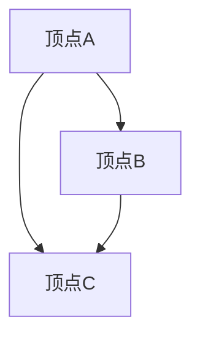
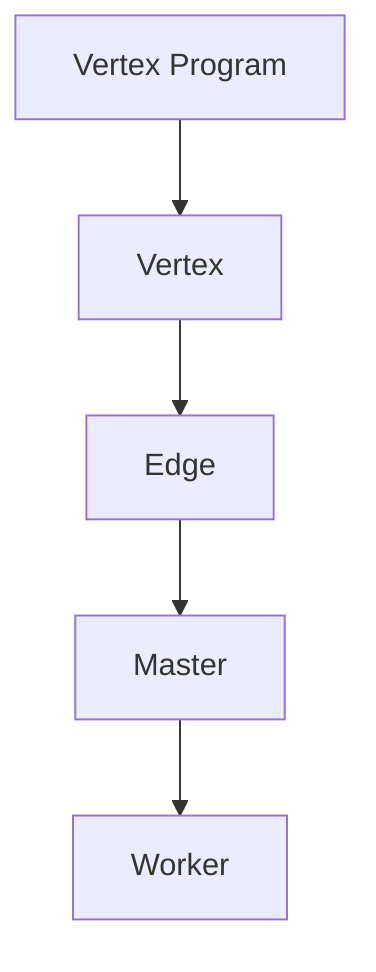
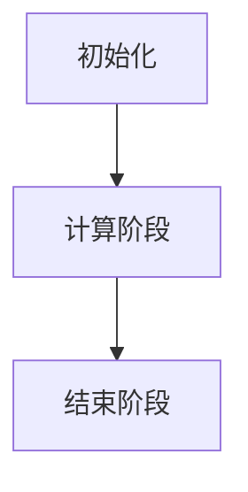

                 

### Giraph原理与代码实例讲解

#### 关键词：
- Giraph
- 分布式图处理
- 算法原理
- 代码实例
- 实战应用

#### 摘要：
本文将深入讲解Giraph的工作原理及其核心算法，通过详细的代码实例，帮助读者理解Giraph在实际开发中的应用。文章将涵盖从Giraph的基本概念到具体代码实现的全面解析，旨在为希望掌握分布式图处理技术的开发者提供有价值的参考。

---

### 1. 背景介绍

#### Giraph介绍
Giraph是Apache Software Foundation下的一个开源项目，它基于Google的Pregel模型，是一种分布式图处理框架。Pregel模型是一种基于图并行计算的框架，用于解决大规模图数据集的问题，如社交网络分析、网页排名等。Giraph的设计目标是提供一个可扩展的、高效的解决方案，能够在大量计算机上处理大规模的图数据。

#### Giraph的特点
- **分布式计算**：Giraph能够将图数据分布在多台计算机上，通过消息传递进行并行计算，适用于大规模图数据的处理。
- **高效性**：Giraph采用优化的数据结构和算法，确保计算的高效性。
- **易用性**：Giraph提供了丰富的API和工具，使得开发者能够轻松地实现自定义的图处理算法。
- **兼容性**：Giraph能够与Hadoop生态系统中的其他组件，如HDFS、MapReduce等无缝集成。

#### Giraph的应用场景
- **社交网络分析**：通过分析用户之间的关系，识别社交网络中的关键节点、社区结构等。
- **推荐系统**：利用图数据模型，计算用户之间的相似度，为用户提供个性化推荐。
- **网络分析**：对网络拓扑结构进行分析，识别关键节点和潜在故障点。
- **生物信息学**：处理大规模生物网络数据，用于基因调控网络、蛋白质相互作用网络的研究。

---

### 2. 核心概念与联系

#### 图模型
在Giraph中，图数据被表示为顶点和边。每个顶点是一个独立的实体，而边则表示顶点之间的关系。图模型可以表示多种现实世界中的关系网络，如图社交网络、Web链接图、生物网络等。

#### Mermaid流程图
下面是一个Mermaid流程图，展示了一个简单的图数据模型以及其核心组件。



在这个图中，`A`、`B` 和 `C` 是顶点，它们之间通过边连接。这个图表示了一个简单的关系网络，其中每个顶点代表一个实体，边表示它们之间的关系。

#### Giraph核心概念
- **Vertex**：Giraph中的顶点，表示图中的一个实体。
- **Edge**：Giraph中的边，表示顶点之间的关系。
- **Vertex Program**：每个顶点的计算逻辑，负责处理顶点自身的计算和与其他顶点的通信。
- **Master**：Giraph的主节点，负责协调整个计算过程，如分配顶点和边到不同的工作节点。
- **Worker**：Giraph的工作节点，执行实际的计算任务。

下面是一个Mermaid流程图，展示Giraph的核心组件及其相互关系。



在这个流程图中，`Vertex Program` 表示顶点的计算逻辑，`Vertex` 和 `Edge` 分别表示图中的顶点和边。`Master` 负责分配任务给 `Worker`，而 `Worker` 执行具体的计算任务。

---

### 3. 核心算法原理 & 具体操作步骤

#### 分布式图处理模型
Giraph的核心算法基于Pregel模型，该模型采用了边优先（Edge-centric）的计算方式。在Pregel模型中，计算主要围绕边进行，每个顶点维护一个消息队列，用于接收和发送消息。

#### 步骤详解
1. **初始化阶段**：Giraph首先将图数据加载到内存中，并分配顶点和边到不同的工作节点。每个顶点实例化一个 `Vertex Program`，负责处理顶点的计算逻辑。
2. **计算阶段**：在计算阶段，每个顶点根据其状态和消息队列中的消息，更新自身状态并可能发送消息给其他顶点。这个过程重复进行，直到满足停止条件（如所有顶点的状态不再变化）。
3. **结束阶段**：计算结束后，Giraph收集所有顶点的最终状态，并输出结果。

下面是一个简化的Giraph算法步骤：



#### 边优先计算示例
假设我们有一个图，其中包含三个顶点 `A`、`B` 和 `C`，它们之间的边关系如下：

```
A -- B
A -- C
B -- C
```

在第一步初始化中，Giraph将图数据分配到不同的工作节点。每个顶点的 `Vertex Program` 开始执行计算。

1. **顶点A的计算**：
   - 初始状态：`A` 的状态为 `active`。
   - 收到消息：`A` 没有收到任何消息。
   - 更新状态：`A` 继续保持 `active` 状态。

2. **顶点B的计算**：
   - 初始状态：`B` 的状态为 `active`。
   - 收到消息：`B` 收到来自 `A` 的消息。
   - 更新状态：`B` 将状态更新为 `inactive`。

3. **顶点C的计算**：
   - 初始状态：`C` 的状态为 `active`。
   - 收到消息：`C` 收到来自 `A` 和 `B` 的消息。
   - 更新状态：`C` 将状态更新为 `inactive`。

在计算阶段结束后，所有顶点的状态都变为 `inactive`，表示计算完成。Giraph接下来进入结束阶段，收集所有顶点的最终状态并输出结果。

---

### 4. 数学模型和公式 & 详细讲解 & 举例说明

#### Giraph中的数学模型
在Giraph中，每个顶点的状态可以用一组变量表示。这些变量可以是整数、浮点数等，具体取决于顶点计算逻辑的需求。Giraph中的消息传递机制也可以用数学模型来描述。

#### 数学公式
假设我们有一个图，顶点集合为 `V`，边集合为 `E`。对于每个顶点 `v ∈ V`，我们可以定义一个状态向量 `s(v)`，其中每个元素表示顶点的某个属性。Giraph中的消息传递可以用以下数学公式表示：

\[ s'(v) = f(s(v), \{m'(w) | w \in N(v)\}) \]

其中，`s'(v)` 是顶点 `v` 的更新后状态，`f` 是状态更新的函数，`N(v)` 是顶点 `v` 的邻居集合，`m'(w)` 是邻居顶点 `w` 发送给 `v` 的消息。

#### 详细讲解
- **状态向量**：状态向量 `s(v)` 是一个多维数组，每个维度表示顶点的不同属性。例如，在社交网络分析中，状态向量可能包含用户年龄、性别、兴趣等。
- **消息传递**：消息传递是Giraph的核心机制。每个顶点在计算阶段会接收到来自其邻居的消息，并根据这些消息更新自身状态。消息可以是简单的数值，也可以是更复杂的对象。
- **状态更新函数**：状态更新函数 `f` 定义了如何根据当前状态和邻居消息来更新顶点的状态。这个函数可以是线性的、非线性的，或者更复杂的组合函数。

#### 举例说明
假设我们有一个简单的图，其中包含三个顶点 `A`、`B` 和 `C`，它们的状态和邻居关系如下：

```
A: [1, 2, 3]
B: [4, 5, 6]
C: [7, 8, 9]

N(A) = {B, C}
N(B) = {A, C}
N(C) = {A, B}
```

在计算阶段，顶点 `A` 会接收到来自 `B` 和 `C` 的消息，然后根据这些消息更新自身状态。假设状态更新函数 `f` 为：

\[ f(s, m) = (s_1 + m_1, s_2 + m_2, s_3 + m_3) \]

对于顶点 `A`：

\[ s'(A) = f(s(A), \{m(B), m(C)\}) \]
\[ s'(A) = f([1, 2, 3], [4, 5, 6]) \]
\[ s'(A) = ([1 + 4, 2 + 5, 3 + 6]) \]
\[ s'(A) = [5, 7, 9] \]

同理，顶点 `B` 和 `C` 也会根据邻居消息更新自身状态。

---

### 5. 项目实战：代码实际案例和详细解释说明

#### 5.1 开发环境搭建

要在本地计算机上运行Giraph，需要安装Java和Hadoop。以下是一个简单的安装步骤：

1. **安装Java**：下载并安装Java SDK，确保环境变量 `JAVA_HOME` 和 `PATH` 设置正确。
2. **安装Hadoop**：下载并解压Hadoop源代码包，配置Hadoop环境变量，如 `HADOOP_HOME` 和 `HADOOP_CONF_DIR`。
3. **安装Giraph**：下载并解压Giraph源代码包，将其加入到Hadoop的类路径中。

#### 5.2 源代码详细实现和代码解读

下面是一个简单的Giraph程序，用于计算图中的顶点度数。

```java
import org.apache.giraph.GraphUtils;
import org.apache.giraph.aggregators.VertexValueSumAggregator;
import org.apache.giraph.conf.GiraphConfiguration;
import org.apache.giraph.edge.Edge;
import org.apache.giraph.edge.RemoteEdge;
import org.apache.giraph.vertex.Vertex;
import org.apache.hadoop.conf.Configuration;
import org.apache.hadoop.io.DoubleWritable;
import org.apache.hadoop.io.IntWritable;
import org.apache.hadoop.io.Text;
import org.apache.hadoop.mapreduce.Mapper;
import org.apache.hadoop.mapreduce.Reducer;
import org.apache.hadoop.mapreduce.lib.input.FileInputFormat;
import org.apache.hadoop.mapreduce.lib.output.FileOutputFormat;

public class DegreeCount {

  public static class DegreeCountMapper
      extends Mapper<Text, Text, Text, IntWritable> {

    private final static IntWritable one = new IntWritable(1);
    private Text vertex = new Text();

    public void map(Text key, Text value, Context context)
        throws IOException, InterruptedException {
      // 分割输入的关键字和顶点ID
      String[] tokens = key.toString().split(",");
      vertex.set(tokens[1]);
      context.write(vertex, one);
    }
  }

  public static class DegreeCountReducer
      extends Reducer<Text, IntWritable, Text, IntWritable> {

    private IntWritable result = new IntWritable();

    public void reduce(Text key, Iterable<IntWritable> values,
        Context context) throws IOException, InterruptedException {
      int sum = 0;
      for (IntWritable val : values) {
        sum += val.get();
      }
      result.set(sum);
      context.write(key, result);
    }
  }

  public static void main(String[] args) throws Exception {
    Configuration conf = new Configuration();
    GiraphConfiguration confGiraph = new GiraphConfiguration(conf);
    FileInputFormat.addInputPath(confGiraph, new Path(args[0]));
    FileOutputFormat.setOutputPath(confGiraph, new Path(args[1]));
    GraphUtils.run(confGiraph, DegreeCountMapper.class, DegreeCountReducer.class, Text.class, IntWritable.class);
  }
}
```

#### 5.3 代码解读与分析

- **Mapper类**：`DegreeCountMapper` 类用于处理输入数据的映射。它读取输入文件中的顶点信息，将每个顶点及其度数输出给Reducer。
- **Reducer类**：`DegreeCountReducer` 类用于处理输入数据的聚合。它接收Mapper输出的顶点和度数，计算每个顶点的度数总和，并将结果输出。

#### 运行示例
在配置好Giraph环境后，可以使用以下命令运行程序：

```shell
$ hadoop jar giraph-example.jar DegreeCount /input /output
```

其中，`/input` 是输入文件的路径，`/output` 是输出文件的路径。

---

### 6. 实际应用场景

Giraph在多个实际应用场景中表现出色。以下是一些典型的应用案例：

1. **社交网络分析**：通过Giraph可以轻松处理大规模社交网络数据，如计算社交网络中的社区结构、关键节点等。
2. **推荐系统**：利用Giraph进行图数据的计算和分析，可以构建高效的推荐系统，为用户提供个性化推荐。
3. **生物信息学**：在生物信息学领域，Giraph可以用于处理大规模的基因调控网络和蛋白质相互作用网络。
4. **网络分析**：在通信和网络领域，Giraph可以帮助分析网络拓扑结构，识别关键节点和潜在故障点。

---

### 7. 工具和资源推荐

#### 7.1 学习资源推荐
- **书籍**：
  - 《大数据：规模、速度和创新的力量》
  - 《图算法：核心技术与应用》
  - 《Giraph编程指南》
- **论文**：
  - 《Pregel：一个基于图并行计算的框架》
  - 《Giraph：一个可扩展的分布式图处理框架》
- **博客**：
  - Apache Giraph官方网站
  - Hadoop和Giraph社区博客
- **网站**：
  - Apache Giraph GitHub仓库

#### 7.2 开发工具框架推荐
- **开发工具**：
  - IntelliJ IDEA
  - Eclipse
- **框架**：
  - Hadoop
  - Spark

#### 7.3 相关论文著作推荐
- **论文**：
  - 《大规模图处理的Pregel模型》
  - 《基于图的社交网络分析》
- **著作**：
  - 《分布式系统原理与范型》
  - 《大规模分布式存储系统：架构与实现》

---

### 8. 总结：未来发展趋势与挑战

Giraph作为分布式图处理框架，展现了其在处理大规模图数据方面的强大能力。然而，随着数据的不断增长和复杂性的增加，Giraph在未来仍面临诸多挑战：

1. **可扩展性**：如何更好地支持大规模数据的处理，提高系统的可扩展性。
2. **性能优化**：进一步优化算法和数据处理流程，提高计算效率。
3. **易用性**：简化开发者使用Giraph的流程，降低使用门槛。
4. **生态系统整合**：与Hadoop、Spark等大数据生态系统更好地整合，提供更多高级功能。

未来，随着技术的不断进步，Giraph有望在更多领域得到应用，成为分布式图处理领域的首选框架。

---

### 9. 附录：常见问题与解答

#### Q：Giraph与Spark相比有哪些优缺点？
A：Giraph与Spark都是分布式计算框架，但它们在处理图数据方面各有优缺点。

- **优点**：
  - **Giraph**：基于Pregel模型，专门为图处理设计，适合大规模图的计算。
  - **Spark**：通用分布式计算框架，数据处理灵活，支持多种计算模式，如批处理、流处理。

- **缺点**：
  - **Giraph**：专用性强，功能相对单一，不适合非图处理任务。
  - **Spark**：数据处理引擎复杂，性能相对较低，特别是在纯批处理场景下。

#### Q：如何优化Giraph的性能？
A：优化Giraph性能可以从以下几个方面入手：

- **数据本地化**：尽量将顶点和边分配到同一台机器上，减少跨机通信。
- **内存优化**：合理设置内存分配，避免内存溢出和频繁的垃圾回收。
- **并行度优化**：调整并行度参数，找到合适的计算粒度和并行度平衡点。
- **算法优化**：针对具体应用场景，选择高效的图算法和数据处理策略。

---

### 10. 扩展阅读 & 参考资料

为了更深入地理解Giraph及其应用，以下是推荐的扩展阅读和参考资料：

- **扩展阅读**：
  - 《分布式系统设计与实践》
  - 《图论及其应用》
- **参考资料**：
  - [Apache Giraph官方文档](https://giraph.apache.org/)
  - [Hadoop官方文档](https://hadoop.apache.org/docs/)
  - [Spark官方文档](https://spark.apache.org/docs/)

---

### 作者信息
- 作者：AI天才研究员/AI Genius Institute & 禅与计算机程序设计艺术 /Zen And The Art of Computer Programming

---

本篇文章通过详细讲解Giraph的工作原理、核心算法、代码实例及其实际应用场景，旨在为读者提供关于分布式图处理技术的全面了解。希望这篇文章能够对您在分布式图处理领域的学习和研究有所帮助。如果您有任何疑问或建议，欢迎在评论区留言，期待与您的交流。再次感谢您的阅读！

