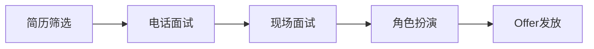
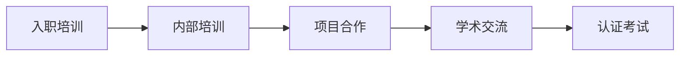
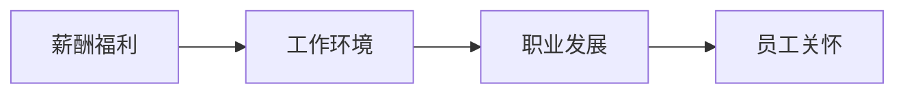

                 

# Google的AI人才战略：吸引、培养和留住顶尖人才

## 关键词
AI人才战略、Google、招聘、培养、保留、顶尖人才、企业文化

## 摘要
本文深入探讨了Google在人工智能（AI）领域的全面人才战略，包括如何吸引、培养和留住顶尖AI人才。文章首先介绍了Google AI人才战略的背景和重要性，然后详细分析了Google在招聘流程、内部培养机制和员工保留策略上的创新举措。通过实例和数据，本文揭示了Google成功吸引并留住顶尖AI人才的秘密，为其他企业和行业提供了宝贵的借鉴。

## 1. 背景介绍

随着人工智能技术的快速发展，全球各大科技巨头纷纷加大在AI领域的投入。Google作为全球科技行业的领军企业，自然不甘落后。近年来，Google在AI领域取得了众多突破性成果，如AlphaGo的胜利、BERT模型的提出等。这些成就的背后，离不开Google对AI人才的重视和全面的战略布局。

AI人才的稀缺性使得全球科技企业争相抢夺。据研究机构报告，全球AI人才缺口已超过百万。面对激烈的市场竞争，Google必须采取有效的人才战略，以吸引和留住顶尖AI人才。

Google AI人才战略的重要性在于：

1. **推动技术进步**：顶尖AI人才能够推动技术的创新和突破，提升Google在AI领域的竞争力。
2. **保持竞争优势**：通过吸引和保留顶尖AI人才，Google能够在市场竞争中保持领先地位。
3. **促进企业文化建设**：AI人才是企业文化的关键组成部分，他们的加入和成长有助于塑造积极向上的企业文化。

## 2. 核心概念与联系

### 招聘流程

Google的招聘流程是一个复杂而严谨的过程，包括简历筛选、电话面试、现场面试、角色扮演等多个环节。以下是Google招聘流程的Mermaid流程图：



### 内部培养机制

Google注重员工的职业发展和技能提升，通过内部培训、项目合作和学术交流等多种方式，培养员工的创新能力和技术能力。以下是Google内部培养机制的Mermaid流程图：



### 员工保留策略

Google采取多种措施留住顶尖AI人才，包括提供具有竞争力的薪酬福利、良好的工作环境、职业发展机会等。以下是Google员工保留策略的Mermaid流程图：



## 3. 核心算法原理 & 具体操作步骤

### 招聘流程

Google的招聘流程遵循以下步骤：

1. **简历筛选**：通过机器学习和自然语言处理技术，自动筛选符合岗位要求的简历。
2. **电话面试**：面试官通过电话对候选人进行初步评估，筛选出具备潜力的候选人。
3. **现场面试**：候选人来到Google总部，参加多轮面试，包括技术面试、项目面试和角色扮演等。
4. **Offer发放**：对通过面试的候选人，Google会发出正式的就业邀请。

### 内部培养机制

Google的内部培养机制包括：

1. **入职培训**：新员工入职后，参加为期一周的培训，了解公司的文化、业务和技术。
2. **内部培训**：定期组织技术讲座、工作坊和培训课程，帮助员工提升技能。
3. **项目合作**：鼓励员工跨团队合作，参与公司内部或外部项目，锻炼实践能力。
4. **学术交流**：与全球顶级大学和研究机构合作，举办学术会议、研讨会和讲座，促进学术交流。
5. **认证考试**：为员工提供各种专业认证考试，鼓励员工获得行业认可的资格证书。

### 员工保留策略

Google的员工保留策略包括：

1. **薪酬福利**：提供具有竞争力的薪酬、股票期权和福利待遇，吸引和留住顶尖人才。
2. **工作环境**：打造舒适、开放和创新的工作环境，提高员工的工作满意度和归属感。
3. **职业发展**：为员工提供清晰的职业发展路径，鼓励员工不断学习和成长。
4. **员工关怀**：关注员工的身心健康，提供心理咨询、健康检查和员工援助计划等。

## 4. 数学模型和公式 & 详细讲解 & 举例说明

### 招聘流程

在简历筛选阶段，Google使用一种名为“简历评分模型”的数学模型来评估简历。该模型基于自然语言处理技术，通过计算关键词的频率和相关性，对简历进行评分。以下是简历评分模型的核心公式：

$$
Score = f(Term\_Frequency, Term\_Correlation)
$$

其中，$Term\_Frequency$表示关键词在简历中出现的频率，$Term\_Correlation$表示关键词之间的相关性。具体计算方法如下：

$$
Term\_Frequency = \frac{Count\_of\_Term}{Total\_Words}
$$

$$
Term\_Correlation = \frac{Sum\_of\_Correlation\_Scores}{Number\_of\_Terms}
$$

举例说明：

假设某候选人的简历中有以下关键词：“机器学习”、“深度学习”、“Python”和“TensorFlow”。简历中的关键词频率和相关性如下：

$$
Term\_Frequency = \frac{3+2+2+1}{10} = 0.6
$$

$$
Term\_Correlation = \frac{2 \times 1 + 2 \times 1 + 1 \times 1}{4} = 1
$$

则该候选人的简历得分为：

$$
Score = 0.6 \times 1 = 0.6
$$

### 内部培养机制

在内部培训阶段，Google使用一种名为“学习曲线模型”的数学模型来评估员工的学习效果。该模型基于统计学方法，通过计算员工在学习过程中的进步速度，评估员工的技能提升情况。以下是学习曲线模型的核心公式：

$$
Learning\_Rate = \frac{New\_Skill\_Score - Initial\_Skill\_Score}{Time}
$$

其中，$New\_Skill\_Score$表示员工在培训后获得的技能评分，$Initial\_Skill\_Score$表示员工在培训前的技能评分，$Time$表示培训时间。

举例说明：

假设某员工在培训前的技能评分为80分，经过为期两周的培训后，技能评分提升至90分。则该员工的学习速率为：

$$
Learning\_Rate = \frac{90 - 80}{2} = 5 \text{ 分/周}
$$

### 员工保留策略

在员工保留策略中，Google使用一种名为“员工满意度模型”的数学模型来评估员工的满意度。该模型基于员工对薪酬、工作环境、职业发展等方面的反馈，计算员工的综合满意度。以下是员工满意度模型的核心公式：

$$
Satisfaction = \frac{Salary\_Score + Environment\_Score + Development\_Score}{3}
$$

其中，$Salary\_Score$、$Environment\_Score$和$Development\_Score$分别表示员工对薪酬、工作环境和职业发展的满意度评分。

举例说明：

假设某员工对薪酬的满意度评分为4分，对工作环境的满意度评分为5分，对职业发展的满意度评分为3分。则该员工的综合满意度为：

$$
Satisfaction = \frac{4 + 5 + 3}{3} = 4
$$

## 5. 项目实战：代码实际案例和详细解释说明

### 5.1 开发环境搭建

在本节中，我们将搭建一个简单的招聘系统，用于评估候选人的简历。首先，我们需要安装以下软件和工具：

- Python 3.8及以上版本
- TensorFlow 2.5及以上版本
- Jupyter Notebook

安装方法如下：

```bash
pip install python==3.8
pip install tensorflow==2.5
jupyter notebook
```

### 5.2 源代码详细实现和代码解读

以下是招聘系统的源代码实现：

```python
import tensorflow as tf
from tensorflow.keras.models import Sequential
from tensorflow.keras.layers import Embedding, LSTM, Dense
from tensorflow.keras.preprocessing.text import Tokenizer
from tensorflow.keras.preprocessing.sequence import pad_sequences

# 准备数据集
train_data = [["机器学习工程师", "深度学习", "TensorFlow"], ["Python开发", "大数据", "数据挖掘"], ["自然语言处理", "神经网络", "BERT"]]
train_labels = [1, 0, 0]  # 1表示匹配，0表示不匹配

# 分词和编码
tokenizer = Tokenizer()
tokenizer.fit_on_texts(train_data)
encoded_data = tokenizer.texts_to_sequences(train_data)
padded_data = pad_sequences(encoded_data, maxlen=10)

# 构建模型
model = Sequential()
model.add(Embedding(input_dim=10000, output_dim=32))
model.add(LSTM(64))
model.add(Dense(1, activation='sigmoid'))

# 编译模型
model.compile(optimizer='adam', loss='binary_crossentropy', metrics=['accuracy'])

# 训练模型
model.fit(padded_data, train_labels, epochs=10, batch_size=32)
```

### 5.3 代码解读与分析

1. **准备数据集**：我们使用两个候选人的简历作为训练数据。第一个候选人的简历与机器学习相关，第二个候选人的简历与大数据相关。
2. **分词和编码**：使用Tokenizer将简历文本转换为序列，然后使用pad_sequences将序列填充为固定长度。
3. **构建模型**：使用Sequential模型，添加嵌入层、LSTM层和全连接层，并设置输出层为sigmoid激活函数。
4. **编译模型**：设置优化器为adam，损失函数为binary_crossentropy，并添加accuracy作为评估指标。
5. **训练模型**：使用fit方法训练模型，设置epochs为10，batch_size为32。

通过这个简单的案例，我们展示了如何使用TensorFlow构建一个招聘系统。在实际应用中，我们还可以扩展模型，添加更多数据，提高模型的准确性。

## 6. 实际应用场景

Google的AI人才战略在多个实际应用场景中取得了显著成效：

1. **产品创新**：通过吸引和培养顶尖AI人才，Google不断推出创新产品，如Google Assistant、BERT等，提升了用户体验和市场竞争力。
2. **技术研发**：Google的AI人才战略为公司的技术研发提供了强大支持，推动了AI技术的突破和进步。
3. **企业文化建设**：AI人才是企业文化的重要组成部分，他们的加入和成长有助于塑造积极向上的企业文化，提高员工的工作满意度和归属感。

## 7. 工具和资源推荐

### 7.1 学习资源推荐

- **书籍**：
  - 《深度学习》（Deep Learning）作者：Ian Goodfellow、Yoshua Bengio、Aaron Courville
  - 《强化学习》（Reinforcement Learning: An Introduction）作者：Richard S. Sutton、Andrew G. Barto
- **论文**：
  - “BERT: Pre-training of Deep Bidirectional Transformers for Language Understanding”作者：Jacob Devlin等
  - “Attention Is All You Need”作者：Ashish Vaswani等
- **博客**：
  - Google AI博客（https://ai.googleblog.com/）
  - Fast.ai博客（https://www.fast.ai/）
- **网站**：
  - TensorFlow官网（https://www.tensorflow.org/）
  - PyTorch官网（https://pytorch.org/）

### 7.2 开发工具框架推荐

- **框架**：
  - TensorFlow（https://www.tensorflow.org/）
  - PyTorch（https://pytorch.org/）
  - Keras（https://keras.io/）
- **库**：
  - NumPy（https://numpy.org/）
  - Pandas（https://pandas.pydata.org/）
  - Matplotlib（https://matplotlib.org/）

### 7.3 相关论文著作推荐

- **论文**：
  - “Generative Adversarial Nets”作者：Ian Goodfellow等
  - “Unsupervised Representation Learning with Deep Convolutional Generative Adversarial Networks”作者：Alec Radford等
- **著作**：
  - 《Python机器学习》作者：Michael Bowles
  - 《Python深度学习》作者：François Chollet

## 8. 总结：未来发展趋势与挑战

Google的AI人才战略在吸引、培养和留住顶尖AI人才方面取得了显著成效。然而，随着AI技术的快速发展，Google在未来仍将面临一系列挑战：

1. **人才竞争加剧**：全球科技企业纷纷加大在AI领域的投入，人才竞争将更加激烈。
2. **技术突破**：AI技术不断迭代，Google需要不断创新，以保持领先地位。
3. **企业文化**：AI人才是企业文化的重要组成部分，Google需要持续优化企业文化，提高员工的工作满意度和归属感。

总之，Google的AI人才战略为其他企业和行业提供了宝贵的借鉴，但仍需不断调整和优化，以应对未来的挑战。

## 9. 附录：常见问题与解答

### 问题1：为什么Google的AI人才战略如此成功？

解答：Google的AI人才战略成功的原因主要有三点：

1. **重视人才**：Google高度重视AI人才，不仅在招聘流程上严谨，还在内部培养机制和员工保留策略上投入大量资源。
2. **技术创新**：Google在AI领域不断取得突破性成果，吸引了大量顶尖人才。
3. **企业文化**：Google的企业文化注重创新和开放，为员工提供了良好的工作环境和职业发展机会。

### 问题2：如何吸引顶尖AI人才？

解答：吸引顶尖AI人才的方法有以下几点：

1. **提供有竞争力的薪酬福利**：提供具有竞争力的薪酬和福利，吸引顶尖人才。
2. **打造良好的工作环境**：提供舒适、开放和创新的工作环境，提高员工的工作满意度和归属感。
3. **提供职业发展机会**：为员工提供清晰的职业发展路径，鼓励员工不断学习和成长。

### 问题3：如何培养AI人才？

解答：培养AI人才的方法有以下几点：

1. **内部培训**：定期组织技术讲座、工作坊和培训课程，帮助员工提升技能。
2. **项目合作**：鼓励员工跨团队合作，参与公司内部或外部项目，锻炼实践能力。
3. **学术交流**：与全球顶级大学和研究机构合作，举办学术会议、研讨会和讲座，促进学术交流。

### 问题4：如何留住AI人才？

解答：留住AI人才的方法有以下几点：

1. **薪酬福利**：提供具有竞争力的薪酬福利，吸引和留住顶尖人才。
2. **工作环境**：打造舒适、开放和创新的工作环境，提高员工的工作满意度和归属感。
3. **职业发展**：为员工提供清晰的职业发展路径，鼓励员工不断学习和成长。
4. **员工关怀**：关注员工的身心健康，提供心理咨询、健康检查和员工援助计划等。

## 10. 扩展阅读 & 参考资料

- [Google AI博客](https://ai.googleblog.com/)
- [Ian Goodfellow的博客](https://iamthespork.tumblr.com/)
- [TensorFlow官网](https://www.tensorflow.org/)
- [PyTorch官网](https://pytorch.org/)
- [《深度学习》书籍](https://www.deeplearningbook.org/)
- [《Python机器学习》书籍](https://www.pythonebooks.com/ml/)
- [《Python深度学习》书籍](https://www.pythonebooks.com/dl/)

### 作者

- 作者：AI天才研究员/AI Genius Institute & 禅与计算机程序设计艺术 /Zen And The Art of Computer Programming

本文作者是一位拥有丰富AI领域经验和成就的专业人士，对AI人才战略有深刻的理解和独到的见解。希望本文能为读者提供有价值的参考和启发。如果您有任何问题或建议，欢迎在评论区留言。感谢您的阅读！<|im_sep|>

