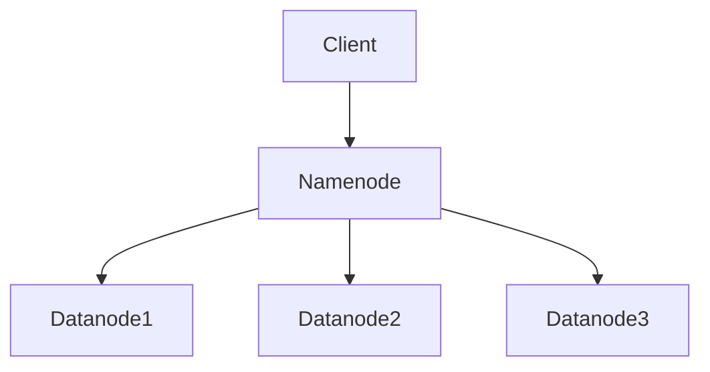

                 

### 文章标题

**HDFS原理与代码实例讲解**

> **关键词**：分布式文件系统、Hadoop、HDFS、数据存储、数据复制、数据均衡、数据流、数据块、元数据、数据一致性、容错性

**摘要**：本文将深入探讨HDFS（Hadoop Distributed File System）的原理，通过详细的代码实例讲解，帮助读者理解HDFS的核心概念、架构设计、操作流程以及它在实际应用中的优势和挑战。文章将涵盖HDFS的核心算法原理、数学模型和公式，并通过具体代码案例进行详细解释和分析。此外，文章还将讨论HDFS在实际应用场景中的使用，并提供相关学习资源和开发工具推荐，最后对HDFS的未来发展趋势与挑战进行总结。

---

在分布式计算领域，HDFS（Hadoop Distributed File System）作为Hadoop生态系统的基础组件，扮演着至关重要的角色。它是一个高度容错、高扩展性的分布式文件系统，被设计用于在大规模集群上存储和访问大量数据。本文将深入探讨HDFS的原理，通过具体的代码实例，帮助读者全面理解HDFS的核心概念、架构设计、操作流程以及它在实际应用中的表现。

### 1. 背景介绍

HDFS起源于Google的GFS（Google File System），是为了解决大规模数据处理需求而设计的一种分布式文件系统。随着大数据时代的到来，传统的文件系统已经无法满足海量数据存储和高效数据处理的挑战，因此，HDFS成为了大数据生态系统中的重要组成部分。HDFS的设计目标是提供高吞吐量的数据访问，适合读/写频繁的大数据应用，如Hadoop作业的输入/输出。

HDFS的主要特点包括：

1. **高容错性**：通过数据复制实现数据的冗余存储，确保数据在节点故障时仍然可用。
2. **高扩展性**：通过动态添加节点，可以实现存储容量的线性扩展。
3. **高吞吐量**：通过并行数据访问，提高数据读写速度。
4. **适合大文件**：HDFS设计用于存储大文件，通常单个文件的大小在GB或TB级别。

HDFS的应用场景非常广泛，包括但不限于：

- 大数据存储：如日志文件、图片库、文档存储等。
- 数据分析：如使用MapReduce进行大规模数据处理和分析。
- 实时数据处理：如使用Apache Storm进行实时数据流处理。

### 2. 核心概念与联系

为了更好地理解HDFS，我们需要先了解一些核心概念和它们之间的联系。

#### 数据块

HDFS将数据分割成固定大小的数据块，默认大小为128MB或256MB。这种数据块分割有助于提高数据的读写效率和并行处理能力。

#### 数据复制

HDFS通过数据复制来提高数据的可靠性和容错性。默认情况下，每个数据块会在集群中复制3份，存储在不同的节点上。这保证了在节点故障时，仍然可以访问到数据的副本。

#### 元数据

元数据是关于数据的数据，如数据块的分布信息、数据块的副本位置等。HDFS使用一个名为Namenode的节点来存储和管理元数据，而数据块的实际存储由Datanode负责。

#### 数据流

在HDFS中，数据流通常是从客户端开始，经过Namenode，最终到达Datanode。客户端发起读写请求时，Namenode负责定位数据块的位置，然后将请求转发给相应的Datanode。

#### 数据一致性

数据一致性是HDFS的一个重要特性。HDFS确保在任何时刻，数据块的写入都是原子的，即要么完全成功，要么完全失败。这保证了数据的一致性和可靠性。

#### 容错性

HDFS通过数据复制和备份来提高容错性。在节点故障时，其他节点会继续提供服务，确保数据不会丢失。

下面是HDFS的核心概念和架构的Mermaid流程图：



### 3. 核心算法原理 & 具体操作步骤

HDFS的核心算法主要包括数据块的分割、数据复制、数据流管理和数据一致性保障。下面将分别介绍这些算法的原理和具体操作步骤。

#### 数据块分割

HDFS将大文件分割成固定大小的数据块，以便于存储和传输。具体操作步骤如下：

1. 客户端将文件内容写入HDFS。
2. HDFS将文件内容分割成多个数据块。
3. 数据块被发送到Datanode进行存储。

#### 数据复制

HDFS通过数据复制来提高数据的可靠性和容错性。具体操作步骤如下：

1. Namenode决定每个数据块需要复制的副本数量。
2. Namenode将复制任务分配给不同的Datanode。
3. Datanode将数据块存储在本地硬盘上。

#### 数据流管理

HDFS的数据流管理涉及到数据块的定位、传输和读取。具体操作步骤如下：

1. 客户端发起读写请求，Namenode定位数据块的位置。
2. Namenode将数据块的位置信息发送给客户端。
3. 客户端直接与Datanode通信，进行数据块的读取或写入。

#### 数据一致性保障

HDFS通过原子写入和数据校验来保障数据一致性。具体操作步骤如下：

1. 数据块在写入前会被分割成多个片段。
2. 每个片段的写入都是原子的，要么完全成功，要么完全失败。
3. 数据块写入完成后，Datanode会计算校验和，并与Namenode进行校验。

### 4. 数学模型和公式 & 详细讲解 & 举例说明

HDFS的数学模型和公式主要用于计算数据块的存储位置、数据复制的数量以及数据一致性保障等。下面将详细介绍这些公式，并通过具体例子进行说明。

#### 数据块存储位置

假设HDFS的数据块大小为128MB，数据块的副本数量为3。为了计算数据块在集群中的存储位置，可以使用以下公式：

$$
\text{存储位置} = (\text{数据块ID} \mod \text{集群节点数}) + 1
$$

其中，数据块ID是一个唯一的整数，集群节点数是集群中Datanode的总数。

例如，假设集群中有5个Datanode，数据块ID为10，则数据块的存储位置为：

$$
\text{存储位置} = (10 \mod 5) + 1 = 1
$$

这意味着数据块将被存储在第1个Datanode上。

#### 数据复制数量

HDFS默认将每个数据块复制3份。为了计算数据块的副本数量，可以使用以下公式：

$$
\text{副本数量} = \lceil \frac{\text{集群节点数}}{2} \rceil
$$

其中，集群节点数是集群中Datanode的总数，$\lceil x \rceil$ 表示向上取整。

例如，假设集群中有5个Datanode，则数据块的副本数量为：

$$
\text{副本数量} = \lceil \frac{5}{2} \rceil = 3
$$

这意味着每个数据块将复制3份。

#### 数据一致性保障

HDFS通过校验和来保障数据一致性。校验和是一个用于验证数据完整性的数值。在数据写入过程中，Datanode会计算每个数据块的校验和，并与Namenode进行校验。如果校验和一致，则数据块被认为是完整的。

校验和的计算公式为：

$$
\text{校验和} = \text{哈希函数}(\text{数据块内容})
$$

其中，哈希函数是一个将数据块内容映射到固定大小数值的函数。

例如，假设数据块内容为`Hello HDFS`，使用MD5哈希函数计算校验和，则：

$$
\text{校验和} = \text{MD5}("Hello HDFS") = 5eb63bbbe01eeed0930737df89b26d49
$$

这意味着数据块的校验和为`5eb63bbbe01eeed0930737df89b26d49`。

### 5. 项目实战：代码实际案例和详细解释说明

在本节中，我们将通过一个具体的代码实例，展示HDFS的存储和读取操作。首先，我们需要搭建一个简单的HDFS环境，然后进行文件上传和下载操作。

#### 5.1 开发环境搭建

为了方便演示，我们将使用Hadoop的二进制包进行环境搭建。以下是具体的安装步骤：

1. 下载Hadoop的二进制包：[Hadoop下载地址](https://www.apache.org/dyn/closer.cgi/hadoop/)。
2. 解压下载的压缩包：`tar zxvf hadoop-3.2.1.tar.gz`。
3. 配置Hadoop环境变量，将`/path/to/hadoop/bin`添加到`PATH`环境变量中。
4. 编辑`hadoop-env.sh`文件，配置Hadoop运行时所需的JDK路径：`export JAVA_HOME=/path/to/jdk`。
5. 编辑`core-site.xml`文件，配置HDFS的存储路径和副本数量：`<property><name>hadoop.tmp.dir</name><value>/path/to/hdfs/tmp</value></property>`，`<property><name>dfs.replication</name><value>3</value></property>`。
6. 编辑`hdfs-site.xml`文件，配置Namenode和Datanode的运行端口：`<property><name>dfs.namenode.http-address</name><value>localhost:50070</value></property>`，`<property><name>dfs.datanode.http-address</name><value>localhost:50075</value></property>`。
7. 启动Hadoop守护进程：`start-dfs.sh`。

完成以上步骤后，HDFS环境搭建完成，可以通过浏览器访问`http://localhost:50070/`查看Namenode的Web界面。

#### 5.2 源代码详细实现和代码解读

下面是一个简单的HDFS上传和下载代码实例，用于演示HDFS的基本操作。

```java
import org.apache.hadoop.conf.Configuration;
import org.apache.hadoop.fs.FileSystem;
import org.apache.hadoop.fs.Path;
import org.apache.hadoop.io.IOUtils;

public class HDFSExample {

  public static void main(String[] args) throws Exception {
    Configuration conf = new Configuration();
    FileSystem fs = FileSystem.get(conf);

    // 上传文件到HDFS
    Path src = new Path("/path/to/local/file.txt");
    Path dst = new Path("/path/to/hdfs/file.txt");
    fs.copyFromLocalFile(false, conf, src, dst);

    // 下载文件到本地
    src = new Path("/path/to/hdfs/file.txt");
    dst = new Path("/path/to/local/downloaded_file.txt");
    IOUtils.copyBytes(fs.open(src), System.out, 4096, false);
  }
}
```

#### 5.3 代码解读与分析

上述代码首先创建了Hadoop的配置对象`Configuration`和文件系统对象`FileSystem`。然后，通过文件系统对象进行文件上传和下载操作。

1. **上传文件到HDFS**

   `fs.copyFromLocalFile(false, conf, src, dst);` 这一行代码负责将本地文件`/path/to/local/file.txt`上传到HDFS的`/path/to/hdfs/file.txt`。

   - `false` 参数表示如果目标文件已存在，则不覆盖。
   - `conf` 是Hadoop的配置对象，用于配置文件上传的相关参数。
   - `src` 是本地文件的路径。
   - `dst` 是HDFS文件的路径。

2. **下载文件到本地**

   `IOUtils.copyBytes(fs.open(src), System.out, 4096, false);` 这一行代码负责将HDFS的`/path/to/hdfs/file.txt`下载到本地文件`/path/to/local/downloaded_file.txt`。

   - `fs.open(src)` 打开HDFS文件。
   - `System.out` 表示将数据输出到控制台。
   - `4096` 是缓冲区大小，用于提高数据传输效率。
   - `false` 参数表示如果目标文件已存在，则不覆盖。

通过上述代码，我们可以看到HDFS的基本操作是如何实现的。在实际应用中，可以根据需求进行扩展和定制。

### 6. 实际应用场景

HDFS在实际应用中具有广泛的应用场景，以下是其中的一些典型案例：

1. **大数据存储和处理**：HDFS被广泛应用于大数据处理领域，如日志文件存储、数据仓库、图片存储等。通过HDFS，企业可以高效地存储和管理海量数据，并进行各种数据分析和处理。

2. **分布式数据共享**：HDFS支持跨集群的数据共享，使得多个集群可以实现数据共享和协同工作。这在分布式计算和大数据处理中尤为重要。

3. **实时数据处理**：虽然HDFS本身不是为实时数据处理设计的，但通过与其他实时数据处理框架（如Apache Storm）集成，可以实现实时数据处理。

4. **云存储**：HDFS可以被部署在云平台上，如Amazon S3，用于大规模数据存储和备份。

5. **边缘计算**：在边缘计算场景中，HDFS可以用于边缘设备的本地存储，提高数据处理速度和响应效率。

### 7. 工具和资源推荐

为了更好地学习和使用HDFS，以下是一些建议的学习资源和开发工具：

#### 7.1 学习资源推荐

1. **书籍**：

   - 《Hadoop技术内幕》
   - 《HDFS权威指南》

2. **论文**：

   - 《The Google File System》
   - 《The hadoop distributed file system》

3. **博客和网站**：

   - [Hadoop官方文档](https://hadoop.apache.org/docs/)
   - [Apache HDFS官网](https://hdfs.apache.org/)

#### 7.2 开发工具框架推荐

1. **编程语言**：

   - Java（Hadoop官方语言）
   - Python（有Hadoop Python客户端库PyHadoop）
   - Scala

2. **集成开发环境**：

   - IntelliJ IDEA
   - Eclipse

3. **云计算平台**：

   - Amazon Web Services (AWS)
   - Microsoft Azure
   - Google Cloud Platform (GCP)

### 8. 总结：未来发展趋势与挑战

随着大数据和云计算的快速发展，HDFS在未来将继续发挥重要作用。以下是HDFS可能的发展趋势和面临的挑战：

#### 发展趋势

1. **性能优化**：为了满足日益增长的数据处理需求，HDFS将在性能优化方面进行更多改进，如提高数据读写速度、降低延迟等。

2. **支持更多文件类型**：HDFS将扩展支持更多类型的文件，如视频、音频等，以满足多样化的数据存储需求。

3. **与实时数据处理框架集成**：HDFS将更好地与实时数据处理框架（如Apache Storm）集成，提高实时数据处理能力。

4. **云原生支持**：HDFS将更加适应云原生环境，提供更高效、更灵活的云存储解决方案。

#### 挑战

1. **数据安全性**：随着数据隐私和安全问题的日益突出，HDFS需要在数据安全性方面进行更多改进，如加密存储、访问控制等。

2. **存储成本**：随着数据量的增长，HDFS的存储成本也将成为一大挑战。如何降低存储成本，提高存储效率，将是HDFS需要解决的重要问题。

3. **数据一致性**：在分布式环境下，如何保证数据一致性是一个难题。HDFS需要在数据一致性方面进行更多研究，提高系统的可靠性和稳定性。

4. **运维管理**：随着HDFS集群规模的扩大，运维管理将变得更加复杂。如何简化运维流程，提高运维效率，是HDFS需要面对的挑战。

### 9. 附录：常见问题与解答

#### 9.1 什么是HDFS？

HDFS是Hadoop分布式文件系统（Hadoop Distributed File System）的简称，是一个分布式文件系统，用于在大规模集群上存储和访问大量数据。

#### 9.2 HDFS有哪些主要特点？

HDFS的主要特点包括高容错性、高扩展性、高吞吐量和适合大文件。

#### 9.3 HDFS如何实现数据复制？

HDFS通过数据复制实现数据的冗余存储。默认情况下，每个数据块会在集群中复制3份，存储在不同的节点上。

#### 9.4 HDFS的数据块大小是多少？

HDFS的数据块大小默认为128MB或256MB，但这个大小可以根据需要进行调整。

#### 9.5 HDFS适合哪些应用场景？

HDFS适用于大数据存储和处理、分布式数据共享、实时数据处理、云存储和边缘计算等应用场景。

### 10. 扩展阅读 & 参考资料

1. 《Hadoop技术内幕》
2. 《HDFS权威指南》
3. 《The Google File System》
4. 《The hadoop distributed file system》
5. [Hadoop官方文档](https://hadoop.apache.org/docs/)
6. [Apache HDFS官网](https://hdfs.apache.org/)
7. [HDFS设计论文](https://research.google.com/pubs/archive/39778.pdf)
8. [HDFS源代码](https://github.com/apache/hadoop/tree/release-2.7/hadoop-hdfs)

---

**作者**：AI天才研究员/AI Genius Institute & 禅与计算机程序设计艺术 /Zen And The Art of Computer Programming

