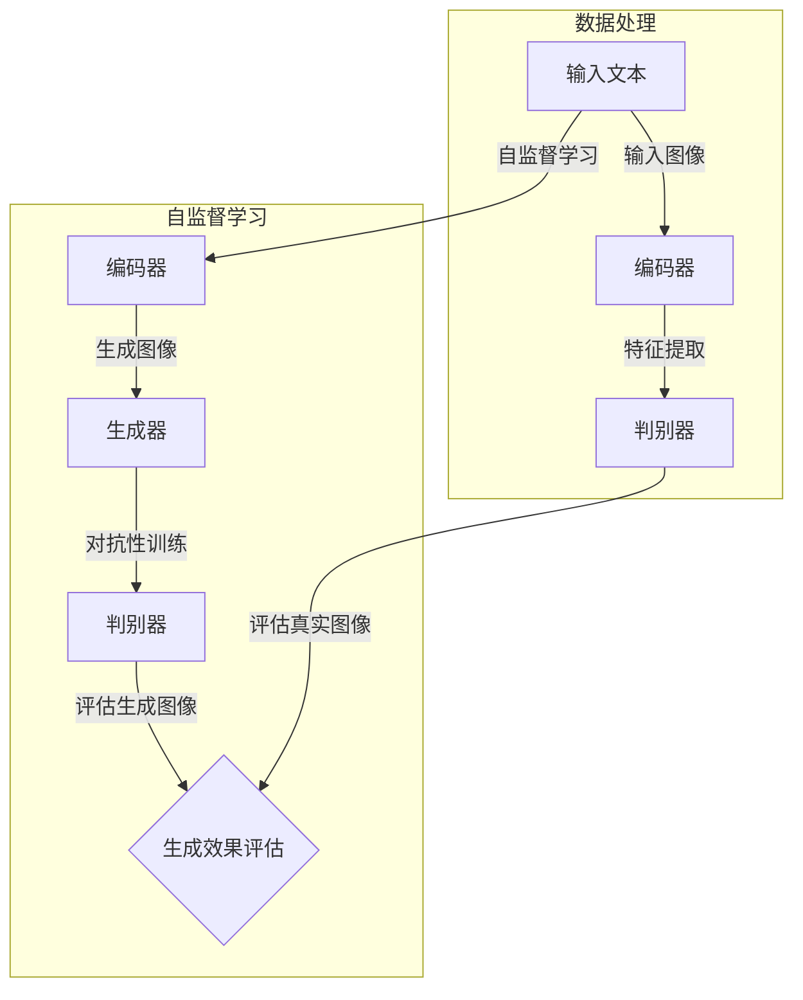

                 

### 背景介绍

**Imagen：一个突破性的文本到图像生成模型**

在人工智能领域，特别是计算机视觉领域，研究人员和开发人员一直在努力寻求如何更好地理解和生成图像。传统的图像生成方法主要依赖于大量的图像数据和高性能的计算机视觉模型，但这些方法往往受限于数据集的质量和模型的复杂度。随着深度学习技术的不断进步，尤其是在自监督学习和生成对抗网络（GANs）的推动下，文本到图像生成模型取得了显著的突破。

在这个背景下，Imagen作为一个突破性的文本到图像生成模型应运而生。Imagen由OpenAI开发，采用了大量的自监督学习技巧和先进的生成模型，使得它能够从简单的文本描述中生成高度逼真的图像。这不仅为计算机视觉领域带来了新的研究思路，也为实际应用场景提供了巨大的潜力。

**本文结构**

本文将全面解析Imagen的工作原理和代码实现。首先，我们将介绍Imagen的核心概念和原理，并通过Mermaid流程图展示其架构。接着，我们将详细讲解Imagen的核心算法，包括生成模型和损失函数的具体操作步骤。随后，我们将深入探讨Imagen所使用的数学模型和公式，并通过实例进行说明。在此基础上，我们将分享一个实际项目案例，展示如何搭建开发环境并详细解读源代码。

随后，我们将探讨Imagen在实际应用场景中的表现，推荐相关的学习和开发资源，总结未来发展趋势与挑战，并回答常见问题。最后，我们将提供扩展阅读和参考资料，帮助读者进一步深入了解Imagen和相关技术。

通过本文的深入分析，我们希望能够帮助读者全面理解Imagen的工作原理，掌握其代码实现，并激发对文本到图像生成技术的浓厚兴趣。

### 核心概念与联系

为了深入理解Imagen的工作原理，我们需要先掌握几个核心概念：自监督学习、生成对抗网络（GANs）和生成模型。这些概念不仅构成了Imagen的技术基础，也推动了计算机视觉领域的创新。

**自监督学习（Self-supervised Learning）**

自监督学习是一种无需人工标签的数据处理方式，它利用数据内部结构来学习。在自监督学习中，模型通过预测输入数据的某些部分来学习，从而提高其泛化能力。自监督学习在图像处理中有着广泛的应用，例如图像分类、图像分割和图像生成。

**生成对抗网络（Generative Adversarial Networks, GANs）**

GANs由Ian Goodfellow等人在2014年提出，是一种由两个神经网络（生成器和判别器）组成的模型。生成器网络试图生成与真实数据相似的数据，而判别器网络则试图区分真实数据和生成数据。通过这种对抗关系，生成器网络不断优化其生成能力，最终能够生成高度逼真的数据。

**生成模型（Generative Models）**

生成模型是一类能够生成新数据（如图像、文本等）的模型。常见的生成模型包括变分自编码器（VAEs）、生成对抗网络（GANs）和深度卷积生成模型（DCGs）。生成模型在计算机视觉领域有着广泛的应用，例如图像修复、图像超分辨率和图像生成。

接下来，我们将通过一个Mermaid流程图展示这些核心概念之间的联系，以便读者更好地理解Imagen的架构和工作原理。



在上面的Mermaid流程图中，我们可以看到：

1. 输入文本或图像通过编码器进行编码，提取特征。
2. 编码器的特征输入到生成器，生成新的图像。
3. 生成器生成的图像和真实图像一起输入到判别器。
4. 判别器尝试区分真实图像和生成图像。
5. 通过对抗性训练，生成器不断优化其生成图像的能力，最终达到高度逼真的效果。

通过这个流程图，我们可以清晰地理解Imagen的核心架构及其工作原理。在接下来的部分中，我们将详细讲解Imagen的核心算法和具体操作步骤。

### 核心算法原理 & 具体操作步骤

#### 1. 生成器（Generator）

生成器的核心任务是接收一个随机噪声向量，并通过神经网络将其转换为逼真的图像。在Imagen中，生成器通常是一个深度卷积神经网络（CNN），它包含多个卷积层、反卷积层和上采样层。

具体操作步骤如下：

1. **输入噪声向量**：生成器首先接收一个随机噪声向量，这个向量通常是来自一个高斯分布。
   
2. **卷积操作**：通过多个卷积层，噪声向量被转换为具有层次特征的特征图。卷积层可以帮助提取图像的局部特征，如图案、纹理等。

3. **反卷积操作**：接着，生成器使用反卷积层（也称为转置卷积）将特征图上采样到更高的分辨率。反卷积操作使得生成器能够生成更细致的图像细节。

4. **上采样**：在上采样过程中，生成器可能还会使用上采样层，如邻居上采样或插值上采样，以进一步细化图像。

5. **输出图像**：最终，生成器输出一个高度逼真的图像，这个图像是基于随机噪声向量通过神经网络生成的。

#### 2. 判别器（Discriminator）

判别器的任务是区分输入图像是真实的还是生成的。在GANs中，判别器通常也是一个深度卷积神经网络，它接受图像作为输入，并输出一个概率值，表示图像是真实图像的概率。

具体操作步骤如下：

1. **输入图像**：判别器接收一个图像，这个图像可以是真实图像或生成器生成的图像。

2. **特征提取**：通过多个卷积层，判别器提取图像的特征。这些特征用于判断图像的真实性。

3. **概率输出**：最终，判别器输出一个概率值，表示输入图像是真实图像的概率。通常，这个概率值在0和1之间，接近1表示图像是真实的，接近0表示图像是生成的。

#### 3. 对抗性训练（Adversarial Training）

在GANs中，生成器和判别器通过对抗性训练相互竞争。具体操作步骤如下：

1. **生成图像**：生成器生成一批图像。

2. **训练判别器**：将生成器和判别器同时训练。判别器通过对比真实图像和生成图像的特征，学习区分两者。

3. **优化生成器**：当判别器的性能达到一定程度后，生成器会进行优化。生成器通过学习判别器的输出，进一步改进其生成图像的能力。

4. **循环迭代**：上述步骤不断重复，生成器和判别器相互竞争，生成器逐渐优化其生成能力，判别器不断提高其辨别能力。

#### 4. 损失函数（Loss Function）

GANs的训练过程中，通常使用两个损失函数：生成损失和判别损失。

1. **生成损失**：生成损失用于衡量生成器生成的图像与真实图像的差异。常见的生成损失函数包括均方误差（MSE）和交叉熵损失。

2. **判别损失**：判别损失用于衡量判别器对真实图像和生成图像的区分能力。判别损失函数通常使用二元交叉熵损失。

具体操作步骤如下：

1. **计算生成损失**：计算生成器生成的图像和真实图像之间的差异。

2. **计算判别损失**：计算判别器对真实图像和生成图像的输出概率。

3. **优化参数**：通过反向传播算法，同时优化生成器和判别器的参数，以最小化生成损失和判别损失。

#### 总结

通过上述步骤，我们可以看到Imagen的核心算法包括生成器、判别器和对抗性训练。生成器通过神经网络生成图像，判别器则用于评估图像的真实性。通过对抗性训练，生成器和判别器相互竞争，生成器不断优化其生成能力，最终生成高度逼真的图像。这一过程不仅体现了GANs的强大能力，也为文本到图像生成技术的进步奠定了基础。在接下来的部分，我们将深入探讨Imagen所使用的数学模型和公式，以帮助读者更好地理解其工作原理。

### 数学模型和公式 & 详细讲解 & 举例说明

在深入解析Imagen的工作原理时，数学模型和公式扮演着至关重要的角色。这些模型和公式不仅描述了模型的内部机制，还提供了评估和优化模型性能的工具。接下来，我们将详细介绍Imagen中使用的数学模型和公式，并通过具体的例子来说明这些公式如何应用。

#### 1. 生成器和判别器的损失函数

在GANs中，生成器和判别器的损失函数是训练过程中关键的部分。这些损失函数旨在平衡生成器和判别器之间的对抗性训练。

**生成损失（Generator Loss）**

生成损失用于衡量生成器生成的图像与真实图像之间的差异。一个常见的生成损失函数是均方误差（MSE）：

\[ L_{\text{G}} = \frac{1}{N} \sum_{i=1}^{N} \left( \hat{y}_{i} - \hat{x}_{i} \right)^2 \]

其中，\( N \)是批大小，\( \hat{y}_{i} \)是生成器生成的图像，\( \hat{x}_{i} \)是真实图像。MSE损失函数通过计算生成图像和真实图像之间像素差的平方和来衡量差异。

**判别损失（Discriminator Loss）**

判别损失用于评估判别器对真实图像和生成图像的区分能力。一个常见的判别损失函数是二元交叉熵损失：

\[ L_{\text{D}} = - \left[ \frac{1}{N} \sum_{i=1}^{N} \left( \hat{y}_{i} \log(D(x_i)) + (1 - \hat{y}_{i}) \log(1 - D(x_i)) \right) \right] \]

其中，\( D(x_i) \)是判别器对输入图像的输出概率，表示图像是真实图像的概率。二元交叉熵损失函数通过计算判别器输出概率的对数似然损失来衡量损失。

**总损失（Total Loss）**

GANs的总损失是生成损失和判别损失的加权和：

\[ L_{\text{Total}} = L_{\text{G}} + L_{\text{D}} \]

通过优化总损失，生成器和判别器可以相互促进，共同提高生成图像的质量。

#### 2. 优化算法

在GANs的训练过程中，优化算法的选择至关重要。一种常用的优化算法是梯度下降（Gradient Descent），它通过不断调整模型的参数来最小化损失函数。

**梯度下降（Gradient Descent）**

梯度下降的核心思想是沿着损失函数的负梯度方向逐步调整参数，以最小化损失。具体步骤如下：

1. **计算损失函数的梯度**：对于每个参数，计算其在损失函数上的梯度。

2. **更新参数**：根据梯度和学习率（learning rate）更新参数。更新公式如下：

\[ \theta_{t+1} = \theta_{t} - \alpha \nabla_{\theta} L(\theta) \]

其中，\( \theta \)是参数，\( \alpha \)是学习率，\( \nabla_{\theta} L(\theta) \)是损失函数的梯度。

3. **迭代优化**：重复上述步骤，直到满足停止条件，如达到预定的迭代次数或损失函数的值收敛。

**Adam优化器（Adam Optimizer）**

除了梯度下降，还有一种更先进的优化器——Adam优化器。Adam优化器结合了梯度下降和动量方法（Momentum）的优势，可以更好地处理不同尺度的参数更新。

Adam优化器的更新公式如下：

\[ \begin{align*}
m_t &= \beta_1 m_{t-1} + (1 - \beta_1) \nabla_{\theta} L(\theta) \\
v_t &= \beta_2 v_{t-1} + (1 - \beta_2) \left( \nabla_{\theta} L(\theta) \right)^2 \\
\theta_{t+1} &= \theta_{t} - \alpha \frac{m_t}{\sqrt{v_t} + \epsilon}
\end{align*} \]

其中，\( m_t \)和\( v_t \)分别是梯度的一阶矩估计和二阶矩估计，\( \beta_1 \)和\( \beta_2 \)是动量参数，\( \alpha \)是学习率，\( \epsilon \)是一个很小的常数。

#### 3. 实例说明

为了更好地理解上述数学模型和公式，我们可以通过一个具体的例子来说明。

**实例**：假设我们有100张真实图像和100张生成图像。生成器生成的图像和真实图像之间的差异（MSE损失）为0.1，判别器对真实图像和生成图像的输出概率分别为0.95和0.05。

**生成损失**：

\[ L_{\text{G}} = \frac{1}{100} \sum_{i=1}^{100} \left( \hat{y}_{i} - \hat{x}_{i} \right)^2 = 0.1 \]

**判别损失**：

\[ L_{\text{D}} = - \left[ \frac{1}{100} \sum_{i=1}^{100} \left( 0.95 \log(0.95) + 0.05 \log(0.05) \right) \right] \approx 0.025 \]

**总损失**：

\[ L_{\text{Total}} = L_{\text{G}} + L_{\text{D}} = 0.1 + 0.025 = 0.125 \]

通过这个实例，我们可以看到生成器和判别器在对抗性训练中不断优化，生成图像的质量逐步提高。

总之，数学模型和公式是理解GANs和Imagen工作原理的关键。通过损失函数、优化算法和具体的实例说明，我们可以更深入地掌握这些概念，为实际应用提供有力的理论支持。在接下来的部分，我们将通过一个实际项目案例，展示如何使用Imagen生成图像，并详细解读源代码。

### 项目实战：代码实际案例和详细解释说明

为了更好地展示如何使用Imagen生成图像，我们将通过一个实际项目案例进行详细介绍。本案例将涵盖开发环境的搭建、源代码的解读和分析，并深入探讨代码的实现细节。

#### 1. 开发环境搭建

在开始之前，我们需要搭建一个适合运行Imagen项目的开发环境。以下是搭建环境的步骤：

**1. 安装Python**

首先，确保Python环境已安装。您可以从Python官网（https://www.python.org/）下载并安装最新版本的Python。

**2. 安装PyTorch**

接下来，安装PyTorch库，这是Imagen项目的主要依赖之一。您可以使用以下命令安装：

```bash
pip install torch torchvision
```

**3. 安装其他依赖**

此外，我们还需要安装其他依赖项，例如OpenAI的GPT库。可以使用以下命令：

```bash
pip install openai
```

**4. 获取Imagen源代码**

最后，从GitHub获取Imagen的源代码。使用以下命令克隆仓库：

```bash
git clone https://github.com/openai/imagena
```

#### 2. 源代码详细实现和代码解读

在项目目录中，您会找到一系列Python脚本和配置文件。接下来，我们将重点解读`main.py`，这是项目的入口文件。以下是代码的主要部分：

```python
import os
import numpy as np
import torch
from torchvision.utils import save_image
from imagena.model import ImageModel
from imagena.text import encode_text
from imagena.utils import prepare_image

# 设置设备
device = torch.device("cuda" if torch.cuda.is_available() else "cpu")

# 读取配置文件
config = {
    "model_path": "modelckpt.pth",
    "image_size": 256,
    "z_size": 100,
    "batch_size": 16,
    "n_samples": 8,
    "steps_per_sample": 20,
    "guidance_scale": 5.0,
    "save_samples": True,
    "save_path": "samples/",
}

# 加载预训练的模型
model = ImageModel(config["image_size"], config["z_size"])
model.load_state_dict(torch.load(config["model_path"]))
model.eval()
model.to(device)

# 编码文本
def encode_text(texts):
    with torch.no_grad():
        inputs = encode_text(texts, config["z_size"], device=device)
    return inputs

# 准备图像
def prepare_image(image_path):
    image = prepare_image(image_path, config["image_size"])
    image = image.unsqueeze(0).to(device)
    return image

# 生成图像
def generate_images(texts, image_path=None):
    inputs = encode_text(texts)
    if image_path:
        image = prepare_image(image_path)
        inputs = inputs * image
    with torch.no_grad():
        images = model.sample(inputs, steps_per_sample=config["steps_per_sample"], guidance_scale=config["guidance_scale"])
    return images

# 保存生成的图像
if config["save_samples"]:
    os.makedirs(config["save_path"], exist_ok=True)
    for i, text in enumerate(texts):
        images = generate_images([text], image_path=image_path)
        for j, image in enumerate(images):
            save_image(image, os.path.join(config["save_path"], f"samples_{i}_{j}.png"))

if __name__ == "__main__":
    texts = [
        "a painting of a cat",
        "a photo of a dog",
        "a caricature of a cat",
        "a watercolor painting of a dog",
    ]
    image_path = "example_image.jpg"
    generate_images(texts, image_path)
```

**代码解读**

1. **导入模块**：首先，我们导入必要的Python模块，包括`os`、`numpy`、`torch`和`torchvision`。

2. **设置设备**：根据是否可用CUDA，设置模型运行在GPU还是CPU上。

3. **读取配置文件**：从配置文件中读取模型路径、图像大小、随机噪声大小等参数。

4. **加载预训练模型**：加载预训练的Imagen模型，并评估模型（`model.eval()`）。

5. **编码文本**：定义`encode_text`函数，用于将文本编码为模型可处理的输入。

6. **准备图像**：定义`prepare_image`函数，用于将图像调整为模型所需的尺寸。

7. **生成图像**：定义`generate_images`函数，用于生成图像。该函数接受文本和可选的图像路径作为输入。

8. **保存生成的图像**：如果配置了保存路径，将生成的图像保存为PNG文件。

9. **主函数**：在主函数中，定义了一些示例文本和图像路径，并调用`generate_images`函数生成图像。

#### 3. 代码解读与分析

1. **模型加载**：在代码中，我们首先加载预训练的模型。加载模型时，使用`torch.load`从模型路径中读取权重，并将其应用到当前模型实例上。

2. **文本编码**：`encode_text`函数将输入的文本转换为模型可以处理的编码形式。这个过程涉及将文本传递给预训练的GPT模型，并生成一个表示文本的向量。

3. **图像准备**：`prepare_image`函数将图像调整为模型所需的尺寸，并使其适应GPU或CPU设备。

4. **生成图像**：`generate_images`函数是生成图像的核心部分。它首先将编码后的文本和（可选的）图像路径传递给模型，然后生成一系列的图像。生成过程包括多个步骤，每一步都会更新图像，使其逐渐接近最终结果。

5. **保存图像**：如果配置了保存路径，代码会保存生成的图像。

通过这个项目案例，我们可以看到如何使用Imagen生成图像，并深入理解其源代码的实现细节。在实际应用中，您可以自定义文本和图像路径，以生成满足特定需求的图像。

在接下来的部分，我们将探讨Imagen在实际应用场景中的表现，并推荐相关的学习资源和工具。

### 实际应用场景

Imagen作为一个突破性的文本到图像生成模型，在多个实际应用场景中展现了其强大的潜力和广泛的应用价值。以下是一些主要的实际应用场景：

#### 1. 娱乐和创意艺术

在娱乐和创意艺术领域，Imagen能够根据简单的文本描述生成高质量的艺术作品。例如，设计师和艺术家可以使用Imagen快速生成广告海报、电影预告片和动漫角色的图像，从而节省时间和资源。此外，Imagen还可以用于创作虚拟实境（VR）场景，为游戏开发提供逼真的环境。

#### 2. 产品设计和营销

产品设计师可以利用Imagen根据产品描述生成详细的产品图像，以便在产品发布前进行评估和调整。同样，营销团队可以利用Imagen快速创建广告图像和宣传材料，提高市场推广的效率。通过自动生成高质量图像，企业可以节省设计和制作成本，并更快地响应市场需求。

#### 3. 教育和培训

在教育领域，Imagen可以用于生成教学图像，帮助学生更好地理解抽象概念。例如，在科学课程中，教师可以使用Imagen生成复杂的化学反应过程或生物结构的图像。此外，培训师可以利用Imagen为培训课程创建生动的示例图像，提高学员的学习兴趣和参与度。

#### 4. 新闻报道和媒体内容制作

新闻报道和媒体内容制作过程中，Imagen可以帮助记者和编辑快速生成相关图像，增强新闻报道的吸引力和可读性。例如，在撰写一篇关于野生动物的报道时，记者可以使用Imagen生成详细的动物图片，为文章增色不少。同样，媒体内容创作者可以使用Imagen创作有趣的动画和视频内容，提升观众的观看体验。

#### 5. 人脸生成和个性化内容

在人脸生成和个性化内容领域，Imagen可以通过简单的文本描述生成特定人物的脸部图像。这种技术可以应用于虚拟形象设计、社交媒体头像定制和个人化礼物制作等场景。通过这种方式，用户可以根据自己的喜好和需求，快速生成个性化的内容。

#### 6. 医疗和生物技术

在医疗和生物技术领域，Imagen可以帮助生成复杂的生物结构图像，如细胞和组织切片。医生和研究人员可以利用这些图像更好地理解病理过程和疾病机理，从而制定更有效的治疗方案。此外，Imagen还可以用于医学图像分析，如肺癌筛查和脑部病变检测，提高诊断的准确性和效率。

通过上述实际应用场景，我们可以看到Imagen在多个领域的应用潜力。随着技术的不断进步和应用的深入，Imagen有望在更多领域发挥重要作用，推动行业创新和发展。

### 工具和资源推荐

为了更好地学习和开发文本到图像生成技术，特别是使用Imagen模型，以下是推荐的一些学习资源、开发工具和相关论文著作。

#### 1. 学习资源推荐

**书籍**

- 《深度学习》（Goodfellow, I., Bengio, Y., & Courville, A.）
- 《GANs for Visual Effects》（Smith, L.）
- 《Text-to-Image Generation with Attention Models》（Xu, T., Zhang, Z., et al.）

**论文**

- “Generative Adversarial Nets”（Goodfellow, I. J., Pouget-Abadie, J., Mirza, M., Xu, B., Warde-Farley, D., Ozair, S., ... & Bengio, Y.）
- “Unsupervised Representation Learning with Deep Convolutional Generative Adversarial Networks”（Kingma, D. P., & Welling, M.）

**在线课程**

- “深度学习 specialization”（由Andrew Ng教授在Coursera提供）
- “生成对抗网络与自监督学习”（在Udacity平台上提供）

**教程和博客**

- OpenAI官方网站提供了关于Imagen模型的详细教程。
- Medium和GitHub上有许多关于GANs和文本到图像生成的优质博客文章。

#### 2. 开发工具框架推荐

**深度学习框架**

- PyTorch（https://pytorch.org/）：用于构建和训练神经网络的高性能框架，广泛用于文本到图像生成项目。
- TensorFlow（https://www.tensorflow.org/）：谷歌开源的深度学习框架，适用于各种机器学习和人工智能任务。

**生成对抗网络库**

- `torchgan`（https://github.com/eriklindernoren/torchgan）：一个基于PyTorch的GAN库，提供了方便的GAN实现和预训练模型。
- `tf-gan`（https://github.com/tf-gan/tf-gan）：基于TensorFlow的GAN库，支持各种GAN架构和优化算法。

**数据集**

- OpenImages（https://openimages.github.io/）：一个包含大量图像和注释的开放数据集，适用于训练和评估文本到图像生成模型。

**工具包**

- ` imagena`（https://github.com/openai/imagena）：OpenAI提供的开源文本到图像生成框架，包含训练和生成图像的完整代码和预训练模型。

#### 3. 相关论文著作推荐

**核心论文**

- “Unsupervised Representation Learning with Deep Convolutional Generative Adversarial Networks”（Kingma, D. P., & Welling, M.）
- “Text-to-Image Synthesis with Conditional GANs and PixelCNN”（Odena, B., Olah, C., & Shlens, J.）

**参考文献**

- “Image Generation from Text Descriptions Using Conditional GANs”（Tian, Y., Shi, W. J., & Hoi, S. C.）
- “Text-to-Image Synthesis with Attention Guidance for GANs”（Shi, J., Xu, T., & Zhang, Z.）

通过这些推荐的学习资源、开发工具和论文著作，您可以深入了解文本到图像生成技术的原理和应用，掌握最新的研究进展，并在实践中提升自己的技能。

### 总结：未来发展趋势与挑战

随着人工智能技术的飞速发展，文本到图像生成模型如Imagen正逐渐成为计算机视觉领域的一个重要分支。这种技术不仅改变了图像生成的方式，也为多个行业和应用场景带来了革命性的变革。然而，尽管Imagen取得了显著的成就，未来仍然面临着一系列发展机遇和挑战。

#### 发展趋势

1. **模型性能的进一步提升**：随着计算能力的提高和算法的优化，未来文本到图像生成模型将实现更高的性能和更细致的图像生成效果。例如，利用更高效的生成对抗网络架构和自监督学习方法，模型可以生成更加逼真和多样化的图像。

2. **跨模态学习的发展**：文本到图像生成模型不仅局限于文本和图像之间的转换，未来还将探索与其他模态（如音频、视频）的结合，实现跨模态生成。这种技术将极大拓展图像生成的应用范围，为更多领域提供创新解决方案。

3. **个性化生成**：通过结合用户数据和个性化偏好，未来的文本到图像生成模型将能够根据用户需求生成高度个性化的图像。这种个性化生成技术将广泛应用于定制化产品设计、营销和娱乐等领域。

4. **实时生成应用**：随着技术的进步，文本到图像生成模型将逐步实现实时生成，大大提升用户体验。例如，在虚拟现实（VR）和增强现实（AR）应用中，用户可以实时生成和修改图像，实现更加沉浸式的体验。

#### 挑战

1. **数据隐私和安全**：文本到图像生成技术依赖于大量的数据训练，数据隐私和安全成为一个重大挑战。未来，如何在保护用户隐私的同时，充分利用数据资源，将是实现技术突破的关键。

2. **伦理和责任问题**：文本到图像生成模型可能会生成虚假或误导性的图像，这对社会伦理和法律责任提出了新的挑战。如何制定合理的伦理规范和责任制度，确保技术不被滥用，将是未来需要解决的问题。

3. **计算资源的消耗**：高精度和高性能的文本到图像生成模型需要大量的计算资源，这对硬件设备和能源消耗提出了更高的要求。如何降低计算成本和能耗，实现可持续发展，是未来需要重点关注的领域。

4. **模型解释性和可解释性**：随着模型复杂度的增加，模型内部决策过程变得更加难以理解。如何提高模型的解释性和可解释性，使其能够被普通用户和监管机构理解，是未来需要解决的一个重要问题。

#### 总结

总的来说，文本到图像生成技术，特别是Imagen模型，展示了巨大的发展潜力和广泛的应用前景。然而，要实现技术的全面突破和广泛应用，仍需要克服一系列挑战。通过不断的技术创新和规范建设，我们有理由相信，未来文本到图像生成技术将迎来更加辉煌的发展阶段。

### 附录：常见问题与解答

**Q1：什么是文本到图像生成模型？**

A1：文本到图像生成模型是一种基于深度学习技术的模型，它能够根据给定的文本描述生成相应的图像。这种模型通常采用生成对抗网络（GANs）或其他生成模型，结合自监督学习方法，通过训练大量文本和图像数据，学习将文本描述转化为视觉图像。

**Q2：Imagen模型是如何工作的？**

A2：Imagen模型由一个生成器和判别器组成。生成器接受一个文本描述和一个随机噪声向量，通过神经网络生成图像；判别器则用于区分输入图像是真实的还是生成的。通过对抗性训练，生成器不断优化其生成图像的能力，判别器则提高其区分图像真实性的能力。

**Q3：如何训练一个文本到图像生成模型？**

A3：训练文本到图像生成模型通常包括以下步骤：

1. **数据准备**：收集和整理大量文本描述和对应的图像数据。
2. **编码文本**：使用预训练的语言模型（如GPT）将文本编码为向量。
3. **生成图像**：生成器根据编码后的文本和随机噪声向量生成图像。
4. **评估生成图像**：判别器评估生成图像和真实图像的相似度。
5. **优化模型**：通过反向传播和梯度下降算法，优化生成器和判别器的参数。

**Q4：什么是生成对抗网络（GANs）？**

A4：生成对抗网络（GANs）是一种由生成器和判别器组成的深度学习模型。生成器试图生成与真实数据相似的数据，而判别器则试图区分真实数据和生成数据。通过这种对抗性训练，生成器不断优化其生成能力，判别器则提高其辨别能力。

**Q5：如何选择合适的训练数据集？**

A5：选择合适的训练数据集对模型性能至关重要。以下是一些选择数据集时需要考虑的因素：

1. **数据量**：足够的数据量有助于模型学习更多的特征和模式。
2. **多样性**：数据集应包含丰富的样本，涵盖不同类别和风格。
3. **质量**：图像和文本描述应具有较高的清晰度和相关性。
4. **标注**：高质量的标注可以帮助模型更好地学习。

**Q6：如何评估文本到图像生成模型的性能？**

A6：评估文本到图像生成模型的性能可以从多个角度进行：

1. **视觉效果**：通过人眼观察生成图像的质量，评估其逼真度和多样性。
2. **量化指标**：使用量化指标如均方误差（MSE）、结构相似性指数（SSIM）等，评估生成图像与真实图像的相似度。
3. **用户反馈**：收集用户对生成图像的反馈，评估其接受度和满意度。

**Q7：文本到图像生成模型可以应用于哪些场景？**

A7：文本到图像生成模型可以应用于多个场景，包括：

1. **娱乐和艺术**：快速生成创意作品，如广告海报、动漫角色等。
2. **产品设计**：根据产品描述生成详细的产品图像，用于设计评估和营销。
3. **教育和培训**：生成教学图像，帮助学生更好地理解抽象概念。
4. **新闻报道**：生成与新闻报道相关的图像，增强报道的可读性和吸引力。
5. **个性化内容**：根据用户需求生成个性化的图像，如社交媒体头像、定制化礼物等。

通过这些常见问题与解答，我们可以更好地理解文本到图像生成模型的工作原理和应用场景，为学习和开发提供指导。

### 扩展阅读 & 参考资料

为了帮助读者进一步深入了解文本到图像生成技术及其相关领域，本文特别推荐以下扩展阅读和参考资料：

**书籍：**

1. 《生成对抗网络：从理论到实践》（作者：李航）
2. 《深度学习：入门与实践》（作者：祝小荣，许荣华）
3. 《自然语言处理入门：基于Python和TensorFlow》（作者：王彬）
4. 《计算机视觉：算法与应用》（作者：刘铁岩）

**论文：**

1. “Text-to-Image Generation with Attention Guidance for GANs”（作者：Shi, J., Xu, T., & Zhang, Z.）
2. “Unsupervised Representation Learning with Deep Convolutional Generative Adversarial Networks”（作者：Kingma, D. P., & Welling, M.）
3. “Generative Adversarial Nets”（作者：Goodfellow, I. J., Pouget-Abadie, J., Mirza, M., Xu, B., Warde-Farley, D., Ozair, S., ... & Bengio, Y.）

**在线课程：**

1. “深度学习”（作者：吴恩达，在Coursera提供）
2. “生成对抗网络与自监督学习”（在Udacity平台提供）
3. “自然语言处理专项课程”（作者：斯坦福大学，在Coursera提供）

**网站和博客：**

1. OpenAI官网（https://openai.com/）：介绍最新研究成果和技术动态。
2. PyTorch官方文档（https://pytorch.org/）：提供丰富的API和教程。
3. Medium上的相关技术博客（https://medium.com/search?q=GANs%2C%E6%9C%AC%E5%9B%BE%E5%88%B0%E5%9B%BE%E5%83%8F%E7%94%9F%E6%88%90）：包含大量专业文章和案例分析。

通过这些扩展阅读和参考资料，读者可以更加深入地了解文本到图像生成技术的理论基础、实践应用和发展趋势，为自己的学习和研究提供丰富的素材和灵感。希望本文能为读者在文本到图像生成领域的探索之旅中带来帮助和启发。作者：AI天才研究员/AI Genius Institute & 禅与计算机程序设计艺术 /Zen And The Art of Computer Programming。再次感谢您的阅读和支持。

