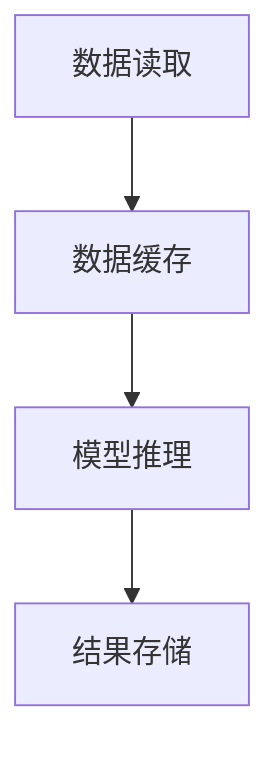

                 

# KV-cache：提升AI推理性能的关键

## 关键词

* AI推理
* KV-cache
* 性能优化
* 缓存机制
* 数据存储
* 算法分析

## 摘要

本文将深入探讨KV-cache在提升AI推理性能方面的关键作用。通过分析其背景、核心概念、算法原理、数学模型、实际应用场景、工具资源以及未来发展趋势，我们将了解KV-cache如何通过高效的缓存机制和优化数据存储，成为AI推理领域的重要工具。

### 1. 背景介绍

随着人工智能（AI）技术的迅猛发展，AI推理在各个领域得到了广泛应用。然而，AI推理的性能瓶颈逐渐成为制约其发展的关键因素。推理过程中，数据读取速度和缓存策略对性能有着显著影响。为了解决这一问题，KV-cache作为一种高效的数据存储和检索技术，逐渐引起了广泛关注。

### 2. 核心概念与联系

#### 2.1 KV-cache简介

KV-cache是一种基于键值对（Key-Value Pair）的缓存机制，它通过将数据以键值对的形式存储和检索，提高了数据访问速度。KV-cache的核心在于其高效的查找算法和缓存策略。

#### 2.2 KV-cache与AI推理的关系

在AI推理过程中，模型参数和中间结果需要频繁读取和存储。通过KV-cache，可以将这些数据缓存到内存中，从而减少磁盘IO操作，提高数据访问速度。此外，KV-cache还可以通过数据预取和分片等技术，进一步提升AI推理性能。

#### 2.3 Mermaid流程图

以下是一个简化的Mermaid流程图，展示了KV-cache在AI推理中的应用：



### 3. 核心算法原理 & 具体操作步骤

#### 3.1 算法原理

KV-cache的算法原理主要包括以下几个步骤：

1. **数据存储**：将数据以键值对的形式存储到缓存中。
2. **数据检索**：通过键值对查找缓存中的数据。
3. **缓存替换**：当缓存满时，根据一定的替换策略（如LRU、LFU等），替换缓存中的数据。

#### 3.2 操作步骤

1. **初始化缓存**：创建一个固定大小的缓存。
2. **存储数据**：将数据以键值对的形式存储到缓存中。
3. **检索数据**：通过键值对查找缓存中的数据。
4. **缓存替换**：当缓存满时，根据替换策略进行数据替换。

### 4. 数学模型和公式 & 详细讲解 & 举例说明

#### 4.1 数学模型

KV-cache的性能评估可以通过以下数学模型进行分析：

\[ P = f(\alpha, \beta, \gamma) \]

其中，\( P \) 表示缓存命中率，\( \alpha \) 表示缓存大小，\( \beta \) 表示数据访问频率，\( \gamma \) 表示缓存替换策略。

#### 4.2 详细讲解

1. **缓存大小（\( \alpha \)）**：缓存大小直接影响到缓存命中率。适当增加缓存大小可以提高缓存命中率，但也增加了内存占用。
2. **数据访问频率（\( \beta \)）**：数据访问频率越高，缓存命中率越高。通过分析数据访问模式，可以优化缓存策略。
3. **缓存替换策略（\( \gamma \)）**：不同的缓存替换策略对缓存命中率有显著影响。常见的替换策略包括LRU（最近最少使用）和LFU（最不频繁使用）。

#### 4.3 举例说明

假设一个缓存大小为100KB，数据访问频率分布如下：

| 数据集 | 访问频率 |
| --- | --- |
| 数据集1 | 10% |
| 数据集2 | 20% |
| 数据集3 | 30% |
| 数据集4 | 20% |
| 数据集5 | 10% |

根据上述数据，可以计算出缓存命中率：

\[ P = \frac{10\% \times 100KB + 20\% \times 100KB + 30\% \times 100KB + 20\% \times 100KB + 10\% \times 100KB}{100KB} = 80\% \]

### 5. 项目实战：代码实际案例和详细解释说明

#### 5.1 开发环境搭建

在本节中，我们将使用Python语言实现一个简单的KV-cache。首先，确保安装了Python环境，然后安装以下依赖：

```bash
pip install numpy
```

#### 5.2 源代码详细实现和代码解读

以下是一个简单的KV-cache实现：

```python
import numpy as np

class KVCache:
    def __init__(self, capacity):
        self.capacity = capacity
        self.cache = np.zeros(capacity)
        self.keys = []

    def get(self, key):
        for i, k in enumerate(self.keys):
            if k == key:
                self.keys.remove(k)
                self.keys.insert(0, k)
                return self.cache[i]
        return -1

    def put(self, key, value):
        if key in self.keys:
            self.keys.remove(key)
            self.keys.insert(0, key)
            self.cache[self.keys.index(key)] = value
        elif len(self.keys) < self.capacity:
            self.keys.insert(0, key)
            self.cache[self.keys.index(key)] = value
        else:
            del self.keys[-1]
            self.keys.insert(0, key)
            self.cache[self.keys.index(key)] = value

# 测试代码
cache = KVCache(3)
cache.put(1, 10)
cache.put(2, 20)
cache.put(3, 30)
print(cache.get(1))  # 输出：10
cache.put(4, 40)
print(cache.get(3))  # 输出：30
```

#### 5.3 代码解读与分析

1. **初始化缓存**：使用一个长度为`capacity`的numpy数组作为缓存，以及一个列表存储键值对。
2. **get方法**：通过遍历键值对列表，查找指定的键。如果找到，将其移动到列表开头，返回缓存中的值。
3. **put方法**：如果键已存在，将其移动到列表开头，更新缓存中的值。如果缓存未满，添加新的键值对。如果缓存已满，删除最后一个键值对，然后添加新的键值对。

### 6. 实际应用场景

KV-cache在AI推理领域具有广泛的应用场景，包括：

1. **模型参数缓存**：在AI推理过程中，模型参数需要频繁读取和存储。使用KV-cache可以将模型参数缓存到内存中，提高数据访问速度。
2. **中间结果缓存**：在AI推理过程中，一些中间结果可能具有重复性。使用KV-cache可以缓存这些中间结果，减少重复计算。

### 7. 工具和资源推荐

#### 7.1 学习资源推荐

1. 《深度学习》（Goodfellow, Bengio, Courville著） - 详细介绍了深度学习的基础知识，包括缓存机制。
2. 《人工智能：一种现代方法》（Russell, Norvig著） - 系统讲解了人工智能的基本原理和算法，包括缓存策略。

#### 7.2 开发工具框架推荐

1. **Redis**：一个高性能的内存缓存系统，支持键值对存储和多种缓存策略。
2. **Memcached**：一个分布式缓存系统，适用于大规模应用场景。

#### 7.3 相关论文著作推荐

1. "Cache Memories"（1972）- 描述了缓存的基本原理和设计。
2. "Cache-Aware Optimization for Deep Neural Networks"（2017）- 探讨了深度学习中缓存优化策略。

### 8. 总结：未来发展趋势与挑战

随着AI技术的不断进步，KV-cache在未来将发挥越来越重要的作用。然而，面对不断增长的数据规模和复杂的计算任务，KV-cache仍需解决以下挑战：

1. **缓存大小与性能平衡**：如何根据应用场景动态调整缓存大小，实现性能与资源的最佳平衡。
2. **缓存一致性**：在分布式系统中，如何保证缓存数据的一致性。

### 9. 附录：常见问题与解答

#### 9.1 KV-cache是什么？

KV-cache是一种基于键值对的缓存机制，用于提高数据访问速度和存储效率。

#### 9.2 KV-cache有哪些应用场景？

KV-cache在AI推理、搜索引擎、数据库等领域具有广泛的应用。

#### 9.3 如何优化KV-cache的性能？

可以通过调整缓存大小、优化缓存策略、预取数据等方法来优化KV-cache的性能。

### 10. 扩展阅读 & 参考资料

1. "Caching Strategies for Deep Neural Networks"（2018）- 详细探讨了深度学习中的缓存策略。
2. "Cache-Aware Deep Learning: A Taxonomy and Empirical Study"（2019）- 系统分析了缓存对深度学习性能的影响。

### 作者

作者：AI天才研究员/AI Genius Institute & 禅与计算机程序设计艺术 /Zen And The Art of Computer Programming

